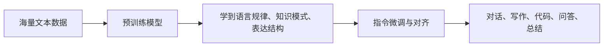
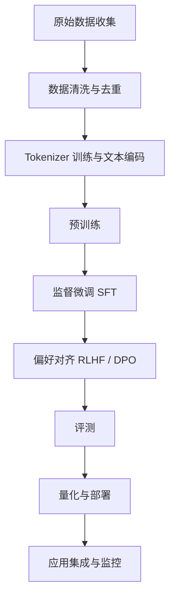

# 01 认识 LLM

## 本章目标

这一章解决三个最基础的问题：

- LLM（Large Language Model，大语言模型）到底是什么。
- 它为什么突然变得这么强。
- 它的能力边界、工作流程和常见误解是什么。

如果你之前只在新闻、短视频或产品介绍里接触过“大模型”，这一章的任务就是先把整体地图展开。

## 背景动机

在没有 LLM 之前，很多自然语言处理任务都需要单独建模。翻译有翻译模型，分类有分类模型，问答有问答模型，摘要也有自己的模型。后来研究者发现，如果先训练一个足够大的通用语言模型，再通过少量提示或少量微调让它适应任务，那么同一个模型就可以覆盖很多场景。

从工程角度看，LLM 的价值在于：

- 它把很多任务统一成了“给文本，出文本”。
- 它减少了为每个任务单独做特征工程的成本。
- 它让“自然语言”本身成为了一种通用接口。

## 什么是 LLM

LLM（大语言模型）本质上还是语言模型（Language Model，预测文本序列概率的模型）。它最朴素的目标是：

> 给定前面的内容，预测下一个 token（模型处理的最小文本单位）最有可能是什么。

从数学上，语言模型学习的是一个条件概率：

$$
P(x_1, x_2, \dots, x_n) = \prod_{t=1}^{n} P(x_t \mid x_1, x_2, \dots, x_{t-1})
$$

### 这个公式在算什么

它表示“一整段文本出现的概率”，可以拆成一连串“在前文已知时，下一个 token 出现的概率”相乘。

### 符号解释

- $x_t$：第 $t$ 个 token。
- $n$：序列长度。
- $P(x_t \mid x_1, \dots, x_{t-1})$：在前面 token 都知道的情况下，第 $t$ 个 token 出现的条件概率。

### 维度变化 

这个公式本身描述概率分解，不直接体现张量维度。真正进入模型后，输入会是形如 `batch_size x seq_len` 的 token id 张量，输出会是 `batch_size x seq_len x vocab_size` 的 logits（未归一化分数）。

### 最小例子

句子“我 爱 学习”可以拆成：

$$
P(\text{我}, \text{爱}, \text{学习}) = P(\text{我}) P(\text{爱}\mid \text{我}) P(\text{学习}\mid \text{我}, \text{爱})
$$

所以语言模型最核心的事情，就是把“上下文和下一个 token 的关系”学出来。

## LLM 为什么强

LLM 的强大并不是来自某一个单点技术，而是几件事情叠加：

1. 更大的模型参数量。
2. 更大的训练数据。
3. Transformer（基于注意力机制处理序列的神经网络架构）带来的并行训练能力。
4. 更强的算力和更成熟的分布式训练系统。
5. 后续的指令微调和对齐，让模型更像“可用的助手”。

可以用一个简单流程理解：

## LLM 的完整生命周期

很多新手会以为“模型”只是一堆权重文件，但真正落地一个 LLM 项目，会经历完整生命周期：

这条链路里每一步都可能决定最终效果。比如：

- 分词器设计会影响模型看到文本的方式。
- 训练数据质量会影响模型知识和表达风格。
- 推理参数会影响输出稳定性和创造性。
- 部署方案会影响延迟、吞吐和硬件成本。

## LLM 能做什么

LLM 擅长的事情，通常可以被看作“理解文本上下文后，生成或变换文本”：

- 问答和对话
- 摘要和改写
- 翻译
- 分类和抽取
- 代码补全与生成
- 文档分析
- Agent（代理，让模型通过工具完成复杂任务）式工作流中的语言决策

但要注意，LLM 并不是“有意识地理解世界”，它更像是在高维统计空间里学到了大量语言模式。

## LLM 不能自动做到什么

LLM 容易被误解的点很多。下面是最重要的几个：

### 它不是数据库

模型参数里存的是压缩后的统计规律和模式，不是一个可以精确查询的结构化知识库。所以它可能知道一个概念的大致轮廓，但不一定能百分之百准确复述冷门事实。

### 它不是逻辑引擎

LLM 可以表现出推理能力，但很多时候是“近似的模式推理”。一旦题目偏离训练分布，或者链条过长，它就会出错。

### 它不是总会说真话

Hallucination（幻觉，模型自信地生成看起来合理但并不真实的内容）是 LLM 的典型问题。因为模型优化的是“下一个 token 的合理性”，不是“事实一定正确”。

### 它不是不需要工程

真正可用的产品不等于“把模型接上聊天框”。你还需要数据治理、评测、检索、缓存、监控、权限、安全和部署体系。

## 一个最小工作例子

假设用户输入：

> 请把这段会议纪要总结成三条重点。

系统内部大致会发生下面的事：

1. 文本被 tokenizer 切成 token。
2. token id 被 embedding（嵌入，把离散 token 映射成连续向量）层变成向量。
3. 向量经过多层 Transformer。
4. 模型在每一步输出下一个 token 的概率分布。
5. 解码器根据采样策略逐步生成总结文本。

## 为什么“只会调用 API”不等于懂 LLM

因为 API 调用只让你接触最外层接口，但真正决定效果的很多事情都藏在内部：

- tokenizer 如何切词
- 上下文窗口为什么有限
- 温度参数为什么会影响随机性
- 模型为什么会忘记前文
- 量化为什么会影响速度和精度
- LoRA 为什么能省显存

不理解这些原理，工程上很难定位问题，也很难在面试中说清楚。

## 常见误区

### 误区 1：参数越大一定越好

不是。模型效果取决于参数、数据、训练策略和推理配置的共同作用。更大的模型通常更强，但也更贵、更慢、更难部署。

### 误区 2：会聊天就等于会推理

不是。流畅表达和严格推理不是一回事。模型可能“说得很像那么回事”，但链式逻辑仍然错误。

### 误区 3：模型学到的就是事实

不是。模型学到的是概率分布和模式压缩，不是可靠事实存储。

### 误区 4：LLM 项目只需要模型工程师

不是。一个成熟项目通常还需要数据工程、后端工程、评测体系、产品设计和运维能力。

## 面试可复述版

你可以这样简洁回答“什么是 LLM”：

1. LLM 本质上是大规模语言模型，核心训练目标通常是预测下一个 token。
2. 它之所以强，是因为 Transformer 架构、海量数据、大参数规模和后续对齐流程共同作用。
3. 它把很多任务统一成了文本到文本的问题，所以泛化能力很强。
4. 但它不是数据库，也不是严格逻辑引擎，会出现幻觉和推理错误。
5. 真正的 LLM 系统包含分词、预训练、微调、对齐、评测和部署，不只是一个权重文件。
6. 如果从工程角度看，Prompt、RAG、微调、量化和服务化都属于完整落地链条的一部分。

## 本章练习

1. 用自己的话解释“为什么预测下一个 token 也能带来问答、摘要和翻译能力”。
2. 试着画出“用户输入到模型输出”的最小处理流程。
3. 思考一个问题：如果模型只是在预测下一个 token，为什么它还能写代码？
4. 用一句话区分“模型参数中的知识”和“数据库中的知识”。

## 参考资料

- [Attention Is All You Need](https://arxiv.org/abs/1706.03762)
- [Language Models are Few-Shot Learners](https://arxiv.org/abs/2005.14165)
- [Transformers 官方文档 Quicktour](https://huggingface.co/docs/transformers/en/quicktour)
