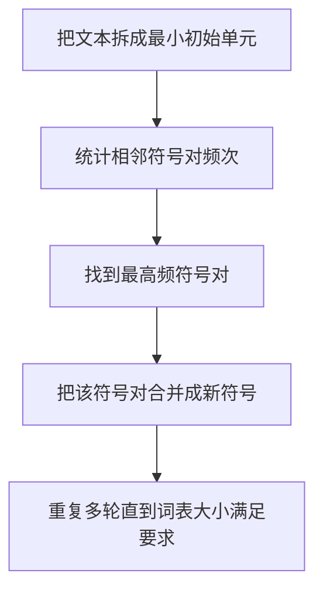

# 03 文本表示与分词器

## 本章目标

这一章回答一个非常关键的问题：文本为什么不能直接送进模型，而必须经过 tokenizer（分词器，把文本切成模型可处理 token 的模块）和 embedding（嵌入，把离散符号映射成连续向量的方法）？

读完后你应该能理解：

- 字符、词、子词、token 的区别
- 词表（vocabulary，模型允许使用的 token 集合）是什么
- one-hot、embedding 和 token id 的关系
- BPE、WordPiece、SentencePiece 为什么会出现
- 分词器会怎样影响模型效果和工程部署

## 背景动机

模型本质上只能处理数字，不能直接处理“自然语言字符串”。所以需要一条桥梁：

如果这条桥梁设计得不好，后面的模型再强也会吃亏。

## 1. 从文本到数字

假设输入句子是：

> 我喜欢机器学习

模型不能直接理解这串字符，所以我们需要把它拆成某种最小单元，再给每个单元一个整数编号。

### 三种常见切分粒度

- 字符级（character-level，以单个字符为单位）
- 词级（word-level，以完整单词或词语为单位）
- 子词级（subword-level，介于字符和词之间的单元）

## 2. 什么是 token

Token（模型处理的最小文本单位）不一定等于“字”，也不一定等于“词”。它只是 tokenizer 选出来的处理单元。

例如同一句话，在不同 tokenizer 下可能切成：

- 字符级：`我 / 喜 / 欢 / 机 / 器 / 学 / 习`
- 词级：`我 / 喜欢 / 机器学习`
- 子词级：`我 / 喜欢 / 机器 / 学习`

对英文也是一样：

- `unbelievable`
- 可能被切成 `un / believe / able`

这就是子词分词的典型思路。

## 3. 词表是什么

词表（vocabulary，模型能识别的全部 token 集合）本质上是一个映射表：

| token | id |
| --- | --- |
| `<pad>` | 0 |
| `<bos>` | 1 |
| `<eos>` | 2 |
| 我 | 3 |
| 喜欢 | 4 |
| 机器 | 5 |
| 学习 | 6 |

当 tokenizer 把文本切成 token 后，会进一步映射成整数 id。例如：

`我 喜欢 机器 学习` -> `[3, 4, 5, 6]`

## 4. One-hot 和 embedding

### One-hot

One-hot（只有一个位置为 1，其余位置为 0 的稀疏表示）可以把 token id 转成一个与词表等长的向量。

如果词表大小是 7，token `喜欢` 的 id 是 4，那么它的 one-hot 向量可能是：

$$
[0, 0, 0, 0, 1, 0, 0]
$$

### 为什么 one-hot 不够好

- 维度太高，浪费空间。
- 不表达语义相似性。
- 随着词表变大，计算很低效。

### embedding 如何改进

Embedding 会把 token 映射成一个低维稠密向量：

$$
e_i = E[x_i]
$$

这里的含义是：从 embedding 矩阵 $E$ 里取出第 $x_i$ 行作为 token 的表示。

### 维度变化

- 输入：一个 token id，标量整数。
- 输出：一个长度为 $d_{model}$ 的向量。
- 序列输入：`seq_len` 个 token id。
- 序列输出：`seq_len x d_model` 的向量矩阵。

## 5. 为什么不能只用词级分词

词级分词直观，但有几个致命问题：

- 未登录词（out-of-vocabulary，训练词表里没见过的新词）太多。
- 词表会非常大。
- 对中文、代码、拼写变化、专有名词不够鲁棒。

例如新词“多模态检索增强”可能不在词表里，但如果用子词或字符级方式，模型仍然可以分解处理。

## 6. 为什么不能只用字符级分词

字符级分词的优点是几乎没有未登录词问题，但也有代价：

- 序列会很长。
- 语义组合需要模型学得更多。
- 对英文等语言，单字符信息太弱。

所以工程上通常会在“词太大”和“字符太细”之间找平衡，这就催生了子词分词。

## 7. 子词分词的核心思想

子词（subword，位于字符和词之间的文本单元）分词的核心思想是：

- 高频片段作为整体保留，提高效率。
- 低频词拆成更小片段，减少未登录词。

这样既能控制词表大小，又能兼顾表达能力。

## 8. BPE 是怎么工作的

BPE（Byte Pair Encoding，字节对编码，一种逐步合并高频相邻符号的分词方法）本来来自数据压缩，后来被用于 NLP。

它的大致流程是：

### 一个最小例子

假设训练语料中经常出现：

- `l o w`
- `l o w e r`
- `n e w`
- `w i d e s t`

最开始每个字符都是独立符号。统计后可能发现 `l` 和 `o` 经常相邻，就合成 `lo`；然后 `lo` 和 `w` 经常相邻，再合成 `low`。经过不断合并，就能学出常见子词。

## 9. WordPiece 和 SentencePiece

### WordPiece

WordPiece（一种通过最大化语言模型收益来选择子词的分词方法）常见于 BERT 系列。它和 BPE 很像，但合并策略更关注整体建模收益，而不只是原始频次。

### SentencePiece

SentencePiece（谷歌提出的语言无关子词分词工具）强调：

- 不依赖空格预切词
- 可以直接从原始文本训练
- 更适合多语言和无空格语言

它常见于很多现代 LLM 和多语言模型。

## 10. 特殊 token

实际模型里通常还会加入一些特殊 token：

- `<bos>`：序列开始
- `<eos>`：序列结束
- `<pad>`：补齐长度
- `<unk>`：未知 token
- 指令模型里还可能有系统、用户、助手等角色标记

这些 token 不是“语言内容本身”，而是帮助模型理解结构。

## 11. 分词器为什么会影响模型效果

很多人把 tokenizer 看成“前处理小工具”，其实它会深刻影响模型：

### 影响序列长度

同一句话，如果被切得很碎，序列就更长，计算成本就更高。

### 影响知识表达

专有名词、代码片段、表格符号、中文词语，如果切分不合理，模型更难学到稳定表示。

### 影响迁移能力

如果 tokenizer 与训练数据类型不匹配，模型在下游任务上会更难适应。

## 12. 一个最小编码例子

假设词表如下：

| token | id |
| --- | --- |
| `<bos>` | 0 |
| `<eos>` | 1 |
| 我 | 2 |
| 喜欢 | 3 |
| 机器 | 4 |
| 学习 | 5 |

句子：

> 我喜欢机器学习

编码后可能得到：

$$
[0, 2, 3, 4, 5, 1]
$$

其中开头的 `0` 是开始标记，结尾的 `1` 是结束标记。

## 13. 工程上的几个直接影响

- 词表越大，embedding 矩阵越大。
- token 越碎，推理时序列越长，注意力计算越贵。
- 分词器和模型权重必须配套，否则会“看错字”。
- 更换 tokenizer 通常意味着需要重新训练或至少重新适配模型。

## 常见误区

### 误区 1：token 就是单词

不是。token 是 tokenizer 决定的处理单元，可能是字、词、子词甚至字节片段。

### 误区 2：tokenizer 只是预处理，影响不大

不是。它直接决定模型看到什么输入表示。

### 误区 3：词表越大越好

不是。词表太大会让 embedding 和输出层更重，也不一定带来更好的效果。

## 面试可复述版

1. 模型不能直接处理原始文本，所以需要 tokenizer 把文本切成 token，再映射成 id。
2. token 不等于单词，它可能是字符、词或子词。
3. one-hot 可以表示 token，但太稀疏、太高维，所以通常用 embedding。
4. 词级分词会遇到未登录词问题，字符级分词又会导致序列过长，因此主流方案是子词分词。
5. BPE、WordPiece、SentencePiece 都是在“词表大小、序列长度、语义表达”之间做平衡。
6. tokenizer 会影响序列长度、模型参数量、训练效果和部署成本，所以它不是小细节。

## 本章练习

1. 自己举一个英文复合词，尝试分别用字符级、词级、子词级去切。
2. 思考为什么代码模型往往需要特别设计 tokenizer。
3. 假设词表大小翻倍，embedding 矩阵和输出层参数会发生什么变化。
4. 用自己的话解释“为什么子词分词通常比纯词级或纯字符级更实用”。

## 参考资料

- [SentencePiece](https://arxiv.org/abs/1808.06226)
- [Neural Machine Translation of Rare Words with Subword Units](https://arxiv.org/abs/1508.07909)
- [Hugging Face Tokenizers Quicktour](https://huggingface.co/docs/tokenizers/main/en/quicktour)
