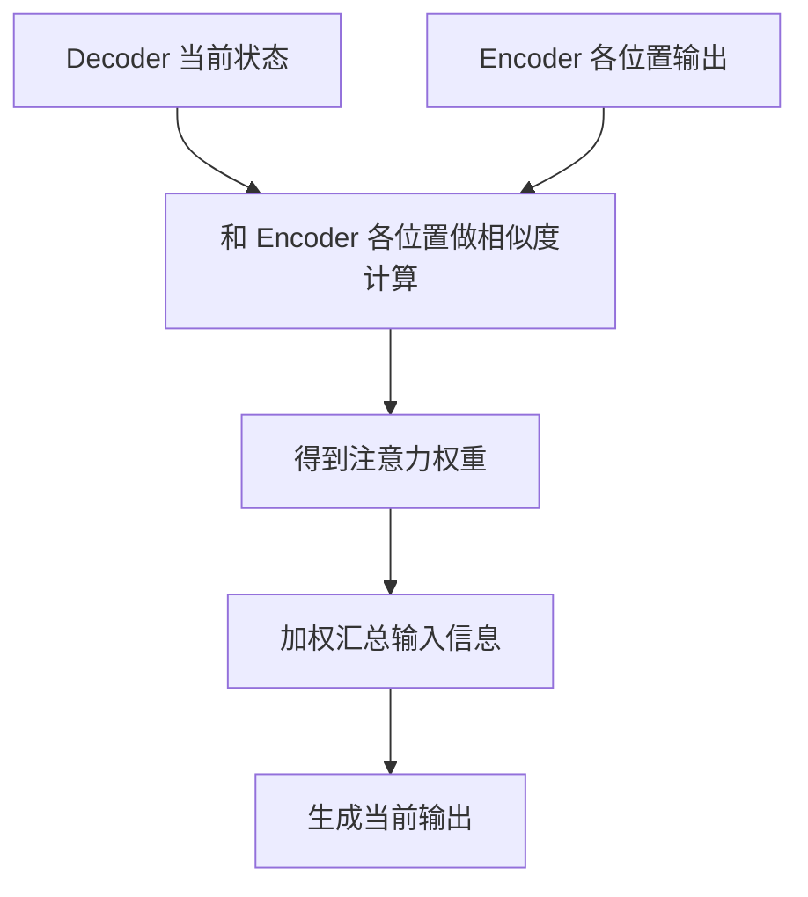

# 04 从 N-gram 到 RNN 再到 Attention

## 本章目标

这一章要解决的问题是：为什么语言模型最后会演化到 Transformer（基于注意力机制处理序列的神经网络架构）？

为了回答这个问题，我们会依次看：

- N-gram（基于固定长度上下文统计下一个词概率的模型）
- RNN（循环神经网络，按顺序处理序列的网络）
- LSTM 和 GRU（带门控机制的 RNN 变种）
- Seq2Seq（序列到序列的编码解码框架）
- Attention（注意力机制，动态选择应关注信息的机制）

## 整体演化图

## 1. N-gram：最早期的统计语言模型

N-gram（用前 $N-1$ 个词预测下一个词的统计模型）最直接的思想是：

$$
P(x_t \mid x_1, \dots, x_{t-1}) \approx P(x_t \mid x_{t-N+1}, \dots, x_{t-1})
$$

### 这个公式在算什么

它用一个近似假设说：“预测当前词时，不看所有历史，只看最近的 $N-1$ 个词。”

### 符号解释

- $x_t$：当前要预测的词或 token。
- $N$：窗口大小。
- $x_{t-N+1}, \dots, x_{t-1}$：最近的上下文。

### 维度如何变化

N-gram 本质是统计模型，不强调向量维度。它常常以计数表和条件概率表存在。

### 最小例子

在 bigram（2-gram）里：

$$
P(\text{学习} \mid \text{机器})
$$

表示在看到“机器”后，下一个词是“学习”的概率。

### N-gram 的问题

- 只能看固定窗口，长距离依赖捕捉不到。
- 数据稀疏问题严重。
- 词表一大，组合爆炸。

## 2. RNN：让模型拥有“记忆”

RNN（Recurrent Neural Network，循环神经网络）引入了隐藏状态（hidden state，压缩过去信息的中间表示），让模型能够按顺序处理序列：

$$
h_t = f(W_x x_t + W_h h_{t-1} + b)
$$

### 这个公式在算什么

当前隐藏状态 $h_t$ 由当前输入 $x_t$ 和上一时刻隐藏状态 $h_{t-1}$ 共同决定。

### 符号解释

- $x_t$：当前输入向量。
- $h_{t-1}$：上一个时间步的隐藏状态。
- $W_x, W_h$：可学习权重。
- $b$：偏置。
- $f$：激活函数。

### 维度如何变化

如果 $x_t \in \mathbb{R}^{d_x}$，$h_t \in \mathbb{R}^{d_h}$，则：

- $W_x \in \mathbb{R}^{d_h \times d_x}$
- $W_h \in \mathbb{R}^{d_h \times d_h}$

输出 $h_t$ 仍然是 $d_h$ 维。

### 最小例子

输入一句话时，RNN 会一个词一个词读进去，每读一个词就更新一次隐藏状态，相当于不断更新“目前为止我记住了什么”。

### RNN 的进步

- 不再局限于固定窗口。
- 可以通过隐藏状态携带历史信息。
- 更适合处理序列。

### RNN 的问题

- 训练难并行，因为必须一步一步算。
- 长距离依赖仍然难学。
- 容易出现梯度消失（梯度在长链传播中越来越小）或梯度爆炸（梯度越来越大）。

## 3. LSTM 和 GRU：给 RNN 加门

为了解决普通 RNN 的长期依赖问题，研究者提出了门控结构。

### LSTM

LSTM（Long Short-Term Memory，长短期记忆网络）通过输入门、遗忘门、输出门来控制信息保留和丢弃。

它的思想可以简单理解为：

- 什么该写入记忆
- 什么该忘掉
- 什么该输出

### GRU

GRU（Gated Recurrent Unit，门控循环单元）是更简化的门控 RNN，结构比 LSTM 更轻，但也能缓解长期依赖问题。

### 它们的改善

- 更容易保留长期信息
- 比普通 RNN 更稳定

### 但仍然有问题

- 本质上还是串行计算
- 序列很长时训练和推理都慢
- 对非常长上下文仍然吃力

## 4. Seq2Seq：编码器和解码器分工

Seq2Seq（Sequence-to-Sequence，序列到序列框架）通常包含：

- Encoder（编码器，把输入序列压缩成表示）
- Decoder（解码器，根据表示生成输出序列）

这类结构特别适合翻译、摘要等“输入一段文本，输出另一段文本”的任务。

### 早期 Seq2Seq 的问题

如果编码器把整段输入都压缩到一个固定长度向量里，那么长句子信息会被挤压，越长越容易丢信息。

## 5. Attention：不要只看一个压缩向量

Attention（注意力机制，动态决定该关注哪些输入位置）就是为了缓解这个问题。

核心思想是：

- 解码当前词时，不必只依赖一个固定向量
- 可以回头看输入序列的不同位置
- 对不同位置分配不同权重

### 为什么是关键突破

它让模型不再必须“把所有信息压缩成一个定长向量”，而是可以按需访问整个输入序列。

## 6. 为什么最终走向 Transformer

Transformer 做了一件非常激进但有效的事：

> 既然 Attention 这么有用，那就干脆把序列建模的核心全部建立在 Attention 上，而不是把它当作 RNN 的辅助模块。

这样带来了两大优势：

### 优势 1：更容易并行

RNN 必须按时间步串行处理，Transformer 可以在训练时同时处理整个序列中的多个位置。

### 优势 2：更容易看长距离关系

在自注意力里，一个位置可以直接和所有位置建立联系，不需要像 RNN 那样通过很多时间步传递信息。

## 7. 一个直觉例子

看这句话：

> 小王把书放在桌子上，因为它太重了。

如果模型要理解“它”指代什么，可能需要关注前面“书”而不是“桌子”。这类跨距离依赖，对固定窗口模型和普通 RNN 都不容易，但注意力机制可以直接给“书”更高权重。

## 8. 历史脉络总结

可以把演化过程理解成一条很清楚的路线：

- N-gram：只能看有限窗口，太死板。
- RNN：开始有了“顺序记忆”。
- LSTM/GRU：记忆更稳定。
- Seq2Seq：能做输入序列到输出序列的任务。
- Attention：让模型按需关注关键信息。
- Transformer：把注意力变成主角，彻底提升了长依赖建模和并行训练能力。

## 常见误区

### 误区 1：Transformer 一出现就完全取代了所有历史方法

不是。历史方法是理解 Transformer 为什么成立的基础，而且在某些小场景或资源受限场景仍有价值。

### 误区 2：RNN 完全不能处理长文本

不是“完全不能”，而是相对更难、更慢，效果通常不如现代注意力架构。

### 误区 3：Attention 只用于翻译

不是。它最早在序列到序列任务中显著发光，但后来已经成为通用建模机制。

## 面试可复述版

1. N-gram 用固定长度窗口建模上下文，简单但无法处理长距离依赖。
2. RNN 通过隐藏状态引入了顺序记忆，但训练难并行，而且长距离依赖容易丢失。
3. LSTM 和 GRU 用门控机制缓解了长期依赖问题，但依旧保留了串行结构。
4. Seq2Seq 让模型可以做输入到输出序列转换，但早期版本会把全部输入压缩成一个向量，信息瓶颈明显。
5. Attention 允许模型在生成当前输出时动态查看输入不同位置，从而缓解信息压缩问题。
6. Transformer 进一步把 Attention 变成核心结构，实现更强的长依赖建模和并行训练能力，这就是它成为现代 LLM 基础的原因。

## 本章练习

1. 用一句话比较 N-gram 和 RNN 的本质区别。
2. 思考为什么 RNN 无法像 Transformer 那样高效并行训练。
3. 用自己的话解释“Seq2Seq 中为什么固定长度上下文向量会成为瓶颈”。
4. 找一句包含远距离指代的中文句子，说明为什么它适合用注意力机制理解。

## 参考资料

- [Attention Is All You Need](https://arxiv.org/abs/1706.03762)
- [BERT](https://arxiv.org/abs/1810.04805)
