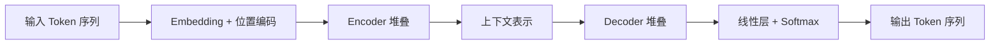
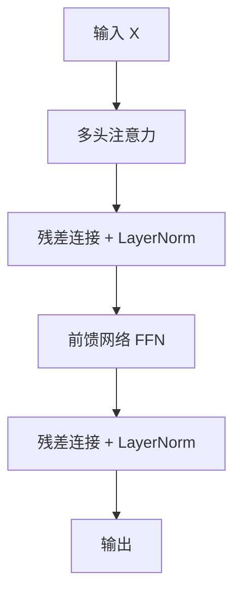
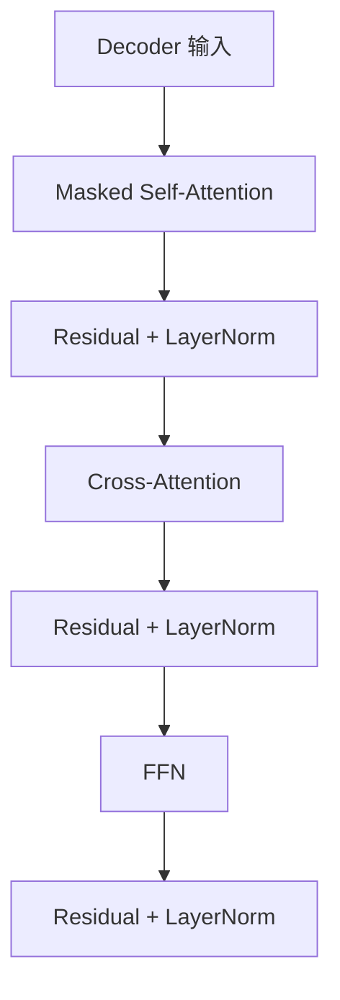
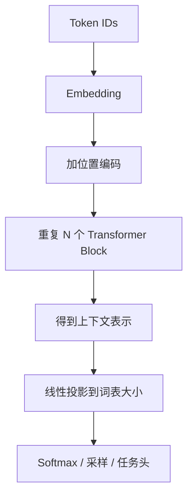

# 05 Transformer 总览

## 本章目标

这一章的目标不是把所有公式一下子塞给你，而是先把 Transformer（基于注意力机制处理序列的神经网络架构）的整体数据流讲明白。读完后你应该知道：

- Encoder（编码器）和 Decoder（解码器）的职责
- Self-Attention（自注意力，序列内部各位置相互关注的机制）为什么是核心
- Multi-Head Attention（多头注意力，把注意力分成多个子空间并行学习）为什么有用
- Feed-Forward Network（前馈网络，逐位置处理的多层感知机）在做什么
- Residual Connection（残差连接，把输入直接加回输出的结构）和 LayerNorm（层归一化，对特征维做归一化）为什么能稳定训练

## 1. Transformer 想解决什么问题

上一章我们看到，RNN（循环神经网络）虽然能按顺序处理序列，但难并行，也难处理长距离依赖。Transformer 的关键思路是：

> 不再依赖时间步串行传递信息，而是让每个位置直接看到整段序列里它该看的位置。

这带来了两个直接结果：

- 训练可以更并行
- 长距离依赖更容易建模

## 2. Transformer 的两种典型形态

最经典的原始 Transformer 由编码器和解码器组成：

但现代大语言模型更常见的是 Decoder-only（只保留解码器）结构，比如 GPT（Generative Pre-trained Transformer，生成式预训练 Transformer）和 LLaMA。

## 3. 输入是怎么进来的

输入文本进入 Transformer 前，通常会经历：

1. tokenizer 编码成 token id
2. embedding 映射成向量
3. 加上位置编码，让模型知道顺序

### 输入表示公式

$$
X = E + P
$$

### 这个公式在算什么

它表示最终送入 Transformer 的输入向量，是 token embedding $E$ 和 position encoding（位置编码）$P$ 的逐元素相加结果。

### 符号解释

- $E \in \mathbb{R}^{n \times d_{model}}$：token 的 embedding 矩阵。
- $P \in \mathbb{R}^{n \times d_{model}}$：位置编码矩阵。
- $X \in \mathbb{R}^{n \times d_{model}}$：最终输入表示。

### 维度如何变化

输入 token 序列长度是 $n$，每个位置的表示维度是 $d_{model}$，相加后维度不变，仍然是 `n x d_model`。

### 最小例子

如果一句话被编码成 4 个 token，每个 token 向量维度是 8，那么输入张量大小就是 `4 x 8`。位置编码大小也必须是 `4 x 8`，才能逐位置相加。

## 4. Self-Attention 是什么

Self-Attention（自注意力）可以理解成一句话中的每个位置都在问：

> “为了更新我自己，我应该从这句话里的哪些位置拿信息？拿多少？”

举个简单例子：

> 小明喜欢篮球，因为他每天都练习。

模型在理解“他”时，可能需要重点看“小明”。自注意力就是让当前位置“他”对前面的“小明”分配更高权重。

## 5. 一个 Transformer Block 里有什么

无论是编码器块还是解码器块，核心组件大致都是：

### 多头注意力

负责让每个位置聚合其他位置的信息。

### 前馈网络

负责对每个位置自己的表示做进一步非线性变换。

### 残差连接

负责让原始信息能更容易传递到深层，并缓解梯度问题。

### 层归一化

负责稳定训练，避免数值分布漂移太厉害。

## 6. Encoder 和 Decoder 的区别

### Encoder

Encoder（编码器）通常看到完整输入序列，可以双向关注所有位置，所以更适合理解任务，例如分类、抽取、编码。

### Decoder

Decoder（解码器）在生成任务里需要遵守因果约束（causal constraint，只能看当前位置之前的内容），所以会用 causal mask（因果掩码，阻止看未来 token 的掩码）。

### 原始 Transformer 中的 Decoder

原始论文中的 Decoder 有三层子结构：

1. Masked Self-Attention（带因果掩码的自注意力）
2. Cross-Attention（交叉注意力，解码器看编码器输出）
3. Feed-Forward Network

## 7. 为什么是多头注意力

如果只有一个注意力头（head，独立的一组注意力投影与计算通道），模型只能在一个表示子空间里学习关系。多头注意力允许模型：

- 一个头关注语法关系
- 一个头关注实体关系
- 一个头关注长距离依赖
- 一个头关注局部模式

虽然这只是直觉化描述，但它很好地说明了多头的意义：让模型并行学习多种关系。

## 8. 前馈网络在做什么

很多新手第一次学 Transformer 时容易只盯着 attention，觉得 FFN（前馈网络）像个“附属模块”。其实 FFN 很重要，因为注意力主要负责“从别的位置拿信息”，而 FFN 负责“对当前位置自己的表示做非线性加工”。

常见形式是：

$$
\text{FFN}(x) = W_2 \sigma(W_1 x + b_1) + b_2
$$

### 这个公式在算什么

它先把输入升到更高维，再经过激活函数做非线性变换，再投影回原始维度。

### 符号解释

- $x$：当前位置的输入向量。
- $W_1, W_2$：两层线性映射的权重。
- $b_1, b_2$：偏置。
- $\sigma$：激活函数，比如 GELU。

### 维度如何变化

如果 $x \in \mathbb{R}^{d_{model}}$，中间层常常会扩到 $d_{ff}$，比如 `4 x d_model`，最后再回到 $d_{model}$。

### 最小例子

若 $d_{model} = 256$，则 $d_{ff}$ 常见为 `1024`。也就是每个位置先从 256 维映射到 1024 维，再映射回 256 维。

## 9. 残差连接与层归一化

### 残差连接

残差连接常写成：

$$
y = x + \text{Sublayer}(x)
$$

它的含义是：某个子层的输出不是直接覆盖原输入，而是在原输入基础上做增量修改。

### 层归一化

LayerNorm（层归一化）常写成：

$$
\text{LayerNorm}(x) = \gamma \frac{x - \mu}{\sqrt{\sigma^2 + \epsilon}} + \beta
$$

它会对每个样本的特征维进行标准化，让训练更稳定。

## 10. Transformer 的完整数据流

把前面的部件连起来，Encoder-only、Decoder-only、Encoder-Decoder 只是使用方式不同，但核心流都类似：

## 11. 为什么 Transformer 能成为 LLM 基础

### 原因 1：并行训练

训练时能同时处理整段序列的多个位置，比 RNN 更适合现代硬件。

### 原因 2：长距离依赖更直接

任意两个位置都能通过注意力直接建立联系。

### 原因 3：结构通用性强

同一套基本结构既能做理解，也能做生成，还能扩展到多模态。

## 12. 一个最小的直觉类比

你可以把 Transformer 想成一次多人讨论会：

- 每个 token 是一个与会者
- Query 是“我现在想问什么”
- Key 是“我这里有哪些线索值得被别人检索”
- Value 是“我真正携带的信息”
- 注意力权重是“我此刻应该多听谁”

这个类比不严格，但能帮助你先建立感觉。

## 常见误区

### 误区 1：Attention 就等于 Transformer

不是。Transformer 还包括位置编码、前馈网络、残差连接、层归一化等关键部件。

### 误区 2：Encoder 比 Decoder 高级

不是。它们只是为不同任务设计。Encoder 更偏理解，Decoder 更偏生成。

### 误区 3：多头越多越好

不是。头数、维度和计算成本之间要平衡，头太多未必带来线性收益。

## 面试可复述版

1. Transformer 的核心创新是用自注意力替代 RNN 的顺序传递路径，从而更好地处理长距离依赖并支持并行训练。
2. 输入序列会先经过 tokenizer、embedding 和位置编码，变成 `seq_len x d_model` 的向量矩阵。
3. 一个标准 Transformer Block 通常包括多头注意力、前馈网络、残差连接和层归一化。
4. Encoder 能双向看上下文，更适合理解任务；Decoder 会加因果掩码，更适合生成任务。
5. 多头注意力的意义是让模型在不同表示子空间并行学习不同关系。
6. FFN 不只是附属结构，它负责对每个位置做进一步非线性加工。

## 本章练习

1. 画出一个 Transformer Block 的结构图，并标注每一层的输入输出。
2. 用自己的话解释“为什么位置编码必不可少”。
3. 思考为什么 Decoder 需要 causal mask，而 Encoder 通常不需要。
4. 假设输入长度翻倍，注意力计算代价会发生什么变化。

## 参考资料

- [Attention Is All You Need](https://arxiv.org/abs/1706.03762)
- [Transformers 官方文档 Quicktour](https://huggingface.co/docs/transformers/en/quicktour)
