# 06 Transformer 核心公式详解

## 本章目标

这一章专门做一件事：把 Transformer（基于注意力机制处理序列的神经网络架构）中最关键的公式逐条拆开，而且不只是给公式，还要讲清：

- 这个公式在算什么
- 为什么这样设计
- 符号代表什么
- 张量维度如何变化
- 一个最小例子如何走通

## 1. 从输入表示开始

Transformer 的输入通常是：

$$
X = E + P
$$

### 在算什么

把 token embedding（词向量表示）和 position encoding（位置编码）相加，得到最终输入表示。

### 为什么这么做

Embedding 能表达“这个 token 是什么”，位置编码能表达“这个 token 在第几个位置”。两者结合后，模型才知道“内容 + 顺序”。

### 符号解释

- $E \in \mathbb{R}^{n \times d_{model}}$：token 向量矩阵。
- $P \in \mathbb{R}^{n \times d_{model}}$：位置编码矩阵。
- $X \in \mathbb{R}^{n \times d_{model}}$：最终输入。

### 最小例子

长度为 3 的序列，每个 token 是 4 维向量，那么输入矩阵大小就是 `3 x 4`。

## 2. Q、K、V 从哪里来

注意力机制先把输入映射成三组向量：

$$
Q = XW_Q,\quad K = XW_K,\quad V = XW_V
$$

### 在算什么

用三个不同的线性变换，把同一份输入表示变成 Query（查询）、Key（键）、Value（值）。

### 为什么这么做

这样模型可以把“我要找什么”“我能被怎样匹配”“我真正携带什么信息”分离开，而不是只用一组向量同时承担所有角色。

### 符号解释

- $X \in \mathbb{R}^{n \times d_{model}}$
- $W_Q, W_K \in \mathbb{R}^{d_{model} \times d_k}$
- $W_V \in \mathbb{R}^{d_{model} \times d_v}$
- $Q, K \in \mathbb{R}^{n \times d_k}$
- $V \in \mathbb{R}^{n \times d_v}$

### 最小例子

如果序列长度 $n = 4$，模型维度 $d_{model} = 8$，单头维度 $d_k = d_v = 4$，那么：

- $X$ 是 `4 x 8`
- $W_Q$ 是 `8 x 4`
- $Q$ 是 `4 x 4`

## 3. 相似度分数怎么计算

$$
S = QK^T
$$

### 在算什么

每个 Query 与所有 Key 做点积，得到相似度矩阵 $S$。

### 为什么点积能表示相关性

点积可以粗略反映两个向量的方向一致程度。点积越大，说明 Query 和 Key 越匹配。

### 符号解释

- $Q \in \mathbb{R}^{n \times d_k}$
- $K^T \in \mathbb{R}^{d_k \times n}$
- $S \in \mathbb{R}^{n \times n}$

### 维度如何变化

把 `n x d_k` 乘上 `d_k x n`，得到 `n x n`。这表示“每个位置对每个位置”的匹配分数。

### 最小例子

如果序列长度是 3，那么 $S$ 会是一个 `3 x 3` 矩阵，第 $i,j$ 个元素表示位置 $i$ 对位置 $j$ 的关注原始分数。

## 4. 为什么要除以 $\sqrt{d_k}$

缩放点积注意力（scaled dot-product attention）公式是：

$$
\text{Attention}(Q,K,V) = \text{softmax}\left(\frac{QK^T}{\sqrt{d_k}}\right)V
$$

### 在算什么

先计算 Query 和 Key 的相似度，再除以 $\sqrt{d_k}$ 做缩放，然后用 softmax 变成权重，最后对 Value 加权求和。

### 为什么要缩放

当 $d_k$ 很大时，点积值容易变得很大，softmax 会进入特别陡峭的区域，导致梯度不稳定。除以 $\sqrt{d_k}$ 能让数值更平稳。

### 符号解释

- $QK^T$：相似度分数矩阵
- $\sqrt{d_k}$：缩放因子
- softmax：把每行分数变成权重分布
- $V$：被加权汇总的信息

### 维度如何变化

1. $QK^T$ 得到 `n x n`
2. softmax 后仍然是 `n x n`
3. 再乘 $V \in \mathbb{R}^{n \times d_v}$
4. 输出变成 `n x d_v`

### 最小例子

假设某一行 softmax 后得到权重：

$$
[0.7, 0.2, 0.1]
$$

对应三个 value 向量 $v_1, v_2, v_3$，则输出是：

$$
0.7v_1 + 0.2v_2 + 0.1v_3
$$

这就表示当前 token 主要参考第一个位置的信息。

## 5. 因果掩码为什么必要

在自回归生成（autoregressive generation，按照从左到右顺序逐个生成 token）里，当前位置不能偷看未来 token，所以会加 mask（掩码）：

$$
\text{MaskedAttention}(Q,K,V) = \text{softmax}\left(\frac{QK^T + M}{\sqrt{d_k}}\right)V
$$

其中 $M$ 是一个上三角为负无穷的矩阵。

### 在算什么

把不允许看到的位置加上极小值，这样经过 softmax 后它们的权重接近 0。

### 为什么这样设计

如果训练时让模型看到了未来 token，它就不再是在做真实的“预测下一个 token”，训练目标会被破坏。

### 最小例子

长度为 4 的序列里，第 2 个位置只能看第 1 和第 2 个位置，不能看第 3、4 个位置。

## 6. 多头注意力

多头注意力（Multi-Head Attention）公式常写成：

$$
\text{head}_i = \text{Attention}(Q_i, K_i, V_i)
$$

$$
\text{MultiHead}(Q,K,V) = \text{Concat}(\text{head}_1, \dots, \text{head}_h)W_O
$$

### 在算什么

把输入投影到多个头，每个头单独做注意力，再把结果拼接起来，最后映射回模型维度。

### 为什么这样设计

让模型从多个不同子空间同时学习关系，而不是用单一视角建模。

### 符号解释

- $h$：头数
- $\text{head}_i$：第 $i$ 个头的输出
- `Concat`：按最后一个维度拼接
- $W_O$：输出投影矩阵

### 维度如何变化

如果 $d_{model} = 512$，头数 $h = 8$，常见做法是每个头维度 64。8 个头拼接后又回到 512 维。

## 7. 前馈网络公式

$$
\text{FFN}(x) = W_2 \sigma(W_1 x + b_1) + b_2
$$

### 在算什么

对每个位置单独做两层线性变换和非线性激活。

### 为什么这样设计

注意力负责“跨位置拿信息”，FFN 负责“在当前位置内部重新加工表示”。

### 维度如何变化

- 输入：`n x d_model`
- 中间：`n x d_ff`
- 输出：`n x d_model`

### 最小例子

如果 $d_{model}=256$，$d_{ff}=1024$，那么每个位置会经历 `256 -> 1024 -> 256` 的映射。

## 8. 残差连接和层归一化

一种常见写法是：

$$
H' = \text{LayerNorm}(X + \text{MultiHead}(X))
$$

$$
H = \text{LayerNorm}(H' + \text{FFN}(H'))
$$

### 在算什么

每个子层都采用“子层输出 + 原输入”的残差形式，再做层归一化。

### 为什么这样设计

- 残差让深层网络更容易训练
- LayerNorm 让数值范围更稳定

### 维度如何变化

输入和输出维度保持一致，都是 `n x d_model`，这样才能做逐元素相加。

## 9. 位置编码公式

原始 Transformer 使用正弦余弦位置编码：

$$
PE(pos, 2i) = \sin\left(\frac{pos}{10000^{2i/d_{model}}}\right)
$$

$$
PE(pos, 2i+1) = \cos\left(\frac{pos}{10000^{2i/d_{model}}}\right)
$$

### 在算什么

给每个位置生成一个固定的、与位置相关的向量。

### 为什么这样设计

- 不需要额外学习参数
- 不同维度使用不同频率
- 位置之间的相对关系可以通过这些周期函数表达

### 最小例子

位置 `pos = 0` 时，很多正弦项为 0，余弦项为 1；位置变大后，各维会按不同频率变化。

## 10. 输出层和交叉熵损失

模型最后通常会把隐藏状态投影到词表大小：

$$
z_t = h_t W_{vocab} + b
$$

然后做 softmax 得到概率分布：

$$
\hat{y}_t = \text{softmax}(z_t)
$$

训练时用交叉熵损失：

$$
L_t = -\sum_i y_{t,i}\log \hat{y}_{t,i}
$$

整个序列的平均损失常写为：

$$
L = \frac{1}{n}\sum_{t=1}^{n} L_t
$$

### 在算什么

每个时间步预测“下一个 token 是谁”，再把所有时间步的损失平均。

### 为什么这样设计

因为语言模型的训练目标本来就是对序列中每个位置做下一个 token 预测。

### 维度如何变化

- $h_t \in \mathbb{R}^{d_{model}}$
- $W_{vocab} \in \mathbb{R}^{d_{model} \times V}$
- $z_t \in \mathbb{R}^{V}$

## 11. 用一条链把公式串起来

你可以把 Transformer 的核心计算链理解为：

```mermaid
flowchart LR
    A["Token IDs"] --> B["Embedding + 位置编码"]
    B --> C["线性映射成 Q K V"]
    C --> D["QK^T 计算相似度"]
    D --> E["缩放 + Mask + Softmax"]
    E --> F["加权求和得到注意力输出"]
    F --> G["多头拼接 + 输出投影"]
    G --> H["残差 + LayerNorm"]
    H --> I["FFN"]
    I --> J["残差 + LayerNorm"]
    J --> K["线性映射到词表"]
    K --> L["Softmax + 交叉熵损失"]
```

## 常见误区

### 误区 1：Q、K、V 是三份不同输入

不是。它们通常来自同一份输入表示，只是经过不同线性映射。

### 误区 2：$\sqrt{d_k}$ 是经验参数，随便写的

不是。它是为了稳定点积数值范围和 softmax 梯度。

### 误区 3：多头只是为了增加参数量

不是。它更重要的作用是让模型在多个子空间并行建模。

## 面试可复述版

1. Transformer 中先把输入表示投影成 Q、K、V，再通过 $QK^T$ 计算位置间相似度。
2. 注意力公式里除以 $\sqrt{d_k}$ 是为了防止维度大时点积过大，导致 softmax 饱和。
3. softmax 后得到的是注意力权重，用来对 V 做加权求和，得到聚合后的上下文表示。
4. 多头注意力让模型在不同子空间学习不同关系，再通过拼接和线性投影回到模型维度。
5. FFN 负责逐位置做非线性加工，残差连接和 LayerNorm 负责稳定深层训练。
6. Decoder-only 模型还会加因果掩码，保证当前位置不能看到未来 token。

## 本章练习

1. 设序列长度为 5，单头维度为 4，写出 $QK^T$ 的结果矩阵维度。
2. 用自己的话解释“为什么 softmax 前要加 mask，而不是 softmax 后”。
3. 思考如果去掉位置编码，模型会丢失什么能力。
4. 解释为什么输出层要投影到词表大小，而不是直接输出一个 token id。

## 参考资料

- [Attention Is All You Need](https://arxiv.org/abs/1706.03762)
- [Transformers 官方文档 Quicktour](https://huggingface.co/docs/transformers/en/quicktour)
