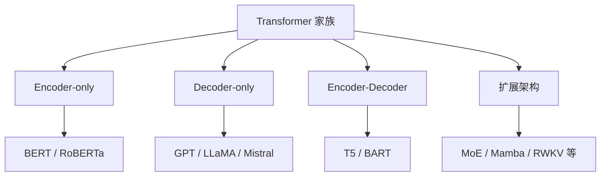
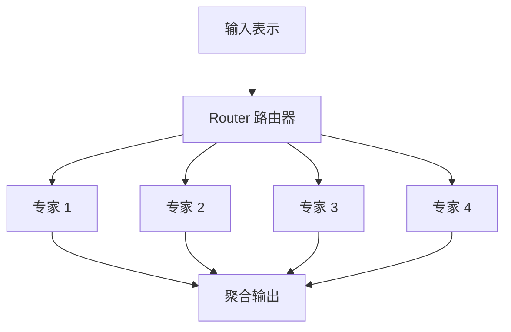

# 07 主流 LLM 架构谱系

## 本章目标

这一章的重点是把主流大模型架构放到同一张地图上。读完后你应该能回答：

- Encoder-only（只有编码器的架构）适合什么
- Decoder-only（只有解码器的架构）为什么成了今天 LLM 主流
- Encoder-Decoder（编码器加解码器）什么时候更自然
- BERT、GPT、T5 分别代表什么建模思路
- MoE（Mixture of Experts，混合专家）等扩展架构解决了什么问题

## 一张总览图

## 1. Encoder-only：更偏理解

Encoder-only（只保留编码器的 Transformer 架构）让每个位置可以双向看到整段输入，因此更适合理解任务。

### 典型代表

- BERT（Bidirectional Encoder Representations from Transformers，双向编码器表示）
- RoBERTa

### 训练目标

这类模型常用 MLM（Masked Language Modeling，掩码语言建模）目标。也就是随机遮住一部分 token，让模型根据左右文去猜它们。

$$
L_{\text{MLM}} = -\sum_{t \in M}\log P(x_t \mid x_{\setminus M})
$$

#### 这个公式在算什么

只在被 mask（遮住）的位置集合 $M$ 上计算损失，让模型根据剩余上下文预测被遮住 token。

#### 符号解释

- $M$：被遮住的位置集合
- $x_t$：被遮住位置的真实 token
- $x_{\setminus M}$：除被遮住位置外的上下文

#### 维度如何变化

对每个被 mask 的位置，模型都会输出一个长度为词表大小 $V$ 的概率分布，再和真实 token 做交叉熵。

#### 最小例子

句子“我 喜欢 机器 学习”里把“机器”遮住，模型会根据“我 喜欢 [MASK] 学习”来预测“机器”。

### 为什么适合理解

因为它能同时利用左侧和右侧上下文，所以对于分类、抽取、句子匹配这类任务很自然。

### 局限

它不是天然的左到右生成模型，所以不如 Decoder-only 适合长文本连续生成。

## 2. Decoder-only：更偏生成

Decoder-only（只保留解码器的架构）通常使用因果掩码，只允许当前位置看左边上下文，因此特别适合自回归生成。

### 典型代表

- GPT 系列
- LLaMA 系列
- Mistral
- Qwen 等现代开源模型

### 训练目标

通常是 CLM（Causal Language Modeling，因果语言建模），也就是预测下一个 token。

$$
L_{\text{CLM}} = -\sum_{t=1}^{n}\log P(x_t \mid x_{<t})
$$

#### 这个公式在算什么

让模型在每个位置只根据左侧上下文预测当前 token，这和生成时的自回归流程一致。

#### 符号解释

- $x_t$：当前位置真实 token
- $x_{<t}$：当前位置左侧所有 token

#### 维度如何变化

每个时间步都会输出一个长度为 $V$ 的分布，整个序列训练时通常会把所有位置的损失累加或平均。

#### 最小例子

输入“我 喜欢”，模型要预测下一个 token 可能是“学习”还是其他词。

### 为什么成了 LLM 主流

- 训练目标和生成任务天然一致
- 结构相对简洁
- 扩展到超大规模更方便
- 在对话、写作、代码生成等任务上表现强

### 局限

它虽然也能做理解任务，但很多时候是通过 Prompt 方式把理解任务改写成生成任务，不一定像专门的 Encoder-only 那么高效。

## 3. Encoder-Decoder：更偏条件生成

Encoder-Decoder（编码器加解码器）结构把“理解输入”和“生成输出”分成两部分。

### 典型代表

- T5（Text-to-Text Transfer Transformer）
- BART

### 适合什么任务

- 翻译
- 摘要
- 改写
- 问答

这些任务都有一个明显特点：输入和输出都是文本，但输出明显依赖输入结构。

### 为什么自然

Encoder 先把输入读懂，Decoder 再根据编码结果生成输出，这很符合人对“读题再作答”的直觉。

### 局限

相比 Decoder-only，它在很多大规模通用生成场景下并没有形成今天的主流生态，尤其是在超大规模对话模型浪潮里。

## 4. 三类架构对比

| 架构 | 上下文可见性 | 常见训练目标 | 更适合的场景 |
| --- | --- | --- | --- |
| Encoder-only | 双向 | MLM | 分类、抽取、检索编码 |
| Decoder-only | 只看左侧 | CLM | 对话、续写、代码生成 |
| Encoder-Decoder | Encoder 双向，Decoder 左侧 | 条件生成 | 翻译、摘要、问答 |

## 5. BERT、GPT、T5 的代表意义

### BERT

BERT 的代表意义不是“它是一个模型”，而是它证明了双向编码器预训练在理解任务上非常有效。

### GPT

GPT 的代表意义是：只用 Decoder 也能通过大规模自回归预训练获得强大的生成与迁移能力。

### T5

T5 的代表意义是：把各种 NLP 任务统一成 text-to-text（文本到文本）格式，从而用统一框架处理多任务。

## 6. 为什么现代聊天大模型大多选 Decoder-only

原因通常有以下几点：

1. 训练目标与“逐步生成回答”完全一致。
2. 对超大规模参数和超长训练更容易标准化。
3. 生态成熟，推理和部署工具丰富。
4. 指令微调后，通用对话和生成能力很强。

这并不意味着 Encoder-only 和 Encoder-Decoder 没价值，而是今天的“通用助手型大模型”更适合用 Decoder-only 做底座。

## 7. MoE：为什么有些模型参数很多，但计算没那么贵

MoE（Mixture of Experts，混合专家架构）的大致思路是：

- 模型内部有多个专家子网络
- 每次只激活一部分专家
- 这样总参数量可以很大，但单次前向计算不一定用到全部参数

### 它解决什么问题

在不显著增加每次推理计算量的情况下，提高模型总容量。

### 它带来什么新问题

- 路由稳定性
- 负载均衡
- 训练和部署更复杂

## 8. Mamba、RWKV 等为什么会被讨论

这些架构通常试图解决 Transformer 在长序列上的一些成本问题，尤其是自注意力在序列长度 $n$ 增大时，计算和显存开销增长较快。

### 你需要知道的重点

- 它们是重要扩展方向
- 但在当前主流通用 LLM 工程生态里，Transformer 及其变体仍然是主流基础

所以对于新手主线学习，先学透 Transformer 是最划算的。

## 9. 选择架构时的工程思路

如果你是做工程选型，可以先问：

- 这是理解任务还是生成任务
- 输入输出是否都很长
- 是否需要统一多任务框架
- 推理延迟、吞吐和硬件限制如何

一个很实用的经验是：

- 通用生成助手：优先考虑 Decoder-only
- 检索编码、分类：Encoder-only 很常见
- 翻译、摘要等强条件生成：Encoder-Decoder 依然自然

## 常见误区

### 误区 1：BERT 比 GPT 落后

不是。它们针对的任务重点不同，不能简单用“先进还是落后”概括。

### 误区 2：Encoder-only 不能生成

严格说不是天然为生成而设计，但也可以通过特定方式做生成，只是不如 Decoder-only 自然。

### 误区 3：MoE 一定更快

不一定。它可能在理论计算上更省，但训练和部署复杂度更高，未必在所有场景都更快。

## 面试可复述版

1. Transformer 家族主流可以分成 Encoder-only、Decoder-only 和 Encoder-Decoder 三类。
2. Encoder-only 典型代表是 BERT，通常用掩码语言建模，适合理解型任务。
3. Decoder-only 典型代表是 GPT 和 LLaMA，使用因果语言建模，天然适合文本生成，因此成为今天通用 LLM 主流。
4. Encoder-Decoder 典型代表是 T5，更适合翻译、摘要这类条件生成任务。
5. MoE 通过只激活部分专家来提高总参数容量，但会带来路由和部署复杂度。
6. 对新手来说，先学透 Decoder-only Transformer 是理解现代大模型最有效的主线。

## 本章练习

1. 用一两句话比较 BERT 和 GPT 的训练目标差异。
2. 思考为什么聊天助手更常建立在 Decoder-only 之上。
3. 举一个你认为更适合 Encoder-Decoder 的任务，并说明理由。
4. 用自己的话解释 MoE 的核心价值和代价。

## 参考资料

- [BERT](https://arxiv.org/abs/1810.04805)
- [Language Models are Few-Shot Learners](https://arxiv.org/abs/2005.14165)
- [T5](https://arxiv.org/abs/1910.10683)
