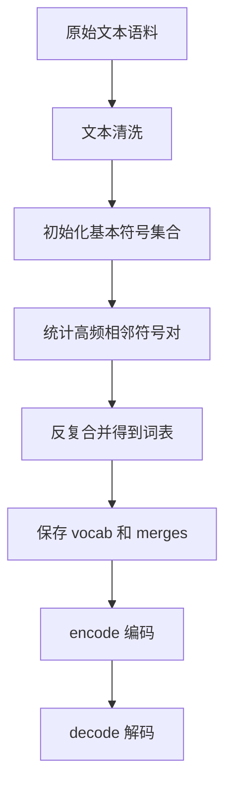

# 08 从零实现 Tokenizer

## 本章目标

这一章开始真正“自己动手”。目标不是做一个工业级 tokenizer，而是让你亲手完成一个最小可用版本，从而真正理解：

- tokenizer（分词器，把文本切成模型可处理 token 的模块）到底在做什么
- 词表是怎么训练出来的
- 编码和解码为什么必须可逆
- 特殊 token 为什么重要
- 一个最小 BPE（Byte Pair Encoding，字节对编码）思路如何落地

## 最终成果

读完并动手后，你应该能完成以下闭环：



## 1. 我们要实现什么

这里实现一个“教学版子词 tokenizer”：

- 输入：若干文本行
- 输出：一个词表、合并规则、编码函数、解码函数
- 不追求工业级性能
- 重点追求过程透明、逻辑清楚、便于你自己扩展

## 2. 一个 tokenizer 至少包含什么

一个最小 tokenizer 至少要有四部分：

1. 预处理规则：文本怎么清洗
2. 词表：token 到 id 的映射
3. 编码：文本 -> token id 序列
4. 解码：token id 序列 -> 文本

如果缺任何一部分，都不能真正用于模型训练或推理。

## 3. 设计思路

这里采用一个简化但很实用的策略：

- 先把词拆成字符序列
- 统计相邻字符对频率
- 每次合并最频繁的一对
- 反复执行，直到达到词表大小限制

这就是 BPE 的核心思想。

$$
\text{token\_id}_i = \text{vocab}(\text{token}_i)
$$

### 这个公式在算什么

它表示把第 $i$ 个 token 通过词表映射成一个整数 id。

### 符号解释

- $\text{token}_i$：第 $i$ 个文本单元
- $\text{vocab}(\cdot)$：词表映射函数
- $\text{token\_id}_i$：最终送给模型的整数编号

### 维度如何变化

原本的文本 token 是离散字符串，映射后变成一维整数序列。

### 最小例子

如果词表里 `"学习" -> 15`，那么 token `"学习"` 在编码后就变成整数 `15`。

## 4. 数据结构设计

### 词表

词表可以用字典表示：

```python
vocab = {
    "<pad>": 0,
    "<bos>": 1,
    "<eos>": 2,
    "<unk>": 3,
    "我": 4,
    "喜欢": 5,
}
```

### 合并规则

合并规则可以用列表保存：

```python
merges = [
    ("机", "器"),
    ("学", "习"),
    ("机器", "学习"),
]
```

这里的顺序很重要，因为编码时通常按训练时的合并顺序应用。

## 5. 文本预处理

工业系统中的文本清洗非常复杂，但教学版先做最基础的事：

- 去掉首尾空白
- 统一多余空格
- 保留中文原样
- 对英文可转小写

```python
def normalize_text(text: str) -> str:
    text = text.strip()
    text = " ".join(text.split())
    return text.lower()
```

### 为什么这一步必要

如果训练和推理时文本规范不一致，词表统计会被噪声干扰。例如 `"Hello"` 和 `"hello"` 会被当成不同符号。

## 6. 初始化符号序列

最简单的起点是“按字符切开”，每个词末尾加一个结束标记，帮助区分边界：

```python
def split_word(word: str) -> list[str]:
    return list(word) + ["</w>"]
```

比如：

```python
split_word("学习")
# ["学", "习", "</w>"]
```

## 7. 如何统计符号对频率

我们要统计每个词内部相邻符号对出现了多少次。

```python
from collections import Counter


def get_pair_counts(word_freqs: dict[tuple[str, ...], int]) -> Counter:
    pair_counts = Counter()
    for symbols, freq in word_freqs.items():
        for i in range(len(symbols) - 1):
            pair = (symbols[i], symbols[i + 1])
            pair_counts[pair] += freq
    return pair_counts
```

### 这个过程在做什么

它在回答一个问题：在整个训练语料里，哪一对相邻符号最常一起出现？最值得被合并成一个新符号？

$$
(\hat{a}, \hat{b}) = \arg\max_{(a,b)} \text{Count}(a,b)
$$

### 这个公式在算什么

它表示从所有相邻符号对里，找出出现次数最多的一对作为下一次合并目标。

### 符号解释

- $\text{Count}(a,b)$：符号对 $(a,b)$ 在语料中出现的频次
- $(\hat{a}, \hat{b})$：当前轮次最值得合并的符号对

### 最小例子

如果 `("机","器")` 出现 20 次，`("学","习")` 出现 18 次，那么当前轮会优先合并 `("机","器")`。

## 8. 如何执行一次合并

```python
def merge_pair(
    pair: tuple[str, str],
    word_freqs: dict[tuple[str, ...], int],
) -> dict[tuple[str, ...], int]:
    merged = {}
    bigram = "".join(pair)
    for symbols, freq in word_freqs.items():
        new_symbols = []
        i = 0
        while i < len(symbols):
            if i < len(symbols) - 1 and (symbols[i], symbols[i + 1]) == pair:
                new_symbols.append(bigram)
                i += 2
            else:
                new_symbols.append(symbols[i])
                i += 1
        merged[tuple(new_symbols)] = freq
    return merged
```

### 这个函数在做什么

如果当前要合并 `("机", "器")`，那么 `["机", "器", "</w>"]` 会变成 `["机器", "</w>"]`。

## 9. 训练循环

```python
def train_bpe(corpus: list[str], vocab_size: int = 200):
    from collections import Counter

    word_counter = Counter()
    for line in corpus:
        line = normalize_text(line)
        for word in line.split():
            word_counter[tuple(split_word(word))] += 1

    merges = []

    while True:
        current_symbols = {sym for word in word_counter for sym in word}
        if len(current_symbols) >= vocab_size:
            break

        pair_counts = get_pair_counts(word_counter)
        if not pair_counts:
            break

        best_pair, _ = pair_counts.most_common(1)[0]
        merges.append(best_pair)
        word_counter = merge_pair(best_pair, word_counter)

    base_tokens = sorted({sym for word in word_counter for sym in word})
    special_tokens = ["<pad>", "<bos>", "<eos>", "<unk>"]
    tokens = special_tokens + [t for t in base_tokens if t not in special_tokens]
    vocab = {token: idx for idx, token in enumerate(tokens)}
    return vocab, merges
```

## 10. 编码流程

编码时要做三件事：

1. 文本标准化
2. 初始切分
3. 按 merges 顺序不断合并

```python
def encode_word(word: str, merges: list[tuple[str, str]]) -> list[str]:
    symbols = split_word(word)
    for pair in merges:
        merged_symbol = "".join(pair)
        new_symbols = []
        i = 0
        while i < len(symbols):
            if i < len(symbols) - 1 and (symbols[i], symbols[i + 1]) == pair:
                new_symbols.append(merged_symbol)
                i += 2
            else:
                new_symbols.append(symbols[i])
                i += 1
        symbols = new_symbols
    if symbols and symbols[-1] == "</w>":
        symbols = symbols[:-1]
    return symbols
```

然后再把 token 转成 id：

```python
def encode(text: str, vocab: dict[str, int], merges: list[tuple[str, str]]) -> list[int]:
    ids = [vocab["<bos>"]]
    for word in normalize_text(text).split():
        for token in encode_word(word, merges):
            ids.append(vocab.get(token, vocab["<unk>"]))
    ids.append(vocab["<eos>"])
    return ids
```

## 11. 解码流程

```python
def decode(ids: list[int], id_to_token: dict[int, str]) -> str:
    tokens = [id_to_token[i] for i in ids]
    tokens = [t for t in tokens if t not in {"<bos>", "<eos>", "<pad>"}]
    return "".join(tokens)
```

### 为什么解码必须可逆

如果编码后无法尽量稳定地还原文本，就很难调试，也会影响训练数据可追踪性。

## 12. 持久化保存

最简单的方式是把词表和 merges 保存成 `json`：

```python
import json


def save_tokenizer(vocab, merges, vocab_path="vocab.json", merges_path="merges.json"):
    with open(vocab_path, "w", encoding="utf-8") as f:
        json.dump(vocab, f, ensure_ascii=False, indent=2)
    with open(merges_path, "w", encoding="utf-8") as f:
        json.dump(merges, f, ensure_ascii=False, indent=2)
```

## 13. 一个最小运行示例

```python
corpus = [
    "我 喜欢 机器 学习",
    "我 喜欢 深度 学习",
    "机器 学习 很 有趣",
]

vocab, merges = train_bpe(corpus, vocab_size=50)
ids = encode("我 喜欢 机器 学习", vocab, merges)
id_to_token = {idx: token for token, idx in vocab.items()}
text = decode(ids, id_to_token)

print(vocab)
print(merges[:10])
print(ids)
print(text)
```

### 你应该观察什么

- 高频片段是否真的被合并了
- 编码是否加上了 `<bos>` 和 `<eos>`
- 解码是否基本能恢复原文

## 14. 时间复杂度和工程现实

教学版实现主要目的是帮助你理解流程，不追求工业级效率。真实 tokenizer 系统一般还会处理：

- 更复杂的 Unicode（统一码字符集）规则
- 字节级编码
- 更高效的数据结构
- 并行训练和更快编码
- 特殊 token 模板和聊天格式

所以本章代码不是“拿去直接生产”，而是“让你真正看懂生产工具在做什么”。

## 15. 这一章和后面模型实现的关系

下一章我们写 mini Transformer 时，模型吃的输入就会是本章 tokenizer 输出的 token id 序列。也就是说：

- tokenizer 决定模型看到什么
- Transformer 决定模型如何利用这些输入

这两章加起来，才构成最小语言模型闭环。

## 常见误区

### 误区 1：tokenizer 训练完就和模型无关了

不是。模型整个训练过程都依赖它的输出格式。

### 误区 2：词表越大越高级

不是。词表大小、序列长度、模型参数量和泛化能力需要平衡。

### 误区 3：编码能跑通就够了

不够。你还需要考虑解码、特殊 token、一致性和持久化。

## 面试可复述版

1. tokenizer 的职责是把原始文本转成 token id 序列，并保证能够稳定解码回文本。
2. 子词分词的核心动机是在词表大小和未登录词问题之间做平衡。
3. BPE 的核心流程是初始化基本符号、统计高频相邻对、反复合并并记录 merges。
4. 编码时不仅要查词表，还要按训练时的合并顺序应用规则。
5. tokenizer 会影响序列长度、embedding 参数量和模型最终效果，所以它不是前处理小细节。

## 本章练习

1. 在你的实现里加入 `<sep>` 或 `<cls>` 等特殊 token。
2. 试着让 tokenizer 支持中英文混合文本。
3. 观察 `vocab_size` 从 50 提高到 200 时，编码结果如何变化。
4. 思考为什么很多现代 tokenizer 会采用字节级策略，而不是纯字符级策略。

## 参考资料

- [SentencePiece](https://arxiv.org/abs/1808.06226)
- [Neural Machine Translation of Rare Words with Subword Units](https://arxiv.org/abs/1508.07909)
- [Hugging Face Tokenizers Quicktour](https://huggingface.co/docs/tokenizers/main/en/quicktour)
