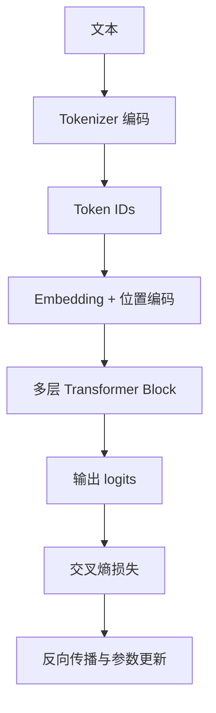

# 09 从零实现 Mini-Transformer

## 本章目标

这一章把前面的理论真正接成代码。我们会用 `Python + PyTorch` 从零搭出一个教学级 mini Transformer，也可以把它理解成一个最小 GPT 风格因果语言模型。

目标不是训练出一个强大的模型，而是让你真正打通下面这条链：



## 1. 最小实现范围

这一章实现以下模块：

- token embedding
- 可学习位置 embedding
- causal self-attention（因果自注意力）
- 前馈网络
- Transformer block
- 语言模型头
- 训练循环
- 简单采样生成

这一章最核心的训练目标仍然是因果语言建模：

$$
L = -\sum_{t=1}^{n}\log P(x_t \mid x_{<t})
$$

### 这个公式在算什么

让模型在每个位置只根据左侧上下文预测当前真实 token，从而学会“看到前文，续写后文”。

### 符号解释

- $x_t$：当前位置真实 token
- $x_{<t}$：当前位置左侧上下文
- $L$：整个序列的训练损失

### 维度如何变化

每个位置都会输出一个长度为词表大小 $V$ 的概率分布，再与真实 token 做交叉熵，最后对整段序列求和或平均。

### 最小例子

输入“我 喜欢”，模型需要提高“学习”作为下一个 token 的概率，这个提升过程就由该损失函数驱动。

## 2. 项目结构建议

即使是教学代码，也建议先有结构意识：

```text
mini_llm/
  tokenizer.py
  model.py
  train.py
  generate.py
```

在正文里我们直接把核心代码放在一个文件思路里讲，方便你先理解。

## 3. 超参数配置

```python
from dataclasses import dataclass


@dataclass
class Config:
    vocab_size: int
    block_size: int = 128
    n_layer: int = 4
    n_head: int = 4
    n_embd: int = 128
    dropout: float = 0.1
```

### 这些参数在控制什么

- `vocab_size`：词表大小
- `block_size`：模型一次最多看到多少个 token
- `n_layer`：Transformer block 的层数
- `n_head`：注意力头数
- `n_embd`：隐藏维度

## 4. 输入嵌入层

```python
import torch
import torch.nn as nn


class TokenAndPositionEmbedding(nn.Module):
    def __init__(self, config: Config):
        super().__init__()
        self.token_embedding = nn.Embedding(config.vocab_size, config.n_embd)
        self.position_embedding = nn.Embedding(config.block_size, config.n_embd)

    def forward(self, idx):
        B, T = idx.shape
        pos = torch.arange(T, device=idx.device)
        tok = self.token_embedding(idx)
        pos = self.position_embedding(pos)[None, :, :]
        return tok + pos
```

### 这个模块在做什么

- `idx` 是 `B x T` 的 token id 张量
- token embedding 把它变成 `B x T x C`
- position embedding 给每个位置补上顺序信息

其中 $B$ 是 batch size（批大小），$T$ 是序列长度，$C$ 是隐藏维度。

## 5. 实现因果自注意力

```python
class CausalSelfAttention(nn.Module):
    def __init__(self, config: Config):
        super().__init__()
        assert config.n_embd % config.n_head == 0
        self.n_head = config.n_head
        self.head_dim = config.n_embd // config.n_head
        self.q_proj = nn.Linear(config.n_embd, config.n_embd)
        self.k_proj = nn.Linear(config.n_embd, config.n_embd)
        self.v_proj = nn.Linear(config.n_embd, config.n_embd)
        self.out_proj = nn.Linear(config.n_embd, config.n_embd)
        self.dropout = nn.Dropout(config.dropout)

    def forward(self, x):
        B, T, C = x.shape
        q = self.q_proj(x).view(B, T, self.n_head, self.head_dim).transpose(1, 2)
        k = self.k_proj(x).view(B, T, self.n_head, self.head_dim).transpose(1, 2)
        v = self.v_proj(x).view(B, T, self.n_head, self.head_dim).transpose(1, 2)

        att = (q @ k.transpose(-2, -1)) / (self.head_dim ** 0.5)
        mask = torch.tril(torch.ones(T, T, device=x.device)).view(1, 1, T, T)
        att = att.masked_fill(mask == 0, float("-inf"))
        att = torch.softmax(att, dim=-1)
        att = self.dropout(att)

        y = att @ v
        y = y.transpose(1, 2).contiguous().view(B, T, C)
        return self.out_proj(y)
```

### 维度走一遍

- 输入 `x`: `B x T x C`
- `q, k, v` reshape 后：`B x n_head x T x head_dim`
- 注意力分数：`B x n_head x T x T`
- 输出再拼回：`B x T x C`

### 为什么要 `torch.tril`

`torch.tril` 会生成下三角矩阵，保证当前位置只能看到自己和前面的 token，不能偷看未来。

## 6. 前馈网络

```python
class MLP(nn.Module):
    def __init__(self, config: Config):
        super().__init__()
        self.net = nn.Sequential(
            nn.Linear(config.n_embd, 4 * config.n_embd),
            nn.GELU(),
            nn.Linear(4 * config.n_embd, config.n_embd),
            nn.Dropout(config.dropout),
        )

    def forward(self, x):
        return self.net(x)
```

这里的 `4 * config.n_embd` 是一种非常常见的经验设置，用来给模型提供更强的非线性加工空间。

## 7. Transformer Block

```python
class Block(nn.Module):
    def __init__(self, config: Config):
        super().__init__()
        self.ln1 = nn.LayerNorm(config.n_embd)
        self.attn = CausalSelfAttention(config)
        self.ln2 = nn.LayerNorm(config.n_embd)
        self.mlp = MLP(config)

    def forward(self, x):
        x = x + self.attn(self.ln1(x))
        x = x + self.mlp(self.ln2(x))
        return x
```

### 这里体现了什么

- pre-norm（先归一化再进子层）的写法
- 残差连接
- 注意力和前馈网络的串联

## 8. 最小语言模型

```python
class MiniTransformerLM(nn.Module):
    def __init__(self, config: Config):
        super().__init__()
        self.config = config
        self.embed = TokenAndPositionEmbedding(config)
        self.blocks = nn.Sequential(*[Block(config) for _ in range(config.n_layer)])
        self.ln_f = nn.LayerNorm(config.n_embd)
        self.lm_head = nn.Linear(config.n_embd, config.vocab_size, bias=False)

    def forward(self, idx, targets=None):
        x = self.embed(idx)
        x = self.blocks(x)
        x = self.ln_f(x)
        logits = self.lm_head(x)

        loss = None
        if targets is not None:
            B, T, V = logits.shape
            loss = nn.functional.cross_entropy(
                logits.view(B * T, V),
                targets.view(B * T),
            )
        return logits, loss
```

### 输出层在做什么

`lm_head` 会把每个位置的隐藏状态投影到词表大小，得到该位置对“下一个 token 应该是什么”的打分。

$$
z_t = h_t W_{vocab} + b
$$

### 这个公式在算什么

它把第 $t$ 个位置的隐藏状态 $h_t$ 映射到整个词表空间，得到对每个 token 的打分 logits。

### 符号解释

- $h_t$：第 $t$ 个位置的隐藏状态
- $W_{vocab}$：输出投影矩阵
- $b$：偏置
- $z_t$：长度为词表大小 $V$ 的打分向量

### 维度如何变化

如果 $h_t \in \mathbb{R}^{d_{model}}$，那么 $W_{vocab} \in \mathbb{R}^{d_{model} \times V}$，输出 $z_t \in \mathbb{R}^{V}$。

### 最小例子

若词表大小是 1000，那么每个位置最终都会输出长度为 1000 的分数向量，表示“下一个 token 是 1000 个候选里哪一个”的可能性。

## 9. 数据组织方式

语言模型训练通常会把连续 token 序列切成输入和目标：

- 输入：`[x1, x2, x3, x4]`
- 目标：`[x2, x3, x4, x5]`

也就是让模型看到前文，预测右移一位后的序列。

```python
def get_batch(data, block_size, batch_size, device):
    ix = torch.randint(0, len(data) - block_size - 1, (batch_size,))
    x = torch.stack([data[i:i + block_size] for i in ix])
    y = torch.stack([data[i + 1:i + block_size + 1] for i in ix])
    return x.to(device), y.to(device)
```

## 10. 训练循环

```python
def train(model, data, device, max_steps=2000, batch_size=32, lr=3e-4):
    optimizer = torch.optim.AdamW(model.parameters(), lr=lr)
    model.train()

    for step in range(max_steps):
        x, y = get_batch(data, model.config.block_size, batch_size, device)
        _, loss = model(x, y)

        optimizer.zero_grad()
        loss.backward()
        optimizer.step()

        if step % 100 == 0:
            print(f"step={step} loss={loss.item():.4f}")
```

### 为什么用 AdamW

AdamW（带权重衰减的 Adam 优化器）是 Transformer 训练中非常常见的优化器，稳定且好用。

## 11. 生成函数

```python
@torch.no_grad()
def generate(model, idx, max_new_tokens, temperature=1.0):
    model.eval()
    for _ in range(max_new_tokens):
        idx_cond = idx[:, -model.config.block_size:]
        logits, _ = model(idx_cond)
        logits = logits[:, -1, :] / temperature
        probs = torch.softmax(logits, dim=-1)
        next_id = torch.multinomial(probs, num_samples=1)
        idx = torch.cat([idx, next_id], dim=1)
    return idx
```

### 这里体现了什么

- 每次只取最后一个位置的 logits 作为下一步预测依据
- 通过 softmax 得到概率
- 用采样而不是固定取最大值，可以增加多样性

## 12. 一个最小训练脚本思路

```python
device = "cuda" if torch.cuda.is_available() else "cpu"
config = Config(vocab_size=len(vocab), block_size=64, n_layer=4, n_head=4, n_embd=128)
model = MiniTransformerLM(config).to(device)

data = torch.tensor(all_token_ids, dtype=torch.long)
train(model, data, device)
```

训练完成后：

```python
prompt = torch.tensor([[vocab["<bos>"]]], dtype=torch.long, device=device)
out = generate(model, prompt, max_new_tokens=50)
print(decode(out[0].tolist(), id_to_token))
```

## 13. 你在这一章真正学到的是什么

这章最重要的不是“把代码打完”，而是打通以下理解：

- token id 先变成 embedding
- embedding 加入位置信息
- 多层 Transformer block 反复更新每个位置的表示
- 输出层给出每个位置对下一个 token 的分数
- 用交叉熵损失训练模型
- 用自回归方式逐个生成 token

## 14. 如何把它升级成更像工程的版本

后续如果你继续扩展，可以逐步加上：

- dropout 调整
- 学习率 warmup（预热）
- 验证集评估
- checkpoint 保存
- mixed precision（混合精度训练）
- 更好的 tokenizer
- 更多数据

但这些都是在本章最小闭环之上的增强。

## 常见误区

### 误区 1：只要代码跑通，模型原理就理解了

不一定。你还需要能说清每个张量维度怎么变化、每层为什么存在。

### 误区 2：mini Transformer 很小，所以和真实大模型无关

不是。真实大模型和这个教学版在核心结构上是一脉相承的，只是规模、训练策略和工程复杂度大得多。

### 误区 3：loss 下降就说明模型真正理解了

不一定。loss 下降说明它更会预测训练分布中的下一个 token，但泛化、事实性、推理能力还要看更多评测。

## 面试可复述版

1. 一个最小 Decoder-only Transformer 包括 token embedding、位置编码、多层因果自注意力 block 和输出头。
2. 因果自注意力通过下三角 mask 保证当前位置只能看自己和左侧上下文。
3. 每个 block 通常包含注意力层、前馈层、LayerNorm 和残差连接。
4. 训练时把序列右移一位构造成输入和目标，使用交叉熵损失做 next-token prediction。
5. 推理时采用自回归方式，每步用最后一个位置的 logits 预测下一个 token，再拼回输入继续生成。
6. 教学版 mini Transformer 虽然小，但完整保留了现代 LLM 的核心结构逻辑。

## 本章练习

1. 在生成函数中加入 `top_k` 采样。
2. 试着把位置 embedding 换成正弦位置编码。
3. 记录训练 loss 曲线，观察模型是否出现过拟合。
4. 思考为什么 block size 会直接影响模型能利用的上下文长度。

## 参考资料

- [Attention Is All You Need](https://arxiv.org/abs/1706.03762)
- [Transformers 官方文档 Quicktour](https://huggingface.co/docs/transformers/en/quicktour)
