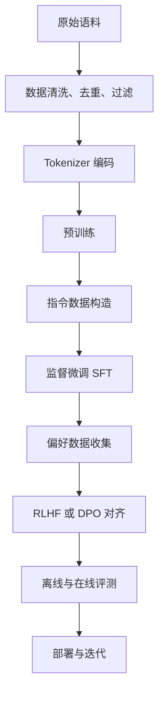
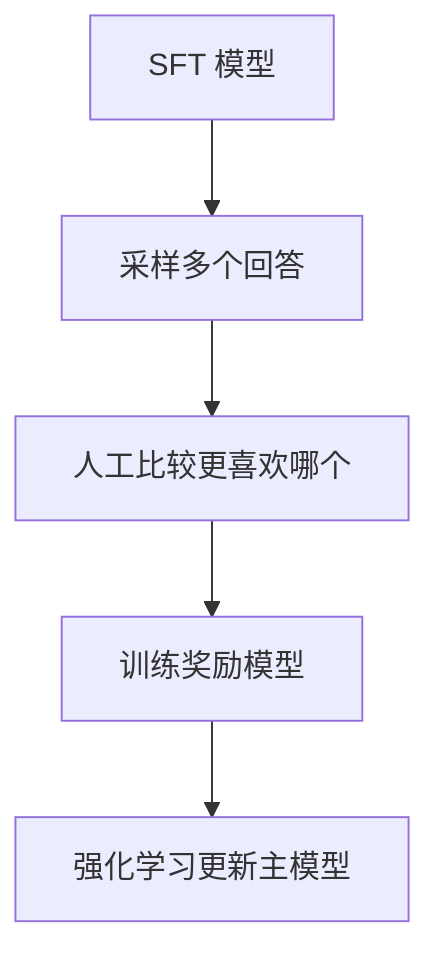
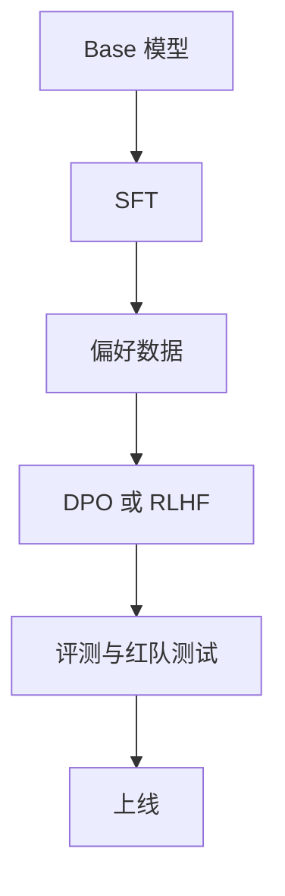

# 10 预训练、微调与对齐

## 本章目标

这一章把“模型是怎么从一堆参数变成可用助手”的训练路径讲清楚。读完后你应该能理解：

- 预训练（pretraining，先在大规模通用语料上学习语言规律）在做什么
- SFT（Supervised Fine-Tuning，监督微调）为什么能让模型更会“听指令”
- RLHF（Reinforcement Learning from Human Feedback，基于人类反馈的强化学习）和 DPO（Direct Preference Optimization，直接偏好优化）在对齐里分别扮演什么角色
- 为什么数据质量、训练目标和评测方式同样重要

## 1. 一张总流程图

## 2. 预训练在学什么

预训练阶段的目标通常很朴素：让模型在海量文本上不断做“预测下一个 token”的练习。

### 自回归语言建模目标

$$
L = -\sum_{t=1}^{n}\log P(x_t \mid x_{<t})
$$

### 这个公式在算什么

它表示对整个序列的每个位置，都要求模型给真实下一个 token 一个尽可能高的概率。所有位置的负对数概率加起来，就是训练损失。

### 符号解释

- $x_t$：第 $t$ 个 token
- $x_{<t}$：第 $t$ 个位置之前的所有 token
- $P(x_t \mid x_{<t})$：模型对真实 token 的预测概率

### 为什么这能学出很多能力

因为要做好下一个 token 预测，模型必须同时学习：

- 语法和句法
- 事实共现模式
- 常见推理链条
- 代码结构
- 文档风格

这些能力不是被显式写进去的，而是在大规模统计学习中涌现出来的。

## 3. 预训练数据为什么比你想的更重要

模型学到什么，很大程度由数据决定。预训练数据通常需要处理：

- 去重，减少重复样本
- 清洗，去掉乱码或低质量内容
- 过滤，控制敏感、有害、无意义文本
- 混合，平衡网页、书籍、代码、问答、论文等不同来源

### 一个简单直觉

如果训练数据大量充斥模板化低质量文本，模型就会学到低质量表达；如果代码数据非常少，它的代码能力也很难强。

## 4. Scaling Law 为什么重要

Scaling Law（规模定律，描述模型性能与参数量、数据量、算力关系的经验规律）告诉我们：模型效果通常会随着参数、数据和计算量扩大而改善，但前提是三者匹配。

### 你需要记住的工程含义

- 不是只堆参数就够
- 不是只堆数据就够
- 不是只堆训练步数就够

如果三者不平衡，就可能出现资源浪费。

## 5. 为什么预训练后还要 SFT

预训练模型虽然“会语言”，但不一定“会按人要求回答”。它可能：

- 输出风格不稳定
- 不知道怎么遵循指令格式
- 不擅长多轮对话

SFT（监督微调）就是为了解决这个问题。它会使用“指令-回答”样本，让模型学习更贴合人类任务形式的输出。

## 6. SFT 的训练目标

SFT 在数学上通常还是语言模型损失，只不过训练数据从通用文本换成了“带任务结构”的样本。

例如：

- 用户：请总结下面内容
- 助手：这里是总结结果

模型仍然是在预测下一个 token，只是训练分布换成了“更像人类使用场景”的数据。

## 7. 为什么还需要对齐

即使做了 SFT，模型也未必总能输出人类真正想要的内容。比如它可能：

- 说得啰嗦
- 不够安全
- 不够有帮助
- 对多个可行答案的偏好和人不同

这就进入对齐（alignment，让模型输出更符合人类偏好和规则）的阶段。

## 8. RLHF 的核心思路

RLHF 通常分成三步：

1. 先做 SFT，得到一个基础可用模型
2. 收集人类偏好数据，训练 reward model（奖励模型，学习人类更喜欢哪种回答）
3. 用强化学习方法优化主模型，让它更倾向于生成高奖励回答

### 它解决什么

它试图把“人类更偏爱什么输出风格”显式纳入训练目标，而不只是让模型拟合参考答案。

## 9. DPO 为什么流行

DPO（Direct Preference Optimization，直接偏好优化）试图绕过传统 RLHF 中较复杂的强化学习流程，直接用偏好对数据优化模型。

### 直觉理解

对于同一个提示，给模型两个回答：

- 一个是人更喜欢的
- 一个是人不喜欢的

训练目标就是让模型给“更喜欢的回答”更高概率。

### 为什么工程上受欢迎

- 实现相对简单
- 稳定性往往更好
- 不需要完整强化学习管线

## 10. SFT、RLHF、DPO 的关系

你可以把三者理解成不同层次的问题：

- 预训练：学会语言和广泛知识
- SFT：学会以任务形式回答
- RLHF / DPO：学会更符合人类偏好地回答

它们不是互相替代，而是逐层补能力。

## 11. 一个工程上常见的训练栈

在开源工程里，很多团队会选择：

- Base model + SFT
- Base model + SFT + DPO

因为这是在复杂度和收益之间比较平衡的方案。

## 12. 数据构造的重要性

无论是 SFT 还是 DPO，数据构造都极其关键。你需要思考：

- 任务类型是否足够覆盖真实场景
- 样本格式是否统一
- 回答质量是否稳定
- 偏好标注是否一致

如果数据不稳定，训练出来的模型风格也会非常不稳定。

## 13. 评测不能只看 loss

训练中 loss 很重要，但对“可用性”来说远远不够。你还需要：

- 指令跟随评测
- 事实性评测
- 安全性评测
- 风格一致性评测
- 人工评测

## 14. 本章最重要的工程认识

很多人以为“大模型训练”就是“喂更多数据”。其实更准确的理解是：

- 预训练决定基础能力上限
- SFT 决定任务跟随能力
- 对齐决定用户体验与安全边界
- 评测决定你是否真的知道模型好坏

## 常见误区

### 误区 1：SFT 会把模型变聪明很多

不完全是。它更常见的作用是让模型更会按指令使用已有能力，而不是凭空增加大量新知识。

### 误区 2：RLHF 只是“让模型更安全”

不止。它也会影响有帮助性、风格、拒答行为和回答偏好。

### 误区 3：DPO 比 RLHF 高级，所以一定更好

不是。它更简洁、更受欢迎，但具体效果仍取决于任务、数据和实现细节。

## 面试可复述版

1. 现代大模型训练通常分为预训练、监督微调和对齐三个阶段。
2. 预训练通过 next-token prediction 学会语言规律和广泛知识，是能力基础。
3. SFT 用指令-回答数据让模型更会遵循任务格式和对话习惯。
4. RLHF 通过偏好数据、奖励模型和强化学习，让模型输出更符合人类偏好。
5. DPO 则用更直接的偏好优化方式，在很多工程场景里比完整 RLHF 更易实现和维护。
6. 真正决定效果的不只是模型结构，还有数据质量、训练目标和评测体系。

## 本章练习

1. 用自己的话解释“预训练学到的是基础能力，SFT 学到的是使用方式”。
2. 设想一个客服场景，列出 5 条适合 SFT 的样本格式。
3. 设计一个简单偏好标注规则，用于比较两条回答哪条更好。
4. 思考为什么高质量偏好数据通常比单纯增加数量更重要。

## 参考资料

- [Language Models are Few-Shot Learners](https://arxiv.org/abs/2005.14165)
- [Scaling Laws for Neural Language Models](https://arxiv.org/abs/2001.08361)
- [Training language models to follow instructions with human feedback](https://arxiv.org/abs/2203.02155)
- [Direct Preference Optimization](https://arxiv.org/abs/2305.18290)
- [TRL 官方文档](https://huggingface.co/docs/trl/en/index)
