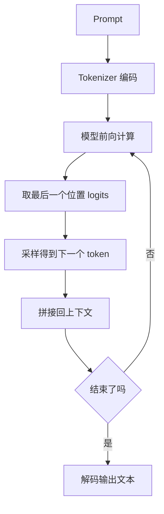
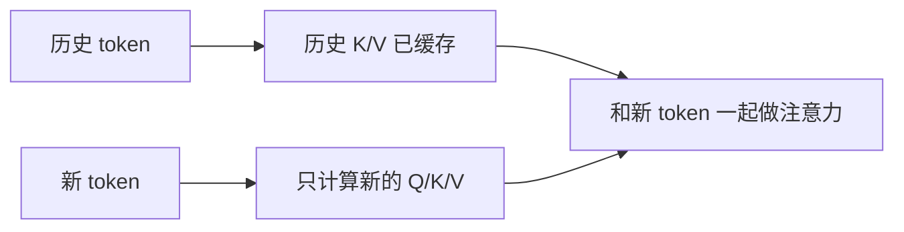
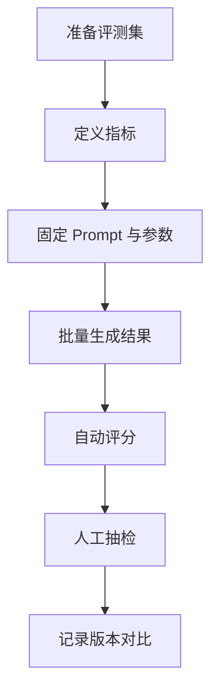

# 11 推理、Prompt 与评测

## 本章目标

训练完模型之后，真正给用户使用时发生的是推理（inference，用已训练好的模型做前向计算并生成结果）。这一章要讲清：

- 模型如何一步步生成文本
- Prompt（提示词，以自然语言或结构化模板描述任务的输入）为什么会影响结果
- 温度、Top-k、Top-p 等采样参数在控制什么
- KV Cache（缓存注意力中的键和值以避免重复计算）为什么能提速
- 为什么评测不能只看“感觉还不错”

## 1. 生成到底在发生什么

对于 Decoder-only（只有解码器的架构）模型，生成过程通常是：

1. 输入 prompt
2. 计算当前所有位置的隐藏状态
3. 取最后一个位置的 logits（未归一化分数）
4. 根据采样策略选出下一个 token
5. 把这个 token 拼回输入
6. 重复直到遇到 `<eos>` 或达到最大长度



## 2. Greedy 解码

最简单的生成方法是 greedy decoding（贪心解码，每一步都选概率最大的 token）：

$$
x_{t+1} = \arg\max_i P(i \mid x_{\le t})
$$

### 这个公式在算什么

每一步都直接选择概率最大的候选 token。

### 优点

- 简单
- 稳定
- 快

### 缺点

- 容易陷入模板化回答
- 多样性低
- 某些场景下会重复

## 3. 温度 Temperature

Temperature（温度，控制概率分布尖锐程度的参数）常写为：

$$
P_i = \frac{\exp(z_i / T)}{\sum_j \exp(z_j / T)}
$$

### 这个公式在算什么

把 logits 除以温度 $T$ 再做 softmax。

### 为什么有用

- $T < 1$：分布更尖锐，更保守
- $T > 1$：分布更平缓，更随机

### 最小例子

如果两个 token 原本分数差不大，低温度会进一步放大高分 token 的优势；高温度会让次优 token 更有机会被采样到。

## 4. Top-k 采样

Top-k（只在概率最高的前 $k$ 个候选中采样）可以限制长尾噪声。

### 它在做什么

假设词表有 50000 个 token，模型并不需要每一步都在全部 50000 个 token 里抽样。Top-k 会先保留最高分的 $k$ 个，再在这 $k$ 个中采样。

### 工程意义

- 提高稳定性
- 降低采样到奇怪 token 的概率

## 5. Top-p 采样

Top-p（nucleus sampling，保留累计概率达到阈值 $p$ 的最小 token 集合）比固定 `k` 更自适应。

### 它在做什么

如果前几个 token 的概率已经很集中，那么保留的候选就很少；如果分布比较平，保留的候选就会更多。

### 直觉

Top-k 是“固定人数筛选”，Top-p 是“按累计概率筛选”。

## 6. Beam Search 为什么在 LLM 聊天里不总是合适

Beam Search（束搜索，保留多个候选路径并持续扩展的搜索方法）在机器翻译等任务中很常见，但在开放式对话里不一定总是优选，因为：

- 它更偏“高概率标准答案”
- 容易让输出过于保守
- 计算成本更高

所以今天的聊天大模型更常见的是温度 + Top-p / Top-k 这类采样策略。

## 7. KV Cache 为什么能提速

在自回归生成时，每生成一个新 token，都需要重新做注意力计算。如果每一步都把前面所有 token 的 Key 和 Value 重新算一遍，会非常浪费。

KV Cache（缓存历史注意力中的 Key 和 Value）就是把历史结果存起来：



### 工程意义

- 显著降低重复计算
- 让长文本生成更快

### 代价

- 占用更多显存或内存

## 8. Prompt 为什么会影响结果

Prompt（提示词）本质上是在给模型“构造上下文”。模型不会读取“你的真实意图”，它只会根据看到的 token 序列继续生成。

好的 Prompt 往往会明确：

- 角色
- 任务
- 输入格式
- 输出格式
- 约束条件

### 一个简单对比

差 Prompt：

> 帮我写一下

好 Prompt：

> 你是一名初级 Python 教学助手。请用中文解释下面代码，要求分三部分：功能、逐行说明、常见错误。不要省略代码块。

第二种更容易得到稳定结果，因为上下文更明确。

## 9. Prompt Template 的作用

Prompt Template（提示模板，用固定结构拼装输入的模板）可以帮助工程系统保持一致性。例如：

```text
系统：你是一名严谨的技术助手。
用户问题：{question}
输出要求：
1. 先给结论
2. 再给步骤
3. 不确定时要说明假设
```

模板化的价值在于：

- 输出风格稳定
- 更容易调试和评测
- 更利于和检索、工具调用结合

## 10. 幻觉为什么会发生

幻觉（模型生成看起来合理但并不真实的内容）常见原因包括：

- 训练分布里类似模式太多，但事实约束不足
- Prompt 不够明确
- 推理随机性过高
- 模型缺少最新或外部知识

### 工程上怎么缓解

- 降低温度
- 明确要求引用依据
- 使用 RAG 引入外部检索结果
- 做人工或规则校验

## 11. 为什么评测不能只靠主观感觉

“感觉挺好用”通常不是可靠评测。一个工程项目至少要有：

- 自动评测：格式正确率、准确率、召回率、ROUGE、BLEU、代码通过率等
- 人工评测：有帮助性、事实性、简洁性、安全性
- 场景评测：真实业务数据回放

## 12. 一个评测框架的基本结构



### 为什么要固定 Prompt 和参数

如果模型版本变了、Prompt 变了、温度也变了，你就很难知道到底是什么因素导致结果变化。

## 13. 一个简单的推理参数经验表

| 场景 | 温度 | Top-p | 目标 |
| --- | --- | --- | --- |
| 事实问答 | 0.1 到 0.3 | 0.8 到 0.95 | 更稳定、少发散 |
| 创意写作 | 0.7 到 1.0 | 0.9 到 1.0 | 更多样 |
| 代码生成 | 0.1 到 0.4 | 0.8 到 0.95 | 更确定、少随机错误 |

这不是硬规则，而是入门时很有用的经验起点。

## 常见误区

### 误区 1：温度越低越准确

不一定。温度低通常更稳定，但如果 Prompt 本身含糊，模型仍然可能稳定地产生错误。

### 误区 2：Prompt 工程只是“说话技巧”

不是。它本质上是在设计模型看到的上下文结构。

### 误区 3：评测只看一个分数就够

不够。不同任务需要不同指标，还要辅以人工和场景评测。

## 面试可复述版

1. 推理是模型在已训练参数下做前向计算并逐步生成 token 的过程。
2. Greedy 解码每步选最大概率 token，稳定但多样性低。
3. Temperature 用于调节分布尖锐程度，Top-k 和 Top-p 用于限制采样空间。
4. KV Cache 通过缓存历史 Key 和 Value，大幅减少自回归生成中的重复计算。
5. Prompt 本质上是在构造模型上下文，因此会显著影响输出风格和质量。
6. 评测不能只靠感觉，应该结合自动指标、人工评测和真实场景测试。

## 本章练习

1. 用同一个问题分别设置 `temperature=0.2` 和 `temperature=0.9`，比较输出差异。
2. 设计一个统一 Prompt 模板，用于“技术文档总结”任务。
3. 思考为什么 KV Cache 在长输出场景里价值更大。
4. 为一个问答系统设计三条你认为关键的人工评测标准。

## 参考资料

- [Transformers 官方文档 Quicktour](https://huggingface.co/docs/transformers/en/quicktour)
- [Language Models are Few-Shot Learners](https://arxiv.org/abs/2005.14165)
