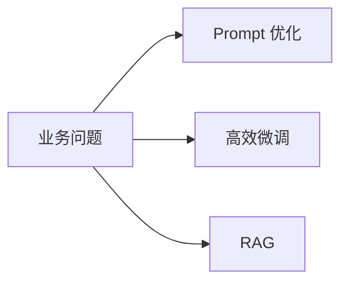
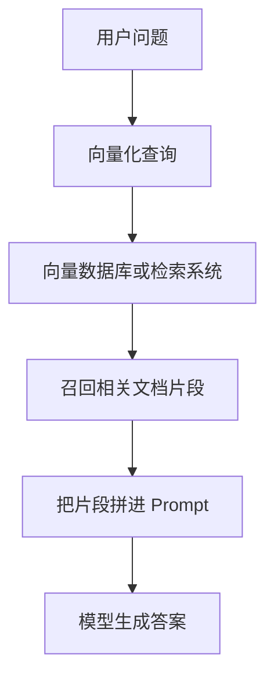

# 12 高效微调、RAG 与项目化开发

## 本章目标

现实工程里，你很少从零训练一个大模型。更常见的问题是：

- 我应该只写 Prompt 吗
- 我应该微调吗
- 我应该做 RAG（Retrieval-Augmented Generation，检索增强生成）吗
- 如果微调，怎么在有限显存下做

这一章的目标就是把这些工程选择讲清楚。

## 1. 三条主路线



你可以把它们理解成三种不同层级的改造方式：

- Prompt：不改模型，只改输入上下文
- 微调：少量更新模型参数
- RAG：不给模型强行记忆，而是让它在回答前先检索知识

## 2. 什么时候优先用 Prompt

如果问题主要是：

- 输出格式不稳定
- 角色设定不清晰
- 任务要求表达不明确

那通常先优化 Prompt 成本最低。

### 优点

- 快
- 风险低
- 不需要训练

### 局限

- 对领域知识注入有限
- 对固定风格或稳定行为的控制能力有限

## 3. 什么时候考虑微调

如果问题主要是：

- 需要固定风格
- 需要领域术语表达
- 需要稳定遵循特定格式
- 需要让模型学会特定任务模式

那就可以考虑微调。

## 4. 为什么是高效微调

全参数微调（更新模型所有参数）成本很高，显存压力也很大，所以工程上常见的是参数高效微调（PEFT，Parameter-Efficient Fine-Tuning，只更新少量新增参数的微调方式）。

最常见的就是 LoRA。

## 5. LoRA 的核心思想

LoRA（Low-Rank Adaptation，低秩适配）不是直接改原权重 $W$，而是学习一个低秩增量：

$$
W' = W + \Delta W,\quad \Delta W = BA
$$

### 这个公式在算什么

原始权重 $W$ 冻结不动，只学习一个可训练增量 $\Delta W$。这个增量被分解成两个更小矩阵 $B$ 和 $A$ 的乘积。

### 为什么这样省资源

如果直接训练大矩阵，参数量很多；而低秩分解只训练较小的矩阵，显存和存储成本都更低。

### 最小例子

如果原矩阵是 `4096 x 4096`，而 LoRA rank（秩，低秩分解中的中间维度）取 8，那么新增参数规模会远小于全矩阵更新。

## 6. QLoRA 又是什么

QLoRA（Quantized Low-Rank Adaptation，量化低秩适配）是在 LoRA 基础上，再把基础模型做低比特量化，从而进一步降低显存占用。

### 工程价值

它让“单卡对中型模型做教学级微调”成为可能。

### 代价

- 训练和推理的数值路径更复杂
- 调参更敏感

## 7. 微调数据怎么准备

一个简单的指令微调数据格式可以是：

```json
{
  "instruction": "把下面技术文档总结成三条重点",
  "input": "原始技术文档内容",
  "output": "总结结果"
}
```

### 你真正要关心的不是格式本身，而是：

- 指令是否明确
- 输出是否高质量
- 样本是否覆盖真实问题
- 风格是否一致

## 8. RAG 为什么重要

RAG（检索增强生成）适用于这样的问题：

- 知识会更新
- 文档量很大
- 不能完全依赖模型参数记忆
- 需要回答可追溯

### 基本流程



## 9. RAG 里的核心组件

### Chunking

Chunking（分块，把长文档拆成较短片段）决定检索粒度。太大不精确，太小又可能丢上下文。

### Embedding Model

Embedding model（把文本转成向量的模型）负责把查询和文档映射到同一个向量空间，以便做相似度检索。

### Retriever

Retriever（检索器）负责召回候选文档片段。

### Generator

Generator（生成器）就是最终负责回答的 LLM。

## 10. Prompt、微调、RAG 怎么选

你可以按这个经验判断：

| 问题类型 | 优先方案 |
| --- | --- |
| 只是输出格式不稳定 | Prompt |
| 要稳定学会某种任务风格 | 微调 |
| 需要最新知识和可追溯依据 | RAG |
| 既要特定风格又要外部知识 | 微调 + RAG |

## 11. 一个本地项目建议

这里给你一个适合练手的项目方向：

### 项目：本地技术文档问答助手

目标：

- 输入一批 Markdown 或 PDF 文档
- 构建本地 RAG 索引
- 调用本地开源模型回答问题
- 支持引用出处

### 这能锻炼什么

- 文档清洗
- 分块策略
- 检索与生成拼接
- Prompt 模板设计
- 本地部署和服务化

## 12. 一个项目结构例子

```text
project/
  data/
  ingest/
  embeddings/
  retriever/
  prompts/
  service/
  eval/
```

这会让你从一开始就形成“不是只跑个脚本，而是在搭系统”的意识。

## 13. 高效微调的基本工具链

你在开源生态里经常会见到：

- `transformers`：模型加载和训练框架
- `datasets`：数据集处理
- `peft`：LoRA、QLoRA 等参数高效微调
- `trl`：SFT、DPO 等训练流程支持

## 14. 一个 LoRA 训练的极简思路

即使这里不写完整脚本，你也要知道典型流程：

1. 加载基础模型和 tokenizer
2. 配置 LoRA 目标模块
3. 准备指令数据集
4. 用 Trainer 或自定义训练循环训练
5. 保存 adapter（适配器，只包含增量参数）
6. 推理时把 adapter 挂回基础模型

## 15. 工程上最常见的失败点

- 数据质量差
- 只看 loss，不看真实场景效果
- RAG 的召回质量太差
- Prompt 模板不稳定
- chunk 太碎或太大
- 误把“知识缺失”问题拿去做微调，而不是做 RAG

## 常见误区

### 误区 1：有问题就先微调

不一定。很多问题先优化 Prompt 就能解决，或者本质上应该用 RAG。

### 误区 2：RAG 可以完全替代微调

不是。RAG 擅长补知识，微调擅长塑造行为、风格和格式。

### 误区 3：LoRA 一定没有效果损失

不一定。它很高效，但具体效果取决于任务、数据和 LoRA 配置。

## 面试可复述版

1. 在有限资源场景下，工程上通常优先考虑 Prompt 优化、LoRA 类高效微调和 RAG，而不是全参数重训。
2. LoRA 的核心思想是在冻结原模型权重的情况下，只学习一个低秩增量 $BA$，因此显著节省参数和显存。
3. QLoRA 在 LoRA 的基础上结合量化，让单卡微调更可行。
4. RAG 通过“先检索、后生成”把外部知识注入回答过程，尤其适合知识更新快和需要出处可追溯的场景。
5. Prompt、微调和 RAG 不是互斥关系，很多真实项目会组合使用。

## 本章练习

1. 选一个业务场景，判断它更适合 Prompt、微调还是 RAG，并说明理由。
2. 设计一个指令微调数据样本模板。
3. 设计一个文档问答系统的 chunk 规则。
4. 用自己的话解释“LoRA 为什么比全参数微调更适合新手做本地实验”。

## 参考资料

- [PEFT 官方文档](https://huggingface.co/docs/peft/en/index)
- [TRL 官方文档](https://huggingface.co/docs/trl/en/index)
- [Retrieval-Augmented Generation for Knowledge-Intensive NLP Tasks](https://arxiv.org/abs/2005.11401)
