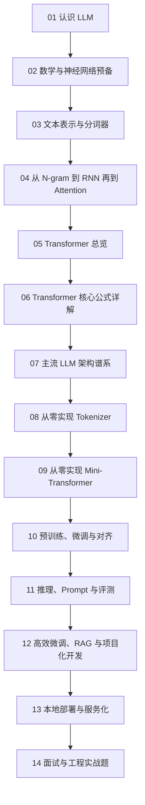

# LLM 零基础到工程落地教程

这是一套面向零基础读者的 LLM（Large Language Model，大语言模型，能够从海量文本中学习语言规律并进行生成、理解、推理的模型）系列教程。教程目标不是让你“会调用几个接口”，而是让你从概念、数学、架构、实现、训练、部署一路建立完整认知，最后具备面试和工程落地能力。

## 你将获得什么

读完并动手完成本仓库内容后，你应该能够：

- 解释 LLM、Transformer（基于注意力机制处理序列的神经网络架构）、Tokenizer（分词器，把文本切成模型可处理 token 的模块）的核心原理。
- 用 `Python + PyTorch` 从零实现一个最小可用 tokenizer 和一个教学级 mini Transformer。
- 理解预训练（pretraining，先在大规模通用语料上学习语言规律）、SFT（Supervised Fine-Tuning，监督微调）、RLHF（Reinforcement Learning from Human Feedback，基于人类反馈的强化学习）和 DPO（Direct Preference Optimization，直接偏好优化）的作用和差异。
- 理解 Prompt（提示词）、RAG（Retrieval-Augmented Generation，检索增强生成）、LoRA（Low-Rank Adaptation，低秩适配微调）和量化（quantization，用更低精度表示权重以节省资源）的工程选型逻辑。
- 在本地使用开源模型完成推理、量化和服务化部署。
- 在面试中清楚说明“为什么是 Transformer”“BERT、GPT、T5 有什么不同”“LoRA 为什么省资源”“为什么部署要量化”。

## 阅读建议

这套资料按“先理解，再实现，再工程化”的顺序设计。建议不要跳过前面的数学和历史演化部分，否则后面很容易只记住结论，无法真正理解原因。

## 目录

| 章节 | 主题 | 读完后你应该会什么 |
| --- | --- | --- |
| [docs/01-认识LLM.md](docs/01-认识LLM.md) | LLM 是什么 | 理解 LLM 的边界、生命周期与常见误解 |
| [docs/02-数学与神经网络预备.md](docs/02-数学与神经网络预备.md) | 数学和深度学习基础 | 看懂向量、矩阵、损失函数、梯度、反向传播 |
| [docs/03-文本表示与分词器.md](docs/03-文本表示与分词器.md) | 文本如何变成模型输入 | 理解 token、词表、子词和 tokenizer |
| [docs/04-从N-gram到RNN再到Attention.md](docs/04-从N-gram到RNN再到Attention.md) | 模型演化史 | 明白为什么最终会走向 Transformer |
| [docs/05-Transformer总览.md](docs/05-Transformer总览.md) | Transformer 整体结构 | 从数据流角度读懂 Encoder/Decoder |
| [docs/06-Transformer核心公式详解.md](docs/06-Transformer核心公式详解.md) | 关键公式与张量变化 | 能解释注意力公式、位置编码和损失函数 |
| [docs/07-主流LLM架构谱系.md](docs/07-主流LLM架构谱系.md) | 主流架构对比 | 说清 BERT、GPT、T5 和扩展架构差异 |
| [docs/08-从零实现Tokenizer.md](docs/08-从零实现Tokenizer.md) | 手写 tokenizer | 自己训练词表、编码和解码 |
| [docs/09-从零实现Mini-Transformer.md](docs/09-从零实现Mini-Transformer.md) | 手写 mini Transformer | 自己搭建训练循环并跑通最小模型 |
| [docs/10-预训练、微调与对齐.md](docs/10-预训练、微调与对齐.md) | 训练和对齐 | 搞清预训练、SFT、RLHF、DPO 的关系 |
| [docs/11-推理、Prompt 与评测.md](docs/11-推理、Prompt 与评测.md) | 推理与评估 | 会调采样参数、理解幻觉和评测 |
| [docs/12-高效微调、RAG 与项目化开发.md](docs/12-高效微调、RAG 与项目化开发.md) | 工程增强 | 会选 Prompt、微调或 RAG 的合适方案 |
| [docs/13-本地部署与服务化.md](docs/13-本地部署与服务化.md) | 本地部署 | 在普通电脑或单卡环境完成本地服务化 |
| [docs/14-面试与工程实战题.md](docs/14-面试与工程实战题.md) | 面试与工程收口 | 能讲清项目、原理、调优与排障 |
| [docs/appendix-glossary.md](docs/appendix-glossary.md) | 术语与公式索引 | 快速查术语、缩写和常见公式 |

## 环境建议

为了保证教程里的代码和实验尽可能可复现，建议准备以下环境：

- `Python 3.10+`
- `PyTorch 2.x`
- `Jupyter` 或 `VS Code`
- 可选：一张消费级 GPU（显存 8GB 到 24GB 更舒服）
- 可选工程库：`transformers`、`datasets`、`tokenizers`、`peft`、`trl`
- 可选部署工具：`llama.cpp`、`Ollama`、`vLLM`

如果只有 CPU（中央处理器，负责通用计算的硬件）也可以完成大部分教学级实验，只是训练速度会更慢。

## 统一写作规则

- 专业名词第一次出现时，正文会在括号里解释，不要求你预先知道这些词。
- 每章都包含：背景动机、核心概念、流程图、关键公式、最小例子、常见误区、面试表达和练习。
- 公式采用 LaTeX 书写，并在公式后解释“它在算什么、变量是什么意思、维度如何变化、最小例子是什么”。
- 图统一使用 Mermaid，帮助你把抽象步骤看成可执行流程。
- 参考资料会放在每章末尾，但正文会把关键思想讲清楚，不会把核心理解留给外链。

## 推荐学习节奏

你可以按下面的节奏推进：

1. 第 1 周：完成第 1 到第 4 章，建立语言模型和序列建模演化的整体认知。
2. 第 2 周：完成第 5 到第 7 章，彻底弄懂 Transformer 和主流架构差异。
3. 第 3 周：完成第 8 到第 9 章，亲手写出 tokenizer 和 mini Transformer。
4. 第 4 周：完成第 10 到第 12 章，理解训练、微调、RAG 和工程选型。
5. 第 5 周：完成第 13 到第 14 章，整理出一个本地部署项目和面试话术。

## 学习成果里程碑

- 里程碑 A：你能画出“文本 -> token -> embedding -> attention -> logits -> loss”的完整链路。
- 里程碑 B：你能手写一个最小 BPE（Byte Pair Encoding，字节对编码，一种子词分词方法） tokenizer。
- 里程碑 C：你能用 PyTorch 写出一个最小因果语言模型并训练它预测下一个 token。
- 里程碑 D：你能对一个开源模型完成本地推理、量化和简单 API（应用程序编程接口）服务。
- 里程碑 E：你能把一个 LLM 项目讲清楚“目标、架构、取舍、指标、问题和优化”。

## 参考资料原则

本仓库优先参考论文原文和官方文档，但任何关键概念都会在正文自洽解释。你可以把外链当成“来源和扩展阅读”，而不是学习主线。

一些贯穿全教程的重要资料：

- [Attention Is All You Need](https://arxiv.org/abs/1706.03762)
- [BERT: Pre-training of Deep Bidirectional Transformers for Language Understanding](https://arxiv.org/abs/1810.04805)
- [Exploring the Limits of Transfer Learning with a Unified Text-to-Text Transformer](https://arxiv.org/abs/1910.10683)
- [Language Models are Few-Shot Learners](https://arxiv.org/abs/2005.14165)
- [Scaling Laws for Neural Language Models](https://arxiv.org/abs/2001.08361)
- [Transformers 官方文档](https://huggingface.co/docs/transformers/en/quicktour)
- [PEFT 官方文档](https://huggingface.co/docs/peft/en/index)
- [TRL 官方文档](https://huggingface.co/docs/trl/en/index)
- [llama.cpp](https://github.com/ggml-org/llama.cpp)
- [Ollama 文档](https://docs.ollama.com/)
- [vLLM 文档](https://docs.vllm.ai/en/latest/)

## 最后提醒

如果你是第一次接触这个领域，请把“听懂名词”与“真的理解”区分开。真正的理解来自三件事：

- 你能用自己的话解释。
- 你能写出最小实现。
- 你能说明工程上为什么这样做，而不是那样做。

这套教程就是按这三步来设计的。
