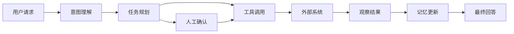

# Agent(智能体) 初识学习导航

## 本篇目标

这组资料用于建立 Agent(智能体) 的第一套工程化认知：知道它解决什么问题、由哪些模块组成、如何调用工具、如何接入 MCP(Model Context Protocol，模型上下文协议)，以及怎样把一个演示原型推进到可上线系统。

当前目录缺少完整项目代码，因此本文档采用行业通用示例来讲解。默认读者是已经了解基础编程、想系统学习 LLM(Large Language Model，大语言模型) Agent 开发的工程实践者。

## 学习路径

建议按下面顺序阅读，不要一上来就陷入框架 API(Application Programming Interface，应用程序编程接口)。本目录会涉及 LangChain(大语言模型应用开发框架)、LangGraph(图式智能体编排框架)、FastMCP(用于构建 MCP 应用的 Python 框架) 和 RAG(Retrieval-Augmented Generation，检索增强生成)：

| 顺序 | 文档 | 解决的问题 | 建议时长 | 进入下一篇的条件 |
| --- | --- | --- | --- | --- |
| 1 | `01-Agent概念与架构总览.md` | 建立 Agent 全景和模块边界 | 30 分钟 | 能画出规划、记忆、工具、行动四类模块 |
| 2 | `02-任务规划与推理引擎.md` | 理解 Agent 如何拆任务和循环执行 | 40 分钟 | 能解释 ReAct(推理与行动) 循环 |
| 3 | `03-记忆系统设计.md` | 理解短期记忆、长期记忆和检索策略 | 45 分钟 | 能区分上下文、会话状态、向量库 |
| 4 | `04-工具调用与多模态集成.md` | 理解工具调用和文本以外输入 | 45 分钟 | 能设计一个安全的工具描述 |
| 5 | `05-MCP协议详解.md` | 掌握 MCP 的角色、能力和调用流程 | 60 分钟 | 能解释 tools、resources、prompts 的差异 |
| 6 | `06-MCP实战：构建天气查询 Agent.md` | 用 FastMCP 快速做一个工具服务 | 60 分钟 | 能写出一个最小 MCP server(服务器) |
| 7 | `07-Agent开发框架（上）LangChain与LangGraph.md` | 理解主流代码框架的职责分工 | 50 分钟 | 能判断何时用链、何时用图 |
| 8 | `08-Agent开发框架（下）生态与选型.md` | 选择合适的 Agent 架构与平台 | 45 分钟 | 能按场景给出选型理由 |
| 9 | `09-智能体项目实战（一）：私人知识库助理.md` | 设计一个 RAG 知识库助理 | 60 分钟 | 能说明检索、重排、引用的流程 |
| 10 | `10-智能体项目实战（二）：自动化数据分析师.md` | 设计自然语言到数据分析报告流程 | 60 分钟 | 能规划查询、计算、图表、解释链路 |
| 11 | `11-多智能体协作与编排.md` | 理解多 Agent 协作的收益和风险 | 45 分钟 | 能设计角色分工和仲裁方式 |
| 12 | `12-Agent可靠性与安全防护.md` | 建立上线前的可靠性、安全和成本意识 | 60 分钟 | 能列出护栏、审计、权限和评测清单 |
| 13 | `13-Agent项目实战（三）：企业级客服系统.md` | 综合设计一个企业级客服 Agent | 75 分钟 | 能画出端到端架构并说明上线指标 |
| 14 | `14-练习题与参考答案.md` | 用题目检查理解和设计能力 | 60 分钟 | 能独立完成综合项目题 |
| 15 | `15-术语表.md` | 回查 Agent 高频术语 | 按需查阅 | 能准确解释关键术语 |
| 16 | `16-Agent设计模板.md` | 输出一份标准 Agent 设计文档 | 60 分钟 | 能完成自己的方案模板 |
| 17 | `17-Agent评测与上线清单.md` | 建立上线前验收标准 | 45 分钟 | 能判断系统是否适合试点 |

## 三条学习线

### 基础线

适合第一次系统学习 Agent 的读者：

1. `01-Agent概念与架构总览.md`
2. `02-任务规划与推理引擎.md`
3. `03-记忆系统设计.md`
4. `04-工具调用与多模态集成.md`

学习结果：能读懂 Agent 架构图，并能判断一个聊天机器人是否真的具备 Agent 能力。

### 工程线

适合准备做项目原型的读者：

1. `05-MCP协议详解.md`
2. `06-MCP实战：构建天气查询 Agent.md`
3. `07-Agent开发框架（上）LangChain与LangGraph.md`
4. `08-Agent开发框架（下）生态与选型.md`

学习结果：能把工具服务暴露给 Agent，并能选择合适框架组织流程。

### 落地线

适合希望做真实业务系统的读者：

1. `09-智能体项目实战（一）：私人知识库助理.md`
2. `10-智能体项目实战（二）：自动化数据分析师.md`
3. `11-多智能体协作与编排.md`
4. `12-Agent可靠性与安全防护.md`
5. `13-Agent项目实战（三）：企业级客服系统.md`
6. `17-Agent评测与上线清单.md`

学习结果：能把 Agent 从演示推进到有权限、评测、监控和人工兜底的业务系统。

## 学习方法

每篇文档按“目标、概念、示例、实践、自测、下一步”组织。阅读时建议边学边维护一张自己的 Agent 架构图，每学完一篇就把新概念放回图里。

最小实践建议：

1. 先实现一个只会调用天气工具的 Agent。
2. 再给它增加记忆和错误处理。
3. 然后把工具改造成 MCP server(服务器)。
4. 最后加上权限、日志、评测和人工确认。

## 总体能力地图



## 四周学习计划

如果你希望把这组资料当成一门小课来学，可以按四周推进。

### 第 1 周：建立 Agent 基础直觉

目标：能用自己的话解释 Agent，不再把它等同于“聊天机器人套壳”。

学习内容：

- 阅读 `01-Agent概念与架构总览.md`，画出 Agent 的四大模块。
- 阅读 `02-任务规划与推理引擎.md`，把 3 个真实需求拆成计划。
- 阅读 `03-记忆系统设计.md`，整理短期记忆、工作记忆、长期记忆的边界。
- 阅读 `04-工具调用与多模态集成.md`，设计 5 个工具 contract(契约)。

交付物：

- 一张 Agent 基础架构图。
- 一个“天气建议 Agent”的工具清单。
- 一份“哪些信息该进记忆、哪些不该进记忆”的判断表。

### 第 2 周：掌握工具协议和框架路线

目标：能把工具服务暴露给 Agent，并能解释为什么需要 MCP。

学习内容：

- 阅读 `05-MCP协议详解.md`，画出 host、client、server 的关系。
- 阅读 `06-MCP实战：构建天气查询 Agent.md`，写出最小工具服务。
- 阅读 `07-Agent开发框架（上）LangChain与LangGraph.md`，理解组件层和编排层。
- 阅读 `08-Agent开发框架（下）生态与选型.md`，完成 3 个选型练习。

交付物：

- 一个 MCP 工具设计说明。
- 一个工具调用错误处理表。
- 一份 Agent 框架选型记录。

### 第 3 周：完成两个项目原型

目标：能把概念组合成可运行原型。

学习内容：

- 阅读 `09-智能体项目实战（一）：私人知识库助理.md`，设计 RAG 流程。
- 阅读 `10-智能体项目实战（二）：自动化数据分析师.md`，设计自然语言到数据分析报告流程。
- 结合 `14-练习题与参考答案.md` 完成综合练习。
- 使用 `16-Agent设计模板.md` 写一份自己的 Agent 设计文档。

交付物：

- 私人知识库助理设计稿。
- 自动化数据分析师流程图。
- 至少 10 条评测样例。

### 第 4 周：走向工程落地

目标：能从原型视角切换到生产系统视角。

学习内容：

- 阅读 `11-多智能体协作与编排.md`，设计多 Agent 分工。
- 阅读 `12-Agent可靠性与安全防护.md`，做安全和成本清单。
- 阅读 `13-Agent项目实战（三）：企业级客服系统.md`，完成企业客服系统方案。
- 阅读 `17-Agent评测与上线清单.md`，补全上线前检查。

交付物：

- 一份企业级客服 Agent 方案。
- 一份可靠性与安全风险表。
- 一份上线验收清单。

## 学习产出目录建议

建议在学习过程中自己额外维护这些文件：

```text
notes/
  agent-architecture.md        # 你的架构图和模块理解
  tool-contracts.md            # 工具契约设计
  memory-policy.md             # 记忆写入和删除策略
  mcp-weather-demo.md          # MCP 天气案例记录
  rag-assistant-design.md      # 私人知识库助理方案
  evaluation-set.md            # 评测样例和评分规则
```

这些不是必须文件，但能让学习从“读懂”变成“能做”。

## 检查清单

- 能用一句话解释 Agent 和普通聊天机器人的区别。
- 能说明 LLM 为什么需要外部工具和记忆。
- 能区分 prompt(提示词)、tool(工具)、resource(资源) 和 workflow(工作流)。
- 能指出 Agent 上线时最危险的三类问题：错误行动、权限越界、成本失控。
- 能把一个业务需求拆成模型、工具、状态、评测、人工介入五部分。

## 参考资料

- [Model Context Protocol 官方文档](https://modelcontextprotocol.io/docs/getting-started/intro)
- [LangChain Agents 官方文档](https://docs.langchain.com/oss/python/langchain/agents)
- [LangGraph 官方概览](https://docs.langchain.com/oss/python/langgraph/overview)
- [FastMCP 官方文档](https://gofastmcp.com/getting-started/welcome)
