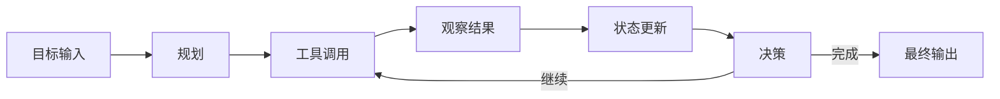

# Agent(智能体) 概念与架构总览

## 本篇目标

学完本篇，你应该能回答三个问题：

1. Agent(智能体) 和普通 LLM(Large Language Model，大语言模型) 对话有什么区别。
2. 为什么 Agent 通常需要规划、记忆、工具和行动四类模块。
3. 一个最小可用 Agent 的数据流怎样走。

## 先修知识

你需要知道：

- LLM 可以根据上下文生成文本，但默认不能直接访问实时数据、数据库、文件系统或业务系统。
- API(Application Programming Interface，应用程序编程接口) 是程序之间交互的约定。
- JSON(JavaScript Object Notation，轻量级数据交换格式) 常用于描述工具参数和返回值。

## 直觉理解

普通聊天机器人更像“只会说话的专家”，Agent 更像“会边想边做事的助理”。它不仅回答问题，还会根据目标拆任务、调用工具、读取资料、检查结果，并在必要时继续下一步。

例如用户说：“帮我查今天上海天气，并判断适不适合夜跑。”普通 LLM 如果没有联网能力，容易凭印象编答案。Agent 可以：

1. 判断需要实时天气。
2. 调用天气工具。
3. 读取温度、降雨、空气质量。
4. 结合夜跑标准生成建议。

## Agent 的定义

在工程语境中，Agent 是一个以 LLM 为推理核心，围绕目标持续感知、规划、调用工具、更新状态并输出结果的软件系统。

关键不在于“会聊天”，而在于它具备闭环：



## LLM 的局限

LLM 是 Agent 的大脑，但不是完整系统。它主要有四类局限：

| 局限 | 表现 | Agent 的补法 |
| --- | --- | --- |
| 信息不实时 | 不知道最新天气、库存、订单状态 | 调用搜索、数据库、业务 API |
| 无持久记忆 | 会话结束后难以保留偏好和历史 | 引入会话状态、数据库、向量库 |
| 不能直接行动 | 默认不能发邮件、下单、改配置 | 接入受控工具和权限系统 |
| 输出不稳定 | 可能幻觉、误解、格式漂移 | 加结构化输出、评测、护栏和人工确认 |

## 四大核心模块

### 规划模块

规划模块负责把用户目标拆成可执行步骤。它回答：“下一步应该做什么？”

常见形式：

- 简单任务：直接一次性调用工具。
- 多步骤任务：先查资料，再分析，再生成结果。
- 高风险任务：先生成计划，等待人工确认。

### 记忆模块

记忆模块负责保存和取回对当前任务有帮助的信息。

常见层次：

- short-term memory(短期记忆)：当前对话上下文、临时变量、最近工具结果。
- long-term memory(长期记忆)：用户偏好、历史案例、知识库、业务记录。
- working memory(工作记忆)：当前任务执行中的中间状态。

### 工具模块

工具模块让 Agent 能访问外部世界。工具可以是天气查询、数据库查询、文件读取、代码执行、网页浏览、工单创建等。

一个好工具应该满足：

- 名称清晰。
- 参数 schema(结构约束) 明确。
- 返回值可解析。
- 错误信息可恢复。
- 权限边界清楚。

### 行动模块

行动模块负责把决策变成真实动作。它可以只是返回一段回答，也可以创建订单、发送通知、修改配置。

行动越接近真实业务，越需要审计、权限、幂等性和人工确认。

## 最小架构

一个最小 Agent 可以这样组织：

```text
用户输入
  -> Agent 控制器
  -> LLM 推理
  -> 工具选择
  -> 工具执行
  -> 结果观察
  -> LLM 汇总
  -> 用户输出
```

对应的伪代码：

```python
def run_agent(user_message: str) -> str:
    state = {"messages": [user_message], "steps": []}

    while True:
        decision = call_llm(state)

        if decision["type"] == "final":
            return decision["answer"]

        tool_result = call_tool(
            name=decision["tool_name"],
            arguments=decision["arguments"],
        )

        state["steps"].append({
            "tool": decision["tool_name"],
            "result": tool_result,
        })
```

## 架构分层详解

把 Agent 做成真实系统时，不建议把所有逻辑塞进一个“超大 prompt(提示词)”或一个函数里。更稳妥的拆法是分成五层。

| 层级 | 主要职责 | 常见组件 | 关键问题 |
| --- | --- | --- | --- |
| 交互层 | 接收用户输入、展示输出 | Web、App、IDE、聊天窗口 | 用户是谁、上下文来自哪里 |
| 控制层 | 维护任务状态和执行循环 | Agent controller(控制器)、状态机、LangGraph | 下一步做什么、何时停止 |
| 推理层 | 理解意图、生成计划、总结结果 | LLM、prompt、结构化输出 | 需要什么信息、如何表达 |
| 能力层 | 提供工具、检索、代码执行 | MCP server、API、数据库、搜索 | 工具是否可靠、安全、可审计 |
| 治理层 | 权限、日志、评测、成本控制 | IAM(身份与访问管理)、日志、监控、评测集 | 能否上线、能否追责、能否回滚 |

这五层可以帮助你判断一个 Agent 项目的薄弱环节。很多演示项目只有推理层和少量能力层，缺少治理层，所以一到生产环境就会出现权限、审计、稳定性问题。

## Agent 成熟度模型

可以用下面模型判断系统成熟度：

| 等级 | 能力表现 | 典型形态 | 主要缺口 |
| --- | --- | --- | --- |
| L0 | 只会对话 | 普通聊天机器人 | 无工具、无状态、无行动 |
| L1 | 会调用单个工具 | 天气查询、翻译、简单搜索 | 工具链和错误恢复弱 |
| L2 | 会多步骤执行 | 查询数据后生成报告 | 状态管理、预算控制不足 |
| L3 | 有记忆和权限 | 私人助理、知识库助理 | 评测、审计、隐私治理不足 |
| L4 | 可生产落地 | 客服、数据分析、研发助手 | 需要持续运营和质量闭环 |
| L5 | 多 Agent 协作 | 专家组评审、自动化工作流 | 调度、冲突仲裁、成本复杂 |

学习时不要追求一步到 L5。多数业务先把 L2 到 L4 做扎实，价值已经很大。

## 需求拆解模板

当你拿到一个 Agent 需求时，可以按下面模板拆解：

```text
1. 用户目标：用户最终想完成什么？
2. 输入来源：用户会提供文本、文件、图片还是系统事件？
3. 需要的信息：哪些信息模型不知道，必须从外部获取？
4. 工具清单：需要哪些只读工具和写操作工具？
5. 状态设计：哪些信息要在一次任务内保存？哪些要长期保存？
6. 风险等级：是否涉及资金、隐私、生产配置、法律承诺？
7. 人工介入：哪些步骤需要用户或员工确认？
8. 成功标准：如何判断 Agent 做对了？
9. 失败策略：工具失败、信息不足、权限不足时怎么办？
10. 观测指标：需要记录哪些日志、耗时、成本和反馈？
```

示例：企业内部报销助手

| 维度 | 设计 |
| --- | --- |
| 用户目标 | 上传发票并生成报销单 |
| 输入来源 | 图片、PDF、用户文字补充 |
| 外部信息 | 员工信息、报销制度、项目预算 |
| 工具 | OCR、制度检索、预算查询、报销单草稿创建 |
| 状态 | 当前发票字段、校验结果、报销单草稿 |
| 风险 | 金额错误、重复报销、隐私泄露 |
| 人工介入 | 提交前由用户确认，异常金额转财务 |
| 成功标准 | 字段准确、制度匹配、草稿可提交 |

## 设计取舍

Agent 系统常见取舍：

| 取舍 | 更自动 | 更可控 |
| --- | --- | --- |
| 任务执行 | Agent 自主决定步骤 | 固定 workflow(工作流) |
| 工具权限 | 暴露更多工具 | 按场景最小授权 |
| 记忆策略 | 自动写入长期记忆 | 只写入用户确认的信息 |
| 输出风格 | 自由生成 | 模板和 schema 约束 |
| 上线方式 | 直接替代人工 | 先辅助人工再逐步自动化 |

早期学习和原型可以偏自动，生产落地要偏可控。

## 常见误区

- 把 Agent 等同于“提示词更长的聊天机器人”。真正的 Agent 至少有可观测的状态和工具闭环。
- 一开始就追求全自动。很多业务场景更适合 human-in-the-loop(人在回路中)，先由人确认高风险动作。
- 工具越多越好。工具过多会增加模型选择难度，也会提高错误调用概率。
- 忽略失败路径。工具超时、参数错误、权限不足、结果为空都应该被设计进流程。

## 最小实践

设计一个“天气建议 Agent”，只需要三个组件：

1. 一个 LLM，用来理解用户意图和生成建议。
2. 一个 `get_weather(city, date)` 工具，用来查天气。
3. 一个控制器，用来把工具结果交回 LLM。

实践要求：

- 写出工具名称、参数和返回值。
- 写出 Agent 的执行步骤。
- 明确哪些情况需要拒绝回答，例如用户没有提供城市且无法推断。

## 自测题

1. 为什么只有 LLM 不能算完整 Agent？
2. 规划模块和行动模块的边界是什么？
3. 工具调用为什么需要参数 schema？
4. 如果工具返回空结果，Agent 应该直接编答案还是请求补充信息？

## 下一步

继续阅读 `02-任务规划与推理引擎.md`，理解 Agent 如何把目标拆成步骤，并在执行过程中根据观察结果调整计划。
