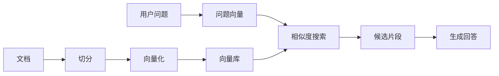

# 记忆系统设计

## 本篇目标

本篇解释 Agent 为什么需要记忆，以及如何设计短期记忆、长期记忆和混合检索策略。

学完后，你应该能：

- 区分上下文窗口、会话状态、长期记忆和知识库。
- 解释 embedding(嵌入向量) 与 vector database(向量数据库) 的作用。
- 设计一个最小记忆系统，避免“记太多”和“记错了”。

## 先修知识

建议先理解 Agent 的执行循环。你还需要知道：LLM 每次调用都依赖输入上下文，模型本身不会自动记住你的业务数据库。

## 为什么 Agent 需要记忆

没有记忆的 Agent 每次都像第一次见到用户：

- 用户刚说过的约束会丢失。
- 工具返回的中间结果无法复用。
- 用户偏好、历史选择、业务上下文不能沉淀。
- 多轮任务容易前后矛盾。

记忆的目标不是“把所有东西塞给模型”，而是“在合适时间取回合适信息”。

## 三类记忆

### 短期记忆

short-term memory(短期记忆) 通常指当前会话上下文和近期工具结果。

内容包括：

- 最近的用户消息。
- Agent 的中间计划。
- 工具调用结果。
- 当前任务状态。

优点是简单直接，缺点是受 context window(上下文窗口) 限制。上下文越长，成本越高，也越容易干扰模型判断。

### 长期记忆

long-term memory(长期记忆) 指跨会话保留的信息。

常见内容：

- 用户偏好，例如语言、输出格式、常用城市。
- 历史任务摘要。
- 企业知识库文档。
- 已验证的业务事实。

长期记忆需要持久化存储，常见载体包括数据库、对象存储、向量库和搜索引擎。

### 工作记忆

working memory(工作记忆) 是执行当前任务时的结构化状态。

例如数据分析 Agent 可以维护：

```json
{
  "task": "分析本月销售增长",
  "file_loaded": true,
  "columns": ["date", "city", "amount"],
  "current_step": "计算增长率",
  "warnings": []
}
```

工作记忆适合放在状态机、LangGraph state(状态) 或数据库记录中。

## 向量检索的基本流程

向量检索适合从大量文本中找语义相关片段。



关键步骤：

1. chunking(分块)：把文档拆成适合检索的小片段。
2. embedding(嵌入向量)：把文本转成语义向量。
3. retrieval(检索)：根据用户问题找相似片段。
4. rerank(重排)：把候选片段重新排序。
5. grounded generation(基于证据生成)：要求回答引用检索证据。

## 混合检索策略

单纯向量检索并不总是足够。工程中常用 hybrid search(混合检索)：

| 检索方式 | 擅长 | 不擅长 |
| --- | --- | --- |
| 关键词检索 | 精确词、编号、错误码、产品名 | 同义表达 |
| 向量检索 | 语义相近、自然语言问题 | 精确过滤 |
| 元数据过滤 | 权限、时间、部门、版本 | 内容理解 |
| 重排模型 | 提升最终相关性 | 增加延迟和成本 |

实践建议：知识库问答优先使用“元数据过滤 + 关键词 + 向量 + 重排”的组合。

## 记忆分类设计

真实系统里，建议把记忆继续细分，避免一个“memory”概念装所有东西。

| 记忆类型 | 内容 | 生命周期 | 存储位置 | 访问控制 |
| --- | --- | --- | --- | --- |
| 会话记忆 | 当前多轮对话 | 会话结束或短期保留 | Redis、数据库 | 当前用户 |
| 任务记忆 | 当前任务步骤和中间结果 | 任务完成后归档 | 状态表、checkpoint | 当前任务参与者 |
| 用户偏好 | 输出语言、格式、常用场景 | 长期，用户可编辑 | 用户画像表 | 用户本人 |
| 知识记忆 | 文档、制度、产品说明 | 按版本更新 | 搜索引擎、向量库 | 按权限过滤 |
| 经验记忆 | 历史失败、成功策略 | 定期整理 | 评测库、案例库 | 开发和运营团队 |

这张表的重点是：不同记忆不应该共享同一套写入和删除规则。

## 写入策略

长期记忆写入要谨慎。推荐使用三段式：

```text
候选记忆 -> 验证 -> 写入
```

### 候选记忆

模型可以提出候选，例如：

```json
{
  "type": "user_preference",
  "content": "用户喜欢用表格看对比结果",
  "confidence": 0.78,
  "source": "用户连续两次要求表格输出"
}
```

### 验证

验证方式包括：

- 用户明确确认。
- 多次行为一致。
- 来自可信系统。
- 由人工运营审核。

### 写入

写入时需要保存：

- 内容。
- 来源。
- 写入时间。
- 过期时间。
- 可见范围。
- 删除方式。

## 记忆读取策略

读取记忆时不要把所有内容都塞给模型，应按任务选择。

```text
用户偏好：回答格式、语言、详细程度
任务状态：当前任务进度、已执行工具
知识片段：与问题相关的证据
历史案例：类似问题的解决方法
```

推荐读取顺序：

1. 先读取当前任务状态。
2. 再读取用户明确偏好。
3. 然后检索知识片段。
4. 最后按需读取历史案例。

## 记忆质量评估

记忆系统要评估的不只是“检索是否命中”，还包括：

| 指标 | 解释 |
| --- | --- |
| 相关性 | 取回内容是否和问题有关 |
| 新鲜度 | 取回内容是否过期 |
| 忠实度 | 回答是否严格基于记忆内容 |
| 隐私性 | 是否泄露不该使用的记忆 |
| 干扰度 | 无关记忆是否影响回答 |
| 可删除性 | 用户是否能删除自己的长期记忆 |

## 记忆删除与过期

如果系统能记住，就必须能忘记。

常见策略：

- 用户偏好可手动编辑和删除。
- 会话记忆定期清理。
- 文档索引跟随源文档版本更新。
- 敏感信息设置短过期时间。
- 过期记忆不参与检索。

对于企业系统，删除不仅是从数据库删一行，还要考虑向量索引、缓存、日志和备份策略。

## 记忆写入原则

不是所有信息都应该写入长期记忆。写入前先问：

- 这条信息未来是否会再次使用？
- 它是否经过用户确认或系统验证？
- 它是否包含隐私或敏感数据？
- 它是否有过期时间？
- 它是否会让 Agent 产生错误偏见？

推荐把长期记忆拆成三类：

| 类型 | 示例 | 写入条件 |
| --- | --- | --- |
| 偏好 | “用户喜欢表格输出” | 用户多次表达或明确设置 |
| 事实 | “项目使用 PostgreSQL” | 来自代码、配置或用户确认 |
| 摘要 | “上次讨论了客服系统架构” | 会话结束时生成并可编辑 |

## 最小实践

设计一个私人知识库助理的记忆结构：

```text
短期记忆：当前对话、当前引用的文档片段
工作记忆：检索关键词、候选文档、回答草稿、引用列表
长期记忆：用户偏好、常用资料目录、历史问答摘要
知识库：PDF、Markdown、网页、会议纪要
```

实践任务：

1. 选择一篇 Markdown 文档。
2. 按标题切分成多个片段。
3. 给每个片段记录 `source`、`title`、`updated_at`。
4. 用户提问时，先检索片段，再基于片段回答。

## 常见误区

- 把全部历史对话都塞进 prompt(提示词)，导致成本高且噪声大。
- 把未验证的模型输出写成长期事实。
- 只用向量相似度，不做权限过滤。
- 没有记忆删除和过期机制。
- 回答时不暴露引用，用户无法判断依据。

## 自测题

1. 短期记忆和长期记忆的边界是什么？
2. 为什么向量检索不适合单独处理权限问题？
3. 什么时候应该让用户确认记忆写入？
4. 工作记忆为什么适合结构化存储？

## 下一步

继续阅读 `04-工具调用与多模态集成.md`。记忆让 Agent 知道上下文，工具让 Agent 能对外部世界采取行动。
