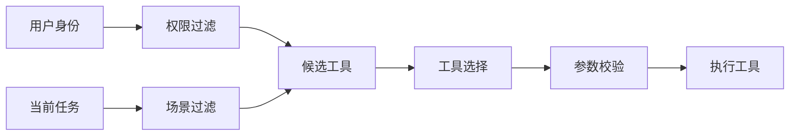

# 工具调用与多模态集成

## 本篇目标

本篇讲清楚 Agent 如何安全、稳定地使用外部工具，以及如何处理 text(文本) 之外的 image(图像)、audio(音频)、file(文件) 等输入。

学完后，你应该能：

- 设计一个清晰的 tool(工具) 描述。
- 理解工具调用链的执行和错误回退。
- 说清多模态输入进入 Agent 后的处理流程。

## 先修知识

建议先读完 Agent 架构和任务规划。你需要知道：LLM 本身负责判断和生成，工具负责真实查询或执行。

## 工具调用是什么

tool use(工具使用) 是让模型按约定输出工具名和参数，由程序执行工具，再把结果交回模型的机制。

一个工具通常包含：

| 字段 | 含义 | 示例 |
| --- | --- | --- |
| name | 工具唯一名称 | `get_weather` |
| description | 工具用途说明 | 查询指定城市天气 |
| input_schema | 输入参数结构 | `city`、`date` |
| output_schema | 输出结构 | `temperature`、`condition` |
| permission | 权限要求 | 只读、需确认、管理员 |

## 好工具的设计标准

### 名称明确

优先使用动词加对象：

- `search_documents`
- `get_weather`
- `create_ticket`
- `summarize_csv`

避免使用过宽的名字，例如 `do_task`、`process`、`call_api`。

### 参数具体

坏例子：

```json
{
  "query": "帮我处理一下订单"
}
```

好例子：

```json
{
  "order_id": "A1024",
  "action": "cancel",
  "reason": "用户重复下单"
}
```

参数越具体，越容易校验，也越容易做权限控制。

### 返回可解析

工具返回应尽量结构化：

```json
{
  "ok": true,
  "temperature_c": 22,
  "condition": "小雨",
  "updated_at": "2026-04-28T18:00:00+08:00"
}
```

不要只返回“天气还不错”这种难以判断的自然语言。

## 工具契约模板

设计工具时，可以使用下面模板：

```yaml
name: get_order_status
description: 查询当前用户有权访问的订单状态
type: read_only
input_schema:
  order_id:
    type: string
    required: true
    description: 订单编号
output_schema:
  ok:
    type: boolean
  status:
    type: string
  updated_at:
    type: string
permissions:
  - order:read
timeout_ms: 3000
retry:
  max_attempts: 1
audit:
  log_arguments: true
  log_result_summary: true
risk_level: low
```

这个模板强迫你提前思考：工具能做什么、谁能用、失败怎么办、如何记录。

## 工具分类

不同工具应该有不同治理方式。

| 工具类型 | 示例 | 风险 | 默认策略 |
| --- | --- | --- | --- |
| 查询工具 | 查天气、查订单、查文档 | 低到中 | 权限校验、日志记录 |
| 计算工具 | 统计、生成图表、代码执行 | 中 | 沙箱、资源限制 |
| 写入工具 | 创建工单、发邮件、改状态 | 中到高 | 人工确认、幂等 |
| 高危工具 | 删除数据、退款、生产发布 | 高 | 默认禁用或强审批 |
| 外部通信工具 | 发短信、发邮件、发通知 | 中到高 | 内容审核、防骚扰 |

工具分类比工具数量更重要。一个系统可以有很多查询工具，但高危工具必须非常少且可控。

## 工具注册与选择

工具多了以后，不能把所有工具无脑暴露给模型。

推荐流程：



过滤维度：

- 用户角色。
- 当前渠道。
- 任务类型。
- 数据范围。
- 风险等级。
- 预算限制。

这样做可以减少模型误选工具，也能降低权限风险。

## 参数校验与幂等

参数校验要在工具执行前完成：

```python
def validate_create_ticket(args: dict) -> list[str]:
    errors = []
    if not args.get("title"):
        errors.append("缺少工单标题")
    if args.get("priority") not in ["low", "medium", "high"]:
        errors.append("优先级不合法")
    if len(args.get("description", "")) > 2000:
        errors.append("描述过长")
    return errors
```

写操作还要考虑 idempotency(幂等性)：同一个请求重复执行，不应该创建多个相同工单或重复扣款。

常见做法：

- 使用 request_id(请求编号)。
- 工具端检查重复请求。
- 返回已存在结果而不是重复创建。
- 对重试操作限制次数。

## 工具调用链

复杂任务常常需要多个工具串联：


工具链设计要注意：

- 每一步输入来自哪里。
- 每一步失败后怎么办。
- 哪些中间结果需要写入状态。
- 哪些动作需要人工确认。

## 错误处理与回退

工具失败是常态。常见错误包括：

| 错误 | 例子 | 回退策略 |
| --- | --- | --- |
| 参数错误 | 城市为空 | 请求用户补充 |
| 权限不足 | 用户无权查看订单 | 明确拒绝并说明权限要求 |
| 网络超时 | 第三方 API 无响应 | 重试一次，仍失败则降级 |
| 结果为空 | 没查到文档 | 调整关键词或说明未找到 |
| 返回异常 | JSON 格式不合法 | 丢弃结果并记录日志 |

不要让 Agent 在工具失败后编造结果。失败也是有效输出。

## 多模态输入处理

multimodal(多模态) 指输入或输出不只包含文本，还包含图像、音频、视频、文件等。

常见流程：


例子：

- 图片发票：OCR(光学字符识别) 抽取金额、日期、税号。
- 录音文件：ASR(自动语音识别) 转写成文本，再总结会议纪要。
- PDF 文档：解析标题、段落、表格，再进入知识库检索。
- 截图排障：视觉模型识别界面状态，再调用日志查询工具。

## 多模态设计注意点

- 先抽取结构，再让 Agent 推理。不要让模型只看原始文件就直接下结论。
- 保留来源位置，例如页码、时间戳、截图区域。
- 对识别置信度低的内容进行人工确认。
- 对图片、音频、文件设置大小和格式限制。
- 对用户上传内容做安全扫描和隐私处理。

## 最小实践

设计一个“发票审核 Agent”：

1. 用户上传发票图片。
2. OCR 工具抽取发票字段。
3. 校验工具检查金额、日期、抬头。
4. 业务工具查询订单是否匹配。
5. Agent 输出通过、驳回或需人工复核。

工具清单示例：

```text
extract_invoice_fields(image_file)
validate_invoice_fields(fields)
get_order(order_id)
create_review_task(reason, evidence)
```

## 常见误区

- 给工具过宽权限，让模型可以执行危险动作。
- 工具描述含糊，导致模型频繁选错工具。
- 多模态输入没有保留证据位置，无法复核。
- 忽略工具结果校验，直接把外部返回交给模型。
- 没有区分只读工具和写操作工具。

## 自测题

1. 为什么工具返回值应尽量结构化？
2. 什么样的工具调用必须加入人工确认？
3. 多模态输入为什么要保留来源位置？
4. 工具失败时 Agent 应该如何向用户表达？

## 下一步

继续阅读 `05-MCP协议详解.md`。当工具越来越多、客户端越来越多时，就需要 MCP 这样的统一协议来降低集成成本。
