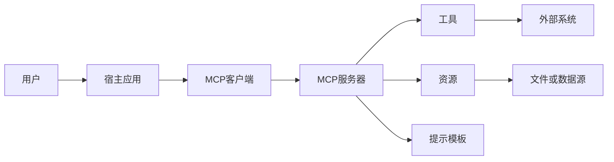
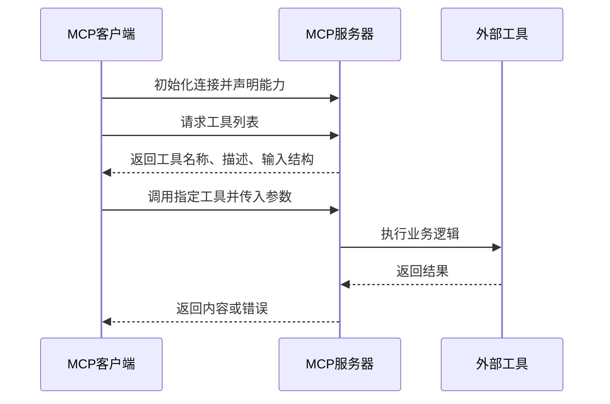
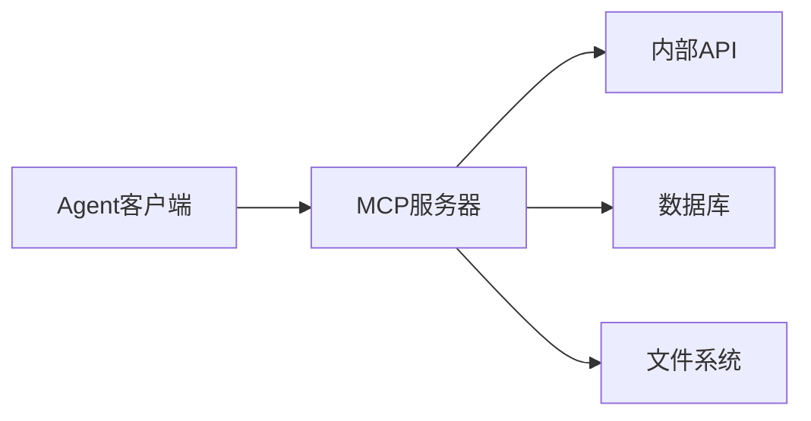

# MCP(Model Context Protocol，模型上下文协议) 协议详解

## 本篇目标

本篇解释 MCP(Model Context Protocol，模型上下文协议) 的定位、架构和核心能力。学完后，你应该能：

- 说明 MCP 为什么像“AI 应用连接外部系统的统一接口”。
- 区分 MCP client(客户端)、MCP server(服务器)、host(宿主应用)。
- 理解 tools(工具)、resources(资源)、prompts(提示模板) 的差异。
- 读懂一次工具发现和工具调用的基本流程。

## 先修知识

建议先读完 `04-工具调用与多模态集成.md`。你需要知道工具调用为什么需要名称、参数 schema(结构约束) 和返回值。

## 为什么需要 MCP

没有 MCP 时，每个 Agent 应用都要为每类外部系统写一套接入逻辑：

```text
应用 A 接数据库
应用 B 接数据库
应用 C 接数据库
应用 A 接搜索
应用 B 接搜索
应用 C 接搜索
```

这会带来重复开发、权限难统一、工具描述不一致、调试困难等问题。

MCP 的目标是提供一个开放标准，让 AI 应用以统一方式连接数据源、工具和工作流。你可以把它理解成 Agent 世界里的“标准扩展接口”。

## 基本架构



角色说明：

| 角色 | 职责 |
| --- | --- |
| host(宿主应用) | 用户直接使用的 AI 应用，例如 IDE、聊天客户端、Agent 平台 |
| MCP client(客户端) | 在宿主应用内管理连接、权限、消息和协议生命周期 |
| MCP server(服务器) | 暴露工具、资源和提示模板，连接真实外部系统 |
| external system(外部系统) | 数据库、文件系统、网页、企业服务、业务 API |

## 三类核心能力

### Tools 工具

tools(工具) 是模型可以调用的动作。工具适合执行查询、计算或业务操作。

例子：

- 查询天气。
- 搜索文档。
- 读取数据库。
- 创建工单。

工具通常有输入 schema，也可以定义输出 schema。对写操作或敏感操作，应要求用户确认。

### Resources 资源

resources(资源) 是可读取的数据。资源更像“上下文材料”，不强调被调用执行。

例子：

- `file:///project/README.md`
- `db://customers/schema`
- `logs://service-a/today`

资源适合提供背景信息、配置、文档、日志、数据快照。

### Prompts 提示模板

prompts(提示模板) 是可复用的消息模板，用来指导模型完成特定任务。

例子：

- 代码评审模板。
- 数据分析模板。
- 周报生成模板。
- 客服回复模板。

提示模板把经验固化为可复用工作流，减少每次从零写 prompt(提示词)。

## 更多协议概念

除了 tools、resources、prompts，学习 MCP 时还会遇到一些重要概念。

| 概念 | 中文理解 | 典型用途 |
| --- | --- | --- |
| sampling | 采样，由服务器请求客户端调用模型 | MCP server 需要模型能力但不直接持有模型密钥 |
| roots | 根目录或根资源范围 | 告诉服务器当前允许访问哪些工作区 |
| elicitation | 信息引出，向用户请求补充信息 | 工具执行前缺参数或需要确认 |
| authorization | 授权 | 远程服务接入时确认用户身份和权限 |
| progress | 进度通知 | 长任务执行时反馈进展 |

这些能力让 MCP 不只是“调用工具”，而是能承载更完整的人机协作流程。

## Tools、Resources、Prompts 的选择

初学者常纠结某个能力到底该做成 tool、resource 还是 prompt。可以按下面规则判断。

| 问题 | 推荐能力 | 原因 |
| --- | --- | --- |
| 需要执行动作吗？ | tool | 工具有输入和执行结果 |
| 只是提供上下文材料吗？ | resource | 资源适合被读取和引用 |
| 是一套可复用任务说明吗？ | prompt | 提示模板适合固化流程经验 |
| 需要创建工单吗？ | tool | 会改变外部系统状态 |
| 需要读取 README 文件吗？ | resource | 文件本身是上下文 |
| 需要套用代码评审流程吗？ | prompt | 这是任务模板 |

示例：

```text
查询订单状态 -> tool
当前项目 README -> resource
“生成日报”的写作模板 -> prompt
```

## MCP Server 设计原则

一个好的 MCP server 应该像一个小而清晰的能力边界。

### 单一职责

不要把完全无关的工具塞进同一个 server。比如天气查询、订单管理、数据库查询最好分开。

好处：

- 权限更容易配置。
- 工具描述更清楚。
- 服务更容易测试。
- 故障影响范围更小。

### 能力可发现

MCP 的价值之一是动态发现能力。server 应该提供准确的工具描述和参数结构。

坏描述：

```text
tool: query
description: 查询东西
```

好描述：

```text
tool: search_policy_documents
description: 在当前用户有权访问的制度文档中检索与问题相关的条款
```

### 权限前置

不要等工具执行后才发现无权访问。server 应该在工具列表、资源列表和实际调用三个阶段都考虑权限。

```text
工具发现阶段：不展示用户无权使用的工具
调用前阶段：校验用户身份和参数范围
调用后阶段：对结果脱敏和审计
```

### 错误语义清楚

工具错误不要只返回“失败”。推荐区分：

| 错误类型 | 示例 |
| --- | --- |
| 参数错误 | 缺少 `order_id` |
| 权限错误 | 用户无权查看该订单 |
| 业务错误 | 订单不存在 |
| 外部依赖错误 | 订单服务超时 |
| 服务器错误 | 工具内部异常 |

清楚的错误能帮助 Agent 决定是追问、重试、转人工还是终止。

## 工具发现与调用流程

一次典型工具调用包括：



关键点：

- 客户端需要能发现工具，而不是写死所有工具。
- 服务端需要声明自己支持哪些能力。
- 工具参数必须校验。
- 工具错误应区分协议错误和执行错误。

## 传输方式

MCP 可以运行在不同 transport(传输方式) 上。常见选择：

| 传输方式 | 适合场景 | 特点 |
| --- | --- | --- |
| STDIO(标准输入输出) | 本地命令行、桌面工具、IDE 插件 | 简单、本地集成方便 |
| HTTP(超文本传输协议) | 远程服务、企业部署 | 易于网关、认证、审计 |
| SSE(Server-Sent Events，服务器发送事件) | 旧式流式连接 | 新项目应优先看官方推荐的 HTTP 方式 |

实际选型要看宿主应用支持什么，以及工具是否需要远程部署。

## 本地 MCP 与远程 MCP

| 部署方式 | 适合场景 | 优点 | 风险 |
| --- | --- | --- | --- |
| 本地 STDIO | IDE 插件、本地文件工具、开发者助手 | 简单、低延迟、易访问本地环境 | 本机权限边界要控制 |
| 本地 HTTP | 本机多个客户端共享服务 | 易调试、可复用 | 端口暴露和认证要处理 |
| 远程 HTTP | 企业工具、云服务、多用户系统 | 易集中治理、权限审计 | 认证、网络、租户隔离更复杂 |

学习阶段优先从本地 STDIO 开始，生产系统更常见的是远程服务加认证和审计。

## MCP 与传统 API 的关系

MCP 并不是替代所有 API，而是在 AI 应用和已有 API 之间加一层适配。



传统 API 通常面向普通程序调用；MCP server 需要额外考虑模型能否理解工具、参数是否适合模型生成、错误是否适合模型恢复。

## 测试 MCP Server

测试不应该只测“函数能跑”，还要测模型能否正确使用它。

测试清单：

- 工具列表是否只包含授权工具。
- 工具描述是否足够让模型正确选择。
- 参数缺失时是否返回可理解错误。
- 权限不足时是否拒绝。
- 工具超时时是否能快速失败。
- 返回结果是否结构化。
- 敏感字段是否脱敏。

## 安全边界

MCP 降低了工具接入成本，也放大了安全设计的重要性。

服务端应做到：

- 校验所有输入。
- 对不同工具配置权限。
- 对敏感工具增加确认和审计。
- 限制访问范围，例如只允许读取指定目录。
- 对工具输出做脱敏和格式校验。

客户端应做到：

- 清楚展示暴露给模型的工具。
- 在敏感操作前显示工具名、参数和影响范围。
- 对工具调用设置 timeout(超时)。
- 不盲目信任工具的注解和返回内容。

## 最小实践

设计一个天气 MCP server：

```text
工具：get_weather
输入：city、date
输出：temperature_c、condition、humidity、updated_at
权限：只读
错误：城市不存在、服务超时、日期超出范围
```

再设计一个客户端调用流程：

1. 连接 MCP server。
2. 获取工具列表。
3. 根据用户问题选择 `get_weather`。
4. 传入城市和日期。
5. 把结构化结果交给 LLM 生成自然语言建议。

## 常见误区

- 把 MCP 当成一个具体模型或 Agent 框架。MCP 是连接协议，不负责替你做任务规划。
- 所有工具都暴露给所有用户。工具发现必须结合权限和场景过滤。
- 工具描述写得过短，导致模型选错工具。
- 只处理成功响应，忽略协议错误、业务错误和超时。
- 认为接入 MCP 就自动安全。协议只提供结构，安全仍要工程实现。

## 自测题

1. tools、resources、prompts 的区别是什么？
2. MCP client 和 MCP server 各自负责什么？
3. 为什么工具列表需要动态发现？
4. 哪些工具调用应该要求人工确认？

## 下一步

继续阅读 `06-MCP实战：构建天气查询 Agent.md`，用 FastMCP 写出一个最小 MCP 工具服务。

## 参考资料

- [MCP 官方介绍](https://modelcontextprotocol.io/docs/getting-started/intro)
- [MCP Tools 规范](https://modelcontextprotocol.io/specification/2025-06-18/server/tools)
- [MCP Resources 规范](https://modelcontextprotocol.io/specification/2025-06-18/server/resources)
- [MCP Prompts 规范](https://modelcontextprotocol.io/specification/2025-06-18/server/prompts)
