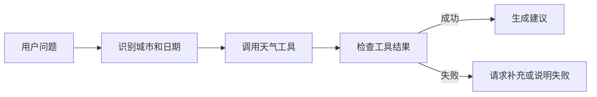

# MCP(Model Context Protocol，模型上下文协议) 实战：构建天气查询 Agent(智能体)

## 本篇目标

本篇用一个天气查询案例，把 MCP(Model Context Protocol，模型上下文协议) 从概念落到代码结构。你将学会：

- 用 FastMCP 声明一个最小 MCP server(服务器)。
- 设计一个只读天气工具。
- 让 Agent 按“理解问题 -> 调用工具 -> 生成建议”的流程工作。

## 先修知识

建议先读完 `05-MCP协议详解.md`。你需要具备基础 Python(一种编程语言) 经验，并理解函数、类型标注和命令行运行。

## 场景说明

目标：用户输入自然语言问题，Agent 可以查询天气并生成建议。

示例：

```text
用户：今晚杭州适合骑车吗？
Agent：需要查询杭州今晚天气。
工具：get_weather(city="杭州", date="今晚")
结果：小雨，18 摄氏度，风力 3 级
Agent：不太适合长距离骑行，建议改为室内训练或短途通勤。
```

这里的天气数据可以先用假数据模拟，重点是把 MCP 工具调用链跑通。

## 最小服务端

FastMCP 是一个用于构建 MCP 应用的 Python 框架。它可以把普通 Python 函数包装成 MCP 工具，并自动生成 schema(结构约束)。

示例文件：`weather_server.py`

```python
from fastmcp import FastMCP

mcp = FastMCP(
    "WeatherService",
    instructions="提供城市天气查询工具，适合回答出行、运动和穿衣建议。",
)


@mcp.tool
def get_weather(city: str, date: str = "today") -> dict:
    """查询指定城市在指定日期的天气。"""
    fake_weather = {
        "上海": {"temperature_c": 22, "condition": "小雨", "humidity": 75},
        "杭州": {"temperature_c": 20, "condition": "多云", "humidity": 68},
        "北京": {"temperature_c": 16, "condition": "晴", "humidity": 35},
    }

    if city not in fake_weather:
        return {
            "ok": False,
            "error": f"暂不支持城市：{city}",
        }

    return {
        "ok": True,
        "city": city,
        "date": date,
        **fake_weather[city],
    }


if __name__ == "__main__":
    mcp.run()
```

## 工具设计解释

这个工具做了几件重要的事：

| 设计点 | 原因 |
| --- | --- |
| `city: str` | 城市是必填参数，便于模型明确传参 |
| `date: str = "today"` | 日期有默认值，降低调用门槛 |
| 返回 `ok` 字段 | 方便 Agent 区分成功和失败 |
| 返回结构化数据 | 便于后续生成建议、做规则判断 |
| 不直接生成长文本 | 工具只提供事实，表达由 Agent 完成 |

## 项目目录建议

即使是小案例，也建议按工程结构组织：

```text
weather-agent/
  README.md
  server.py              # MCP server 入口
  tools/
    weather.py           # 天气工具实现
    air_quality.py       # 空气质量工具实现
  schemas/
    weather.py           # 输入输出结构
  tests/
    test_weather_tool.py
  config.example.toml    # 示例配置
```

这样做的意义：

- 工具实现和服务入口分离。
- 后续接真实 API 时不影响 MCP 声明层。
- 测试可以直接覆盖工具函数。
- 配置文件避免把密钥写死到代码里。

## 真实天气 API 接入思路

接入真实 API(Application Programming Interface，应用程序编程接口) 时，不要直接在工具里拼所有逻辑。推荐拆成三层：

```text
MCP 工具层：校验参数、转换返回
服务层：封装天气业务逻辑
外部 API 层：处理 HTTP 请求、密钥、超时、重试
```

伪代码：

```python
def get_weather(city: str, date: str = "today") -> dict:
    errors = validate_weather_args(city, date)
    if errors:
        return {"ok": False, "error": "; ".join(errors)}

    raw = weather_api.fetch(city=city, date=date, timeout=3)
    normalized = normalize_weather_response(raw)
    return {"ok": True, **normalized}
```

这种结构让你可以单独测试参数校验、外部 API 失败、返回值转换。

## 输入校验规则

天气工具虽然是低风险工具，也应该校验：

| 参数 | 校验规则 | 失败处理 |
| --- | --- | --- |
| city | 非空、长度合理、在支持列表或可解析 | 请求用户补充城市 |
| date | 今天、明天、未来 7 天内 | 告知日期范围 |
| language | 支持中文或英文 | 使用默认中文 |
| unit | 摄氏度或华氏度 | 使用默认摄氏度 |

校验不只是为了避免程序报错，也是为了让 Agent 得到清楚的恢复路径。

## 工具结果归一化

不同天气 API 返回字段不同，Agent 不应该直接依赖第三方原始结构。可以归一化为统一结构：

```json
{
  "ok": true,
  "city": "上海",
  "date": "2026-04-28",
  "temperature_c": 22,
  "condition": "小雨",
  "rain_probability": 0.72,
  "wind_level": 3,
  "humidity": 75,
  "source": "weather_provider",
  "updated_at": "2026-04-28T18:00:00+08:00"
}
```

这样后续的运动建议、穿衣建议、出行建议都能复用同一个结构。

## Agent 调用流程



在真实系统中，MCP client(客户端) 会负责连接服务端、发现工具和发起调用。Agent 的控制器只需要决定“是否调用哪个工具”和“如何使用结果”。

## 客户端伪代码

不同宿主应用的 MCP client 写法不同，下面用伪代码表达核心流程：

```python
async def answer_weather_question(question: str) -> str:
    tool_list = await mcp_client.list_tools()
    decision = await llm.plan(
        question=question,
        available_tools=tool_list,
    )

    if decision.tool_name != "get_weather":
        return "我需要城市和日期才能查询天气。"

    result = await mcp_client.call_tool(
        "get_weather",
        decision.arguments,
    )

    if not result["ok"]:
        return f"查询失败：{result['error']}"

    return await llm.generate_answer(
        question=question,
        evidence=result,
    )
```

## 错误处理

天气 Agent 至少要处理：

| 错误 | 处理方式 |
| --- | --- |
| 用户没说城市 | 追问城市 |
| 城市不支持 | 明确说明暂不支持 |
| 天气服务超时 | 重试一次，仍失败则说明稍后再试 |
| 返回字段缺失 | 不生成建议，记录日志 |
| 用户问医疗建议 | 只给一般生活建议，提示咨询专业人士 |

## 扩展方向

初版跑通后，可以逐步扩展：

1. 接入真实天气 API。
2. 增加空气质量工具。
3. 增加运动建议规则，例如降雨、温度、风力阈值。
4. 支持多城市比较。
5. 为工具增加调用日志和限流。
6. 把服务部署成 HTTP(超文本传输协议) transport(传输方式)。

## 版本迭代路线

| 版本 | 功能 | 学习重点 |
| --- | --- | --- |
| v0.1 | 假数据天气工具 | MCP 工具声明和调用 |
| v0.2 | 真实天气 API | 配置、密钥、超时、错误 |
| v0.3 | 空气质量和运动建议 | 多工具组合和规则判断 |
| v0.4 | 用户偏好记忆 | 个性化建议和记忆写入 |
| v0.5 | 日志和评测集 | 可观测性和质量评估 |

每个版本都应该可运行、可测试，不要一次性堆所有能力。

## 测试用例设计

建议至少准备这些测试：

| 用例 | 输入 | 期望 |
| --- | --- | --- |
| 正常城市 | 上海、today | 返回 `ok=true` |
| 不支持城市 | 火星、today | 返回可理解错误 |
| 缺少城市 | 空字符串、today | 返回参数错误 |
| 日期超范围 | 上海、30 天后 | 拒绝查询 |
| API 超时 | 模拟超时 | 返回超时错误 |
| 字段缺失 | 模拟缺少温度 | 返回结构校验失败 |

## 最小实践

请完成以下练习：

1. 写出 `get_weather` 的输入和输出 schema。
2. 增加一个 `get_air_quality(city)` 工具。
3. 设计一个用户问题：“今晚上海适合夜跑吗？”
4. 写出 Agent 会调用哪些工具，以及怎样合并结果。

参考判断规则：

```text
适合夜跑：无雨，温度 12-26 摄氏度，空气质量良好，风力不大。
谨慎夜跑：小雨、轻度污染、温度偏低或偏高。
不建议夜跑：大雨、重度污染、极端温度、强风。
```

## 常见误区

- 工具直接返回模糊自然语言，导致 Agent 无法稳定判断。
- 不处理未知城市，模型可能继续编造结果。
- 把 API key(接口密钥) 写进代码仓库。
- 没有超时和重试，用户体验不稳定。
- 把只读查询和真实写操作混在一个工具里。

## 自测题

1. 为什么天气工具应该返回结构化数据？
2. MCP server 和 Agent 控制器分别负责什么？
3. 查询失败时为什么不能让模型凭常识回答？
4. 如何判断一个工具是否需要限流？

## 下一步

继续阅读 `07-Agent开发框架（上）LangChain与LangGraph.md`，学习如何用框架组织更复杂的状态和多步骤流程。

## 参考资料

- [FastMCP 欢迎文档](https://gofastmcp.com/getting-started/welcome)
- [FastMCP Server 文档](https://gofastmcp.com/servers/server)
- [MCP Tools 规范](https://modelcontextprotocol.io/specification/2025-06-18/server/tools)
