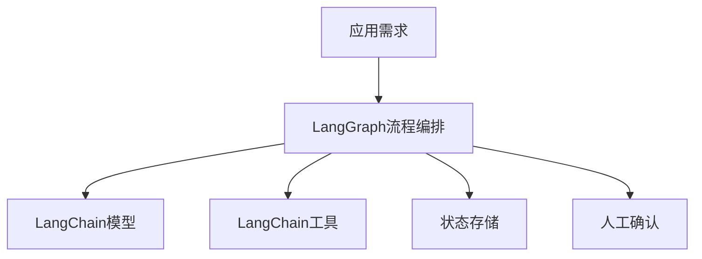
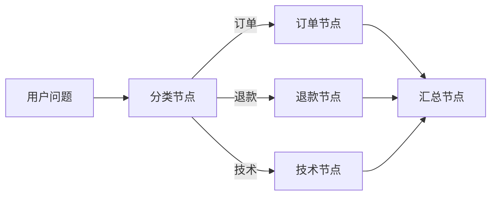

# Agent(智能体) 开发框架（上）：LangChain(大语言模型应用开发框架) 与 LangGraph(图式智能体编排框架)

## 本篇目标

本篇介绍 LangChain(大语言模型应用开发框架) 与 LangGraph(图式 Agent 编排框架) 的职责分工。学完后，你应该能：

- 理解 LangChain 适合处理哪些 Agent 基础能力。
- 理解 LangGraph 为什么适合复杂状态和多步骤流程。
- 判断一个项目是用简单 agent runtime(智能体运行时)，还是上图编排。

## 先修知识

建议先读完工具调用、MCP 和任务规划。你需要知道 Agent 的基本循环：模型选择动作、工具执行、观察结果、继续决策。

## 框架解决什么问题

手写 Agent 循环可以帮助学习，但真实项目很快会遇到：

- 多模型接入。
- 工具 schema 管理。
- 多轮状态保存。
- 流式输出。
- 人工确认。
- 错误重试。
- 评测和追踪。
- 多分支流程。

框架的价值是把这些常见工程问题沉淀为稳定抽象，减少重复造轮子。

## LangChain 的定位

LangChain 主要提供 LLM 应用开发的基础组件：

| 能力 | 说明 |
| --- | --- |
| model(模型) | 统一接入不同模型提供商 |
| messages(消息) | 管理对话消息结构 |
| tools(工具) | 把函数包装成可调用工具 |
| structured output(结构化输出) | 让模型按指定结构返回结果 |
| middleware(中间件) | 在模型调用和工具调用前后插入逻辑 |
| agents(智能体) | 提供生产可用的 Agent 执行循环 |

简单项目可以直接使用 LangChain 的 agent 能力，例如“带几个工具的问答助手”。

## LangChain 常用能力展开

### 模型抽象

模型抽象让你用相对一致的方式调用不同模型。工程价值在于：

- 更容易切换模型。
- 统一消息结构。
- 统一流式输出。
- 便于接入模型网关和监控。

### 工具绑定

工具绑定把普通函数变成模型可选择的能力。关键是函数名、描述、参数类型要清楚。

```python
def search_docs(query: str, limit: int = 5) -> list[dict]:
    """在当前知识库中搜索与问题相关的文档片段。"""
    ...
```

模型不是靠“读代码”理解工具，而是靠工具名称、描述和 schema(结构约束)。因此工具声明本身就是产品设计。

### 结构化输出

structured output(结构化输出) 用于让模型按指定格式返回，例如分类结果：

```json
{
  "intent": "refund",
  "confidence": 0.86,
  "need_human": true
}
```

结构化输出适合意图识别、信息抽取、计划生成、风险判断等环节。

### 中间件

middleware(中间件) 可以在模型调用前后插入逻辑，例如：

- 添加系统上下文。
- 记录日志。
- 动态选择模型。
- 对输出做格式校验。
- 对敏感输入做拦截。

中间件适合承载横切能力，不应该塞业务主流程。

## LangGraph 的定位

LangGraph 更偏向可控的流程编排。它把 Agent 运行过程建模为 graph(图)：

- node(节点)：一个处理步骤，例如调用模型、执行工具、人工审核。
- edge(边)：步骤之间的连接关系。
- state(状态)：在节点之间传递和更新的数据。
- checkpoint(检查点)：保存中间状态，方便恢复、暂停和人工介入。

适合场景：

- 多步骤任务。
- 需要人工确认的流程。
- 多 Agent 协作。
- 需要持久状态和恢复。
- 需要明确分支和循环控制。

## LangGraph 常用能力展开

### State 状态

state(状态) 是节点之间传递的数据。好的状态设计要满足：

- 字段清晰。
- 可序列化。
- 不存过多原始大文本。
- 能支持恢复和审计。

示例：

```python
class CustomerState(TypedDict):
    user_message: str
    intent: str
    evidence: list[dict]
    draft_answer: str
    risk_level: str
```

### Node 节点

node(节点) 应该负责一个明确动作：

- 意图识别节点。
- 检索节点。
- 工具调用节点。
- 审核节点。
- 人工确认节点。
- 输出节点。

节点越清晰，越容易测试和替换。

### Edge 边

edge(边) 描述下一步去哪。复杂系统常用 conditional edge(条件边)：

```text
如果风险低 -> 直接回复
如果风险中 -> 质量审核
如果风险高 -> 人工客服
```

### Interrupt 中断

interrupt(中断) 用于暂停流程，让人确认或补充信息。它是 human-in-the-loop(人在回路中) 的关键机制。

适合：

- 发送邮件前确认。
- 创建订单前确认。
- 生产变更前确认。
- 不确定分类时请用户选择。

### Checkpoint 检查点

checkpoint(检查点) 用于保存执行状态。价值包括：

- 流程中断后恢复。
- 人工处理后继续。
- 排障时回放。
- 长任务不用从头执行。

## 两者关系

可以把 LangChain 理解为“组件层”，LangGraph 理解为“编排层”。



在许多现代 Agent 项目中，LangChain 的 agent runtime 会基于 LangGraph 构建，以便获得图式状态和流程控制能力。

## 什么时候只用 LangChain

适合：

- 工具数量少。
- 任务流程短。
- 不需要复杂人工介入。
- 状态只在当前会话内有效。
- 失败后重新执行成本低。

例子：

- 天气查询助手。
- 简单文档问答。
- 文本分类和结构化抽取。
- 小型内部工具助手。

## 什么时候使用 LangGraph

适合：

- 任务有明确阶段。
- 中间结果需要持久保存。
- 流程中有多次工具调用和条件分支。
- 需要 human-in-the-loop(人在回路中)。
- 需要恢复执行或回放执行过程。

例子：

- 企业客服工单处理。
- 数据分析报告生成。
- 代码修改与测试执行。
- 多 Agent 评审流程。

## 最小实践：客服问题路由

目标：用户输入客服问题，系统判断是订单、退款还是技术支持，再交给对应处理节点。

流程：



状态示例：

```json
{
  "user_message": "我的退款什么时候到账？",
  "category": "退款",
  "evidence": [],
  "draft_answer": ""
}
```

这个例子用 LangChain 也能做，但 LangGraph 的优势是流程边界清晰，后续加人工审核和日志更自然。

## 框架落地结构

推荐目录：

```text
agent_app/
  agents/
    customer_service.py
  graph/
    state.py
    nodes.py
    edges.py
  tools/
    order.py
    knowledge.py
  prompts/
    classify_intent.md
    draft_answer.md
  evals/
    customer_service_cases.jsonl
  observability/
    callbacks.py
```

这个结构把模型提示、工具、图节点和评测分开，后续维护会轻松很多。

## 何时不要用复杂框架

如果任务满足以下条件，手写小控制器可能更好：

- 工具只有 1 到 2 个。
- 没有持久状态。
- 没有人工确认。
- 没有多分支。
- 只是内部验证想法。

框架不是目的，稳定解决问题才是目的。

## 工程建议

- 原型阶段先用最小 Agent 跑通，不要一开始过度编排。
- 当流程出现多个分支、回退和人工确认时，引入 LangGraph。
- 工具、模型、状态和评测要分层，不要全部写在一个节点里。
- 对关键节点记录输入、输出、耗时和错误。
- 对写操作节点增加确认和幂等设计。

## 常见误区

- 以为框架能自动解决业务正确性。框架只提供结构，正确性来自工具、数据和评测。
- 流程图画得很复杂，但每个节点职责不清。
- 把所有上下文都塞进 state，导致状态膨胀。
- 不做版本管理，流程变更后历史执行难以复现。

## 自测题

1. LangChain 和 LangGraph 的职责差异是什么？
2. 什么场景需要 checkpoint(检查点)？
3. 为什么复杂 Agent 适合用图而不是一段 while 循环？
4. 一个节点应该尽量大而全，还是小而清晰？

## 下一步

继续阅读 `08-Agent开发框架（下）生态与选型.md`，横向比较多智能体框架、低代码平台和自研方案。

## 参考资料

- [LangChain Agents 官方文档](https://docs.langchain.com/oss/python/langchain/agents)
- [LangChain Tools 官方文档](https://docs.langchain.com/oss/python/langchain/tools)
- [LangGraph 官方概览](https://docs.langchain.com/oss/python/langgraph/overview)
