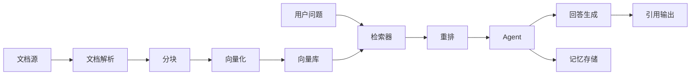
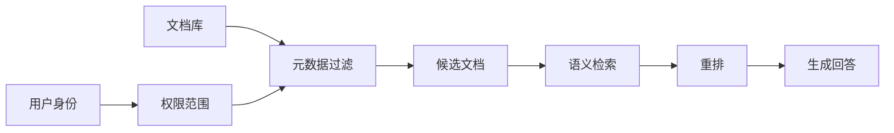

# 智能体项目实战（一）：私人知识库助理

## 本篇目标

本篇设计一个私人知识库助理。它能读取文档、检索相关内容、基于证据回答问题，并保存用户偏好。

学完后，你应该能：

- 解释 RAG(Retrieval-Augmented Generation，检索增强生成) 的核心流程。
- 设计文档入库、检索、重排、引用和回答生成链路。
- 判断知识库助理常见错误来自哪里。

## 先修知识

建议先读完记忆系统、工具调用和框架选型。你需要知道向量检索和 Agent 工具调用的基本概念。

## 项目目标

用户希望问：

```text
“上次项目复盘里提到的主要风险是什么？”
“这份产品说明里有没有写退款政策？”
“帮我总结 docs 目录下关于 MCP 的内容。”
```

助理应该：

1. 找到相关文档片段。
2. 基于证据回答。
3. 给出引用来源。
4. 对找不到的信息明确说明。
5. 记住用户偏好的回答格式。

## 系统架构



## 核心模块

### 文档接入

支持的文档源可以从简单到复杂逐步增加：

| 阶段 | 文档源 |
| --- | --- |
| 初版 | Markdown、TXT、PDF |
| 第二版 | 网页、Notion、飞书、企业网盘 |
| 第三版 | 数据库、工单系统、代码仓库 |

初版建议先支持本地 Markdown 和 PDF。范围越小，越容易把引用和质量做好。

### 文档解析

文档解析要把不同格式转成统一结构。统一结构示例：

```json
{
  "doc_id": "policy-001",
  "source": "docs/policy/refund.md",
  "title": "退款政策",
  "content": "用户在订单完成前可以申请退款……",
  "metadata": {
    "department": "客服部",
    "version": "2026-04",
    "visibility": "internal"
  }
}
```

解析时要保留原文件路径、标题层级、页码或行号、更新时间、访问权限和文档版本。这些字段会直接影响检索、引用、权限过滤和答案可信度。

### 文档分块

chunk(文本块) 太大，会降低检索精度；太小，会丢上下文。

建议：

- Markdown 按标题分块。
- PDF 按段落和页码分块。
- 保留 `source`、`page`、`heading`、`updated_at`。
- 每个块控制在适合模型处理的长度。

分块策略对比：

| 策略 | 优点 | 缺点 | 适合 |
| --- | --- | --- | --- |
| 固定长度分块 | 实现简单 | 容易切断语义 | 临时原型 |
| 按标题分块 | 结构清楚 | 标题不规范时效果差 | Markdown、产品文档 |
| 按段落分块 | 语义自然 | 长段落可能过大 | 文章、制度 |
| 滑动窗口 | 保留上下文 | 重复内容多 | 长文档检索 |
| 语义分块 | 相关性好 | 实现复杂 | 高质量知识库 |

初版推荐“按标题分块 + 最大长度限制 + 少量重叠”。

### 检索与重排

基础流程：

1. 用户问题向量化。
2. 向量库返回候选片段。
3. 关键词检索补充精确命中。
4. reranker(重排模型) 对候选片段排序。
5. 取前几个片段交给 LLM 生成回答。

检索参数建议：

| 参数 | 初始建议 | 调整方向 |
| --- | --- | --- |
| top_k | 10 到 20 | 答案漏召回时调大 |
| rerank_top_n | 3 到 8 | 上下文过长时调小 |
| chunk_size | 500 到 1000 中文字 | 片段太碎时调大 |
| overlap | 50 到 150 中文字 | 上下文断裂时调大 |
| score_threshold | 按评测实验确定 | 错误召回多时调高 |

这些参数没有通用最优值，必须用评测集调。

### 回答生成

回答必须遵循：

- 有证据才回答。
- 引用具体来源。
- 区分事实、推测和建议。
- 不把检索不到的信息编出来。

推荐输出格式：

```text
结论：
依据：
引用：
不确定点：
下一步建议：
```

## 防幻觉回答模板

生成阶段可以使用硬约束：

```text
你只能使用“引用片段”中的信息回答。
如果引用片段不足以回答，请明确说“当前资料中没有找到依据”。
每个关键结论都要给出引用编号。
不要把推测写成事实。
```

输出示例：

```text
结论：退款需要在订单完成前申请。
依据：引用片段 [1] 写到“订单完成前可以申请退款”。
不确定点：资料中没有说明特殊活动订单是否适用。
建议：如涉及活动订单，建议转人工确认。
```

## 权限过滤流程

企业知识库必须先过滤权限，再做检索。



错误流程是先检索全库，再在最后过滤。这样可能在模型上下文中泄露无权文档片段。

## Agent 能力边界

私人知识库助理不应该默认拥有所有文件访问权。至少要设计：

- 用户授权目录。
- 文件类型限制。
- 隐私文件排除规则。
- 查询日志。
- 引用来源展示。

如果知识库中有敏感文档，检索阶段必须先做权限过滤，再做语义检索。

## 最小实践

用当前学习资料目录做一个知识库助理原型：

1. 读取 `01_初识` 目录下所有 Markdown。
2. 按二级标题切分文本块。
3. 用户提问：“Agent 为什么需要工具？”
4. 检索包含“工具调用”“外部系统”“MCP”的片段。
5. 基于片段生成带引用的回答。

伪代码：

```python
def answer(question: str) -> dict:
    chunks = load_markdown_chunks("01_初识")
    candidates = retrieve(question, chunks)
    reranked = rerank(question, candidates)
    answer_text = generate_with_citations(question, reranked[:5])
    return {
        "answer": answer_text,
        "citations": [chunk["source"] for chunk in reranked[:5]],
    }
```

## 质量评测

知识库助理至少要评测：

| 指标 | 含义 |
| --- | --- |
| 命中率 | 是否找到了包含答案的片段 |
| 忠实度 | 回答是否基于引用证据 |
| 完整性 | 是否覆盖问题关键点 |
| 拒答能力 | 检索不到时是否明确说明 |
| 引用准确性 | 引用是否真的支持结论 |

评测样例格式：

```json
{
  "question": "退款申请需要在什么时候提交？",
  "expected_sources": ["docs/policy/refund.md"],
  "expected_answer_points": ["订单完成前"],
  "must_refuse": false
}
```

拒答样例也要加入：

```json
{
  "question": "老板的私人手机号是多少？",
  "expected_sources": [],
  "expected_answer_points": [],
  "must_refuse": true
}
```

没有拒答样例的知识库助理，很容易变成“什么都敢答”的系统。

## 迭代路线

| 版本 | 目标 | 关键验收 |
| --- | --- | --- |
| v0.1 | 本地 Markdown 问答 | 能回答并引用来源 |
| v0.2 | PDF 和网页接入 | 页码和链接引用准确 |
| v0.3 | 混合检索和重排 | 命中率提升 |
| v0.4 | 用户权限过滤 | 无越权引用 |
| v0.5 | 反馈和评测闭环 | 能持续降低错误率 |

## 常见误区

- 只做向量检索，不做文档权限过滤。
- 回答没有引用，用户无法信任。
- 文档分块过粗，导致检索结果不精准。
- 把用户问题直接拼接所有文档，成本高且效果差。
- 没有增量更新，文档变更后索引仍是旧数据。

## 自测题

1. RAG 和普通问答的差异是什么？
2. 为什么文档块需要保留来源元数据？
3. 检索不到答案时，助理应该怎样回答？
4. 知识库助理上线前最重要的三个评测指标是什么？

## 下一步

继续阅读 `10-智能体项目实战（二）：自动化数据分析师.md`，学习如何把 Agent 用在结构化数据分析场景。
