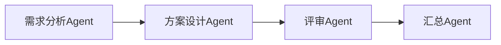
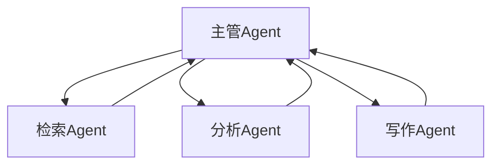

# 多智能体协作与编排

## 本篇目标

本篇讲解 multi-agent(多智能体) 系统的价值、模式和风险。学完后，你应该能：

- 判断什么时候需要多个 Agent。
- 设计角色分工、任务分配和结果整合。
- 处理多 Agent 之间的冲突与成本失控问题。

## 先修知识

建议先读完任务规划、框架选型和两个项目实战。你需要理解单 Agent 的工具调用和状态管理。

## 为什么需要多 Agent

单 Agent 适合目标明确、流程较短的任务。多 Agent 适合任务天然需要不同视角或专业分工。

例子：

- 软件设计评审：架构师、测试专家、安全专家分别评审。
- 数据分析报告：数据工程师查数，分析师解释，审稿人检查。
- 客服系统：意图识别、知识检索、工单处理、质量审核分工。

多 Agent 的价值不是“更多模型更聪明”，而是把复杂任务拆成可管理的职责。

## 常见协作模式

### 顺序流水线

一个 Agent 的输出作为下一个 Agent 的输入。



适合文档生成、代码审查、报告加工。

优点：

- 流程清晰。
- 易于调试。
- 每个阶段可单独测试。

缺点：

- 前面错误会传递到后面。
- 不适合需要频繁来回协商的任务。

### 主管分派

manager agent(主管智能体) 负责拆任务和分配子任务。



适合任务范围不固定、需要动态调度的场景。

主管分派要避免主管过度“脑补”。主管 Agent 应该基于明确状态分配任务，而不是凭空猜测。

### 专家评审

多个 Agent 独立给出判断，再由仲裁者整合。

适合：

- 风险评估。
- 方案比较。
- 文档评审。
- 答案质量检查。

### 黑板模式

blackboard(黑板模式) 指多个 Agent 共享一个状态空间，各自读取和写入中间结果。

适合复杂问题求解，但需要严格控制写入权限和冲突处理。

## 通信协议设计

多 Agent 之间不要随意传递长篇自然语言，建议使用结构化消息。

消息格式示例：

```json
{
  "from": "检索Agent",
  "to": "分析Agent",
  "task_id": "task-001",
  "type": "evidence_result",
  "content": {
    "query": "退款政策",
    "evidence": [
      {
        "source": "refund.md",
        "text": "订单完成前可以申请退款"
      }
    ]
  },
  "confidence": 0.82,
  "warnings": []
}
```

结构化消息的好处：

- 汇总更容易。
- 日志可检索。
- 冲突可定位。
- 可以做自动校验。

## 任务分配原则

设计角色时，要做到：

- 职责单一。
- 输入输出明确。
- 工具权限最小化。
- 结果可验证。
- 成本可预算。

坏设计：

```text
Agent A：什么都能做
Agent B：也什么都能做
Agent C：负责总结所有内容
```

好设计：

```text
检索 Agent：只负责查找证据和引用
分析 Agent：只负责根据证据提炼结论
审查 Agent：只负责检查幻觉、遗漏和风险
汇总 Agent：只负责整合最终答案
```

## 冲突解决

多 Agent 常会给出不同结论。需要提前定义仲裁规则：

| 冲突类型 | 处理方式 |
| --- | --- |
| 事实冲突 | 回到来源证据，优先可信数据源 |
| 建议冲突 | 列出取舍，让人工选择 |
| 风险冲突 | 高风险结论优先进入人工复核 |
| 格式冲突 | 汇总 Agent 按统一模板输出 |
| 工具结果冲突 | 检查时间、参数、权限和缓存 |

不要用“少数服从多数”替代证据审查。多个 Agent 可能共享同一个错误假设。

## 上下文共享策略

多 Agent 不一定都需要完整上下文。

| 策略 | 做法 | 适用 |
| --- | --- | --- |
| 全量共享 | 每个 Agent 都看完整材料 | 小任务、低成本场景 |
| 摘要共享 | 共享经过压缩的任务摘要 | 大多数协作场景 |
| 按需检索 | Agent 自己检索需要的证据 | 知识库和研究任务 |
| 黑板共享 | 所有 Agent 读写共享状态 | 复杂协作，需要强控制 |
| 隔离执行 | 每个 Agent 只看必要输入 | 高敏数据和权限隔离 |

企业系统优先使用“摘要共享 + 按需检索 + 权限隔离”。

## 多 Agent 评测

评测不能只看最终答案，还要看协作过程：

| 指标 | 含义 |
| --- | --- |
| 分工合理性 | 子任务是否清晰且必要 |
| 证据覆盖率 | 是否找到了足够证据 |
| 冲突处理 | 是否识别并解决矛盾 |
| 成本效率 | 多 Agent 是否带来过高成本 |
| 最终质量 | 最终输出是否比单 Agent 更好 |
| 可复盘性 | 是否能还原每个 Agent 的贡献 |

## 成本与延迟

多 Agent 会放大：

- 模型调用次数。
- token(模型处理文本的基本单位) 成本。
- 工具调用次数。
- 状态同步复杂度。
- 调试难度。

优化策略：

- 只有高价值子任务才拆 Agent。
- 并行执行互不依赖的任务。
- 对长上下文做摘要。
- 对专家评审设置轮次上限。
- 缓存检索结果和工具结果。

## 最小实践

设计一个“学习资料评审组”：

```text
资料撰写 Agent：生成初稿
教学设计 Agent：检查学习顺序是否合理
工程实践 Agent：检查示例是否可落地
质量审查 Agent：检查空泛表述和术语格式
汇总 Agent：合并修改建议
```

每个 Agent 的输出必须是结构化的：

```json
{
  "role": "教学设计Agent",
  "findings": [
    {
      "issue": "缺少入门前置知识",
      "suggestion": "在每篇开头补充先修知识"
    }
  ]
}
```

## 常见误区

- 任务很简单也拆多 Agent，增加成本和不稳定性。
- 角色名字很多，但权限和输出没有区别。
- 没有仲裁者，多个结论堆在一起。
- 所有 Agent 共享完整上下文，成本高且容易互相污染。
- 不记录中间过程，问题难以复盘。

## 自测题

1. 多 Agent 相比单 Agent 的真正价值是什么？
2. 什么场景不适合多 Agent？
3. 冲突解决为什么不能只靠投票？
4. 如何限制多 Agent 的成本和轮次？

## 下一步

继续阅读 `12-Agent可靠性与安全防护.md`。多 Agent 能扩展能力，也会放大风险，因此可靠性设计必须前置。
