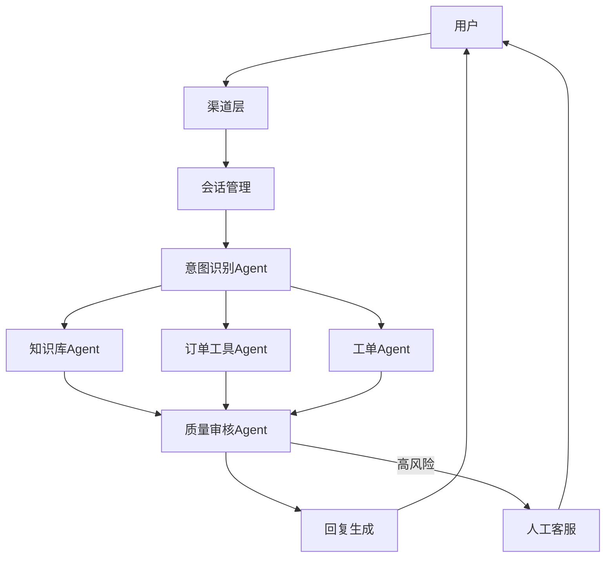

# Agent(智能体) 项目实战（三）：企业级客服系统

## 本篇目标

本篇综合前面所有内容，设计一个企业级客服 Agent 系统。学完后，你应该能：

- 画出客服 Agent 的端到端架构。
- 设计多智能体协作、人工介入和工具权限。
- 建立 A/B test(对照实验) 与效果评估体系。

## 先修知识

建议先读完整个 `01_初识` 目录。你需要理解 Agent 架构、MCP、RAG、多 Agent、可靠性和安全防护。

## 业务目标

企业客服 Agent 的目标不是“替代所有客服”，而是提升响应效率、降低重复问题负担，并让高风险问题顺畅转人工。

典型能力：

- 回答常见问题。
- 查询订单和物流。
- 创建或更新工单。
- 推荐处理流程。
- 总结用户问题给人工客服。
- 记录满意度和失败样本。

## 总体架构



## 核心模块

### 渠道层

负责接入网页、App、企业微信、邮件等渠道。渠道层要统一用户身份、会话 ID 和消息格式。

渠道层还要处理：

- 消息去重。
- 用户登录态。
- 附件上传。
- 多端同步。
- 发送失败重试。
- 会话超时。

### 会话管理

负责保存短期上下文：

- 当前问题。
- 历史消息摘要。
- 已调用工具。
- 当前工单状态。
- 用户情绪和紧急程度。

会话状态示例：

```json
{
  "conversation_id": "conv-001",
  "user_id": "u-123",
  "intent": "refund",
  "risk_level": "medium",
  "last_tools": ["get_order_status"],
  "order_id": "A1024",
  "handoff_required": false,
  "summary": "用户询问订单 A1024 的退款进度"
}
```

### 意图识别 Agent

判断问题类型：

| 意图 | 后续处理 |
| --- | --- |
| 常见问题 | 查知识库 |
| 订单查询 | 调订单工具 |
| 退款售后 | 查政策并可能转人工 |
| 投诉升级 | 优先转人工 |
| 无法识别 | 追问澄清 |

意图识别输出应该结构化：

```json
{
  "intent": "refund_status",
  "confidence": 0.84,
  "entities": {
    "order_id": "A1024"
  },
  "need_human": false,
  "reason": "用户询问退款到账时间，已提供订单号"
}
```

### 知识库 Agent

使用 RAG(Retrieval-Augmented Generation，检索增强生成) 回答制度、流程和产品问题。必须输出引用来源。

### 工具 Agent

封装业务系统工具：

- 查询订单。
- 查询物流。
- 创建工单。
- 修改工单状态。
- 发送通知。

写操作必须加入人工确认或规则确认。

工具权限建议：

| 工具 | 默认权限 | 是否需要确认 |
| --- | --- | --- |
| 查询订单状态 | Agent 可读 | 不需要 |
| 查询物流 | Agent 可读 | 不需要 |
| 查询退款状态 | Agent 可读 | 不需要 |
| 创建工单草稿 | Agent 可写草稿 | 需要用户确认提交 |
| 修改订单地址 | 限人工客服 | 需要人工确认 |
| 发放补偿券 | 限主管或规则引擎 | 需要审批 |

### 质量审核 Agent

审核最终回复：

- 是否基于证据。
- 是否含敏感信息。
- 是否越权承诺。
- 是否需要转人工。
- 是否符合客服语气。

质量审核输出：

```json
{
  "pass": false,
  "issues": ["缺少引用来源", "对退款到账时间表达过于确定"],
  "risk_level": "medium",
  "suggestion": "补充订单工具结果，并改为预计时间表达"
}
```

## 人工介入

human-in-the-loop(人在回路中) 是企业客服 Agent 的关键设计。

必须转人工的情况：

- 用户强烈不满或投诉。
- 涉及退款、赔偿、法律、隐私。
- 工具结果冲突。
- Agent 置信度低。
- 用户连续追问仍未解决。
- 写操作影响真实订单或资金。

转人工时，Agent 应提供摘要：

```text
用户问题：
已确认信息：
已调用工具：
工具结果：
当前判断：
建议客服动作：
风险点：
```

## 客服回复策略

客服 Agent 的回复要兼顾准确、礼貌和可执行。

推荐结构：

```text
先回应用户情绪或诉求。
说明已查询到的信息。
给出下一步动作或选项。
说明不确定点或需要人工处理的原因。
提供继续沟通入口。
```

示例：

```text
我查到订单 A1024 的退款已经提交到支付渠道，当前状态是处理中。通常到账时间取决于支付渠道，系统显示预计 1 到 3 个工作日完成。这个结果来自订单退款状态查询。如果你希望我帮你继续跟进，我可以为你创建一个工单草稿，提交前会先让你确认。
```

## 数据与权限

客服系统涉及大量敏感数据，必须按角色限制：

| 角色 | 可访问数据 | 可执行动作 |
| --- | --- | --- |
| 用户 | 自己的订单和工单 | 查询、提交请求 |
| Agent | 授权范围内的最小数据 | 查询、草拟、低风险创建 |
| 人工客服 | 分配给自己的工单 | 更新状态、联系用户 |
| 管理员 | 配置和审计数据 | 管理权限、查看报表 |

Agent 不应直接读取完整用户数据库，应通过受控 API(Application Programming Interface，应用程序编程接口) 获取最小必要字段。

## 知识库运营

客服 Agent 的质量高度依赖知识库运营：

- 每条政策要有版本和生效时间。
- 过期政策要下线或标记。
- 高频失败问题要补充文档。
- 新活动上线前要更新问答材料。
- 回答错误要能追溯到具体文档片段。

知识库不是一次性导入，必须持续维护。

## 效果评估

客服 Agent 的评估不能只看回答是否流畅。

关键指标：

| 指标 | 含义 |
| --- | --- |
| 首响时间 | 用户首次得到有效回复的时间 |
| 自助解决率 | 不转人工也能解决的比例 |
| 转人工准确率 | 应转人工的问题是否及时转出 |
| 幻觉率 | 无依据或错误承诺的比例 |
| 工具成功率 | 工具调用成功和返回有效结果的比例 |
| 用户满意度 | 用户评价、追问次数、投诉率 |
| 成本 | 单次会话模型和工具成本 |

## 灰度发布

推荐发布节奏：

| 阶段 | 范围 | 策略 |
| --- | --- | --- |
| 内部测试 | 客服团队 | 只辅助，不自动回复用户 |
| 小流量灰度 | 1% 用户 | 低风险问题自动回复 |
| 扩大灰度 | 10% 到 30% 用户 | 监控满意度和转人工 |
| 稳定上线 | 全量低风险问题 | 高风险仍转人工 |
| 持续优化 | 全量 | 基于反馈迭代知识库和工具 |

灰度阶段必须有快速关闭开关。

## A/B 测试

A/B test(对照实验) 可用于比较不同策略：

- 不同检索策略。
- 不同回复模板。
- 是否启用质量审核 Agent。
- 不同转人工阈值。
- 不同模型组合。

实验注意：

- 不要在高风险问题上冒进实验。
- 保证用户群体可比。
- 明确成功指标。
- 保留完整日志。
- 允许快速回滚。

## 最小落地版本

第一版不要追求全自动。推荐 MVP(Minimum Viable Product，最小可行产品)：

1. 支持常见问题知识库问答。
2. 支持只读订单查询。
3. 支持工单创建草稿。
4. 高风险问题全部转人工。
5. 所有回答带来源或工具依据。
6. 收集用户反馈和失败样本。

上线后再逐步增加：

- 更多业务工具。
- 更细权限。
- 多 Agent 审核。
- 自动工单分类。
- 客服辅助总结。
- 质量报表。

## 常见误区

- 一开始就做全自动客服，缺少人工兜底。
- 只优化回答速度，不评估错误承诺和越权操作。
- 知识库没有版本管理，答案依据过期。
- 业务工具权限太大，Agent 能看到过多用户数据。
- 不保存失败样本，系统无法持续变好。

## 自测题

1. 企业客服 Agent 为什么必须有人在回路中？
2. 哪些客服问题必须转人工？
3. 自助解决率高是否一定代表系统好？为什么？
4. 如何设计客服 Agent 的第一版 MVP？

## 下一步

完成本篇后，建议回到 `00-学习导航.md` 的检查清单，尝试为你自己的业务场景画一张 Agent 架构图，并标出工具、记忆、权限、评测和人工介入位置。
