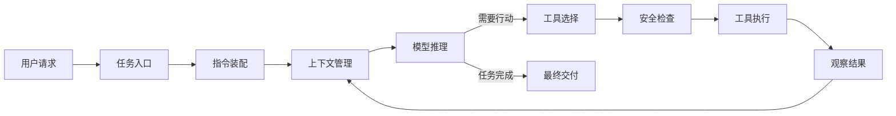
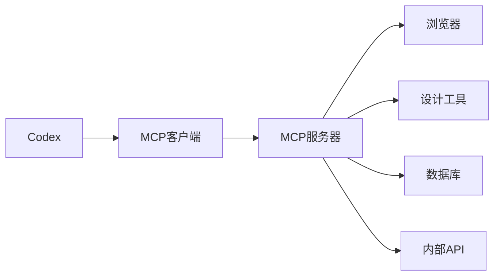

# 用 Codex 拆解 Agent(智能体) 模块与伪代码

## 本篇目标

前面的资料讲了很多 Agent(智能体) 的通用概念：规划、记忆、工具、MCP(Model Context Protocol，模型上下文协议)、安全、评测。它们是对的，但第一次学时容易像在背零件名，不知道这些零件在真实系统里怎么一起工作。

本篇换一种方式：把 Codex 当作一个“会读代码、会改文件、会运行命令、会汇报结果”的真实 Agent 示例来拆。你读完后应该能回答：

1. Codex 这类 Agent 大概由哪些模块组成。
2. 每个模块到底干什么。
3. 一个任务从用户输入到最终交付，中间的伪代码长什么样。

说明：这里不是 Codex 源码逐行讲解，而是基于官方公开资料和本目录已有 Agent 学习资料整理出的工程理解版。资料检索时间为 2026-04-29。

## 先建立一个直觉

你可以先把 Codex 想成一个“带工具箱的程序员助理”：

```text
你提出目标
Codex 读规则和项目文件
Codex 让模型判断下一步
如果需要行动，就调用工具
工具返回结果后，Codex 再判断下一步
直到改完文件、跑完检查、给你总结
```

这就是 Agent loop(智能体循环)：模型不是只回答一次，而是在“推理 -> 调工具 -> 看结果 -> 再推理”之间循环。

## Codex 的总流程



这个图里最重要的不是箭头，而是“工具执行后结果会回到上下文管理，再交给模型”。所以 Agent 的核心不是一个超长 prompt(提示词)，而是一个能循环运行的控制系统。

## 模块一览

| 模块 | 在 Codex 里的样子 | 主要职责 |
| --- | --- | --- |
| 任务入口模块 | CLI(Command Line Interface，命令行界面)、IDE(Integrated Development Environment，集成开发环境)、Codex app(桌面应用)、Web 任务 | 接收用户目标、当前目录、附件、图片、线程信息 |
| 指令装配模块 | 系统规则、开发者规则、用户规则、`AGENTS.md`、技能说明 | 把“应该怎么工作”整理成模型能读的输入 |
| 上下文与记忆模块 | 当前线程、历史消息、工具结果、压缩摘要、可选 memories(记忆) | 让模型知道已经发生了什么，并避免上下文爆掉 |
| 模型推理模块 | Codex 模型 + Responses API(响应接口) | 判断下一步：回答、提问、计划、调用工具 |
| 规划模块 | `update_plan`、任务清单、停止条件 | 把大任务拆成可检查的小步骤 |
| 工具注册模块 | shell(命令行工具)、apply_patch(补丁工具)、web search(网页搜索)、MCP 工具、浏览器工具 | 告诉模型当前可以使用哪些能力 |
| 工具执行模块 | 运行命令、读文件、改文件、调用 MCP server(服务器) | 把模型提出的动作变成真实执行结果 |
| 文件编辑模块 | 补丁、格式化、局部修改、避免覆盖用户改动 | 安全地修改工作区文件 |
| 安全与审批模块 | sandbox(沙箱)、approval policy(审批策略)、网络权限、写入边界 | 限制 Agent 能做什么，必要时让用户确认 |
| 验证与交付模块 | 测试、lint(代码风格检查)、截图、日志、最终总结 | 证明任务确实完成，并告诉用户改了什么 |
| 扩展模块 | MCP、skills(技能)、subagents(子智能体) | 给 Codex 增加外部工具、专业流程和并行能力 |

接下来逐个拆。

## 1. 任务入口模块

任务入口模块负责把人的请求变成一次 Agent 任务。

在 Codex CLI(命令行版 Codex) 中，入口可能是一句命令：

```text
codex "帮我修复登录接口的单元测试"
```

在 Codex app(桌面应用) 中，入口可能是当前线程的一条消息、一个工作区、一个图片附件，或者一个本地浏览器页面。

它要收集的最小信息包括：

| 信息 | 例子 | 为什么需要 |
| --- | --- | --- |
| 用户目标 | “新增一个学习文档” | 决定任务方向 |
| 当前目录 | `D:\code\git_code\ai\LLM\agent` | 知道从哪里读文件、写文件 |
| shell(命令行外壳) | PowerShell、bash | 知道命令怎么执行 |
| 附件 | 图片、文档、日志 | 作为额外输入 |
| 当前权限 | 是否能写文件、是否能联网 | 决定能否自动执行动作 |

伪代码：

```python
def receive_task(raw_user_message, runtime):
    return {
        "user_goal": raw_user_message,
        "cwd": runtime.current_working_directory,
        "shell": runtime.shell,
        "attachments": runtime.attachments,
        "thread_id": runtime.thread_id,
        "permission_mode": runtime.permission_mode,
    }
```

这个模块不负责“聪明”，它负责把任务现场拍清楚。现场越清楚，后面的模型越不容易猜。

## 2. 指令装配模块

指令装配模块负责回答一个问题：模型在这次任务里应该遵守哪些规则？

Codex 会把多层规则放进输入中，常见来源包括：

| 指令来源 | 作用 |
| --- | --- |
| system(系统) 指令 | 平台级最高规则 |
| developer(开发者) 指令 | 当前产品或工具的工作方式 |
| 用户当前请求 | 这次任务真正要做什么 |
| `AGENTS.md` | 项目或目录级协作规范 |
| 环境上下文 | 当前目录、shell、时间、权限 |
| skills(技能) 元信息 | 告诉模型有哪些可按需加载的专业流程 |

`AGENTS.md` 的价值是让项目规则落在仓库里。例如本目录要求“markdown 中写中文”“流程图中也写中文”。Codex 在开始工作前会读取这些规则，把它们放到模型输入里。

伪代码：

```python
def build_instruction_stack(task):
    instructions = []

    instructions.append(load_system_rules())
    instructions.append(load_developer_rules())
    instructions.append(load_permission_rules(task.permission_mode))

    project_rules = find_agents_md_files(
        codex_home="~/.codex",
        project_root=find_git_root(task.cwd),
        cwd=task.cwd,
    )
    instructions.extend(project_rules)

    skills = list_available_skills()
    instructions.append(summarize_skill_metadata(skills))

    instructions.append({
        "type": "environment_context",
        "cwd": task.cwd,
        "shell": task.shell,
    })

    instructions.append({
        "type": "user_request",
        "content": task.user_goal,
    })

    return instructions
```

这里有一个初学者很容易忽略的点：Agent 的“性格”和“工作方式”不只来自模型本身，还来自指令装配。一个项目里写了清楚的 `AGENTS.md`，Agent 就更像团队成员；没有这些规则，它只能靠通用经验猜。

## 3. 上下文与记忆模块

上下文与记忆模块负责管理“模型这次能看到什么”。

LLM(Large Language Model，大语言模型) 每次推理都依赖输入上下文。上下文太少，模型会遗漏信息；上下文太多，又会浪费成本，还可能把无关日志当成重点。

Codex 这类系统通常会管理三类内容：

| 内容 | 例子 | 生命周期 |
| --- | --- | --- |
| 当前线程上下文 | 用户消息、模型回答、工具调用、工具输出 | 当前会话内 |
| 工作状态 | 已完成步骤、失败原因、修改过的文件 | 当前任务内 |
| 长期记忆 | 用户偏好、常用流程、项目惯例 | 跨线程，可选开启 |

当线程变长时，需要 compaction(压缩)：把一长串对话和工具输出压成较短摘要，让模型继续工作。

伪代码：

```python
def build_model_context(thread, instructions, task_state):
    context = []

    context.extend(instructions)
    context.extend(thread.recent_messages)
    context.extend(task_state.important_observations)

    if memory_enabled():
        memories = retrieve_relevant_memories(task_state)
        context.extend(memories)

    if token_count(context) > CONTEXT_LIMIT:
        context = compact_context(context)

    return context
```

压缩的关键不是“变短”这么简单，而是保留对继续任务有用的信息，例如：

- 用户最终要什么。
- 已经读过哪些文件。
- 已经改过哪些文件。
- 哪些命令失败了。
- 哪些约束不能违反。

## 4. 模型推理模块

模型推理模块负责做判断。它通常通过 Responses API(响应接口) 之类的模型接口，把上下文、工具列表、用户输入发给模型，然后接收模型输出。

模型输出通常分两类：

| 输出类型 | 含义 | 下一步 |
| --- | --- | --- |
| assistant message(助手消息) | 模型认为可以回答用户了 | 进入最终交付或追问用户 |
| tool call(工具调用) | 模型认为需要执行一个动作 | 进入工具执行模块 |

伪代码：

```python
def ask_model(context, tools):
    response_stream = responses_api_create(
        input=context,
        tools=tools,
        stream=True,
    )

    events = []
    for event in response_stream:
        publish_to_ui(event)
        events.append(event)

    return parse_model_decision(events)
```

如果模型说“我要读 `README.md`”，这还不是动作本身。它只是提出一个工具调用请求。真正执行要交给后面的工具执行模块。

## 5. 规划模块

规划模块负责把目标拆成步骤，并决定什么时候停。

例如用户说：

```text
阅读当前文件夹下的文档，然后新增一个更好懂的 Codex 示例文件。
```

Codex 的计划可以是：

1. 列出当前目录文档。
2. 阅读核心学习资料。
3. 搜集 Codex 官方资料。
4. 新增一篇示例文档。
5. 检查格式和链接。
6. 汇报结果。

伪代码：

```python
def plan_next_step(state):
    if not state.files_listed:
        return ToolCall("shell", {"command": "list files"})

    if state.core_docs_read is False:
        return ToolCall("shell", {"command": "read selected markdown files"})

    if state.needs_current_codex_info and not state.web_researched:
        return ToolCall("web_search", {"query": "official Codex agent loop docs"})

    if not state.target_doc_created:
        return ToolCall("apply_patch", {"patch": create_markdown_patch(state)})

    if not state.checked:
        return ToolCall("shell", {"command": "inspect new markdown"})

    return FinalAnswer(summarize_work(state))
```

规划模块要特别关注停止条件。没有停止条件的 Agent 容易陷入“再查一点、再改一点、再跑一次”的循环。

常见停止条件：

| 停止条件 | 示例 |
| --- | --- |
| 任务完成 | 新文件已创建，内容满足要求 |
| 信息不足 | 缺少必须由用户确认的目标 |
| 权限不足 | 需要访问被禁止的目录 |
| 风险过高 | 要删除文件、改生产配置、发送外部消息 |
| 预算到达 | 工具调用次数或模型调用次数超过限制 |

## 6. 工具注册模块

工具注册模块负责告诉模型：你现在能用哪些工具，每个工具怎么调用。

Codex 常见工具包括：

| 工具 | 做什么 |
| --- | --- |
| shell(命令行工具) | 列文件、读文件、跑测试、执行脚本 |
| apply_patch(补丁工具) | 以补丁形式新增或修改文件 |
| web search(网页搜索) | 查找最新资料或官方文档 |
| MCP 工具 | 连接第三方工具、浏览器、Figma、数据库等 |
| image generation(图像生成) | 生成或编辑图片资源 |
| browser(浏览器工具) | 打开本地页面、点击、截图、检查 UI |

每个工具都要有清晰的 schema(结构约束)，让模型知道参数格式。

伪代码：

```python
def build_tool_registry(config, runtime):
    tools = []

    tools.append({
        "name": "shell",
        "description": "运行本地命令并返回输出",
        "parameters": {
            "command": "string",
            "workdir": "string",
            "timeout_ms": "integer",
        },
    })

    tools.append({
        "name": "apply_patch",
        "description": "用补丁新增、删除或更新文件",
        "parameters": {
            "patch": "string",
        },
    })

    if config.web_search_enabled:
        tools.append({"name": "web_search", "description": "搜索网页资料"})

    for server in config.mcp_servers:
        tools.extend(discover_mcp_tools(server))

    return sort_stably(filter_by_permission(tools, runtime.user))
```

最后一行的 `sort_stably` 很重要。工具列表如果每次顺序都变，模型输入的前缀就不稳定，缓存效果会变差。

## 7. 工具执行模块

工具执行模块负责把模型的工具调用变成真实动作。

模型可能输出：

```json
{
  "tool": "shell",
  "arguments": {
    "command": "Get-ChildItem -Recurse -File",
    "workdir": "D:\\code\\git_code\\ai\\LLM\\agent"
  }
}
```

执行模块要做的不是立刻运行，而是先检查：

- 这个工具存在吗？
- 参数合法吗？
- 当前权限允许吗？
- 是否需要用户确认？
- 超时时间合理吗？
- 结果要不要截断或脱敏？

伪代码：

```python
def execute_tool_call(tool_call, runtime):
    tool = runtime.tools.get(tool_call.name)
    if tool is None:
        return ToolResult(error="未知工具")

    validation_error = validate_arguments(tool, tool_call.arguments)
    if validation_error:
        return ToolResult(error=validation_error)

    risk = assess_tool_risk(tool_call, runtime)
    if risk.requires_approval:
        approved = ask_user_for_approval(tool_call, risk.reason)
        if not approved:
            return ToolResult(error="用户拒绝执行")

    raw_result = tool.run(tool_call.arguments)

    return ToolResult(
        output=truncate_if_needed(raw_result.output),
        error=raw_result.error,
        metadata={
            "exit_code": raw_result.exit_code,
            "duration_ms": raw_result.duration_ms,
        },
    )
```

工具结果会作为 observation(观察结果) 放回上下文。模型下一轮会基于这个结果继续判断。

## 8. 文件编辑模块

Codex 是编码 Agent，所以文件编辑是核心能力。编辑模块要解决两个问题：

1. 改得准：只改和任务有关的地方。
2. 改得稳：不覆盖用户或其他工具刚做的改动。

一个常见做法是用 patch(补丁) 表达修改，而不是让模型直接“重写整个文件”。

伪代码：

```python
def edit_file_safely(target_file, desired_change):
    original = read_file(target_file)
    patch = generate_patch(original, desired_change)

    if patch_touches_unrelated_lines(patch):
        patch = shrink_patch_scope(patch)

    if file_changed_since_read(target_file, original):
        latest = read_file(target_file)
        patch = rebase_patch(patch, latest)

    apply_patch(patch)
    return inspect_file(target_file)
```

真实协作中，文件编辑模块还应该注意：

- 修改前理解周围代码或文档结构。
- 不做无关格式化。
- 不删除用户已有内容。
- 新增内容要符合当前目录风格。
- 修改后能说明为什么这么改。

本次新增文档就是这个模块的简单例子：先读已有学习资料，再在同一目录下按编号新增文件，而不是另起一个不相干目录。

## 9. 安全与审批模块

安全与审批模块决定 Agent 能不能自动执行某个动作。

Codex 的安全边界通常由两层组成：

| 控制 | 解决什么问题 |
| --- | --- |
| sandbox(沙箱) | 技术上限制命令能访问哪里、能不能联网、能不能写文件 |
| approval policy(审批策略) | 决定什么时候必须停下来问用户 |

例如：

- 读当前工作区文件：通常可以自动执行。
- 修改当前工作区文件：取决于权限模式。
- 访问网络：默认可能需要配置或审批。
- 删除大量文件：应该被拦住或要求明确确认。
- 执行未知脚本：需要看风险和权限。

伪代码：

```python
def assess_tool_risk(tool_call, runtime):
    if tool_call.name == "shell":
        command = tool_call.arguments["command"]

        if writes_outside_workspace(command, runtime.workspace):
            return Risk("需要审批", "命令会写出当前工作区")

        if uses_network(command) and not runtime.network_allowed:
            return Risk("需要审批", "命令需要网络访问")

        if looks_destructive(command):
            return Risk("需要审批", "命令可能删除或覆盖数据")

    if tool_call.name.startswith("mcp__"):
        if mcp_tool_has_destructive_annotation(tool_call):
            return Risk("需要审批", "MCP 工具声明有破坏性副作用")

    return Risk("可自动执行", "低风险")
```

这也是为什么学习 Agent 时不能只学模型和 prompt。一个能真实行动的 Agent，安全模块是系统的一部分，不是上线前才补的装饰。

## 10. 验证与交付模块

验证与交付模块负责回答：“我怎么知道任务真的完成了？”

对代码任务，验证可能是：

- 运行单元测试。
- 运行 lint(代码风格检查)。
- 启动服务。
- 用浏览器截图检查页面。
- 查看 git diff(代码差异)。

对文档任务，验证可能是：

- 检查文件是否存在。
- 检查 Markdown 标题、表格、代码块。
- 检查术语是否首次解释。
- 检查链接是否有效。
- 检查是否符合项目文档风格。

伪代码：

```python
def verify_and_deliver(state):
    checks = infer_checks_from_changes(state.changed_files)
    results = []

    for check in checks:
        result = run_check(check)
        results.append(result)
        if result.failed and check.required:
            return FinalAnswer(
                status="未完全完成",
                message=explain_failure(result),
                changed_files=state.changed_files,
            )

    return FinalAnswer(
        status="完成",
        message=summarize_changes(state.changed_files, results),
        changed_files=state.changed_files,
    )
```

最终交付不是简单说“好了”，而是要告诉用户：

- 新增或修改了哪些文件。
- 覆盖了哪些内容。
- 做了哪些检查。
- 如果有检查没跑，原因是什么。

## 11. MCP 扩展模块

MCP(Model Context Protocol，模型上下文协议) 可以理解为“给 Agent 插外部工具的标准接口”。

没有 MCP 时，每个 Agent 都要自己接浏览器、数据库、设计工具、内部系统。用了 MCP 后，Codex 可以通过统一方式发现和调用外部工具。



伪代码：

```python
def discover_mcp_tools(server):
    connection = connect_to_mcp_server(server)
    capabilities = connection.initialize()
    tools = connection.list_tools()

    return [
        convert_mcp_tool_to_model_tool(tool)
        for tool in tools
        if user_can_use(tool)
    ]


def call_mcp_tool(tool_call):
    server_name, tool_name = parse_mcp_tool_name(tool_call.name)
    server = get_mcp_connection(server_name)
    return server.call_tool(tool_name, tool_call.arguments)
```

MCP 的学习重点不是“协议字段背下来”，而是理解边界：

- Codex 负责把 MCP 工具放进工具列表。
- MCP server 负责连接真实外部系统。
- 权限、脱敏、超时、错误语义仍然要认真设计。

## 12. Skills 扩展模块

skills(技能) 是把一套可复用工作流打包给 Codex 使用。

例如一个“写学习文档”的技能，可以告诉 Codex：

- 文档放在哪里。
- 结构应该是什么。
- 每篇要包含目标、概念、示例、实践、自测。
- 什么时候应该读取额外参考资料。

Codex 不会一开始把所有技能全文塞进上下文，而是先看技能名称、描述、路径。只有当任务匹配时，再读取完整 `SKILL.md`。这叫 progressive disclosure(渐进式披露)，目的是节省上下文。

伪代码：

```python
def select_relevant_skills(user_goal, available_skills):
    selected = []
    for skill in available_skills:
        if goal_matches_description(user_goal, skill.description):
            selected.append(skill)
    return selected


def load_skill_instructions(selected_skills):
    instructions = []
    for skill in selected_skills:
        instructions.append(read_file(skill.path / "SKILL.md"))
    return instructions
```

本篇文档就是在“学习资料生成”这个技能思路下完成的：先读项目现有资料，再新增一篇更容易理解的学习材料。

## 13. Subagents 扩展模块

subagents(子智能体) 是把一个大任务拆给多个 Agent 并行处理。

适合场景：

- 一个 Agent 读代码主线，另一个 Agent 查测试。
- 一个 Agent 做安全评审，另一个 Agent 做性能评审。
- 多个 Agent 分别读不同模块，最后汇总。

不适合场景：

- 任务很小。
- 多个 Agent 会同时改同一个文件。
- 主 Agent 下一步马上依赖某个结果，等待反而更慢。

伪代码：

```python
def maybe_spawn_subagents(task):
    if not task.user_explicitly_requested_parallel_agents:
        return []

    subtasks = split_into_independent_subtasks(task)
    agents = []

    for subtask in subtasks:
        agents.append(spawn_agent(
            role=subtask.role,
            instructions=subtask.instructions,
            write_scope=subtask.write_scope,
        ))

    return agents


def merge_subagent_results(agents):
    summaries = [wait_for_summary(agent) for agent in agents]
    return synthesize_main_thread_decision(summaries)
```

子智能体不是“越多越好”。它的价值是把嘈杂探索放到支线里，让主线程保留需求、决策和最终结果。

## 把所有模块串起来

下面是一份完整但简化的 Codex 风格 Agent 主循环。

```python
def run_codex_like_agent(raw_user_message, runtime):
    task = receive_task(raw_user_message, runtime)
    instructions = build_instruction_stack(task)
    tools = build_tool_registry(runtime.config, runtime)

    thread = load_thread(task.thread_id)
    state = {
        "changed_files": [],
        "important_observations": [],
        "step_count": 0,
        "done": False,
    }

    while state["step_count"] < runtime.max_steps:
        context = build_model_context(thread, instructions, state)
        decision = ask_model(context, tools)

        if decision.type == "assistant_message":
            thread.append(decision)
            return deliver_to_user(decision.content, state)

        if decision.type == "tool_call":
            risk = assess_tool_risk(decision.tool_call, runtime)
            if risk.requires_approval:
                approved = ask_user_for_approval(decision.tool_call, risk.reason)
                if not approved:
                    return deliver_to_user("操作已取消。", state)

            result = execute_tool_call(decision.tool_call, runtime)
            thread.append(decision.tool_call)
            thread.append(result)

            state["important_observations"].append(summarize_tool_result(result))
            state["changed_files"].extend(detect_changed_files(result))
            state["step_count"] += 1

            if token_count(thread) > runtime.auto_compact_limit:
                thread = compact_thread(thread)

            continue

    return deliver_to_user("已达到最大步骤数，请确认是否继续。", state)
```

如果把这段伪代码压成一句话：

```text
Codex = 指令装配 + 上下文管理 + 模型推理 + 工具执行 + 安全边界 + 验证交付
```

## 用本次任务套一遍

你这次的需求是：

```text
阅读当前文件夹下的文档，然后新增一个更好懂的 Codex 示例学习文件。
```

对应模块执行如下：

| 步骤 | 模块 | 发生了什么 |
| --- | --- | --- |
| 1 | 任务入口 | 读取用户目标、当前目录、shell、日期 |
| 2 | 指令装配 | 读取本目录文档规则：Markdown 写中文、图中写中文 |
| 3 | 工具注册 | 准备 shell、web search、apply_patch 等工具 |
| 4 | 规划 | 确定先读文档，再搜官方资料，最后新增文件 |
| 5 | 工具执行 | 列目录、读取核心 Markdown、搜索 Codex 官方资料 |
| 6 | 文件编辑 | 新增 `18-用Codex拆解Agent模块与伪代码.md` |
| 7 | 验证 | 检查新文件是否存在、结构是否符合要求 |
| 8 | 交付 | 告诉用户新增了什么、覆盖哪些内容 |

这比抽象地说“Agent 有规划、记忆、工具”更容易理解，因为你能看到每个模块在真实任务中都做了什么。

## 初学者最容易混淆的 6 个点

### 1. 模型不是 Agent 的全部

模型负责判断和生成，但 Agent 还需要控制器、工具、安全、上下文、验证。没有这些，最多是一个会说话的模型调用。

### 2. 工具调用不是模型自己执行

模型只是输出“想调用什么工具、参数是什么”。真正执行命令、改文件、读网页的是外层程序。

### 3. 记忆不是把所有历史都塞进去

有效记忆是“按任务取回有用信息”。无关日志、失败命令、过期资料会污染上下文。

### 4. 规划不是越细越好

好计划的标准是每一步都能验证。过粗会失控，过细会浪费。

### 5. MCP 不是 Agent 框架

MCP 是连接工具和上下文的协议。它不替你做任务规划，也不自动保证安全。

### 6. 安全不是上线后再补

只要 Agent 能行动，就要有 sandbox(沙箱)、权限、审批、日志和失败策略。

## 最小练习

为了真正理解本篇，你可以做一个纸上练习。

任务：

```text
让一个 Agent 帮你把 `README.md` 改得更适合新手阅读。
```

请写出：

1. 任务入口要收集哪些信息？
2. 需要读取哪些项目规则？
3. 需要哪些工具？
4. 修改前要读哪些文件？
5. 哪些动作需要审批？
6. 修改后怎么验证？
7. 最终怎么汇报？

参考答案方向：

```text
入口：用户目标、当前目录、shell
规则：AGENTS.md、README 原有风格
工具：列文件、读文件、补丁修改、可能运行 Markdown 检查
读取：README、文档目录、贡献说明
审批：删除大段内容、联网安装检查工具
验证：检查标题层级、链接、示例命令、git diff
汇报：说明改了哪些段落、为什么更适合新手
```

## 继续学习建议

读完本篇后，再回看前面的资料会更轻松：

- 回看 `01-Agent概念与架构总览.md`：把“四大核心模块”对应到 Codex 模块表。
- 回看 `02-任务规划与推理引擎.md`：把 ReAct(推理与行动) 循环对应到主循环伪代码。
- 回看 `03-记忆系统设计.md`：重点理解上下文压缩和长期记忆的区别。
- 回看 `04-工具调用与多模态集成.md`：重点看工具 schema、权限和错误回退。
- 回看 `05-MCP协议详解.md`：把 MCP 理解成“给 Codex 插外部工具的标准接口”。

## 参考资料

- [Codex CLI 官方文档](https://developers.openai.com/codex/cli)
- [Unrolling the Codex agent loop](https://openai.com/index/unrolling-the-codex-agent-loop/)
- [Custom instructions with AGENTS.md](https://developers.openai.com/codex/guides/agents-md)
- [Agent approvals & security](https://developers.openai.com/codex/agent-approvals-security)
- [Codex Sandbox](https://developers.openai.com/codex/concepts/sandboxing)
- [Codex MCP](https://developers.openai.com/codex/mcp)
- [Codex Memories](https://developers.openai.com/codex/memories)
- [Codex Skills](https://developers.openai.com/codex/skills)
- [Codex Subagents](https://developers.openai.com/codex/concepts/subagents)
