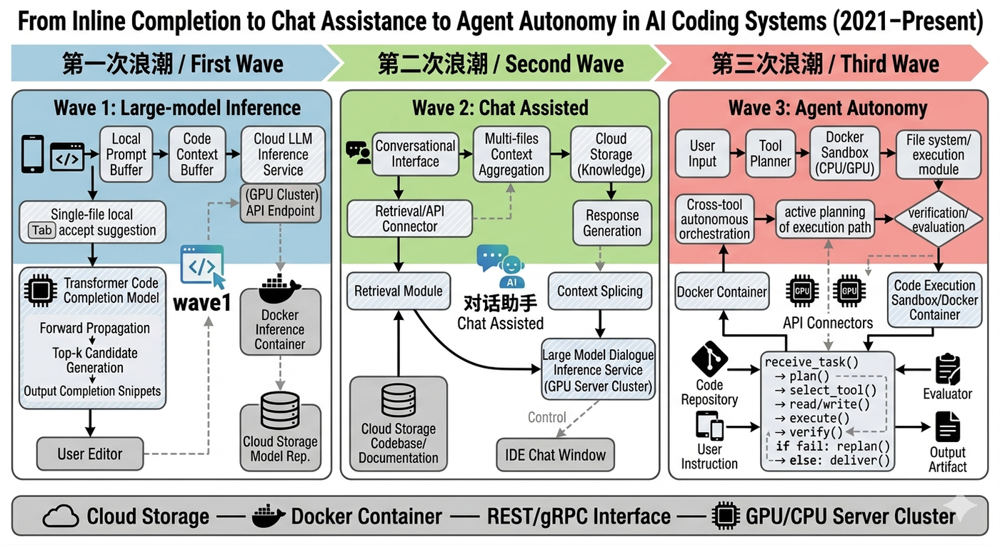
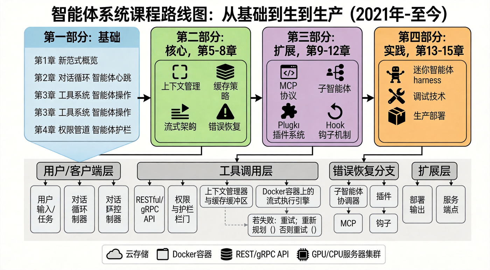

# 前言

## 御舆——从造车到造 Agent

> *"一器而工聚焉者，车为多。"* ——《周礼·考工记》

两千三百年前，《考工记》的作者写下了这句话。在先秦时代，马车是人类制造过的最复杂的系统工程——没有之一。

造一辆马车需要多少工种？木工造**舆**（车厢），金工铸**軎辖**（车轴固定件），皮工制**鞁**（挽具），漆工饰表面，轮人造**辐**（车轮辐条）……《考工记》所言"天有时，地有气，材有美，工有巧"，四者合一，方成良车。

这些构件各有深意，且与本书所剖析的 Agent Harness 架构形成了跨越千年的隐喻对应：

| 古代马车 | 含义 | Agent Harness |
|:--------:|------|:-------------:|
| **舆** | 车厢，承载乘者的核心结构 | **Harness 运行时**——承载 LLM 的工程框架 |
| **辕** | 车辕，定方向、传动力 | **对话循环**——驱动 Agent 前行的主循环 |
| **辐** | 车轮辐条，连接轴心与外圈 | **工具系统**——连接 LLM 与外部世界的桥梁 |
| **軎辖** | 固定车轴的销钉，防止车轮脱落 | **权限管线**——约束 Agent 行为的安全机制 |
| **轼** | 车前横木，乘者扶轼以致敬 | **钩子系统**——生命周期中的礼仪性扩展点 |
| **御** | 驾驭马车的车夫技艺 | **架构认知**——理解并掌控 Agent 系统的能力 |

孔子以车喻信："大车无輗，小车无軏，其何以行之哉？"——车少了固定的销钉就无法行驶，正如 Agent 少了权限护栏就不可信赖。《考工记》载"辀欲颀典，辀深则折，浅则负"——车辕的弯曲度必须恰到好处，过深则断、过浅则不堪重负，正如 Agent 的自主性设计必须在能力与安全之间寻找平衡点。

甲骨文中的"舆"字，罗振玉释为"象众手造车之形"——许多双手共同造出一辆车。今天，构建一个生产级 Agent 系统同样需要"众手"：工具系统、权限管线、上下文管理、状态持久化、流式通信、错误恢复……每一个子系统都是一位匠人的手艺，合在一起才能让智能体真正上路。

**古人御舆，驾驭天地之间最精密的机械；今人御舆，驾驭硅基时代最复杂的智能体系统。**

这就是本书得名 **御舆** 的由来，也是读者们称之为 **舆书** 的缘起。

---

## 为什么写这本书

### AI 编程范式的三次浪潮

回顾过去几年，AI 辅助编程经历了三次清晰的浪潮，每一次都深刻改变了开发者与代码之间的关系：

**第一次浪潮（2021-2022）：代码补全时代。** GitHub Copilot 的诞生标志着 AI 正式进入开发者的日常工作流。这一阶段的核心范式是"行内补全"——AI 基于当前文件上下文预测下一行或下一个代码块，开发者通过 Tab 键接受建议。这是一种高度被动、高度局部化的辅助模式：AI 看到的是光标前后的几十行代码，输出的是片段级建议。它不会跨文件推理，不会理解项目结构，更不会主动执行操作。

**第二次浪潮（2023-2024）：对话式助手时代。** 随着上下文窗口的扩展和多文件感知能力的出现，AI 工具从"补全框"升级为"对话框"。Cursor、Windsurf、Continue 等编辑器嵌入式工具百花齐放，开发者可以通过自然语言描述需求，AI 跨多个文件生成代码。但这个阶段的 AI 仍然受限于编辑器边界——它能写代码，但不能运行代码；能建议测试，但不能执行测试；能发现问题，但不能修复后验证。开发者在 AI 和终端之间不断切换，充当着人肉"胶水"的角色。

**第三次浪潮（2025 至今）：自主智能体时代。** 我们正在经历的范式转移远比前两次深刻。AI 不再是"坐在编辑器里等你提问的助手"，而是"在终端中自主执行任务的智能体"。它可以直接运行 Shell 命令、读写文件系统、执行测试套件、操作 Git 版本控制——并且在遇到错误时自主调整策略、迭代修复。从简单的代码补全到多文件重构，从单轮问答到跨工具编排，AI 编程助手正在经历一场从 Chatbot 到 Agent 的根本性范式转移。

这三次浪潮可以用一张简明的演进图来概括：

### Agent Harness：一个新架构概念的诞生

在这场转移中，一个关键的架构模式浮出水面：**Agent Harness**——一个围绕 LLM 构建的运行时框架，负责管理工具注册与调度、权限管控、状态持久化、流式输出、错误恢复等横切关注点。

理解 Agent Harness 的最好方式，正是我们在前言开头引入的古代马车类比。LLM 是一个力大无穷却不辨路途的骏马——它有无穷的推理之力，却不知该往何处去、何处该停。Agent Harness 就是为这匹骏马打造的那辆"舆"：工具系统是**辐**（车轮辐条），将骏马的力量传导到大地；权限管线是**軎辖**（车轴销钉），确保车轮不脱离轨道；上下文压缩是**辕**的弹性，在有限空间内承受最大载荷；流式通信是车轮的转动，让一切持续运转。而你——读懂了这套架构的开发者——就是那个**御者**（车夫）。善御者不造马，亦不造车，但他深谙舆之结构、辔之缓急，所以能驾驭自如。

这个类比揭示了 Agent Harness 的本质：**它不是 SDK，不是 API 封装，更不是简单的 prompt engineering，而是一套让 LLM 真正"上路行驶"的工程基础设施。** 如果说 LLM 是驱动 Agent 的骏马，那么 Agent Harness 就是那辆舆——承载、约束、传导、协调，缺一不可。

### Claude Code 的诞生与意外公开

2025 年初，Anthropic 发布了 Claude Code——一个运行在终端中的 AI 编程智能体。它不依赖特定的编辑器，不依赖图形界面，而是以一种近乎极客的方式直接运行在命令行中。这个选择本身就是一种声明：Agent 不需要 GUI 的束缚，它需要的是一个功能完备的运行时环境。

2026 年 3 月 31 日，一个意外事件将 Claude Code 推上了技术社区的风口浪尖：安全研究员 [Chaofan Shou (@Fried_rice)](https://x.com/Fried_rice) 发现 Anthropic 发布在 npm registry 中的 `@anthropic-ai/claude-code` 包包含一个 source map 文件。披露推文获得超过 1700 万次浏览，技术社区围绕 Agent 架构展开了前所未有的深入讨论。Anthropic 随后修补了该配置问题。

正是这场讨论让我们意识到：Agent Harness 已经从一个冷门的工程概念变成了整个开发者社区都在关心的话题。但市面上的讨论大多零散、碎片化——有人关注工具调用的设计，有人讨论权限模型，有人分析流式架构，却没有人把这些拼图整合成一幅完整的画面。

这本书试图填补这个空白。我们不依赖任何未授权资料，而是基于 Claude Code 的公开文档、产品行为和社区讨论，系统性地推演和讲解 Agent Harness 的设计原理。

### 为什么是现在

你可能会问：现在写这样一本书，时机合适吗？答案是肯定的，原因有三：

1. **架构模式趋于收敛。** 尽管不同的 Agent 框架在实现细节上各有差异，但核心架构模式——对话循环驱动、工具类型系统、分层权限管线、流式状态管理——已经在多个主流项目中趋同。这意味着现在总结的设计模式具有广泛的适用性，不会因为某个框架的版本更新而过时。

2. **工程挑战已被充分暴露。** 经过两年的实践，Agent 系统面临的核心工程挑战已经清晰可见：上下文窗口管理、工具调用的安全性与并发性、长时间运行的状态一致性、错误恢复与重试策略等。这些问题不会因为模型能力的提升而消失——恰恰相反，随着 Agent 执行更复杂的任务，这些工程问题会变得更加尖锐。

3. **开发者社区准备好了。** 越来越多的开发者不再满足于"调用 API 写一个聊天机器人"的浅层使用，他们希望理解 Agent 系统的内部机制，以便构建自己的 Agent 应用。这本书正是为这些开发者准备的。

## Claude Code 为什么值得深入学习

选择 Claude Code 作为本书的分析对象，并非出于对某个公司的偏好，而是基于几个客观判断：

**第一，架构的代表性。** Claude Code 涵盖了 Agent Harness 的所有核心子系统：工具类型系统、权限管线、状态管理、上下文压缩、MCP 协议集成、子智能体调度等。理解了 Claude Code 的架构，就建立了一套可以迁移到任何 Agent 框架的心智模型。

用一个比喻来说：学习 Claude Code 的架构就像古代学徒拆解一辆名匠所造的马车——虽然各家造车各有巧思，但舆、辕、辐、軎辖的基本结构是相通的。掌握了这份"造车图谱"，你就能理解任何 Agent 系统的骨架。

**第二，工程决策的可追溯性。** Claude Code 的设计中充满了有意义的工程决策痕迹。例如：

- 为什么对话主循环采用流式异步生成器而非回调或 Promise 链？（答案涉及背压控制、取消传播和可组合性——详见第 2 章）
- 为什么权限系统采用四阶段管线而非简单的黑白名单？（答案涉及纵深防御和关注点分离——详见第 4 章）
- 为什么工具类型设计中包含并发安全和中断行为这样的细粒度控制接口？（答案涉及并行调度策略和用户体验——详见第 3 章）

这些决策背后是对真实生产场景的深刻洞察，远比抽象的架构讨论更有价值。每一个"为什么"的答案都是一堂设计课。

**第三，技术栈的现代性。** Claude Code 选择 Bun 作为运行时、React + Ink 渲染终端 UI、Zod v4 做运行时验证、Commander.js 处理 CLI——这些技术选择本身就是一份现代 TypeScript 工程的参考方案。即使你不关心 Agent 架构，单从工程实践的角度看，Claude Code 也值得学习。

**第四，规模的参考价值。** 作为一个超过 50 万行 TypeScript 代码的项目，Claude Code 展示了如何在大型代码库中维持模块化、可测试性和可扩展性。它的工具类型系统、权限管线和状态管理方案都可以直接应用到你自己的项目中。

## 本书特点

本书有三个核心特点，使其区别于市面上其他 AI 相关书籍：

**基于架构分析，而非 API 文档。** 我们不会教你"如何调用 Claude API 写一个聊天机器人"，而是从 Claude Code 的产品行为和公开信息出发，逐步还原其核心架构——对话循环如何驱动、权限如何分层检查、上下文如何压缩。通过系统化的架构推演，呈现 Agent Harness 的设计全貌。

**从设计哲学出发，而非使用教程。** 我们不会罗列"10 个让 Claude Code 更好用的技巧"，而是讨论 Agent Harness 的五大设计原则 -- 异步流式优先、安全边界内嵌、缓存感知设计、渐进式能力扩展、不可变状态流转 -- 以及这些原则如何映射到具体的代码结构。

**强调可迁移的架构认知。** 每一章都会提炼出超越 Claude Code 本身的通用设计模式。读完这本书，你不仅能理解 Claude Code 的内部机制，还能将这些认知应用到自己的 Agent 项目中，无论你使用的是 LangChain、AutoGen、还是从零开始构建。

## 读者画像与阅读路径

### 四类核心读者

本书适合以下读者，每类读者都能从中获得独特的价值：

**架构师和技术负责人**，正在评估或构建 AI Agent 系统，需要理解 Agent Harness 的设计空间和工程权衡。对于这类读者，本书提供了完整的架构决策地图，帮助你在"自建还是采用框架"、"哪些子系统需要优先投入"等关键问题上做出明智判断。

**高级工程师**，已经具备 TypeScript/Node.js 经验，希望深入理解如何在 LLM 之上构建可靠的工程系统。对于这类读者，本书中的设计模式（异步生成器循环、分层权限管线、不可变状态管理）可以直接应用到日常工程实践中，即便你当前并不构建 Agent 系统。

**AI 应用开发者**，不满足于调用 API 的浅层使用，希望掌握工具调用、流式处理、权限管控等核心技术。对于这类读者，本书从"为什么"到"怎么做"的系统性讲解将帮助你从 API 调用者成长为系统构建者。

**对 Agent 技术有好奇心的研究者**，希望从工程实现的角度理解 Agent 系统的运作方式。对于这类读者，本书提供了从宏观架构到微观实现的完整视图，填补了学术论文与工程实践之间的认知空白。

### 阅读路径建议

本书分为四个部分，按照从宏观到微观、从概念到实现的组织方式：

**如果你时间有限（快速路径）：** 至少阅读第 1 章（建立心智模型）和第 2 章（理解核心循环），然后用 15 分钟浏览第 3-4 章的关键要点部分。这两章是理解后续所有内容的基础。

**如果你是有经验的工程师（深度路径）：** 可以直接从第二部分开始，遇到概念缺口时再回溯第一部分的对应章节。重点关注每章的"设计决策分析"小节，这些是对你日常工程实践最有启发的部分。

**如果你是初学者（完整路径）：** 建议按顺序阅读，每章的实战练习都值得动手完成。这些练习设计为层层递进——第 1 章的安装诊断是第 2 章追踪工具调用流的前提，第 3 章的自定义工具练习为第 4 章的权限配置打下基础。

**如果你是架构师（评估路径）：** 重点阅读第 1 章（架构全景）、第 2 章（核心循环设计）和第 4 章（权限管线），然后直接跳到第四部分。这种路径帮助你在最短时间内评估 Agent Harness 的设计空间和工程复杂度。

### 知识地图与章节关联

本书的各章节之间存在紧密的交叉引用关系。理解这些关联有助于你建立系统性的认知框架：

- **第 1 章**提出的五大设计原则（异步流式优先、安全边界内嵌、缓存感知设计、渐进式能力扩展、不可变状态流转）是贯穿全书的红线，后续每一章都是这些原则在具体子系统中的展开。
- **第 2 章**的对话主循环是全书的"枢纽"——它连接了工具系统（第 3 章）、权限管线（第 4 章）、上下文管理（第二部分）和子智能体调度（第三部分）。
- **第 3 章**的工具类型系统定义了第 4 章权限管线检查的接口契约，而第 3 章的编排引擎又依赖于第 2 章的异步生成器模式。
- **第 4 章**的权限管线被嵌入到第 2 章的对话主循环和第 3 章的工具执行流程中，体现了"安全边界内嵌"的设计原则。

## 关于本书

本书基于对 Claude Code 产品架构的深度分析，结合公开文档、社区讨论和产品行为，系统讲解其设计哲学与 Agent Harness 最佳实践。本书的分析方法为：从 Claude Code 的可观测行为出发，结合 Anthropic 官方文档和社区公开讨论，推演和还原其架构设计原理。

---

## 致谢

本书的写作离不开 Claude Code 开发团队的卓越工程实践。正是他们精心设计的产品架构，使得深度的技术分析成为可能。本书的分析基于 Claude Code 的公开文档和产品行为，仅用于教育和学术目的。

---

*2026 年，当 AI Agent 正在重塑软件工程的工作方式之际，希望这本「舆书」能帮助你不仅成为一个更好的 Agent 使用者，更成为一个有判断力的 Agent 构建者——如同古之善御者，知舆之结构，明辔之缓急，方能驾驭自如。*
