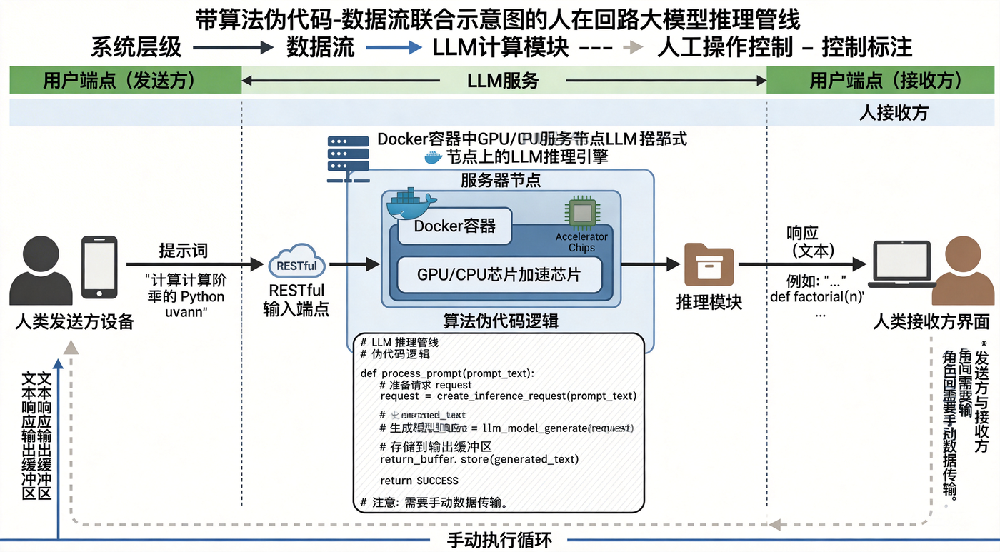
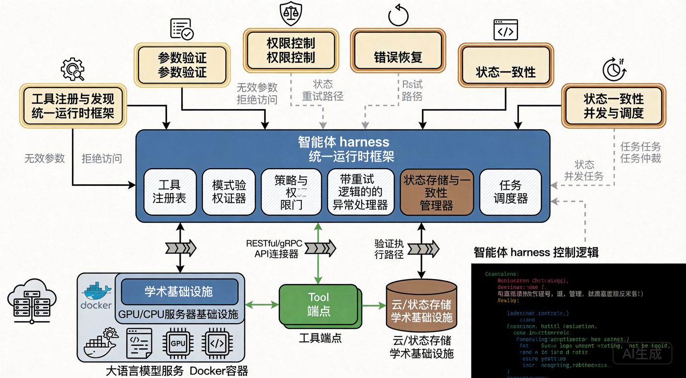
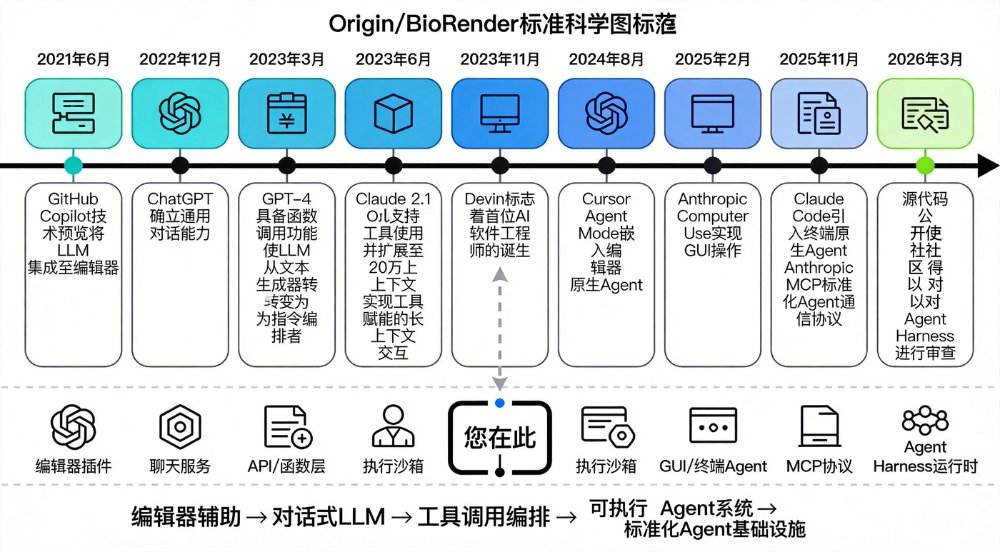
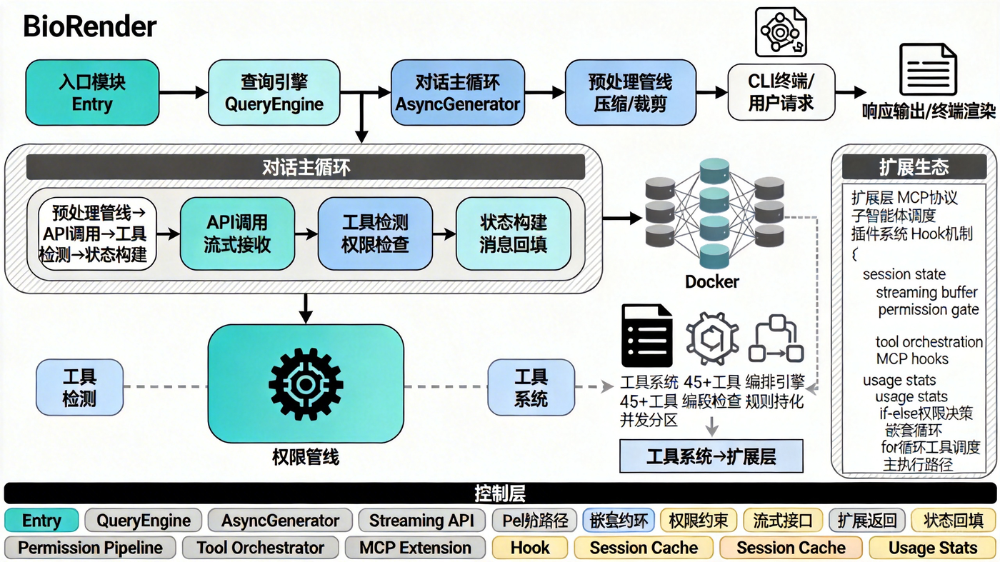
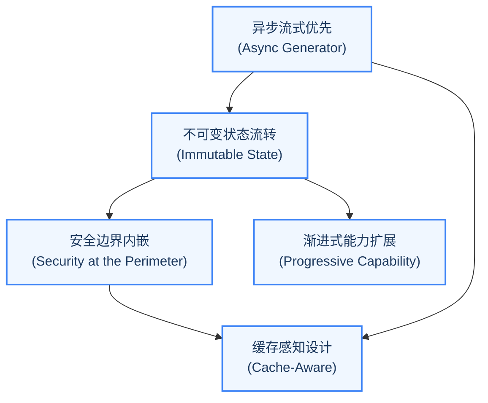

# 第 1 章 智能体编程的新范式

> "The rules of thinking are lengthy and fortuitous. They require plenty of thinking of most long duration and deep meditation for a wizard to wrap one's noggin around."

## 学习目标

阅读本章后，你将能够：

- 理解 AI Agent 从简单对话到自主执行工具调用的演进脉络
- 建立 Agent Harness 的核心心智模型，掌握其在 Agent 系统中的定位
- 掌握 Claude Code 的宏观架构、技术栈选型和设计哲学
- 辨析"简单 API 封装"与"Agent Harness"之间的本质区别
- 理解五大设计原则如何贯穿整个 Agent 系统的各个子系统

---

## 1.1 从 Chatbot 到 Agent：软件工程的范式转移

### LLM 作为推理引擎 vs. LLM 作为对话伙伴

2023 年，大多数开发者与 LLM 的交互方式是这样的：打开一个网页，输入一段提示词（Prompt），得到一段文本回复。LLM 的角色是"对话伙伴"——它理解你的问题，生成一段看似合理的回答，然后等待你的下一个问题。整个交互是同步的、单轮的、纯文本的。

这种模式可以用一个简单的模型来描述：



这种模式的核心局限在于：LLM 只能"说话"，不能"做事"。它无法读取你的文件系统，无法执行测试命令，无法创建 Git 分支，更无法在遇到错误时自主调整策略。每一次与外部世界的交互，都需要人类作为中间人手动完成——复制代码到编辑器，切换到终端运行命令，再把输出结果复制回对话框。这种"人类胶水"的模式不仅低效，而且容易出错。

2024 年，一个根本性的认知转变开始普及：**LLM 的真正价值不在于生成文本，而在于作为推理引擎来编排工具调用。** 当 LLM 不再仅仅是"回答问题的人"，而是"决定调用什么工具、传递什么参数、如何处理返回结果的决策中枢"时，它的能力边界被彻底打开了。

这个认知转变的影响是深远的。它意味着 LLM 的角色从一个被动的文本生成器转变为一个主动的任务编排器。用更形象的比喻来说：如果说之前的 LLM 是一个只会口述指令的军事参谋，那么工具调用让 LLM 变成了一个可以直接调度各兵种协同作战的指挥官。参谋的指令需要传令兵逐级传达，而指挥官的命令可以在毫秒级传达到每一个作战单元。

### 工具调用（Tool Use）的突破性意义

工具调用的突破性意义在于它重新定义了 LLM 与外部世界的边界：

在没有工具调用的世界里，LLM 是一个封闭系统。它的知识截止于训练数据的最后一天，它的推理局限在上下文窗口之内，它的输出只能是人类可读的文本。这就好比你有一位极其博学的朋友，但他被困在一个没有窗户、没有电话的房间里——他知道如何诊断疾病，但无法使用听诊器；他知道如何修理汽车，但无法拿起扳手。

有了工具调用之后，LLM 变成了一个开放系统的编排器。它可以调用搜索引擎获取实时信息，可以调用代码解释器执行计算，可以调用文件系统读写代码，可以调用 Git 操作版本控制。每一次工具调用都是 LLM 与真实世界的一次握手。那个被困在房间里的朋友，现在有了电话、有了机械手臂、有了与整个互联网的连接。

但工具调用也带来了新的工程挑战。这些挑战不再是模型层面的，而是系统工程层面的：

1. **工具注册与发现**：谁来管理工具的注册表？如何让模型知道有哪些工具可用？如何在不重启系统的情况下动态添加新工具？
2. **参数校验**：谁来校验工具调用的参数？模型可能传递错误类型的参数、缺少必填字段、或传入超出范围的值。校验逻辑放在哪一层？
3. **权限管控**：谁来决定某个工具调用是否应该被执行？模型可能要求执行 `rm -rf /`，这显然不应该被允许。但有些操作在特定上下文中是安全的——如何平衡安全性与效率？
4. **错误恢复**：工具执行可能失败，API 调用可能超时，LLM 的输出可能不符合预期格式。每一种错误场景都需要有对应的恢复策略，否则 Agent 会陷入"出错-重试-再出错"的死循环。
5. **状态一致性**：多个工具调用可能操作同一份资源。如何在多轮调用之间维护状态一致性？如何避免"读到过期数据"的问题？
6. **并发与调度**：某些工具调用可以并行执行（如同时读取多个文件），某些必须串行（如先创建目录再写文件）。如何智能地调度这些调用以最大化效率？

这些问题催生了一个新的架构概念：**Agent Harness**。



### 为什么需要 Agent Harness 而非简单封装

一个常见的误解是：Agent Harness 不过是对 LLM API 的一层封装，加上一些工具定义和调用逻辑。事实远非如此。

让我们通过一个具体的对比来理解。假设我们要构建一个能够"修改代码并运行测试"的 Agent：

**简单封装的思路** 是：调用 LLM API，解析输出中的工具调用指令，执行工具，把结果拼回 Prompt，再次调用 LLM API。这是一个典型的 while 循环。

这种思路的问题在于它假设了一个理想化的世界：API 调用不会超时，模型输出永远格式正确，用户不需要实时看到进度，上下文窗口是无限的，所有操作都是安全的。但在真实的生产环境中，每一个假设都会被打破。

**Agent Harness 的思路** 则需要考虑以下问题：

1. **流式输出**：LLM 的响应是流式的，用户需要实时看到 Agent 的思考过程，而不是等待整个响应完成。如何在不阻塞主线程的情况下实现增量渲染？如果使用回调，会导致"回调地狱"；如果使用 Promise 链，会失去中途取消的能力；如果使用事件发射器，会增加内存管理的复杂度。

2. **权限管控**：LLM 可能要求执行 `rm -rf /`，这显然不应该被允许。权限系统应该在哪一层介入？如果在外层统一拦截，无法处理工具特定的权限逻辑（如 Bash 命令的风险评估）；如果在每个工具内部检查，会导致重复代码和权限策略不一致。如何平衡安全性与效率？

3. **上下文管理**：随着对话的进行，上下文窗口会被填满。何时触发上下文压缩？压缩策略如何保证不丢失关键信息？压缩后的上下文如何与缓存系统协同？错误的压缩策略可能导致 Agent "忘记"关键信息，从而做出错误的决策。

4. **错误恢复**：工具执行可能失败，API 调用可能超时，LLM 的输出可能不符合预期格式。每一种错误场景都需要有对应的恢复策略。没有统一的错误恢复框架，每种错误都需要单独处理，代码会迅速膨胀到不可维护的程度。

5. **状态持久化**：用户中断会话后如何恢复？多个子智能体如何共享状态？状态更新如何保证不可变性？如果状态管理混乱，Agent 可能在恢复后产生不一致的行为。

6. **可扩展性**：如何让第三方开发者安全地注册新工具？如何支持 MCP（Model Context Protocol）等外部协议？如果没有清晰的扩展接口，Agent 的能力将永远受限于原始开发者的想象力。

这些问题中的每一个都足以构成一个独立的工程挑战。而 Agent Harness 的核心价值，就是提供一个统一的框架来系统地解决这些问题。

用一个更形象的类比来总结两者的区别：简单封装就像是给一辆汽车装了一个遥控器——你能让它前进和后退，但没有方向盘助力、没有刹车系统、没有安全气囊。Agent Harness 则是设计一整辆安全、可靠、可扩展的自动驾驶汽车——不仅有引擎，还有悬挂系统、制动系统、安全约束系统和诊断系统。

用一句话概括：**Agent Harness 是围绕 LLM 构建的运行时框架，它将 LLM 从一个文本生成器提升为一个能够安全、可靠、高效地与外部世界交互的自主智能体。**

> **反模式警告：** 如果你正在构建一个 Agent 系统，并且你的核心循环只是一个 `while (true) { callAPI(); parseResponse(); executeTool(); }` 的简单循环，那么你可能正在重复"简单封装"的错误。请停下来思考：你的系统如何处理流式输出？如何管理上下文？如何在错误时恢复？如果这些问题的答案是"还没想好"，那么你需要一个 Agent Harness。

---

## 1.2 Claude Code 全景架构导览

在深入设计哲学之前，让我们先从宏观尺度审视 Claude Code 的代码库。这些数字本身就包含了丰富的信息。

### AI 编程工具演进时间线

在分析 Claude Code 的架构之前，让我们把视野拉宽，看看 AI 编程工具的发展历程。理解这个时间线有助于我们看清 Claude Code 在技术谱系中的位置：



这个时间线揭示了一个重要规律：AI 编程工具的演进方向始终是"给 LLM 更多的行动能力"。从只能看到当前文件，到能看到整个项目；从只能生成建议，到能执行命令；从单步操作，到多步自主规划。Agent Harness 正是这个演进方向在架构层面的必然产物。

### 项目规模：1,884 个 TypeScript 文件，512,664 行代码

Claude Code 的 `src` 目录包含 1,884 个 TypeScript 文件，总计 512,664 行代码。这个规模意味着什么？

对于一个终端工具来说，这个体量是相当可观的。作为对比，VS Code 的核心代码约 50 万行 TypeScript，而 Claude Code 作为一个命令行工具达到了类似的规模。这说明 Agent Harness 的工程复杂度不亚于一个完整的编辑器框架。

但这并不意味着代码是臃肿的。恰恰相反，Claude Code 的代码组织表现出高度的模块化特征：每个工具是一个独立模块，每个子系统有清晰的边界，职责划分遵循单一职责原则。这种模块化程度是 Agent Harness 可维护性的关键保障。

让我们用一张架构全景图来直观展示 Claude Code 的模块组织：



这张图揭示了 Claude Code 架构的层次性：从顶部的用户入口到底部的扩展层，每一层都有清晰的职责和接口边界。对话主循环是整个系统的"心脏"，它驱动着数据在各个子系统之间流转。

### 技术栈

Claude Code 的技术栈选择体现了"用正确的工具解决正确的问题"的工程哲学：

| 技术组件 | 选择 | 设计考量 | 为什么不选其他方案 |
|---------|------|---------|------------------|
| **运行时** | Bun | 原生 TypeScript 支持、更快的启动速度、原生 `fetch` API | Node.js 需要编译步骤，Deno 的生态成熟度不足 |
| **终端 UI** | React + Ink | 组件化 UI 模型、声明式渲染、React 生态复用 | blessed/ncurses 过于底层，原始 console.log 无法处理复杂布局 |
| **CLI 框架** | Commander.js | 成熟的命令行参数解析、子命令支持 | yargs 更重，oclif 面向大型 CLI 项目 |
| **Schema 验证** | Zod v4 | 运行时类型安全、工具输入校验、JSON Schema 生成 | Joi 不支持类型推导，io-ts 学习曲线陡峭 |
| **LLM SDK** | @anthropic-ai/sdk | Anthropic 官方 SDK、流式响应支持 | 直接 fetch 缺少类型安全和重试逻辑 |

值得注意的是 React + Ink 的选择。Ink 是一个使用 React 组件模型渲染终端 UI 的框架。这意味着 Claude Code 的用户界面不是用传统的 `console.log` 拼接出来的，而是用 React 组件树声明式地描述的。这种选择带来了几个好处：UI 状态管理可以利用 React 的成熟方案（如 `useState`、`useEffect`），组件可以独立测试和复用，复杂 UI（如工具执行进度条、多列布局）的实现更加优雅。

这个选择也反映了一个重要的设计理念：**终端 UI 不应该比 Web UI 低一等。** 开发者习惯了 Web 开发中的组件化思维和声明式渲染，将这些成熟模式引入终端 UI 开发，可以显著降低开发和维护成本。当你看到 Claude Code 的工具执行进度条、权限确认对话框、多列结果展示时，它们背后都是 React 组件——和你在 Web 应用中写的组件没有本质区别。

Zod v4 的选择同样值得关注。在 Agent 系统中，LLM 生成的工具调用参数是不可预测的——模型可能传递错误类型的参数、缺少必填字段、或传入超出范围的值。Zod 在运行时提供了一道类型安全屏障，确保每一个工具调用都经过严格的参数校验。更重要的是，Zod 可以同时生成 JSON Schema，这些 Schema 被发送给 API，让模型知道每个参数的含义和约束——这是"类型定义即文档"的完美实践。

### 核心源码文件及其职责

Claude Code 的核心架构可以用五个关键模块来概括。理解这五个模块的职责和相互关系，就掌握了 Claude Code 的宏观架构。

> **交叉引用提示：** 这五个模块在后续章节中都会被深入分析。这里的概述旨在建立宏观认知，细节将在各专门章节中展开。

#### 入口点模块

这是整个应用的入口，承担三个核心职责：

1. **启动优化**：在所有模块导入之前，通过性能探针记录启动性能节点；并行启动 MDM（移动设备管理）配置读取和 macOS Keychain 预取，将原本串行的 I/O 操作重叠执行。
2. **CLI 解析**：使用 Commander.js 定义命令行接口，处理模型选择、允许的工具列表、权限模式等参数。
3. **React/Ink 初始化**：创建 React 渲染上下文，挂载根组件，启动交互式 REPL（Read-Eval-Print Loop）。

从入口代码中可以观察到一种精心设计的启动策略：副作用导入被有序排列，确保性能分析探针最先执行，紧接着是可并行的 I/O 预取，最后才是重量级的模块加载。这种对启动性能的极致追求，体现了终端工具"即开即用"的设计理念。

这个启动策略揭示了一个通用的工程原则：**启动路径是用户体验的第一印象。** 一个需要 5 秒才能显示提示符的工具，和一个 0.5 秒就能响应的工具，在用户心理上产生的是"重型工具"和"轻量工具"的天壤之别。Claude Code 通过并行预取、延迟加载和性能探针，将启动时间压缩到用户感知不到的水平。

#### LLM 查询引擎核心

`QueryEngine` 是一个 class，它拥有查询生命周期和会话状态，管理着对话消息历史、文件缓存、用量统计、权限拒绝记录等核心数据。它是对话的"生命周期管理者"。

该引擎被设计为同时服务于交互式 REPL 和无头 SDK 两种运行模式，这体现了架构的通用性考量。通过将核心查询逻辑封装为独立类，不同运行环境可以共享同一套状态管理和生命周期控制代码。

这种"一个核心、多种入口"的设计模式在工程实践中非常有价值。想象一下，如果交互式 REPL 和 SDK 模式使用两套不同的查询逻辑，那么每次修复一个 bug 或添加一个功能，你都需要在两个地方同步修改。而 QueryEngine 的设计确保了无论用户是通过终端交互还是通过 API 调用，都走同一条经过验证的核心路径。

#### 异步生成器对话主循环

这是 Claude Code 最核心、最精巧的模块之一。对话主循环是一个 `AsyncGenerator`，它实现了一个迭代式的对话过程，通过 `yield*` 委托给内部的循环函数。在每一轮迭代中，循环执行以下步骤：

1. 构建 API 请求（系统 Prompt + 消息历史 + 工具定义）
2. 调用 LLM API 并流式接收响应
3. 解析响应中的工具调用指令
4. 通过权限管线校验每个工具调用
5. 执行被允许的工具调用
6. 将工具结果作为新消息注入历史
7. 决定是否继续循环（如果 LLM 返回了新的工具调用）或终止（如果 LLM 返回了纯文本回复）

使用 `AsyncGenerator` 而非普通函数的关键好处是：调用者可以在循环的每一步通过 `yield` 接收中间状态（如流式文本、工具执行进度），而不需要回调或事件发射器。这使得上层代码可以用 `for await...of` 语法优雅地消费整个对话过程。

> **交叉引用：** 第 2 章将深入分析这个异步生成器的内部实现，包括预处理管线、状态转换模型和依赖注入设计。

状态管理方面，跨迭代状态被封装在一个不可变的 State 对象中，每次迭代时通过整体替换而非逐字段修改。这种不可变状态流转的模式使得状态的每次变化都是可追溯的。

#### 工具类型系统基石

工具类型模块定义了 Claude Code 中所有工具必须遵循的类型契约。这是一个典型的"接口即架构"的案例——通过定义清晰的类型接口，工具系统的架构约束被编译器强制执行。

这个类型定义中蕴含了丰富的架构决策：

- 工具的执行方法接收权限检查回调，意味着权限检查被内嵌到了工具执行流程中，而非外部拦截。
- 进度回调支持工具执行过程的增量进度报告，这是流式 UI 的基础。
- 并发安全声明标记工具是否可以并行执行，这影响调度策略。
- 中断行为定义用户中断时的行为（取消还是阻塞），这是用户体验的关键细节。
- 破坏性标记标识工具是否执行不可逆操作，这是权限系统的重要输入。

> **交叉引用：** 第 3 章将详细解析工具类型系统的设计，包括 `buildTool` 工厂函数、并发分区策略和 StreamingToolExecutor。

#### 工具注册中心

工具注册模块中的核心函数返回所有可用工具的完整列表，是工具系统的"单一事实来源"（Single Source of Truth）。值得注意的设计细节：

1. **条件注册**：某些工具通过 Feature Flag 控制，如 REPL 工具只在内部版本中可用，定时任务工具只在特定功能模式下启用。这使得同一份代码可以服务于不同的产品形态。
2. **延迟加载**：部分工具使用动态导入而非静态导入来避免循环依赖和减少启动时间。
3. **工具过滤**：工具过滤函数在将工具列表发送给 LLM 之前，会根据权限上下文过滤掉被禁止的工具，确保模型甚至无法"看到"它不应该使用的工具。

条件注册和延迟加载的组合体现了"按需加载"的工程哲学。在 Agent 系统中，工具数量可能达到数十甚至上百个（尤其是通过 MCP 协议扩展后），如果全部在启动时加载，不仅会拖慢启动速度，还可能因为循环依赖导致初始化错误。Claude Code 的方案确保了只有真正需要的工具才会被加载到内存中。

---

## 1.3 Agent Harness 设计哲学的五大原则

通过阅读 Claude Code 的架构，我们可以提炼出五个贯穿始终的设计原则。这些原则并非孤立的技巧，而是相互支撑的架构决策网络。每一个原则都回答了一个核心的"为什么"：为什么不选更简单的方案？如果不这样设计会怎样？



### 原则一：异步流式优先（Async Generator First）

Claude Code 的整个对话循环建立在 `AsyncGenerator` 之上。这不是一个随意的技术选择，而是一个深刻的架构决策。

传统的 LLM 调用通常采用请求-响应模式：发送 Prompt，等待完整响应，处理结果。但 Agent 的交互模式是根本不同的——Agent 可能在一个用户请求中执行多轮工具调用，每一轮都可能产生需要实时展示给用户的中间状态（思考过程、工具调用计划、执行进度）。

`AsyncGenerator` 完美地匹配了这个需求：

- **增量输出**：通过 `yield` 逐步产出流式事件，上层代码可以实时渲染。
- **可中断性**：调用者可以随时通过 `generator.return()` 或 `generator.throw()` 终止生成器。
- **背压控制**：如果消费者处理速度跟不上生产速度，生成器会自动暂停，避免内存溢出。

这种设计使得 Claude Code 的对话循环成为一个"事件流"而非"请求-响应对"。上层代码只需要一个 `for await...of` 循环就可以消费整个对话过程的所有事件。

**如果不这样设计会怎样？** 如果使用回调模式，每添加一种新事件类型就需要注册新的回调函数，随着事件类型的增多，代码会变成难以维护的"回调地狱"。如果使用 Promise 链，虽然解决了回调地狱，但失去了中途取消的能力——用户按 Ctrl+C 时无法优雅地停止正在进行的 API 调用。如果使用事件发射器（EventEmitter），虽然解决了取消问题，但引入了内存泄漏风险（忘记移除监听器）和类型安全问题（事件名是字符串）。

AsyncGenerator 是唯一同时满足"流式输出"、"可取消"和"类型安全"三个需求的方案。

### 原则二：安全边界内嵌（Security at the Perimeter）

Claude Code 的权限系统不是一个附加的安全层，而是被内嵌到了架构的核心管线中。工具调用从被 LLM 提出到最终执行，需要经过多个安全检查点：

1. **工具可见性过滤**：在将工具列表发送给 LLM 之前，根据权限规则过滤掉被禁止的工具。模型甚至无法"看到"它不应该使用的工具。
2. **输入校验**：工具的 `validateInput` 方法在权限检查之前执行，拒绝格式不合法的参数。
3. **权限决策**：`canUseTool` 回调综合考量权限模式（默认/Auto/Bypass）、工具的危险等级、用户的历史决策等因素，做出允许/拒绝/询问的决策。
4. **运行时防护**：即使通过了上述检查，工具执行过程中仍有沙箱限制、超时控制、输出大小限制等防护措施。

这个四阶段管线的设计哲学是"纵深防御"（Defense in Depth）——没有单一的安全检查点是"银弹"，但每一层都可以独立短路，阻止不安全的操作。

**为什么不使用简单的白名单？** 白名单方案看似简单，但存在致命缺陷：它假设所有操作都可以事先分类为"安全"或"不安全"。但现实中，安全性是上下文相关的——`rm -rf node_modules` 在开发环境中是安全的，但 `rm -rf /etc` 是危险的。同一个 Bash 工具、同一个命令模式，在不同参数下的风险等级完全不同。四阶段管线允许每一层根据上下文做出更精细的判断。

> **交叉引用：** 第 4 章将深入分析权限管线的四个阶段，包括规则匹配优先级、分类器自动审批和权限持久化机制。

### 原则三：缓存感知设计（Cache-Aware Architecture）

在 LLM 的 API 计价模型中，Prompt 缓存（Prompt Caching）可以显著降低成本和延迟。Claude Code 的架构从多个层面考虑了缓存友好性：

- **系统 Prompt 稳定性**：系统 Prompt 的构建方式被精心设计，确保在工具列表不变的情况下，Prompt 的字节内容保持一致，从而命中 API 侧的 Prompt 缓存。
- **子智能体的缓存共享**：Fork 模式下的子智能体会继承父智能体的 `renderedSystemPrompt`，避免重新生成可能因配置变化而不同的 Prompt，保证缓存命中率。
- **消息历史的不可变性**：已发送给 API 的消息不会被修改，只有追加新消息的操作，这保证了缓存键的稳定性。

缓存感知设计的影响是深远的：它不仅降低了 API 成本，还通过减少重复计算提高了响应速度，这对于需要频繁与 LLM 交互的 Agent 系统尤为关键。

**如果不这样设计会怎样？** 一个不关心缓存的 Agent 系统可能在每次 API 调用时都重新构建系统 Prompt，导致：(1) 每次 API 调用都需要处理完整的 Prompt，增加延迟和成本；(2) 微小的配置变化（如工具列表的排序变化）可能导致缓存全面失效；(3) 在子智能体场景下，父子智能体之间无法共享已缓存的 Prompt，导致重复计算。对于每天执行数百次 API 调用的生产级 Agent，这些浪费会迅速累积成可观的成本。

### 原则四：渐进式能力扩展（Progressive Capability）

Claude Code 提供了四级扩展模型，从内建到外部、从简单到复杂：

| 扩展级别 | 机制 | 适用场景 | 扩展者角色 |
|---------|------|---------|----------|
| **工具（Tool）** | 实现 `Tool` 类型接口 | 添加新的原子操作能力 | 核心开发者 |
| **技能（Skill）** | Markdown + 脚本的声明式工具 | 封装可复用的任务模板 | 高级用户 |
| **插件（Plugin）** | 带生命周期的工具包 | 组织相关工具和配置 | 生态开发者 |
| **MCP 服务器** | 标准化协议的外部工具集成 | 第三方工具生态 | 第三方开发者 |

这四级扩展模型的设计哲学是"渐进增强"：对于简单的需求，声明一个 Skill 就够了；对于复杂的集成，可以通过 MCP 协议连接外部服务。每一级都建立在前一级的基础之上，而非替代它。

特别值得关注的是 MCP（Model Context Protocol）的集成方式。Claude Code 不是一个封闭系统——它通过 MCP 协议可以动态发现和调用外部工具服务器提供的工具，这使得 Agent 的能力边界不是由开发者预设的，而是可以在运行时动态扩展的。

**如果不采用渐进式扩展会怎样？** 两种极端都不可取。如果只有"工具"一级扩展，第三方开发者必须修改核心代码才能添加新能力，这会严重限制生态系统的生长。如果只提供 MCP 一级扩展，简单的自定义需求也需要搭建一个完整的工具服务器，门槛过高。渐进式扩展让每一类贡献者都能在最适合自己的抽象层次上工作。

> **交叉引用：** 第三部分将详细讲解 MCP 协议的集成方式、插件系统的设计以及 Skill 的声明式工具定义。

### 原则五：不可变状态流转（Immutable State Flow）

Claude Code 的状态管理借鉴了 Redux/Zustand 的不可变状态模式。核心状态存储由一个极简的 store 实现完成。这个实现虽然简洁，但蕴含了重要的设计决策：

- **Updater 函数模式**：状态更新接收一个 `(prev: T) => T` 函数，而非新状态值本身。这确保了状态的每次更新都基于前一个状态，避免了竞态条件。
- **引用相等性检查**：通过引用比较确保只有真正发生变化时才触发通知，避免不必要的重渲染。
- **订阅/取消订阅模式**：监听器通过集合管理，返回清理函数，防止内存泄漏。

在对话循环层面，不可变性同样被严格遵守：跨迭代状态通过整体替换的方式更新，每次迭代开始时从状态对象解构出需要的字段，确保读操作使用的是不可变快照。

不可变状态流转的好处是多方面的：状态变化可预测、可追溯、可调试；在子智能体场景下，父智能体可以安全地将状态快照传递给子智能体而不担心被意外修改；在推测执行（Speculation）场景下，状态回滚变得简单而安全。

**如果不这样设计会怎样？** 如果使用可变状态（直接修改对象的字段），在并发场景下会出现经典的竞态条件：工具 A 的执行修改了状态，但工具 B 在读取状态时看到的是修改了一半的不一致数据。在子智能体场景下更危险——子智能体可能意外修改父智能体的状态，导致主循环的行为变得不可预测。这类 bug 极难复现和调试，因为它取决于异步操作的具体调度顺序。

---

## 实战练习：安装与初次诊断

在深入架构细节之前，让我们先通过一个简单的练习建立对 Claude Code 运行时的直观感受。这些练习按难度递进排列，每个都对应本章讨论的一个核心概念。

### 步骤一：安装 Claude Code

确保你的系统已安装 Node.js 18+ 或 Bun，然后执行：

```bash
npm install -g @anthropic-ai/claude-code
```

安装完成后，验证版本：

```bash
claude --version
```

> **最佳实践：** 建议在全局安装的同时，也在特定项目中通过 `npx` 或项目本地安装来使用 Claude Code。这确保了不同项目可以使用不同版本的 Claude Code 而不产生冲突。

### 步骤二：运行 `/doctor` 诊断命令

在终端中进入任意项目目录，启动 Claude Code 并输入 `/doctor`：

```bash
cd your-project
claude
> /doctor
```

`/doctor` 命令会执行一系列系统自检，包括：

1. **环境检查**：Node.js 版本、Bun 可用性、Git 安装状态
2. **权限配置检查**：当前权限模式、工具白名单/黑名单状态
3. **MCP 服务器连接状态**：已配置的 MCP 服务器是否正常响应
4. **API 连接性检查**：与 Anthropic API 的连接是否正常
5. **文件系统访问检查**：工作目录的读写权限

### 步骤三：观察系统自检流程

在 `/doctor` 运行时，注意观察以下现象：

- 系统检查的执行是**渐进式**的——每完成一项检查，结果就会即时显示，而不是等待所有检查完成后一次性输出。这正是"异步流式优先"原则在日常功能中的体现。
- 某些检查（如 API 连接性）可能会请求你的确认，这是"安全边界内嵌"原则的实践——即使是诊断操作，也需要经过权限管线。
- 检查结果会展示缓存的命中状态（如果适用），这是"缓存感知设计"的一个侧面。

### 步骤四：观察一次完整的工具调用

尝试向 Claude Code 发送一个简单的请求，如"列出当前目录下的所有 TypeScript 文件"。观察以下流程：

1. **思考阶段**：Claude Code 会展示它的思考过程（thinking），说明它打算使用哪个工具。
2. **工具调用阶段**：你会看到工具名称和参数（如 `GlobTool("*.ts")`），以及执行结果。
3. **回复阶段**：基于工具结果，Claude Code 给出最终回复。

这个简单的交互背后，正是我们在 1.2 节中描述的"对话主循环"在工作。试着在心中追踪这每一步对应的架构模块。

### 步骤五：思考题

1. 在你观察到的工具调用中，哪些工具是并发安全的？哪些不是？为什么？
2. 如果你按下 Ctrl+C 中断操作，系统会如何响应？这体现了哪个设计原则？
3. 如果连续发送 50 条消息，上下文窗口会怎样？系统应该如何应对？这个机制对应哪个设计原则？

---

## 关键要点总结

本章建立了理解 Claude Code 的概念框架，以下是核心要点：

1. **范式转移已经发生**：AI 编程助手正在从"对话伙伴"演进为"自主智能体"。这一转移的核心驱动力是工具调用能力的标准化，而 Agent Harness 是使这一转移成为现实的工程基础设施。理解这一点，就理解了为什么简单封装不够——Agent 需要的不是"API 调用"，而是一整套运行时环境。

2. **Agent Harness 是一个复杂的工程系统**：Claude Code 超过 51 万行代码的规模说明，构建一个可靠的 Agent 远不止"调用 LLM API + 执行工具"那么简单。流式输出、权限管控、上下文管理、错误恢复、状态持久化、可扩展性——每一个都是独立的工程挑战。这些挑战不会因为模型变得更强大而消失——恰恰相反，随着 Agent 执行更复杂的任务，这些工程问题会变得更加尖锐。

3. **五个核心模块定义了架构骨架**：入口模块、查询引擎、对话循环、工具类型、工具注册。理解这五个模块的职责和相互关系，就掌握了 Claude Code 的宏观架构。它们之间的关系是严格的层次调用关系：入口模块创建查询引擎，查询引擎驱动对话循环，对话循环使用工具系统，工具系统由工具注册中心统一管理。

4. **五大设计原则是贯穿全局的红线**：异步流式优先、安全边界内嵌、缓存感知设计、渐进式能力扩展、不可变状态流转——这五个原则不是孤立的设计点，而是相互支撑的架构决策网络。在后续章节中，我们将反复看到它们在具体子系统中的体现。每当你遇到一个"为什么这样设计"的问题，答案几乎都可以追溯到这五个原则之一。

在下一章中，我们将深入对话主循环的内部，逐步分析那个精巧的 AsyncGenerator 对话循环，理解 Agent 是如何在"调用 LLM - 解析工具调用 - 执行工具 - 注入结果"的循环中自主推进任务的。这是全书中最核心的一章——因为对话主循环是 Agent Harness 的"心脏"，理解了它，你就理解了 Agent 的"脉搏"。
