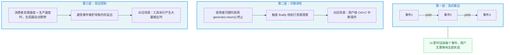
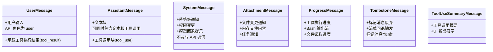
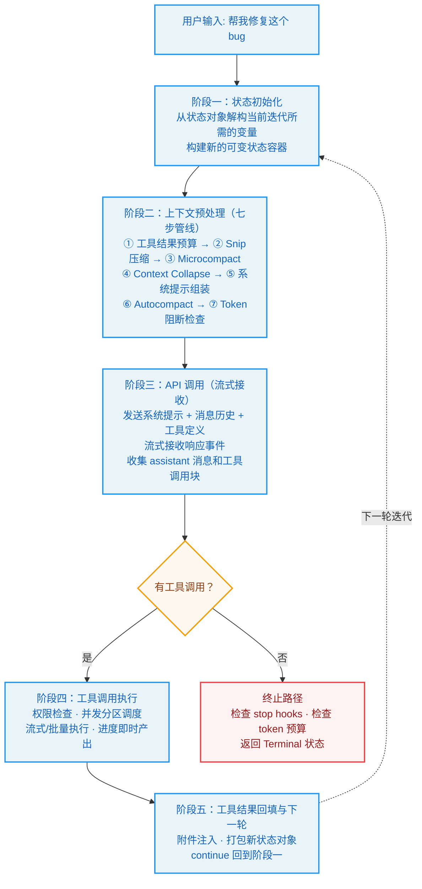
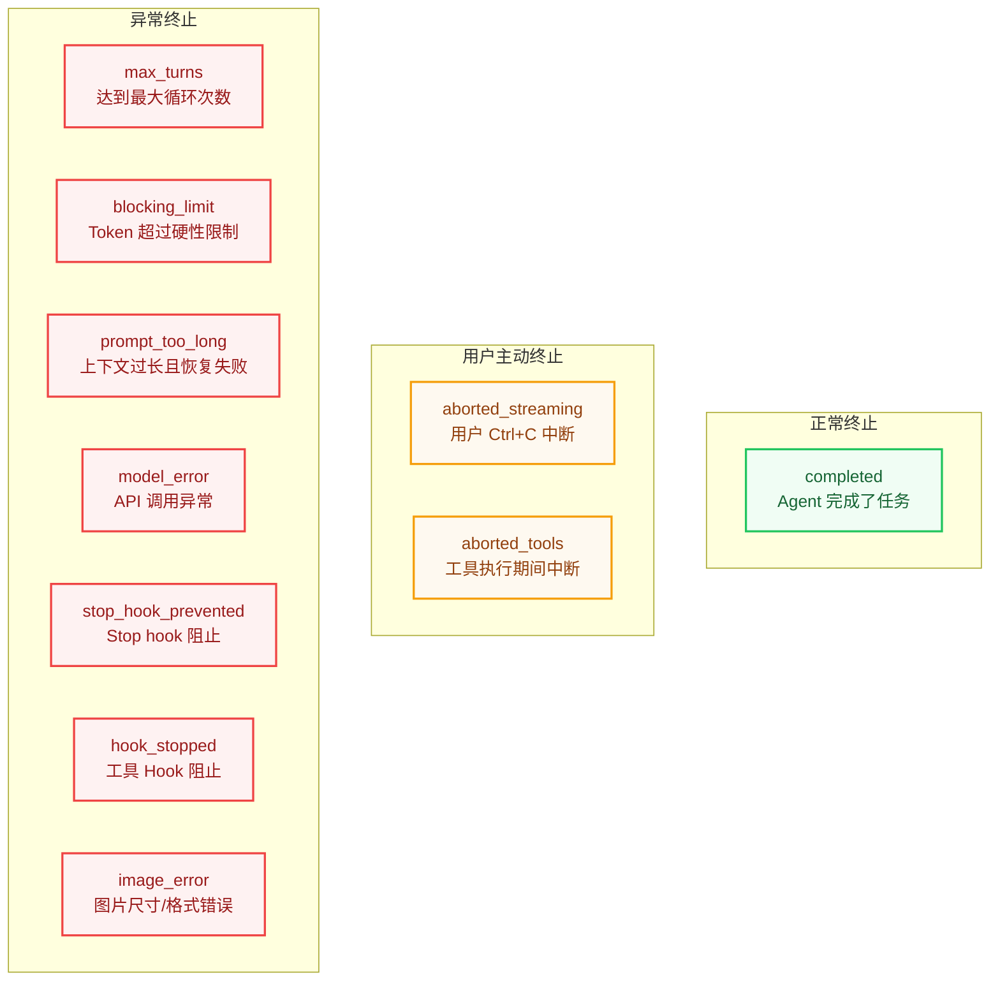
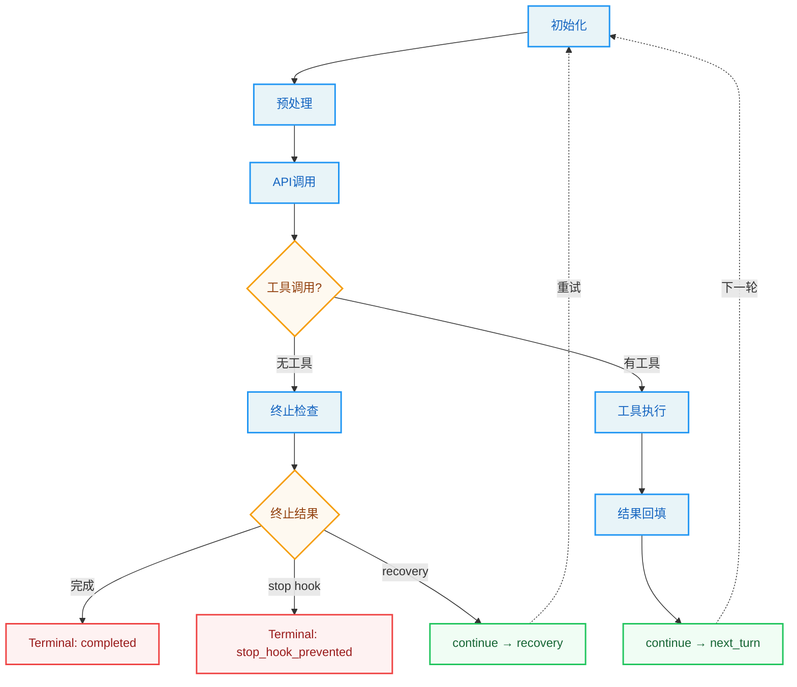

# 第2章：对话循环 -- Agent 的心跳

> "The truth is like a lion. You don't have to defend it. Let it loose. It will defend itself."
> -- Augustine of Hippo

**学习目标：** 阅读本章后，你将能够：

- 深入理解异步生成器驱动的对话主循环机制
- 掌握 Agent 与模型交互的完整状态流转模型
- 理解预处理管线（Snip、Microcompact、Context Collapse、Autocompact）的设计原理
- 分析七种 Continue 路径的触发条件和恢复策略
- 评估依赖注入模式对测试可维护性的影响

---

## 2.1 异步生成器：对话循环的骨骼

Claude Code 的对话主循环是一个以 `async function*` 定义的异步生成器。它不是一次性执行完毕的普通函数，而是一个可暂停、可恢复、可取消的"活"的流程。每一次 `yield` 就像心跳的一次搏动，将流式事件推向调用方。

这个设计选择值得用更多篇幅来理解。在传统的编程模型中，函数调用是同步的：调用者发起请求，被调用者执行计算，返回结果。但 Agent 的交互模式打破了这种同步假设——模型可能需要几十秒才能完成一次响应，而且响应是逐 token 到达的；工具执行可能耗时数分钟，期间需要实时反馈进度；用户可能随时中断操作，要求立即停止。

面对这些需求，传统的函数调用模型力不从心。异步生成器提供了完美的答案：它像一个可以随时暂停和恢复的"协程"，在"生产者"（对话循环）和"消费者"（UI 渲染层）之间建立了一条实时的事件管道。

### 函数签名与 AsyncGenerator 模式

整个对话循环的入口是一个导出的异步生成器函数，它接受一个参数对象，可向外产出五种类型的事件（流式事件、请求开始事件、消息、墓碑消息、工具调用摘要），最终返回一个表示对话终结状态的对象。

这个函数签名蕴含了三层设计决策：

1. **Yield 类型联合体（Union of yielded types）**：生成器可向外产出五种类型的事件——流式 token 到达事件、API 请求开始事件、用户/助手/系统消息、标记已废弃消息的墓碑消息、工具调用摘要消息。这五种事件覆盖了对话过程中所有需要传递给 UI 层的信息。使用联合类型而非多个独立的生成器，确保了事件的时序一致性——UI 看到的事件顺序与产生顺序完全一致。

2. **返回类型 Terminal**：生成器最终返回一个终结状态对象，表示对话的终结原因。调用方通过 `for await (... of query(...))` 消费事件流，当循环自然结束时，生成器的 `return` 值即为终止原因。这种"yield 过程、return 结论"的模式使得上层代码可以清晰地分离"过程中的处理"和"结束后的收尾"。

3. **参数对象**：将所有入参封装在一个结构化对象中，而非散列参数，使得调用方可以按需提供字段。关键字段包括消息历史、系统提示词、权限检查函数、工具执行上下文、最大循环次数等。

为什么选择 AsyncGenerator 而非回调或 Promise？因为生成器天然适配"流式生产-流式消费"的模型。模型的响应是逐 token 到达的，工具的执行结果是逐步产出的，生成器的 `yield` 机制让每一层都可以做到"有数据就推送，没数据就等待"，而不需要回调地狱或 Promise 链。

> **设计哲学对比：** 如果使用回调模式，你需要为每种事件类型注册独立的回调函数，代码会变成分散在各处的回调处理逻辑。如果使用 Promise 链，虽然避免了回调地狱，但 Promise 是"一次性的"——它只能 resolve 一次，无法表达持续的事件流。如果使用 RxJS Observable，虽然功能强大，但引入了沉重的依赖和陡峭的学习曲线。AsyncGenerator 是"刚刚好"的方案——原生语言支持、零额外依赖、类型安全、天然支持流式和取消。

### 流式事件类型

对话循环中流转的事件可分为以下几类，它们共同构成了对话过程的"心跳信号"：

- **stream_request_start**：每次 API 请求开始前发出，告知 UI 层一个新请求即将发起。在循环的每次迭代开头都会发出此事件。这个事件的实用价值在于 UI 可以展示"正在思考..."的状态指示器。

- **StreamEvent**：来自 Anthropic API 的原始流式事件，包括文本块增量（`content_block_delta`）、thinking 块、tool_use 块等。这些事件直接从 API 响应流透传给 UI。想象你在看一场直播——StreamEvent 就是视频流中的每一帧画面，UI 层负责将这些画面拼接成流畅的视频。

- **Message**：结构化的消息对象，包括 `AssistantMessage`（助手回复，可能包含 tool_use 块）、`UserMessage`（用户输入或 tool_result）、`SystemMessage`（系统通知）等。与 StreamEvent 不同，Message 是经过解析和结构化的——相当于直播结束后的回放，画面已被编辑和组织。

- **TombstoneMessage**：当流式回退（streaming fallback）发生时，部分已产出的消息需要被标记为废弃。墓碑消息告诉 UI 移除对应的历史消息。这个名字来自程序员熟知的"墓碑标记"模式——就像墓碑标记了一个生命的终结，TombstoneMessage 标记了一条消息的"失效"。

- **ToolUseSummaryMessage**：在一批工具执行完成后，异步生成的简要摘要，用于在 UI 中折叠展示工具调用结果。这对于长时间的 Agent 会话尤为重要——如果没有摘要，几十次工具调用的完整输出会淹没整个屏幕。

### 消息类型体系

Claude Code 的消息系统定义了清晰的角色分工。核心消息类型包括：

- **UserMessage**：用户的输入消息，也承载工具执行结果（tool_result）。在 API 的视角里，工具结果总是以 user 角色发送。这个设计可能看起来违反直觉——为什么工具结果是"user"角色？原因是 API 协议层面只有三种角色（system/user/assistant），工具结果需要被模型"看到"，所以必须以 user 角色发送。这是一个工程约束驱动设计决策的典型案例。
- **AssistantMessage**：模型返回的消息，可能包含文本块和 tool_use 块。当模型检测到需要调用工具时，响应中会包含 `type: 'tool_use'` 的内容块。AssistantMessage 的关键特性是它可能同时包含文本和工具调用——模型可能先输出一段解释（"我需要查看你的文件"），然后附加一个工具调用。这种"边说边做"的模式让 Agent 的行为更加透明。
- **SystemMessage**：系统级通知，如权限变更、模型回退提示等。不参与 API 通信，仅在 UI 展示。SystemMessage 是"第四面墙"——它不参与模型对话，但告诉用户系统内部正在发生什么。
- **AttachmentMessage**：附件消息，承载文件变更通知、内存文件（CLAUDE.md）内容、任务通知等附加信息。
- **ProgressMessage**：工具执行的进度消息，用于实时反馈工具运行状态（如 Bash 命令的输出流、文件读取进度等）。

> **交叉引用：** 消息类型与第 3 章的工具渲染方法紧密相关。每个工具定义的 `renderToolUseMessage`、`renderToolResultMessage` 等方法决定了不同消息类型在终端中的视觉呈现方式。

---

## 2.2 一个完整 Turn 的生命周期

现在让我们跟随一个完整的 Turn——从用户按下回车键到模型完成响应或决定调用工具——理解 `queryLoop` 函数内部的完整流程。

用医学来类比，一个 Turn 就像一次完整的诊断过程：医生（模型）先查看病历（上下文预处理），然后与病人交流（API 调用），可能需要安排检查（工具调用），拿到检查结果后（工具执行）做出诊断（最终回复）。如果检查结果不足以确诊，医生会安排更多检查（下一轮循环）。

### 阶段一：状态初始化

`queryLoop` 是一个 `while(true)` 无限循环。每次迭代代表一次"模型调用 + 工具执行"的完整回合。在循环顶部，函数从状态对象中解构出当前迭代所需的变量，包括工具使用上下文、消息列表、自动压缩追踪、恢复计数器等。

状态对象是一个可变状态容器，包含跨迭代传递的全部状态：消息列表、工具上下文、自动压缩追踪、恢复计数器、turn 计数等。每次 `continue` 回到循环顶部时，都会写入一个新的状态对象。

这个设计的关键洞察是：**状态在"读"和"写"之间有明确的分界线。** 在每次迭代的开始，函数通过解构一次性读取所有需要的状态字段（快照语义）；在迭代结束时，通过构造新对象一次性写入更新后的状态（原子更新语义）。这避免了在迭代过程中部分更新导致的不一致问题。

### 阶段二：上下文预处理

在调用模型之前，循环执行一系列预处理步骤。这些步骤构成了一个精心设计的"压缩管线"，目的是在有限的上下文窗口中保留最有价值的信息：

1. **工具结果预算**：对过大的工具结果进行截断或持久化到磁盘，确保不超过上下文窗口限制。这类似于计算机科学中的"分页"机制——当数据太大无法全部放入内存（上下文窗口）时，将部分数据存储到磁盘，只保留摘要或引用。

2. **Snip 压缩**：如果启用了历史裁剪功能，会对过长的历史消息进行裁剪。Snip 是最"粗暴"的压缩方式——直接截断消息内容。它通常用于处理工具返回的超长输出（如大型文件的完整内容）。

3. **Microcompact**：在自动压缩之前进行轻量级压缩，利用缓存编辑技术减少 token 消耗。Microcompact 的精妙之处在于它是"缓存友好"的——它尽量复用 API 侧已缓存的 token，避免因压缩导致缓存全面失效。

4. **Context Collapse**：上下文折叠是一种更细粒度的压缩策略，它在不丢失信息的情况下将连续消息折叠为紧凑视图。可以把 Context Collapse 想象为将一段对话中的"你好"、"好的"、"我明白了"这类确认性消息折叠为一行——信息不丢，但占用的空间更少。

5. **系统提示组装**：将基础系统提示与动态上下文（如当前工作目录、用户配置等）合并为完整的系统提示。这一步的设计直接影响了缓存命中率——如果组装顺序不稳定，每次调用生成的 Prompt 字节内容可能不同，导致缓存失效。

6. **Autocompact**：如果上下文超过阈值，自动压缩机制会触发，将历史对话摘要为压缩后的消息，然后替换待发送的消息列表。Autocompact 是压缩管线的"最后一道防线"——当其他轻量级压缩手段都无法将上下文缩减到限制以内时，它会执行一次全量摘要。

7. **Token 阻断检查**：如果 token 数超过硬性限制，直接返回错误消息，不再发起 API 调用。这是一个"快速失败"机制——与其发送一个注定会失败的 API 请求，不如在本地就阻止它。

> **最佳实践提示：** 这七步管线的设计遵循了一个重要原则：**压缩手段从轻量到重量排列，每一步都先尝试最小代价的方案。** 这个原则在你自己构建 Agent 系统时也值得遵循——先用 Snip 裁剪过长内容，再用 Microcompact 减少缓存浪费，再用 Context Collapse 折叠冗余信息，最后才用 Autocompact 做全量摘要。因为每一步都会丢失一些信息，应该尽量延迟最"激进"的压缩手段的使用。

### 阶段三：API 调用

所有预处理完成后，进入核心的 API 调用阶段。这里使用注入的模型调用依赖发起流式请求，将组装好的消息列表、系统提示和工具定义传递给模型 API。模型调用函数返回一个异步生成器，逐个产出流式事件。每次收到事件，循环执行以下逻辑：

- 如果事件包含 assistant 消息，将其加入助手消息数组。
- 如果事件包含工具调用块，将其收集起来，并标记需要后续工具执行。
- 如果启用了流式工具执行，在收到工具调用块时立即开始执行工具，而不必等待整个响应完成。

这个阶段的一个微妙之处在于：模型可能在一个响应中同时包含文本内容和工具调用。例如，模型可能先输出"我来看看你的 package.json 文件"，然后附加一个 Read 工具调用。循环需要正确处理这种混合输出——既要 yield 文本事件让 UI 渲染，又要收集工具调用块为后续执行做准备。

### 阶段四：工具调用检测与执行

当流式响应结束后，循环检查是否需要执行工具。如果模型没有请求调用工具，进入终止路径，检查各种退出条件（stop hooks、token budget 等）后返回。

如果模型请求了工具调用，循环执行工具：根据是否启用了流式执行，选择从流式执行器获取剩余结果，或使用传统的批量执行函数。

> **交叉引用：** 工具执行的详细机制（并发分区、流式执行器、状态机）在第 3 章的工具编排引擎部分有深入分析。

工具执行同样是一个异步生成器。每产出一个结果消息，循环就将其 yield 给上层消费者（UI），同时收集到工具结果数组中。

这个设计体现了一个重要的工程原则：**"结果收集"和"结果传递"是解耦的。** 工具结果既被收集到数组中用于下一轮 API 调用，又被 yield 给 UI 用于实时展示。这两个关注点通过同一个 yield 操作同时完成，避免了额外的状态同步逻辑。

### 阶段五：工具结果回填与下一轮

工具执行完毕后，循环执行附件注入（内存文件、文件变更通知、排队命令等），然后将所有消息（原始消息 + 助手消息 + 工具结果）打包为新的状态对象，通过 `continue` 回到 `while(true)` 的顶部。

下一轮迭代将使用这个扩展后的消息列表重新调用模型，模型将看到之前的工具结果，然后决定是继续调用工具还是给出最终回复。

附件注入是一个容易忽视但非常重要的步骤。想象这样一个场景：在工具执行期间，用户修改了 CLAUDE.md 文件。如果不注入这个变更，模型在下一轮调用中可能基于过时的配置做出决策。附件注入确保了每一轮循环开始时，模型都拥有最新的环境信息。

### 终止条件判断

对话循环的终止发生在多个位置，每个终止原因对应不同的系统状态和清理逻辑：

| 终止原因 | 触发条件 | 用户体验 | 设计意图 |
|----------|----------|---------|---------|
| `completed` | 模型正常回复且无工具调用 | Agent 给出最终回复 | 正常的"成功完成"路径 |
| `aborted_streaming` | 用户中断（Ctrl+C） | 操作立即停止 | 用户主动中断，需要即时响应 |
| `aborted_tools` | 工具执行期间中断 | 当前工具被取消，结果丢弃 | 工具执行可能耗时较长，需要中断支持 |
| `max_turns` | 达到最大循环次数 | Agent 停止并说明原因 | 防止无限循环消耗 token |
| `blocking_limit` | Token 数超过硬性限制 | Agent 报错退出 | 硬性安全边界，防止 API 错误 |
| `prompt_too_long` | 上下文过长且恢复失败 | Agent 报错退出 | 所有压缩手段已用尽 |
| `model_error` | API 调用异常 | Agent 报错并展示错误信息 | 网络或服务端问题的优雅降级 |
| `stop_hook_prevented` | Stop hook 阻止继续 | Agent 停止并说明原因 | 用户配置的自动停止条件 |
| `hook_stopped` | 工具 hook 阻止继续 | Agent 停止并说明原因 | 外部 Hook 脚本的决定 |
| `image_error` | 图片尺寸/格式错误 | Agent 报错退出 | 输入数据格式问题 |

> **设计洞察：** 十种终止原因的精细划分并非过度设计。在调试 Agent 行为时，准确的终止原因是定位问题的第一线索。如果所有错误都返回一个笼统的"error"，开发者将无从判断是 API 超时、上下文溢出还是用户中断导致了问题。细粒度的终止原因是"可观测性"（Observability）的基础。

这些终止原因还可以分为三类：

- **正常终止**：`completed`——Agent 完成了任务
- **用户主动终止**：`aborted_streaming`、`aborted_tools`——用户决定停止
- **异常终止**：其余七种——系统遇到了无法继续的情况

对于异常终止，系统在返回终止状态之前会执行清理逻辑：取消正在执行的工具、释放资源引用、记录终止原因到日志。这些清理逻辑确保了即使 Agent 异常退出，也不会留下"脏"的状态。

---

## 2.3 依赖注入与可测试性

### QueryDeps 接口

对话主循环的设计中最值得注意的工程决策之一是依赖注入模式。系统定义了一个精简的依赖接口，包含四个核心依赖：模型调用函数、轻量压缩函数、自动压缩函数和 UUID 生成器。

生产环境的依赖实现返回真实的 API 调用、压缩逻辑和随机 UUID 生成器。

在主循环中，通过参数获取依赖，如果未提供则使用生产环境默认值。测试时，调用方可以传入自定义的依赖对象，替换掉真实的 API 调用、压缩逻辑和 UUID 生成器。正如设计注释所说：

> "Passing a deps override into QueryParams lets tests inject fakes directly instead of spyOn-per-module -- the most common mocks (callModel, autocompact) are each spied in 6-8 test files today with module-import-and-spy boilerplate."

这段注释揭示了一个重要的工程洞察：在没有依赖注入的情况下，测试代码需要通过模块级别的 spy/mock 来替换外部依赖。这种 spy-per-module 的模式有几个问题：它耦合了测试代码与模块内部结构，当模块重命名或移动时测试需要同步修改；它在多个测试文件中重复相同的 mock 样板代码；它可能因为模块缓存导致测试之间的状态泄漏。

依赖注入优雅地解决了这些问题：测试只需传入一个自定义的依赖对象，不关心模块内部结构；每个测试用例创建独立的依赖实例，避免了状态泄漏；依赖接口是明确的，当接口变化时编译器会指出需要更新的测试。

### 为什么对话循环采用函数式设计

Claude Code 的对话循环选择 `async function*` 而非 class，这个选择有其深层考量：

1. **天然的状态隔离**：每次调用对话函数都创建一个全新的闭包，所有可变状态都是函数局部变量。没有跨调用的状态泄漏风险。对比 class 方案：如果对话循环是一个 class 的方法，那么多个并发的对话实例可能意外共享 class 实例上的属性，导致状态污染。

2. **生成器的背压语义**：`yield` 暂停执行直到消费者请求下一个值。这意味着如果 UI 层无法跟上产出速度，生成器会自动暂停，而不会堆积内存。这是生产级系统必须考虑的问题——当工具执行产生大量输出（如 `npm install` 的完整日志）时，没有背压控制的系统可能因为内存堆积而崩溃。

3. **取消传播**：JavaScript 生成器有 `.return()` 方法，调用它会触发生成器的 finally 块并清理资源。结合资源管理声明，清理逻辑变得确定性的。这意味着用户按 Ctrl+C 时，不仅能停止对话循环，还能确保所有正在执行的工具被正确取消、所有临时资源被清理。

4. **可组合性**：`yield*` 委托语法允许将子生成器的输出直接转发。主循环的结果通过委托语法传递给外层生成器，而工具执行也通过同样的机制串联。这种"生成器链"的模式使得不同层次的代码可以无缝组合——对话循环产出事件，工具执行也产出事件，上层 UI 只需要一个统一的 `for await...of` 循环就能消费所有层次的事件。

> **反模式警告：** 如果你正在构建自己的 Agent 循环，避免将对话状态存储在全局变量或 class 的实例属性中。全局状态使得并发测试变得不可能，class 实例状态使得多个对话实例可能互相干扰。函数闭包是最安全的状态容器——它天然隔离、天然不可共享。

---

## 2.4 状态转换模型

### State 类型与 Continue/Terminal

对话循环的核心状态机由两个概念驱动：可变循环状态（State）和终止信号（Terminal）。

State 类型定义了循环的完整可变状态，包含消息列表、工具使用上下文、自动压缩追踪状态、输出 token 恢复计数器、是否已尝试响应式压缩、输出 token 覆盖限制、待处理的工具摘要、stop hook 是否激活、turn 计数，以及上一次继续循环的原因。每次 `continue` 回到循环顶部时，都会构造一个全新的状态对象。`transition` 字段记录了上一次 continue 的原因，用于在恢复逻辑中避免重复执行相同的恢复路径。

Terminal 和 Continue 类型定义在独立的模块中。Terminal 标记对话的终结（携带 reason 字段），而 Continue 标记继续循环的决策（携带 reason 和可选的附加信息）。

这个三元模型（State + Continue + Terminal）的精妙之处在于它用类型系统强制了循环的正确性：

- State 是"可变但可控"的数据容器，每次 continue 都创建新实例
- Continue 是"继续"的信号，携带原因和附加信息，指导下一轮迭代的行为
- Terminal 是"终止"的信号，携带原因，结束循环并返回给调用方

### 状态转换的决策逻辑

整个循环的状态转换可以归纳为以下状态机：

关键的转换路径包括：

1. **next_turn**：正常的工具调用后继续。消息列表扩展为原始消息加上助手消息和工具结果，turn 计数递增。这是最常见也是最简单的转换路径。

2. **max_output_tokens_recovery**：模型输出被截断时，注入恢复消息后继续循环。恢复消息指导模型从截断处继续。最多重试 3 次。这个路径的存在是因为 LLM 有时会在输出过长时被 API 截断——不是错误，而是模型"说得太多"了。恢复消息相当于告诉模型"你刚才的话说到一半被打断了，请从中断处继续"。

3. **max_output_tokens_escalate**：首次截断时尝试提升输出 token 限制，而非注入恢复消息。这是一种更优雅的恢复策略——与其让模型从中断处继续，不如给它更大的输出空间，让它一次性完成。只有当提升限制后仍然截断时，才回退到 recovery 路径。

4. **reactive_compact_retry**：上下文过长时，通过响应式压缩恢复。压缩失败则终止循环。这个路径是对话循环的"紧急刹车"——当所有预防性压缩手段都没能阻止上下文溢出时，reactive compact 作为最后的恢复手段尝试挽救对话。

5. **collapse_drain_retry**：上下文折叠的溢出恢复路径。优先于响应式压缩执行，因为折叠保留粒度更细的上下文。这个优先级排序体现了"最小信息损失"原则——在所有恢复手段中，优先使用丢失信息最少的方法。

6. **stop_hook_blocking**：Stop hook 返回阻塞错误时，将错误注入消息列表后继续，让模型有机会修正。这个路径展示了 Agent 系统的一个关键设计理念：**错误不一定是终止条件，也可以是反馈信号。** 模型收到 hook 的错误信息后，可能会调整策略并尝试不同的方案。

7. **token_budget_continuation**：Token 预算管理触发的继续，注入一个提示消息提醒模型注意预算。这类似于手机流量套餐的"余额不足提醒"——不是立即断网，而是提醒用户注意剩余流量。

每条 continue 路径都精心构造了新的状态对象，确保不同的恢复策略之间不会冲突。`transition` 字段的存在使得后续迭代可以识别"我是怎么来到这里的"，从而做出更智能的决策。

> **最佳实践：** 在设计自己的 Agent 循环时，为每条 Continue 路径记录原因（transition reason）是一个简单但极其有效的调试手段。当 Agent 行为异常时，追溯 transition 链可以帮助你快速定位是哪一次转换引入了问题。

---

## 实战练习

**练习 1：追踪一次完整的工具调用流**

在对话主循环的以下关键位置添加日志：
- 请求开始时（stream_request_start 事件发出后）
- 工具调用块检测时（第一个 tool_use 块到达时）
- 工具执行开始时（runTools 或 StreamingToolExecutor 被调用时）
- 下一轮状态构建时（continue 之前）

向 Claude Code 发送一个需要调用工具的请求（如"读取当前目录的 package.json"），观察消息如何从 API 流经工具执行，再回填到下一轮 API 调用。

**扩展思考：** 如果连续发送三个需要工具调用的请求，观察 turn 计数如何递增。尝试在工具执行期间按 Ctrl+C，观察 `aborted_tools` 终止路径的清理逻辑。

**练习 2：模拟一个 max_output_tokens 恢复**

在测试环境中注入自定义依赖，让模型调用函数返回一个输出被截断的助手消息。观察循环如何跳过首次的 yield（withheld 机制），尝试提升 token 限制，并在重试次数耗尽后 finally surface 错误。

**扩展思考：** 修改截断次数的阈值，观察 escalate 和 recovery 两条路径的切换条件。如果截断恰好发生在工具调用块内部（工具名只输出了一半），系统会如何处理？

**练习 3：理解依赖注入的价值**

思考：如果模型调用函数是直接硬编码在循环中，测试需要多少 mock 才能覆盖主循环的各种分支？对比当前依赖注入方案，评估其对测试可维护性的影响。

**具体估算：** 假设主循环有 7 种 Continue 路径和 10 种终止原因。如果没有依赖注入，测试每个分支都需要：(a) 拦截模块级别的 API 调用，(b) 控制压缩函数的行为，(c) 固定 UUID 生成。估算一下 mock 样板代码的总量，然后考虑当模块结构变化时这些 mock 需要多少维护工作。

**练习 4：上下文压缩管线实战**

向 Claude Code 发送一系列需要大量上下文的请求（如"读取这个大文件，然后基于它生成文档，再运行测试"），观察压缩管线如何被触发。注意以下线索：
- 何时触发 Snip 压缩（工具结果被截断的标志）
- 何时触发 Autocompact（对话历史被摘要的标志）
- 压缩后模型的推理能力是否受到影响

> **交叉引用：** 上下文压缩管线的详细实现将在第二部分的核心篇中深入分析，包括缓存感知的压缩策略和上下文折叠的粒度控制。

---

## 关键要点

1. **AsyncGenerator 是 Agent 循环的最佳载体**：`yield` 提供了自然的流式输出，`yield*` 提供了子生成器委托，`.return()` 提供了确定性取消。这些特性完美匹配了 Agent "调用模型 -> 执行工具 -> 回填结果 -> 再调用"的核心循环。这不是"也可以用其他方案"的折中选择，而是"其他方案都有明确短板"的最优选择。

2. **预处理管线是上下文管理的核心**：Snip、Microcompact、Context Collapse、Autocompact 四层压缩策略层层递进，从轻量裁剪到全量摘要，确保 Agent 在无限对话中始终保持在 token 预算内。理解这四层管线的设计原则（从轻量到重量排列），有助于你在自己的 Agent 系统中设计上下文管理策略。

3. **状态不可变，转换可追踪**：每次 continue 都构造新的 `State`，配合 `transition` 字段，使得循环的每一次跳转都有据可查。这是函数式设计在命令式循环中的优雅折中。在实际调试中，transition 链是追踪 Agent 行为的"面包屑"。

4. **依赖注入使测试成为可能**：`QueryDeps` 的四个依赖（callModel、microcompact、autocompact、uuid）覆盖了循环的核心副作用，使得测试可以在不访问 API 的情况下验证状态转换逻辑。这四个依赖的选择也很有讲究——它们正好是循环中所有"与外部世界交互"的边界点，将它们抽象为接口使得循环内部变成了纯逻辑。

5. **终止不是失败，是设计**：十种终止原因各有其触发条件和清理逻辑。理解这些终止路径是理解整个循环健壮性的关键。在生产级 Agent 系统中，错误的终止处理比错误的正常流程更危险——因为它可能导致资源泄漏、状态不一致或用户数据丢失。

在下一章中，我们将转向 Agent 的"双手"——工具系统。如果说对话循环是 Agent 的心脏，那么工具系统就是 Agent 的四肢。理解了工具系统的设计，你将知道 Agent 是如何从"只能说话"进化到"能够做事"的。
