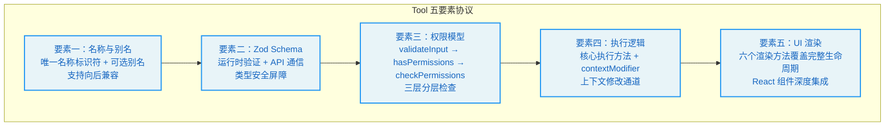
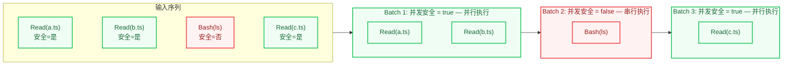
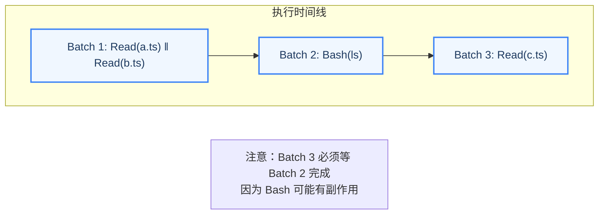
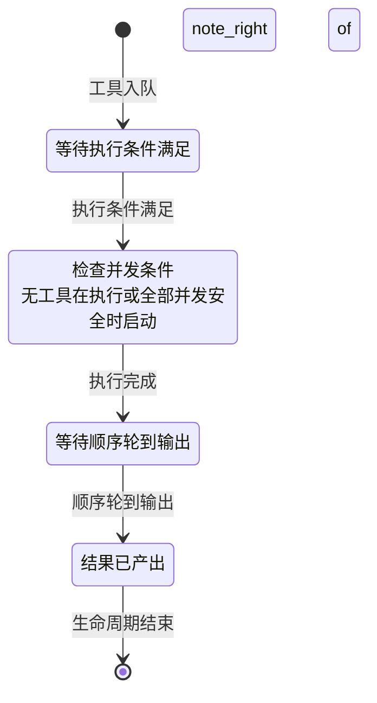

# 第3章：工具系统 -- Agent 的双手

> "If all you have is a hammer, everything looks like a nail."
> -- Abraham Maslow

**学习目标：** 阅读本章后，你将能够：

- 掌握 Claude Code 45+ 工具的设计模式，理解五要素协议的设计哲学
- 理解工具定义协议、注册机制、编排引擎的完整架构
- 分析并发分区策略的调度原理和实际效果
- 理解 StreamingToolExecutor 四阶段状态机的精妙设计
- 评估延迟工具发现机制的工程价值

---

Maslow 的这句话用在 Agent 工具系统上再贴切不过。如果 Agent 只有一个 Bash 工具，所有任务都会变成 Shell 命令——读取文件用 `cat`，搜索代码用 `grep`，编辑文件用 `sed`。这虽然可行，但违反了"使用正确工具解决正确问题"的工程原则。Claude Code 的工具系统提供了 45+ 个专门化工具，每个工具针对特定的操作类型做了优化——这就好比为不同任务配备不同的专业工具，而不是用一把锤子解决所有问题。

## 3.1 工具定义协议

Claude Code 的每个工具都遵循一个统一的类型契约 -- `Tool<Input, Output, Progress>`。这个契约定义在工具类型核心模块中，是整个工具系统的基石。理解它，就理解了 Agent "双手"的解剖结构。

这个协议的设计哲学可以用"接口即架构"来概括：通过定义严格的类型接口，工具系统的所有架构约束——权限检查、并发控制、进度报告、UI 渲染——都被编译器强制执行。开发者无法"忘记"实现某个方法，因为类型检查器会立即报错。

### 核心类型：Tool、Tools、ToolDef、buildTool

`Tool` 类型是一个泛型接口，接受三个类型参数：

- `Input extends AnyObject`：使用 Zod schema 定义的工具输入类型，确保每个工具的输入都是一个结构化对象。
- `Output`：工具的输出类型，自由定义。
- `P extends ToolProgressData`：工具的进度数据类型，用于流式反馈。

三个泛型参数的分离是一个深思熟虑的设计决策。如果将输入和输出类型合并为一个，工具的签名将变得更难阅读；如果省略进度类型，工具就无法在执行过程中提供实时反馈。三者分离使得每个关注点都有独立的类型空间，编译器可以分别检查。

每个工具必须实现的五要素如下：



**要素一：名称与别名**

每个工具拥有一个唯一的名称标识符，以及可选的别名用于向后兼容。当工具重命名时，旧名称可以通过别名继续匹配。工具查找函数同时检查主名称和别名。

别名机制的存在揭示了一个工程实践原则：**在公开 API 中，重命名是"只增不减"的操作。** 即使某个工具的名称不再准确（如从 `SearchTool` 重命名为 `GrepTool`），旧名称也必须通过别名保持可用，否则依赖旧名称的配置、脚本和用户习惯都会被打破。

**要素二：Zod Schema**

每个工具使用 Zod 定义其输入参数的 schema。Zod schema 承担了双重职责：

1. **运行时验证**：在工具执行之前，LLM 生成的参数经过 Zod 解析，确保类型和约束的正确性。这是"不要信任外部输入"原则的体现——LLM 的输出是不可控的，工具必须自我保护。
2. **API 通信**：Zod schema 通过转换层生成 JSON Schema 发送给 API，让模型知道每个参数的含义和约束。这意味着 schema 定义就是工具的"使用说明书"——模型看到的参数描述来自 Zod schema 中的 `describe()` 调用。

> **交叉引用：** Zod schema 的验证发生在第 4 章权限管线的第一阶段（validateInput），这是"安全边界内嵌"设计原则的具体体现。

**要素三：权限模型**

权限相关的三个方法构成了分层的权限检查管线：

1. **第一层：输入验证（validateInput）**：在权限检查之前运行，用于拒绝无效输入。这是"数据合法性"检查，与权限无关。
2. **第二层：权限检查（hasPermissionsToUseTool + checkPermissions）**：包含工具特定的权限逻辑。不同工具的权限检查粒度不同——Read 工具可能只检查路径是否在允许列表内，而 Bash 工具需要解析命令、评估风险等级。
3. **第三层：运行时属性判断**：影响工具的并发调度策略。例如 `isConcurrencySafe()` 标记工具是否可以并行执行。

三层分离的设计哲学是"关注点分离"：数据验证不关心权限策略，权限策略不关心并发调度。每层只做一件事，但三层串联起来提供了完整的防护。

**要素四：执行逻辑**

这是工具的核心执行方法。它接收解析后的输入参数、工具使用上下文、权限检查函数、父消息引用和一个可选的进度回调。返回的结果携带输出数据和可选的上下文修改器。

上下文修改器（contextModifier）允许工具在执行后修改上下文（如更新文件缓存），这是工具影响后续行为的关键通道。例如，FileWriteTool 在写入文件后会通过 contextModifier 更新文件状态缓存，使得后续的 FileReadTool 能看到最新的文件内容。

**要素五：UI 渲染**

工具拥有丰富的渲染方法集合，覆盖了完整的 UI 生命周期：

- `renderToolUseMessage`：工具调用开始时展示（如 "Reading src/foo.ts"）
- `renderToolUseProgressMessage`：工具执行中的进度展示
- `renderToolResultMessage`：工具结果展示
- `renderToolUseRejectedMessage`：权限被拒绝时的展示
- `renderToolUseErrorMessage`：执行出错时的展示
- `renderGroupedToolUse`：多个并行工具的分组展示

每个渲染方法都返回 `React.ReactNode`，使得工具系统与 React 渲染管线深度集成。这个设计选择意味着工具的 UI 表现可以像 React 组件一样灵活——进度条、颜色高亮、折叠面板、表格布局，都可以通过 React 组件实现。

这六个渲染方法的覆盖范围值得注意：它涵盖了工具调用的"生老病死"——从开始（renderToolUseMessage）到进行中（renderToolUseProgressMessage），到成功（renderToolResultMessage）、被拒（renderToolUseRejectedMessage）、出错（renderToolUseErrorMessage），以及并行执行的分组展示（renderGroupedToolUse）。这种完整的生命周期覆盖确保了用户在任何状态下都能看到清晰、有意义的 UI 反馈。

### buildTool 工厂函数

`buildTool` 是创建工具的标准工厂函数。它接收一个部分工具定义，自动填充安全默认值。这些默认值遵循"fail-closed"原则：安全性相关的方法（如并发安全判断、只读判断）默认为 false，工具必须显式声明自己安全才能享受并发等优化。

这个设计哲学可以用一个类比来理解：在机场安检中，默认假设所有行李都需要检查（fail-closed），只有经过特殊认证的旅客（如外交官）才能走快速通道。如果反过来——默认放行，只在发现问题时才拦截（fail-open）——那么任何一个漏检都可能造成安全事故。

类型系统通过巧妙的类型计算，让开发者只需提供必要字段，而工厂函数的返回类型保证完整的工具接口。如果开发者在定义中提供了某个方法，类型系统会使用开发者提供的签名；如果省略了，则使用默认签名。这种"可选覆盖、安全默认"的模式在工程实践中非常有效——简单工具只需几行代码，复杂工具可以完全自定义。

---

## 3.2 工具注册与动态发现

### getAllBaseTools() 完整工具清单

`getAllBaseTools()` 是所有内建工具的注册中心。它返回一个扁平数组，包含了 Claude Code 所有可用的工具。通过这个函数，我们可以统计出核心工具清单，并按功能分类：

| 类别 | 工具 | 职责 | 并发安全 |
|------|------|------|---------|
| 执行 | BashTool | 运行 Shell 命令 | 否（副作用） |
| 文件 | FileReadTool, FileEditTool, FileWriteTool | 读取、编辑、写入文件 | Read 是，Edit/Write 否 |
| 搜索 | GlobTool, GrepTool | 文件名模式匹配、内容搜索 | 是 |
| 笔记本 | NotebookEditTool | Jupyter Notebook 编辑 | 否 |
| 网络 | WebFetchTool, WebSearchTool | 获取 URL 内容、网络搜索 | 是 |
| 智能 | AgentTool | 子智能体入口 | 否 |
| 任务 | TodoWriteTool, TaskCreateTool 等 | 任务管理 | 视具体工具而定 |
| 规划 | EnterPlanModeTool, ExitPlanModeV2Tool | 计划模式切换 | 否 |
| 交互 | AskUserQuestionTool | 向用户提问 | 否（需要用户响应） |
| 技能 | SkillTool | 调用 slash command 技能 | 否 |
| 配置 | ConfigTool | 修改配置 | 否 |
| MCP | ListMcpResourcesTool, ReadMcpResourceTool | MCP 资源访问 | 是 |
| 工作树 | EnterWorktreeTool, ExitWorktreeTool | Git worktree 管理 | 否 |
| 通知 | BriefTool | 消息发送 | 否 |
| 搜索发现 | ToolSearchTool | 延迟工具发现 | 是 |

> **设计洞察：** 注意"并发安全"列——超过一半的工具标记为并发不安全。这反映了一个深刻的工程现实：在 Agent 系统中，大多数操作都有副作用（修改文件、执行命令、更改状态），真正可以安全并行执行的操作（纯读取、纯搜索）是少数。并发分区算法（3.4 节）的核心挑战正是在这个约束下最大化并行度。

### 死代码消除在工具注册中的应用

Claude Code 的工具注册大量使用条件导入实现编译期死代码消除。当特定条件不满足时，对应工具的整个模块不会被包含在最终构建中。功能开关控制的工具也是如此。

功能开关来自构建工具链，在编译时由 bundler 评估。当功能开关关闭时，对应的工具实现代码都会被 tree-shaking 移除。这种模式确保了外部构建（面向第三方用户）不会包含内部工具的代码。

这个设计在安全层面有重要意义：如果内部工具（如 REPL 工具、调试工具）被包含在外部构建中，即使它们不可用，也可能泄露内部架构信息。死代码消除从源头上消除了这种信息泄漏的风险。

在工具注册函数中，条件注册使用展开运算符，根据运行环境和功能开关决定是否加入特定工具。

### ToolSearchTool 延迟发现机制

当工具数量超过一定阈值时，Claude Code 启用延迟工具发现（deferred tool discovery）。核心思路是：不在初始系统提示中发送所有工具的完整 schema，而是只发送工具名称列表，让模型通过 ToolSearchTool 按需加载。

用一个类比来理解：传统方式像是把整本百科全书放在模型面前——即使大部分内容在当前对话中用不到。延迟发现则像是给模型一个目录索引——模型知道有哪些工具可用，只在需要时翻开对应的页面查看详细参数。

ToolSearchTool 的实现遵循标准的工厂函数模式。判断一个工具是否应该被延迟的逻辑是：显式标记为总是加载的工具不延迟、MCP 工具总是延迟、工具搜索工具自身不延迟。

这个机制的核心价值在于节省 prompt 空间：当 MCP 服务器注册了数十个工具时，全部发送给 API 会消耗大量 token。延迟发现让模型只在需要时加载工具的完整 schema，显著减少了初始 prompt 的大小。

> **最佳实践：** 如果你正在构建自己的 Agent 系统并通过 MCP 协议接入外部工具，关注工具 schema 的 token 消耗。每个工具的 schema 包括名称、描述和参数定义，在工具数量达到 50+ 时可能消耗数千 token。延迟发现是一个有效的优化手段。

### 工具过滤管线

从 `getAllBaseTools()` 到最终发送给 API 的工具列表，经过多层过滤：


1. **模式过滤**：根据模式过滤工具。简单模式只保留 Bash、Read、Edit；普通模式排除特殊工具。这种模式化的工具过滤确保了在受限环境中 Agent 只能使用最基本的工具集。
2. **拒绝规则过滤**：移除被 blanket deny 规则匹配的工具。
3. **启用状态检查**：过滤掉未启用的工具。
4. **工具池组装**：合并内建工具与 MCP 工具，按名称排序去重。排序的目的是确保 prompt 缓存稳定性——工具顺序变化会导致缓存失效。

> **交叉引用：** 模式过滤和拒绝规则过滤与第 4 章的权限管线紧密相关。工具过滤是权限系统的第一道防线（工具可见性过滤），确保模型甚至无法"看到"它不应该使用的工具。

---

## 3.3 核心工具深度解析

### BashTool：命令执行的瑞士军刀

BashTool 是 Claude Code 最强大的工具之一，也是最复杂的。它不仅仅是简单的 Shell 执行器，而是集成了多层安全防护的执行环境。如果工具系统是 Agent 的双手，BashTool 就是其中最有力的那只手——也是最需要被约束的那只。

BashTool 在工具系统中的特殊地位体现在以下方面：

- **错误传播**：当 BashTool 执行失败时，会取消所有并行的 Bash 工具调用。这是因为 Bash 命令之间往往存在隐式依赖链（如 `mkdir` 失败后后续命令无意义）。这个设计体现了"快速失败"原则——与其让后续命令在一个已损坏的环境中继续执行并产生更多错误，不如立即停止整个批次。

- **中断行为**：BashTool 可以自定义用户中断时的行为。某些长时间运行的命令（如测试套件）可能选择阻塞而非取消。这个设计反映了对用户意图的精细理解：中断一个正在运行的 `npm install` 应该立即停止（用户改了主意），但中断一个测试套件可能只是用户想看当前进度（测试完成后结果仍然有价值）。

- **语义分析**：BashTool 会对命令进行 AST 解析和语义分析，判断命令是否为搜索/读取操作（`isSearchOrReadCommand`），用于 UI 折叠展示。这体现了"智能工具"的设计理念——工具不仅是被动执行命令的管道，还能理解命令的语义并做出相应的 UI 决策。

- **沙盒集成**：通过 `--dangerouslyDisableSandbox` 参数和沙盒配置，控制命令执行的安全边界。沙盒是 BashTool 的"安全网"——即使在 bypass 权限模式下，沙盒仍然可以限制命令的文件系统访问范围。

### 文件三件套：FileReadTool、FileEditTool、FileWriteTool

这三个工具构成了 Claude Code 文件操作的完整能力集。它们的分工反映了经典数据库操作的 CRUD 模式（Create/Read/Update），只是缺少了 Delete——这是一个有意为之的安全决策，因为"删除文件"是不可逆操作，通常通过 BashTool 的 `rm` 命令来实现，这会触发更严格的权限检查。

**FileReadTool** 负责读取文件内容。它维护了文件状态缓存，用于追踪哪些文件已被读取，避免重复注入内存附件。这个缓存机制是性能优化的关键——如果同一个文件被读取多次（在不同的工具调用轮次中），缓存确保只在第一次读取时触发实际的文件 I/O，后续读取直接使用缓存结果。

**FileEditTool** 负责精确编辑文件。它使用 `old_string -> new_string` 的精确替换模式，而非行号范围，确保编辑操作在文件变化时仍然正确。这个选择值得深入分析：

- **为什么不用行号？** 行号是脆弱的——如果在读取文件和编辑文件之间，另一个工具（或用户）修改了文件，行号可能已经偏移，导致编辑错误的位置。
- **为什么用精确字符串匹配？** 字符串匹配是幂等的——只要目标字符串存在于文件中，编辑就能正确定位。即使文件被部分修改，只要目标片段没有被触及，编辑就是安全的。

FileEditTool 的 `isDestructive` 方法会根据编辑内容判断是否为破坏性操作（如删除大量代码）。这种上下文感知的破坏性判断比简单的"写入即破坏性"标签更加精确。

**FileWriteTool** 负责创建或完全覆写文件。这是最"重"的文件操作，权限检查最为严格。FileWriteTool 与 FileEditTool 的区别在于作用范围——Edit 只修改文件中的特定片段，Write 可以完全覆盖文件内容。因此，Write 的权限检查标准更高。

三个工具都支持 `contextModifier`，在执行后更新文件状态缓存，使得后续的工具调用和内存附件注入能看到最新的文件状态。

> **最佳实践：** 在设计自己的 Agent 工具时，遵循"最小权限"原则——优先使用 Edit 而非 Write，优先使用 Read 而非 Bash。这不仅是安全问题，也是效率问题：精确的 Edit 比 Write 整个文件更快，也更不容易出错。

### 搜索双雄：GlobTool 与 GrepTool

**GlobTool** 使用文件名模式匹配查找文件，底层使用 `fast-glob` 库。它返回匹配的文件路径列表，支持 ignore 模式和最大结果数限制。

**GrepTool** 使用正则表达式搜索文件内容，底层使用 `ripgrep`。它支持多种输出模式（文件名、内容行、计数），以及丰富的过滤选项（文件类型、glob 模式等）。

这两个工具的设计体现了"专门化优于通用化"的原则。虽然 BashTool 也可以通过 `find` 和 `grep` 命令实现类似功能，但专门的搜索工具有几个优势：

1. **结构化输出**：搜索工具返回结构化的结果列表，而非 Shell 命令的文本输出。模型可以更准确地解析结构化数据。
2. **权限控制**：搜索工具默认是只读的，权限检查更宽松。如果每次搜索都需要通过 BashTool，用户将面临更多的权限确认提示。
3. **性能优化**：专门的搜索工具可以针对特定场景优化（如限制结果数量、并行搜索），而 Shell 命令的优化空间有限。

值得注意的是，当 Ant 原生构建中嵌入了专用的快速搜索工具时，GlobTool 和 GrepTool 会被禁用，因为 Shell 中的 `find` 和 `grep` 命令已经被别名为这些快速工具，BashTool 可以直接使用它们。

### AgentTool：子智能体入口

AgentTool 是 Claude Code 实现多智能体协作的核心工具。它允许主智能体生成子智能体来处理子任务。子智能体拥有独立的上下文窗口和工具集，执行完成后将结果返回给主智能体。

AgentTool 在工具系统中有几个特殊属性：
- 它可能被标记为 `alwaysLoad`，确保在 ToolSearch 启用时仍然在第一轮可见。这是因为子智能体是处理复杂任务的关键能力，不应该被延迟发现机制隐藏。
- 子智能体通过 `createSubagentContext` 创建独立的 `ToolUseContext`，继承父上下文的部分状态（如权限规则）但拥有独立的消息列表。这种"继承但不共享"的模式确保了子智能体不会意外修改父智能体的状态。
- 子智能体的结果通过 `TaskOutputTool` 暴露给主智能体。

> **交叉引用：** 子智能体的完整架构设计将在第三部分扩展篇中深入分析，包括上下文隔离策略、权限冒泡机制和结果传递协议。

---

## 3.4 工具编排引擎

工具编排引擎是工具系统的"指挥中心"——它决定了多个工具调用如何被调度、执行和结果收集。一个好的编排引擎需要在三个目标之间取得平衡：**并行性**（尽可能并行执行以提高速度）、**安全性**（避免并发执行导致的数据竞争）和**顺序性**（保证结果的产出顺序与请求顺序一致）。

### runTools() 函数与并发分区

工具编排的核心逻辑在工具编排模块中。`runTools` 函数是一个异步生成器，负责调度一批工具调用的执行。

它的调度策略基于 **并发分区**（concurrency partitioning）：

1. 首先将所有工具调用按顺序划分为批次。
2. 每个批次要么是一组连续的并发安全工具，要么是一个单独的非安全工具。
3. 并发安全批次并行执行。
4. 非安全批次串行执行。

分区算法的核心逻辑：遍历所有工具调用，检查每个工具的并发安全属性。如果当前工具安全且前一个批次也安全，则合并到同一批次；否则开启新批次。

这个算法可以用一个流水线来类比：想象一个工厂有多个工位。有些工序是独立的（如同时检查多个零件的质量），可以并行进行；有些工序必须严格按顺序（如先组装再测试），不能跳跃。并发分区算法就是自动识别哪些工序可以并行、哪些必须串行的调度器。

举例来说，如果模型请求了四个工具调用：`[Read(a.ts), Read(b.ts), Bash(ls), Read(c.ts)]`，分区结果为：





并发执行的并发度上限由环境变量控制，默认为 10。

> **设计洞察：** 为什么 Read(c.ts) 不能和 Bash(ls) 放在同一个批次？因为 Bash 命令可能有副作用——它可能创建新文件、修改文件内容或改变目录结构。如果在 Bash 执行的同时读取文件，Read 可能读到执行前的旧数据或执行后的新数据，导致不可预测的行为。串行执行确保了 Read(c.ts) 看到的是 Bash(ls) 执行完成后的确定状态。

### StreamingToolExecutor 流式执行

`StreamingToolExecutor` 是 `runTools` 的增强版本，它不等待模型响应完全结束就开始执行工具，而是在流式接收到工具调用块时就立即启动执行。

这个设计的影响是显著的。假设模型在一个响应中请求了五个工具调用，每个工具执行需要 1 秒。传统模式下，模型生成完整响应需要 2 秒（流式输出时间），然后批量执行工具需要 5 秒，总计 7 秒。流式执行模式下，第一个工具在模型输出开始后约 0.4 秒（生成第一个 tool_use 块的时间）就开始执行，后续工具陆续启动，总计约 3 秒——速度提升超过 50%。

每个被追踪的工具拥有四阶段状态机：



- **queued**：工具已入队，等待执行条件满足。
- **executing**：正在执行。执行前会检查并发条件：只有当没有工具在执行，或所有执行中的工具都是并发安全时，才允许开始执行。
- **completed**：执行完成，结果已收集。但尚未 yield 给上层（需要维持顺序）。
- **yielded**：结果已产出，工具生命周期结束。

StreamingToolExecutor 的关键设计决策：

1. **顺序保证**：即使在流式执行中工具可以并行完成，结果的 yield 仍然保持与请求相同的顺序。结果收集函数在遍历工具列表时，遇到未完成的非安全工具就会停止，确保顺序约束不被违反。这是并行性与一致性之间的精妙平衡——允许并行执行以提高速度，但保证结果呈现的顺序性以简化上层处理逻辑。

2. **错误传播**：BashTool 执行失败会取消所有并行兄弟工具。非 Bash 工具的错误不会传播——因为读取/搜索操作通常是独立的。这个区分很重要：Bash 命令的失败通常意味着环境出了问题（如磁盘满了、网络断了），此时继续执行其他命令很可能也会失败。而文件读取或搜索操作的失败通常是局部的（如文件不存在、模式不匹配），不影响其他操作。

3. **进度即时产出**：工具执行中的进度消息绕过顺序约束，立即 yield 给上层。这使得 UI 可以实时显示工具执行进度，而不必等待前面的工具完成。这个设计体现了用户体验的优先级——进度消息是"提示性"的，不需要严格的顺序保证；而结果消息是"事实性"的，必须保持顺序。

4. **丢弃机制**：当流式回退发生时（模型切换到 fallback 模型），标记所有待执行和执行中的工具为废弃，避免过时的结果泄漏。这相当于一个"紧急刹车"——当模型决定改变策略时，所有基于旧策略的工具调用结果都应该被丢弃。

5. **信号传播**：每个工具执行使用独立的子取消控制器，形成层级化的取消信号链。兄弟工具的错误或用户的 Ctrl+C 都会通过信号传播到正确的工具。这种层级化的信号传播确保了取消操作的精确性——取消一个工具不会意外影响不相关的其他工具。

> **反模式警告：** 如果你正在构建自己的工具编排系统，避免使用单一的 AbortController 来管理所有工具的取消。当工具 A 失败需要取消工具 B 时，不应该同时取消完全无关的工具 C。层级化的取消信号是正确的设计。

### 工具状态机在对话主循环中的集成

回到对话主循环，工具执行的状态与对话循环的状态紧密集成：

1. **流式执行路径**：当流式工具执行功能启用时，创建 StreamingToolExecutor。在流式接收工具调用块时，立即将工具加入执行队列，同时检查是否有已完成的结果可以立即 yield。这实现了"边接收边执行"的流水线模式。

2. **批量执行路径**：当流式执行不可用时，使用传统的批量执行函数在模型响应完全结束后批量执行所有工具。这是流式执行的后备方案，保证了在流式功能被禁用或出错时系统仍然可以正常工作。

3. **上下文传播**：工具执行后可能修改上下文（如文件缓存更新），这些修改传播回对话循环，影响后续工具的执行环境。上下文传播是"一致性"的关键——如果工具 A 写入了文件但缓存没有更新，后续的工具 B 可能基于旧缓存做出错误的决策。

> **交叉引用：** 流式执行路径与第 2 章的对话主循环阶段三和阶段四紧密集成。对流式执行的理解需要结合对话主循环的整体流程图来把握。

---

## 实战练习

**练习 1：实现一个自定义工具**

使用 `buildTool` 工厂函数创建一个简单的工具。要求：
- 定义 Zod schema，包含一个 `path` 字段（字符串类型）
- 实现 `call` 方法，返回指定路径的文件信息
- 正确标记 `isReadOnly` 和 `isConcurrencySafe`
- 实现 `renderToolUseMessage` 和 `renderToolResultMessage`

对比你的实现与 FileReadTool 的差异，理解 `buildTool` 默认值的作用。

**思考题：** 你的自定义工具的 `isConcurrencySafe` 应该标记为 true 还是 false？如果标记错误（只读工具标记为 false，或写入工具标记为 true），分别会导致什么问题？

**练习 2：分析并发分区策略**

给定以下工具调用序列：
```
[GlobTool(*.ts), GrepTool(pattern), BashTool(npm test), FileReadTool(a.ts), FileEditTool(a.ts), GlobTool(*.json)]
```

手动执行 `partitionToolCalls` 的逻辑，画出批次划分结果。然后思考：为什么 FileEditTool 和 GlobTool 不能放在同一个并发批次？

**详细分析：** 画出每个工具的安全标记，然后逐步模拟分区算法的决策过程。最终答案应该是：

```
Batch 1 (并发安全): [GlobTool(*.ts), GrepTool(pattern)]   -- 并行执行
Batch 2 (非安全):   [BashTool(npm test)]                    -- 串行执行
Batch 3 (非安全):   [FileReadTool(a.ts)]                    -- 串行执行（受 Batch 2 影响不能并入 Batch 1）
Batch 4 (非安全):   [FileEditTool(a.ts)]                    -- 串行执行
Batch 5 (并发安全): [GlobTool(*.json)]                      -- 可并行（但只有一个工具）
```

**练习 3：追踪 StreamingToolExecutor 的生命周期**

在 StreamingToolExecutor 的工具入队、工具执行和结果获取环节设置断点。发送一个触发多个并行工具调用的请求（如"搜索所有 TODO 注释并读取相关文件"），观察工具状态如何从 queued 到 executing 到 completed 再到 yielded，以及进度消息如何即时产出。

**扩展观察：** 在工具执行期间按 Ctrl+C，观察取消信号如何从用户传播到各个工具。注意层级化的取消控制器如何确保只有正在执行的工具被取消，而已经 completed 的工具结果不受影响。

**练习 4：评估延迟发现的性能影响**

如果你的环境接入了 MCP 服务器，观察以下两种情况下的 API 调用 token 消耗差异：
- 禁用延迟发现（所有工具 schema 都在初始 prompt 中）
- 启用延迟发现（只有工具名称列表在初始 prompt 中）

记录两种情况下的 input token 数量差异，计算延迟发现为你节省了多少 token。

---

## 关键要点

1. **五要素协议是工具系统的 DNA**：名称、Schema、权限、执行、渲染。每个工具都围绕这五个维度定义自己，而 `buildTool` 的默认值机制让简单工具只需关注核心逻辑。这个协议的设计哲学是"显式声明，安全默认"——工具必须主动声明自己是安全的，否则默认为不安全。

2. **死代码消除保障构建安全**：通过环境变量和功能开关的条件导入，确保内部工具不会泄漏到外部构建。这是 Agent 系统在多租户环境下的重要工程实践。结合第 1 章的"渐进式能力扩展"原则，死代码消除确保了不同产品形态可以共享同一份代码库。

3. **并发分区是性能的关键**：`isConcurrencySafe` 的判断决定了工具能否并行执行。正确标记只读工具为并发安全，可以让 Agent 在单轮中同时执行多个搜索/读取操作，大幅减少响应时间。但错误标记的代价是数据竞争和不可预测的行为——这是一个需要谨慎权衡的设计决策。

4. **StreamingToolExecutor 是零等待的工具调度器**：在模型还在生成 tool_use 块时就开始执行工具，通过四阶段状态机和顺序保证，在并行性和一致性之间取得平衡。它是"异步流式优先"设计原则在工具系统层面的完美体现。

5. **工具系统的可扩展性来自类型契约**：`Tool<Input, Output, Progress>` 的泛型设计让每个工具有独立的类型空间，而 `ToolUseContext` 提供了统一的执行环境。添加新工具不需要修改编排引擎的代码——这正是第 1 章提到的"渐进式能力扩展"原则在工具层面的落地。

在下一章中，我们将深入 Agent 的安全护栏——权限管线。如果说工具系统给了 Agent 行动的能力，那么权限管线决定了 Agent 行动的边界。理解权限管线的设计，你将知道 Claude Code 是如何在"自主执行"和"安全保障"之间找到精确平衡的。
