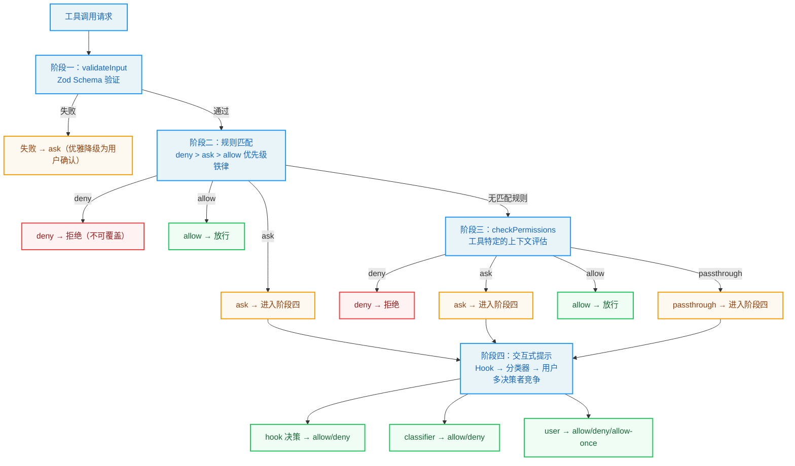
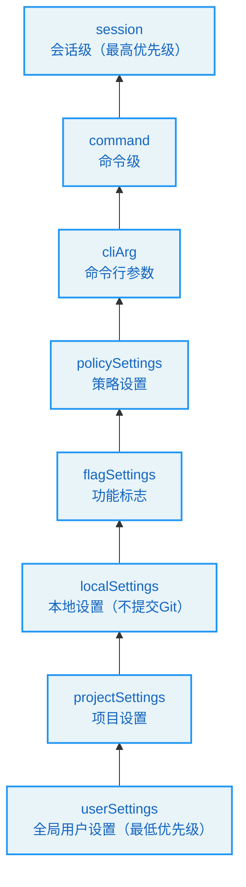
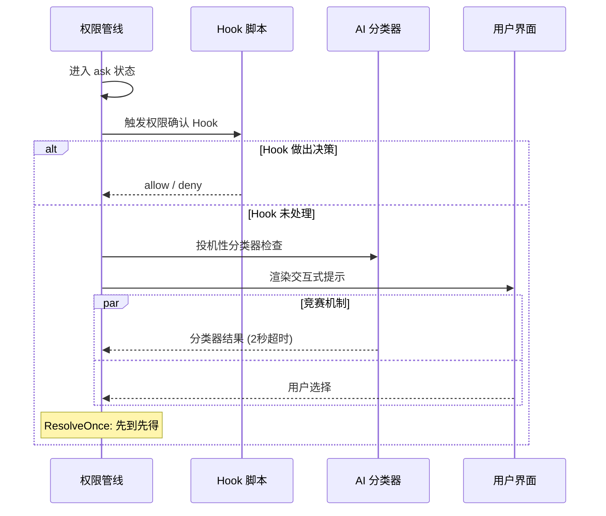
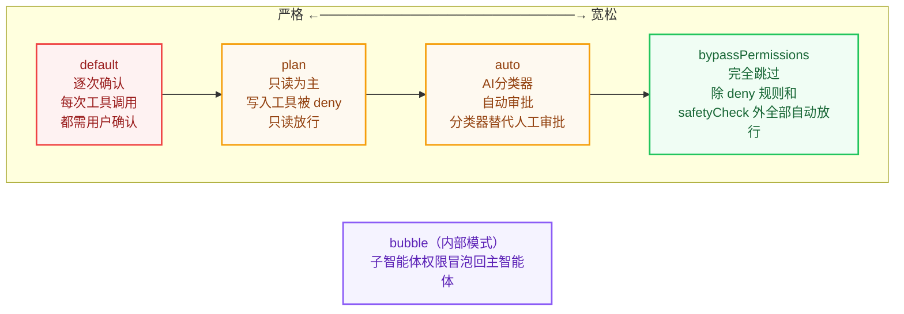
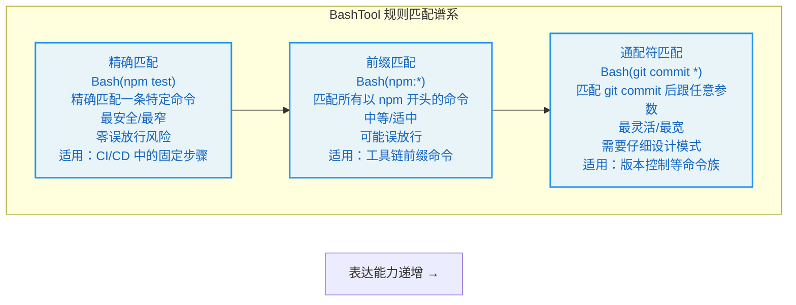
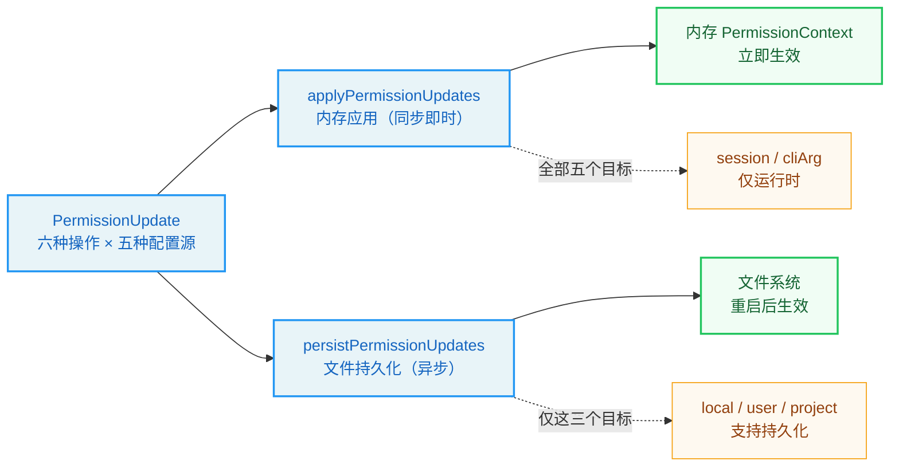

# 第4章：权限管线 -- Agent 的护栏

> 学习目标：阅读本章后，你将能够：

> - 理解 Claude Code 四阶段权限检查流程的设计原理和工程权衡
> - 掌握权限上下文的设计哲学和不可变数据模式
> - 分析五种权限模式的行为差异和适用场景
> - 理解 BashTool 精细权限控制的实现机制
> - 掌握企业级安全配置的最佳实践

当 Agent 自主执行任务时，它可能在一次会话中调用数十个工具——写文件、运行 Bash 命令、搜索代码。每一次调用都潜藏着风险：一个不恰当的 `rm -rf`，一次意外的 `npm publish`，都可能造成不可逆的后果。权限管线（Permission Pipeline）正是 Claude Code 为 Agent 构建的安全护栏。它不是简单的"允许/拒绝"开关，而是一套精心设计的多阶段检查机制，在自动化效率与安全控制之间寻找精确的平衡。

用一个物理世界的类比来理解权限管线：一座现代化办公大楼的门禁系统不是只在入口设一个保安（单一检查点），而是在不同区域设置了不同级别的安全检查——大堂只需刷卡，会议室需要预约确认，服务器机房需要指纹验证加双人授权。每一层安全检查都是独立的，即使某一层被绕过，下一层仍然可以阻止未授权的访问。Claude Code 的权限管线正是这种"纵深防御"思想在软件系统中的体现。

本章将从架构设计出发，深入拆解权限管线的每一个阶段，理解其设计决策，并通过实战练习掌握配置方法。

## 4.1 权限管线的四个阶段

Claude Code 的权限检查并非单一函数的布尔判断，而是一条由四个阶段组成的管线（Pipeline）。每个阶段都有自己的职责和短路逻辑：只要前一阶段做出终局决定，后续阶段便不再执行。

这四个阶段可以用一张流程图来直观展示：



这四个阶段分别是：validateInput（输入验证）、hasPermissionsToUseTool（规则匹配）、checkPermissions（上下文评估）和交互式提示（用户确认）。它们共同构成了从"数据合法性"到"人类授权"的完整防线。

### 4.1.1 阶段一：validateInput -- Zod Schema 验证

权限管线的第一道关卡并非权限本身，而是输入数据的合法性。在权限检查函数中，工具的输入会先经过 Zod Schema 解析，使用严格的结构验证。如果输入不符合 Schema 定义（例如 Bash 工具缺少必需的 `command` 字段），解析将抛出异常，工具调用被直接拒绝。这种设计将"数据不合法"与"权限不足"区分开来——前者是编程错误，后者是策略决策。

值得注意的是，解析失败时 `toolPermissionResult` 保持默认的 `passthrough` 状态，随后会被转换为 `ask` 行为，这意味着即使数据验证失败，系统也会优雅地降级为请求用户确认，而非直接崩溃。

这个设计选择体现了一个重要的工程原则：**在安全系统中，错误处理应该是"安全的"而非"正确的"。** 直接崩溃虽然暴露了问题，但在 Agent 运行时可能导致整个会话中断。优雅降级为用户确认是一种更安全的错误处理策略——它让用户有机会决定是否继续，而不是让系统替用户做决定。

### 4.1.2 阶段二：hasPermissionsToUseTool -- 规则匹配

规则匹配是权限管线的核心。`hasPermissionsToUseToolInner` 函数按照严格的优先级顺序依次检查三类规则：deny 规则、ask 规则和 allow 规则。

**步骤 1a：工具级 deny 检查。** 这是最高的优先级。如果某个工具被整体 deny，调用立即被拒绝。

`getDenyRuleForTool` 函数遍历所有来源（userSettings、projectSettings、localSettings、flagSettings、policySettings、cliArg、command、session）的 deny 规则进行匹配。匹配逻辑支持精确工具名匹配和 MCP 服务器级通配符——例如规则 `mcp__server1__*` 可以匹配该服务器下的所有工具。

七种规则来源的优先级排序体现了"就近原则"：会话级规则（最近设置的）优先于命令行参数，命令行参数优先于项目配置，项目配置优先于全局用户配置。这种优先级排序确保了更具体、更近期的规则能够覆盖更一般、更早期的规则。



**步骤 1b：工具级 ask 检查。** 当工具被配置为"总是询问"时，系统会强制弹出确认提示。但有一个例外：当 Bash 工具在沙箱模式下且配置了沙箱自动放行选项时，沙箱化命令可以跳过 ask 规则。这个例外的设计意图是：如果用户已经信任沙箱环境（沙箱中的命令无法影响沙箱外的系统），那么在沙箱内执行命令的风险已经被降低到可接受的水平。

**步骤 2b：工具级 allow 检查。** 如果没有 deny 和 ask 规则命中，系统检查是否存在 allow 规则直接放行。

规则匹配的核心抽象是 PermissionRule 类型，它将来源、行为和目标统一为一个结构化对象。

> **优先级铁律：** deny 始终优先于 allow，无论它们的来源如何。这是安全系统的基本原则——"显式拒绝"的力量大于"显式允许"。即使用户在全局配置中 allow 了某个工具，只要项目级配置 deny 了它，该工具仍然不可用。

### 4.1.3 阶段三：checkPermissions -- 上下文评估

每个工具可以实现自己的 `checkPermissions` 方法，进行更精细的上下文评估。例如 Bash 工具会解析命令中的子命令、检查路径安全性、匹配前缀规则等。这一阶段的调用发生在阶段二的规则匹配之前（代码中的步骤 1c），但其结果可能被后续的 allow 规则覆盖。

`checkPermissions` 返回的 `PermissionResult` 有四种行为：

- `allow`：直接放行，可能携带 `updatedInput`
- `deny`：拒绝执行
- `ask`：需要用户确认
- `passthrough`：交由后续阶段决定（最终会变为 `ask`）

`passthrough` 是一个独特的设计。当一个工具没有特殊的权限逻辑时，它可以返回 `passthrough`，让管线继续流动。在后续步骤中，`passthrough` 被自动转换为 `ask`，附带权限请求消息。

> **设计洞察：** 为什么需要 `passthrough` 而不是让没有特殊权限逻辑的工具直接返回 `ask`？区别在于"意图"——`passthrough` 表示"我没有意见，交给后续阶段决定"，而 `ask` 表示"我认为这个操作需要用户确认"。如果后续的 allow 规则匹配了，`passthrough` 会被覆盖为 `allow`，但 `ask` 不会被覆盖。这个细微的区别在特定场景下会产生不同的行为。

### 4.1.4 阶段四：交互式提示 -- 用户确认

当管线流转到 `ask` 状态时，权限确认 Hook 接管控制。这个 React Hook 将权限请求转化为用户交互界面。`ask` 状态触发的流程包含多条分支路径：协调器权限处理、swarm worker 权限处理、投机性分类器检查，以及交互式权限提示。

最关键的是交互式处理分支，它将权限请求推入确认队列，在终端中渲染确认界面，等待用户做出"允许/拒绝/本次允许"等选择。

在用户响应之前，系统可能还会运行异步的分类器检查（`pendingClassifierCheck`）。这意味着用户在看到提示后，分类器可能在用户还在思考时就已经自动批准了该操作，实现了一种"竞赛"机制——谁先做出决定，谁就生效。



> **最佳实践：** 在企业环境中，如果你希望减少用户频繁看到权限提示的干扰，有三种策略可以组合使用：(1) 在项目配置中预设 allow 规则覆盖常用操作；(2) 使用 auto 模式让分类器自动处理常见请求；(3) 配置 Hook 脚本实现自定义的自动审批逻辑。三种策略可以叠加使用，覆盖从简单到复杂的所有场景。

## 4.2 PermissionContext 的设计

### 4.2.1 ToolPermissionContext 类型结构

`ToolPermissionContext` 是整个权限系统的核心数据结构，它携带了权限检查所需的所有上下文信息。它包含权限模式、额外工作目录、各级规则（allow/deny/ask）、bypass 模式可用性标志、是否应避免权限提示等字段。

这个类型的精妙之处在于它的不可变性（所有字段均为 readonly）。每次权限更新都会产生一个新的 `ToolPermissionContext` 对象，而非修改现有对象。这种不可变数据模式确保了在并发环境下的一致性——多个工具同时检查权限时，各自读取的上下文不会因其他工具的权限更新而意外变化。

不可变性在这里的必要性可以通过一个具体场景来理解：假设工具 A 和工具 B 同时开始权限检查。在检查过程中，工具 A 的用户确认触发了一次权限规则更新（用户选择"始终允许"）。如果 PermissionContext 是可变的，工具 B 可能在检查过程中看到规则被修改，导致同一个请求的前后检查不一致。不可变性确保了每个权限检查使用的都是确定性的快照。

其中规则按来源索引，这种设计允许系统精确追踪每条规则的来源，在规则管理界面中展示"此规则来自项目级设置"等信息。这个能力在多层级配置的场景中至关重要——当一条规则被多个来源定义时，用户需要知道哪条规则在生效、它来自哪里、如何修改它。

### 4.2.2 PermissionDecision 的来源：hook、user、classifier

权限决策（PermissionDecision）有三个来源，每个来源都有不同的信任等级和行为特征：

**hook 来源**：外部 Hook 脚本可以通过权限请求钩子在用户看到提示之前做出决策。这在 CI/CD 环境中特别有用——Hook 脚本可以根据自定义逻辑自动批准或拒绝特定操作。Hook 决策的信任等级最高，因为它代表了系统管理员的显式意图。

**user 来源**：用户在终端界面中的手动选择。`permanent` 标志表示用户是否选择将此决策持久化到配置文件。User 决策的信任等级居中——它代表了当前操作者的意图，但操作者可能不是系统管理员。

**classifier 来源**：AI 分类器在 auto 模式下做出的自动决策，后面会详细讨论。Classifier 决策的信任等级最低——它是 AI 的判断，可能出错，因此某些安全检查类型是"分类器免疫"的。

`PermissionDecision` 本身是一个联合类型，包含 allow、ask 和 deny 三种行为。

> **设计洞察：** 三种决策来源的信任等级排序（hook > user > classifier）体现了"信任与能力匹配"的原则：Hook 脚本由系统管理员编写，具有最高的系统理解能力，因此信任等级最高；分类器是 AI 自动判断，虽然准确率很高但仍可能出错，因此信任等级最低。

### 4.2.3 ResolveOnce 模式：原子化的竞争解决

在权限交互中，多个异步参与者可能同时尝试解决（resolve）同一个权限请求——用户点击"允许"的同时分类器也返回了"通过"。`ResolveOnce` 模式正是为解决这种竞争条件而设计的。它提供 resolve、isResolved 和 claim 三个方法。

其实现使用了一个 `claimed` 标志确保原子性。`claim()` 方法是关键——它提供了一种"先到先得"的原子操作。在 JavaScript 的单线程模型中，`claim()` 保证了即使两个异步回调几乎同时被调度，也只有一个能成功 claim，另一个会被拒绝。这是一种轻量级的互斥锁实现，避免了分布式系统中常见的锁开销。

> **交叉引用：** ResolveOnce 模式与第 2 章的"不可变状态流转"原则一脉相承。两者都通过原子化的状态变更来保证并发安全性——状态要么是旧的，要么是新的，不存在"一半新一半旧"的中间态。

这个设计可以用一个现实世界的类比来理解：想象一张"单程机票"——一旦被某人兑换（claim），其他人就无法再使用同一张机票。不需要锁、不需要等待、不需要协调——只需要一个简单的"已兑换"标志。ResolveOnce 的 `claim()` 方法就是这张机票的兑换操作。

## 4.3 权限模式谱系

Claude Code 定义了五种内部权限模式，它们构成了一个从严格到宽松的谱系。理解这个谱系对于选择合适的权限配置至关重要。



### 4.3.1 default 模式：逐次确认

`default` 模式是最保守的模式。除了被明确 allow 规则放行的工具外，每次工具调用都需要用户确认。这是普通用户启动 Claude Code 时的默认体验。在权限模式配置中，default 模式体现了其保守基调，UI 标识上无特殊标记，暗示这是"标准状态"。

**适用场景：** 日常交互式使用。开发者希望在 Agent 执行任何有潜在风险的操作之前进行确认，确保完全掌控 Agent 的行为。

**用户体验权衡：** 最安全但最繁琐。对于一个大型重构任务，Agent 可能需要执行数十次文件编辑和命令运行，每次确认都会打断开发者的思路。

### 4.3.2 plan 模式：只读为主

`plan` 模式将 Agent 限制在只读操作范围内。它的 UI 标识是一个暂停图标。

在 plan 模式下，写入类工具（Edit、Write）的权限检查会返回 `deny`，但读取类工具（Read、Grep、Glob）正常放行。值得注意的细节是当 plan 模式的 bypass 可用性标志为 true 时，意味着用户原本使用的是 bypass 模式然后切换到了 plan 模式，此时 bypass 的放行逻辑仍然生效。

**适用场景：** 代码审查和架构分析。开发者希望 Agent 先"看看"代码，不修改任何内容，先给出分析和建议，再决定是否执行修改。

**设计哲学：** plan 模式体现了"先理解后行动"的工作流——Agent 先以只读模式理解代码库，给出修改方案，获得用户认可后再切换到执行模式。这种两阶段工作流在处理大型代码库时尤其有效，可以避免 Agent 在没有充分理解的情况下做出不恰当的修改。

### 4.3.3 auto 模式：自动审批（带分类器）

`auto` 模式是 Claude Code 最精巧的模式之一。它使用 AI 分类器（称为 "YOLO classifier"）来代替人工审批。当权限管线到达 `ask` 状态且模式为 `auto` 时，系统会调用分类器进行 AI 判断，将工具名称和输入格式化为分类器可理解的格式，并发送对话上下文和工具列表供分类器参考。

auto 模式的核心挑战是在"自动化效率"和"安全性"之间找到平衡。纯粹的自动放行太危险，纯粹的逐次确认太慢。AI 分类器是两者的折中——它用另一个 AI 来判断当前 AI 的操作是否安全，实现了一种"AI 监督 AI"的架构。

auto 模式实现了多层优化以减少分类器的 API 调用开销：

1. **acceptEdits 快速路径**：在调用分类器之前，先用 acceptEdits 模式检查工具是否会被放行。如果在 acceptEdits 模式下通过，直接放行，无需调用分类器。这是一个"短路优化"——如果已知是安全的，就不需要浪费 API 调用。

2. **安全工具白名单**：不需要分类器检查的安全工具包括 Read、Grep、Glob、TodoWrite 等只读或低风险工具。这个白名单的设计哲学是"显式声明安全"——只有在白名单中的工具才跳过分类器检查，新工具默认需要检查。

3. **拒绝追踪**：当分类器连续拒绝多次后，系统会自动回退到交互式提示，防止 Agent 在无意义的循环中浪费 token。这个机制相当于"熔断器"——当自动决策的准确率下降到某个阈值时，自动回退到人工确认。

auto 模式的一个重要安全设计是：某些安全检查类型的决策（如涉及 `.git/`、`.claude/` 目录的操作）是"分类器免疫"的——即使分类器试图批准它们，这些安全检查也不会被绕过。

> **反模式警告：** auto 模式不适合以下场景：(1) 涉及生产环境部署的操作；(2) 涉及敏感数据（密钥、凭证）的操作；(3) 不可逆操作（如删除数据库）。在这些场景下，即使用户信任分类器的判断，也应该使用 default 模式或配置显式的 deny 规则。

### 4.3.4 bypassPermissions 模式：完全跳过

`bypassPermissions` 模式是权限系统的"关闭开关"。当激活时，除了被 deny 规则阻止和不可绕过的安全检查之外，所有工具调用都自动放行。判断是否应该绕过权限时会检查当前模式是否为 bypassPermissions，或者模式为 plan 但 bypass 标志可用。

但即使 bypass 模式也无法突破以下防线：
- 步骤 1a 的 deny 规则（在 bypass 检查之前执行）
- 步骤 1e 的 `requiresUserInteraction` 检查
- 步骤 1f 的内容级 ask 规则
- 步骤 1g 的 safetyCheck

这种分层防御设计确保了"完全信任"模式下仍有最低限度的安全保障。

**适用场景：** CI/CD 管道、自动化测试、受控的执行环境。在这些场景下，Agent 的操作已经通过其他方式（如容器隔离、网络隔离）进行了安全保障，权限检查只会增加不必要的延迟。

> **企业级安全最佳实践：** 如果你的团队使用 bypass 模式，强烈建议：(1) 在容器或虚拟机中运行 Claude Code，确保文件系统隔离；(2) 配置显式的 deny 规则阻止危险操作（如 `Bash(rm -rf *)`、`Bash(npm publish)`）；(3) 使用 `--allowedTools` 参数限制可用工具范围；(4) 启用审计日志记录所有工具调用。

### 4.3.5 bubble 模式：子智能体权限冒泡

`bubble` 模式是内部模式（不对外暴露），用于子智能体（subagent）场景。当主 Agent 生成子智能体时，子智能体的权限检查会"冒泡"回主 Agent 的权限上下文，确保子智能体不会获得超出主 Agent 的权限。

> **交叉引用：** bubble 模式与第 3 章的 AgentTool 紧密相关。AgentTool 在创建子智能体时通过 `createSubagentContext` 设置 bubble 模式，确保子智能体的权限边界不超过主智能体。

内部权限模式类型包含了所有模式（包括 auto 和 bubble），而外部可见性检查函数确保内部模式不会泄露到外部接口。这种内外有别的类型设计是"信息隐藏"原则的体现——外部用户不需要知道 bubble 模式的存在，它是内部实现细节。

## 4.4 BashTool 的权限细节

Bash 工具是权限系统中最复杂的工具，因为 shell 命令的组合性和表达力远超其他工具。一个简单的 `git` 命令可以是安全的（`git status`），也可以是危险的（`git push --force origin main`）。权限系统需要理解命令的语义，而不仅仅是匹配命令名。

### 4.4.1 命令分类与通配符匹配

权限规则字符串的解析由专用函数处理，支持三种格式：不含括号的工具名匹配，以及含括号的 ToolName(content) 格式（用于指定工具级别的精确命令匹配）。

对于 Bash 工具，`ruleContent` 可以是：
- 精确命令：`Bash(npm test)` -- 仅匹配 `npm test`
- 前缀规则：`Bash(npm:*)` -- 匹配所有以 `npm` 开头的命令
- 通配符规则：`Bash(git commit *)` -- 匹配 `git commit` 后跟任意参数

这三种格式形成了一个表达能力递增的谱系：



通配符匹配引擎实现了完整的模式匹配，处理转义序列，将通配符 `*` 转换为正则表达式，支持转义 `\*` 和 `\\`。

一个优雅的细节：当模式以 ` *`（空格加通配符）结尾且这是唯一的通配符时，尾部的空格和参数变为可选的。这意味着规则 `git *` 既匹配 `git add .` 也匹配裸 `git` 命令——与 `git:*` 前缀语义保持一致。这种"等价语法"的设计减少了用户的认知负担——你不需要记住两种不同的语法规则，`git:*` 和 `git *` 做同样的事。

### 4.4.2 前缀提取规则

前缀提取处理了向后兼容的 `:*` 语法，通过正则匹配提取冒号前的部分作为前缀。

当解析规则时，系统首先检查 `:*` 语法（前缀匹配），然后检查通配符，最后回退到精确匹配。这个优先级排序是"从宽到窄"的——先尝试匹配范围最广的规则，然后逐步缩小范围。

> **最佳实践：** 在编写 BashTool 权限规则时，优先使用前缀匹配（`:*` 语法）而非通配符匹配。前缀匹配的语义更清晰、更不容易出错。例如 `Bash(npm:*)` 比 `Bash(npm *)` 更明确地表达了"所有以 npm 开头的命令"的意图。

### 4.4.3 分类器自动审批机制

Bash 工具有自己的分类器自动审批机制，与 auto 模式的 YOLO 分类器并行运行。当权限请求处于 `ask` 状态时，系统会尝试"投机性"运行分类器检查。

这里有一个精心设计的超时机制——使用 Promise 竞争让分类器检查与 2 秒定时器竞争。如果分类器在 2 秒内返回高置信度的匹配结果，则自动批准该操作；否则用户就会看到交互式提示。这种"尽力而为"的策略确保了分类器不会成为用户体验的瓶颈。

2 秒的超时选择是经过权衡的：太短（如 500ms）可能因为网络延迟导致分类器来不及响应，太长（如 10 秒）会让用户感到等待时间过长。2 秒是一个"甜蜜点"——对于简单的命令，分类器通常在 1 秒内就能响应；对于复杂的命令，2 秒的超时确保用户不会等待太久。

## 4.5 权限更新与持久化

### 4.5.1 PermissionUpdate 模式

权限更新通过 `PermissionUpdate` 联合类型表达，支持六种操作：添加规则、替换规则、移除规则、设置模式、添加目录和移除目录。

每种操作都指定了更新要应用到的配置源：全局用户设置、项目级设置、本地（不提交到版本控制）设置、仅当前会话、命令行参数。

六种操作和五种配置源的组合形成了 30 种可能的更新操作。这种细粒度的控制允许用户在不同层面管理权限——例如，在全局用户设置中 allow 所有 `git` 命令，但在特定项目的本地设置中 deny `git push --force`。

### 4.5.2 applyPermissionUpdates 与 persistPermissionUpdates

`applyPermissionUpdates` 将更新应用到内存中的权限上下文，是即时生效的。它遍历所有更新，逐个应用到上下文对象上，返回更新后的新上下文。

`applyPermissionUpdate` 处理每种更新类型。以 `addRules` 为例，它会将规则字符串添加到对应行为类型（allow/deny/ask）和对应来源的规则列表中，通过不可变更新产生新的上下文对象。

而 `persistPermissionUpdates` 将更新写入文件系统，确保在重启后仍然生效。只有本地设置、用户设置和项目设置三个目标支持持久化。会话级和命令行参数级的更新仅在运行时生效。

这两个函数的分离设计非常重要：内存应用是同步且即时的，而文件持久化可能涉及 I/O 操作。在权限上下文的用户允许处理方法中，两者被串联调用。

这种"内存优先、持久化异步"的设计模式在高性能系统中很常见：先确保内存状态正确（影响当前行为），然后异步写入持久存储（影响未来行为）。如果持久化失败，当前会话的行为不受影响，但重启后规则会丢失。



持久化函数返回一个布尔值指示是否有持久化更新发生，这被用于日志记录中标记"永久"还是"临时"决策。

> **企业级安全最佳实践：** 权限规则的持久化设计在团队协作中尤为重要。推荐的做法是：(1) 将团队通用的 allow/deny 规则放在项目级 `.claude/settings.json` 中，提交到版本控制，确保所有团队成员共享相同的安全基线；(2) 将个人偏好的规则放在 `.claude/settings.local.json` 中，不提交到版本控制；(3) 使用会话级规则处理临时需求，避免污染持久化配置。

---

## 实战练习：配置项目级权限系统

### 练习 1：配置项目级 .claude/settings.json

让我们通过一个实际场景来理解权限配置。假设你正在开发一个 Node.js 项目，希望 Claude Code 能够自动执行以下操作：

1. 运行 `npm test` 和 `npm run lint` 而不需要每次确认
2. 允许执行所有 `git` 命令
3. 禁止执行 `npm publish`
4. 禁止删除 `node_modules` 之外的目录

创建项目根目录下的 `.claude/settings.json`：

```json
{
  "permissions": {
    "allow": [
      "Bash(npm test)",
      "Bash(npm run lint)",
      "Bash(git:*)",
      "Read",
      "Glob",
      "Grep"
    ],
    "deny": [
      "Bash(npm publish)",
      "Bash(rm -rf *)"
    ]
  }
}
```

**解析规则：**

- `Bash(npm test)` -- 精确匹配，仅允许 `npm test` 这一条命令
- `Bash(git:*)` -- 前缀匹配，允许所有 `git` 开头的命令（`git add`、`git commit` 等）
- `Read` -- 无 `ruleContent`，表示允许所有 Read 工具调用
- `Bash(npm publish)` -- deny 规则，精确拒绝发布操作

如果你希望规则仅在本地生效（不提交到 Git），可以改用 `.claude/settings.local.json`，其配置格式相同，但 `.gitignore` 默认排除它。

### 练习 2：更精细的通配符控制

更精细的控制可以使用通配符：

```json
{
  "permissions": {
    "allow": [
      "Bash(npm run *)",
      "Bash(npx eslint *)"
    ],
    "deny": [
      "Bash(npm publish *)",
      "Bash(* > /etc/*)"
    ]
  }
}
```

`Bash(npm run *)` 会匹配 `npm run build`、`npm run test:coverage` 等所有子命令。而 `Bash(* > /etc/*)` 使用多个通配符来拦截任何尝试写入 `/etc` 目录的命令。

**思考题：** `Bash(npm run *)` 是否也会匹配 `npm run`（不带子命令）？为什么？提示：回顾 4.4.1 节中关于尾部通配符的讨论。

### 练习 3：企业级安全配置模板

为一个使用 Claude Code 的开发团队设计安全配置。要求：

1. 团队成员可以在项目目录下自由读写代码
2. 禁止修改 `.github/workflows/` 下的 CI 配置
3. 禁止执行 `npm publish`、`docker push` 等发布操作
4. 允许运行 `npm test`、`npm run build`、`npm run lint`
5. 禁止访问 `/etc`、`/var` 等系统目录

尝试分别设计 `.claude/settings.json`（团队共享，提交到版本控制）和 `.claude/settings.local.json`（个人偏好，不提交到版本控制）的内容。

**提示：** 利用 deny 规则的优先级高于 allow 规则的特性，先用宽泛的 allow 规则授权基本操作，再用精确的 deny 规则排除危险操作。

### 练习 4：权限决策流的情景分析

分析以下场景中权限管线的决策路径：

**场景 A：** 用户在 default 模式下请求 `Bash(npm test)`，且 `.claude/settings.json` 中配置了 `"allow": ["Bash(npm test)"]`。

**场景 B：** 用户在 auto 模式下请求 `Bash(curl https://api.example.com/data)`，且没有相关规则。

**场景 C：** 用户在 bypass 模式下请求 `Bash(rm -rf /tmp/test)`，且 `.claude/settings.json` 中配置了 `"deny": ["Bash(rm -rf *)"]`。

**场景 D：** 子智能体（bubble 模式）请求 `FileWriteTool` 写入敏感配置文件。

对每个场景，画出权限管线四阶段的决策路径，说明最终结果和原因。

---

## 关键要点总结

1. **四阶段管线**：权限检查按照 validateInput -> 规则匹配 -> checkPermissions -> 交互式提示的顺序逐级推进，任何阶段都可以做出终局决定。这种纵深防御的设计确保了没有单一的安全检查点是"银弹"，但每一层都可以独立短路，阻止不安全的操作。

2. **优先级铁律**：deny 规则的优先级最高，始终在 allow 规则之前检查。即使用户配置了 `bypassPermissions` 模式，deny 规则和 safetyCheck 仍然生效。这个铁律确保了安全策略的不可妥协性——无论系统处于什么模式，显式拒绝的规则永远有效。

3. **PermissionContext 的不可变性**：每次权限更新产生新的上下文对象，确保并发安全。这与第 2 章的"不可变状态流转"原则和第 3 章的工具上下文管理一脉相承——不可变性是贯穿整个系统的核心设计模式。

4. **ResolveOnce 原子竞争**：用户交互和分类器自动审批之间通过 `claim()` 原子操作解决竞争，保证只有一个决策者。这个轻量级的互斥机制避免了复杂的锁管理，同时确保了决策的确定性。

5. **五模式谱系**：从最严格的 `default` 到最宽松的 `bypassPermissions`，中间有 `plan`（只读）、`auto`（AI 分类器）、`bubble`（子智能体冒泡）三种特殊模式，覆盖从交互开发到自动化的完整场景。选择合适的模式是平衡安全性和效率的关键。

6. **Bash 工具的精细控制**：支持精确匹配、前缀匹配（`:*` 语法）和通配符匹配三种规则格式，以及投机性分类器自动审批。BashTool 的权限系统是整个管线中最复杂的部分，因为 Shell 命令的组合性和表达力远超其他工具类型。

7. **双层更新机制**：`applyPermissionUpdates` 即时修改内存上下文，`persistPermissionUpdates` 异步写入文件系统，两者分离确保了响应速度和数据持久化。这种"内存优先、持久化异步"的模式是高性能系统的通用设计模式。

8. **企业级安全的关键**：在团队环境中，通过项目级 `settings.json`（共享）和本地 `settings.local.json`（个人）的组合配置，结合 deny 优先的规则体系，可以构建覆盖从个人开发到团队协作的安全策略。

在本书的第二部分中，我们将深入分析 Claude Code 的核心子系统，包括上下文管理的压缩策略、缓存感知设计的实现细节、流式架构的错误恢复机制等。这些子系统共同构成了 Agent Harness 的工程基础设施，理解它们的设计将帮助你从"理解架构"走向"能够构建"。
