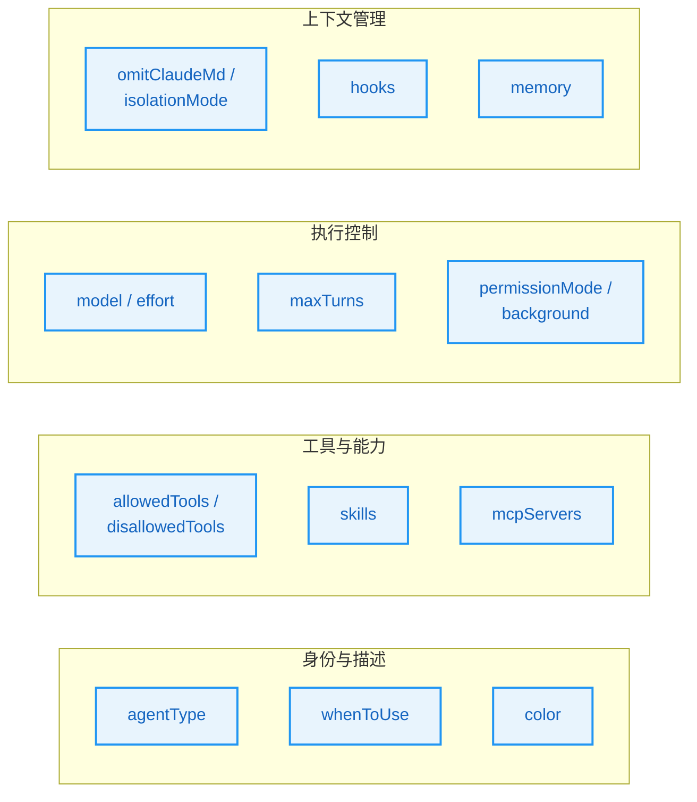
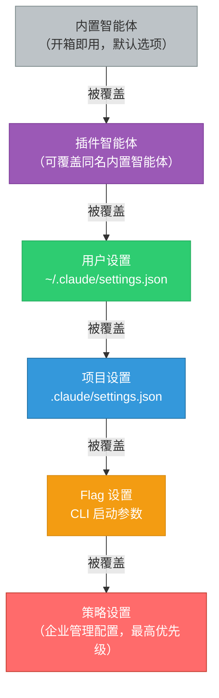
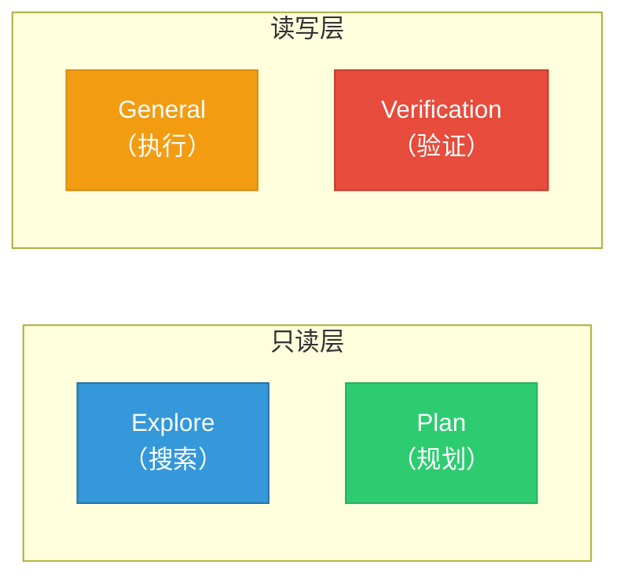
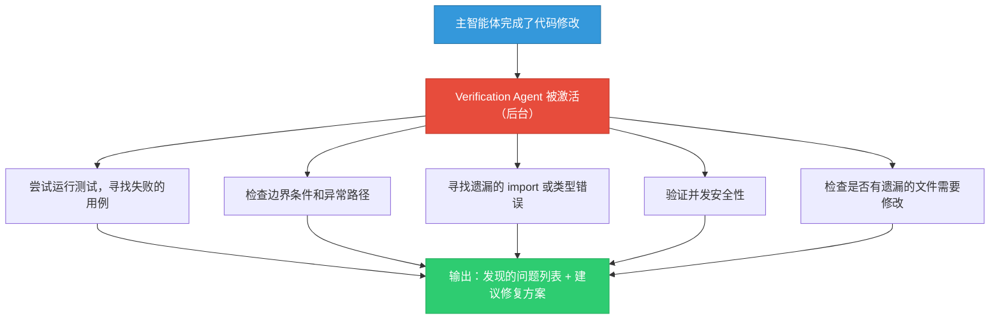
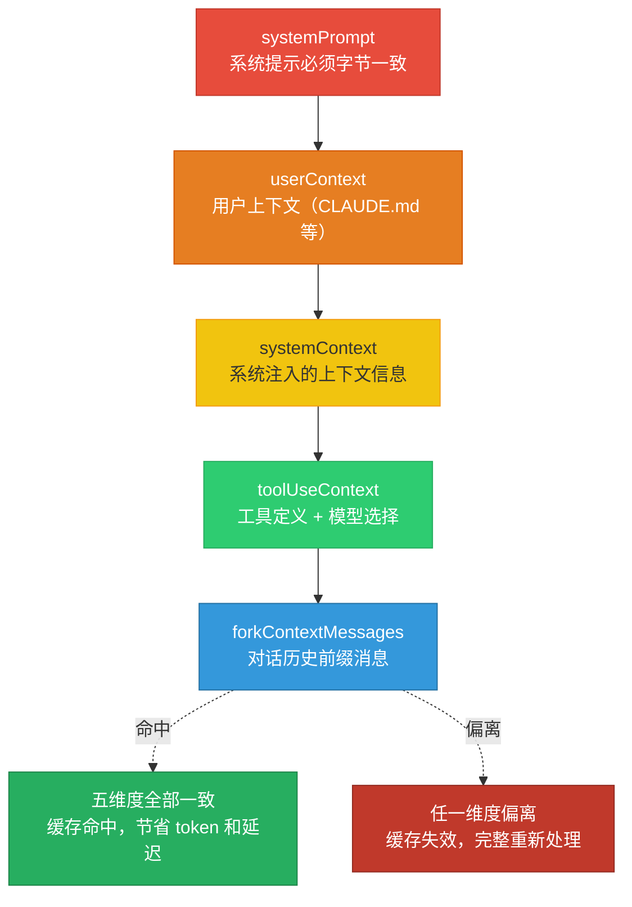
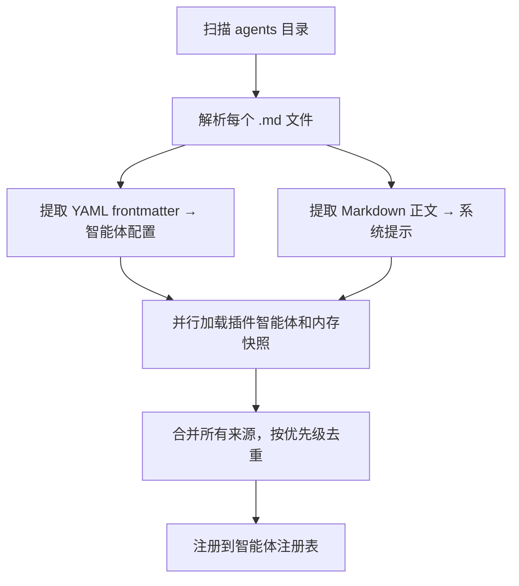
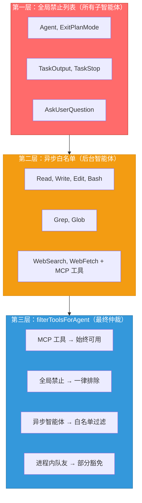
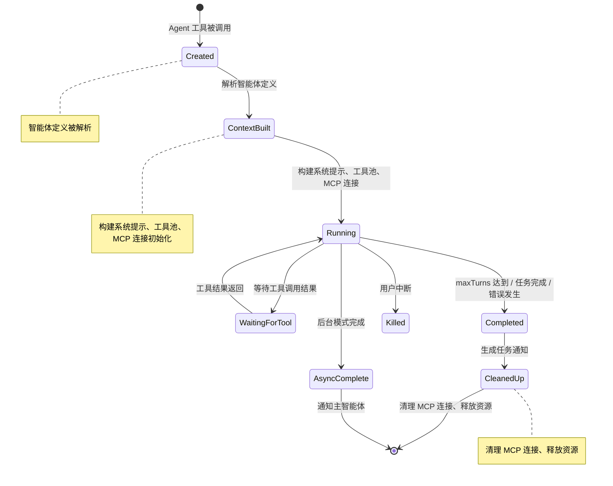

# 第9章：子智能体与 Fork 模式

> **学习目标：**
> - 深入理解子智能体的生成机制和完整生命周期管理
> - 掌握 Fork 模式的缓存共享策略与字节级继承原理
> - 学会设计和创建自定义智能体以应对特定场景需求
> - 理解对抗性验证 Agent 的设计哲学及其工程意义

Claude Code 的真正威力不仅在于单轮对话的能力，更在于它可以将复杂任务委派给专门的子智能体（Subagent）并行处理。想象一个大型交响乐团：指挥家（主智能体）不需要亲自演奏每一种乐器，而是将不同声部的演奏交给各自领域的专家（子智能体）。本章将深入解析 AgentTool 的完整架构，揭示内置智能体的设计哲学，并重点拆解 Fork 模式如何通过精巧的缓存策略实现真正的并行执行而不浪费 token。

---

## 9.1 AgentTool 架构

### 目录结构与模块职责

AgentTool 的代码位于智能体工具目录下，由以下核心模块组成：

| 职责 | 说明 | 设计考量 |
|------|------|----------|
| 工具主入口 | 处理输入 schema、路由策略、同步/异步分支 | 单一入口点降低调用复杂度 |
| 智能体运行器 | 管理生命周期、上下文构建、MCP 初始化 | 生命周期与业务逻辑解耦 |
| Fork 模式实现 | 构建缓存安全的消息前缀 | 缓存策略独立演进 |
| 内置智能体注册表 | 根据 feature gate 动态加载 | 按需加载减少启动开销 |
| 自定义智能体加载 | 解析 Markdown/JSON 定义 | 用户友好的声明式配置 |
| 工具函数集 | 工具过滤、解析、结果格式化等 | 可复用的基础设施 |

这套架构的核心设计原则是**关注点分离**：工具主入口负责"决定做什么"，运行器负责"怎么做"，Fork 模块负责一种特定的"怎么做得更高效"的策略。

> **架构洞察：为什么不将路由逻辑和执行逻辑合并？**
>
> 在很多简单系统中，路由和执行是同一个模块。但 Claude Code 的场景远比简单系统复杂——一个工具调用可能走同步路径（主线程等待）、异步路径（后台执行）或 Fork 路径（缓存并行）。将路由决策与执行过程分离，意味着当需要新增一种执行策略（比如未来的"流式子智能体"）时，只需要在路由层增加一个分支，而不需要修改运行器核心逻辑。这是经典的**策略模式**在系统架构层面的应用。

### BaseAgentDefinition 类型定义

所有智能体都基于智能体加载模块中定义的 `BaseAgentDefinition` 类型，包含以下关键字段：智能体唯一标识符（agentType）、使用场景描述（whenToUse）、允许/禁止的工具列表、预加载的 skill 名称、智能体专属 MCP 服务器、生命周期钩子、UI 显示颜色、模型指定、推理努力程度、权限模式、最大轮次限制、是否后台运行、隔离模式、是否省略 CLAUDE.md 上下文等。

这些字段并非随意堆砌，而是可以按照功能维度归类为四大类：



从这个类型衍生出三种具体的智能体定义：

- **BuiltInAgentDefinition**（内置智能体）：通过 `getSystemPrompt()` 动态生成系统提示。内置智能体的提示在编译时固定，但运行时通过函数动态构建，这样可以在不同环境（feature gate 开关状态不同）下生成不同的提示内容。
- **CustomAgentDefinition**（自定义智能体）：来自用户/项目/策略设置。用户通过 Markdown 文件声明式定义，系统自动解析。
- **PluginAgentDefinition**（插件智能体）：插件提供的智能体，带有 plugin 元数据。插件智能体可以携带额外的版本信息和依赖声明。

> **交叉引用：** 插件智能体的加载机制与第11章的插件系统紧密相关。插件不仅可以提供技能（Skill），还可以提供智能体（Agent），两者共享相同的插件发现和加载基础设施。

### 三种智能体来源

智能体的加载优先级由加载合并函数决定：



1. **内置智能体**（built-in）：优先级最低，作为默认选项
2. **插件智能体**（plugin）：可以覆盖内置智能体
3. **用户设置**（userSettings） -> **项目设置**（projectSettings） -> **Flag 设置**（flagSettings） -> **策略设置**（policySettings）：优先级依次升高

这意味着策略级别的自定义智能体可以覆盖同名内置智能体，为企业部署提供了灵活性。

> **实际使用场景：企业安全审计覆盖**
>
> 假设一个金融科技公司需要所有代码审查都遵循内部安全规范。管理员可以在策略设置中定义一个名为 `code-review` 的智能体，覆盖内置的同名智能体。这个自定义版本会在系统提示中加入公司特定的安全检查清单（如 PCI-DSS 合规检查），并接入内部的漏洞扫描 MCP 服务器。这样无论开发者如何配置个人设置，企业级的安全审查标准始终生效。

---

## 9.2 内置智能体

内置智能体在注册模块中通过 `getBuiltInAgents()` 函数返回当前环境下可用的智能体列表。每个智能体都被精心设计为特定领域的专家。它们的组合覆盖了软件工程中最常见的四种工作模式：探索、规划、执行和验证。



### Explore Agent：只读代码探索专家

Explore Agent 是一个高速只读搜索智能体。它的定义中声明了严格的禁止操作列表：禁止 Agent、ExitPlanMode、FileEdit、FileWrite、NotebookEdit 等工具，并可选择使用 haiku 模型以降低成本，同时省略 CLAUDE.md 以节省 token。

其核心设计理念体现在两个关键决策上：

**第一，严格的只读约束。** 系统提示中声明了严格的禁止操作列表（不能创建文件、修改文件、运行任何改变系统状态的命令），并且在工具层面通过 disallowedTools 物理禁止了 Edit、Write 等工具。这种"双重锁"设计——提示层面的软约束加上工具层面的硬约束——确保了即使模型"幻觉"中想要修改文件，也会因工具不可用而被物理阻止。

**第二，omitClaudeMd 优化。** Explore 是只读搜索智能体，不需要 commit/PR/lint 规则。CLAUDE.md 通常包含项目的编码规范、commit 消息格式、PR 模板等内容，这些对于一个只做搜索的智能体完全无用。省略 CLAUDE.md 不仅减少了 token 消耗，更重要的是减少了系统提示的噪声，让模型更聚焦于搜索任务本身。这一优化据估计每周可节省 5-15 Gtoken。

> **最佳实践：如何有效利用 Explore Agent**
>
> Explore Agent 最适合以下场景：
> - **代码考古**：快速定位某个 bug 的根因，追踪调用链路
> - **依赖分析**：理解某个函数被哪些模块引用
> - **架构探索**：梳理项目的目录结构和模块关系
> - **知识检索**：查找某个特定配置项或常量的定义位置
>
> 使用提示：给 Explore Agent 足够具体的搜索目标，比如"找到处理用户认证的所有中间件函数"比"看看代码"效果好得多。

### Plan Agent：结构化规划智能体

Plan Agent 复用了 Explore Agent 的工具集（同样禁止 Edit、Write 等修改类工具），但承担不同角色——它是软件架构师和规划专家。Plan Agent 使用 inherit 模型并省略 CLAUDE.md，其系统提示要求它输出结构化的实现计划，并以"关键文件"列表结尾，为后续的实现阶段提供清晰指引。

Plan Agent 的输出通常包含以下结构化信息：

| 输出要素 | 说明 | 对后续阶段的价值 |
|---------|------|-----------------|
| 问题分析 | 对当前需求的理解和拆解 | 确保实现方向正确 |
| 实施步骤 | 按优先级排列的修改步骤 | General Agent 可按步骤逐一执行 |
| 关键文件 | 需要阅读和修改的文件列表 | 减少后续阶段的搜索开销 |
| 风险评估 | 可能的副作用和注意事项 | Verification Agent 的检查重点 |
| 依赖关系 | 步骤之间的前后依赖 | 决定是否可以并行执行 |

> **为什么 Plan Agent 要省略 CLAUDE.md？**
>
> 这与 Explore Agent 的原因相同但又有微妙的区别。Explore 省略是因为"不需要"，Plan 省略是因为"不应该"。规划阶段的目的是理解代码结构并制定计划，不应该受限于项目特定的编码风格约束。如果 Plan Agent 看到了"本项目使用 camelCase 命名"这样的规则，它可能会在规划阶段就考虑命名细节，而这些细节应该在实现阶段处理。省略 CLAUDE.md 让 Plan Agent 更关注"做什么"而非"怎么做"。

### General Purpose Agent：通用智能体

General Purpose Agent 是最灵活的智能体，拥有全部工具权限（使用通配符 `'*'` 允许所有工具）。但实际可用工具仍受全局过滤函数的约束。它是实际干活的"执行者"——前面 Explore 负责侦查，Plan 负责制定计划，General Purpose 负责动手修改。

General Purpose Agent 的设计哲学是"默认信任，边界后移"。它不做工具层面的预设限制，而是依赖全局安全层（权限系统、工具过滤函数）来确保安全。这种设计的好处是灵活性最大化——不同的任务可以动态组合不同的工具集，而不需要为每种任务预定义工具白名单。

> **反模式警告：不要用 General Purpose Agent 做只读任务**
>
> 虽然 General Purpose Agent 技术上可以执行只读搜索，但这会带来不必要的成本和安全风险。只读任务应该使用 Explore Agent：它的 haiku 模型更便宜、省略 CLAUDE.md 节省 token、工具限制消除了意外修改的风险。这是一个典型的**最小权限原则**的应用。

### Verification Agent：验证智能体

Verification Agent 是一个独特的"对抗性"智能体，设计目标是**尽可能破坏被验证的代码**，而不是确认它能工作。它使用红色 UI 标识强调对抗性质，始终后台运行，禁止修改项目文件，使用 inherit 模型。

#### 对抗性设计的深层哲学

Verification Agent 的系统提示明确警告了两种失败模式：

1. **验证回避（Verification Avoidance）**：模型倾向于找借口不运行测试，比如"这段代码逻辑上看起来正确"或"测试环境配置复杂"。系统提示列出了常见的自我合理化借口，要求 Agent 必须实际执行验证而非口头确认。

2. **前 80% 的表面正确性（Surface Correctness Trap）**：代码可能通过了基本的 happy path 测试，但在边界条件、并发场景、错误路径上存在隐患。系统提示要求 Agent 特别关注"不那么明显"的失败模式。

这种对抗性设计借鉴了软件工程中的**红队测试**（Red Teaming）理念。传统测试验证"代码按照预期工作"，而红队测试验证"代码在非预期情况下不会崩溃"。将这两种思维应用到同一个 LLM 的不同实例上，形成了一种"左手打右手"的自我对抗机制。



> **设计智慧：为什么 Verification Agent 要后台运行？**
>
> Verification Agent 始终在后台运行，这是一个深思熟虑的设计决策。原因有三：第一，验证是一个"可以等待"的任务——用户不需要实时看到验证过程，只需要看到最终结果；第二，后台运行释放了主线程，让用户可以继续与主智能体交互；第三，后台模式强制验证 Agent 独立工作，不会因为等待用户输入而中断验证流程。

---

## 9.3 Fork 模式：缓存安全的并行执行

Fork 模式是 Claude Code 中最精巧的架构创新之一。它允许主智能体将同一时刻的完整上下文"分叉"给多个并行子任务，同时利用 Anthropic API 的 prompt cache 机制避免重复传输大量 token。

### Fork 模式的直觉理解

如果你熟悉 Unix 系统的 `fork()` 系统调用，Claude Code 的 Fork 模式与其有异曲同工之妙：

| 类比维度 | Unix fork() | Claude Code Fork 模式 |
|---------|-------------|----------------------|
| 触发时机 | 父进程调用 fork() | 主智能体调用 Agent 工具 |
| 继承内容 | 内存映像、文件描述符 | 系统提示、工具定义、对话历史 |
| 分叉后关系 | 父子进程独立运行 | 主/子智能体并行运行 |
| 通信方式 | pipe/shared memory | 任务通知 XML |
| 资源节省 | Copy-on-Write 内存共享 | Prompt Cache token 共享 |
| 递归防护 | 进程层级限制 | querySource 检查 |

### forkSubagent 模块的核心设计

Fork 模式的激活需要满足三个条件：feature gate 开启、非 Coordinator 模式、非非交互模式。当 Coordinator 模式激活时，Fork 模式会被自动禁用，因为 Coordinator 已经拥有自己的任务委派模型。

> **交叉引用：** Coordinator 模式与 Fork 模式的互斥关系将在第10章详细讨论。简言之，Coordinator 是一种更重量的编排模式，适合需要精细任务管理的场景；Fork 是一种轻量级的并行模式，适合将同一上下文分发到多个独立子任务。

在工具主入口的路由逻辑中，当用户省略子智能体类型且 Fork 模式开启时，系统会触发 Fork 路径。

### 继承父对话的完整上下文和系统提示

Fork 子智能体的核心原则是**字节级继承**——子智能体必须与父智能体共享完全相同的 API 请求前缀，才能命中 prompt cache。

在 Fork 路径中，系统会优先使用父智能体已渲染的系统提示字节，避免因重建导致的缓存失效。只有在无法获取已渲染提示时才降级到重建路径。重建可能因特性开关的冷热状态不同而偏离，导致缓存失效，因此传递渲染后的字节是保证精确匹配的关键。

> **为什么是字节级而非语义级？**
>
> Prompt cache 是 Anthropic API 的底层基础设施优化，它通过字节前缀匹配来复用已处理的 token。这意味着即使两段文本"语义完全相同"，只要在字节层面有任何一个字符的差异（哪怕是一个多余的空格或换行符），缓存就不会命中。这就是为什么 Fork 模式需要传递已渲染的原始字节而非重新构建——重新构建可能在空白字符、属性顺序等细微之处产生差异，而这些差异足以导致整个缓存前缀失效。
>
> 一个形象的比喻：prompt cache 就像 HTTP 缓存中的 ETag，它比对的是内容的精确哈希值。即使你把一段 HTML 重新格式化了缩进，虽然浏览器渲染结果相同，但 ETag 已经变了，缓存就失效了。

### CacheSafeParams 五个维度

缓存安全参数类型定义了缓存命中的关键契约，包含五个维度：系统提示（systemPrompt）、用户上下文（userContext）、系统上下文（systemContext）、工具定义和模型（toolUseContext）、对话前缀消息（forkContextMessages）。



这五个维度对应 Anthropic API 缓存键的组成：system prompt、tools、model、messages prefix、thinking config。只有这五个维度完全一致时，子请求才能命中父请求的缓存。

Fork 路径通过 `useExactTools` 标志确保工具定义不变——当 Fork 模式激活时，直接使用父工具池而非重新解析智能体工具，从而保持工具定义的字节一致性。

### buildForkedMessages 的巧妙设计

Fork 消息构建函数是缓存共享的核心。它的处理逻辑如下：首先保留完整的父 assistant 消息（包含所有 tool_use 块、thinking、text，但分配新的 UUID）；然后收集所有 tool_use 块；为每个 tool_use 生成统一的固定字符串占位符 tool_result；最后构建单条 user 消息，包含占位符结果和子任务指令。

关键点在于占位符结果是所有 Fork 子智能体共享的固定字符串 "Fork started -- processing in background"。这意味着：

- **所有 Fork 子智能体共享相同的前缀**：`[...历史, assistant(所有 tool_use), user(占位符结果..., 指令)]`
- **只有最后的指令文本不同**：最大化缓存命中面积
- 结果结构为：`[...history, assistant(all_tool_uses), user(placeholder_results..., directive)]`

> **缓存效率分析示例**
>
> 假设一个对话场景：父对话积累了 50,000 token 的历史消息，父智能体的 assistant 消息包含 3 个 tool_use 块（约 2,000 token），系统提示和工具定义约 10,000 token。
>
> **不使用 Fork 模式（传统子智能体）：**
> - 每个子智能体独立构建请求：50,000 + 2,000 + 10,000 = 62,000 token/次
> - 3 个子智能体总计：186,000 input token
>
> **使用 Fork 模式：**
> - 父请求：62,000 token（首次，建立缓存）
> - 3 个子智能体共享前缀：仅各自的"指令文本"部分是新的（约 200 token/个）
> - 3 个子智能体总计：3 * 200 = 600 新增 input token
> - 总计：62,600 input token（其中 62,000 命中缓存）
>
> **节省比例：** (186,000 - 62,600) / 186,000 = 约 66% 的 token 节省
>
> 这种节省在大规模使用（比如一个会话中产生数十个 Fork 调用）时会更加显著。

### 递归 Fork 防护

Fork 子智能体保留了 Agent 工具以维持缓存一致的工具定义，因此必须防止递归 Fork。系统实现了双重检测策略：

1. **querySource 检查**（主防线）：设置在上下文选项上，不受自动压缩影响。这是一个运行时标记，在 Fork 子智能体的上下文中被设置，标识"我是被 Fork 出来的"。由于它不是对话历史的一部分，不会被上下文压缩机制清除，因此即使在长对话中也能可靠地防止递归。

2. **消息扫描**（后备）：检测特定标签，应对 querySource 未传递的边界情况。这是一种防御性编程策略，处理那些 querySource 可能在序列化/反序列化过程中丢失的极端情况。

子任务指令生成函数会生成包含严格行为规范的指令，核心内容包括：声明自己是 Fork 工作进程而非主智能体、禁止生成子智能体、禁止提问或建议下一步操作等。

> **为什么不让 Fork 子智能体也拥有 Fork 能力？**
>
> 表面上看，递归 Fork 可以实现"无限并行"的嵌套执行。但实际上这会带来严重的工程问题：
> - **资源爆炸**：每个 Fork 都会创建一个新的 API 连接和工具实例，递归 Fork 会导致资源使用指数级增长
> - **结果聚合困难**：嵌套的 Fork 结果需要多层聚合，增加了结果丢失的风险
> - **调试困难**：递归结构使得错误追踪和性能分析变得极其复杂
> - **缓存失效**：每一层 Fork 的上下文都会与上一层略有不同，递归层级的缓存命中率会急剧下降

---

## 9.4 自定义智能体

### .claude/agents/ 目录中的定义文件

自定义智能体通过加载合并函数加载。加载流程如下：



1. 扫描 agents 目录中的 Markdown 文件
2. 对每个 Markdown 文件解析智能体定义
3. 并行加载插件智能体和内存快照
4. 合并所有来源，按优先级去重

### Markdown frontmatter 格式

一个完整的自定义智能体 Markdown 文件示例如下：

```markdown
---
name: security-auditor
description: 分析代码中的安全漏洞并生成审计报告
tools:
  - Bash
  - Read
  - Grep
  - Glob
disallowedTools:
  - Write
model: haiku
effort: high
permissionMode: default
maxTurns: 30
color: orange
background: true
memory: project
skills:
  - /commit
mcpServers:
  - slack
hooks:
  PreToolUse:
    - matcher: Bash
      command: "audit-log.sh"
---

你是一位代码安全审计专家。你的职责是：

1. 分析代码中潜在的安全漏洞
2. 检查常见的攻击向量（XSS、SQL 注入、CSRF 等）
3. 生成结构化的审计报告
4. 提供修复建议

报告格式：
- **漏洞级别**：Critical / High / Medium / Low
- **影响范围**：受影响的文件和函数
- **修复建议**：具体的代码修改方案
```

`parseAgentFromMarkdown()` 函数解析这个 frontmatter，将 `name` 映射为 `agentType`，将 Markdown 正文作为系统提示。如果 `memory` 字段启用，系统还会自动注入文件读写工具以支持持久化记忆。

#### 更多自定义 Agent 案例

**案例一：文档生成 Agent**

```markdown
---
name: doc-writer
description: 为代码生成 API 文档和使用指南
tools:
  - Read
  - Grep
  - Glob
  - Write
disallowedTools:
  - Bash
model: haiku
effort: medium
maxTurns: 20
color: blue
background: true
---

你是一位技术文档专家。你的职责是：

1. 阅读代码中的函数签名、类型定义和注释
2. 生成结构化的 API 文档
3. 为复杂逻辑编写使用示例
4. 保持文档风格与现有文档一致

输出要求：
- 使用 Markdown 格式
- 包含参数说明、返回值说明、使用示例
- 标注 deprecated 的 API
```

**案例二：测试生成 Agent**

```markdown
---
name: test-generator
description: 为指定模块自动生成单元测试和集成测试
tools:
  - Read
  - Write
  - Grep
  - Glob
  - Bash
model: inherit
effort: high
maxTurns: 40
color: green
background: true
---

你是一位测试工程师。你的任务是：

1. 阅读目标模块的源码，理解其公开接口和内部逻辑
2. 识别所有需要测试的代码路径
3. 为每个路径编写测试用例
4. 确保测试覆盖：正常路径、边界条件、错误处理

测试原则：
- 测试应该独立、可重复
- 使用有意义的测试描述
- Mock 外部依赖，不 Mock 被测模块内部函数
```

**案例三：性能分析 Agent**

```markdown
---
name: perf-analyzer
description: 分析代码的性能瓶颈并给出优化建议
tools:
  - Read
  - Grep
  - Glob
  - Bash
disallowedTools:
  - Write
  - Edit
model: inherit
effort: high
maxTurns: 25
color: yellow
---

你是一位性能分析专家。你的任务是：

1. 识别代码中的性能热点（O(n^2) 循环、不必要的内存分配、频繁的 I/O）
2. 分析数据库查询效率（N+1 查询、缺失索引）
3. 评估并发和异步模式的使用是否合理
4. 给出具体的优化建议和预估的性能提升

报告格式：
- **问题编号**和严重程度（Critical/High/Medium/Low）
- **代码位置**：文件名:行号
- **问题描述**：为什么这里慢
- **优化建议**：具体的修改方案
- **预期提升**：量化的性能改善预估
```

> **交叉引用：** 自定义智能体的 hooks 配置与第8章的 Hook 系统使用相同的格式。你可以为智能体定义 PreToolUse、PostToolUse 等生命周期钩子，实现诸如审计日志、自动格式化等横切关注点。

---

## 9.5 智能体工具隔离

### 全局禁止列表

系统定义了全局禁止列表，所有子智能体都不能使用这些工具，包括：防止递归获取输出的工具、Plan mode 相关工具（仅主线程可用）、Agent 工具（防止递归嵌套）、向用户提问的工具、任务停止工具（需要主线程任务状态）。



### 异步智能体白名单

异步（后台）智能体的工具集进一步受限为白名单集合，包括 Read、Write、Edit、Bash、Grep、Glob、WebSearch 等核心工具，但不包括 TaskOutput、Agent 等可能导致递归的工具。

### filterToolsForAgent

工具过滤函数是最终的仲裁者，实现三层过滤机制：MCP 工具始终可用；全局禁止工具一律排除；异步智能体只能使用白名单工具，但进程内队友可以豁免部分限制。

> **设计考量：为什么 MCP 工具始终可用？**
>
> MCP 工具是由用户显式配置的外部服务，它们经过了用户授权（通过权限配置）。与内置工具不同，MCP 工具的行为由外部服务器定义，Claude Code 无法预知其功能范围。因此，系统选择不限制子智能体使用 MCP 工具，而是将安全控制交给 MCP 的权限系统（参见第12章）。

---

## 9.6 子智能体生命周期管理

子智能体从创建到销毁经历完整的生命周期。理解这个生命周期对于设计高效的多智能体协作流程至关重要。

### 生命周期状态转换



### 上下文构建阶段

在子智能体开始执行之前，运行器会构建完整的执行上下文。这个过程包括：

1. **系统提示渲染**：根据智能体定义生成系统提示，注入工具描述、权限信息等
2. **工具池组装**：根据 allowedTools/disallowedTools 和全局过滤函数确定可用工具集
3. **MCP 服务器初始化**：为智能体专属的 MCP 服务器建立连接
4. **Skill 预加载**：加载智能体定义中指定的技能
5. **内存注入**：如果启用了 memory 选项，注入持久化记忆内容

### 资源清理阶段

子智能体完成或失败后，运行器负责清理资源：

- 关闭智能体专属的 MCP 服务器连接（注意：非专属连接由父级管理）
- 释放工具实例引用
- 将结果格式化为任务通知传递给调用者
- 如果是后台智能体，将通知排队等待主智能体下一轮处理

> **最佳实践：合理设置 maxTurns**
>
> maxTurns 控制子智能体的最大执行轮次。设置过低可能导致任务未完成就被中断；设置过高可能浪费 token 在无效的循环中。推荐的经验值：
> - 只读搜索任务：10-15 轮
> - 代码生成任务：20-30 轮
> - 复杂重构任务：30-50 轮
> - 探索性任务：15-20 轮
>
> 对于后台运行的智能体，建议设置较低的 maxTurns 作为安全阀，防止失控的智能体持续消耗资源。

---

## 实战练习

**练习 1：创建一个自定义代码审查智能体**

在项目的 `.claude/agents/` 目录下创建 `code-reviewer.md`，定义一个专门用于代码审查的智能体。要求：
- 只读权限（禁止 Write、Edit）
- 使用 `haiku` 模型以降低成本
- 输出结构化的审查报告
- 设置 maxTurns 为 15（审查任务不需要太多轮次）
- 启用 background 模式（审查不需要阻塞主流程）

**扩展挑战：** 为代码审查智能体添加一个 MCP 服务器连接，接入一个外部的代码质量检测服务。

**练习 2：分析 Fork 模式的缓存效率**

假设父对话有 100 条消息（约 80,000 token），父智能体一次性发出了 3 个 Fork 调用。根据 Fork 消息构建机制，计算：
- 第一个 Fork 子智能体的缓存前缀长度
- 第二、第三个 Fork 子智能体能复用多少缓存
- 如果不使用 Fork 模式，3 个子智能体需要传输多少 input token

**思考题：** 如果 3 个 Fork 子智能体的任务描述分别是 200、350、180 token，它们各自的新增 token 是多少？缓存命中率分别是多少？

**练习 3：探索 Verification Agent 的对抗策略**

查阅 Verification Agent 的系统提示设计理念，列出其中定义的所有"自我合理化借口"，并思考为什么这些对 LLM 验证任务是必要的。

**深度思考：** 如果你要设计一个"代码审查 Agent"，应该采用 Verification Agent 的对抗性风格，还是采用更协作的风格？在什么场景下对抗性更合适？在什么场景下协作性更合适？

**练习 4：设计一个多智能体协作流程**

设计一个完整的软件开发流程，使用以下内置智能体组合：

1. 用户提出需求："为用户认证模块添加 OAuth2 支持"
2. 使用 Explore Agent 调查现有的认证代码结构
3. 使用 Plan Agent 制定实施计划
4. 使用 General Purpose Agent 执行实施
5. 使用 Verification Agent 验证实现

写出每一步的输入和预期输出。

---

## 关键要点

1. **AgentTool 的三层智能体体系**（内置、自定义、插件）提供了从开箱即用到深度定制的完整光谱，优先级机制允许企业级覆盖。自定义智能体通过 Markdown 文件定义，降低了创建门槛。

2. **内置智能体各司其职**：Explore 专注高速只读搜索，Plan 做结构化规划，General Purpose 是万能选手，Verification 采取对抗性验证策略。四者组合覆盖了软件工程的核心工作流。

3. **Fork 模式的核心创新**是通过字节级继承实现 prompt cache 共享：相同的系统提示、工具定义、消息前缀加上统一的占位符结果，最大化缓存命中面积。在大规模并行场景下可节省 60%+ 的 token。

4. **CacheSafeParams 的五个维度**（system prompt、user context、system context、tool context、messages）是缓存命中的充分必要条件，任何维度的偏离都会导致缓存失效。这就是为什么 Fork 路径优先传递已渲染的原始字节。

5. **工具隔离的三层防线**（全局禁止列表、异步白名单、`filterToolsForAgent` 过滤）确保子智能体不会产生递归、不会越权、不会在后台模式下阻塞用户交互。

6. **子智能体生命周期管理**从创建到清理经过完整的状态转换。合理设置 maxTurns、选择合适的 model、正确配置工具集，是高效使用子智能体的关键。

7. **对抗性验证哲学**不仅是一种技术选择，更是一种工程文化的体现——与其相信代码"应该能工作"，不如主动尝试证明它不能工作。
