# 第10章：协调器模式 -- 多智能体企业级编排

> **学习目标：**
> - 理解 Coordinator 模式的"协调者-工作者"架构及其设计动机
> - 掌握多智能体协作的完整工作流：从需求分析到交付验证
> - 深入理解任务分配、故障恢复和 Scratchpad 协作空间的机制
> - 能够对比 Coordinator 模式与 Fork 模式的适用场景并做出正确选择

当单个智能体无法应对复杂工程任务时，Claude Code 提供了 Coordinator 模式——一种中心化的多智能体编排方案。与 Fork 模式的对等并行不同，Coordinator 模式采用"协调者-工作者"架构，由一个专职协调者管理多个并行工作者的生命周期和任务分配。

这就像一个建筑工地的运作方式：项目经理（Coordinator）不需要亲自砌砖、布线、安装管道，但他需要知道哪些工人（Worker）擅长什么、哪些任务可以并行、哪些有依赖关系、如何协调共享资源（Scratchpad）。当某个工人遇到问题时，项目经理需要决定是重新分配任务还是调整整体计划。

本章将深入源码设计，揭示这一企业级编排模式的设计哲学。

---

## 10.1 协调器架构

### coordinatorMode 核心模块

Coordinator 模式的核心代码位于协调器模块中。这个模块虽然只有约 370 行，却定义了整个多智能体协作的交互模型。代码的精炼并非偶然——协调器的职责是"编排"而非"执行"，它需要保持简洁以避免成为系统的性能瓶颈或故障点。

模块的入口是 `isCoordinatorMode()` 函数，它揭示了 Coordinator 模式的双重门控机制：

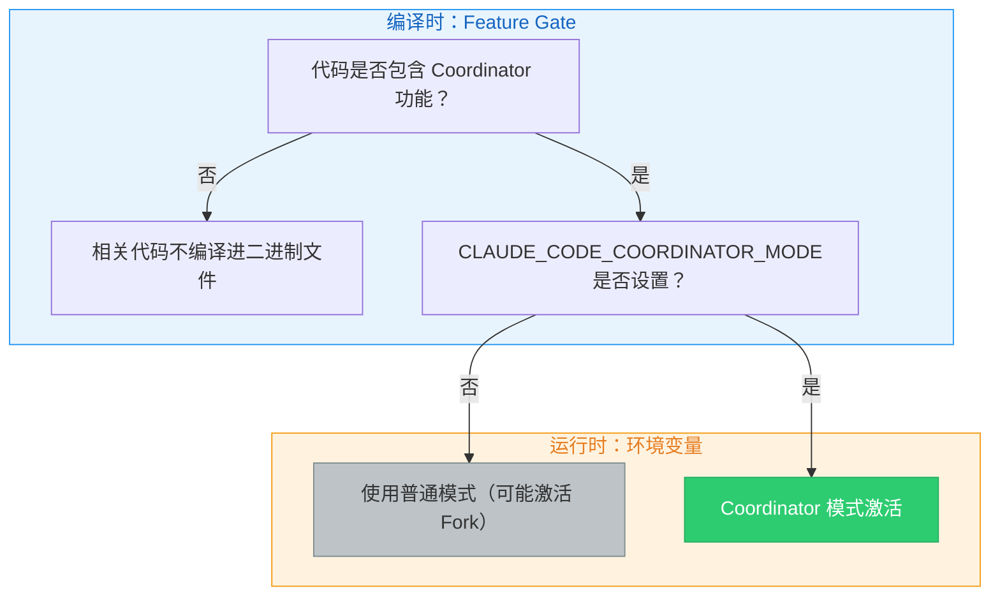

1. **Feature gate**：在编译时确定是否包含该功能的代码
2. **环境变量**：`CLAUDE_CODE_COORDINATOR_MODE` 在运行时控制是否激活

> **设计洞察：为什么使用双重门控而非单一开关？**
>
> Feature gate 是编译时优化——不需要 Coordinator 功能的部署（如轻量级 SDK 嵌入场景）可以完全排除相关代码，减小二进制体积和攻击面。环境变量是运行时控制——即使在包含功能的构建中，也需要显式启用。这种"编译时排除 + 运行时显式启用"的模式在企业软件中很常见，既满足了灵活性需求，又符合最小权限原则。

### 激活条件与互斥关系

Coordinator 模式在多处与其他模式产生交互。首先是与 Fork 模式的互斥：当两者同时满足条件时，Coordinator 模式优先。这是因为 Coordinator 已经拥有自己的任务委派模型，它不需要 Fork 模式的隐式并行能力。

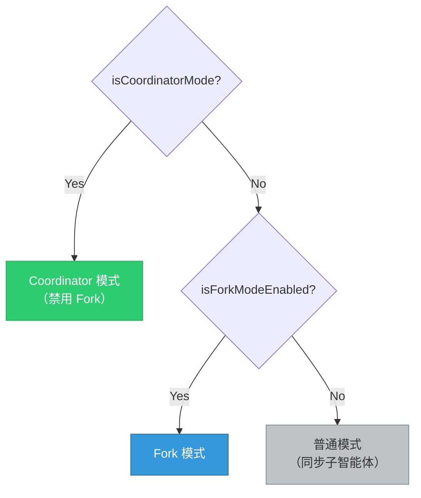

> **交叉引用：** Fork 模式的缓存共享机制在第9章中详细讨论。两者的核心区别在于：Fork 是"无中心的并行"（所有子智能体平等，共享相同上下文），而 Coordinator 是"有中心的编排"（协调者控制全局，工作者只看到分配给自己的任务）。

Coordinator 模式还影响智能体注册表。当 Coordinator 模式激活时，内置智能体注册函数不再返回普通的内置智能体列表，而是通过懒加载引入 Coordinator 专用的工作者智能体定义。这种懒加载方式是有意为之的，目的是避免协调器模块与工具模块之间的循环依赖。

### 会话恢复的模式匹配

`matchSessionMode()` 函数处理会话恢复时的模式一致性：当当前模式与会话记录的模式不匹配时，系统会自动翻转环境变量以匹配会话模式。这确保了当用户恢复一个以 Coordinator 模式创建的会话时，系统会自动激活 Coordinator 模式，即使当前的启动配置没有设置环境变量。

这个设计解决了一个实际问题：用户可能在某次启动时设置了 Coordinator 环境变量并创建了一个会话，但下次恢复该会话时忘记设置。如果没有自动模式匹配，会话将在错误的模式下恢复，导致行为不一致甚至错误。

### Coordinator 的系统提示

Coordinator 的角色定义在系统提示生成函数中，这是一段精心设计的系统提示，定义了协调者的完整行为规范。核心要点包括：

**角色定义**：协调者不是执行者，而是编排者。它直接回答简单问题，将复杂任务委派给工作者。

**工具集**：协调者只有四个核心工具——生成工作者的 Agent 工具、停止工作者的 TaskStop 工具、向工作者发送消息的 SendMessage 工具、以及结构化输出工具。

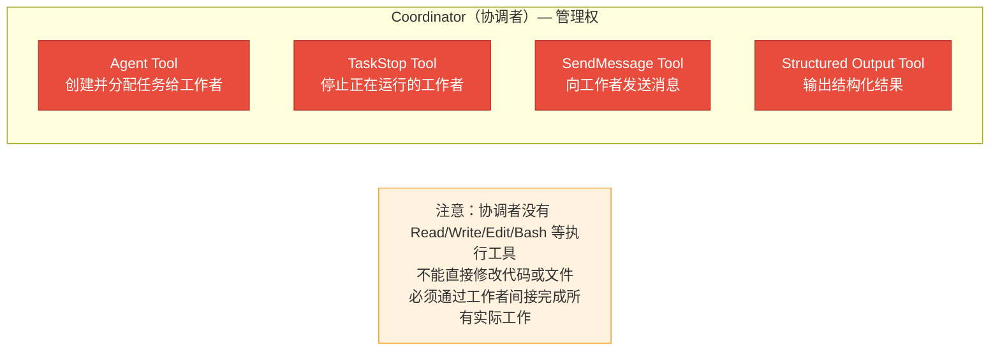

**关键约束**：系统提示明确禁止协调者"使用一个工作者去检查另一个工作者"、"使用工作者来简单报告文件内容"、"预测或编造智能体结果"。这些约束确保协调者直接管理所有通信，避免信息传递链过长。

> **反模式警告：为什么禁止"工作者检查工作者"？**
>
> 允许工作者 A 去检查工作者 B 的结果会形成"信息链式传递"：工作者 B 完成任务 -> 工作者 A 读取 B 的结果 -> 工作者 A 向协调者报告。这种链式传递有两个严重问题：
>
> 1. **信息衰减**：每次传递都会丢失细节。就像传话游戏一样，经过多轮传递后的信息可能与原始结果差异巨大。
>
> 2. **调试困难**：当最终结果出错时，需要逐层追溯是哪个环节出了问题。
>
> 正确的模式是：协调者直接接收每个工作者的结果，自行理解后编写下一步指令。

---

## 10.2 工作器工具分配

### INTERNAL_WORKER_TOOLS

Coordinator 模式下，工作者（Worker）的工具分配通过两个集合控制。内部工作者工具集合定义了工作者**不应该看到**的工具——它们是协调者的专属工具，包括团队创建、团队删除、消息发送和结构化输出。

这形成了一个清晰的权力边界：

```mermaid
graph LR
    subgraph Coordinator["Coordinator（协调者）— 管理权"]
        C1["Agent Tool"]
        C2["TaskStop Tool"]
        C3["SendMessage Tool"]
        C4["Structured Output"]
    end
    subgraph Worker["Worker（工作者）— 执行权"]
        W1["Read / Write"]
        W2["Edit / Bash"]
        W3["Grep / Glob"]
        W4["WebSearch"]
        W5["Skill / MCP"]
    end

    Coordinator x-- 管理vs执行 --x Worker

    style C1 fill:#e74c3c,stroke:#c0392b,color:#fff
    style C2 fill:#e74c3c,stroke:#c0392b,color:#fff
    style C3 fill:#e74c3c,stroke:#c0392b,color:#fff
    style C4 fill:#e74c3c,stroke:#c0392b,color:#fff
    style W1 fill:#3498db,stroke:#2471a3,color:#fff
    style W2 fill:#3498db,stroke:#2471a3,color:#fff
    style W3 fill:#3498db,stroke:#2471a3,color:#fff
    style W4 fill:#3498db,stroke:#2471a3,color:#fff
    style W5 fill:#3498db,stroke:#2471a3,color:#fff
```

### Simple 模式和完整模式的工具集

`getCoordinatorUserContext()` 函数根据模式返回不同的工具描述：

- **Simple 模式**：工作者只有 Bash、Read、Edit 三个工具，适用于资源受限环境
- **完整模式**：工作者拥有白名单中除内部工具外的所有工具，包括 Read、Write、Edit、Bash、Grep、Glob、WebSearch、WebFetch、NotebookEdit、Skill、ToolSearch 等

| 模式 | 工具集 | 适用场景 |
|------|--------|---------|
| Simple | Bash, Read, Edit | CI/CD 环境、资源受限容器、快速验证 |
| Full | 全部白名单工具 | 本地开发、完整 IDE 集成、复杂重构 |

在完整模式下，工作者还能使用 MCP 工具和 Skill 工具。系统提示通过 user context 告知协调者可用的工作者工具列表。

> **实际场景：何时使用 Simple 模式？**
>
> Simple 模式适用于以下场景：
> - **CI/CD 管道中的自动化任务**：构建服务器上不需要 Web 搜索或文件发现
> - **快速修复任务**：只需要读取、编辑、运行测试的简单修复
> - **安全受限环境**：最小化工具集减少潜在的安全风险
> - **资源受限容器**：减少工具初始化的开销

### 工具池的独立组装

工作者的工具池独立于父级组装，这确保工作者始终获得完整的工具集，不受父级工具限制的影响。工作者默认使用 `acceptEdits` 权限模式（自动接受文件编辑），除非智能体定义指定了其他模式。

这个设计决策反映了一个重要原则：**工作者是执行者，不应该被权限问题阻碍**。如果工作者每次编辑文件都需要用户确认，多智能体协作的优势就被完全抵消了。当然，这要求协调者正确地分配任务——如果分配了错误的修改任务，工作者也会毫不犹豫地执行。

> **最佳实践：在 Coordinator 模式下预先确认任务范围**
>
> 由于工作者自动接受编辑，用户应该在 Coordinator 接受任务前先审查整体计划。建议在 CLAUDE.md 中加入提示，要求协调者在开始 Implementation 阶段前展示完整的任务分配计划。

---

## 10.3 团队管理

### TeamCreateTool / TeamDeleteTool

Coordinator 模式与 Agent Teams（多智能体蜂群）共享团队基础设施。团队创建工具负责创建团队，核心流程包括：检查是否已在团队中（领导者只能管理一个团队）、生成唯一团队名称、创建团队文件（包含团队名称、领导者 ID、会话 ID、成员列表等），然后写入团队文件、更新全局状态、设置任务列表。

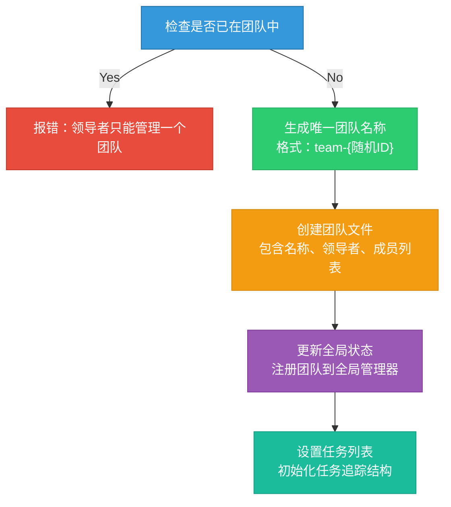

团队删除工具负责清理：先检查是否还有活跃成员，只有在所有成员都已完成工作后才允许清理，然后清除团队目录、worktree 和团队上下文。

### 团队删除的安全保障

团队删除不是简单的"删除所有"，而是包含多重安全检查的过程：

1. **活跃成员检查**：如果还有工作者在运行，拒绝删除并返回仍在运行的成员列表
2. **资源清理顺序**：先清理团队目录（Scratchpad 等），再清理 worktree，最后清理团队上下文
3. **错误容忍**：单个资源的清理失败不会阻止其他资源的清理

> **反模式警告：不要在工作完成前删除团队**
>
> 如果协调者在工作者仍在运行时强制删除团队，工作者将失去与团队的关联，可能导致：
> - 工作者的任务通知无法送达协调者
> - Scratchpad 文件被删除，正在使用的工作者读到空数据
> - worktree 被清理，工作者的文件修改丢失
>
> 这就是为什么团队删除需要"所有成员完成"的前置条件。

### SendMessageTool 消息传递

消息发送工具是团队协作的核心通信通道。它支持四种消息类型：关闭请求、关闭响应和计划审批响应。

消息传递的寻址模式：

| 寻址模式 | 格式 | 使用场景 | 通信范围 |
|---------|------|---------|---------|
| 点对点 | `to: "agent-name"` | 向指定工作者发送具体指令 | 单个工作者 |
| 广播 | `to: "*"` | 向所有工作者发布公共信息 | 全体工作者 |
| UDS | `to: "uds:<socket-path>"` | 跨进程通信（不同 CLI 实例） | 跨进程 |
| Bridge | `to: "bridge:<session-id>"` | 跨会话/跨机器通信 | 跨会话/远程 |

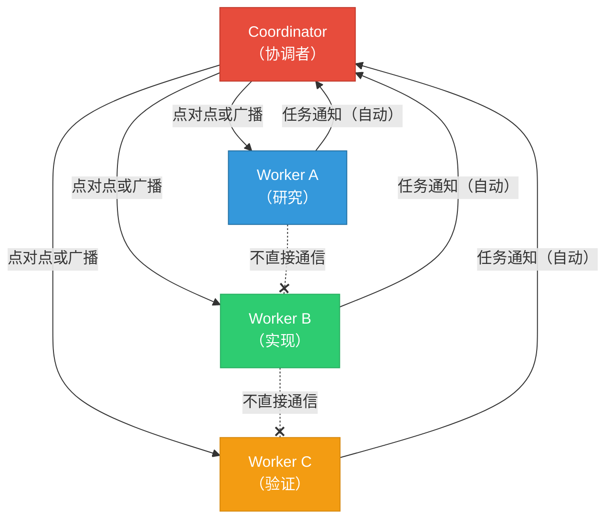

消息发送工具的智能路由机制尤其值得关注：当协调者向一个正在运行的工作者发送消息时，系统会将消息排队等待下一轮工具调用；当向一个已停止的工作者发送消息时，系统会自动恢复该工作者并将消息作为新的提示。这种"停止-恢复"模式使得协调者可以高效地管理工作者的生命周期。

> **设计洞察：停止-恢复模式的经济性**
>
> 工作者不是"总是在线"的。一个研究型工作者完成调查后就会停止，释放 API 连接和内存资源。但协调者可能稍后需要给这个工作者追加任务（比如"你之前调查的模块 X，再深入看一下依赖关系"）。停止-恢复模式让工作者可以在需要时被重新激活，而不需要从头开始构建上下文。这既节省了资源，又保留了之前的分析状态。

---

## 10.4 协作空间

### Scratchpad 协作空间设计

Coordinator 模式引入了 Scratchpad 概念——一个跨工作者共享的临时文件空间。在系统提示中，当 Scratchpad 功能启用时，会向协调者追加描述信息，告知工作者可以自由读写该目录而无需权限提示，并建议用于持久的跨工作者知识存储。

Scratchpad 的物理位置位于项目临时目录下的会话专属子目录中，路径格式为 `/tmp/claude-{uid}/{sanitized-cwd}/{sessionId}/scratchpad/`，每个会话有独立的 scratchpad 目录。

Scratchpad 的设计理念是：

1. **无权限提示**：工作者可以自由读写 scratchpad 目录，无需用户确认
2. **持久化跨工作者知识**：一个工作者可以将发现写入 scratchpad，另一个工作者可以读取
3. **会话隔离**：每个会话的 scratchpad 独立，避免跨会话污染
4. **结构自由**：系统不规定文件结构，由工作者根据需要自行组织

在 Coordinator 的系统提示中，scratchpad 被描述为"durable cross-worker knowledge"（持久的跨工作者知识），这暗示了它的核心用途：作为工作者之间的共享记忆。

#### Scratchpad 的典型使用模式

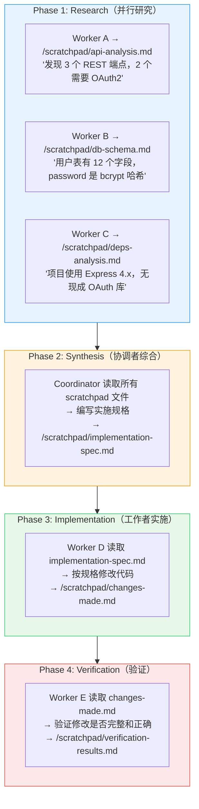

> **为什么不直接让工作者之间传递消息？**
>
> 消息传递是瞬时的——一旦被消费就消失了。而 Scratchpad 是持久的，可以被任意多个工作者反复读取。在研究阶段，工作者 A 的发现不仅协调者需要看，后续的验证工作者也可能需要参考。如果用消息传递，就需要协调者将发现转发给每个需要的工作者；而用 Scratchpad，工作者可以按需读取。
>
> 此外，Scratchpad 还天然支持"增量构建"——工作者 A 写入基础分析，工作者 B 可以在此基础上追加补充信息，而不需要将所有信息汇总到一条消息中。

### 协调者的任务工作流

Coordinator 系统提示定义了标准任务工作流的四个阶段：

| 阶段 | 执行者 | 目的 | 典型输出 |
|------|--------|------|---------|
| Research | Workers（并行） | 调查代码库、发现文件、理解问题 | Scratchpad 分析文档 |
| Synthesis | Coordinator | 阅读发现、理解问题、编写实施规格 | 实施规格文档 |
| Implementation | Workers | 按规格进行精确修改 | 代码变更 |
| Verification | Workers | 测试修改是否正确 | 测试结果和问题列表 |

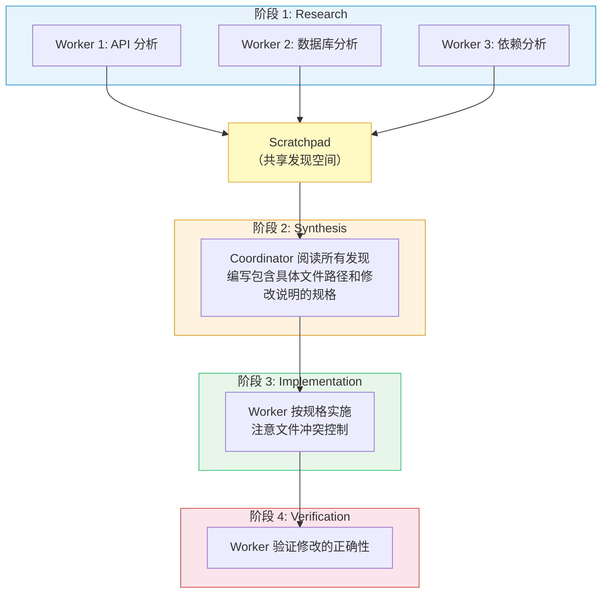

这个工作流的关键约束是**协调者必须理解研究发现才能编写实施规格**。系统提示用强烈的措辞强调：

> "Never write 'based on your findings' or 'based on the research.' These phrases delegate understanding to the worker instead of doing it yourself. You never hand off understanding to another worker."

这意味着协调者不能简单地转发工作者的发现给另一个工作者——它必须先消化这些发现，然后编写包含具体文件路径、行号和修改说明的实施规格。

> **设计哲学：为什么"理解"不能被委派？**
>
> 这是 Coordinator 模式最核心的设计原则之一。在传统的主从架构中，主节点可以简单地将从节点的结果转发给另一个从节点。但在 AI 智能体系统中，这种转发会导致严重的上下文丢失问题：
>
> - **格式不一致**：不同工作者的输出格式不同，直接转发会导致接收方无法理解
> - **信息冗余与缺失并存**：工作者 A 的报告可能包含大量无关细节而遗漏关键信息
> - **缺乏全局视角**：每个工作者只看到自己调查的部分，无法做出全局最优决策
>
> 要求协调者"消化"所有发现后再编写规格，确保了实施阶段的工作者收到的是统一、精确、有上下文的指令。

### 并发策略

Coordinator 系统提示定义了清晰的并发策略：

| 任务类型 | 并发策略 | 原因 |
|---------|---------|------|
| 只读任务（研究） | 自由并行 | 不会产生冲突 |
| 写密集任务（实施） | 同一文件集一次一个 | 防止文件写入冲突 |
| 验证 | 有时可与实施并行 | 在不同文件区域操作时安全 |

```mermaid
---
config:
  gantt:
    leftPadding: 150
---
gantt
    title 并发策略示例 (OAuth2 集成任务)
    dateFormat X
    axisFormat %s

    section Research (全部并行)
    Worker A (API 分析)     :a1, 0, 4
    Worker B (数据库分析)   :a2, 0, 4
    Worker C (Auth 分析)    :a3, 0, 4

    section Implementation (独占文件)
    Worker D (route/auth.ts) :b1, 3, 6
    Worker E (db/migration.ts) :b2, 6, 9

    section Verification (并行验证)
    Worker F (测试 auth)     :c1, 9, 12
    Worker G (测试 DB)       :c2, 9, 12
```

系统提示还鼓励协调者"fan out"——在一次消息中发起多个并行工作者调用。这利用了 Claude 的并行工具调用能力，让多个工作者同时启动。

### 任务通知协议

工作者完成后，结果以 `<task-notification>` XML 格式传递给协调者：

```xml
<task-notification>
<task-id>{agentId}</task-id>
<status>completed|failed|killed</status>
<summary>{human-readable status summary}</summary>
<result>{agent's final text response}</result>
<usage>
  <total_tokens>N</total_tokens>
  <tool_uses>N</tool_uses>
  <duration_ms>N</duration_ms>
</usage>
</task-notification>
```

这个格式被设计为嵌入在 user 角色的消息中，协调者通过识别 `<task-notification>` 标签来区分真正的用户消息和工作者的结果报告。这种设计选择意味着协调者需要明确的指令来区分消息类型，这也是为什么系统提示中反复强调"Worker results are internal signals, not conversation partners"。

> **为什么用 XML 格式而非 JSON？**
>
> XML 标签在 LLM 上下文中比 JSON 有更好的可识别性。Claude 模型对 XML 标签的解析非常可靠（这与训练数据中的大量 XML 使用有关），而 JSON 需要严格的引号和逗号匹配。此外，`<task-notification>` 这种明确的标签名可以让模型通过简单的模式匹配快速识别消息类型，而不需要完整的 JSON 解析。

---

## 10.5 完整案例：从需求到交付

让我们通过一个完整的案例来理解 Coordinator 模式端到端的工作流。

### 场景：为 Web 应用添加用户通知系统

**需求描述：** "为我们的 Express.js 应用添加一个通知系统，支持邮件和站内信两种通知方式，用户可以在设置页面管理通知偏好。"

#### Phase 1: Research（研究阶段）

协调者同时派出三个研究工作者：

```
Coordinator 决策：
"这个任务涉及后端 API、数据库 schema、前端 UI 三个维度。
 启动三个并行研究者分别调查。"

  Worker "api-researcher":
    任务 → "调查现有的 Express.js 路由结构、中间件链和 API 版本策略"
    输出 → /scratchpad/api-analysis.md
    内容 → "发现路由在 src/routes/ 下，使用 Express Router，
            中间件链包含 auth、rateLimit、validate。
            API 版本通过 URL 前缀 /api/v1/ 管理。"

  Worker "db-researcher":
    任务 → "调查数据库 schema、ORM 模型和迁移策略"
    输出 → /scratchpad/db-analysis.md
    内容 → "使用 Prisma ORM，schema 在 prisma/schema.prisma。
            现有 User 模型有 id, email, name 字段。
            迁移通过 prisma migrate 管理。"

  Worker "frontend-researcher":
    任务 → "调查前端框架、组件结构和状态管理方案"
    输出 → /scratchpad/frontend-analysis.md
    内容 → "使用 React + TypeScript，组件在 src/components/。
            状态管理使用 Zustand。设置页面在 SettingsPage.tsx。
            UI 组件库使用 shadcn/ui。"
```

#### Phase 2: Synthesis（综合阶段）

```
Coordinator 行为：
  1. 读取三个 scratchpad 文件
  2. 理解整体架构后编写实施规格
  3. 将规格写入 /scratchpad/implementation-spec.md

  规格内容：
  - 数据库：新增 Notification 和 NotificationPreference 两个模型
  - API：新增 5 个端点（GET/POST/PUT/DELETE 通知 + PUT 偏好设置）
  - 服务层：新增 NotificationService 处理邮件和站内信
  - 前端：修改 SettingsPage 添加通知偏好组件
  - 依赖：需要新增 nodemailer 包
```

#### Phase 3: Implementation（实施阶段）

```
Coordinator 决策：
"根据规格，可以安全地并行执行数据库迁移和服务层实现，
 因为它们操作不同的文件。前端需要在后端完成后才能实现。"

  Worker "db-implementer":
    任务 → 按 scratchpad 规格修改 Prisma schema 并创建迁移
    文件 → prisma/schema.prisma（独占）

  Worker "service-implementer":  ← 与 db-implementer 并行
    任务 → 实现通知服务层和 API 路由
    文件 → src/services/notificationService.ts, src/routes/notifications.ts

  (等待以上两者完成)

  Worker "frontend-implementer":
    任务 → 实现前端通知偏好组件
    文件 → src/components/NotificationSettings.tsx, 修改 SettingsPage.tsx
```

#### Phase 4: Verification（验证阶段）

```
  Worker "verifier":
    任务 → 验证通知系统的完整功能
    检查项：
    - Prisma 迁移是否正确
    - API 端点是否符合 RESTful 规范
    - 前端组件是否正确调用 API
    - 是否有遗漏的错误处理
    - 通知偏好的默认值是否合理
```

---

## 10.6 故障恢复与部分完成

### 工作者失败的处理策略

在多智能体协作中，工作者失败是常态而非例外。Coordinator 需要具备处理以下失败场景的能力：

| 失败类型 | 表现 | Coordinator 的应对策略 |
|---------|------|----------------------|
| 工具执行失败 | 某个 Bash 命令返回非零退出码 | 分析失败原因，重试或调整策略 |
| 模型输出截断 | maxTurns 耗尽导致任务未完成 | 评估已完成部分，决定是否重新分配 |
| MCP 连接断开 | 外部工具不可用 | 降级到不依赖该工具的策略 |
| 上下文过长 | 对话历史超过 token 限制 | 压缩上下文或拆分任务为更小的子任务 |

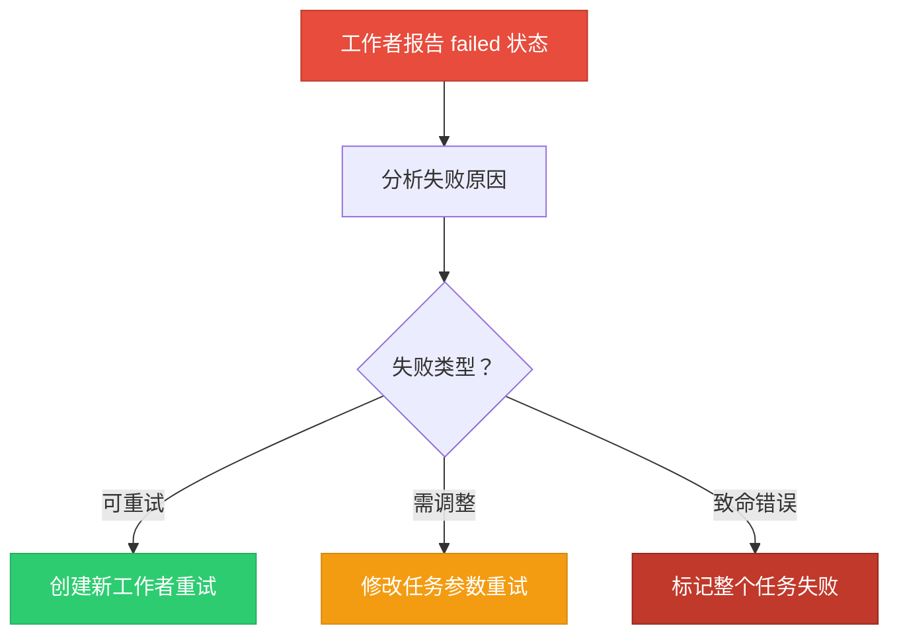

### 部分完成的处理

当研究阶段的工作者只完成了部分调查（比如只分析了 API 层但没分析到数据库层），协调者面临选择：使用已有信息继续，还是等待完整分析。

系统提示中的指导原则是：**协调者应该充分利用已完成的工作，而不是等待完美信息**。如果 Worker A 完成了 80% 的代码调查，协调者应该基于这 80% 的信息编写实施规格，并在规格中标注不确定的部分，让实施工作者在遇到未覆盖的区域时进行补充调查。

> **最佳实践：在 Scratchpad 中使用"置信度标注"**
>
> 建议协调者在实施规格中使用置信度标注，例如：
> - [HIGH] 确认文件路径和函数签名正确
> - [MEDIUM] 推测的依赖关系，需要实施时验证
> - [LOW] 未完全调查的区域，实施前需要额外研究
>
> 这种标注让实施工作者知道哪些部分可以直接执行，哪些需要先确认。

---

## 10.7 Coordinator 模式与 Fork 模式对比

两种模式代表了不同的并行策略，选择正确的模式对于任务成功至关重要。

| 维度 | Coordinator 模式 | Fork 模式 |
|------|------------------|-----------|
| **架构模型** | 中心化（协调者-工作者） | 去中心化（对等并行） |
| **上下文共享** | 工作者只看到分配的任务 | 所有子智能体继承完整父上下文 |
| **通信方式** | 协调者中转、Scratchpad 共享 | 无直接通信，各自独立 |
| **任务分配** | 显式分配，精确控制 | 隐式并行，各自执行独立子任务 |
| **结果聚合** | 协调者综合所有结果 | 主智能体按需收集 |
| **缓存效率** | 不共享缓存前缀 | 字节级共享，高效缓存 |
| **适用场景** | 需要协调的复杂多步骤任务 | 独立的并行调查/搜索任务 |
| **故障恢复** | 协调者可以重新分配任务 | 主智能体收到失败通知后决定 |
| **资源开销** | 较高（协调者常驻） | 较低（共享缓存） |
| **心智模型** | 建筑工地（项目经理+工人） | 侦察队（多个独立侦察兵） |

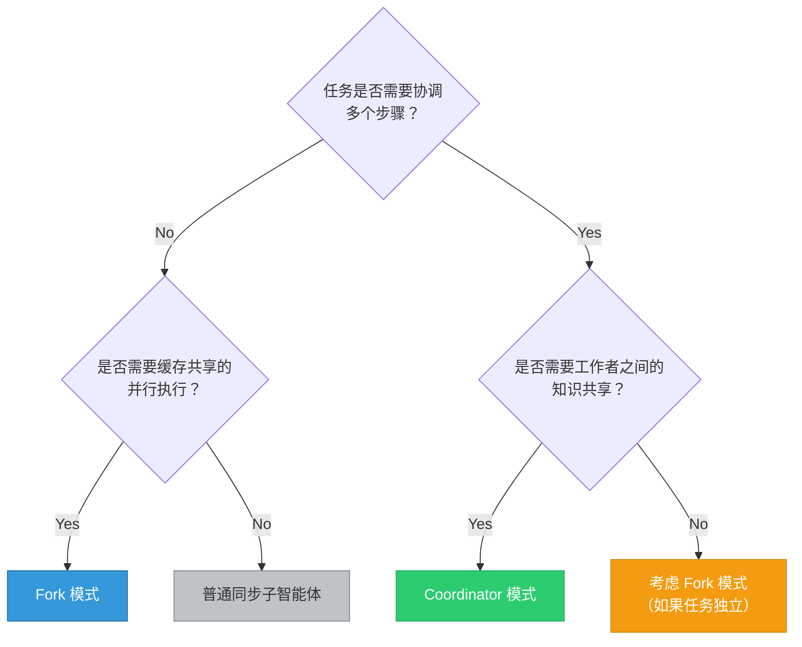

> **交叉引用：** Fork 模式的详细机制参见第9章。特别注意两者的互斥关系——Coordinator 模式激活时 Fork 模式被自动禁用。

---

## 实战练习

**练习 1：设计一个多工作者工作流**

假设你有一个大型重构任务：将一个单体 Express.js 应用拆分为微服务。设计 Coordinator 模式下的工作流：

1. **Research 阶段**：规划需要多少个 Research 工作者，每个负责调查什么模块
   - 提示：考虑路由、数据库、中间件、配置、测试五个维度
2. **Synthesis 阶段**：协调者应该如何综合发现并编写微服务拆分规格
   - 提示：需要考虑服务边界、共享数据库、API Gateway 等
3. **Implementation 阶段**：如何分配工作者以避免文件冲突
   - 提示：按服务边界分配，同一服务的文件由同一工作者处理
4. **Verification 阶段**：验证策略是什么
   - 提示：每个微服务独立验证，最后进行集成测试

**练习 2：分析 Scratchpad 的安全边界**

思考以下关于 Scratchpad 安全设计的问题：
- Scratchpad 目录的权限设置（0o700）意味着什么？
- 为什么 Scratchpad 不放在项目目录内？
- 如果两个工作者同时写入同一 Scratchpad 文件会发生什么？
- 如何设计 Scratchpad 的文件命名规范来避免冲突？

**扩展思考：** 如果你要实现一个"Scratchpad 版本控制"功能（类似 Git），需要记录哪些元信息？这会如何改变工作者的写入行为？

**练习 3：对比 Coordinator 模式与 Fork 模式**

基于本章和第9章的内容，填写下表并给出每个维度的选择理由：

| 维度 | Coordinator 模式 | Fork 模式 |
|------|------------------|-----------|
| 架构模型 | ? | ? |
| 上下文共享 | ? | ? |
| 适用场景 | ? | ? |
| 通信方式 | ? | ? |
| 缓存效率 | ? | ? |
| 故障恢复 | ? | ? |
| 资源开销 | ? | ? |

**练习 4：设计一个故障恢复策略**

假设在一个 Coordinator 工作流中，Implementation 阶段的一个工作者在修改数据库 schema 时失败了（迁移脚本执行错误）。请设计：
1. Coordinator 如何检测到这个失败
2. Coordinator 如何决定是重试还是调整策略
3. 已经部分完成的修改如何处理
4. 其他正在并行执行的工作者如何受影响

**练习 5：模拟一个完整的 Coordinator 工作流**

选择你熟悉的一个项目，设计以下任务的 Coordinator 工作流：

任务："为项目添加国际化（i18n）支持，需要支持中文和英文两种语言。"

要求：
- 列出 Research 阶段需要的调查方向
- 编写 Synthesis 阶段的实施规格大纲
- 设计 Implementation 阶段的工作者分配
- 规划 Verification 阶段的检查清单

---

## 关键要点

1. **Coordinator 模式采用"协调者-工作者"架构**，协调者只管理任务分配和结果综合，不直接执行实现工作。这种分层设计使得复杂工程任务可以被系统地分解和并行处理。

2. **双重门控机制**（feature gate + 环境变量）和与 Fork 模式的互斥关系确保了模式选择的明确性，`matchSessionMode()` 保证了会话恢复时的模式一致性。

3. **工具隔离策略**：协调者只有四个核心编排工具，工作者拥有完整的开发工具集但排除团队管理工具。工具池的独立组装确保工作者不受父级限制的影响。Simple 模式和 Full 模式适应不同的资源环境。

4. **SendMessage 的智能路由**支持点对点、广播、跨进程和跨会话通信，并实现了自动恢复已停止工作者的能力，使得"停止-继续"工作流成为可能。

5. **Scratchpad 协作空间**提供了免权限提示的跨工作者共享目录，每个会话独立，结构自由。它是工作者之间传递持久知识的桥梁，弥补了工作者之间无法直接通信的限制。

6. **四阶段工作流**（Research -> Synthesis -> Implementation -> Verification）提供了结构化的任务执行模式。核心约束是协调者必须消化研究发现后再编写实施规格，不允许转发理解。

7. **故障恢复**是 Coordinator 模式的内置能力。通过任务通知中的 status 字段、Scratchpad 中的部分结果、以及协调者的重新分配能力，系统可以优雅地处理工作者失败和部分完成。

8. **模式选择**：Coordinator 适合需要协调的复杂多步骤任务，Fork 适合独立的并行搜索任务。两者互斥，不能同时使用。理解各自的优势和局限是正确选择的关键。
