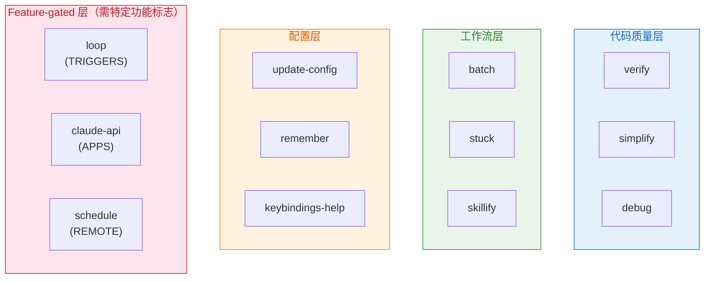
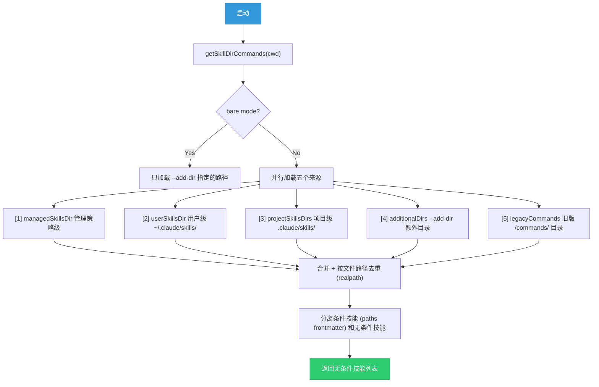
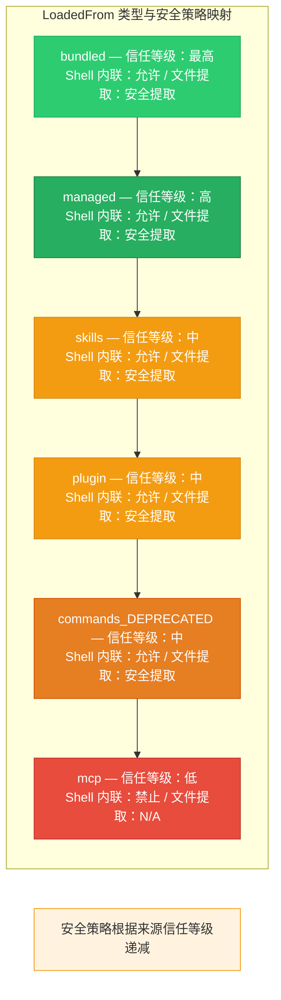
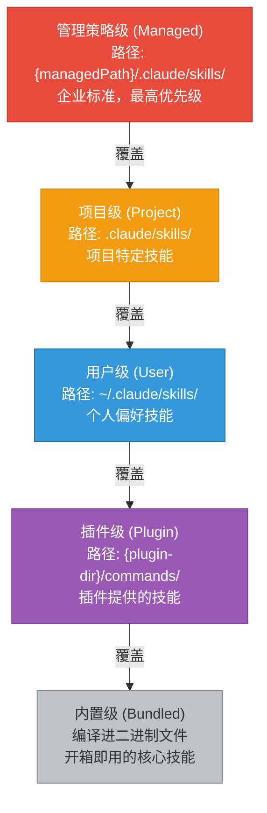
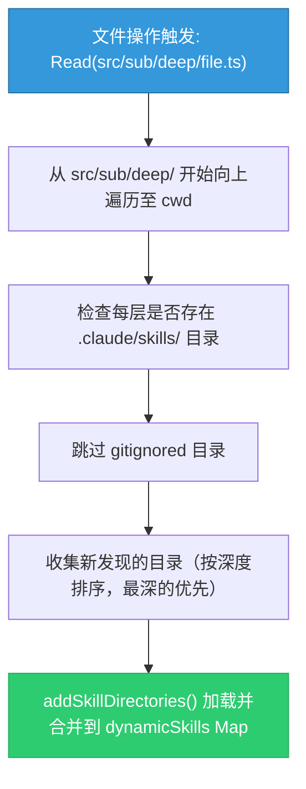
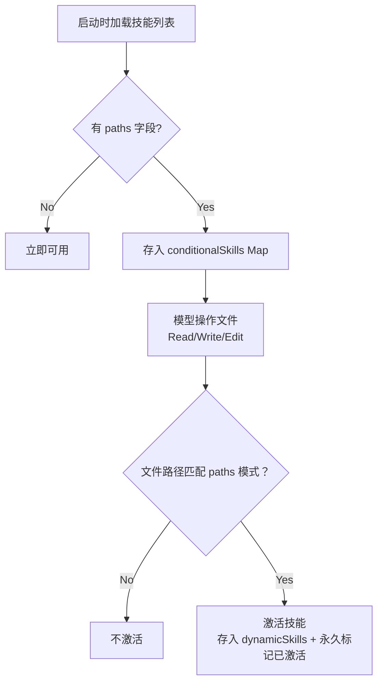
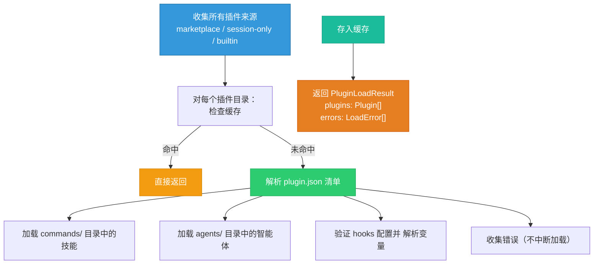

# 第11章 技能系统与插件架构

> "好的架构让增加功能变简单，伟大的架构让移除功能也一样简单。"
> -- 《架构整洁之道》改编

**学习目标：**
- 掌握 Claude Code 技能（Skill）的定义、加载和执行机制的完整生命周期
- 理解从用户级到管理级的技能分层策略及其安全含义
- 学会创建自定义技能的完整流程和最佳实践
- 了解插件系统的缓存优先加载模型和安全边界
- 掌握技能组合使用的模式和反模式

---

## 11.1 技能系统架构

Claude Code 的技能系统是一个多层次的扩展机制。它允许用户通过 Markdown 文件定义可复用的 prompt 模板，也允许开发者通过 TypeScript 代码注册编译时内置的技能。整个系统的设计目标是：**零配置可用，有配置强大**。

这就像一套厨师的工具箱：内置的刀具和锅具（内置技能）可以应对大部分烹饪需求，但当你需要制作特定菜系时，可以添加专用的工具（自定义技能）。而且，这些工具可以按层级管理——家庭厨房（用户级）、餐厅厨房（项目级）、连锁餐饮标准（管理级）。

### 11.1.1 内置技能清单

内置技能（Bundled Skills）是编译进 CLI 二进制文件的技能，对所有用户开箱即用。它们在启动时通过 `initBundledSkills()` 统一注册。

注册入口函数根据功能标志决定加载哪些技能。技能分为两类：

- **核心技能**：始终注册，如 `verify`、`debug`、`simplify`、`remember`、`batch`、`stuck` 等
- **Feature-gated 技能**：通过功能门控，仅在对应功能标志启用时注册，如 `loop`（AGENT_TRIGGERS）、`claude-api`（BUILDING_CLAUDE_APPS）、`schedule`（AGENT_TRIGGERS_REMOTE）

核心内置技能的完整清单如下：

| 技能名称 | 用途 | 用户可调用 | 典型使用场景 |
|---------|------|-----------|------------|
| `update-config` | 配置 settings.json 的各项设置 | 是 | 修改权限规则、环境变量、默认模型 |
| `keybindings-help` | 键盘快捷键自定义帮助 | 是 | 查看和自定义按键绑定 |
| `verify` | 验证代码变更的正确性 | 是 | 提交前的最终验证、CI 前的本地检查 |
| `debug` | 调试辅助，提供诊断思路 | 是 | 定位 bug 根因、分析错误堆栈 |
| `simplify` | 代码简化与重构审查 | 是 | 消除重复代码、降低圈复杂度 |
| `skillify` | 将 prompt 转换为可复用的技能 | 是 | 将一次性的 prompt 模板化 |
| `remember` | 记忆管理（CLAUDE.md 条目） | 是 | 添加项目规范、团队约定 |
| `batch` | 批量文件处理 | 是 | 批量重命名、批量格式化 |
| `stuck` | 帮助模型走出困境 | 是 | 模型陷入循环时的"解围"指令 |
| `lorem-ipsum` | 生成占位内容 | 是 | UI 开发时的占位文本 |



### 11.1.2 内置技能注册机制

每个内置技能通过注册函数注册，接收一个技能定义对象，包含以下关键字段：名称、描述、别名、使用场景提示、参数提示、允许的工具列表、模型指定、是否禁用模型调用、是否用户可调用、运行时门控回调、生命周期钩子、执行上下文（inline 或 fork）、关联的智能体、引用文件集合，以及最关键的 prompt 生成器函数。

其中最关键的几个字段：

- prompt 生成器：延迟执行的 prompt 生成器，仅在技能被调用时才运行
- `files`：可选的引用文件集合，首次调用时提取到磁盘，允许模型通过 Read/Grep 访问
- `isEnabled`：运行时门控回调，如 `/loop` 技能每次调用时检查相关功能是否启用
- `context: 'fork'`：标记技能在独立子进程中执行

#### 文件提取的安全设计

文件提取采用了精巧的惰性单例模式，使用 `??=` 操作符确保并发调用共享同一个提取 Promise，避免竞态条件。文件写入使用 `O_NOFOLLOW | O_EXCL` 标志防止符号链接攻击，目录权限设置为 `0o700`，文件权限设置为 `0o600`。

这些安全措施的含义：

| 安全措施 | 保护的攻击向量 | 工作原理 |
|---------|-------------|---------|
| `O_NOFOLLOW` | 符号链接劫持 | 如果路径是符号链接则打开失败 |
| `O_EXCL` | TOCTOU 竞态 | 文件必须不存在，确保是新建而非覆盖 |
| `0o700` 目录 | 目录遍历 | 只有所有者可以访问目录 |
| `0o600` 文件 | 文件泄露 | 只有所有者可以读写文件 |
| `??=` 单例 | 竞态条件 | 并发调用共享同一个 Promise |

> **为什么技能需要引用文件？**
>
> 某些技能（如 `verify`）在执行时需要参考额外的文档或配置。这些文件被编译进二进制文件中（不作为独立的磁盘文件存在），但在技能首次被调用时需要提取到磁盘。这样设计有两个好处：第一，技能的分发不需要额外的文件管理；第二，文件在提取时有完整的安全检查。
>
> 可以把它想象成"软件附带的说明书"——不需要时它不占地方（嵌入在二进制中），需要时才展开到桌面上（提取到临时目录）。

### 11.1.3 技能加载引擎

所有文件系统上的技能（非内置）由统一的加载引擎加载。这是一个会话内缓存的异步函数。

加载引擎的核心流程如下：



去重策略使用 `realpath` 解析符号链接得到规范路径，然后按首次出现的来源保留。这避免了通过符号链接或重叠的父目录导致的重复加载。

> **为什么需要去重？**
>
> 考虑这样的目录结构：
> ```
> /home/user/projects/my-app/        ← 项目目录
> /home/user/projects/my-app/symlink ← 指向 .claude/skills/ 的符号链接
> ```
>
> 如果不做 `realpath` 解析，同一个技能目录可能通过两条路径被加载两次：一次通过原始路径 `.claude/skills/my-skill/`，一次通过符号链接 `symlink/my-skill/`。这会导致技能被注册两次，可能产生冲突或重复执行。`realpath` 解析确保无论通过什么路径访问，最终都指向同一个物理位置。

---

## 11.2 技能定义格式

### 11.2.1 Markdown Frontmatter 配置

文件型技能以目录形式组织，每个技能是一个名为 `skill-name/` 的目录，其中包含一个 `SKILL.md` 文件。这是唯一的目录结构格式。

`SKILL.md` 支持 YAML frontmatter 配置。解析逻辑支持的字段包括：

```yaml
---
name: my-skill-display-name
description: 这是一个示例技能
when_to_use: 当用户需要执行某操作时使用
arguments: arg1 arg2 arg3
argument-hint: "[arg1] [arg2] [arg3]"
allowed-tools:
  - Bash
  - Read
  - Write
model: claude-sonnet-4-20250514
effort: high
user-invocable: true
disable-model-invocation: false
context: fork
agent: code-builder
version: "1.0"
paths:
  - "src/**/*.ts"
  - "lib/**/*.js"
hooks:
  pre:
    - command: npm run lint
  post:
    - command: echo "done"
shell: bash
---

# 技能正文

这是技能的主要内容，支持 Markdown 格式。
可以使用 $ARGUMENTS 引用用户输入的参数。
使用 $1, $2 引用位置参数。
使用 ${CLAUDE_SKILL_DIR} 引用技能目录。
使用 ${CLAUDE_SESSION_ID} 引用当前会话 ID。
```

#### 字段详解与最佳实践

| 字段 | 类型 | 必填 | 说明 | 最佳实践 |
|------|------|------|------|---------|
| `name` | string | 否 | 技能显示名称 | 省略时使用目录名，建议使用 kebab-case |
| `description` | string | 是 | 技能描述 | 简洁明了，一句话说清功能 |
| `when_to_use` | string | 否 | 使用场景描述 | 帮助模型自动选择合适的技能 |
| `arguments` | string | 否 | 参数名列表 | 用空格分隔，命名参数增强可读性 |
| `allowed-tools` | list | 否 | 允许的工具 | 遵循最小权限原则，只列出必要工具 |
| `model` | string | 否 | 使用的模型 | 只读任务用 haiku，复杂任务用 inherit |
| `context` | string | 否 | 执行上下文 | fork 用于耗时任务，inline 用于快速操作 |
| `paths` | list | 否 | 条件激活路径 | 用于按文件类型自动激活技能 |
| `hooks` | object | 否 | 生命周期钩子 | pre/post 命令用于自动化检查 |

一个完整的技能创建流程示例：

```
~/.claude/skills/
  my-code-review/
    SKILL.md              ← 技能定义文件（必须）
    review-checklist.md   ← 附属文件，模型可按需读取
    examples/
      good-pattern.md     ← 良好模式示例
      bad-pattern.md      ← 反模式示例
```

### 11.2.2 参数替换机制

技能的 prompt 内容支持灵活的参数替换：

**位置参数**：`$ARGUMENTS` 替换为完整参数字符串；`$ARGUMENTS[0]`、`$ARGUMENTS[1]` 替换为索引参数；`$0`、`$1` 是其简写形式。

**命名参数**：当 frontmatter 定义了 `arguments: foo bar` 时，`$foo` 和 `$bar` 分别映射到对应位置的用户输入值。

替换逻辑按顺序执行：先替换命名参数，再替换索引参数，然后替换完整参数，最后若无占位符则追加参数文本。

```
参数替换执行顺序：

  输入：/my-skill hello world

  Step 1: 命名参数替换
    arguments: "greeting name"
    $greeting → "hello"
    $name → "world"

  Step 2: 索引参数替换
    $1 → "hello"（$0 是技能名本身）
    $2 → "world"
    $ARGUMENTS[0] → "hello"
    $ARGUMENTS[1] → "world"

  Step 3: 完整参数替换
    $ARGUMENTS → "hello world"

  Step 4: 无占位符追加
    如果 prompt 中没有使用任何 $ 占位符
    → 将参数文本追加到 prompt 末尾
```

此外，技能正文还支持 Shell 命令内联执行和环境变量替换。在 prompt 生成器中，除了参数替换，还会：

1. 添加技能根目录前缀：`Base directory for this skill: ${baseDir}`
2. 替换 `${CLAUDE_SKILL_DIR}` 为技能目录的绝对路径
3. 替换 `${CLAUDE_SESSION_ID}` 为当前会话 ID
4. 对非 MCP 技能执行 Shell 命令内联展开（安全考虑：MCP 技能来自远端，不执行其内嵌 Shell 命令）

> **安全边界：为什么 MCP 技能不能执行 Shell 命令？**
>
> MCP 技能来自外部服务器，而 Shell 命令可以执行任意系统操作。如果允许 MCP 技能中的 Shell 命令内联展开，一个恶意的 MCP 服务器可以在技能 prompt 中注入 `$(rm -rf /)` 这样的命令。因此，系统在 `LoadedFrom` 类型为 `mcp` 时跳过 Shell 命令展开，这是一个关键的安全边界。
>
> 这是一个经典的"信任边界"问题——本地技能文件由用户创建和管理（可信），而 MCP 技能来自网络（不可信）。安全策略应该根据来源的可信程度而有所不同。

### 11.2.3 LoadedFrom 类型

技能的来源通过 `LoadedFrom` 类型标识，包含六种来源：旧版命令目录（commands_DEPRECATED）、新版技能目录（skills）、插件提供（plugin）、企业管理策略（managed）、内置编译（bundled）和 MCP 服务器提供（mcp）。

这个类型不仅用于追踪来源，还直接影响安全策略。例如，来自 MCP 的技能不会执行 Shell 命令内联，因为 MCP 技能来自不可信的远端服务器。



---

## 11.3 技能加载路径

### 11.3.1 分层加载策略

`getSkillsPath` 函数清晰地定义了各来源的路径映射，根据来源类型（policySettings、userSettings、projectSettings、plugin）返回对应的技能目录路径。

各层级说明：

**管理策略级（Managed / Policy）**：由企业管理员通过集中配置下发。路径为 `{managedPath}/.claude/skills/`。可通过 `CLAUDE_CODE_DISABLE_POLICY_SKILLS` 环境变量禁用。

**用户级（User）**：存储在用户主目录 `~/.claude/skills/`。跨所有项目可用。需要 `userSettings` 来源启用且不受 `pluginOnly` 策略限制。

**项目级（Project）**：存储在项目目录 `.claude/skills/`。仅在该项目上下文中生效。支持嵌套目录发现（见下节）。

**额外目录（Additional）**：通过 `--add-dir` CLI 参数指定的额外目录中的 `.claude/skills/` 子目录。

**旧版命令目录（Legacy Commands）**：`.claude/commands/` 目录，兼容旧格式。单文件 `.md` 和目录格式 `SKILL.md` 均支持。该来源标记为 `commands_DEPRECATED`。



### 11.3.2 动态技能发现

除了启动时的静态加载，Claude Code 还支持在会话运行时动态发现技能。当模型通过 Read、Write、Edit 等工具访问文件时，系统会沿文件路径向上查找 `.claude/skills/` 目录。

核心函数 `discoverSkillDirsForPaths` 实现了动态技能发现机制：



关键的安全设计：被 `.gitignore` 忽略的目录中的技能会被自动跳过，防止 `node_modules/pkg/.claude/skills/` 这类路径被静默加载。

> **反模式警告：不要在 node_modules 中放置技能**
>
> 虽然 `.gitignore` 过滤提供了安全防线，但依赖它作为唯一的安全措施是不够的。如果一个 npm 包在 `.claude/skills/` 中放置了技能文件，而该目录碰巧不在 `.gitignore` 中，这些技能会被自动加载。建议在项目中明确将 `**/.claude/skills/` 添加到 `.gitignore`，只保留根目录的 `.claude/skills/`。

> **实际使用场景：Monorepo 中的项目特定技能**
>
> 在 Monorepo 结构中，每个子项目可能有自己的技能需求。动态技能发现机制完美地解决了这个问题：
>
> ```
> my-monorepo/
> ├── packages/
> │   ├── frontend/
> │   │   └── .claude/skills/
> │   │       └── component-gen/
> │   │           └── SKILL.md    ← 前端组件生成技能
> │   ├── backend/
> │   │   └── .claude/skills/
> │   │       └── api-gen/
> │   │           └── SKILL.md    ← API 端点生成技能
> │   └── shared/
> │       └── .claude/skills/
> │           └── type-gen/
> │               └── SKILL.md    ← 共享类型生成技能
> ```
>
> 当模型操作 `packages/frontend/` 下的文件时，会自动发现前端的组件生成技能；操作 `packages/backend/` 下的文件时，会自动发现 API 生成技能。这种"按位置激活"的模式极大地减少了技能选择的心智负担。

### 11.3.3 条件技能

带有 `paths` frontmatter 的技能不会立即激活，而是存入 `conditionalSkills` Map。当模型操作的文件路径与 `paths` 模式匹配时，该技能才会被激活。

匹配使用 gitignore 风格的模式，通过 `ignore` 库实现。当文件路径与条件技能的 paths 模式匹配时，该技能会被激活并存入动态技能集合。已激活的条件技能名称会被永久记录，即使后续清空缓存也不会重新变为条件状态。



> **为什么已激活的条件技能需要永久标记？**
>
> 假设你定义了一个条件技能 `paths: ["src/**/*.ts"]`，当模型第一次读取 `src/foo.ts` 时被激活。如果后来因为缓存清理导致它被移回条件状态，那么除非模型再次读取匹配的文件，否则这个技能就"消失"了。但此时模型可能正在基于这个技能的指导执行任务，技能的突然消失会导致行为不一致。永久标记确保一旦激活，技能在整个会话期间都保持可用。

---

## 11.4 插件系统

### 11.4.1 插件目录结构

插件是比技能更高层级的扩展单元。一个插件可以包含技能、agents、hooks 等多种组件。其目录结构通常包含：

```
my-plugin/
├── plugin.json           ← 插件清单（可选）
├── commands/             ← 自定义 slash 命令
│   ├── build.md
│   └── deploy.md
├── agents/               ← 自定义 AI agents
│   └── test-runner.md
└── hooks/
    └── hooks.json        ← Hook 配置
```

插件清单 `plugin.json` 包含插件的元信息：

| 字段 | 说明 | 用途 |
|------|------|------|
| name | 插件名称 | 显示和引用 |
| version | 版本号 | 兼容性检查 |
| description | 描述文本 | 用户识别 |
| commands | 命令目录路径 | 发现自定义命令 |
| agents | 智能体目录路径 | 发现自定义智能体 |
| hooks | Hook 配置路径 | 生命周期钩子 |

插件的发现来源按优先级排列：

1. **Marketplace 插件**：通过 `plugin@marketplace` 格式在 settings 中配置
2. **Session-only 插件**：通过 `--plugin-dir` CLI 参数或 SDK plugins 选项加载

> **交叉引用：** 插件提供的智能体（agents/）使用与第9章中自定义智能体相同的 Markdown 格式。区别在于来源——自定义智能体来自 `.claude/agents/` 目录，插件智能体来自插件的 `agents/` 目录，两者的优先级不同。

### 11.4.2 缓存优先加载策略

插件加载采用缓存优先策略以避免重复的文件系统 I/O。缓存优先函数优先从缓存返回已加载的插件数据，仅在缓存为空时才执行实际的磁盘读取。

整个加载流程：



> **设计洞察：为什么"收集错误而不中断"？**
>
> 插件加载采用"尽力而为"策略——即使某个插件的一个组件加载失败（比如一个命令的 Markdown 格式错误），其他组件仍然可以正常加载。这避免了"一个坏苹果毁了整桶"的问题。错误被收集到 `PluginLoadResult.errors` 中，可以在后续进行诊断和修复。
>
> 这种容错设计在插件系统中非常重要。想象一下，如果因为一个第三方插件的格式错误导致整个 Claude Code 无法启动，用户体验将是灾难性的。

### 11.4.3 MCP 技能的间接注册

MCP 服务器也可以提供技能。为了避免循环依赖，MCP 技能的构建函数通过一个中间注册模块间接获取。技能加载模块初始化时注册构建函数，MCP 技能模块需要时再获取。这是一个经典的"发布-查找"（publish-lookup）模式，在依赖图中插入一个叶子节点来打破循环。不使用动态 import 的原因是：在打包的二进制文件中，非字面量的动态 import 会因路径解析失败而报错。

```
依赖关系与循环打破：

  正常依赖链（会产生循环）：
  ┌──────────┐     ┌──────────┐     ┌──────────┐
  │  skills   │────▶│   mcp    │────▶│  skills   │  ← 循环！
  │  module   │◀────│  module  │◀────│  module   │
  └──────────┘     └──────────┘     └──────────┘

  使用中间注册模块打破循环：
  ┌──────────┐     ┌──────────┐     ┌──────────┐
  │  skills   │────▶│ registry │◀────│   mcp    │
  │  module   │     │  module  │     │  module   │
  └──────────┘     └──────────┘     └──────────┘
       │                                  │
       │  publish(buildFn)                │  lookup(buildFn)
       └──────────┐         ┌────────────┘
                  ▼         ▼
            ┌──────────────────┐
            │  中间注册模块      │  ← 依赖图的叶子节点
            │  (无自身依赖)      │
            └──────────────────┘
```

> **为什么不使用动态 import？**
>
> Claude Code 的二进制文件是通过打包工具（如 esbuild）将所有 TypeScript 模块编译合并而成的。动态 import 使用字符串变量作为路径时，打包工具无法在编译时确定要包含哪些模块，导致路径解析失败。"发布-查找"模式通过在编译时就确定所有依赖关系，避免了运行时的动态解析问题。

---

## 11.5 创建自定义技能完整教程

本节通过一个完整的案例，展示从零开始创建一个实用技能的全过程。

### 案例：创建一个 API 端点生成技能

**目标：** 创建一个技能，当用户输入 `/gen-api GET users` 时，自动生成完整的 REST API 端点代码，包括路由、控制器、类型定义和测试。

#### Step 1: 创建技能目录

```bash
mkdir -p ~/.claude/skills/gen-api
```

#### Step 2: 编写 SKILL.md

```yaml
---
name: gen-api
description: 生成 REST API 端点的完整代码骨架
when_to_use: 当用户需要创建新的 API 端点或 CRUD 操作时
arguments: method resource
argument-hint: "[GET|POST|PUT|DELETE] [resource-name]"
allowed-tools:
  - Read
  - Write
  - Grep
  - Glob
model: inherit
effort: high
user-invocable: true
---

# API 端点生成器

为资源 $resource 创建 $method 方法的 REST API 实现。

## 上下文收集

首先执行以下调查步骤：

1. 使用 Grep 查找现有的路由定义模式
2. 使用 Read 查看一个已有的路由文件作为参考
3. 使用 Glob 查找类型定义的位置
4. 使用 Grep 查找现有的测试文件结构

## 生成规范

基于调查结果，生成以下文件：

### 1. 路由定义
- 文件位置：参考现有路由文件的模式
- 包含请求验证中间件
- 包含认证/授权检查

### 2. 类型定义
- Request body 类型
- Response 类型
- Query 参数类型

### 3. 控制器逻辑
- 输入验证
- 业务逻辑
- 错误处理
- 响应格式化

### 4. 测试文件
- 正常路径测试
- 边界条件测试
- 错误处理测试

## 注意事项

- 遵循项目中已有的代码风格和模式
- 使用项目中已有的错误处理工具
- 如果项目使用 ORM，使用对应的查询语法
```

#### Step 3: 测试技能

启动 Claude Code 后输入 `/gen-api GET users`，验证：
- 技能是否被正确识别和加载
- 参数替换是否正确（`$method` = "GET"，`$resource` = "users"）
- 生成的代码是否符合项目既有模式

#### Step 4: 迭代优化

根据使用反馈持续优化：
- 如果发现模型经常遗漏某个步骤，在 prompt 中增加更强的指令
- 如果生成的代码风格不一致，在 prompt 中加入更具体的风格要求
- 如果需要支持更多参数，扩展 `arguments` 字段

### 技能组合使用的最佳实践

技能不是孤立使用的——它们可以与其他技能、智能体和工具组合形成强大的工作流。

#### 模式一：技能链

```
技能链示例：API 开发工作流

  /gen-api POST orders     → 生成 API 骨架
       │
       ▼
  /verify                   → 验证生成的代码
       │
       ▼
  /remember "使用 RESTful 路由命名"  → 记录项目约定
```

#### 模式二：条件技能 + 智能体

```
条件技能 + 智能体组合：

  1. 定义条件技能（paths: ["src/api/**/*.ts"]）
     → 只在 API 文件上激活

  2. 自定义智能体引用该技能
     → 智能体在处理 API 任务时自动使用技能

  3. 技能中引用附属文件
     → 技能目录下的模式文件作为参考
```

#### 模式三：技能 + Hook

```yaml
# SKILL.md
---
hooks:
  pre:
    - command: npm run type-check
  post:
    - command: npm run test -- --related
---

# 技能内容
生成代码前先运行类型检查（pre hook），
完成后运行相关测试（post hook）。
```

> **反模式警告：不要创建"万能技能"**
>
> 一个技能应该做一件事并做好。如果你发现一个技能的 prompt 超过了 200 行，考虑将它拆分为多个技能。例如，不要创建一个"全栈开发"技能，而是创建"API 生成"、"前端组件生成"、"测试生成"三个独立的技能。
>
> 原因：技能越大，模型执行时的不确定性越高。小而专注的技能更容易调试、更容易复用、更容易与其他技能组合。

---

## 实战练习

### 练习 1：创建一个自定义项目级技能

在项目根目录创建 `.claude/skills/code-review/SKILL.md`：

```yaml
---
description: 执行代码审查，关注安全性、性能和可维护性
arguments: file_path
allowed-tools:
  - Read
  - Grep
  - Glob
paths:
  - "src/**/*.ts"
  - "src/**/*.tsx"
---

对文件 $file_path 进行全面代码审查。

检查以下方面：
1. 安全漏洞（XSS、注入、敏感数据泄露）
2. 性能问题（不必要的循环、内存泄漏风险）
3. 可维护性（命名、复杂度、重复代码）
4. 错误处理的完整性

输出结构化的审查报告。
```

**扩展挑战：** 在技能目录下创建一个 `review-checklist.md` 附属文件，包含详细的审查检查清单，让技能 prompt 引用这个文件。

### 练习 2：创建一个带命名参数的用户级技能

在 `~/.claude/skills/generate-api/SKILL.md` 创建技能：

```yaml
---
description: 生成 REST API 端点的样板代码
arguments: method resource_name
allowed-tools:
  - Write
  - Read
---

为资源 '$resource_name' 创建 $method 方法的 REST API 实现。

生成以下文件：
1. 路由定义
2. 请求/响应类型
3. 控制器逻辑
4. 基本测试
```

使用：`/generate-api POST user`

**思考题：** 如果用户输入 `/generate-api` 而不带任何参数会发生什么？如何改进技能定义来处理参数缺失的情况？

### 练习 3：探索技能加载的调试日志

运行 `CLAUDE_CODE_DEBUG=1 claude` 启动会话，观察技能加载的调试输出，了解当前环境中加载了哪些来源的技能。

**检查清单：**
- 确认内置技能是否全部加载
- 检查是否有旧版命令目录的兼容加载
- 查看条件技能的激活情况
- 验证去重策略是否正常工作

### 练习 4：创建一个带生命周期钩子的技能

创建一个技能，在执行前自动运行 lint 检查，在执行后自动运行相关测试。思考：
- pre hook 失败时应该如何处理？
- post hook 的输出如何影响技能结果？
- 如何在 hook 中引用技能的参数？

### 练习 5：设计一个条件技能系统

为一个 React + TypeScript 项目设计以下条件技能：

1. 当操作 `src/components/` 下的文件时，激活"组件生成"技能
2. 当操作 `src/hooks/` 下的文件时，激活"Hook 生成"技能
3. 当操作 `src/api/` 下的文件时，激活"API 集成"技能
4. 当操作 `*.test.*` 文件时，激活"测试辅助"技能

思考：这些技能之间是否有重叠？如何避免技能之间的冲突？

---

## 关键要点

1. **分层架构**：技能来源从 managed -> user -> project -> plugin -> bundled 逐层覆盖，企业策略具有最高优先权。每一层都有独立的路径和安全策略。

2. **安全优先**：MCP 技能（`loadedFrom === 'mcp'`）不执行 Shell 命令内联；内置技能的文件提取使用 `O_NOFOLLOW | O_EXCL` 防止符号链接攻击；gitignored 目录中的技能被自动跳过。安全策略根据来源信任等级递减。

3. **惰性加载**：内置技能的引用文件在首次调用时才提取到磁盘；条件技能在匹配文件模式时才激活；动态技能在文件操作触发路径扫描时才被发现。这种惰性策略优化了启动性能和内存使用。

4. **去重策略**：使用 `realpath` 解析符号链接得到规范路径，按首次出现保留，避免重复加载。这解决了符号链接和重叠父目录导致的问题。

5. **循环依赖解决**：通过中间注册模块的"发布-查找"模式，在依赖图中插入叶子节点打破循环。选择这种模式而非动态 import 是因为二进制打包的限制。

6. **参数系统的灵活性**：支持 `$ARGUMENTS`（完整参数）、`$ARGUMENTS[N]`/`$N`（位置参数）、命名参数（`$foo`）三级替换，加上 `${CLAUDE_SKILL_DIR}` 和 `${CLAUDE_SESSION_ID}` 环境变量。替换顺序确保了参数名不会与位置索引冲突。

7. **插件作为扩展单元**：插件比技能更高层级，可以包含技能、智能体和钩子。缓存优先加载和容错错误收集确保了插件的可靠性和性能。

8. **技能组合模式**：技能可以与其他技能、智能体和 Hook 组合使用。保持技能小而专注，通过组合实现复杂工作流。
