# 第12章 MCP 集成与外部协议

> "协议是系统间沟通的语言，好的协议让集成变成组合而非编码。"
> -- 《分布式系统设计》改编

**学习目标：** 阅读本章后，你将能够：

- 理解 MCP（Model Context Protocol）诞生的技术背景、设计哲学和它所解决的核心问题
- 掌握 8 种传输协议的适用场景、性能特征和选型策略
- 深入分析 7 层配置作用域和三层安全策略的设计逻辑
- 理解 Bridge 系统的双向通信架构、SSE 序列号延续和多会话安全设计
- 掌握 MCP 工具的发现、映射、命名和权限模型的完整链路
- 能够设计企业级 MCP 安全策略，配置白名单/黑名单和 IDE 集成
- 理解 MCP 集成与工具系统（第3章）、钩子系统（第8章）的协作关系

---

## 12.1 MCP 架构概览

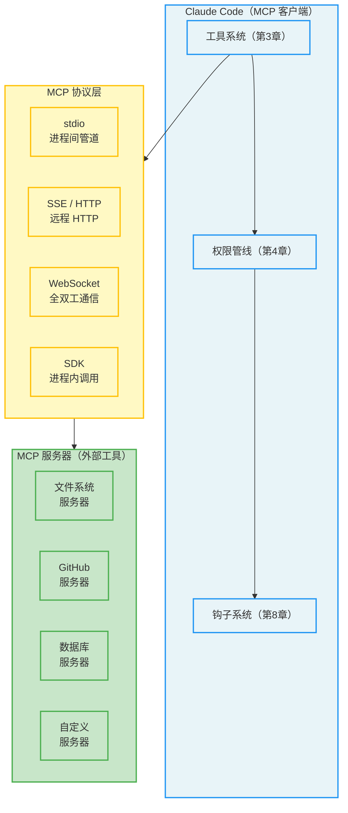
```mermaid
flowchart TD
    subgraph ClaudeCode["Claude Code（MCP 客户端）"]
        direction TB
        ToolSys["工具系统（第3章）"]
        PermPipe["权限管线（第4章）"]
        HookSys["钩子系统（第8章）"]
        ToolSys --> PermPipe
        PermPipe --> HookSys
    end

    subgraph Protocol["MCP 协议层"]
        direction LR
        Stdio["stdio\n进程间管道"]
        SSE["SSE / HTTP\n远程 HTTP"]
        WS["WebSocket\n全双工通信"]
        SDK["SDK\n进程内调用"]
    end

    subgraph Servers["MCP 服务器（外部工具）"]
        direction LR
        S1["文件系统\n服务器"]
        S2["GitHub\n服务器"]
        S3["数据库\n服务器"]
        S4["自定义\n服务器"]
    end

    ToolSys --> Protocol
    Protocol --> Servers

    classDef client fill:#e8f4f8,stroke:#2196F3,stroke-width:2px,color:#333
    classDef proto fill:#fff9c4,stroke:#FFC107,stroke-width:2px,color:#333
    classDef server fill:#c8e6c9,stroke:#4CAF50,stroke-width:2px,color:#333
    class ClaudeCode,ToolSys,PermPipe,HookSys client
    class Protocol,Stdio,SSE,WS,SDK proto
    class Servers,S1,S2,S3,S4 server
```

### 12.1.1 为什么需要 MCP：问题与解决方案

在深入技术细节之前，让我们先理解 MCP 试图解决的根本问题。

**碎片化的集成困境**

在大语言模型（LLM）应用生态中，一个核心挑战长期存在：每个 AI 应用都需要连接外部数据源和工具，但每个应用的集成方式各不相同。想象一下，你是一个数据库供应商，想让你的数据能被各种 AI 工具访问。在没有统一标准的情况下，你需要为每个 AI 平台分别开发适配器——为 Claude 写一个，为 ChatGPT 写一个，为 Cursor 写一个……这就像在 USB 标准出现之前，每台手机都有自己独特的充电器接口。

MCP 的出现，正是为了成为 AI 世界的"USB-C 接口"。它定义了一个开放的标准协议，让任何 AI 应用都能以统一的方式连接任何数据源和工具。对于工具开发者而言，只需实现一次 MCP 服务器，就能被所有支持 MCP 的 AI 应用使用；对于 AI 应用开发者而言，只需实现一次 MCP 客户端，就能接入整个 MCP 生态。

**设计哲学的三个核心原则**

MCP 的设计遵循三个核心原则，这些原则贯穿了 Claude Code 的整个 MCP 实现：

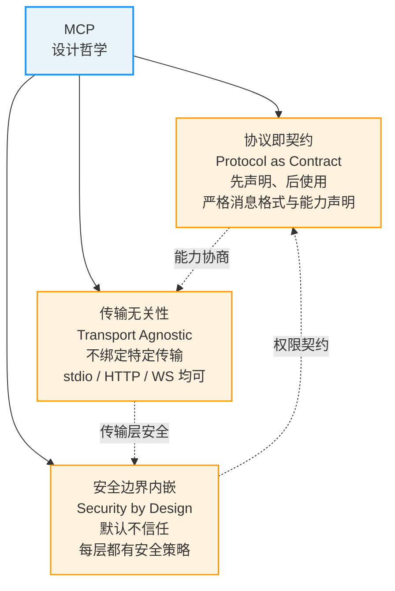
```mermaid
flowchart TD
    Center["MCP\n设计哲学"]

    Center --> P1["协议即契约\nProtocol as Contract\n先声明、后使用\n严格消息格式与能力声明"]
    Center --> P2["传输无关性\nTransport Agnostic\n不绑定特定传输\nstdio / HTTP / WS 均可"]
    Center --> P3["安全边界内嵌\nSecurity by Design\n默认不信任\n每层都有安全策略"]

    P1 -.->|"能力协商"| P2
    P2 -.->|"传输层安全"| P3
    P3 -.->|"权限契约"| P1

    classDef center fill:#e8f4f8,stroke:#2196F3,stroke-width:2px,color:#333
    classDef principle fill:#fff3e0,stroke:#FF9800,stroke-width:1.5px,color:#333
    class Center center
    class P1,P2,P3 principle
```

1. **协议即契约（Protocol as Contract）**：MCP 定义了客户端与服务器之间的严格消息格式和能力声明机制。服务器声明自己提供哪些工具、资源和 Prompt 模板；客户端通过标准化的请求获取这些信息。这种"先声明、后使用"的模式，让双方可以在不相互了解内部实现的前提下协作。这与第3章中工具系统的"接口即架构"哲学一脉相承。

2. **传输无关性（Transport Agnostic）**：MCP 协议本身不绑定任何特定的网络传输方式。同一个 MCP 服务器可以通过 stdio、HTTP、WebSocket 等多种方式提供服务。这种设计使得 MCP 服务器可以在本地进程中运行（高性能、低延迟），也可以部署在远程服务器上（集中管理、多用户共享），而不需要修改业务逻辑。

3. **安全边界内嵌（Security by Design）**：MCP 将安全策略集成到协议的每一个层次——从连接建立时的能力协商，到工具调用时的权限检查，再到企业级的审批控制。这种"默认不信任"的设计确保即使接入了不可信的第三方工具，也不会危及整个系统的安全。

> **类比理解：** 把 MCP 想象成 USB 协议栈。物理层（USB-C 线缆）对应 MCP 的传输层（stdio/SSE/WS）；协议层（USB 描述符和端点）对应 MCP 的能力声明和工具发现；应用层（USB 设备驱动）对应具体的 MCP 工具实现。正如你不需要知道鼠标内部如何工作就能使用它，Claude Code 也不需要知道 MCP 服务器内部如何工作就能调用其工具。

> **交叉引用：** MCP 工具被映射为 Claude Code 内部 Tool 对象后，会完全融入第3章描述的工具系统。这意味着 MCP 工具同样经过权限管线（第4章）的四阶段检查，同样参与并发调度策略，同样可以通过钩子系统（第8章）进行拦截和增强。

### 12.1.2 支持的传输协议

Claude Code 支持 8 种 MCP 传输协议，每种协议针对不同的部署场景和网络拓扑进行了优化。理解这些协议的适用场景，是设计高效 MCP 集成架构的基础。

| 协议类型 | 配置类型 | 传输方式 | 延迟特征 | 适用场景 |
|---------|---------|---------|---------|---------|
| `stdio` | `McpStdioServerConfig` | 标准输入/输出管道 | 最低（进程内通信） | 本地开发工具、文件系统操作、CLI 工具封装 |
| `sse` | `McpSSEServerConfig` | Server-Sent Events | 网络延迟 | 远程 HTTP 服务、云端部署的 MCP 服务器 |
| `sse-ide` | `McpSSEIDEServerConfig` | SSE + IDE 元数据 | 本地网络 | IDE 扩展专用，包含 `ideName` 标识 |
| `http` | `McpHTTPServerConfig` | HTTP Streamable | 网络延迟 | MCP 规范新协议，支持流式响应 |
| `ws` | `McpWebSocketServerConfig` | WebSocket 全双工 | 网络延迟 | 需要实时双向通信的场景 |
| `ws-ide` | `McpWebSocketIDEServerConfig` | WebSocket + IDE 元数据 | 本地网络 | IDE 扩展专用，需要低延迟双向通信 |
| `sdk` | `McpSdkServerConfig` | 进程内函数调用 | 近零延迟 | SDK 内部调用，不启动实际进程或网络连接 |
| `claudeai-proxy` | `McpClaudeAIProxyServerConfig` | Claude.ai 代理 | 网络延迟 | Claude.ai 平台代理服务器 |

**传输协议选型决策树**

当你需要为 MCP 服务器选择传输协议时，可以参考以下决策路径：

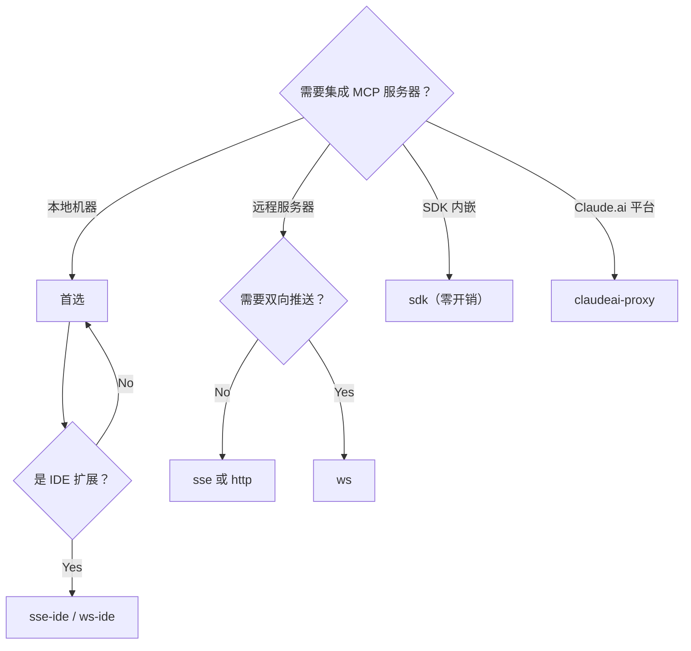
```mermaid
flowchart TD
    START{"需要集成 MCP 服务器？"}
    START -->|"本地机器"| STDIO["首选"]
    STDIO --> IDE{"是 IDE 扩展？"}
    IDE -->|"Yes"| SSE_IDE["sse-ide / ws-ide"]
    IDE -->|"No"| STDIO
    START -->|"远程服务器"| REMOTE{"需要双向推送？"}
    REMOTE -->|"No"| SSE_HTTP["sse 或 http"]
    REMOTE -->|"Yes"| WS["ws"]
    START -->|"SDK 内嵌"| SDK["sdk（零开销）"]
    START -->|"Claude.ai 平台"| PROXY["claudeai-proxy"]
```

**协议详解与适用场景分析**

**stdio 协议**是最常见也是最推荐的类型。它通过 `command` 和 `args` 启动本地 MCP 服务器子进程，利用操作系统的标准输入/输出管道进行通信。这种方式的优势在于：零网络开销（数据在进程间通过内存缓冲区传递）、天然的安全隔离（子进程继承父进程的权限边界）、以及简单的生命周期管理（父进程退出时子进程自动终止）。绝大多数本地开发场景——文件系统访问、Git 操作、数据库客户端——都应优先选择 stdio。

```json
{
  "mcpServers": {
    "filesystem": {
      "type": "stdio",
      "command": "npx",
      "args": ["-y", "@modelcontextprotocol/server-filesystem", "/home/user/projects"],
      "env": { "NODE_OPTIONS": "--max-old-space-size=4096" }
    }
  }
}
```

**SSE 协议**适用于远程部署的 MCP 服务器。Server-Sent Events 是一种基于 HTTP 的单向推送技术：客户端通过 HTTP POST 发送请求，服务器通过 SSE 流式推送响应和通知。这种方式的优势在于部署灵活——MCP 服务器可以运行在云端的任何位置，Claude Code 只需要知道 URL 就能连接。但也带来了额外的网络延迟和认证复杂性。

**sse-ide 和 ws-ide 协议**是 IDE 集成的专用类型，在标准 SSE/WebSocket 协议基础上增加了 IDE 标识信息（如 `ideName` 字段，标识是 VS Code 还是 JetBrains）。这种"协议变体"的设计模式避免了在通用协议中塞入平台特定的逻辑，保持了核心协议的简洁性。

**HTTP Streamable 协议**是 MCP 规范中的新协议，相比 SSE 提供了更灵活的流式响应能力。它支持在单个 HTTP 连接上逐步返回响应内容，适合需要返回大量数据或长时间运行的工具。

**WebSocket 协议**提供了全双工通信能力，适合需要实时双向数据交换的场景。与 SSE 的单向推送不同，WebSocket 允许服务器主动向客户端发送消息，也允许客户端在任何时刻发送请求，无需建立新的 HTTP 连接。

**SDK 协议**是最特殊的类型——它不启动任何进程，也不打开任何网络连接。SDK 类型的 MCP 服务器是通过函数调用直接嵌入 Claude Code 进程的，延迟接近零。它主要用于 SDK 集成场景，允许嵌入 Claude Code 的第三方应用直接注册 MCP 工具，而不需要额外的进程间通信。正因如此，SDK 服务器被豁免于企业安全策略检查——它们运行在与 Claude Code 相同的进程中，安全边界由宿主应用保证。

> **最佳实践：** 优先选择 stdio 协议。只有当 MCP 服务器必须运行在远程机器上（如访问公司内部数据库、使用集中式计算资源）时，才考虑 SSE/HTTP/WebSocket。SDK 协议仅用于程序化集成场景。

> **反模式警告：** 不要在 stdio 服务器中执行需要长时间运行的初始化操作。Claude Code 启动时会并行连接所有配置的 MCP 服务器，如果某个服务器的初始化耗时过长（如建立数据库连接池、加载大型模型），会拖慢整个启动过程。应考虑延迟初始化策略——在首次工具调用时才建立连接。

### 12.1.3 连接管理器 MCPConnectionManager

MCP 连接管理器是一个 React Context Provider，为整个组件树提供 MCP 连接管理能力。它的设计体现了"集中管控、分散使用"的架构模式——连接的建立、断开和重试由管理器统一处理，而工具的使用则分散在各个组件中。

**为什么选择 Context Provider 模式？**

Claude Code 的 UI 层基于 React 构建。在 React 组件树中，如果每个组件都独立管理 MCP 连接，会导致两个严重问题：一是连接资源浪费（同一个 MCP 服务器可能被多个组件重复连接），二是状态不一致（一个组件已经发现服务器断开，另一个组件还在使用缓存的工具列表）。Context Provider 模式通过在组件树的顶层注入共享的连接管理服务，确保所有子组件看到一致的 MCP 状态。

其核心接口提供两个操作：

- **重新连接（reconnect）**：触发指定 MCP 服务器的重连流程，返回更新后的工具列表、命令列表和资源列表。这在服务器配置变更或网络中断后恢复时使用。
- **启用/禁用（toggle）**：控制指定 MCP 服务器的启用状态。禁用服务器会断开连接并移除其所有工具；启用服务器会重新建立连接并注册工具。

子组件通过两个 Hook 访问这些操作：一个获取重连函数（`useMcpReconnect`），一个获取切换函数（`useMcpToggle`）。两者都要求在 `MCPConnectionManager` 组件树内部使用，否则会抛出错误。这是 React Context 的标准安全模式——确保 Context 只在合法的组件层级中消费。

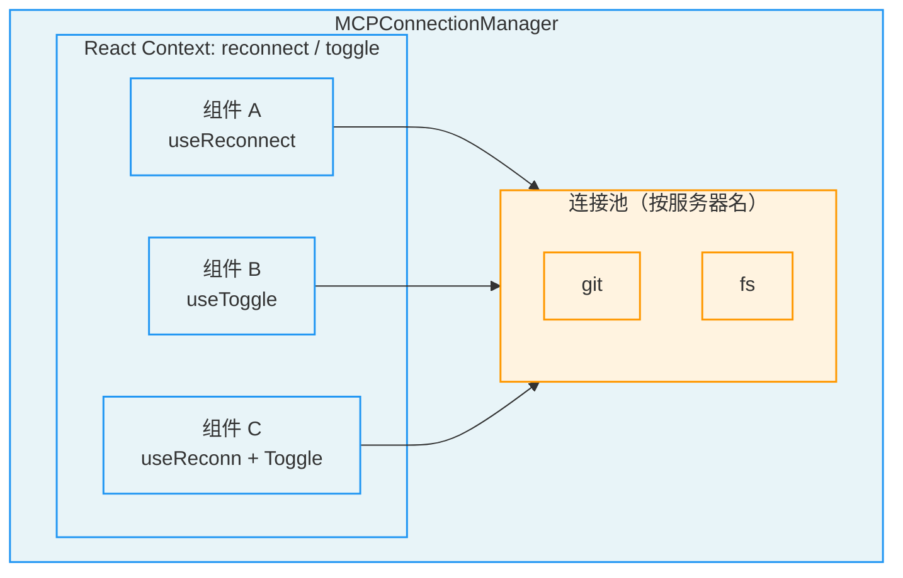
```mermaid
flowchart TD
    subgraph Mgr["MCPConnectionManager"]
        subgraph CTX["React Context: reconnect / toggle"]
            A["组件 A\nuseReconnect"]
            B["组件 B\nuseToggle"]
            C["组件 C\nuseReconn + Toggle"]
        end
        A --> Pool
        B --> Pool
        C --> Pool
        subgraph Pool["连接池（按服务器名）"]
            G["git"]
            F["fs"]
        end
    end

    classDef box fill:#e8f4f8,stroke:#2196F3,stroke-width:1.5px,color:#333
    classDef pool fill:#fff3e0,stroke:#FF9800,stroke-width:1.5px,color:#333
    class A,B,C box
    class Pool,G,F pool
    class Mgr,CTX box
```

### 12.1.4 服务器连接状态与生命周期

MCP 服务器连接有五种状态，构成了一个精心设计的有限状态机：已连接（Connected）、连接失败（Failed）、需要认证（NeedsAuth）、等待连接（Pending，支持重试）和已禁用（Disabled）。

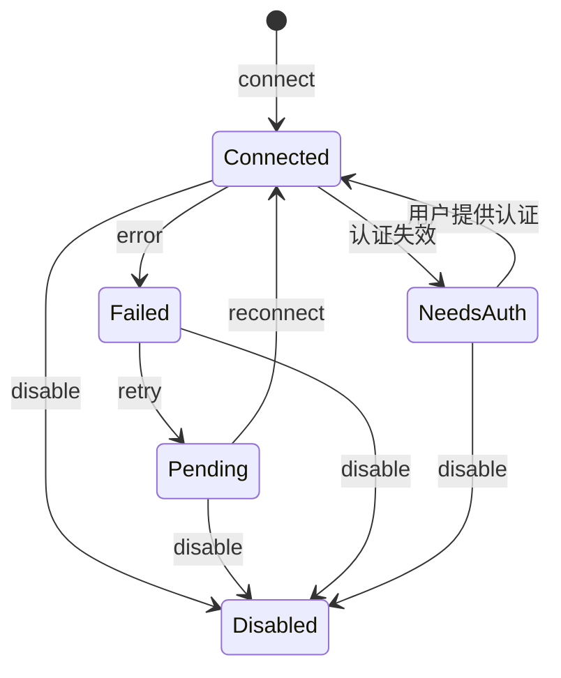
```mermaid
stateDiagram-v2
    [*] --> Connected : connect
    Connected --> Failed : error
    Connected --> Disabled : disable
    Failed --> Pending : retry
    Pending --> Connected : reconnect
    Pending --> Disabled : disable
    Failed --> Disabled : disable
    NeedsAuth --> Connected : 用户提供认证
    Connected --> NeedsAuth : 认证失效
    NeedsAuth --> Disabled : disable
```

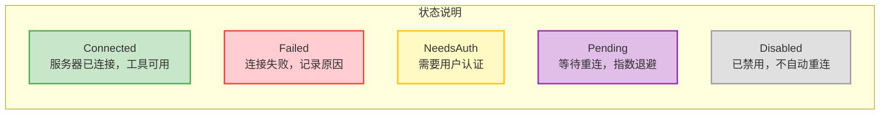
```mermaid
flowchart LR
    subgraph legend["状态说明"]
        C["Connected\n服务器已连接，工具可用"]
        F["Failed\n连接失败，记录原因"]
        N["NeedsAuth\n需要用户认证"]
        P["Pending\n等待重连，指数退避"]
        D["Disabled\n已禁用，不自动重连"]
    end
    classDef conn fill:#c8e6c9,stroke:#4CAF50,stroke-width:2px,color:#333
    classDef fail fill:#ffcdd2,stroke:#f44336,stroke-width:2px,color:#333
    classDef auth fill:#fff9c4,stroke:#FFC107,stroke-width:2px,color:#333
    classDef pend fill:#e1bee7,stroke:#9C27B0,stroke-width:2px,color:#333
    classDef dis fill:#e0e0e0,stroke:#9E9E9E,stroke-width:2px,color:#333
    class C conn
    class F fail
    class N auth
    class P pend
    class D dis
```

**状态转换的深层含义**

每个状态不仅代表连接的技术状态，还对应不同的用户交互策略：

- **Connected**：服务器已连接，工具可用。`ConnectedMCPServer` 包含完整的 MCP Client 实例、服务器能力声明（capabilities）、配置信息和清理函数（用于优雅断开连接）。
- **Failed**：连接尝试失败。系统会记录失败原因（网络错误、认证失败、服务器不响应等），并决定是否进入重试流程。不是所有失败都应该重试——认证失败需要用户干预，网络超时则可以自动重试。
- **NeedsAuth**：服务器需要认证但未提供有效凭证。这是安全设计的关键环节——系统不会盲目重试需要认证的连接（那会锁定账户），而是将控制权交给用户。
- **Pending**：等待重连。`PendingMCPServer` 记录了重连尝试次数和最大重连次数，支持指数退避重试（exponential backoff）。这种策略避免了在服务器持续不可用时产生连接风暴。
- **Disabled**：用户主动禁用或被策略强制禁用的服务器。不会自动重连，只有用户显式启用才会尝试连接。

**指数退避重试的设计考量**

Pending 状态的重试使用指数退避算法：第 1 次重试等待约 1 秒，第 2 次 2 秒，第 3 次 4 秒，以此类推，直到达到最大重试次数。这种设计在分布式系统中是标准的容错模式。它的核心逻辑是：如果服务器暂时不可用，快速连续重试只会加重负担；但如果服务器在几秒后恢复，你不希望等太久。

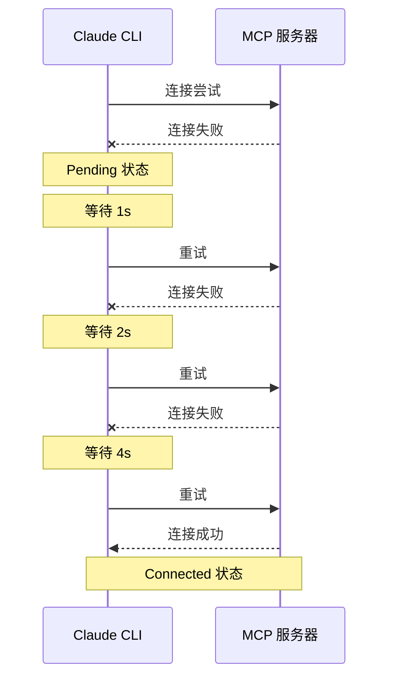
```mermaid
sequenceDiagram
    participant CLI as Claude CLI
    participant Server as MCP 服务器

    CLI->>Server: 连接尝试
    Server--xCLI: 连接失败

    Note over CLI: Pending 状态
    Note over CLI: 等待 1s
    CLI->>Server: 重试 #1
    Server--xCLI: 连接失败

    Note over CLI: 等待 2s
    CLI->>Server: 重试 #2
    Server--xCLI: 连接失败

    Note over CLI: 等待 4s
    CLI->>Server: 重试 #3
    Server-->>CLI: 连接成功

    Note over CLI,Server: Connected 状态
```

> **与第3章的关联：** MCP 工具只有在服务器处于 Connected 状态时才会出现在工具列表中。当服务器从 Connected 转为其他状态时，其所有工具会立即从可用工具列表中移除。这与第3章描述的工具注册机制紧密集成——工具的可用性是动态的，而非静态的。

---

## 12.2 MCP 工具集成

MCP 工具集成是将外部服务器的能力无缝融入 Claude Code 内部工具系统的过程。这一过程涉及三个关键阶段：工具发现（Discovery）、工具映射（Mapping）和工具注册（Registration）。理解这个链路，就理解了 MCP 如何将"外部工具"变成"内部能力"。

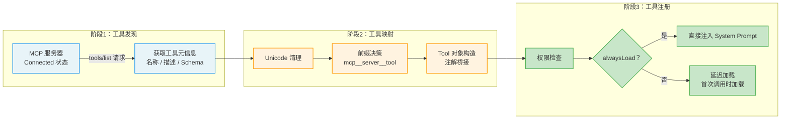
```mermaid
flowchart LR
    subgraph Discovery["阶段1：工具发现"]
        D1["MCP 服务器\nConnected 状态"] -->|"tools/list 请求"| D2["获取工具元信息\n名称 / 描述 / Schema"]
    end

    subgraph Mapping["阶段2：工具映射"]
        M1["Unicode 清理"] --> M2["前缀决策\nmcp__server__tool"]
        M2 --> M3["Tool 对象构造\n注解桥接"]
    end

    subgraph Registration["阶段3：工具注册"]
        R1["权限检查"] --> R2{"alwaysLoad？"}
        R2 -->|"是"| R3["直接注入 System Prompt"]
        R2 -->|"否"| R4["延迟加载\n首次调用时加载"]
    end

    D2 --> M1
    M3 --> R1

    classDef disc fill:#e8f4f8,stroke:#2196F3,stroke-width:1.5px,color:#333
    classDef map fill:#fff3e0,stroke:#FF9800,stroke-width:1.5px,color:#333
    classDef reg fill:#c8e6c9,stroke:#4CAF50,stroke-width:1.5px,color:#333
    class D1,D2 disc
    class M1,M2,M3 map
    class R1,R2,R3,R4 reg
```

### 12.2.1 工具发现与映射

**发现阶段**

MCP 服务器连接成功后（进入 Connected 状态），Claude Code 通过 `tools/list` 请求获取服务器提供的工具列表。这个请求是 MCP 协议标准的一部分，服务器必须返回其提供的所有工具的元信息——包括工具名称、描述、输入参数 Schema 和行为注解（hints）。

> **类比理解：** 工具发现就像你走进一家餐厅坐下后，服务员递给你菜单。菜单上列出了所有可用的菜品（工具名称）、食材说明（输入参数）、口味标签（行为注解）。你不需要去厨房看厨师怎么做菜，菜单就足够你做出选择了。

**映射阶段**

工具映射的核心逻辑包括几个关键步骤：

1. **Unicode 清理**：对返回的工具列表进行 Unicode 清理，移除控制字符和非法字符。这一步看似简单，却是防御性编程的典型体现——你不应该信任任何外部输入，包括工具名称中的字符。

2. **前缀决策**：根据配置决定是否为工具名添加服务器名前缀。在大多数模式下，前缀是必须的（确保跨服务器的工具名不冲突）；但在 SDK 模式下，当环境变量 `CLAUDE_AGENT_SDK_MCP_NO_PREFIX` 被设置时，工具使用原始名称注册，允许 MCP 工具按名称覆盖内置工具。

3. **工具对象构造**：将每个 MCP 工具映射为 Claude Code 内部的 `Tool` 对象。这个映射不是简单的字段复制，而是一次完整的"协议适配"——MCP 的语义被转换为 Claude Code 工具系统的语义。

每个 MCP 工具被映射为 Claude Code 内部的 `Tool` 对象后，包含以下关键属性：

| 属性 | 来源 | 作用 |
|------|------|------|
| `isMcp: true` | 固定标记 | 标识这是一个 MCP 工具，用于区分内置工具 |
| `mcpInfo` | 服务器配置 | 包含 `serverName` 和 `toolName` 的元信息，用于权限检查和 UI 显示 |
| `isConcurrencySafe()` | MCP 注解 `readOnlyHint` | 映射为并发安全性判断，影响调度策略 |
| `isDestructive()` | MCP 注解 `destructiveHint` | 映射为破坏性判断，影响权限提示级别 |
| `isOpenWorld()` | MCP 注解 `openWorldHint` | 映射为开放世界判断，影响权限范围检查 |
| `alwaysLoad` | `_meta.anthropic/alwaysLoad` | 当为 true 时跳过延迟加载，直接注入 system prompt |

**行为注解的桥接设计**

上表中的三个"Hint"映射值得特别关注。MCP 协议定义了工具行为注解（如 `readOnlyHint`、`destructiveHint`），而 Claude Code 的工具系统有自己的语义模型（如 `isConcurrencySafe()`、`isDestructive()`）。这两套语义系统之间的映射不是 1:1 的——MCP 的注解是"提示性"的（hint），而 Claude Code 的方法是"决定性"的（decision）。

这种桥接设计的精妙之处在于：它允许 MCP 服务器用标准化的语言描述自己的工具行为，而 Claude Code 可以根据自己的安全策略做出最终决策。如果 MCP 服务器的注解不准确（比如一个标为 `readOnlyHint` 的工具实际上会修改数据），Claude Code 的权限管线仍然会在运行时进行二次检查。

> **交叉引用：** 这里的并发安全性（`isConcurrencySafe()`）直接影响第3章中描述的并发分区策略。被标记为并发安全的 MCP 工具可以与其他安全工具并行执行，而不安全的工具必须串行等待。

**延迟加载机制**

`alwaysLoad` 属性控制工具的加载时机。在默认的延迟加载模式下，MCP 工具的描述不会立即出现在 system prompt 中（那会消耗大量 token），而是在模型首次需要使用该工具时才加载。但对于标记了 `alwaysLoad: true` 的工具（通常是高频使用的基础工具），系统会在启动时直接注入 system prompt，确保模型始终知道这些工具的存在。

### 12.2.2 工具名称前缀：mcp__server__tool

MCP 工具采用统一的三段式命名规则 `mcp__{server}__{tool}`。这个看似简单的命名规则背后，包含了几层重要的设计考量。

**为什么需要前缀？**

想象一个场景：你同时连接了两个 MCP 服务器——一个是 GitHub 工具，一个是 GitLab 工具，它们都提供了一个名为 `create_issue` 的工具。如果没有命名空间隔离，两个工具就会产生名称冲突，模型无法区分它们。三段式命名通过将服务器名作为命名空间，确保即使不同服务器提供同名工具，全局名称仍然是唯一的。

**命名规则的实现细节**

命名工具函数将服务器名和工具名拼接为全限定名，解析函数则执行反向操作，按双下划线拆分提取服务器名和工具名。

关键设计细节：

**双下划线分隔**：工具名格式为 `mcp__{server}__{tool}`。如果服务器名包含双下划线，解析可能不准确——但这在实践中极少发生。选择双下划线而非单下划线的理由也很直观：单下划线在变量名中太常见了（如 `read_file`），使用双下划线作为分隔符可以显著降低歧义。

**SDK 前缀跳过**：当环境变量 `CLAUDE_AGENT_SDK_MCP_NO_PREFIX` 设置且服务器类型为 `sdk` 时，工具使用原始名称注册。这个设计支持一种高级用法：允许 MCP 工具按名称覆盖内置工具。例如，一个 SDK 注册的 `Read` 工具可以覆盖 Claude Code 内置的 Read 工具，实现自定义行为。这是一种"后门"机制，通常用于 SDK 嵌入场景（如将 Claude Code 集成到另一个应用中，需要自定义文件读取行为）。

**权限检查使用全限定名**：`getToolNameForPermissionCheck` 函数确保权限规则匹配使用 `mcp__server__tool` 格式。这解决了一个微妙的安全问题：如果一个 MCP 服务器提供了一个名为 `Write` 的工具（不带前缀），它的权限检查不应该匹配到内置 `Write` 工具的规则——否则用户允许内置 Write 工具的操作可能被 MCP 的 Write 工具利用。

**名称解析的边界情况**

让我们分析几种边界情况：

```
mcp__github__create_issue     → server="github", tool="create_issue"  ✓ 清晰
mcp__my_server__read_file     → server="my_server", tool="read_file"  ✓ 清晰
mcp__my__special__tool        → server="my", tool="special__tool"     ⚠ 歧义
mcp__server__name__with__dupes → server="server", tool="name__with__dupes" ⚠ 歧义
```

解析函数按第一次出现的双下划线拆分——`mcp` 之后的部分中，第一个双下划线之前是服务器名，之后是工具名。这意味着如果服务器名本身包含双下划线，解析结果可能不符合预期。但正如前面提到的，这种情况在实践中极少发生。

> **最佳实践：** 为 MCP 服务器命名时，避免使用双下划线。推荐使用单下划线（如 `my_server`）或连字符（如 `my-server`）作为服务器名的分隔符。

> **与权限管线的关联：** 三段式命名确保 MCP 工具在权限检查时具有独立的命名空间。当用户在 `.claude/settings.local.json` 中配置 `allow: ["mcp__github__*"]` 时，这个规则只会匹配 GitHub 服务器提供的工具，不会影响其他服务器或内置工具。这是第4章权限管线中"按工具粒度授权"策略在 MCP 上下文中的具体体现。

### 12.2.3 MCP 工具的权限模型

MCP 工具的权限检查采用了"默认拒绝，显式允许"的安全原则。默认情况下，每次 MCP 工具调用都会返回 `passthrough` 行为，意味着每次调用都需要用户确认。这种"默认弹确认"的设计虽然增加了交互成本，但在安全上是正确的——你无法预知一个第三方 MCP 工具会做什么，应该让用户知情并同意。

但频繁的确认弹窗会严重影响使用体验。为此，系统提供了自动允许的路径，用户可以在 `.claude/settings.local.json` 中添加规则来预授权特定的 MCP 工具：

```json
{
  "permissions": {
    "allow": [
      "mcp__my_server__read_file",
      "mcp__github__*"
    ]
  }
}
```

**权限规则的匹配逻辑**

权限规则支持精确匹配和通配符匹配两种模式：

- `mcp__github__create_issue`：精确匹配，只允许名为 `create_issue` 的 GitHub 工具
- `mcp__github__*`：通配符匹配，允许 GitHub 服务器提供的所有工具
- `mcp__*`：允许所有 MCP 工具（谨慎使用）

**权限层级全景图**

将 MCP 工具的权限模型放入 Claude Code 整体权限体系中来看：

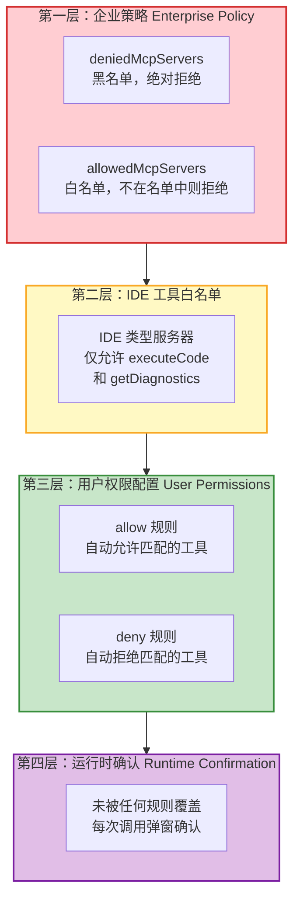
```mermaid
flowchart TD
    subgraph L1["第一层：企业策略 Enterprise Policy"]
        direction LR
        D["deniedMcpServers\n黑名单，绝对拒绝"]
        A["allowedMcpServers\n白名单，不在名单中则拒绝"]
    end

    subgraph L2["第二层：IDE 工具白名单"]
        direction LR
        IDE["IDE 类型服务器\n仅允许 executeCode\n和 getDiagnostics"]
    end

    subgraph L3["第三层：用户权限配置 User Permissions"]
        direction LR
        Allow["allow 规则\n自动允许匹配的工具"]
        Deny["deny 规则\n自动拒绝匹配的工具"]
    end

    subgraph L4["第四层：运行时确认 Runtime Confirmation"]
        Confirm["未被任何规则覆盖\n每次调用弹窗确认"]
    end

    L1 --> L2 --> L3 --> L4

    classDef layer1 fill:#ffcdd2,stroke:#d32f2f,stroke-width:2px,color:#333
    classDef layer2 fill:#fff9c4,stroke:#f9a825,stroke-width:2px,color:#333
    classDef layer3 fill:#c8e6c9,stroke:#388e3c,stroke-width:2px,color:#333
    classDef layer4 fill:#e1bee7,stroke:#7b1fa2,stroke-width:2px,color:#333
    class L1 layer1
    class L2 layer2
    class L3 layer3
    class L4 layer4
```

这个四层权限模型的设计遵循了"深度防御（Defense in Depth）"原则：即使某一层的检查被绕过或配置错误，其他层仍然提供保护。例如，即使用户在权限配置中允许了所有 MCP 工具（`mcp__*`），企业管理员仍然可以通过黑名单阻止危险的服务器。

> **与第4章的交叉引用：** 这个权限层级与第4章描述的权限管线（Permission Pipeline）紧密集成。MCP 工具的权限检查发生在权限管线的第二阶段（权限评估阶段），与内置工具共享相同的检查框架，但具有独立的默认行为（passthrough vs. 内置工具的可能自动允许）。

> **反模式警告：** 不要在全局配置中使用 `"mcp__*": "allow"` 来允许所有 MCP 工具。这种"一键全开"的做法虽然方便，但会绕过安全检查——任何新连接的 MCP 服务器提供的工具都会被自动允许执行，包括你可能不了解的工具。应该按服务器或按工具粒度授权。

---

## 12.3 MCP 权限与安全

安全性是 MCP 集成中最关键的话题。与内置工具不同，MCP 工具来自外部第三方，其行为不可预测、不可控制。因此，Claude Code 为 MCP 构建了多层防御体系，从配置作用域到服务器审批，从工具白名单到插件去重，每一层都针对特定的安全威胁。

### 12.3.1 配置范围与作用域

MCP 服务器的配置有七个作用域，每个作用域对应不同的管理级别和信任边界：

| 作用域 | 配置来源 | 管理级别 | 典型用途 |
|--------|---------|---------|---------|
| `local` | `.claude/settings.local.json` | 项目-个人 | 开发者个人使用的工具，不提交到版本控制 |
| `project` | `.claude/settings.json` | 项目-共享 | 团队共享的工具配置，提交到版本控制 |
| `user` | `~/.claude/settings.json` | 用户全局 | 跨项目使用的通用工具（如 GitHub MCP） |
| `dynamic` | 运行时动态添加 | 会话级 | 临时添加的工具，会话结束后消失 |
| `enterprise` | 企业管理配置 | 组织级 | 企业批准的工具白名单和黑名单 |
| `claudeai` | Claude.ai 平台连接器 | 平台级 | Claude.ai 网页端的工具连接 |
| `managed` | 托管策略配置 | 管理级 | IT 管理员强制执行的策略 |

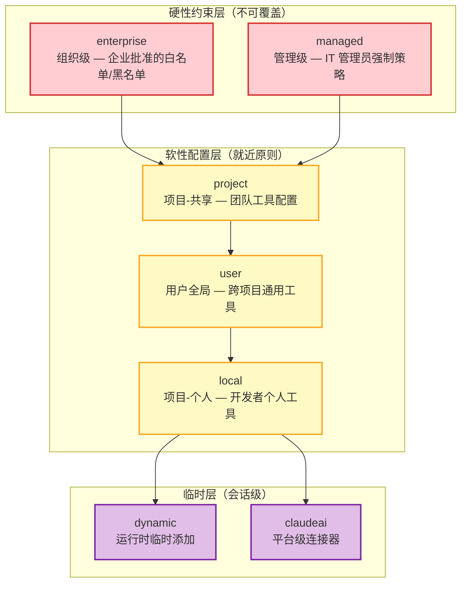
```mermaid
flowchart TD
    subgraph HardConstraints["硬性约束层（不可覆盖）"]
        ENT["enterprise\n组织级 — 企业批准的白名单/黑名单"]
        MGD["managed\n管理级 — IT 管理员强制策略"]
    end

    subgraph SoftConfig["软性配置层（就近原则）"]
        PROJ["project\n项目-共享 — 团队工具配置"]
        USR["user\n用户全局 — 跨项目通用工具"]
        LOC["local\n项目-个人 — 开发者个人工具"]
    end

    subgraph Temporary["临时层（会话级）"]
        DYN["dynamic\n运行时临时添加"]
        CAI["claudeai\n平台级连接器"]
    end

    ENT --> PROJ
    MGD --> PROJ
    PROJ --> USR
    USR --> LOC
    LOC --> DYN
    LOC --> CAI

    classDef hard fill:#ffcdd2,stroke:#d32f2f,stroke-width:2px,color:#333
    classDef soft fill:#fff9c4,stroke:#f9a825,stroke-width:2px,color:#333
    classDef temp fill:#e1bee7,stroke:#7b1fa2,stroke-width:2px,color:#333
    class ENT,MGD hard
    class PROJ,USR,LOC soft
    class DYN,CAI temp
```

**作用域优先级与覆盖规则**

这七个作用域的优先级遵循"就近原则"：更具体的范围（如 local）优先于更宽泛的范围（如 user），而管理级别的范围（如 enterprise、managed）则作为硬性约束存在，无法被低级别的作用域覆盖。

这种设计在安全上意味着：

1. **企业管理员的决定是最终的**：如果 enterprise 配置禁止了某个 MCP 服务器，即使用户在 local 配置中添加了该服务器，也不会生效。
2. **项目配置优于个人配置**：如果项目级别的配置启用了特定工具，个人配置不能禁用它（但可以添加额外的工具）。
3. **运行时配置是临时的**：dynamic 作用域添加的服务器只在当前会话中有效，不会持久化。

> **类比理解：** 七个作用域就像一栋大楼的七层门禁。大楼入口是企业策略（只有员工能进入），楼层入口是托管策略（只能去自己部门所在的楼层），房间门是项目配置（只有项目成员能进入），个人储物柜是 local 配置（只有自己能打开）。每一层门禁都独立运作，但组合起来形成了完整的访问控制。

> **最佳实践：** 通用工具（如 GitHub、数据库客户端）配置在 user 作用域；项目特有工具（如项目特定的 API 测试工具）配置在 project 作用域；个人偏好或实验性工具配置在 local 作用域。

### 12.3.2 服务器审批与白名单

企业管理员可以通过 `allowedMcpServers` 和 `deniedMcpServers` 策略控制哪些 MCP 服务器可以使用。这是三层安全策略的核心，也是企业部署 Claude Code 时最重要的安全控制点。

**为什么需要审批机制？**

在企业环境中，MCP 服务器可能带来严重的安全风险：一个恶意的 MCP 服务器可以在工具调用时执行任意代码、窃取敏感数据、甚至通过工具的输入参数注入恶意指令。审批机制让企业管理员能够在服务器连接之前就进行拦截，将安全防线前移到"预防"阶段，而非"检测"阶段。

**黑名单（Denylist）：绝对优先级**

黑名单具有绝对优先级——被列入黑名单的服务器，无论出现在哪个作用域中，都不会被连接。支持三种匹配方式：

1. **按服务器名称匹配**：最简单直接，通过服务器在配置中注册的名称进行匹配。
2. **按命令数组匹配**：针对 stdio 服务器，通过完整的命令行参数（`command` + `args`）进行匹配。这可以防止用户通过换一个名称来绕过黑名单。
3. **按 URL 模式匹配**：针对远程服务器（SSE/HTTP/WS），支持通配符的 URL 匹配。

**白名单（Allowlist）：门控机制**

如果定义了白名单，则只有白名单中的服务器被允许。白名单同样支持名称、命令和 URL 三种匹配方式。白名单是一种更严格的安全策略——默认拒绝一切，只允许明确批准的。适合对安全性要求极高的环境（如金融机构、政府机构）。

**URL 通配符匹配详解**

URL 模式匹配支持 `*` 通配符，可以灵活地匹配一组相关的服务器：

```
精确匹配：
  "https://mcp.company.com/api"     只匹配这一个 URL

通配符匹配：
  "https://mcp.company.com/*"       匹配 mcp.company.com 下的所有路径
  "https://*.company.com/*"         匹配 company.com 的所有子域名和路径
  "https://mcp.company.com:*\/*"    匹配任意端口

实际匹配示例：
  模式："https://example.com/*"
  ✓ 匹配 "https://example.com/api/v1"
  ✓ 匹配 "https://example.com/tools/github"
  ✗ 不匹配 "https://api.example.com/tools"（子域名不同）

  模式："https://*.example.com/*"
  ✓ 匹配 "https://api.example.com/path"
  ✓ 匹配 "https://mcp.example.com/tools"
  ✗ 不匹配 "https://example.com/path"（没有子域名）
```

**策略过滤函数的设计**

`filterMcpServersByPolicy` 是所有配置入口的统一过滤器。它的执行逻辑可以概括为：

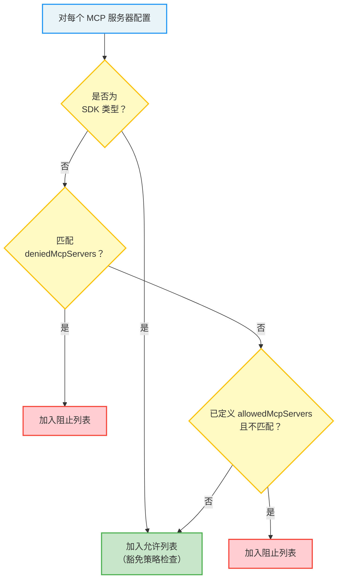
```mermaid
flowchart TD
    Input["对每个 MCP 服务器配置"] --> CheckSDK{"是否为\nSDK 类型？"}
    CheckSDK -->|"是"| Allow["加入允许列表\n（豁免策略检查）"]
    CheckSDK -->|"否"| CheckDeny{"匹配\ndeniedMcpServers？"}
    CheckDeny -->|"是"| Block1["加入阻止列表"]
    CheckDeny -->|"否"| CheckAllow{"已定义 allowedMcpServers\n且不匹配？"}
    CheckAllow -->|"是"| Block2["加入阻止列表"]
    CheckAllow -->|"否"| Allow

    classDef allow fill:#c8e6c9,stroke:#4CAF50,stroke-width:2px,color:#333
    classDef block fill:#ffcdd2,stroke:#f44336,stroke-width:2px,color:#333
    classDef decision fill:#fff9c4,stroke:#FFC107,stroke-width:2px,color:#333
    classDef input fill:#e8f4f8,stroke:#2196F3,stroke-width:2px,color:#333
    class Allow allow
    class Block1,Block2 block
    class CheckSDK,CheckDeny,CheckAllow decision
    class Input input
```

SDK 类型的服务器被豁免于策略检查是一个重要的设计决策。原因在于：SDK 服务器是 SDK 管理的传输占位符，CLI 不会为它们启动进程或打开网络连接。它们运行在与 Claude Code 相同的进程中，安全边界由宿主应用（即嵌入 Claude Code SDK 的应用）保证，因此不需要 CLI 层面的策略控制。

> **安全思考：** 审批机制体现了"安全左移（Shift Left Security）"的理念。与其在工具调用时检查权限（那时可能已经太晚了），不如在连接建立前就拦截不可信的服务器。这种预防性安全措施的成本很低（只是配置检查），但收益很高（完全杜绝了不可信服务器的接入）。

### 12.3.3 插件去重

当插件提供的 MCP 服务器与手动配置的服务器指向相同的底层进程/URL 时，系统会自动去重。去重看似是一个小功能，但在实际使用中极其重要——没有去重，同一个 MCP 服务器可能被连接多次，消耗双倍资源，暴露重复的工具列表（导致模型困惑），甚至引发并发冲突。

**去重的签名机制**

去重函数使用签名比较来识别"相同"的服务器。签名规则如下：

| 服务器类型 | 签名计算方式 | 示例 |
|-----------|-------------|------|
| `stdio` | `stdio:${JSON.stringify([command, ...args])}` | `stdio:["npx","-y","@mcp/server-filesystem","/tmp"]` |
| 远程服务器 | `url:${原始URL}` | `url:https://mcp.example.com/api` |
| `sdk` | `null`（不做去重） | 不适用 |

**签名的深层含义**

stdio 服务器使用完整的命令数组作为签名，这意味着即使服务器名称不同、环境变量不同，只要最终启动的是同一个命令，就会被识别为重复。这是一个正确的安全决策——去重应该基于"实际效果"而非"表面配置"。如果两个配置最终运行的是同一个程序，那么它们就是重复的。

远程服务器以原始 URL 作为签名。特别值得注意的是，如果 URL 是 CCR（Claude Code Relay）代理路径，系统会先解包获取真实 URL 再计算签名。这避免了同一个远程服务器通过不同的代理路径逃过去重。

SDK 服务器签名为 null，不做去重。这是因为 SDK 服务器可能通过不同的代码路径注册，虽然类型相同但功能不同，去重会导致功能丢失。

**去重优先级：谁胜出？**

当检测到重复时，系统按以下优先级决定保留哪个配置：

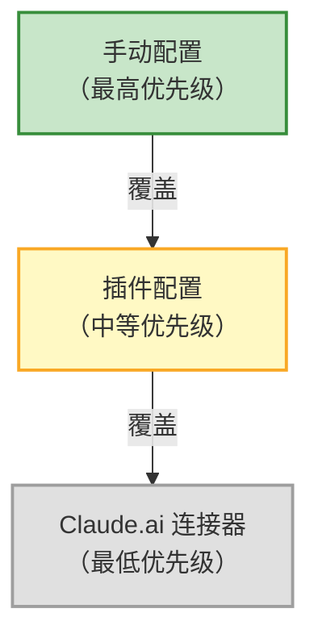
```mermaid
flowchart TD
    Manual["手动配置\n（最高优先级）"]
    Plugin["插件配置\n（中等优先级）"]
    Connector["Claude.ai 连接器\n（最低优先级）"]
    Manual -->|"覆盖"| Plugin
    Plugin -->|"覆盖"| Connector

    classDef high fill:#c8e6c9,stroke:#388e3c,stroke-width:2px,color:#333
    classDef mid fill:#fff9c4,stroke:#f9a825,stroke-width:2px,color:#333
    classDef low fill:#e0e0e0,stroke:#9E9E9E,stroke-width:2px,color:#333
    class Manual high
    class Plugin mid
    class Connector low
```

这个优先级的设计逻辑是：用户的显式配置（手动配置）反映了用户的明确意图，应该始终被尊重。如果用户手动配置了一个 MCP 服务器并自定义了参数，那么插件自动注入的同名服务器不应该覆盖用户的选择。

> **实际案例：** 一个常见的场景是——团队通过 VS Code 扩展自动注入了 GitHub MCP 服务器配置（插件配置），但某个开发者已经在 `.claude/settings.local.json` 中手动配置了同一个服务器，但使用了不同的环境变量（如自定义的 GitHub Token）。去重机制确保手动配置胜出，开发者的自定义 Token 被使用，而不是扩展注入的默认配置。

### 12.3.4 IDE 工具白名单

对于 IDE 集成的 MCP 服务器，系统实施了一个额外的安全层——工具白名单限制。只有以下两个工具被允许从 IDE MCP 服务器加载：

| 工具名 | 功能 | 安全考虑 |
|--------|------|---------|
| `mcp__ide__executeCode` | 在 IDE 环境中执行代码 | 限制在 IDE 的沙箱上下文中运行 |
| `mcp__ide__getDiagnostics` | 获取 IDE 的诊断信息（错误、警告等） | 只读操作，不修改任何状态 |

**为什么需要这个限制？**

这个看似严格的设计背后是一个深思熟虑的安全决策。IDE 扩展是由第三方开发者编写的，它们可以通过 MCP 协议暴露任意工具。如果没有白名单限制，一个恶意的 VS Code 扩展可以暴露一个 `deleteFiles` 或 `executeCommand` 工具，当用户在 Claude Code 中使用该扩展时，这些危险工具就会被注册。

白名单的设计哲学是"最小权限原则"——IDE 集成只需要两个核心能力：执行代码（让 Claude Code 能在 IDE 上下文中运行代码片段）和获取诊断信息（让 Claude Code 能看到编译错误和代码问题）。任何超出这个范围的功能都不应该通过 IDE MCP 通道暴露。

**白名单的执行时机**

白名单检查发生在工具发现阶段——当 Claude Code 从 IDE 类型的 MCP 服务器获取工具列表后，会过滤掉不在白名单中的工具。这意味着不在白名单中的工具根本不会出现在 Claude Code 的工具注册表中，模型甚至不知道它们的存在。这比"注册但禁止调用"更安全，因为它消除了通过配置错误或权限绕过而意外调用这些工具的可能性。

> **与 Bridge 系统的关系：** IDE 工具白名单是 Bridge 系统（12.4节）安全模型的组成部分。IDE 通过 Bridge 通道与 Claude Code 通信，工具白名单确保即使 Bridge 通道被恶意扩展利用，暴露的攻击面也被严格限制在两个安全的工具范围内。

---

## 12.4 IDE 集成：Bridge 系统

Bridge 系统是 Claude Code 与外部世界双向通信的核心层。它实现了与 VS Code、JetBrains 等 IDE 的集成，以及 Claude.ai 平台的远程控制功能。如果 MCP 协议是 Claude Code 与工具服务器之间的"方言"，那么 Bridge 系统就是 Claude Code 与整个外部世界之间的"通用语言"。

> **类比理解：** 把 Bridge 想象成一个多语言翻译中心的调度系统。翻译中心（Bridge）同时处理来自不同国家的电话（IDE、claude.ai、远程终端），需要为每条线路选择正确的翻译协议（v1/v2 传输），确保消息不会串线（去重），并控制谁可以打入电话（权限门控）。

### 12.4.1 架构概览

Bridge 系统位于 bridge 通信目录中，包含超过 30 个模块文件，构成了一个完整的通信层。它的规模本身就说明了 IDE 集成和远程控制的复杂性——这不是简单的消息转发，而是一个包含路由、去重、认证、传输抽象和会话管理的完整通信中间件。

关键组件如下：

| 职责 | 说明 | 设计模式 |
|------|------|---------|
| REST API 客户端 | 与 claude.ai 后端通信 | 适配器模式 |
| 消息路由和去重 | 处理入站/出站消息 | 责任链模式 |
| 传输层抽象 | 封装 v1 (HybridTransport) 和 v2 (SSE + CCR) | 策略模式 |
| REPL 桥接核心 | 管理会话生命周期 | 观察者模式 |
| 远程控制核心逻辑 | 管理远程控制功能 | 命令模式 |
| Bridge 功能门控和权限检查 | 控制功能访问 | 装饰器模式 |
| 类型定义 | 定义通信类型 | 类型驱动设计 |
| 会话创建和子进程管理 | 管理会话生命周期 | 工厂模式 |
| JWT 工具 | 用于认证 | 工具类 |

**为什么需要这么多模块？**

Bridge 系统的复杂性来自它需要同时满足多个维度的需求：

1. **多传输协议兼容**：需要同时支持旧版（v1）和新版（v2）的传输协议，且在不影响现有集成的情况下平滑迁移。
2. **双向通信**：不仅是 CLI 向外推送消息，还需要接收外部控制命令（如切换模型、中断执行）。
3. **多会话并行**：同一个用户可能同时使用多个终端或 IDE 窗口，每个都需要独立的会话管理。
4. **安全隔离**：不同来源的消息需要不同的认证和权限检查策略。

这些需求叠加在一起，使得一个简单的消息转发模块演变成了一个完整的通信中间件。

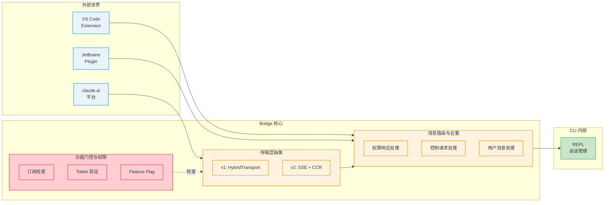
```mermaid
flowchart LR
    subgraph External["外部世界"]
        VS["VS Code\nExtension"]
        JB["JetBrains\nPlugin"]
        CAI["claude.ai\n平台"]
    end

    subgraph BridgeCore["Bridge 核心"]
        subgraph Router["消息路由与去重"]
            Perm["权限响应处理"]
            Ctrl["控制请求处理"]
            User["用户消息处理"]
        end
        subgraph Transport["传输层抽象"]
            V1["v1: HybridTransport"]
            V2["v2: SSE + CCR"]
        end
        subgraph Gate["功能门控与权限"]
            Sub["订阅检查"]
            Token["Token 验证"]
            FF["Feature Flag"]
        end
    end

    subgraph CLI["CLI 内部"]
        REPL["REPL\n会话管理"]
    end

    VS --> Router
    JB --> Router
    CAI --> Transport
    Router --> REPL
    Transport --> Router
    Gate -.->|"检查"| Transport

    classDef ext fill:#e8f4f8,stroke:#2196F3,stroke-width:1.5px,color:#333
    classDef core fill:#fff3e0,stroke:#FF9800,stroke-width:1.5px,color:#333
    classDef gate fill:#ffcdd2,stroke:#f44336,stroke-width:1.5px,color:#333
    classDef cli fill:#c8e6c9,stroke:#4CAF50,stroke-width:1.5px,color:#333
    class VS,JB,CAI ext
    class Router,Perm,Ctrl,User,Transport,V1,V2 core
    class Gate,Sub,Token,FF gate
    class REPL cli
```

### 12.4.2 双向通信层

Bridge 的通信架构是双向的，支持两类数据流。这种双向性是 Bridge 系统区别于简单"日志推送"的关键——它不仅仅把 CLI 的输出转发给外部，还能接收外部指令并执行。

**出站流（CLI -> 外部）**

CLI 中的对话消息、工具调用结果、状态更新等通过传输层发送到外部消费者（IDE、claude.ai 等）。出站消息包括：

- 对话消息（assistant 和 user 角色）
- 工具调用请求和结果
- 状态变更通知（如连接状态、模型切换）
- 错误和诊断信息

出站消息相对简单——它们是单向推送，不需要处理复杂的同步和冲突问题。

**入站流（外部 -> CLI）**

来自 IDE 或 claude.ai 的用户消息、权限响应、控制请求等通过传输层到达 CLI。入站消息的处理要复杂得多，因为它们可能改变 CLI 的状态，需要严格的过滤和验证。

消息路由的核心逻辑实现了三重过滤：

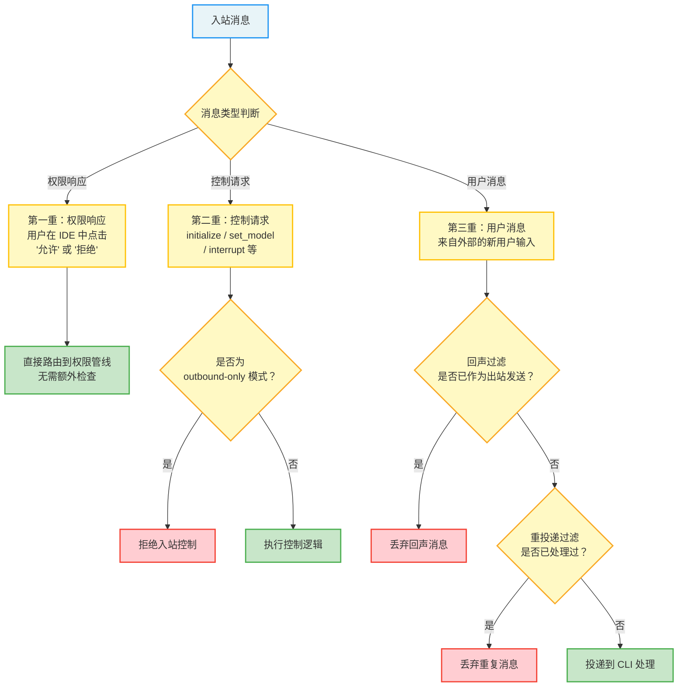
```mermaid
flowchart TD
    Inbound["入站消息"] --> Type1{"消息类型判断"}

    Type1 -->|"权限响应"| P1["第一重：权限响应\n用户在 IDE 中点击\n'允许' 或 '拒绝'"]
    P1 --> PermPipeline["直接路由到权限管线\n无需额外检查"]

    Type1 -->|"控制请求"| P2["第二重：控制请求\ninitialize / set_model\n/ interrupt 等"]
    P2 --> CheckOutbound{"是否为\noutbound-only 模式？"}
    CheckOutbound -->|"是"| Reject["拒绝入站控制"]
    CheckOutbound -->|"否"| ExecCtrl["执行控制逻辑"]

    Type1 -->|"用户消息"| P3["第三重：用户消息\n来自外部的新用户输入"]
    P3 --> EchoFilter{"回声过滤\n是否已作为出站发送？"}
    EchoFilter -->|"是"| Discard1["丢弃回声消息"]
    EchoFilter -->|"否"| RedeliverFilter{"重投递过滤\n是否已处理过？"}
    RedeliverFilter -->|"是"| Discard2["丢弃重复消息"]
    RedeliverFilter -->|"否"| Deliver["投递到 CLI 处理"]

    classDef inbound fill:#e8f4f8,stroke:#2196F3,stroke-width:2px,color:#333
    classDef filter fill:#fff9c4,stroke:#FFC107,stroke-width:2px,color:#333
    classDef accept fill:#c8e6c9,stroke:#4CAF50,stroke-width:2px,color:#333
    classDef reject fill:#ffcdd2,stroke:#f44336,stroke-width:2px,color:#333
    classDef decision fill:#fff9c4,stroke:#f9a825,stroke-width:2px,color:#333
    class Inbound inbound
    class P1,P2,P3 filter
    class PermPipeline,ExecCtrl,Deliver accept
    class Reject,Discard1,Discard2 reject
    class Type1,CheckOutbound,EchoFilter,RedeliverFilter decision
```

**BoundedUUIDSet：高效的重复检测**

`BoundedUUIDSet` 是一个 FIFO（先进先出）有界集合，使用环形缓冲区实现。它用于存储最近处理过的消息 UUID，内存占用恒定为 O(capacity)。当有新消息到达时，系统检查其 UUID 是否在集合中——如果在，说明是重复消息，直接丢弃。

为什么使用环形缓冲区而不是简单的 Set？考虑一个长时间运行的会话，可能处理数万条消息。如果使用普通 Set 存储所有历史 UUID，内存会持续增长。环形缓冲区通过固定容量，只保留最近 N 条消息的 UUID，在内存效率和重复检测准确性之间取得了平衡。N 的值设置得足够大，可以覆盖网络重传的时间窗口（通常几秒到几分钟），同时足够小，不会造成内存压力。

> **与第2章的关联：** Bridge 的双向通信发生在对话循环（第2章）的外层。对话循环管理的是用户-模型之间的交互，而 Bridge 管理的是 CLI-外部世界之间的交互。两者是并行的：Bridge 可以在对话循环执行期间接收和缓存入站消息，等待当前对话轮次结束后再处理。

### 12.4.3 控制协议

服务器可以发送控制请求来远程管理 CLI 会话。`handleServerControlRequest` 函数实现了一个轻量级的远程过程调用（RPC）协议，支持以下控制子类型：

| 子类型 | 用途 | 请求参数 | 响应 |
|--------|------|---------|------|
| `initialize` | 初始化握手，报告能力 | 客户端能力声明 | commands, output_style, models, account, pid |
| `set_model` | 远程切换模型 | 目标模型名称 | 成功/失败状态 |
| `set_max_thinking_tokens` | 调整思考 token 预算 | token 数量 | 成功/失败状态 |
| `set_permission_mode` | 切换权限模式 | 目标模式名称 | 策略裁决结果 |
| `interrupt` | 中断当前执行 | 无 | 立即中断 |

**控制协议的设计原则**

控制协议的设计体现了几个重要的原则：

1. **最小化控制面**：只有五个控制子类型，每个都有明确的语义和边界。这与"最小 API 表面"的设计哲学一致——控制命令越少，安全审计越容易，误用的可能性越低。

2. **显式能力协商**：`initialize` 是第一个也是必须的控制请求。它让双方交换能力声明，确保后续的控制请求只会发送对方支持的命令。这种"先协商、后操作"的模式是网络协议设计中的经典模式。

3. **单向中断**：`interrupt` 不等待响应，直接触发中断。这是唯一一个"发射后不管"的控制命令，设计上优先考虑响应速度而非可靠性——中断操作需要立即生效，等待响应会延迟中断的执行。

**outbound-only 模式的安全考量**

在 **outbound-only** 模式下，除 `initialize` 外的所有可变请求都被拒绝，返回错误信息告知需要本地启用 Remote Control 才能允许入站控制。

这是一个关键的安全边界。outbound-only 模式意味着 CLI 只向外部推送信息，不接受外部的控制命令。这对于 claude.ai 集成特别重要——用户可能只是想查看对话历史，而不希望网页端能够远程控制他们的 CLI 会话（比如切换模型或中断执行）。

为什么 `initialize` 在 outbound-only 模式下仍然被允许？因为 initialize 是一个只读操作——它不改变 CLI 的任何状态，只是返回当前的能力信息。禁止 initialize 会导致外部客户端无法了解 CLI 的能力，从而无法正确显示对话内容。

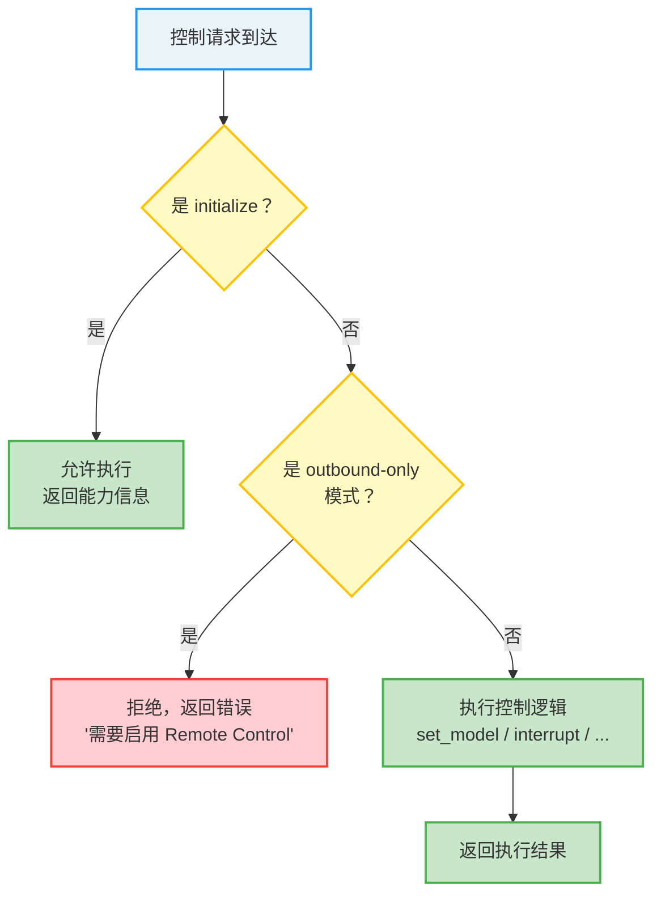
```mermaid
flowchart TD
    Request["控制请求到达"] --> InitCheck{"是 initialize？"}
    InitCheck -->|"是"| AllowInit["允许执行\n返回能力信息"]
    InitCheck -->|"否"| OutboundCheck{"是 outbound-only\n模式？"}
    OutboundCheck -->|"是"| Reject["拒绝，返回错误\n'需要启用 Remote Control'"]
    OutboundCheck -->|"否"| Execute["执行控制逻辑\nset_model / interrupt / ..."]
    Execute --> Result["返回执行结果"]

    classDef start fill:#e8f4f8,stroke:#2196F3,stroke-width:2px,color:#333
    classDef decision fill:#fff9c4,stroke:#FFC107,stroke-width:2px,color:#333
    classDef accept fill:#c8e6c9,stroke:#4CAF50,stroke-width:2px,color:#333
    classDef reject fill:#ffcdd2,stroke:#f44336,stroke-width:2px,color:#333
    class Request start
    class InitCheck,OutboundCheck decision
    class AllowInit,Execute,Result accept
    class Reject reject
```

### 12.4.4 传输层抽象

传输层定义了统一的 `ReplBridgeTransport` 接口，将底层通信协议的复杂性封装在统一的抽象之下。这是经典的"策略模式"（Strategy Pattern）应用——上层代码通过统一接口与传输层交互，无需关心底层使用的是 WebSocket、SSE 还是其他协议。

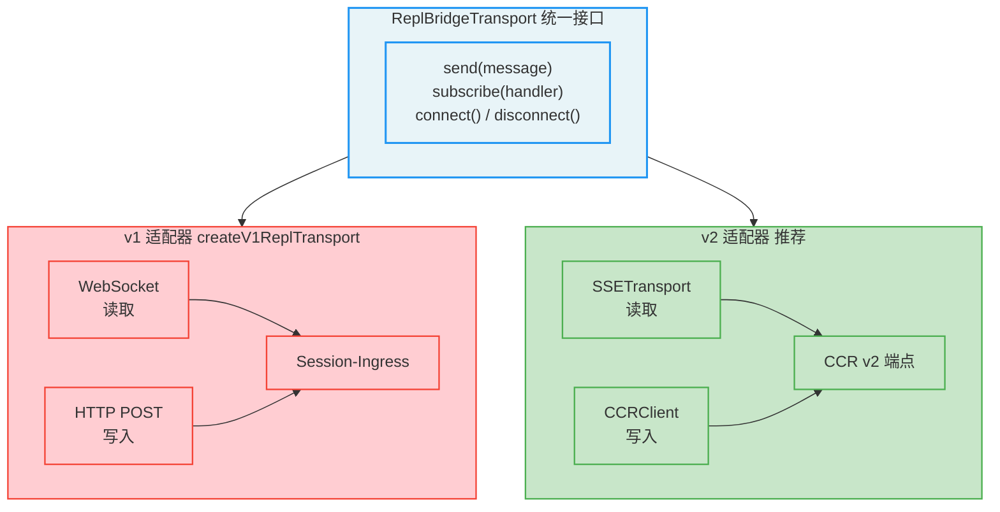
```mermaid
flowchart TD
    subgraph Interface["ReplBridgeTransport 统一接口"]
        API["send(message)\nsubscribe(handler)\nconnect() / disconnect()"]
    end

    subgraph V1["v1 适配器 createV1ReplTransport"]
        direction LR
        V1R["WebSocket\n读取"]
        V1W["HTTP POST\n写入"]
        V1Target["Session-Ingress"]
    end

    subgraph V2["v2 适配器 推荐"]
        direction LR
        V2R["SSETransport\n读取"]
        V2W["CCRClient\n写入"]
        V2Target["CCR v2 端点"]
    end

    Interface --> V1
    Interface --> V2
    V1R --> V1Target
    V1W --> V1Target
    V2R --> V2Target
    V2W --> V2Target

    classDef iface fill:#e8f4f8,stroke:#2196F3,stroke-width:2px,color:#333
    classDef v1 fill:#ffcdd2,stroke:#f44336,stroke-width:1.5px,color:#333
    classDef v2 fill:#c8e6c9,stroke:#4CAF50,stroke-width:1.5px,color:#333
    class Interface,API iface
    class V1,V1R,V1W,V1Target v1
    class V2,V2R,V2W,V2Target v2
```

**v1 适配器**（`createV1ReplTransport`）

v1 适配器封装了 `HybridTransport`，使用 WebSocket 读取 + HTTP POST 写入到 Session-Ingress 服务。这种混合模式的设计初衷是利用两种协议各自的优势：WebSocket 适合服务器推送（低延迟、实时性），HTTP POST 适合客户端发送（简单可靠、无需维护长连接）。

v1 适配器是历史遗留方案，虽然仍在运行，但已不推荐新功能基于它开发。

**v2 适配器**

v2 适配器封装了 SSETransport（读取）+ CCRClient（写入到 CCR v2 端点），代表了 Bridge 传输层的发展方向。v2 的关键改进包括：

**1. SSE 序列号延续（Sequence Number Continuation）**

这是 v2 最精妙的设计。在传统的 SSE 实现中，如果客户端断开连接后重新连接，服务器通常需要重放从连接开始以来的所有事件（因为客户端不知道自己错过了什么）。对于长时间运行的会话，这可能导致"消息风暴"——数千条历史消息被一次性重放，消耗大量带宽和处理时间。

v2 的解决方案是：在传输切换时携带上一个流的序列号高位标记。当客户端重新连接时，它告诉服务器"我已经处理到了序列号 N，请从 N+1 开始发送"。这样服务器只需发送增量消息，而非完整历史。

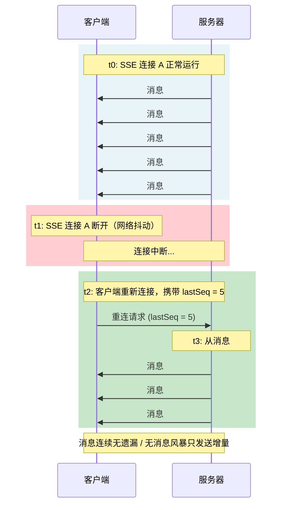
```mermaid
sequenceDiagram
    participant Client as 客户端
    participant Server as 服务器

    rect rgb(232, 244, 248)
        Note over Client,Server: t0: SSE 连接 A 正常运行
        Server->>Client: 消息 #1
        Server->>Client: 消息 #2
        Server->>Client: 消息 #3
        Server->>Client: 消息 #4
        Server->>Client: 消息 #5
    end

    rect rgb(255, 205, 210)
        Note over Client: t1: SSE 连接 A 断开（网络抖动）
        Note over Client,Server: 连接中断...
    end

    rect rgb(200, 230, 201)
        Note over Client,Server: t2: 客户端重新连接，携带 lastSeq = 5
        Client->>Server: 重连请求 (lastSeq = 5)
        Note over Server: t3: 从消息 #6 开始发送（而非从 #1 重放）
        Server->>Client: 消息 #6
        Server->>Client: 消息 #7
        Server->>Client: 消息 #8
    end

    Note over Client,Server: 消息连续无遗漏 / 无消息风暴只发送增量
```

**2. Epoch 管理和心跳**

CCRClient 定期发送心跳维持租约。Epoch 是一个单调递增的逻辑时钟，每次传输切换时递增。通过 Epoch，系统能够区分"旧连接的延迟消息"和"新连接的新消息"，避免处理过期的消息。

心跳机制确保连接的活性检测——如果心跳超时，系统会认为连接已断开，触发重连流程。这与 12.1.4 节中描述的指数退避重试机制配合使用。

**3. 多会话安全的认证**

v2 通过闭包提供每实例认证，而非使用全局环境变量。这个改进解决了一个微妙但重要的并发问题：在多会话场景下，如果多个 Bridge 传输实例共享同一个环境变量中的认证 Token，当一个实例刷新 Token 时，其他实例可能读到不一致的状态。

闭包方案让每个传输实例拥有自己的认证上下文，互不干扰：

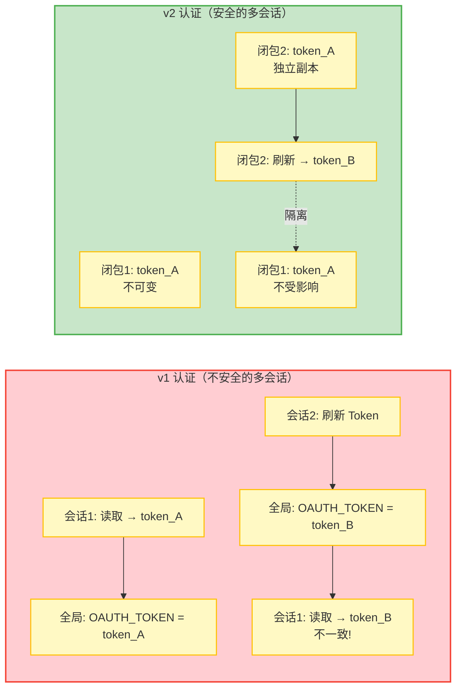
```mermaid
flowchart LR
    subgraph v1Unsafe["v1 认证（不安全的多会话）"]
        direction TB
        G1["全局: OAUTH_TOKEN = token_A"]
        S1a["会话1: 读取 → token_A"]
        S2a["会话2: 刷新 Token"]
        G2["全局: OAUTH_TOKEN = token_B"]
        S1b["会话1: 读取 → token_B\n不一致!"]
        S1a --> G1
        S2a --> G2
        G2 --> S1b
    end

    subgraph v2Safe["v2 认证（安全的多会话）"]
        direction TB
        C1["闭包1: token_A\n不可变"]
        C2a["闭包2: token_A\n独立副本"]
        C2b["闭包2: 刷新 → token_B"]
        C1c["闭包1: token_A\n不受影响"]
        C2a --> C2b
        C2b -.->|"隔离"| C1c
    end

    classDef unsafe fill:#ffcdd2,stroke:#f44336,stroke-width:2px,color:#333
    classDef safe fill:#c8e6c9,stroke:#4CAF50,stroke-width:2px,color:#333
    classDef token fill:#fff9c4,stroke:#FFC107,stroke-width:1.5px,color:#333
    class v1Unsafe unsafe
    class v2Safe safe
    class G1,G2,C1,C2a,C2b,C1c token
    class S1a,S2a,S1b token
```

> **架构思考：** v1 到 v2 的演进是一个典型的"技术债清理"过程。v1 的混合模式（WebSocket + HTTP POST）在初期快速满足了需求，但随着会话数量增长和移动端集成的加入，其局限性逐渐显现。v2 通过引入序列号延续和闭包认证，从根本上解决了这些问题，但保留了相同的接口抽象，使得上层代码无需修改。

### 12.4.5 VS Code 和 JetBrains 扩展集成

IDE 扩展通过 `sse-ide` 和 `ws-ide` 类型的 MCP 服务器与 Claude CLI 通信。这些是内部专用类型，在标准 SSE/WebSocket 协议基础上增加了 IDE 标识信息（如 IDE 名称、是否在 Windows 上运行）。这种"协议变体"的设计让 Bridge 系统能够根据客户端类型提供差异化的服务。

**集成流程详解**

IDE 集成的完整流程涉及多个组件的协作：

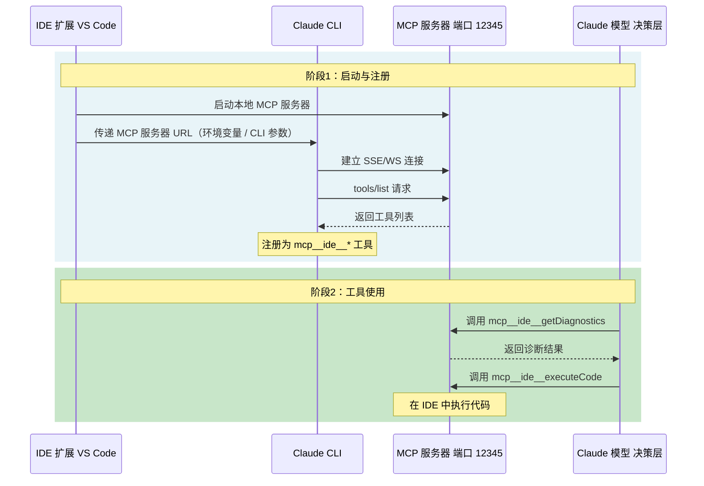
```mermaid
sequenceDiagram
    participant IDE as IDE 扩展 VS Code
    participant CLI as Claude CLI
    participant MCP as MCP 服务器 端口 12345
    participant Model as Claude 模型 决策层

    rect rgb(232, 244, 248)
        Note over IDE,Model: 阶段1：启动与注册
        IDE->>MCP: 启动本地 MCP 服务器
        IDE->>CLI: 传递 MCP 服务器 URL（环境变量 / CLI 参数）
        CLI->>MCP: 建立 SSE/WS 连接
        CLI->>MCP: tools/list 请求
        MCP-->>CLI: 返回工具列表
        Note over CLI: 注册为 mcp__ide__* 工具
    end

    rect rgb(200, 230, 201)
        Note over IDE,Model: 阶段2：工具使用
        Model->>MCP: 调用 mcp__ide__getDiagnostics
        MCP-->>Model: 返回诊断结果
        Model->>MCP: 调用 mcp__ide__executeCode
        Note over MCP: 在 IDE 中执行代码
    end
```

**五个步骤的详细说明：**

1. **IDE 扩展启动 MCP 服务器**：当用户在 VS Code 中打开 Claude Code 扩展时，扩展会在本地启动一个 MCP 服务器进程，监听一个随机分配的本地端口。

2. **URL 传递**：IDE 扩展将服务器 URL 通过环境变量（如 `CLAUDE_CODE_IDE_MCP_URL`）或 CLI 参数传递给 Claude Code。这个 URL 通常形如 `http://127.0.0.1:12345/mcp`。

3. **建立连接**：Claude Code 启动后，读取 IDE 传递的 URL，使用 `sse-ide` 或 `ws-ide` 协议建立连接。连接建立后，Claude Code 就成为了这个 MCP 服务器的客户端。

4. **工具发现**：Claude Code 通过标准的 `tools/list` 请求获取 IDE 扩展提供的工具列表。由于 IDE 类型的服务器受到工具白名单限制，只有 `executeCode` 和 `getDiagnostics` 被注册。

5. **工具使用**：Claude 模型在处理用户请求时，可以调用这些 IDE 工具来获取实时诊断信息或在 IDE 上下文中执行代码。例如，当模型建议修复一个 TypeScript 类型错误时，可以通过 `executeCode` 在 IDE 中直接应用修复，然后通过 `getDiagnostics` 验证错误是否已消失。

**IDE 集成的实际价值**

IDE 集成的价值远超"在终端里使用 Claude Code"。通过 MCP 协议，Claude Code 获得了对 IDE 环境的"感知能力"：

- **实时诊断**：`getDiagnostics` 让 Claude Code 能看到 IDE 中实时的编译错误、类型错误和 lint 警告，而不需要用户手动复制粘贴错误信息。
- **上下文执行**：`executeCode` 让 Claude Code 的代码修复能在 IDE 的完整上下文中执行（包括项目的 TypeScript 配置、Node.js 版本、环境变量等），而不是在隔离的终端环境中。

> **与第8章钩子系统的关联：** IDE 集成的 MCP 工具调用同样会触发钩子系统。例如，当 Claude Code 通过 `mcp__ide__executeCode` 在 IDE 中执行代码时，PreToolUse 钩子可以拦截这个调用，检查要执行的代码是否安全。这为 IDE 集成增加了一层额外的安全保障。

### 12.4.6 Bridge 权限门控

Bridge（远程控制）功能不是对所有用户开放的——它需要 claude.ai 订阅，并通过多层门控。这种"层层设卡"的设计确保了远程控制功能只在受控的环境中使用。

**为什么需要多层门控？**

远程控制功能允许外部实体（IDE、claude.ai 网页端）控制 CLI 会话——切换模型、调整参数、甚至中断执行。这种能力如果被滥用（例如，恶意网站通过 XSS 攻击控制用户的 CLI），后果将是灾难性的。多层门控的设计遵循"纵深防御"原则——即使某一层的检查被绕过，其他层仍然提供保护。

完整的诊断函数 `getBridgeDisabledReason` 依次检查四层条件：

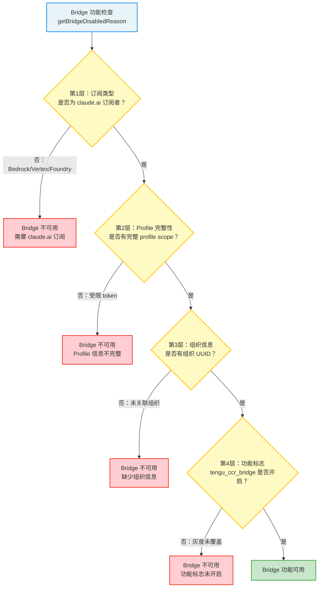
```mermaid
flowchart TD
    Start["Bridge 功能检查\ngetBridgeDisabledReason"] --> L1{"第1层：订阅类型\n是否为 claude.ai 订阅者？"}
    L1 -->|"否：Bedrock/Vertex/Foundry"| Disabled1["Bridge 不可用\n需要 claude.ai 订阅"]
    L1 -->|"是"| L2{"第2层：Profile 完整性\n是否有完整 profile scope？"}
    L2 -->|"否：受限 token"| Disabled2["Bridge 不可用\nProfile 信息不完整"]
    L2 -->|"是"| L3{"第3层：组织信息\n是否有组织 UUID？"}
    L3 -->|"否：未关联组织"| Disabled3["Bridge 不可用\n缺少组织信息"]
    L3 -->|"是"| L4{"第4层：功能标志\ntengu_ccr_bridge 是否开启？"}
    L4 -->|"否：灰度未覆盖"| Disabled4["Bridge 不可用\n功能标志未开启"]
    L4 -->|"是"| Enabled["Bridge 功能可用"]

    classDef check fill:#fff9c4,stroke:#FFC107,stroke-width:2px,color:#333
    classDef disabled fill:#ffcdd2,stroke:#f44336,stroke-width:2px,color:#333
    classDef enabled fill:#c8e6c9,stroke:#4CAF50,stroke-width:2px,color:#333
    classDef start fill:#e8f4f8,stroke:#2196F3,stroke-width:2px,color:#333
    class L1,L2,L3,L4 check
    class Disabled1,Disabled2,Disabled3,Disabled4 disabled
    class Enabled enabled
    class Start start
```

**API 认证与 Token 管理**

API 客户端的认证使用 OAuth Bearer Token，并支持 401 时的自动 Token 刷新和重试。这个机制处理了一个常见的分布式系统问题：Token 过期。

```mermaid
flowchart TD
    Step1["1. 携带当前 Bearer Token\n发送 API 请求"] --> Step2{"2. 收到响应"}
    Step2 -->|"200 OK"| Success["请求成功"]
    Step2 -->|"401 Unauthorized"| Step3["3. 使用 Refresh Token\n获取新的 Bearer Token"]
    Step3 --> Step4["4. 使用新 Token\n重试原始请求"]
    Step4 --> Step5{"5. 重试结果"}
    Step5 -->|"200 OK"| Success
    Step5 -->|"401 Unauthorized"| Fail["Bridge 功能不可用\n通知用户"]

    classDef step fill:#e8f4f8,stroke:#2196F3,stroke-width:1.5px,color:#333
    classDef decision fill:#fff9c4,stroke:#FFC107,stroke-width:2px,color:#333
    classDef ok fill:#c8e6c9,stroke:#4CAF50,stroke-width:2px,color:#333
    classDef err fill:#ffcdd2,stroke:#f44336,stroke-width:2px,color:#333
    class Step1,Step3,Step4 step
    class Step2,Step5 decision
    class Success ok
    class Fail err
```

这种"自动刷新+重试"的模式是 OAuth 2.0 的标准实践。它的好处是用户无感知——Token 过期不会中断正在进行的 Bridge 会话，系统会在后台自动处理。

> **最佳实践：** 如果你需要在企业环境中使用 Bridge 功能，确保：(1) 团队成员使用 claude.ai 订阅账号登录，而非 API Key；(2) 组织 UUID 已正确配置；(3) 网络防火墙允许与 claude.ai 后端的 SSE/CCR 通信。

---

## 实战练习

### 练习 1：配置一个 stdio 类型的 MCP 服务器

在项目根目录创建 `.mcp.json`：

```json
{
  "mcpServers": {
    "filesystem": {
      "type": "stdio",
      "command": "npx",
      "args": ["-y", "@modelcontextprotocol/server-filesystem", "/tmp"],
      "env": {}
    }
  }
}
```

启动 Claude Code 后，验证工具是否加载：
- 观察启动日志中的 MCP 连接状态
- 尝试使用 `mcp__filesystem__*` 前缀的工具

**进阶挑战：**
- 修改 `.mcp.json`，为文件系统服务器添加自定义环境变量（如限制只读模式）
- 在 `.claude/settings.local.json` 中配置权限规则，自动允许 `mcp__filesystem__read_file` 但保留 `mcp__filesystem__write_file` 的确认提示
- 测试在启动后禁用文件系统服务器，观察工具列表的变化

### 练习 2：理解工具名称解析

根据 `mcp__{server}__{tool}` 的命名规则，分析以下场景：
- 解析 `mcp__github__create_issue` 会得到什么结果？
- 构建 `mcp__my_server__read_file` 需要什么输入？
- 包含双下划线的工具名 `mcp__my__special__tool` 会如何解析？

**进阶挑战：**
- 如果同时配置了名为 `github` 和 `git_hub` 的两个服务器，它们提供同名工具时，如何通过权限配置分别控制？
- 在 SDK 模式下（设置 `CLAUDE_AGENT_SDK_MCP_NO_PREFIX`），如果一个 MCP 工具名为 `Read`，它会如何与内置的 Read 工具交互？

### 练习 3：配置企业级 MCP 安全策略

在企业管理配置中设置白名单和黑名单：

```json
{
  "allowedMcpServers": [
    { "serverName": "approved-server" },
    { "serverCommand": ["npx", "-y", "@modelcontextprotocol/server-filesystem"] },
    { "serverUrl": "https://mcp.company.com/*" }
  ],
  "deniedMcpServers": [
    { "serverName": "dangerous-server" }
  ]
}
```

测试不同配置的服务器是否能被正确允许或阻止。

**进阶挑战：**
- 设计一个安全策略，只允许公司内部的 MCP 服务器（`*.company.com`），同时阻止所有外部公共服务器
- 考虑如何处理"同一服务器在不同作用域中被配置"的情况——当 enterprise 配置允许了某个服务器，但 local 配置中该服务器在黑名单中，结果会怎样？

### 练习 4：多服务器集成实战

配置一个包含多个 MCP 服务器的复杂环境，模拟真实的开发工作流：

```json
{
  "mcpServers": {
    "github": {
      "type": "stdio",
      "command": "npx",
      "args": ["-y", "@modelcontextprotocol/server-github"],
      "env": { "GITHUB_PERSONAL_ACCESS_TOKEN": "ghp_xxxx" }
    },
    "database": {
      "type": "sse",
      "url": "https://internal-mcp.company.com/database",
      "headers": { "Authorization": "Bearer internal-token" }
    },
    "docs": {
      "type": "stdio",
      "command": "npx",
      "args": ["-y", "@modelcontextprotocol/server-brave-search"],
      "env": { "BRAVE_API_KEY": "BSA_xxxx" }
    }
  }
}
```

**分析任务：**
- 每个服务器注册了哪些工具？工具的完整名称是什么？
- 如果 GitHub 服务器连接失败，其他服务器会受到影响吗？
- 如何为每个服务器配置不同级别的权限（如 GitHub 完全允许，数据库只允许只读操作）？

### 练习 5：理解 Bridge 通信流程

分析以下场景中的 Bridge 通信行为：

**场景 A**：用户在 VS Code 中通过 Claude Code 扩展发送消息"修复所有 TypeScript 错误"
1. 消息如何从 VS Code 到达 Claude CLI？
2. Claude Code 如何调用 `getDiagnostics` 获取错误信息？
3. 修复代码后如何通过 `executeCode` 在 IDE 中应用？

**场景 B**：用户在 claude.ai 网页端远程控制一个正在运行的 CLI 会话
1. 网页端发出 `set_model` 请求切换到 Opus 模型，CLI 如何处理？
2. 如果 CLI 当前正在执行一个长时间的工具调用，`interrupt` 命令如何中断它？
3. 如果用户没有 claude.ai 订阅，会在哪一层门控被拒绝？

---

## 关键要点

1. **MCP 的设计使命**：MCP 是 AI 世界的"USB-C 接口"，通过标准化协议解决工具集成的碎片化问题。其三大设计原则——协议即契约、传输无关性、安全边界内嵌——贯穿了 Claude Code 的整个 MCP 实现。

2. **八种传输协议的分层设计**：从零开销的 SDK（进程内调用）到最低延迟的 stdio（进程间管道），从灵活部署的 SSE/HTTP（远程服务）到全双工的 WebSocket（实时通信），每种协议针对特定的部署场景和网络拓扑进行了优化。优先选择 stdio，只在必要时使用远程协议。

3. **三段式命名的安全价值**：`mcp__{server}__{tool}` 命名规则不仅解决了工具名称冲突问题，更重要的是在权限检查时提供了独立的命名空间，防止 MCP 工具与内置工具之间的权限混淆。SDK 模式下的前缀跳过是一种高级用法，允许 MCP 工具覆盖内置工具。

4. **深度防御的安全架构**：四层权限模型——企业策略（denylist > allowlist）、IDE 工具白名单、用户权限配置、运行时确认——确保即使某一层的检查被绕过，其他层仍然提供保护。这是"默认不信任"安全原则的完整体现。

5. **签名去重的实用智慧**：通过 `stdio:JSON.stringify([cmd,...args])` 和 `url:originalUrl` 签名机制，系统确保基于"实际效果"而非"表面配置"进行去重。去重优先级（手动 > 插件 > 连接器）保证用户的显式配置始终优先。

6. **Bridge 双向通信的复杂性管理**：30+ 个模块构成的 Bridge 系统通过统一的 `ReplBridgeTransport` 接口抽象 v1/v2 传输差异，通过三重消息过滤（权限响应 > 控制请求 > 用户消息）处理入站消息，通过 `BoundedUUIDSet` 环形缓冲区实现高效去重。

7. **SSE 序列号延续是关键创新**：v2 传输在切换时携带序列号高位标记，避免服务器重放完整会话历史。这个看似微小的改进，解决了长时间运行会话中传输切换导致的"消息风暴"问题。

8. **四层权限门控确保远程控制安全**：订阅类型 > Profile 完整性 > 组织信息 > 功能标志的四层检查，配合 OAuth Token 自动刷新机制，在保证安全的同时尽量减少对用户体验的影响。

9. **IDE 集成的感知能力**：通过 `sse-ide`/`ws-ide` 协议和 `executeCode`/`getDiagnostics` 两个白名单工具，Claude Code 获得了对 IDE 环境的实时感知能力——从被动接收用户输入，变为主动获取诊断信息和在 IDE 上下文中执行操作。

10. **与其他系统的协作关系**：MCP 工具完全融入了 Claude Code 的内部系统——经过工具系统（第3章）的注册和调度、权限管线（第4章）的四阶段检查、钩子系统（第8章）的生命周期拦截。MCP 不是独立的子系统，而是 Claude Code 工具生态的自然延伸。

---

> **下一章预告：** 第13章将深入 Claude Code 的流式架构与性能优化，探讨如何在保证实时响应的同时处理大量数据流——其中 MCP 工具的流式输出是一个重要的优化场景。
