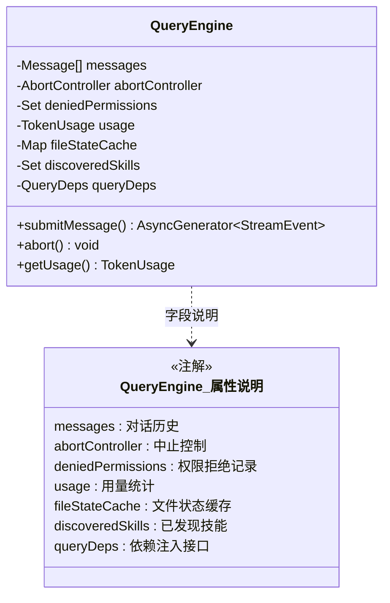
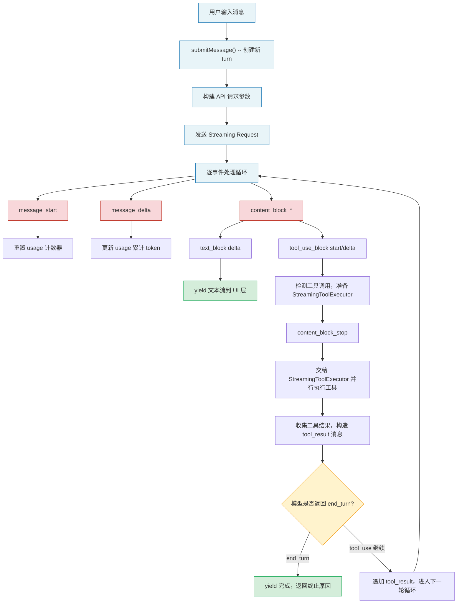
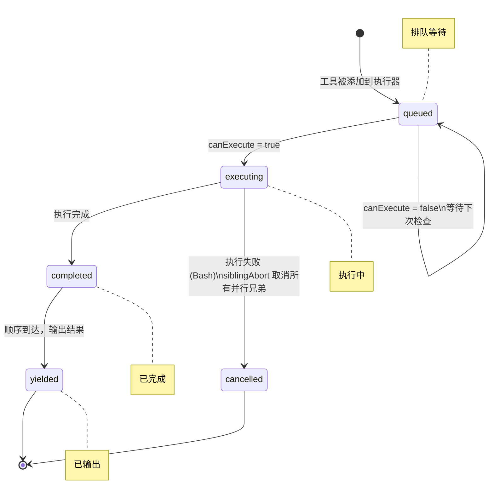
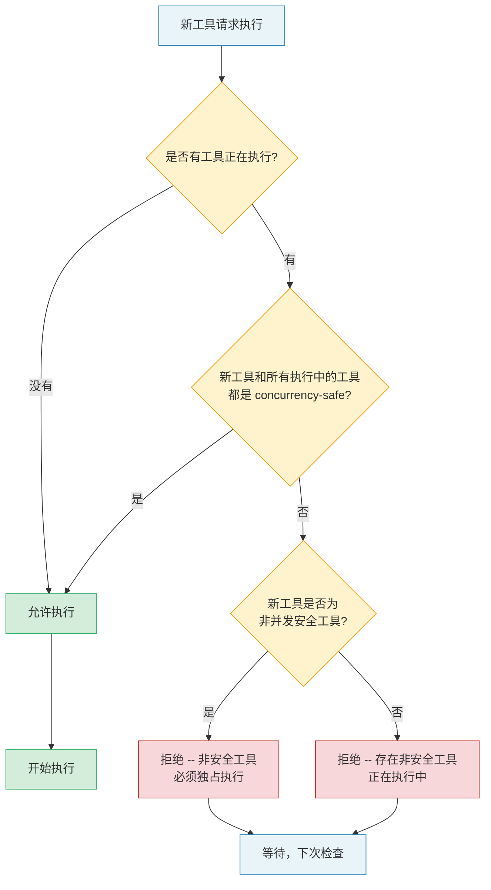
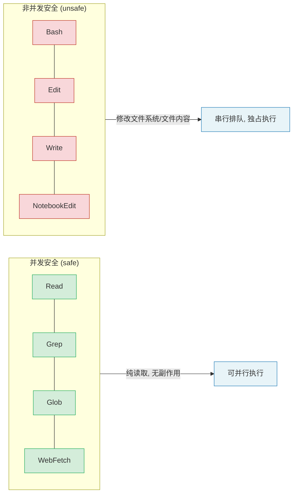
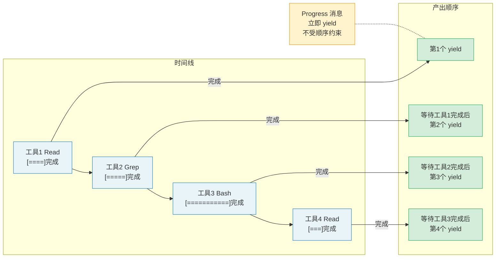
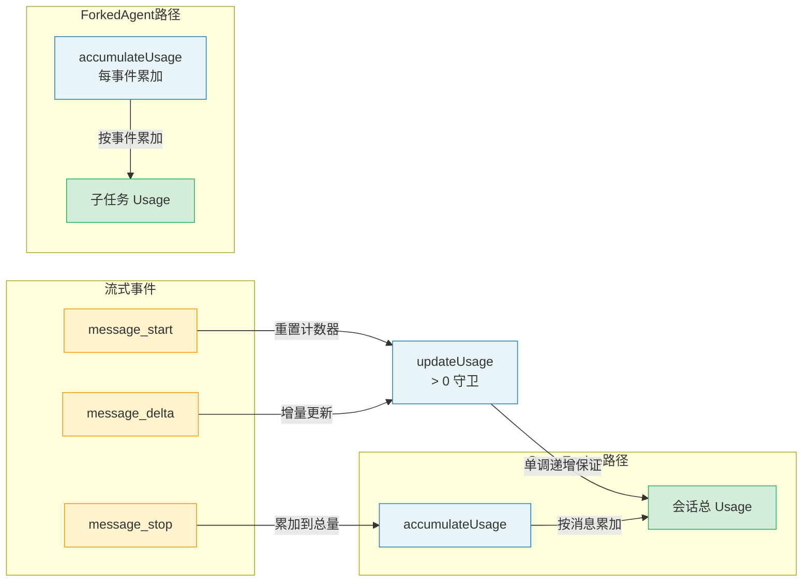
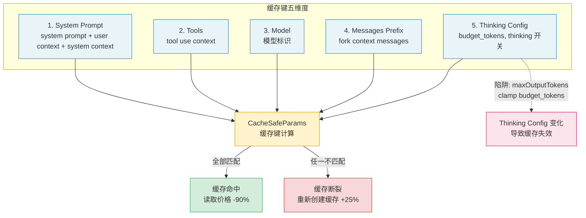
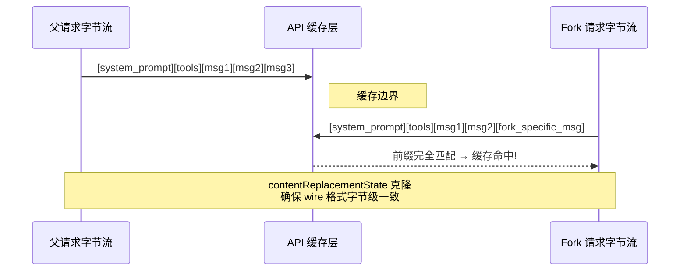

# 第13章：流式架构与性能优化

> "Premature optimization is the root of all evil -- but latency is the root of all user complaints."
> -- adapted from Donald Knuth

**学习目标：** 掌握 Claude Code 的流式处理架构和成本控制策略，理解 QueryEngine 如何通过流式 API 实现实时交互，StreamingToolExecutor 如何在并发与安全之间取得平衡，以及系统如何通过并行预取、延迟加载和提示缓存来优化启动性能与运行成本。通过本章的学习，你将建立一套完整的性能优化思维框架，能够识别、度量和解决 Agent 系统中的性能瓶颈。

---

## 13.1 流式 API 交互

### 13.1.1 QueryEngine：查询生命周期的管理者

Claude Code 的核心交互模型是流式的。`QueryEngine` 是查询生命周期和会话状态的拥有者，它将原本散布在查询函数中的核心逻辑抽取为独立类，同时服务于 headless/SDK 路径和 REPL 交互路径。

一个会话对应一个 `QueryEngine` 实例。每次用户发送消息，通过 `submitMessage()` 启动一个新的 turn，状态（messages、file cache、usage 等）在 turn 之间持久保持。`QueryEngine` 内部维护了消息列表、中止控制器、权限拒绝记录、用量统计、文件状态缓存、已发现的技能名称等核心状态。

**为什么不直接使用函数式 API 而要引入类？** 答案在于状态管理的复杂性。如果把会话状态作为参数在函数之间传递，调用链会变得极为脆弱 -- 任何新增的状态字段都需要修改所有函数签名。类将状态封装为实例属性，新增状态只需在构造函数中初始化，不破坏现有接口。这同时也使得状态的生命周期与实例绑定：销毁实例即销毁状态，避免了全局状态的内存泄漏风险。



QueryEngine 的设计体现了 "单一所有权" 原则：会话状态有且只有一个拥有者。这在并发场景中尤为重要 -- 如果多个组件同时修改消息列表，可能导致消息顺序错乱或重复处理。类实例化为状态提供了一个天然的互斥边界。

> **交叉引用：** QueryEngine 的核心查询循环在第 2 章"对话循环 -- Agent 的心跳"中有详细分析。本章侧重于其流式特性和性能优化机制。

### 13.1.2 Token 流的实时接收

`submitMessage` 是一个 `AsyncGenerator`，这意味着调用者可以实时消费流式产生的消息，而不需要等待整个查询完成。

在 QueryEngine 内部的查询循环中，流式事件被逐条处理。系统根据不同的事件类型执行不同的操作：`message_start` 事件重置当前消息的 usage 计数器；`message_delta` 事件更新 usage 并捕获 stop_reason；`message_stop` 事件将当前消息的 usage 累加到总量中。

这种分阶段的设计使得系统可以在不等待完整响应的情况下，实时处理工具调用和 progress 消息。

**流式处理的真正价值在哪里？** 我们用一个对比来理解。假设模型生成一个需要调用三个工具的响应，总耗时 5 秒：

| 策略 | 模型输出工具1 (1s) | 模型输出工具2 (2s) | 模型输出工具3 (2s) | 总耗时 |
|------|-------------------|-------------------|-------------------|--------|
| 非流式（等待全部） | 等待... | 等待... | 执行工具1, 2, 3 | 5s + 工具执行 |
| 流式（流到即执行） | 执行工具1 | 执行工具2 | 执行工具3 | 5s (并行) |

在流式模式下，工具 1 在第 1 秒就开始执行，到第 5 秒时，三个工具可能都已执行完毕。非流式模式则需要先等 5 秒接收完整响应，再串行或并行执行所有工具。对于需要快速迭代的开发者而言，这种差异在体感上就是"即时响应"与"等待加载"的天壤之别。

### 13.1.3 工具调用块的即时检测

在流式模式下，当 API 返回 `tool_use` 类型的 content block 时，系统不需要等待整个响应完成就可以开始处理。这意味着模型一边生成工具调用参数，系统就可以一边解析并准备执行，极大缩短了从"模型决定调用工具"到"工具开始执行"之间的延迟。

这种即时检测的实现依赖于流式事件的 `content_block_start` 和 `content_block_delta` 事件。当系统收到 `content_block_start` 且 type 为 `tool_use` 时，它立即知道一个工具调用即将到来，可以预先查找工具定义、准备权限检查上下文。随后的 `content_block_delta` 事件逐步构建工具的 JSON 输入参数，通过增量 JSON 解析器实现边接收边验证。

**增量 JSON 解析的挑战。** 工具参数是 JSON 格式的，但流式传输意味着 JSON 是逐字符到达的。传统的 `JSON.parse()` 需要完整字符串才能工作。Claude Code 的做法是维护一个累积缓冲区，每次 delta 到达时追加到缓冲区，然后尝试解析。由于 JSON 的结构是已知的（通过 inputSchema 定义），解析器可以对不完整的 JSON 做出合理的"预判" -- 比如当缓冲区内容为 `{"path": "/src/ind` 时，系统可以预判这是一个文件路径参数，提前开始文件系统预热（如触发操作系统级别的文件缓存预读）。

> **反模式警告：** 不要在流式处理中对 delta 事件做重度计算。每个 delta 事件可能只包含一个或几个 token，如果解析逻辑本身的开销超过了它节省的时间，就得不偿失了。正确的做法是轻量级的缓冲累积，只在关键的"边界事件"（如 `content_block_stop`）上触发实质性处理。

### 13.1.4 完整的流式数据流全景图

让我们把流式 API 的交互过程从用户输入到最终输出串联成一张完整的数据流图：



这个数据流的关键洞察是：**流式处理不是一种优化，而是一种架构选择。** 它决定了系统的每一个组件都必须按照"增量、可中断、可组合"的原则设计。从这个意义上说，流式架构是整个 Agent Harness 的基石。

---

## 13.2 StreamingToolExecutor 的并发控制

### 13.2.1 设计哲学：流到即执行

`StreamingToolExecutor` 是 Claude Code 工具执行层的核心。它的设计目标是让工具在流式到达时立即启动执行，而不是等待所有工具调用块全部到达后再统一处理。

这种"流到即执行"的理念可以用一个生活中的比喻来理解：想象一个厨房，厨师（模型）在口头下达一系列指令 -- "切洋葱"、"烧水"、"调酱汁"。传统做法是等厨师说完所有指令后才开始动手；而"流到即执行"是厨师说一句，帮厨就开始做一件。切洋葱和烧水可以同时进行（并发安全），但"把洋葱倒进锅里"必须等"切完洋葱"后才能做（串行依赖）。

每个被追踪的工具都有一个状态机，包含四种状态：`queued`（排队）、`executing`（执行中）、`completed`（已完成）和 `yielded`（已输出）。当新工具被添加到执行器时，它进入 `queued` 状态，随即触发队列处理逻辑。



### 13.2.2 并发安全：并行与串行的抉择

并发控制的核心逻辑在 `canExecuteTool` 方法中，其规则清晰而严谨：



- **没有工具在执行时**，任何工具都可以启动。
- **有工具在执行时**，只有当新工具和所有正在执行的工具都是 concurrency-safe 的情况下，才允许并行。
- **非并发安全工具**必须独占执行，其他任何工具都不能与之并行。

这意味着 Read、Grep、Glob 等只读工具可以同时并行执行，而 Bash、Edit、Write 等有副作用的工具则需要串行排队。

**为什么不在工具级别做更细粒度的依赖分析？** 这是一个有意的简化决策。理论上，我们可以分析两个 Bash 命令之间是否存在数据依赖（例如 `mkdir foo && echo bar > foo/file.txt` 有依赖，而 `echo hello` 和 `echo world` 无依赖）。但这种分析需要理解 shell 语义，成本高且容易出错。Claude Code 选择了保守但可靠的策略：Bash 天然不安全，宁可多等一秒，也不冒险并行执行可能冲突的命令。

并发安全的分类遵循一个简洁的矩阵：



> **最佳实践：** 在设计自定义工具时，务必正确设置 `isConcurrencySafe` 标记。一个常见的错误是将只读取数据库的工具标记为 unsafe，导致不必要的串行等待。反过来，将实际会修改状态的工具标记为 safe 则更加危险 -- 它会导致数据竞争。原则是：**当你不确定时，选择 safe = false（fail-closed）。**

### 13.2.3 结果缓冲与顺序输出

虽然工具可以并行执行，但结果的输出必须保持顺序。`getCompletedResults()` 方法通过 `yielded` 状态标记保证这一点：已完成的工具结果按添加顺序依次输出，如果遇到一个非并发安全工具仍在执行中，则后续工具的结果即使已就绪也不会输出。Progress 消息是一个例外 -- 它们会被立即 yield，不受顺序约束，确保用户能实时看到工具执行的进度反馈。

**为什么需要严格保持顺序？** 这是因为模型的推理依赖于工具结果的顺序。如果工具结果乱序返回给模型，模型可能会误解结果的对应关系。例如，模型先调用了 Read 读取文件 A，再调用 Read 读取文件 B。如果 B 的结果先于 A 到达，模型可能将 B 的内容误认为是 A 的。顺序保证使得模型对世界的认知保持一致。

这种设计可以用"机场行李传送带"来类比：行李（工具结果）可能以不同的速度处理，但乘客（模型）看到它们的顺序与托运顺序一致。早到的行李在后台等待，直到排在它前面的行李都到齐了才一起出现在传送带上。



### 13.2.4 兄弟工具错误级联

当 Bash 工具执行失败时，StreamingToolExecutor 会触发级联取消机制：标记自身错误状态，并通过 `siblingAbortController` 中止所有并行的兄弟工具。

只有 Bash 工具的错误会触发级联，因为 Bash 命令之间往往存在隐式依赖链（如 `mkdir` 失败后，后续命令无意义）。Read、WebFetch 等独立工具的失败不会影响其他并行工具。

**级联取消的设计考量。** 为什么不让所有工具的错误都触发级联？考虑这个场景：模型同时调用了 Read 读取三个不相关的文件。如果第一个文件不存在导致 Read 报错，我们不应该取消另外两个读取 -- 它们的结果对模型来说同样有价值。Bash 的特殊之处在于，模型通常在一个 turn 中调用的多个 Bash 命令之间存在隐式依赖（比如先编译再测试），一个命令失败往往意味着后续命令的输入无效。

这种"选择性级联"策略是实用主义的体现：它不追求理论上的完美一致性，而是根据实际使用模式做合理假设。

> **交叉引用：** 工具的并发安全属性在第 3 章"工具系统 -- Agent 的双手"中的 `buildTool` 工厂函数中有详细定义，默认值为 `isConcurrencySafe: () => false`，遵循 fail-closed 原则。

---

## 13.3 启动性能优化

Claude Code 的启动时间直接影响用户体验。命令行工具的心理学研究表明，超过 2 秒的启动延迟会让用户觉得工具"笨重"，超过 5 秒则会触发"是不是卡了"的焦虑。系统通过三类优化策略来缩短从命令行输入到首次响应的延迟：并行预取、延迟加载和惰性模块评估。

这些优化不是独立的技巧，而是构成了一套系统化的启动优化方法论：**识别关键路径 -> 将非关键路径并行化 -> 将非必要模块延迟化 -> 消除死代码**。

### 13.3.1 并行预取：与模块评估赛跑

Claude Code 入口文件的顶部是并行预取策略的核心。系统在模块评估的最早阶段就启动了两个子进程，让它们与后续约 65ms 的 import 链并行执行。两个关键的预取操作是 MDM 配置读取和 Keychain 凭证预取。

**startMdmRawRead** 在 macOS 上并行 spawn 多个 `plutil` 进程读取 MDM plist 配置，在 Windows 上并行 spawn `reg query` 读取注册表。它使用 `existsSync` 快速跳过不存在的 plist 文件，避免无谓的 5ms spawn 开销。

**startKeychainPrefetch** 将两个 keychain 读取（OAuth tokens 约 32ms，legacy API key 约 33ms）从串行改为并行，并与 import 链并行执行。设计文档注释精确地说明了优化动机：串行成本约为 65ms，而在此处启动两个子进程可以让它们与入口文件约 65ms 的 imports 并行执行。

两个预取的结果在后续初始化阶段被 await，此时子进程大概率已完成，等待几乎为零。

让我们用具体的数字来计算并行预取的收益：

```mermaid
gantt
    title 启动性能：串行 vs 并行预取
    dateFormat X
    axisFormat %Lms

    section 优化前（串行）
    import 链 (65ms)           :a1, 0, 65
    MDM 读取 (30ms)            :a2, 65, 95
    Keychain #1 (32ms)         :a3, 95, 127
    Keychain #2 (33ms)         :a4, 127, 160

    section 优化后（并行预取）
    import 链 (65ms)           :b1, 0, 65
    MDM 读取 (30ms)            :b2, 0, 30
    Keychain #1 (32ms)         :b3, 0, 32
    Keychain #2 (33ms)         :b4, 0, 33
```



> 优化前总计：65 + 30 + 32 + 33 = **160ms**
> 优化后总计：max(65, 30, 32, 33) = **65ms**
> 收益：160ms -> 65ms，节省 **95ms (59%)**

95 毫秒的节省听起来不多，但在 CLI 工具的世界里，用户对"敲命令到看到输出"的延迟极为敏感。这种"与 import 链赛跑"的策略本质上是利用了 CPU 等待 I/O 时的空闲时间。

> **最佳实践：** 并行预取的适用条件是：(1) 预取操作是 I/O 密集型而非 CPU 密集型；(2) 结果不会立即被使用，而是在后续某个时刻才需要；(3) 预取失败不应该阻塞主流程。如果你的预取操作违反了任何一个条件，并行化反而会增加复杂性而没有收益。

### 13.3.2 延迟加载

QueryEngine 中的 `messageSelector` 使用 `require()` 实现真正的惰性加载，因为 MessageSelector 组件拉入了 React/ink 等重量级依赖，只在首次需要时才加载。

条件导入也是重要的延迟加载策略。coordinator mode 和 snip compaction 通过特性开关门控函数实现 dead code elimination。当特性开关关闭时，Bundler 可以完全消除这些代码路径及其依赖树，减少包体积和模块初始化时间。

延迟加载的关键决策是**画一条线：什么必须在启动时加载，什么可以等到用时再加载。** 这条线的画法遵循一个简单的原则：如果模块的加载时间超过 5ms 且不是启动后的前 3 秒内必需的，就应该延迟加载。5ms 是一个经验阈值 -- 低于这个阈值的模块，延迟加载的运行时检查开销可能抵消其收益。

延迟加载的三个层级及其适用场景：

```
+-------------------+----------------------------+---------------------------+
| 延迟层级          | 实现方式                    | 适用场景                  |
+-------------------+----------------------------+---------------------------+
| 条件导入          | feature flag + require()   | 可选功能模块              |
|                   |                            | (coordinator, snip)       |
+-------------------+----------------------------+---------------------------+
| 首次使用时加载    | getter + require()         | 重量级依赖                |
|                   |                            | (MessageSelector + React) |
+-------------------+----------------------------+---------------------------+
| 编译时消除        | bun:bundle feature()       | 未启用的功能              |
|                   |                            | (dead code elimination)   |
+-------------------+----------------------------+---------------------------+
```

### 13.3.3 惰性 Schema 评估

工具的 inputSchema/outputSchema 通过 `lazySchema` 实现延迟初始化，避免在模块加载阶段就执行 Zod schema 构建。配合 getter 访问模式，schema 只在首次被实际使用时才构建。

Zod schema 的构建成本常常被低估。一个包含嵌套对象、可选字段和描述文本的中等复杂度 schema，构建时间约为 0.1-0.3ms。如果 Claude Code 的六十多个工具都在启动时构建 schema，总开销为 6-18ms -- 这对 CLI 工具来说是不可接受的。

`lazySchema` 的实现利用了 JavaScript 的 getter 语义：首次访问时触发构建函数，构建结果被缓存到实例属性上，后续访问直接读取缓存，不再经过 getter。这是一个"一次触发，永久替换"的模式。

### 13.3.4 启动优化 Checklist

如果你正在构建自己的 CLI Agent 工具，以下 checklist 可以帮助你系统化地进行启动优化：

- [ ] **识别关键路径**：使用 `console.time` 或性能分析工具测量每个初始化步骤的耗时
- [ ] **并行化 I/O 操作**：文件读取、网络请求、进程 spawn 都应该与模块加载并行
- [ ] **延迟加载重量级依赖**：React、大型解析器、数据库驱动等应延迟到首次使用
- [ ] **消除未使用代码**：通过 feature flag 和 tree-shaking 移除不需要的功能
- [ ] **惰性初始化重对象**：Zod schema、正则表达式、WASM 模块等应延迟构建
- [ ] **测量并迭代**：建立启动时间的 CI 基线，防止性能退化
- [ ] **关注 P95 而非平均值**：慢机器上的启动体验才是真实用户体验

---

## 13.4 令牌成本追踪

### 13.4.1 成本计算引擎

Claude Code 的成本追踪建立在两个核心函数之上：`updateUsage` 和 `accumulateUsage`。



**updateUsage** 处理单条流式事件的 usage 数据。由于 Anthropic API 的 `message_delta` 事件只返回增量字段，`updateUsage` 对每个字段使用 `> 0` 守卫来区分"未返回"和"真实为零"。这个守卫至关重要：如果 API 返回 `input_tokens: 0`（因为该请求使用了缓存），系统不会错误地将之前记录的真实值覆盖为零。

这个看似简单的守卫揭示了一个深刻的设计问题：**增量协议的语义歧义。** 当一个字段缺失或为零时，它到底意味着"这个量确实为零"还是"这个事件不包含这个量的信息"？如果不做区分，就会出现"缓存命中率 100%"导致"显示零输入 token"的荒谬结果。

`> 0` 守卫的本质是一个**单调递增保证**：usage 的各个字段只会增加，永远不会减少或被覆盖为更小的值。这确保了在任何时刻查询 usage，得到的都是截至当前的最大已知值。

> **反模式警告：** 不要在 `updateUsage` 中使用 `|| 0` 作为默认值。`|| 0` 会将 `0`、`undefined`、`null`、`""` 都视为 falsy，导致真正的零值被错误地替换。使用 `> 0` 守卫（或更严谨的 `!== undefined && val > 0`）才能正确区分"未返回"和"真实为零"。

### 13.4.2 accumulateUsage 累加模式

**accumulateUsage** 负责跨消息累加 usage。它的语义是简单的字段求和，将输入 token、缓存创建 token、缓存读取 token、输出 token 等各字段分别累加。

在 QueryEngine 中，这个累加发生在每个 `message_stop` 事件。在 forked agent 中则发生在每个 `message_delta` 事件。两种策略的区别在于粒度：QueryEngine 按消息累加，forked agent 按事件累加，但最终结果一致。

**为什么两种场景选择了不同的累加粒度？** QueryEngine 是长生命周期的会话管理者，它的 usage 追踪面向"这个会话总共消耗了多少"的场景，因此按消息累加足够精确。Forked agent 是短生命周期的子任务执行者，它可能在任何时候被中止，因此需要更频繁的累加以确保 usage 数据不丢失 -- 如果 fork 在 `message_stop` 之前就崩溃了，按消息累加会丢失整条消息的 usage。

### 13.4.3 Token 成本追踪的最佳实践

理解了 Claude Code 的成本追踪机制后，让我们总结一套在 Agent 系统中追踪 token 成本的最佳实践：

**1. 建立成本预算意识**

在每次会话开始时设定 token 预算上限。Claude Code 通过 `maxBudgetUsd` 参数实现这一点。当累计成本接近预算上限时，系统应该主动提醒用户而非默默耗尽预算。

```
+------------------+---------------------------+
| 预算级别         | 建议的动作                |
+------------------+---------------------------+
| < 50%            | 正常运行，无提示          |
| 50% - 80%        | 轻量级提醒（状态栏显示）  |
| 80% - 95%        | 明确警告（建议压缩上下文）|
| > 95%            | 强烈警告（限制新工具调用）|
| >= 100%          | 硬限制（停止对话循环）    |
+------------------+---------------------------+
```

**2. 分层追踪成本**

不要只追踪总量。将成本按以下维度分解，才能定位成本热点：

- **按轮次分解**：哪一轮对话消耗了最多的 token？通常是最初的上下文构建轮次。
- **按工具分解**：哪个工具的执行结果最大？大型文件读取是最常见的 token 黑洞。
- **按类型分解**：输入 token vs 输出 token 的比例如何？输出 token 通常贵 3-5 倍。
- **缓存效率**：缓存命中率是多少？低于 70% 通常意味着上下文管理出了问题。

**3. 成本异常检测**

设定正常的 token 消耗范围，当偏离正常范围时触发告警。例如：
- 单轮输入超过 100K token -- 可能是工具返回了过大的结果
- 单轮输出超过 10K token -- 模型可能在"冗余输出"
- 缓存命中率突然从 80% 降到 20% -- 可能是上下文被意外清空

**4. 实战案例：一个典型会话的成本分解**

假设一个开发者使用 Claude Code 实现一个新功能，会话包含 8 轮对话：

```
轮次    输入token    输出token    缓存读取    缓存创建    累计成本($)
 1       15,000      2,500         0          15,000     $0.12
 2       20,000      1,800        15,000      5,000     $0.22
 3       22,000      3,200        18,000      4,000     $0.35
 4       25,000      1,500        20,000      5,000     $0.44
 5       85,000      2,000        22,000     63,000     $0.89  <-- 工具返回大文件
 6       90,000      1,200        80,000     10,000     $1.15  <-- 缓存断裂!
 7       30,000      4,500        25,000      5,000     $1.32  <-- 压缩后恢复
 8       32,000      2,000        28,000      4,000     $1.48
```

注意第 5-6 轮：工具返回了一个巨大的文件（63K 缓存创建 token），导致后续轮次的输入暴涨。第 7 轮通过上下文压缩恢复了正常水平。这个案例说明：**工具输出的 token 成本往往比模型自身的输出更值得关注。**

---

## 13.5 缓存优化策略

### 13.5.1 提示缓存共享的三个维度

Anthropic API 的提示缓存（Prompt Caching）是降低成本和延迟的关键机制。缓存键由五个维度构成：system prompt、tools、model、messages prefix 和 thinking config。



`CacheSafeParams` 精确地封装了前四个维度：system prompt、user context、system context、tool use context 和 fork context messages。

第五个维度（thinking config）派生自 `toolUseContext.options.thinkingConfig`，但存在一个微妙的陷阱：如果 fork 设置了 `maxOutputTokens`，相关逻辑会据此 clamp `budget_tokens`，导致 thinking config 变化，进而使缓存失效。源码注释明确警告了这一点：如果 fork 使用了 cacheSafeParams 来共享父请求的提示缓存，不同的 budget_tokens 会使缓存失效，因为 thinking config 是缓存键的一部分。

缓存命中的经济影响是显著的。以 Claude 3.5 Sonnet 为例：

```
+-------------------+----------------+------------------+
| Token 类型        | 价格 (per 1M)  | 缓存命中价格     |
+-------------------+----------------+------------------+
| 输入 token        | $3.00          | --               |
| 缓存写入 token    | $3.75 (+25%)   | --               |
| 缓存读取 token    | --             | $0.30 (-90%)     |
| 输出 token        | $15.00         | $15.00 (不变)    |
+-------------------+----------------+------------------+
```

一个典型的 Agent 会话在 10 轮对话中可能发送 200K 输入 token。如果没有缓存，输入成本为 $0.60。如果缓存命中率为 80%，成本降至 $0.60 * 0.2 + $0.60 * 0.8 * 0.1 = $0.168，节省 72%。在大型项目中，这种节省可达数百美元/天。

### 13.5.2 Fork 模式的字节级一致性

`runForkedAgent` 在启动 fork 时，将 `forkContextMessages` 与 `promptMessages` 拼接为初始消息列表。这确保了 fork 请求与父请求共享完全相同的消息前缀，从而命中父请求的提示缓存。`contentReplacementState` 的克隆进一步保证了 wire 格式的一致性 -- 克隆使得 fork 对父消息中的 tool_use_ids 做出相同的替换决策，产生相同的 wire prefix，从而保证缓存命中。

字节级一致性是一个比"逻辑等价"严格得多的要求。两个 JSON 对象在逻辑上可以相等（相同的键值对），但在字节层面可能不同（键的顺序不同、空格数量不同、数字精度不同）。API 的缓存键是基于字节前缀的精确匹配，因此即使一个微小的格式差异也会导致缓存失效。

这就像两份文件内容完全相同但排版不同：对人来说信息一样，但对文件的哈希值来说完全不同。Claude Code 通过克隆 `contentReplacementState` 来确保 fork 产生的字节序列与父请求完全一致，这不是过度工程，而是缓存机制的必然要求。



### 13.5.3 缓存断裂检测

系统通过遥测事件记录每次 fork 的缓存命中率，计算方式为 `cache_read_input_tokens / (input_tokens + cache_creation_input_tokens + cache_read_input_tokens)`。

当 `cache_read_input_tokens` 远低于预期时，意味着 fork 没有命中父请求的缓存，可能是因为 cache-safe params 不一致。日志输出会显示完整的 token 分布：高 `cacheRead` + 低 `input` 表示缓存命中良好；高 `cacheCreate` 表示缓存断裂。

`skipCacheWrite` 参数是一个额外优化：对于 fire-and-forget 的 fork（如 speculation），不需要写入新的缓存条目，因为不会有后续请求读取这个 prefix。

### 13.5.4 缓存优化的实战策略

基于 Claude Code 的缓存设计，以下是缓存优化的实战策略集：

**策略一：最小化 System Prompt 变化**

System prompt 是缓存前缀的最开头部分，它的任何变化都会使整个缓存失效。常见导致 system prompt 变化的因素：

- 时间戳注入（每次请求都不同） -- **反模式**，应使用相对时间
- 动态工具列表顺序随机 -- 应排序后注入
- 用户偏好信息的格式微小差异 -- 应标准化格式

**策略二：消息顺序稳定性**

消息的添加顺序直接影响缓存前缀。如果两轮对话的消息历史除了最后一条外完全相同，那么共享的前缀可以命中缓存。但如果中间插入了一条"系统通知"消息，前缀就会断裂。

Claude Code 通过将附件消息（AttachmentMessage）放在特定位置来避免这个问题 -- 系统通知不会穿插在对话消息之间。

**策略三：缓存预热**

在首次请求中主动包含可能被后续请求共享的内容。例如，如果知道用户接下来会触发一个 fork agent（如 post-turn summary），可以在构建父请求时就考虑 fork 的 cache-safe params 需求，确保父请求的前缀可以被 fork 复用。

**策略四：监控缓存健康度**

建立缓存命中率的监控仪表盘。对于 Agent 系统，建议的基线指标：

```
+----------------------------+-----------+-----------------------------------+
| 指标                       | 健康范围  | 异常可能原因                      |
+----------------------------+-----------+-----------------------------------+
| 整体缓存命中率              | > 70%     | system prompt 频繁变化            |
| Fork 缓存命中率             | > 85%     | cache-safe params 不一致          |
| 缓存创建/读取比率           | < 0.3     | 大量新 prefix 被创建              |
| 单次请求缓存创建 token 数   | < 50K     | 上下文过大，压缩策略不足          |
+----------------------------+-----------+-----------------------------------+
```

> **交叉引用：** 上下文压缩策略直接影响缓存效率。第 7 章"上下文管理 -- Agent 的工作记忆"详细分析了四级压缩策略，每次压缩都会重写消息历史，可能导致缓存断裂。设计压缩策略时需要在"释放 token 空间"和"保持缓存连续性"之间取得平衡。

---

## 实战练习

### 练习 1：分析工具并发行为

在 Claude Code REPL 中执行一个同时触发多个工具调用的任务（例如"搜索所有 TypeScript 文件中包含 TODO 的行，同时查看 package.json 的内容"），观察哪些工具并行执行，哪些串行排队。结合 `StreamingToolExecutor` 的 `canExecuteTool` 逻辑，解释你观察到的行为。

**延伸思考：** 尝试构造一个更复杂的场景 -- 同时触发 2 个 Grep + 1 个 Bash + 1 个 Read。观察 Bash 工具的执行是否阻塞了后续 Read 工具的启动。记录每个工具的开始时间和结束时间，画出执行时序图。

### 练习 2：追踪缓存命中率

使用 `CLAUDE_CODE_DEBUG=1` 运行 Claude Code，执行一个涉及 session memory 或 post-turn summary 的任务。检查日志中的 `tengu_fork_agent_query` 输出，计算缓存命中率，并分析哪些因素可能影响缓存命中。

**计算方法：**
```
缓存命中率 = cache_read_input_tokens / (input_tokens + cache_creation_input_tokens + cache_read_input_tokens)
```

**判断标准：**
- 命中率 > 85%：优秀
- 命中率 60%-85%：正常
- 命中率 < 60%：需要排查原因

### 练习 3：评估并行预取效果

在 Claude Code 入口中，MDM 读取和 Keychain 预取都在 import 链的最早阶段启动。假设 macOS 上 MDM 读取需要 30ms，keychain 读取需要 65ms（两个串行），import 链需要 65ms。计算串行与并行两种策略下的总启动时间差异。

**扩展练习：** 使用 `NODE_DEBUG=time` 或自定义时间戳来实际测量你环境中 Claude Code 的启动各阶段耗时。对比你的测量结果与理论计算，分析差异来源。

### 练习 4：Token 成本分析实战

选择一个真实项目，使用 Claude Code 完成一个中等复杂度的任务（如"添加一个 API 端点并编写对应的测试"）。在整个过程中记录：
1. 每轮对话的 token 消耗（输入/输出/缓存读取/缓存创建）
2. 哪一轮消耗最多 token，为什么？
3. 工具调用返回的内容占总输入 token 的比例
4. 尝试使用 `/compact` 手动压缩上下文，观察压缩后的 token 变化

### 练习 5：性能调优 Checklist 自评

对你正在开发或维护的 Agent 系统运行本章的"启动优化 Checklist"（13.3.4 节），逐项评估并记录：
- 哪些优化已经到位？
- 哪些是低垂的果实（简单改动就能显著改善）？
- 哪些需要较大的架构改动？
- 制定一个优先级排序的优化计划。

---

## 关键要点

1. **QueryEngine 是有状态的查询生命周期管理者**，通过 AsyncGenerator 实现流式消息传递，每个会话一个实例，状态在 turn 间持久保持。类的设计将状态封装为实例属性，避免了全局状态的内存泄漏和并发修改风险。

2. **StreamingToolExecutor 实现了"流到即执行"**，并发安全工具可以并行运行，非安全工具串行执行，结果按顺序缓冲输出。这种设计在延迟和一致性之间取得了务实的平衡 -- 宁可多等一个串行工具，也不冒险并行执行可能冲突的操作。

3. **启动性能优化的核心思想是并行化**：让 I/O 密集操作（MDM 读取、keychain 读取）与 CPU 密集操作（模块评估）并行进行。Claude Code 通过入口文件顶部的并行预取将启动延迟从 160ms 降至 65ms，节省近 60%。

4. **成本追踪采用两层函数设计**：`updateUsage` 处理单条流式事件的增量数据（使用 `> 0` 守卫防止真实值被覆盖），`accumulateUsage` 跨消息累加总量。不同生命周期组件（QueryEngine vs forked agent）采用不同粒度的累加策略。

5. **缓存优化需要字节级一致性**：fork agent 必须与父请求共享完全相同的 system prompt、tools、model、messages prefix 和 thinking config，任何维度的偏差都会导致缓存断裂。缓存命中率的持续监控是 Agent 系统成本控制的基石。

6. **流式架构不是优化，而是架构选择**：它决定了系统的每一个组件都必须按照"增量、可中断、可组合"的原则设计，是整个 Agent Harness 的基石。从 QueryEngine 到 StreamingToolExecutor 到工具执行，流式思维贯穿始终。

7. **工具输出的 token 成本往往比模型输出更值得关注**：一个大型文件的读取可能产生 60K+ 的缓存创建 token，而模型一轮输出的 token 通常只有 1-5K。优化工具返回内容（如限制行数、过滤无关信息）比优化模型输出更有效。
