# 第14章：Plan 模式与结构化工作流

> "Plans are nothing; planning is everything." -- Dwight D. Eisenhower

**学习目标：** 理解 Claude Code 的规划模式（Plan Mode）和工作流编排系统，掌握 EnterPlanMode/ExitPlanMode 的模式切换机制，了解计划文件的存储与恢复策略，以及调度系统（Cron、RemoteTrigger）和后台任务管理的实现细节。通过完整的实战案例，你将学会如何利用 Plan 模式来提升 Agent 任务的成功率和可控性。

---

## 14.1 Plan 模式的架构

### 14.1.1 设计哲学：先规划后执行

Plan 模式是 Claude Code 中最独特的设计之一。它将 Agent 的行为分为两个阶段：只读探索阶段（规划）和可写执行阶段（实施）。这种分离的核心理念是：在动手之前先对齐意图，避免方向性错误导致的返工。

这种设计理念可以用建筑行业来类比：没有建筑师会拿到需求就直接开始砌墙。他们会先画图纸（规划），与甲方确认设计意图，评估结构可行性，然后才动工（执行）。在规划阶段，建筑师可以无成本地修改方案 -- 改一张图纸比拆一面墙便宜得多。同样，在 Plan 模式中，Agent 的探索和思考不产生任何副作用（不修改文件、不执行命令），纠正"方向性错误"的代价几乎为零。

Plan 模式解决的核心问题是 **"过早行动"（Premature Action）**。没有 Plan 模式的 Agent 面临一个困境：面对复杂任务时，要么在第一轮就盲目动手（高风险），要么在每一轮都反复阅读代码但不做决定（低效）。Plan 模式为 Agent 提供了一个"合法的思考空间" -- 在这个空间里，Agent 可以自由探索而不被期望产出实际结果，直到它确信自己理解了问题的全貌。

EnterPlanModeTool 是进入规划模式的入口。它的 prompt 系统针对不同用户类型（外部用户 vs 内部 ant 用户）提供了不同的指导策略。

对外部用户，系统倾向于鼓励使用 Plan 模式，提示模型优先使用 Plan 模式来处理实现任务。对内部 ant 用户，系统更加节制，建议在有疑问时直接开始工作并通过提问澄清，而非进入完整的规划阶段。

这种差异化策略反映了不同的使用场景：外部用户更看重安全性和对齐，而内部用户更看重效率和流畅度。

**如果没有 Plan 模式会怎样？** 我们可以想象几个典型场景：

| 场景 | 无 Plan 模式 | 有 Plan 模式 |
|------|-------------|-------------|
| 误解需求 | 直接实现了错误功能，需要回滚 | 在只读阶段发现误解，零成本修正 |
| 忽略已有模式 | 写出与项目风格不一致的代码 | 先探索项目发现既有模式，再实施 |
| 方案选择失误 | 实现了性能差的方案，需要重写 | 对比多个方案的 trade-off 后再动手 |
| 遗漏边界情况 | 代码写完才发现遗漏，返工 | 在规划中枚举边界情况并纳入方案 |

### 14.1.2 模式切换机制

当用户批准进入 Plan 模式后，EnterPlanModeTool 的 `call` 方法执行模式切换，核心逻辑包括：检查是否在 Agent 上下文中（如果是则抛出错误），调用权限过渡处理函数切换到 plan 模式，以及通过状态更新函数将权限上下文切换为 plan 模式配置。

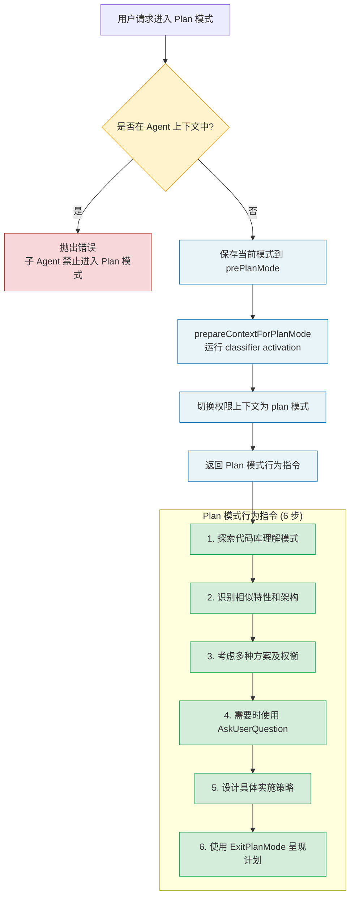

关键点：
- **Agent 上下文中禁止进入 Plan 模式**：子 Agent 不应该进入规划模式，这是架构层面的约束。想象一下，如果一个子 Agent 进入 Plan 模式，它会等待用户审批计划，而用户可能根本不知道子 Agent 的存在。这会导致整个父 Agent 的执行被阻塞在一个用户无法理解的审批请求上。
- **prepareContextForPlanMode**：运行 classifier activation 的副作用，确保在 plan 模式下权限配置正确。
- **prePlanMode 保存**：原始模式被保存到 `prePlanMode` 字段，供 ExitPlanMode 恢复使用。

进入 Plan 模式后，Agent 收到的 tool_result 包含明确的行为指令：

```
In plan mode, you should:
1. Thoroughly explore the codebase to understand existing patterns
2. Identify similar features and architectural approaches
3. Consider multiple approaches and their trade-offs
4. Use AskUserQuestion if you need to clarify the approach
5. Design a concrete implementation strategy
6. When ready, use ExitPlanMode to present your plan for approval

Remember: DO NOT write or edit any files yet.
This is a read-only exploration and planning phase.
```

这六条指令的设计暗含了一个认知模型：**理解 -> 发现 -> 比较 -> 澄清 -> 设计 -> 呈现**。这不是随意的列举，而是一个从发散（广泛探索）到收敛（具体方案）的思维过程。Step 1-2 是发散阶段，Agent 尽可能广泛地收集信息；Step 3-4 是收敛的过渡阶段，Agent 开始聚焦但仍然开放；Step 5-6 是完全收敛，Agent 产出一个确定的实施方案。

### 14.1.3 退出 Plan 模式

ExitPlanModeV2Tool 负责从 Plan 模式退出并恢复原始权限模式。它的设计比 EnterPlanMode 复杂得多，因为需要处理多种场景。

**模式恢复**是核心逻辑。系统从 `prePlanMode` 中读取保存的原始模式并恢复。但存在一个关键的"断路器"防御：如果 `prePlanMode` 是 `auto`，但 auto mode 的 gate 当前关闭（如因 circuit breaker 触发），则回退到 `default` 模式。

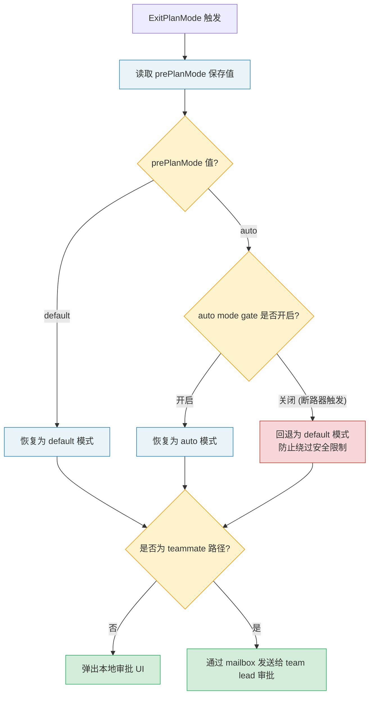

这个断路器防御揭示了一个微妙的时间窗口问题：进入 Plan 模式时 auto mode 是开启的，但在 Plan 模式持续期间（可能几分钟甚至几十分钟），auto mode 可能因为外部原因（如系统负载、安全策略变更）被关闭。如果 ExitPlanMode 不检查这个条件，Agent 退出 Plan 模式后立即以 auto mode 权限执行操作，可能绕过了新激活的安全限制。

**Teammate 路径**：当 Agent 作为 teammate 运行且 Plan 模式是强制要求时，ExitPlanMode 不会弹出本地审批 UI，而是通过 mailbox 机制将计划发送给 team lead 审批。审批请求包含发送者、时间戳、计划文件路径、计划内容和请求 ID 等信息。

> **交叉引用：** Teammate 的 mailbox 机制在第 10 章"协调器模式 -- 多智能体编排"中有详细分析。Plan 模式的 teammate 路径是分布式 Agent 协作的一个典型案例 -- 审批决策的权力被委托给 team lead，而非本地用户。

### 14.1.4 Plan 模式完整案例：从需求到计划到实施

让我们通过一个完整的案例来展示 Plan 模式的实际运作过程。

**用户需求：** "为项目的 REST API 添加分页支持"

**Step 1: 进入 Plan 模式**

Agent 判断这是一个涉及多个文件修改的非平凡任务，主动触发 EnterPlanMode。系统保存当前模式为 `default`，切换到 plan 模式权限配置。

**Step 2: 只读探索（Plan 模式中）**

Agent 执行以下只读操作：

```
工具调用序列（全部为只读）：
1. Glob("src/routes/*.ts")           -- 发现所有路由文件
2. Glob("src/models/*.ts")           -- 发现所有模型文件
3. Grep("limit|offset|page|cursor")  -- 搜索已有的分页实现
4. Read("src/routes/users.ts")       -- 阅读典型路由实现
5. Read("src/middleware/validate.ts") -- 了解验证中间件模式
6. Grep("interface.*Response")       -- 搜索响应类型定义
```

Agent 发现：
- 项目使用 Express + TypeScript
- 已有 12 个路由文件，都没有分页支持
- 有一个通用的 `ApiResponse` 类型
- 验证中间件使用 Zod schema
- 数据库层使用 Prisma ORM

**Step 3: 方案设计与权衡分析**

Agent 在内部考虑了两种方案：

| 维度 | Offset 分页 | Cursor 分页 |
|------|------------|------------|
| 实现复杂度 | 低 | 中 |
| 大数据集性能 | 差（OFFSET 扫描） | 优（索引查找） |
| 数据一致性 | 中（插入/删除导致偏移） | 优（基于游标） |
| 客户端兼容性 | 好（页码直觉） | 需要适配 |
| 与 Prisma 集成 | 简单（skip/take） | 需要 cursor 编码 |

**Step 4: 呈现计划**

Agent 通过 ExitPlanMode 呈现以下计划：

```
## 分页功能实施计划

### 方案选择：混合模式
- 默认使用 offset 分页（简单、兼容性好）
- 为高频接口提供 cursor 分页选项

### 实施步骤
1. 创建 src/types/pagination.ts -- 分页类型定义
2. 创建 src/middleware/pagination.ts -- 分页参数解析中间件
3. 修改 src/routes/users.ts -- 作为第一个实现样例
4. 添加 Zod schema 验证 -- limit (1-100), offset (>=0)
5. 更新 ApiResponse 类型 -- 添加分页元数据

### 预计影响
- 新增文件：2 个
- 修改文件：3 个
- 风险：低（纯增量，不修改已有功能）
```

**Step 5: 审批与执行**

用户审批计划后，ExitPlanMode 恢复原始模式，Agent 进入执行阶段，按照计划逐步实施。

> **注意：** 在实际使用中，Plan 模式的深度应该与任务复杂度匹配。对于简单的单文件修改，直接执行可能比进入 Plan 模式更高效。Claude Code 的 prompt 设计已经内置了这种判断 -- 对于外部用户，系统只在"实现任务"时建议 Plan 模式，对于简单的查询和修改则直接处理。

---

## 14.2 计划验证机制

### 14.2.1 验证智能体

`registerPlanVerificationHook` 在 `ExitPlanModeV2Tool` 中被引用，其注释揭示了一个重要设计决策：验证钩子必须在 context clear 之后注册，因为 context clear 会清除所有 hooks。

验证钩子必须在 context clear 之后注册，因为 context clear 会清除所有 hooks。这意味着验证智能体运行在"清除上下文并开始实施"之后的阶段，作为一个独立的后台 Agent 来检验实施结果是否符合计划。

**验证智能体的设计理念。** 为什么需要一个独立的验证智能体，而不是让执行智能体自己检查？这涉及"自我审查"的认知偏差 -- 执行者倾向于用自己的理解来评判自己的工作，而非严格按照计划原文对照。独立的验证智能体持有原始计划文件的快照，能够以"旁观者"的视角审查实施结果。

这就像软件工程中的 code review：让作者自己 review 自己的代码，效果远不如让另一个工程师来做。验证智能体扮演的就是这个"另一个工程师"的角色。

验证流程的时序：

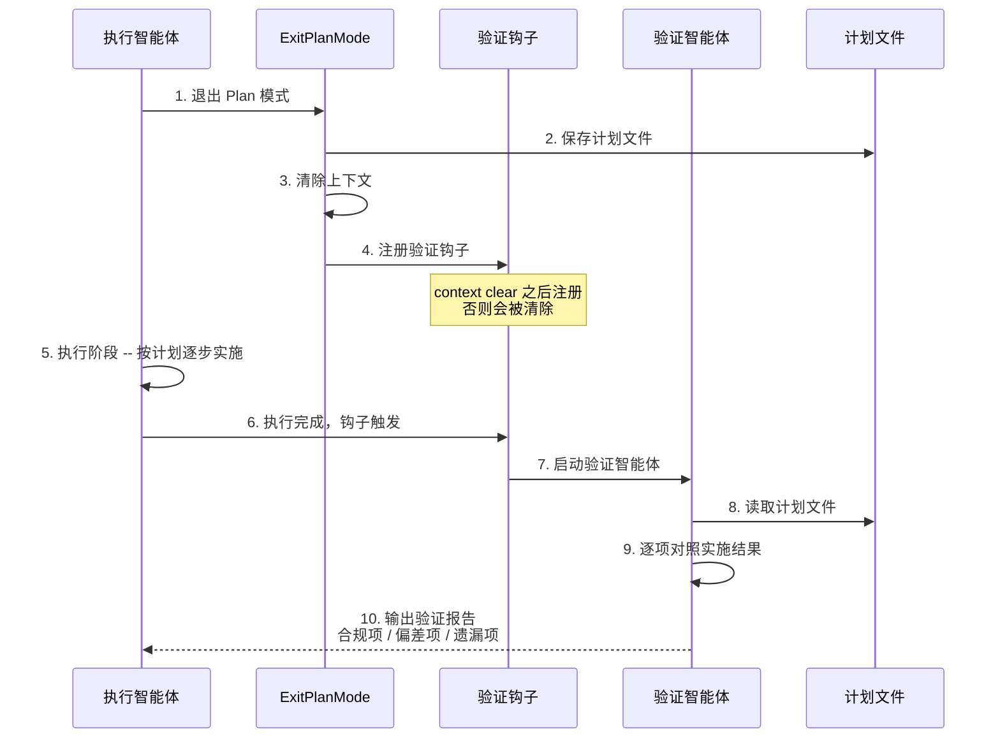

### 14.2.2 计划文件的持久化与恢复

计划文件管理是 Plan 模式的基础设施，由专门的工具函数模块提供。这部分设计的核心挑战是：**计划不能丢失。** 用户花了时间审批计划，Agent 花了 token 生成计划，如果因为会话崩溃或意外中断导致计划丢失，所有投入都白费了。

**文件路径生成**采用 slug-based 命名策略。主会话使用简单的 `{slug}.md` 格式，子 Agent 使用 `{slug}-agent-{agentId}.md` 格式，避免文件冲突。

**Slug 生成**是惰性的：首次访问时生成，后续从缓存读取。如果生成的 slug 对应的文件已存在，最多重试 10 次。

**恢复机制**是多层次的。`copyPlanForResume` 在会话恢复时从三个来源尝试恢复计划：

1. **直接读取计划文件**：最简单的路径，如果文件存在直接返回。
2. **文件快照恢复**（`findFileSnapshotEntry`）：从 transcript 中的 `file_snapshot` 系统消息恢复，这在远程会话（CCR）中尤其重要，因为本地文件不会在会话之间持久化。
3. **消息历史恢复**（`recoverPlanFromMessages`）：从三种消息格式中提取计划内容：
   - ExitPlanMode 的 `tool_use` input（`normalizeToolInput` 注入的计划内容）
   - User message 的 `planContent` 字段（clear context 流程中设置）
   - Attachment message 的 `plan_file_reference`（auto-compact 时保留计划）

这三层恢复策略可以用"鸡蛋不能放在一个篮子里"来理解。每一层覆盖不同的故障场景：

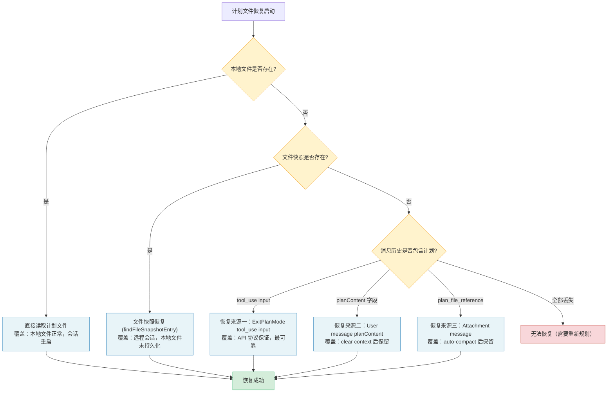

**Fork 恢复**使用完全不同的策略。`copyPlanForFork` 为 fork 的会话生成一个新的 slug，并将原始计划文件复制到新路径。这种设计防止了原始会话和 fork 会话互相覆盖对方的计划文件。

为什么 fork 不能直接共享原始计划文件？因为 fork 之后，两个会话可能走上完全不同的执行路径。如果 fork 对计划进行了修改（如根据实施反馈调整方案），直接修改原始文件会影响父会话。通过复制文件到新路径，fork 拥有了独立的计划副本，互不干扰。

> **交叉引用：** Fork Agent 的创建和状态隔离机制在第 9 章"子智能体与 Fork 模式"中有详细分析。计划文件的 fork 策略是 Agent 状态隔离的一个具体体现。

### 14.2.3 计划文件恢复的深度分析

让我们更深入地分析 `recoverPlanFromMessages` 的三种恢复来源，理解每种来源的设计意图和适用场景。

**来源一：ExitPlanMode 的 tool_use input。** 当 Agent 退出 Plan 模式时，ExitPlanMode 工具的输入参数中包含了计划内容。这个内容被 `normalizeToolInput` 注入到工具调用的 input 中。恢复时，系统从消息历史中找到 ExitPlanMode 的 tool_use 消息，提取其中的计划内容。这是最可靠的恢复来源，因为 tool_use 消息是 API 协议的一部分，不会被普通的上下文管理操作修改。

**来源二：User message 的 planContent 字段。** 在 clear context 流程中（即清除上下文重新开始实施时），系统会将计划内容设置到一个特殊的 `planContent` 字段。这个字段的目的是在上下文清除后保留计划的"种子"，使得新开始的执行阶段仍然知道要做什么。

**来源三：Attachment message 的 plan_file_reference。** auto-compact 是一种自动压缩上下文的机制（详见第 7 章）。在压缩过程中，系统识别到计划文件的重要性，会在 attachment 消息中保留对计划文件的引用。这确保了即使经过自动压缩，计划文件仍然可以通过引用被定位和读取。

三种来源的优先级设计体现了"可靠性优先"的原则：tool_use input 最可靠（API 协议保证），planContent 次之（内部机制保证），plan_file_reference 最弱（依赖 auto-compact 的正确识别）。恢复逻辑按此优先级依次尝试，第一个成功的来源即为最终结果。

---

## 14.3 工作流系统

### 14.3.1 WorkflowTool 与 Skill 系统

Claude Code 的工作流能力主要由 Skill 系统提供。Skill 本质上是预定义的 prompt 模板，可以通过 slash command 触发。Skill 执行的核心准备函数处理三件事：

1. **Prompt 替换**：将 `$ARGUMENTS` 占位符替换为用户提供的参数。
2. **权限扩展**：通过 `createGetAppStateWithAllowedTools` 为 fork 的执行上下文添加允许的工具列表。
3. **Agent 选择**：优先使用 command 指定的 agent type，否则回退到 `general-purpose` agent。

**Skill 系统的设计权衡。** 为什么选择 prompt 模板而非代码级别的插件？这是"灵活性 vs 可靠性"的经典权衡。代码级插件可以提供更强的功能和更好的类型安全，但它们的开发和维护成本更高，需要开发者深入理解系统的内部 API。Prompt 模板则允许任何人用自然语言定义工作流，大幅降低了扩展门槛。

```
+-------------------+---------------------------+---------------------------+
| 扩展方式          | 灵活性                    | 门槛                      |
+-------------------+---------------------------+---------------------------+
| Prompt 模板       | 中等（受限于 prompt 表达力）| 低（自然语言）             |
| (Skill 系统)      |                           |                           |
+-------------------+---------------------------+---------------------------+
| 钩子命令          | 高（任意 Shell 命令）      | 中（需要编程能力）         |
| (Hook 系统)       |                           |                           |
+-------------------+---------------------------+---------------------------+
| MCP 服务器        | 极高（独立进程，任意语言） | 高（需要实现协议）         |
| (外部工具)        |                           |                           |
+-------------------+---------------------------+---------------------------+
```

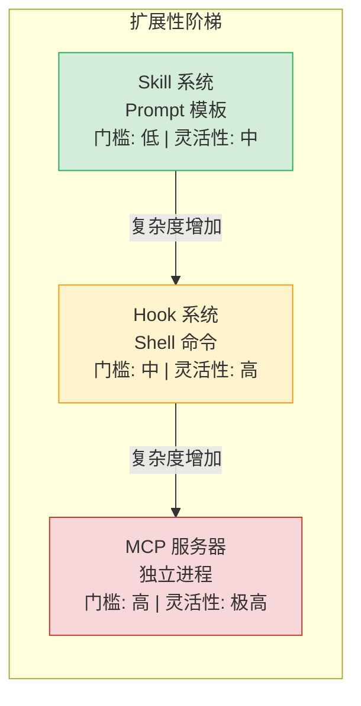

Claude Code 的扩展性设计遵循"阶梯式扩展"原则：从最简单的 prompt 模板开始，随着需求复杂度的增加，逐步使用更强大的扩展机制。大多数用户只需要 Skill 系统，高级用户使用钩子命令，企业级用户通过 MCP 集成外部工具。

> **交叉引用：** Skill 系统的完整架构在第 11 章"技能系统与插件架构"中有详细分析。Hook 系统在第 8 章"钩子系统 -- Agent 的生命周期扩展点"中讨论。MCP 集成在第 12 章"MCP 集成与外部协议"中介绍。

### 14.3.2 Fork Agent 的状态隔离

`createSubagentContext` 创建了一个完全隔离的 ToolUseContext。默认情况下，所有可变状态都被隔离：

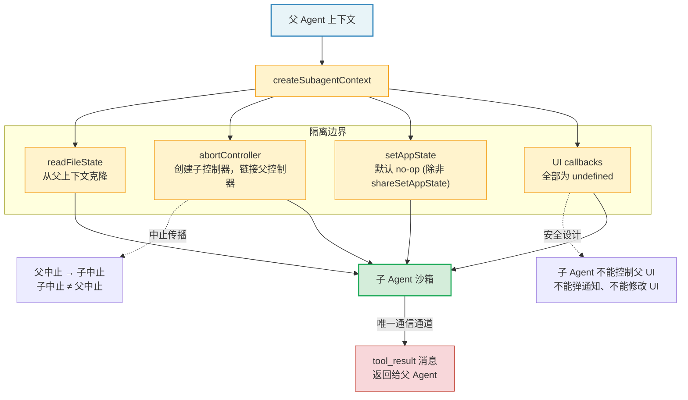

- **readFileState**：从父上下文克隆。
- **abortController**：创建子控制器，链接到父控制器（父中止传播到子）。
- **setAppState**：默认为 no-op，除非显式选择共享（`shareSetAppState`）。
- **UI callbacks**（addNotification、setToolJSX 等）：全部为 undefined，子 Agent 不能控制父 UI。

**为什么子 Agent 不能控制父 UI？** 这是一个关键的安全设计。如果子 Agent 可以弹出通知或修改 UI，用户可能会被来自多个子 Agent 的通知淹没，无法区分主 Agent 和子 Agent 的输出。更严重的是，恶意的工具输出（通过 prompt injection）可能利用子 Agent 的 UI 能力进行钓鱼攻击 -- 例如弹出一个看似合法的确认对话框。

Fork Agent 的状态隔离策略可以用"沙箱"来类比：子 Agent 在沙箱中运行，可以看到外部世界（通过克隆的文件状态），但不能影响外部世界（不能修改父 Agent 状态，不能控制 UI）。唯一与外部世界的通信通道是工具结果 -- 子 Agent 的执行结果通过结构化的 `tool_result` 消息返回给父 Agent。

> **最佳实践：** 在设计子 Agent 时，遵循"最小权限原则"。只传递子 Agent 完成任务所需的最小上下文，不要将整个父 Agent 的状态无差别地传递。这不仅能提高安全性，还能减少 token 消耗（子 Agent 的输入 token 也计入成本）。

---

## 14.4 调度系统

### 14.4.1 ScheduleCronTool：本地定时任务

Claude Code 的调度系统支持两类定时任务：

- **One-shot**（`recurring: false`）：触发一次后自动删除。
- **Recurring**（`recurring: true`）：按计划重复触发，从当前时间重新调度。

任务存储在 `<project>/.claude/scheduled_tasks.json` 中，文件格式为：

```json
{
  "tasks": [
    {
      "id": "a1b2c3d4",
      "cron": "0 * * * *",
      "prompt": "check the deploy status",
      "createdAt": 1710000000000,
      "recurring": true
    }
  ]
}
```

每个 CronTask 包含一个 `durable` 运行时标志。`durable: false` 的任务仅存在于进程内存中，会话结束即消失。写入磁盘的任务会剥离这个标志。

**durable 标志的设计意图。** 为什么不将所有任务都持久化到磁盘？考虑这些场景：

- 用户创建了一个一次性任务"5 分钟后检查部署状态"，这是一个短期任务，会话结束后如果还没有触发，就不再有意义了。
- 用户在调试时创建了临时轮询任务"每分钟检查日志"，这个任务只服务于当前调试会话。
- 将这些临时任务持久化到磁盘不仅浪费存储，还可能导致后续会话意外触发已经过时的任务。

因此，`durable` 标志提供了一种"轻量级任务"机制：需要跨会话持久化的任务设为 `durable: true`，仅服务于当前会话的任务设为 `durable: false`。

### 14.4.2 CronScheduler：调度器核心

`createCronScheduler` 实现了完整的调度器，包含以下关键特性：

**文件锁**：通过 `tryAcquireSchedulerLock` 确保同一个项目目录下的多个 Claude 会话不会重复触发同一个 on-disk 任务。非 owner 会话每 5 秒探测一次锁，如果 owner 崩溃则接管。

这种文件锁机制解决了一个实际的分布式问题：开发者可能同时打开多个终端窗口，每个窗口运行一个 Claude Code 实例。如果没有文件锁，同一个定时任务会被每个实例各触发一次，导致重复操作（如重复发送通知、重复执行部署检查）。

文件锁的实现基于文件系统的原子操作（如 `O_EXCL` 创建），这在所有主流操作系统上都是可靠的。锁的超时和接管机制确保了 owner 崩溃时不会出现死锁 -- 其他实例会在合理时间内检测到并接管。

**Jitter 机制**：为避免大量会话在同一时刻触发推理请求（惊群效应），recurring 任务添加了确定性的正向延迟。延迟与两次触发之间的间隔成正比，默认不超过 15 分钟。对于每小时执行的任务，实际触发时间会在 `:00` 到 `:06` 之间随机分散。

One-shot 任务使用反向 jitter（提前触发），通过 `oneShotMinuteMod` 控制：默认值为 30，意味着只有 `:00` 和 `:30` 的整点触发会添加 jitter。

**惊群效应（Thundering Herd）**是分布式系统中的经典问题。如果所有 Claude Code 实例都在整点触发定时任务，API 服务器会突然收到大量并发请求，可能导致延迟飙升甚至服务降级。Jitter 机制通过将触发时间分散在一个时间窗口内，将峰值负载平滑化为均匀负载。

```mermaid
flowchart LR
    subgraph 无Jitter["无 Jitter -- 惊群效应"]
        direction TB
        N1A["实例1: ----X-----------X-----------X----"]
        N1B["实例2: ----X-----------X-----------X----"]
        N1C["实例3: ----X-----------X-----------X----"]
        N1D["API:   ^^^峰值       ^^^峰值      ^^^峰值"]
    end

    subgraph 有Jitter["有 Jitter -- 负载平滑"]
        direction TB
        N2A["实例1: -----X----------X-----------X----"]
        N2B["实例2: -------X----------X---------X----"]
        N2C["实例3: ----X------------X-----------X---"]
        N2D["API:   ^平滑          ^平滑        ^平滑"]
    end

    无Jitter -.->|"添加 Jitter"| 有Jitter

    classDef peakNode fill:#f8d7da,stroke:#c0392b,stroke-width:1px
    classDef smoothNode fill:#d4edda,stroke:#27ae60,stroke-width:1px

    class N1D peakNode
    class N2D smoothNode
```

**错过任务检测**：启动时检查是否有任务的下次触发时间已经过去，如果有则通知用户。

**自动过期**：Recurring 任务默认 7 天后自动过期（`recurringMaxAgeMs`），防止无限递归导致内存泄漏。`permanent` 标志的任务（如 assistant mode 的内置任务）豁免于此限制。

7 天的过期策略是一个务实的选择。如果一个 recurring 任务连续运行了 7 天而没有被任何人关注或修改，大概率它已经不再被需要了。没有过期机制的任务会像"僵尸进程"一样持续消耗资源：每次触发都会产生 API 调用、消耗 token、占用调度器内存。

### 14.4.3 RemoteTriggerTool：远程触发

RemoteTriggerTool 提供了远程 Agent 的触发管理能力，支持 list、get、create、update、run 五种操作。

它通过 Anthropic API 的 triggers 端点工作，使用 OAuth bearer token 认证，并携带组织标识和 beta 标志等头部信息。

工具的启用受两个条件门控：feature flag `tengu_surreal_dali` 和 policy limit `allow_remote_sessions`。只有在两个条件都满足时，RemoteTriggerTool 才会出现在工具列表中。

**远程触发的应用场景：**

1. **CI/CD 集成**：当 CI 流水线失败时，自动触发一个 Agent 分析失败原因并生成修复建议。
2. **监控告警响应**：当监控系统检测到异常指标时，触发 Agent 进行根因分析。
3. **代码仓库事件**：当 PR 被创建或更新时，触发 Agent 进行自动代码审查。
4. **定时报告**：每天定时触发 Agent 生成项目状态报告。

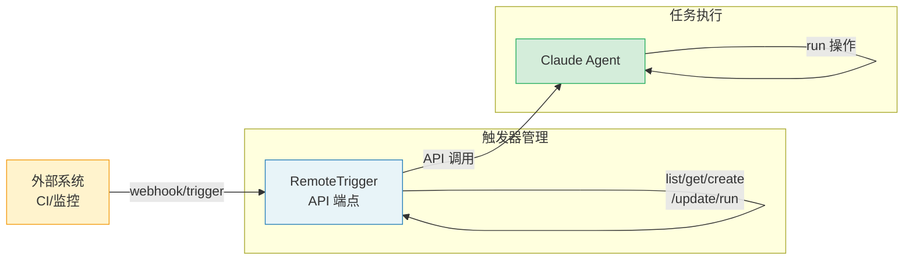

> **最佳实践：** 远程触发结合 Plan 模式可以构建强大的自动化工作流。例如，CI 失败时触发一个 Agent，Agent 自动进入 Plan 模式分析失败原因，生成修复计划，然后自动执行修复。这种"触发 -> 规划 -> 执行"的模式是 Agent 驱动自动化的核心范式。

### 14.4.4 定时任务的会话级生命周期

Session-scoped 任务（`durable: false`）的生命周期与会话绑定。它们存储在 bootstrap state 中，不写入磁盘。

`listAllCronTasks` 合并文件任务和 session 任务，返回统一的任务列表。

在 scheduler 的 `check()` 方法中，session 任务和文件任务走不同的处理路径。Session 任务直接在内存中操作（同步删除），文件任务通过 `removeCronTasks` 异步写入磁盘。

**实战案例：自动部署监控工作流**

以下是一个利用调度系统构建的自动部署监控工作流：

```
1. 用户："帮我部署到 staging 环境并监控部署状态"

2. Agent 创建部署任务:
   - one-shot cron task: 30分钟后检查部署是否完成
   - prompt: "检查 staging 环境部署状态，如果失败则分析原因"

3. Agent 创建监控任务:
   - recurring cron task: 每5分钟检查一次健康状态
   - prompt: "检查 staging 环境的健康检查端点，如果返回异常则通知"
   - durable: false (仅当前会话有效)

4. 部署成功后:
   - Agent 删除监控任务
   - 部署检查任务自动触发后删除（one-shot）

5. 如果会话意外中断:
   - monitoring task 随会话消失（durable: false）
   - 部署检查任务可能在下次会话触发（如果持久化的话）
```

### 14.4.5 工作流设计模式与反模式

基于 Claude Code 的 Plan 模式和调度系统，我们可以总结出以下工作流设计模式和反模式：

**模式一：Plan-Execute-Verify 循环**

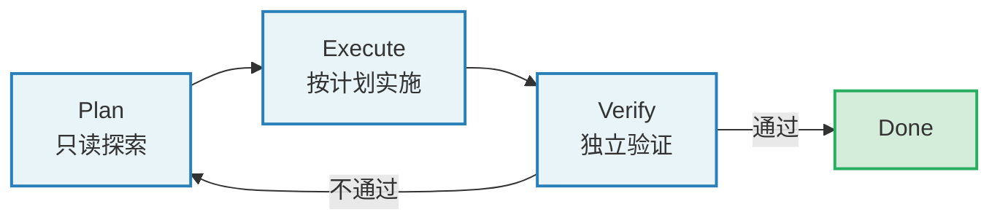

这是最经典的 Agent 工作流模式。Plan 阶段确保方向正确，Execute 阶段高效实施，Verify 阶段保障质量。三者的分离使得每个阶段都可以独立优化和调试。

**模式二：Event-Triggered Workflow**


适用于运维自动化、CI/CD 集成等场景。事件触发而非用户主动发起，Plan 模式确保自动化操作的安全性和可控性。

**模式三：Polling Loop with Escalation**

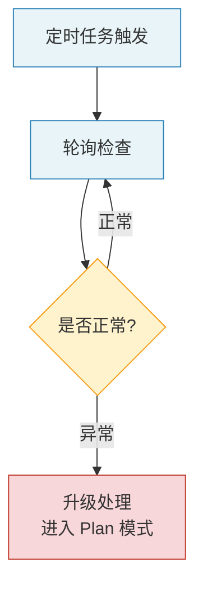

适用于持续监控场景。低成本的定时轮询只在检测到异常时才触发高成本的 Agent 推理。

**反模式一：无计划的复杂任务**

直接让 Agent 执行涉及多个文件修改的复杂任务，不经过 Plan 模式。风险：方向错误导致大面积返工。

**反模式二：过度规划**

对简单任务（如修改一个配置值）也进入 Plan 模式。浪费时间和 token，降低用户体验。

**反模式三：永不清理的定时任务**

创建 recurring 任务但不设置合理的过期时间。结果：僵尸任务持续消耗资源。

**反模式四：同步等待轮询结果**

在主对话中同步等待定时任务的结果（通过 Sleep + 轮询）。正确做法是将结果通过通知机制异步推送，主对话不被阻塞。

---

## 14.5 后台任务与主动模式

### 14.5.1 SleepTool

SleepTool 被列为后台任务管理的一部分。在 Claude Code 的工具注册中，它与其他调度相关工具一起注册。SleepTool 允许 Agent 在执行过程中暂停一段时间，这在长时间运行的后台任务场景中特别有用，例如轮询部署状态或等待外部系统完成操作。

SleepTool 的设计看似简单（就是等待指定时间），但它在 Agent 交互模型中扮演着重要角色。没有 SleepTool 的 Agent 在面对"等待"场景时只有两种选择：要么立即返回结果（即使外部操作尚未完成），要么在循环中频繁轮询（浪费 token）。SleepTool 提供了第三种选择：Agent 可以暂停执行，等待一段时间后再继续，期间不产生 token 消耗。

**SleepTool 的使用场景：**

1. **部署轮询**：Agent 触发部署后，sleep 30 秒，然后检查部署状态，如果还在进行中就继续 sleep。
2. **缓存预热等待**：修改了缓存配置后，sleep 等待缓存失效期过去，然后验证新缓存是否生效。
3. **限速适配**：调用有速率限制的外部 API 时，sleep 等待速率窗口重置。

> **反模式警告：** 不要在 Plan 模式中使用 SleepTool。Plan 模式应该是高效的只读探索，不应该包含等待操作。如果 Plan 模式中的某个操作需要等待，这说明探索策略需要优化 -- 应该一次性获取所有需要的信息，而不是轮询等待。

### 14.5.2 后台会话管理

`runForkedAgent` 是后台 Agent 执行的基础。它通过 `createSubagentContext` 创建完全隔离的上下文，运行独立的查询循环，并追踪完整的 usage 指标。

关键的隔离设计包括：

1. **文件状态缓存克隆**（`cloneFileStateCache`）：子 Agent 的文件读取不影响父 Agent 的缓存。这确保了父 Agent 的文件状态视图不会被子 Agent 的中间操作污染。例如，如果子 Agent 读取了一个文件然后该文件被修改，父 Agent 仍然持有修改前的缓存版本，不会因为子 Agent 的读取而刷新。

2. **独立的 AbortController**：子 Agent 可以被独立中止，而不影响父 Agent。这使得父 Agent 可以启动多个子 Agent，在需要时选择性取消某个子 Agent，而不影响其他正在进行的子任务。

3. **权限提示抑制**：后台 Agent 的 `getAppState` 包装了 `shouldAvoidPermissionPrompts: true`，避免后台操作弹出 UI 提示。这是因为后台 Agent 通常执行预先授权的任务（如 Plan 验证、会话摘要），不需要也不应该打断用户。

4. **Transcript 记录**：将子 Agent 的消息记录到独立的 sidechain 中，与主会话的消息分离。这使得主会话的消息历史保持清晰，不被子 Agent 的内部操作淹没。

`lastCacheSafeParams` 是一个全局 slot，用于在 post-turn hooks 中保存当前轮次的 cache-safe params。这使得 post-turn fork（如 promptSuggestion、postTurnSummary）可以直接复用主循环的 prompt cache，无需每个调用者手动传递参数。

**lastCacheSafeParams 的设计精妙之处在于"隐式上下文传递"。** 显式的做法是在每个需要 cache-safe params 的地方都从主循环传递参数，但这会导致函数签名膨胀 -- 每个新增的调用点都需要修改参数列表。通过全局 slot，调用者只需要在正确的时机读取 slot 值，而不需要知道值从哪里来。这降低了组件之间的耦合度。

当然，全局状态也有其风险：如果读取时机不对（比如在一个异步操作中延迟读取），slot 值可能已经被后续轮次覆盖。Claude Code 通过在 post-turn hook 的同步执行段中立即读取 slot 值来避免这个问题 -- slot 的写入和读取发生在同一个同步执行段中，不存在竞态条件。

### 14.5.3 后台任务的生命周期管理

后台任务从创建到完成经历以下生命周期阶段：

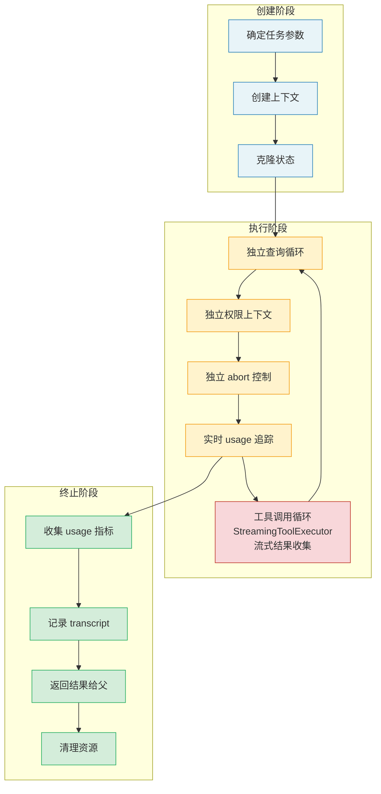

每个阶段都有对应的资源管理策略。创建阶段分配资源（上下文、控制器），执行阶段使用资源（API 调用、文件访问），终止阶段释放资源（关闭控制器、写入 transcript）。这种"分配-使用-释放"的三段式生命周期管理确保了资源不泄漏。

---

## 实战练习

### 练习 1：体验 Plan 模式完整流程

在 Claude Code REPL 中输入一个非平凡的实现任务（如"为项目添加一个配置验证模块"），观察：
1. EnterPlanMode 触发的条件（模型是否主动进入了 Plan 模式）
2. Plan 模式下模型的行为（是否只使用了只读工具）
3. 计划文件的内容和存储位置
4. ExitPlanMode 的审批流程和模式恢复

**记录模板：**

```
| 步骤 | 观察到的行为 | 使用的工具 | 耗时 |
|------|------------|-----------|------|
| 进入 Plan 模式 | ... | EnterPlanMode | ...s |
| 探索阶段 #1 | ... | Read/Grep/Glob | ...s |
| 探索阶段 #2 | ... | Read/Grep/Glob | ...s |
| 呈现计划 | ... | ExitPlanMode | ...s |
| 用户审批 | ... | - | ...s |
| 执行阶段 | ... | Edit/Write/Bash | ...s |
```

**延伸思考：** 对比使用 Plan 模式和不使用 Plan 模式完成同一任务的效果差异。特别关注：实施结果是否符合预期？是否需要返工？总耗时和 token 消耗如何？

### 练习 2：创建 Cron 定时任务

使用 `/schedule` 技能创建一个 one-shot 和一个 recurring 定时任务。检查 `.claude/scheduled_tasks.json` 的内容变化。终止并重新启动 Claude Code，观察错过任务的检测通知。

**具体步骤：**
1. 创建一个 one-shot 任务："5 分钟后报告当前 git 分支状态"
2. 创建一个 recurring 任务："每小时检查是否有未提交的变更"
3. 查看 `.claude/scheduled_tasks.json`，理解每个字段的含义
4. 等待 one-shot 任务触发，观察触发行为
5. 退出并重启 Claude Code，观察错过任务的检测通知
6. 手动删除 recurring 任务，确认文件内容更新

### 练习 3：分析计划文件恢复

在一个远程会话（CCR）中，进入 Plan 模式并创建一个计划。终止会话后恢复（`--resume`），检查计划文件是否被正确恢复。结合 `recoverPlanFromMessages` 的三种恢复来源，分析你的场景走了哪条路径。

**调试提示：** 使用 `CLAUDE_CODE_DEBUG=1` 环境变量启动 Claude Code，在日志中搜索 `copyPlanForResume` 和 `recoverPlanFromMessages` 关键词，可以观察到恢复过程走了哪条路径。

### 练习 4：设计一个完整的事件驱动工作流

选择以下场景之一，设计一个完整的事件驱动工作流（使用 Plan 模式 + 定时任务 + 远程触发）：

**场景 A：自动化代码审查**
- 触发条件：PR 创建/更新
- Plan 阶段：阅读 PR 变更，分析代码质量
- 执行阶段：生成审查评论
- 验证阶段：检查评论是否成功发布

**场景 B：基础设施健康监控**
- 触发条件：每小时定时触发
- Plan 阶段：查询关键指标，分析异常
- 执行阶段：生成报告，触发告警（如有异常）
- 验证阶段：确认告警已发送

对于你选择的场景，请回答：
1. 任务应该是 durable 还是 session-scoped？
2. 是否需要 jitter？为什么？
3. Plan 模式的退出条件是什么？
4. 如何处理任务执行失败的情况？

---

## 关键要点

1. **Plan 模式是只读探索与可写执行的分离**，通过权限模式切换实现。EnterPlanMode 保存原始模式并切换到 plan，ExitPlanMode 恢复原始模式并处理断路器防御。这种分离确保了 Agent 在"思考"阶段不产生任何副作用，极大降低了方向性错误的风险。

2. **计划文件管理采用 slug-based 命名和惰性生成**，支持三层恢复策略（直接读取、文件快照、消息历史），确保计划在各种故障场景下不丢失。恢复策略按可靠性优先级排序，体现了"鸡蛋不放一个篮子"的防御性设计思想。

3. **Fork Agent 通过 CacheSafeParams 实现提示缓存共享**，通过 createSubagentContext 实现状态隔离，确保子 Agent 不干扰主 Agent 的状态。子 Agent 的"沙箱"设计 -- 可读外部世界但不可修改父状态 -- 是 Agent 安全的关键边界。

4. **调度系统支持文件持久化和会话级两种任务**，通过文件锁防止多会话重复触发，通过 jitter 机制防止惊群效应，通过自动过期防止无限递归。这些机制共同构成了一个健壮的分布式任务调度框架。

5. **Teammate 的 Plan 审批走 mailbox 机制**，而非本地 UI 弹窗，这是分布式 Agent 协作的基础设施。审批权力的委托（从本地用户到 team lead）体现了 Agent 系统中的权限代理模式。

6. **工作流设计应遵循"Plan-Execute-Verify"模式**，避免"无计划的复杂任务"和"永不清理的定时任务"等反模式。好的工作流设计在自动化效率和人为监督之间取得平衡。

7. **lastCacheSafeParams 的全局 slot 设计**体现了"隐式上下文传递"模式，降低了组件间的耦合度，同时通过同步读写避免了竞态条件。这种模式在需要跨多层组件传递上下文时特别有用。
