# 第15章：构建你自己的 Agent Harness

> "The rules of thinking are lengthy and fortuitous. They require plenty of thinking of most long duration and deep meditation for a wizard to wrap one's noggin around."
> -- Claude Code 中的注释

**学习目标：** 综合运用全书知识，设计并实现一个自定义 Agent Harness，掌握从对话循环到生产部署的完整工程链路。

---

## 15.1 设计原则回顾与选型指南

### 五大设计原则在实际项目中的应用

全书贯穿了 Agent Harness 的五大设计原则。在动手编码之前，让我们回顾它们如何映射到具体的工程决策。理解这些原则的"为什么"比记住"是什么"更重要 -- 因为当你在自己的项目中遇到 Claude Code 没有覆盖的场景时，原则可以指导你做出一致的设计决策。

**原则一：循环优于递归。** Claude Code 的核心查询函数是一个 `AsyncGenerator`，通过 `while(true)` 循环和 `continue` 语句管理状态流转。每次迭代从 `state` 对象中解构出消息列表、压缩追踪、恢复计数等状态，然后在各个 `continue` 站点写入新的 `State` 对象。这种 "解构-重赋值" 模式比递归调用更易调试，也避免了调用栈溢出。

为什么循环比递归更适合 Agent 场景？三个原因：

1. **状态恢复更自然。** 在循环中，状态恢复只需要重新赋值 `state` 变量。在递归中，状态恢复需要回退整个调用栈，复杂度急剧上升。Claude Code 的 auto-compact 机制需要在不终止对话的情况下压缩上下文，这在循环中是一个简单的"替换消息列表 + continue"，在递归中则需要异常或特殊返回值来实现。

2. **中止更可控。** `AbortController` 的 signal 检查在循环的顶部是一个自然的"退出点"。在递归中，中止信号需要在每一层递归中传递和检查，容易遗漏。

3. **调试更直观。** 循环的状态变化发生在一个固定的代码位置，设一个断点就能捕获所有状态转换。递归的状态变化分散在多个调用栈帧中，需要在不同层级设断点。

**原则二：Schema 驱动而非硬编码。** 每个工具都通过 Zod Schema 定义输入参数，`buildTool` 工厂函数从部分定义中自动填充默认行为。这意味着工具的验证逻辑、权限检查、描述生成都从同一个 Schema 派生，消除了不一致的根源。

Schema 驱动的深层价值在于"单一真相源"（Single Source of Truth）。考虑一个没有 Schema 驱动的替代方案：工具的输入验证写在一处，权限检查写在另一处，API 文档又是手动编写的。当参数需要修改时，三处都需要同步更新，遗漏任何一处都会导致不一致。Schema 驱动确保了验证逻辑、权限逻辑和文档都是从同一个定义派生的，修改一处即全局生效。

**原则三：渐进式权限。** 权限系统分为四个阶段：`validateInput`（输入校验）、`checkPermissions`（权限检查）、PreToolUse 钩子（前置拦截）、`canUseTool`（用户确认）。每个阶段都可以短路返回，未通过前一阶段的请求不会进入下一阶段。

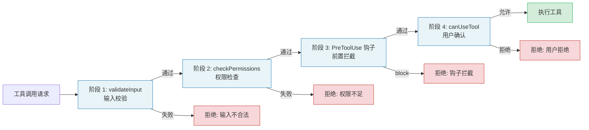

这种管线式设计的好处是"早期拒绝"（Fail Fast）。如果输入参数不合法（阶段 1），就不需要浪费时间去检查权限规则（阶段 2）；如果权限规则明确拒绝（阶段 2），就不需要弹出用户确认对话框（阶段 4）。每个阶段都是一层"筛子"，将不需要后续处理的请求尽早拦截。

**原则四：流式优先。** 从模型响应到工具执行结果，所有数据都通过 `AsyncGenerator` 的 `yield` 传递。消费端可以逐条处理消息，而不必等待整个回合完成。这使得实时 UI 更新、流式传输到 SDK 消费者成为可能。

**原则五：可插拔扩展。** 钩子系统在二十多个生命周期节点提供扩展点，从 `SessionStart` 到 `PostToolUse`，从 `PreCompact` 到 `Stop`。每个钩子都是独立的 Shell 命令或 HTTP 端点，通过标准化的 JSON 输入输出协议与 Harness 交互。

### 何时使用 Agent Harness 模式 vs 简单 LLM API 调用

并非每个场景都需要完整的 Agent Harness。决策的关键在于三个维度：

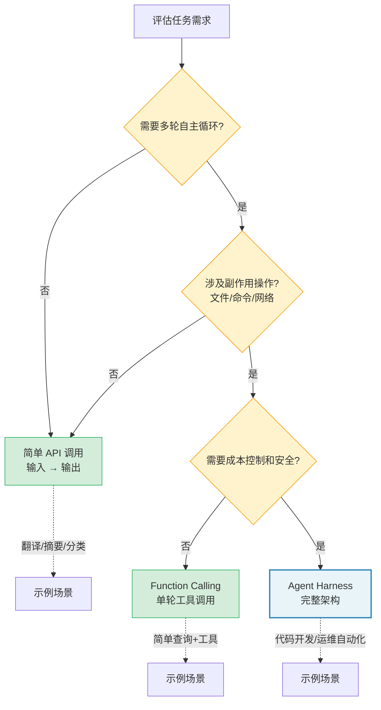

| 维度 | 简单 API 调用 | Agent Harness |
|------|---------------|---------------|
| 交互轮次 | 单次请求-响应 | 多轮自主循环 |
| 工具需求 | 无或仅 Function Calling | 多种工具、权限控制 |
| 上下文管理 | 手动拼接 Prompt | 自动压缩、记忆提取 |
| 错误恢复 | 重试 | 多层恢复（断路器、降级、压缩） |
| 成本敏感度 | 低（单次调用） | 高（长会话累积） |
| 安全要求 | 低（无副作用） | 高（文件操作、命令执行） |

如果你的任务满足以下任一条件，就应该考虑 Agent Harness 模式：

1. 智能体需要根据中间结果决定下一步行动（自主循环）
2. 涉及文件系统、代码执行、网络请求等副作用操作
3. 对话可能跨越数十甚至数百轮交互
4. 需要在多个环境（CLI、IDE、SDK）中保持一致行为
5. 需要精细的成本控制和 token 预算管理
6. 需要可观测性 -- 追踪每一步的决策过程和资源消耗

> **决策经验法则：** 如果你的系统只需要 LLM 做"输入 -> 输出"的转换（如翻译、摘要、分类），使用简单的 API 调用。如果你的系统需要 LLM 做"观察 -> 思考 -> 行动 -> 再观察"的循环，使用 Agent Harness。

### 运行时选择：Bun vs. Node.js vs. Python

Claude Code 选择 Bun 作为运行时，主要出于三个考量：

- **启动速度：** Bun 的冷启动时间约为 Node.js 的三分之一，对于 CLI 工具至关重要
- **原生 TypeScript：** 无需预编译步骤，直接运行 `.ts` 文件
- **Bundle 特性：** `bun:bundle` 提供编译时特性开关（`feature('X')`），可以在构建阶段消除不需要的代码路径

如果你的项目主要运行在服务器端且已有 Node.js 基础设施，Node.js 完全可行。Python 适合数据科学和 ML 场景，但在类型安全和工具生态上弱于 TypeScript。本书的代码示例以 TypeScript 编写，可在 Bun 或 Node.js 上运行。

**运行时选型的权衡矩阵：**

```
+------------------+--------+---------+---------+
| 考量维度          | Bun    | Node.js | Python  |
+------------------+--------+---------+---------+
| 启动速度          | 极快   | 中等    | 慢      |
| TypeScript 原生  | 是     | 需编译  | 否      |
| 包生态成熟度      | 中等   | 极高    | 极高    |
| 特性开关支持      | 内置   | 需工具  | 需工具  |
| 部署普遍性        | 新兴   | 广泛    | 广泛    |
| 类型安全          | 强     | 强      | 弱      |
| 异步模型          | 原生   | 原生    | asyncio |
+------------------+--------+---------+---------+
```

---

## 15.2 核心组件实现路线图

Agent Harness 的六大核心组件之间的调用关系和数据流如下所示：

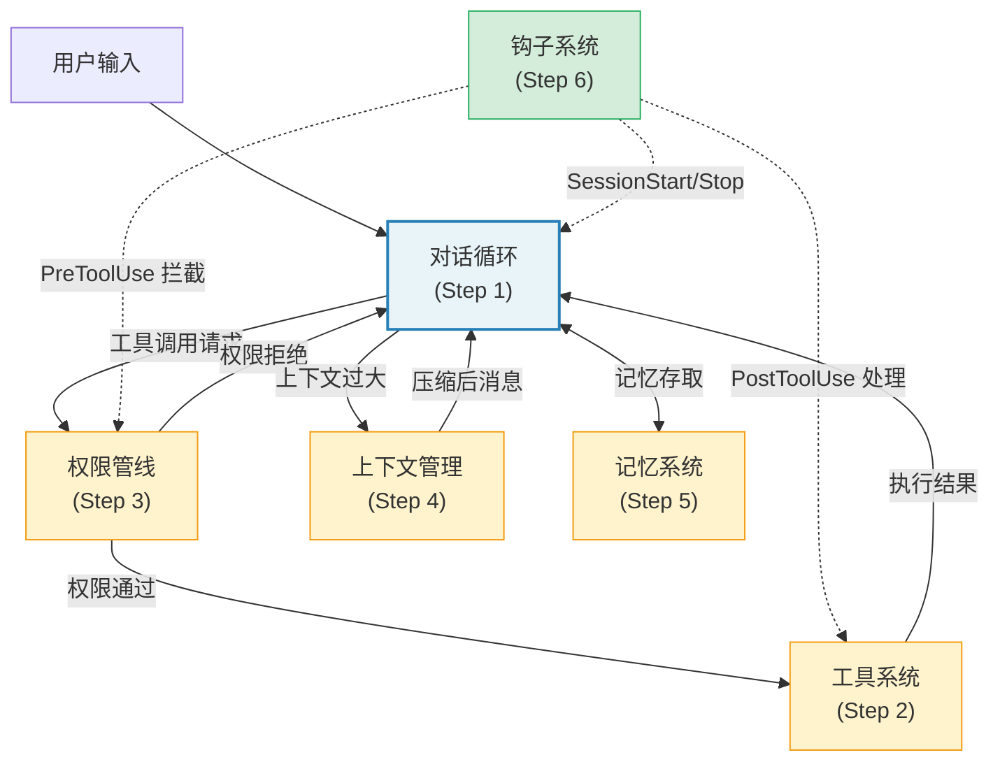

构建 Agent Harness 是一个渐进过程。本节给出六个步骤，每一步都建立在前一步的基础之上，最终产出一个可运行的最小 Harness。

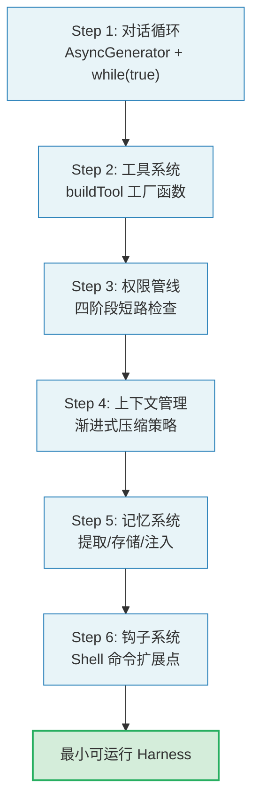

不要被"六步"的数量所迷惑 -- 这不是一个线性的瀑布过程。在实践中，你会发现需要在步骤之间来回迭代：当你实现权限管线时可能需要回头修改工具系统的接口，当你实现上下文管理时可能需要调整对话循环的状态结构。六步的意义在于提供一个有序的学习路径，而非僵化的开发顺序。

### Step 1：对话循环

对话循环是 Agent Harness 的心脏。Claude Code 的核心查询函数是一个 `AsyncGenerator`。让我们从设计精髓中提取灵感，实现一个精简但完整的对话循环。

首先定义核心类型：

```typescript
// types.ts
export interface Message {
  role: 'system' | 'user' | 'assistant'
  content: string | ContentBlock[]
}

export interface ContentBlock {
  type: 'text' | 'tool_use' | 'tool_result'
  text?: string
  id?: string
  name?: string
  input?: Record<string, unknown>
  content?: string | ContentBlock[]
  is_error?: boolean
  tool_use_id?: string
}

export interface StreamEvent {
  type: 'assistant' | 'tool_results' | 'error' | 'complete'
  content?: unknown
}

export interface LoopState {
  messages: Message[]
  turnCount: number
  abortController: AbortController
}
```

然后实现主循环。注意这里采用了与 Claude Code 相同的模式：`while(true)` 循环配合 `continue` 语句管理状态流转：

```typescript
// agentLoop.ts
import type { Tool } from './toolSystem'

interface AgentDeps {
  callModel: (
    messages: Message[],
    tools: Tool[],
    signal: AbortSignal,
  ) => AsyncGenerator<ContentBlock[]>
  uuid: () => string
}

export async function* agentLoop(
  messages: Message[],
  tools: Tool[],
  deps: AgentDeps,
): AsyncGenerator<StreamEvent, { reason: string }> {
  let state: LoopState = {
    messages,
    turnCount: 0,
    abortController: new AbortController(),
  }

  while (true) {
    const { messages: currentMessages, abortController } = state

    // 收集本次迭代的 assistant 消息和工具调用
    const assistantBlocks: ContentBlock[] = []
    const toolUseBlocks: ContentBlock[] = []

    try {
      // 流式调用模型
      for await (const block of deps.callModel(
        currentMessages,
        tools,
        abortController.signal,
      )) {
        assistantBlocks.push(block)
        if (block.type === 'tool_use') {
          toolUseBlocks.push(block)
        }
        yield {
          type: 'assistant' as const,
          content: block,
        }
      }
    } catch (error) {
      yield { type: 'error', content: String(error) }
      return { reason: 'model_error' }
    }

    // 没有工具调用 -- 对话结束
    if (toolUseBlocks.length === 0) {
      yield { type: 'complete' }
      return { reason: 'completed' }
    }

    // 执行工具并收集结果
    const toolResults: ContentBlock[] = []
    for (const toolCall of toolUseBlocks) {
      const tool = tools.find(t => t.name === toolCall.name)
      if (!tool) {
        toolResults.push({
          type: 'tool_result',
          tool_use_id: toolCall.id,
          content: `Unknown tool: ${toolCall.name}`,
          is_error: true,
        })
        continue
      }

      try {
        const result = await tool.execute(toolCall.input ?? {})
        toolResults.push({
          type: 'tool_result',
          tool_use_id: toolCall.id,
          content: JSON.stringify(result),
        })
      } catch (error) {
        toolResults.push({
          type: 'tool_result',
          tool_use_id: toolCall.id,
          content: `Tool error: ${error}`,
          is_error: true,
        })
      }

      yield { type: 'tool_results', content: toolResults }
    }

    // 更新状态，进入下一轮循环
    state = {
      ...state,
      messages: [
        ...currentMessages,
        {
          role: 'assistant',
          content: assistantBlocks,
        },
        {
          role: 'user',
          content: toolResults,
        },
      ],
      turnCount: state.turnCount + 1,
    }
  }
}
```

这个实现体现了从 Claude Code 源码中提炼的关键设计决策：

1. **状态对象模式：** 循环状态被封装在单一 `state` 变量中，每个 `continue` 站点写入新的 `State` 对象（对应源码中的 `const next: State = { ... }`）
2. **依赖注入：** `deps` 对象封装了所有 I/O 操作（模型调用、UUID 生成），使得测试可以注入模拟实现
3. **生成器输出：** 通过 `yield` 逐条传递事件，消费端可以实时响应

**Step 1 的扩展考虑：** 这个最小实现缺少几个生产环境必需的特性。在你将对话循环投入实际使用之前，需要考虑添加：

- **最大轮次限制**：防止无限循环消耗 token。Claude Code 使用 `maxTurns` 参数控制。
- **中止机制**：通过 `AbortController` 支持用户取消正在进行的对话。
- **错误重试**：模型调用失败时的重试逻辑，包括指数退避和降级策略。
- **Usage 追踪**：记录每轮的 token 消耗，支持预算上限检查。

### Step 2：工具系统

Claude Code 的工具系统通过 `buildTool` 工厂函数实现了优雅的默认值填充。每个工具只需定义自己特有的部分，通用行为由工厂提供。让我们实现一个精简版本：

```typescript
// toolSystem.ts
import { z } from 'zod'

export interface Tool {
  name: string
  description: string
  inputSchema: z.ZodType<{ [key: string]: unknown }>
  execute: (input: Record<string, unknown>) => Promise<unknown>
  // 默认行为
  isEnabled: () => boolean
  isReadOnly: (input: unknown) => boolean
  isConcurrencySafe: (input: unknown) => boolean
  isDestructive: (input: unknown) => boolean
  checkPermissions: (
    input: Record<string, unknown>,
  ) => Promise<{ allowed: boolean; reason?: string }>
}

// 默认值集合 -- 对应 Claude Code 的 TOOL_DEFAULTS
const TOOL_DEFAULTS = {
  isEnabled: () => true,
  isReadOnly: () => false,
  isConcurrencySafe: () => false,
  isDestructive: () => false,
  checkPermissions: async () => ({ allowed: true }),
}

type ToolDef = Partial<typeof TOOL_DEFAULTS> &
  Omit<Tool, keyof typeof TOOL_DEFAULTS>

export function buildTool(def: ToolDef): Tool {
  return {
    ...TOOL_DEFAULTS,
    ...def,
  } as Tool
}
```

使用示例 -- 定义一个文件读取工具：

```typescript
const readFileTool = buildTool({
  name: 'read_file',
  description: 'Read the contents of a file',
  inputSchema: z.object({
    path: z.string().describe('Absolute path to the file'),
    offset: z.number().optional().describe('Line number to start reading'),
    limit: z.number().optional().describe('Maximum lines to read'),
  }),
  isReadOnly: () => true,
  isConcurrencySafe: () => true,
  async execute(input) {
    const { path, offset, limit } = input as {
      path: string
      offset?: number
      limit?: number
    }
    const fs = await import('fs/promises')
    const content = await fs.readFile(path, 'utf-8')
    const lines = content.split('\n')
    const start = offset ?? 0
    const end = limit ? start + limit : lines.length
    return lines.slice(start, end).join('\n')
  },
})
```

`buildTool` 的精髓在于 **fail-closed 默认值**：`isConcurrencySafe` 默认为 `false`，`isReadOnly` 默认为 `false`。这意味着新工具在显式声明安全性之前，系统会假设最危险的情况。这是 Claude Code 源码中注释所强调的 -- "assume not safe" 和 "assume writes"。

**Fail-closed vs. Fail-open 的权衡：**

```
+------------------+--------------------------------+--------------------------------+
| 策略             | Fail-closed (Claude Code 选择) | Fail-open                      |
+------------------+--------------------------------+--------------------------------+
| 默认假设         | 工具不安全                     | 工具安全                       |
| 新工具行为       | 串行执行，需确认               | 并行执行，自动通过             |
| 遗漏标记的风险   | 性能略低（不必要的串行）       | 安全漏洞（危险操作并行执行）   |
| 适用场景         | 安全优先的生产环境             | 开发实验阶段                   |
+------------------+--------------------------------+--------------------------------+
```

> **最佳实践：** 在开发新工具时，先使用 fail-closed 默认值运行。确认工具行为正确后，再逐步添加安全标记（isReadOnly、isConcurrencySafe）。这种渐进式的方法避免了"先标记安全再发现不安全"的回退。

### Step 3：权限管线

Claude Code 的权限检查是一个四阶段管线，每个阶段都可以短路返回：

```typescript
// permissions.ts
export type PermissionDecision =
  | { allowed: true }
  | { allowed: false; reason: string }

export async function checkToolPermission(
  tool: Tool,
  input: Record<string, unknown>,
  context: PermissionContext,
): Promise<PermissionDecision> {
  // 阶段 1：工具自身验证（对应 validateInput）
  if (tool.validateInput) {
    const validation = await tool.validateInput(input, context)
    if (!validation.result) {
      return { allowed: false, reason: validation.message }
    }
  }

  // 阶段 2：工具自身权限检查（对应 checkPermissions）
  const toolPermission = await tool.checkPermissions(input)
  if (!toolPermission.allowed) {
    return { allowed: false, reason: toolPermission.reason ?? 'Denied by tool' }
  }

  // 阶段 3：用户配置规则匹配
  const ruleDecision = matchPermissionRules(tool.name, input, context.rules)
  if (ruleDecision !== 'unknown') {
    return ruleDecision === 'allow'
      ? { allowed: true }
      : { allowed: false, reason: `Blocked by ${ruleDecision} rule` }
  }

  // 阶段 4：用户交互确认（仅交互模式）
  if (context.mode === 'interactive') {
    const userChoice = await context.promptUser(
      `Allow ${tool.name} to execute?`,
    )
    return userChoice
      ? { allowed: true }
      : { allowed: false, reason: 'User denied' }
  }

  return { allowed: false, reason: 'Non-interactive: no matching rule' }
}
```

**权限管线的扩展考虑：** 生产环境的权限系统通常还需要以下增强：

1. **审计日志**：记录每次权限决策的工具名称、输入摘要、决策结果和决策原因。
2. **动态规则更新**：支持在运行时添加/删除权限规则，而不需要重启 Agent。
3. **权限缓存**：对频繁调用的只读工具（如 Read），缓存权限决策以减少延迟。
4. **角色-Based 访问控制**：在多用户场景中，不同角色的用户有不同的权限规则集。

> **交叉引用：** 权限管线的完整设计在第 4 章"权限管线 -- Agent 的护栏"中有深入分析。本章的实现是最小化版本，生产环境应参考第 4 章的完整设计。

### Step 4：上下文管理

长对话必然触及 Token 上限。Claude Code 采用了 **渐进式压缩策略**，由多个层级组成：

```typescript
// contextManager.ts
export interface CompressionStrategy {
  name: string
  shouldTrigger: (tokenCount: number, limit: number) => boolean
  compress: (messages: Message[]) => Promise<Message[]>
}

// 策略 1：历史裁剪（最廉价）
const snipStrategy: CompressionStrategy = {
  name: 'snip',
  shouldTrigger: (count, limit) => count > limit * 0.7,
  async compress(messages) {
    // 保留系统消息和最近 N 条消息
    const systemMsgs = messages.filter(m => m.role === 'system')
    const recentMsgs = messages.slice(-20)
    return [...systemMsgs, ...recentMsgs]
  },
}

// 策略 2：摘要压缩（中等成本）
const summaryStrategy: CompressionStrategy = {
  name: 'summary',
  shouldTrigger: (count, limit) => count > limit * 0.9,
  async compress(messages) {
    // 使用 LLM 生成对话摘要
    const summary = await generateSummary(messages)
    return [
      messages[0], // 系统消息
      {
        role: 'user',
        content: `[Conversation summary]\n${summary}`,
      },
    ]
  },
}

export class ContextManager {
  private strategies: CompressionStrategy[] = [
    snipStrategy,
    summaryStrategy,
  ]

  async manageContext(
    messages: Message[],
    tokenCount: number,
    tokenLimit: number,
  ): Promise<{ messages: Message[]; wasCompressed: boolean }> {
    for (const strategy of this.strategies) {
      if (strategy.shouldTrigger(tokenCount, tokenLimit)) {
        const compressed = await strategy.compress(messages)
        return { messages: compressed, wasCompressed: true }
      }
    }
    return { messages, wasCompressed: false }
  }
}
```

**压缩策略的设计权衡：**

```
+----------+----------+-----------+---------------------------+
| 策略     | Token    | 信息损失   | 适用场景                  |
|          | 节省率   |           |                           |
+----------+----------+-----------+---------------------------+
| Snip     | 20-40%   | 高        | 快速释放空间，非关键对话   |
| 微压缩   | 30-50%   | 中        | 保留结构，压缩工具结果     |
| 摘要     | 70-90%   | 低(有损)  | 长对话必须，保留关键信息   |
+----------+----------+-----------+---------------------------+
```

关键洞察：**信息损失是相对的。** Snip 丢弃了完整的工具结果，但保留了对话结构。摘要压缩保留了语义信息，但丢失了原始措辞。选择哪种策略取决于对话中什么信息最重要 -- 如果用户在调试一个复杂 bug，工具结果（如日志输出）可能是最不能丢的；如果用户在进行代码重构，整体的设计决策比中间步骤更重要。

> **交叉引用：** Claude Code 的四级压缩策略在第 7 章"上下文管理 -- Agent 的工作记忆"中有完整分析。本章的两级策略是简化版本。

### Step 5：记忆系统

```typescript
// memory.ts
export interface MemoryEntry {
  content: string
  source: 'extracted' | 'explicit' | 'project_file'
  timestamp: number
  relevance: number
}

export class MemoryStore {
  private store: Map<string, MemoryEntry> = new Map()

  async extractAndStore(messages: Message[]): Promise<void> {
    // 从对话中提取关键信息并持久化
    const lastExchange = messages.slice(-4)
    const extraction = await extractKeyFacts(lastExchange)
    for (const fact of extraction.facts) {
      this.store.set(fact.key, {
        content: fact.value,
        source: 'extracted',
        timestamp: Date.now(),
        relevance: fact.relevance,
      })
    }
  }

  getRelevantMemories(query: string, limit = 5): MemoryEntry[] {
    return Array.from(this.store.values())
      .filter(m => m.relevance > 0.3)
      .sort((a, b) => b.relevance - a.relevance)
      .slice(0, limit)
  }
}
```

**记忆系统的设计挑战：** 记忆系统面临三个核心挑战，每个都对应一个设计决策：

1. **提取什么？** 不是所有对话内容都值得记住。用户的偏好（"我喜欢用 Jest 而不是 Vitest"）、项目约定（"这个项目使用 camelCase 命名"）、重要决策（"选择 Redis 而不是 Memcached 作为缓存"）是高价值记忆。临时的调试输出、中间步骤的文件内容则是低价值记忆。

2. **存储多久？** 记忆有衰减曲线。一周前的对话上下文可能已经不再相关（代码已经重写）。好的记忆系统需要根据记忆的"时效性"和"引用频率"来决定保留时间。

3. **何时注入？** 记忆不应该在每个请求中都全量注入 -- 那会浪费 token 且稀释关键信息。应该根据当前对话的相关性，选择性地注入最相关的记忆片段。

> **交叉引用：** 记忆系统的完整设计在第 6 章"记忆系统 -- Agent 的长期记忆"中有详细分析，包括 CLAUDE.md 的存储格式和 session memory 的提取策略。

### Step 6：钩子系统

钩子系统是 Agent Harness 的扩展层。Claude Code 支持二十多种钩子事件，每个钩子都是独立的 Shell 命令。以下是一个精简实现：

```typescript
// hooks.ts
export type HookEvent =
  | 'pre_tool_use'
  | 'post_tool_use'
  | 'session_start'
  | 'session_end'
  | 'stop'

export interface HookConfig {
  event: HookEvent
  command: string
  matcher?: string // 工具名称匹配模式
}

export interface HookResult {
  outcome: 'success' | 'blocking' | 'error'
  decision?: 'approve' | 'block'
  reason?: string
  updatedInput?: Record<string, unknown>
}

export class HookRunner {
  constructor(private config: HookConfig[]) {}

  async runHooks(
    event: HookEvent,
    input: Record<string, unknown>,
    toolName?: string,
  ): Promise<HookResult[]> {
    const matching = this.config.filter(h => {
      if (h.event !== event) return false
      if (h.matcher && toolName && !h.matcher.includes(toolName)) return false
      return true
    })

    const results: HookResult[] = []
    for (const hook of matching) {
      const result = await this.executeHook(hook, input)
      results.push(result)
      // 阻塞型结果短路
      if (result.outcome === 'blocking') break
    }
    return results
  }

  private async executeHook(
    hook: HookConfig,
    input: Record<string, unknown>,
  ): Promise<HookResult> {
    const { spawn } = await import('child_process')
    return new Promise(resolve => {
      const child = spawn(hook.command, [], {
        shell: true,
        env: { ...process.env, HOOK_INPUT: JSON.stringify(input) },
        timeout: 10_000,
      })
      let stdout = ''
      child.stdout?.on('data', d => (stdout += d))
      child.on('close', code => {
        if (code !== 0) {
          resolve({
            outcome: code === 2 ? 'blocking' : 'error',
            reason: stdout,
          })
        } else {
          resolve({ outcome: 'success' })
        }
      })
    })
  }
}
```

**钩子系统的扩展考虑：** 生产环境的钩子系统需要关注以下方面：

1. **超时管理**：Shell 命令的执行时间不可控。Claude Code 设置了 10 秒超时，超时的钩子被视为错误而非阻塞，这确保了一个慢钩子不会卡住整个对话循环。

2. **错误容忍**：钩子失败不应该导致 Agent 停止工作。钩子是"建议者"而非"命令者" -- 它的输出影响决策，但不控制流程。

3. **安全隔离**：钩子命令在独立进程中执行，与 Agent 的主进程隔离。这防止了恶意钩子通过修改全局变量或劫持模块系统来影响 Agent 的行为。

4. **审计追踪**：记录每个钩子的执行时间、返回码和输出，用于调试和合规审计。

> **交叉引用：** 钩子系统的完整设计在第 8 章"钩子系统 -- Agent 的生命周期扩展点"中有详细分析。

---

## 15.3 从 Claude Code 学到的架构教训

### 循环依赖的打破策略

在拥有六十多个工具和数百个模块的代码库中，循环依赖是头号架构杀手。Claude Code 采用了多种策略来打破循环：

**Lazy Require 模式。** 条件模块通过 `require()` 在运行时加载，结合特性开关，未使用的模块从不被加载。其模式为：使用特性开关判断是否加载，开启时通过 `require()` 获取模块，关闭时返回 null。

这种模式将导入从编译时延迟到运行时，同时结合特性开关，确保未使用的模块从不被加载。这是 TypeScript 生态中处理可选重依赖的标准做法。

**类型集中导出。** 另一个关键策略是类型从集中位置导入，而非从实现模块导入。这使得类型定义和实现解耦 -- 工具文件不需要导入整个权限系统来获取类型签名，只需从集中导出位置导入类型。

**循环依赖的诊断。** 如何判断你的项目是否被循环依赖困扰？以下是一些症状：

1. **启动时间随模块数量非线性增长** -- 模块加载变成了一张需要深度优先遍历的有向图
2. **`undefined` 惊喜** -- 导入的值在某些代码路径中是 `undefined`，因为模块还没有完成初始化
3. **修改一个文件导致大量文件重新编译** -- TypeScript 的增量编译在循环依赖面前退化

打破循环依赖的方法论：

```
1. 画出依赖图（使用 madge 或 dependency-cruiser）
2. 识别循环（找出所有环）
3. 分析每个环的成因：
   - 类型依赖 vs 运行时依赖？
   - 可以通过接口/类型集中导出打破吗？
   - 可以通过 lazy require 延迟加载吗？
   - 需要引入中介模块来解耦吗？
4. 逐个打破，每次只解决一个环
5. 添加 CI 检查防止新的循环依赖引入
```

### 大型代码库的模块化设计

Claude Code 的模块化策略遵循一个核心原则：**每个工具都是独立的公民**。工具通过 `buildTool` 工厂函数定义，享有统一的接口但保持内部自治。`Tool` 类型定义了二十多个方法，但只有少数是必须实现的（`call`、`description`、`inputSchema`、`name`），其余都有合理默认值。

`Tools` 类型被定义为 `readonly Tool[]` 而非普通数组，这是刻意的设计 -- 工具集合一旦创建就不应被修改，任何变更都应通过创建新集合来实现。

这种不可变集合设计带来了几个好处：

1. **安全性保证**：没有代码可以在运行时偷偷添加或删除工具，工具列表在创建时确定后保持不变。
2. **推理简化**：不需要考虑"工具列表在执行过程中发生变化"的情况，减少了并发问题的复杂度。
3. **缓存友好**：工具列表的哈希值是固定的，可以用作缓存键的一部分。

### 功能开关驱动的渐进式发布

Claude Code 使用 Bun 的 `bun:bundle` 特性实现编译时特性开关。通过 `feature('X')` 函数包裹代码块，未启用的特性在构建产物中完全不存在，没有分支预测惩罚。对于需要渐进式发布的生产系统，这是一个值得借鉴的模式。

**功能开关的分层策略：**

```
+-------------------+----------------------------+---------------------------+
| 开关类型          | 生命周期                    | 适用场景                  |
+-------------------+----------------------------+---------------------------+
| 编译时开关        | 永久（构建时确定）          | 未完成的功能、A/B测试     |
| (feature())       |                            |                           |
+-------------------+----------------------------+---------------------------+
| 运行时配置开关    | 会话级（每次启动可变）      | 用户偏好、环境差异        |
| (settings.json)   |                            |                           |
+-------------------+----------------------------+---------------------------+
| 远程特性标志      | 实时（API 驱动）            | 灰度发布、紧急禁用        |
| (feature flag     |                            |                           |
|  服务)            |                            |                           |
+-------------------+----------------------------+---------------------------+
```

每种开关类型都有其适用场景。编译时开关适合"确定不需要"的功能；运行时配置适合"不同环境不同"的功能；远程特性标志适合"需要快速切换"的功能。选择错误的开关类型会带来不必要的复杂性 -- 例如，将用户偏好用编译时开关实现，意味着每次偏好变更都需要重新构建。

### 错误处理与断路器模式

Claude Code 的错误处理展示了一个多层防御体系：

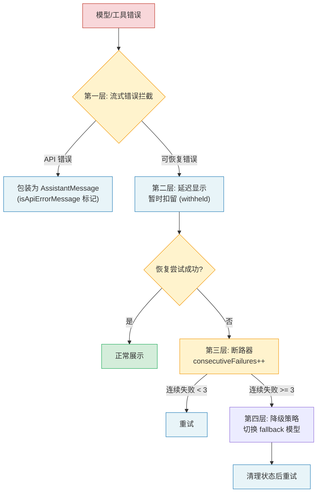

1. **流式错误拦截：** 模型返回的错误被包装为 `AssistantMessage`（`isApiErrorMessage` 标记），而非抛出异常
2. **延迟显示：** 可恢复错误（如 prompt-too-long）被暂时扣留（withheld），尝试恢复后再决定是否展示
3. **断路器：** 压缩失败次数被追踪（`consecutiveFailures`），达到阈值后停止重试
4. **降级策略：** 模型不可用时自动切换到 fallback 模型，清理状态后重试

断路器的实现尤为精妙。源码中 `autoCompactTracking` 的 `consecutiveFailures` 字段在每次压缩失败后递增，并在成功后重置。当连续失败次数超过阈值，循环直接退出而非无限重试。

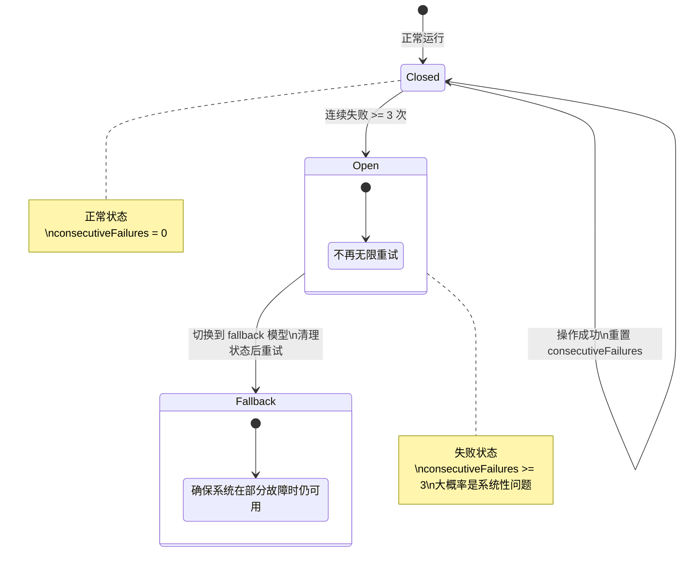

**断路器模式的设计维度：** 实现断路器时需要决定以下参数：

| 参数 | Claude Code 的选择 | 考量 |
|------|-------------------|------|
| 失败阈值 | 3 次连续失败 | 太低会过早放弃，太高浪费资源 |
| 恢复策略 | 成功时重置计数器 | 比半开（half-open）状态更简单 |
| 降级方案 | 切换到 fallback 模型 | 确保系统在部分故障时仍可用 |
| 超时时间 | 无固定超时 | 由循环级别的最大轮次限制控制 |

> **反模式警告：** 不要实现一个"永远不会触发"的断路器 -- 比如将阈值设为 100 次。断路器的价值在于快速失败（Fail Fast），过高的阈值等于没有断路器。Claude Code 选择 3 次的原因是：根据观测数据，如果连续 3 次压缩失败，大概率是系统性问题（如 API 服务降级），继续重试也不会成功。

### 可观测性的深度讨论

生产级 Agent Harness 的可观测性不仅是"记录日志"，而是一个系统化的分层设计：

**第一层：结构化日志。** 每个关键操作都输出结构化的日志条目，包含操作类型、持续时间、输入摘要和输出摘要。Claude Code 的做法是在关键路径上埋点记录消息数量、工具结果数量、查询链 ID 和查询深度等指标。

```
{
  "event": "tool_execution",
  "tool": "read_file",
  "duration_ms": 45,
  "input_size": 128,
  "output_size": 15234,
  "cache_hit": true,
  "query_chain_id": "abc123",
  "turn_number": 5
}
```

**第二层：聚合指标。** 从结构化日志中提取的聚合数据，用于仪表盘展示和告警。

- **延迟分布：** 每轮循环的模型调用耗时、工具执行耗时
- **Token 预算：** 输入/输出 Token 消耗趋势，压缩频率
- **错误率：** 按错误类型分类的失败率（模型错误、工具错误、权限拒绝）
- **行为指标：** 平均每轮工具调用数、平均完成轮次、用户中断率

**第三层：分布式追踪。** 在多 Agent 场景中，一个用户请求可能触发多个子 Agent。分布式追踪通过唯一的 `query_chain_id` 将所有相关的操作串联起来，使得你可以从一个用户请求出发，追踪到所有子 Agent 的行为。

**第四层：异常检测。** 基于历史数据的异常检测，自动识别异常行为模式：
- 单轮工具调用数异常增加 -- 可能是 Agent 陷入了循环
- Token 消耗突然飙升 -- 可能是工具返回了意外的大量数据
- 错误率突然上升 -- 可能是外部 API 出现问题

---

## 15.4 生产化考量

### 遥测与可观测性

生产环境的 Agent Harness 必须具备完善的可观测性。Claude Code 的做法值得参考：在关键路径上埋点记录消息数量、工具结果数量、查询链 ID 和查询深度等指标。

一个生产级 Harness 至少应追踪以下指标：

- **延迟分布：** 每轮循环的模型调用耗时、工具执行耗时
- **Token 预算：** 输入/输出 Token 消耗趋势，压缩频率
- **错误率：** 按错误类型分类的失败率（模型错误、工具错误、权限拒绝）
- **行为指标：** 平均每轮工具调用数、平均完成轮次、用户中断率

**可观测性的实施路线图：**

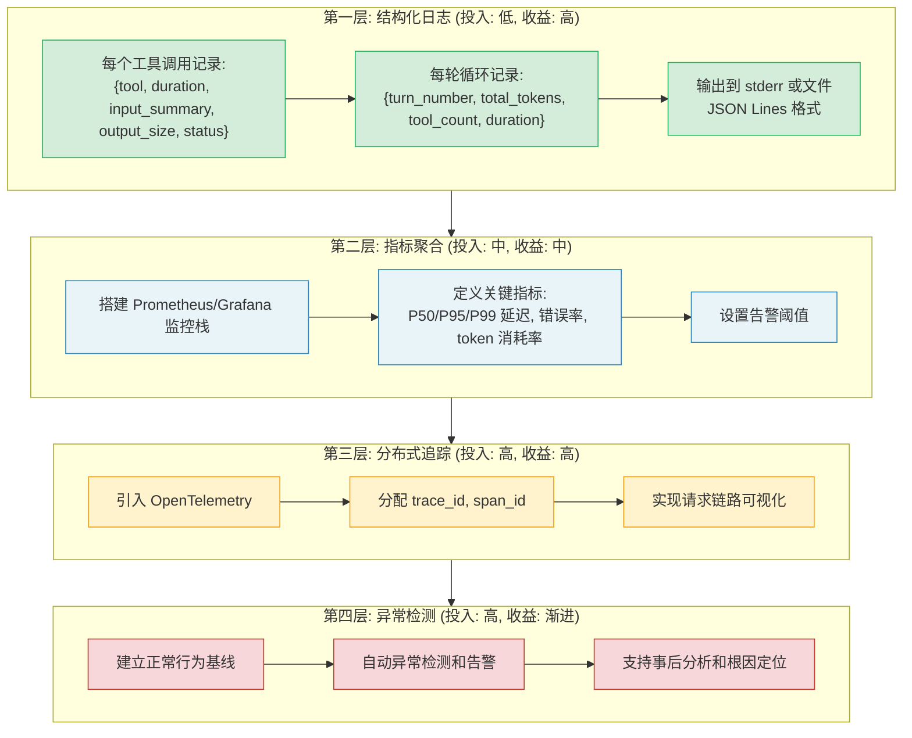

### 多环境适配：CLI / IDE / SDK / Server

Claude Code 的依赖注入模式提供了一种优雅的多环境适配方案。通过将 I/O 操作抽象为依赖注入接口（如模型调用、消息压缩、UUID 生成等），核心循环无需关心自己运行在何种环境中。

在 CLI 环境中，生产环境依赖提供真实的文件系统和模型调用。在测试中，可以注入模拟实现。在 SDK 模式中，可以替换为不同的 UI 反馈机制。这种 "核心 + 适配器" 的架构使得同一套 Harness 逻辑能够无缝运行在不同平台上。

关键的环境差异点包括：

| 环境 | 权限交互 | UI 渲染 | 钩子执行 | 会话存储 |
|------|----------|---------|----------|----------|
| CLI | 终端提示符 | Ink/React | Shell 命令 | 本地文件 |
| IDE (VS Code) | 弹窗 | WebView | 同上 | 同上 |
| SDK | 回调函数 | 无 | 同上 | 内存 |
| Server | 自动拒绝/允许 | 无 | HTTP 端点 | 数据库 |

**多环境适配的架构模式：**

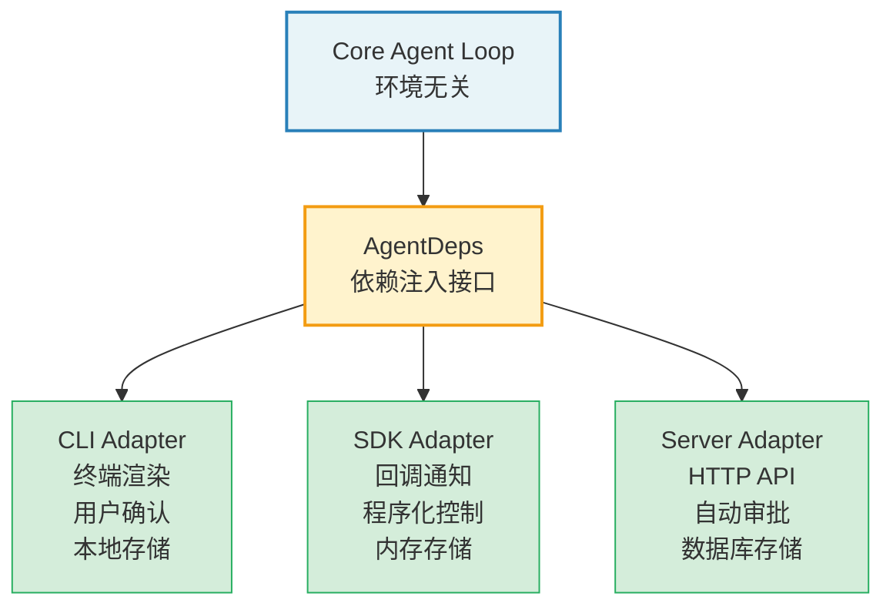

这种架构的核心原则是"核心不知道自己运行在哪里"。如果核心代码中出现任何 `if (isCLI) ... else if (isSDK) ...` 的分支判断，就说明依赖注入做得不够彻底 -- 环境差异应该被封装在适配器中，而不是在核心逻辑中做条件判断。

### 安全审计

Agent Harness 的安全边界比传统应用更复杂，因为 LLM 的输出是不可预测的。Claude Code 在安全方面采取了多层防御：

1. **工具权限分级：** 每个工具声明 `isReadOnly`、`isDestructive`、`isConcurrencySafe`，系统根据这些标记决定审批流程
2. **工作区信任检查：** `shouldSkipHookDueToTrust()` 确保钩子不会在不受信任的工作区执行
3. **输入净化：** `backfillObservableInput` 方法在工具输入传递给观察者之前进行清理，但不修改 API 绑定的原始输入（避免破坏 Prompt 缓存）
4. **预算上限：** `maxBudgetUsd` 参数限制单次查询的 Token 开销

**Agent 系统的安全威胁模型：**

Agent 系统面临的威胁与传统应用有本质不同。传统应用的威胁来自外部攻击者（注入恶意输入），而 Agent 系统的威胁来自 LLM 本身 -- 模型可能因为 prompt injection 而执行非预期的操作。

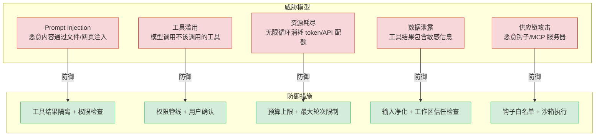

**安全审计 Checklist：**

- [ ] 每个工具都有正确的 `isReadOnly`/`isDestructive`/`isConcurrencySafe` 标记
- [ ] 权限管线在工具执行前完成所有检查（无绕过路径）
- [ ] 预算上限在每轮循环中检查，而非仅在整个会话结束时检查
- [ ] 工具结果的敏感信息在传递给模型前进行了净化
- [ ] 钩子命令在受信任的工作区中执行，不受信任的工作区自动跳过
- [ ] 子 Agent 的权限不超过父 Agent 的权限范围
- [ ] 所有权限决策都有审计日志

---

## 15.5 Agent Harness 的未来

### 多模态交互

当前的工具系统以文本为核心，但多模态交互正在改变这一格局。Claude Code 已经在处理图片输入（`ImageSizeError`、`ImageResizeError`）和 Computer Use 工具。未来的 Agent Harness 将需要：

- **原生多模态工具：** 工具的输入和输出不再局限于文本，而是包含图片、音频、视频
- **视觉理解工具：** 截图分析、UI 元素定位、图表解读
- **语音交互：** 语音输入触发工具调用，语音输出播报工具结果

多模态交互对 Agent Harness 的架构影响是深远的。当前的 `ContentBlock` 类型体系需要扩展以支持二进制数据，工具的 `inputSchema` 需要支持文件引用而非仅文本参数，流式传输需要支持分块的二进制数据。这些变化不是简单的功能添加，而是对核心数据模型的重构。

**多模态场景下的新挑战：**

| 挑战 | 描述 | 可能的解决方案 |
|------|------|--------------|
| 大型载荷 | 图片/视频可能有数十 MB | 分块传输 + 流式处理 + 压缩 |
| 成本控制 | 多模态 token 价格远高于文本 | 分辨率自适应 + 预处理过滤 |
| 缓存效率 | 图片内容难以做前缀匹配 | 语义级缓存而非字节级缓存 |
| 权限模型 | 截图可能包含敏感信息 | 内容审查 + 脱敏处理 |

### 长期运行智能体（Daemon 模式）

Claude Code 的 `taskSummaryModule` 和后台会话机制预示着一种新模式：智能体不再是一次性的命令行工具，而是长期运行的守护进程。这种 Daemon 模式的智能体具备：

- **持久化状态：** 跨会话保持上下文和记忆
- **事件驱动唤醒：** 文件变更、定时任务、外部通知触发行动
- **多智能体协作：** 主智能体协调多个子智能体（Claude Code 的 `AgentTool` 已实现此模式）
- **资源感知调度：** 根据 Token 预算、API 配额、系统负载智能调度任务

Daemon 模式的实现挑战远比一次性 Agent 复杂。首先是**状态持久化**：对话历史、记忆数据、权限配置都需要跨进程生命周期持久化。其次是**错误恢复**：Daemon 进程需要能从崩溃中恢复，恢复后的状态必须一致。再次是**资源管理**：长期运行意味着内存泄漏会随时间累积，需要精细的内存管理和定期清理。

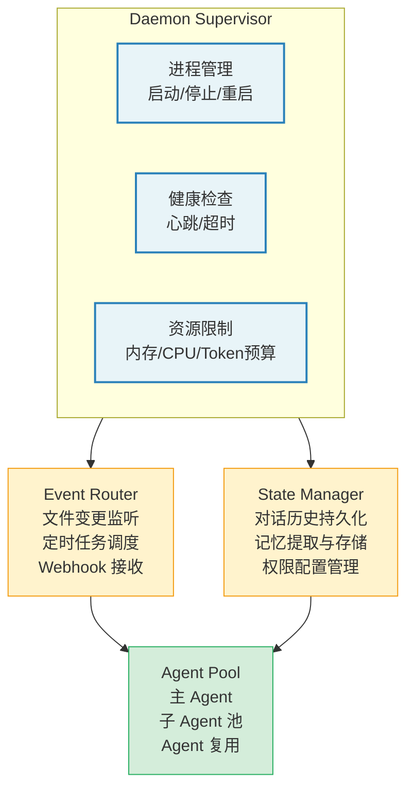

### 标准化协议（MCP 演进方向）

Model Context Protocol (MCP) 正在成为工具调用的事实标准。Claude Code 已经深度集成了 MCP：工具可以来自 MCP 服务器，`mcp_info` 字段追踪工具来源，`handleElicitation` 支持 MCP 服务器的交互式请求。

未来的 MCP 演进方向包括：

- **标准化工具发现：** 智能体在运行时动态发现可用工具
- **跨智能体通信协议：** 不同厂商的智能体通过 MCP 交换消息和工具调用
- **沙箱化执行：** MCP 服务器在隔离环境中执行工具，提供更强的安全保证
- **流式结果传输：** 工具执行结果通过 MCP 协议流式返回，支持长时间运行的工具

**MCP 对 Agent Harness 设计的影响：** MCP 的标准化意味着未来 Agent Harness 的工具系统将不再是封闭的。工具可以来自任何 MCP 兼容的服务器，Agent 不需要预先知道所有可用工具。这对权限系统提出了新的挑战 -- 如何为一个运行时才发现的工具设置权限规则？可能的解决方案包括：基于工具能力描述的自动权限推断、MCP 服务器级别的信任分级、以及更细粒度的沙箱隔离。

> **交叉引用：** MCP 集成的详细架构在第 12 章"MCP 集成与外部协议"中有完整分析。

### 未来架构的前瞻性分析

基于对 Claude Code 架构的深度分析和行业趋势的观察，我们可以预见 Agent Harness 的以下演进方向：

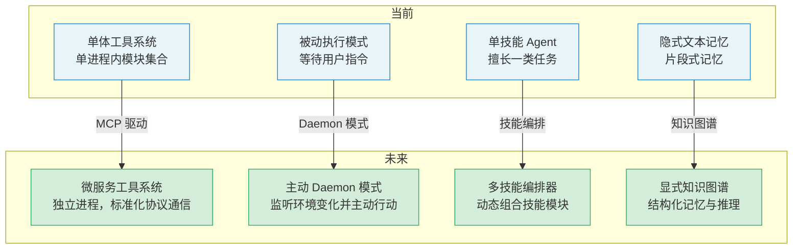

**1. 从单体到微服务**

当前 Claude Code 的工具系统是一个单进程内的模块集合。随着 MCP 的成熟，未来的 Agent Harness 可能采用微服务架构 -- 每个工具或工具组运行在独立的进程中，通过标准化的协议通信。这提供了更好的隔离性、可扩展性和独立部署能力。

**2. 从被动到主动**

当前 Agent 的执行模式是被动的 -- 等待用户指令后才行动。Daemon 模式将使 Agent 变为主动的 -- 它可以监听环境变化并主动采取行动。这对 Prompt 设计提出了新的要求：Agent 需要判断"这个变化是否需要通知用户"以及"这个问题我是否可以自主处理"。

**3. 从单技能到多技能编排**

当前一个 Agent 通常擅长一类任务。未来的 Agent Harness 可能是一个"技能编排器"，根据任务类型动态组合不同的技能模块。例如，一个代码变更的 Agent 自动编排代码分析、测试生成、代码审查、文档更新四个技能模块。

**4. 从隐式记忆到显式知识图谱**

当前的记忆系统是基于文本片段的隐式记忆。未来的记忆可能是结构化的知识图谱 -- Agent 不仅记住"用户喜欢 Jest"，还能记住"项目 A 使用 Jest，项目 B 使用 Vitest，因为..."。这种结构化记忆支持更精确的检索和推理。

---

## 实战练习

选择以下场景之一，设计一个完整的 Agent Harness 架构：

**场景 A：代码审查智能体**
- 工具集：Git 操作、文件读取、静态分析、评论发布
- 权限模型：只读模式 + 评论写入需确认
- 上下文策略：按 PR 维度压缩，保留变更摘要
- 钩子：自动运行 lint、类型检查，结果注入上下文

**场景 B：运维监控智能体**
- 工具集：日志查询、指标获取、部署操作、告警管理
- 权限模型：查询自动通过，操作需双人确认
- 上下文策略：滑动窗口 + 异常事件优先保留
- 钩子：Webhook 通知、审计日志记录

**场景 C：文档生成智能体**
- 工具集：代码分析、文档模板、版本对比、文件写入
- 权限模型：自动模式（信任写入目标目录）
- 上下文策略：项目级记忆，跨会话保持风格偏好
- 钩子：格式检查、链接验证

对于你选择的场景，请完成以下设计：

1. 绘制组件关系图（对话循环、工具系统、权限管线、上下文管理、记忆系统、钩子系统之间的调用关系）
2. 定义至少三个工具的完整 `buildTool` 定义
3. 设计权限管线的四个阶段检查逻辑
4. 选择压缩策略并说明触发条件
5. 定义至少两个钩子及其预期行为

### 延伸练习：实现一个最小 Agent Harness

基于本章的六步路线图，实现一个能运行的最小 Agent Harness。建议按以下顺序实现：

**Week 1: 对话循环 + 工具系统**
- 实现核心的 `agentLoop` 函数
- 实现 `buildTool` 工厂函数
- 定义 2-3 个基础工具（文件读取、文件列表、命令执行）
- 验证：能完成简单的"读取文件并回答问题"任务

**Week 2: 权限管线 + 上下文管理**
- 实现四阶段权限检查
- 实现简单的 snip 压缩策略
- 添加 token 计数和预算检查
- 验证：能安全地执行需要确认的操作，长对话不会溢出

**Week 3: 记忆系统 + 钩子系统**
- 实现简单的记忆提取和注入
- 实现 Shell 命令钩子执行器
- 添加 session_start 和 post_tool_use 钩子
- 验证：记忆跨会话保持，钩子能正确拦截和修改行为

**Week 4: 测试与生产化**
- 为核心组件编写单元测试
- 添加结构化日志
- 实现错误恢复和断路器
- 在真实项目中使用并收集反馈

---

## 关键要点

1. **循环状态模式：** 使用 `while(true)` + `State` 对象 + `continue` 管理循环状态，比递归调用更易调试和维护。Claude Code 的核心查询函数用约 1700 行代码实现了这一模式，处理了十余种状态转换路径。循环优于递归的三个理由：状态恢复更自然、中止更可控、调试更直观。

2. **工厂函数 + Fail-closed 默认值：** `buildTool` 模式让工具定义保持精简，默认值选择最保守的策略（不安全、有副作用、需确认），工具显式覆盖以声明安全性。这种 fail-closed 策略确保了新工具在安全审查通过之前不会产生危险行为。

3. **依赖注入隔离 I/O：** `QueryDeps` 模式将所有外部依赖抽象为可注入接口，使得核心逻辑可以在不同环境（CLI、SDK、测试）中复用。核心原则是"核心不知道自己运行在哪里" -- 环境差异封装在适配器中，而非在核心逻辑中做条件判断。

4. **渐进式压缩：** 多层压缩策略（裁剪、微压缩、摘要）根据 Token 使用率逐级触发，避免一刀切的信息丢失。选择压缩策略时需要考虑"什么信息最重要" -- 信息损失是相对的，关键在于保留对当前任务最有价值的部分。

5. **断路器保护：** 连续失败计数、最大恢复次数、降级策略 -- 这些机制确保智能体在面对持续错误时优雅降级，而非无限循环。Claude Code 选择 3 次连续失败作为阈值，基于实际观测数据：超过 3 次通常是系统性问题，重试无意义。

6. **特性开关驱动的渐进式发布：** 编译时特性开关让新功能可以安全地渐进发布，未启用的代码在产物中完全不存在。三层开关策略（编译时、运行时配置、远程特性标志）分别适用于不同的发布场景。

7. **安全纵深防御：** 从工具级别（`isDestructive`）到系统级别（工作区信任、预算上限），每一层都提供独立的安全保证。Agent 系统的安全威胁模型与传统应用有本质不同 -- LLM 的输出本身就是攻击向量，需要在每一层都建立防御。

8. **可观测性是生产化的基石：** 从结构化日志到聚合指标到分布式追踪，可观测性的四个层次为 Agent 系统的调试、优化和合规提供了基础。没有可观测性的 Agent 系统是一个黑箱，出了问题只能靠猜测。

---

**全书结语**

从第一章理解 Agent Harness 的概念，到本章亲手构建一个自定义实现，我们走过了一段完整的旅程。Claude Code 作为工业级 Agent Harness 的标杆，展示了这项技术在实际生产环境中的样貌：不是简单的 API 调用封装，而是一个融合了对话管理、工具编排、权限控制、上下文工程、记忆系统和可观测性的完整软件架构。

Agent Harness 代表了一种新的软件范式 -- 不是程序员告诉机器每一步该做什么，而是程序员构建一个框架，让机器在这个框架内自主决策。这个框架的质量，决定了智能体的能力上限和安全下限。

回望全书，我们看到了一个清晰的设计哲学：**在每一个决策点上，Claude Code 都选择了更安全、更可控、更可观测的方案。** 循环优于递归（更易调试）、fail-closed 默认值（更安全）、渐进式压缩（更可控）、断路器保护（更稳健）。这些选择单独看可能显得保守，但组合在一起构成了一个可以在生产环境中信赖的系统。

未来的软件开发者，需要同时掌握两种能力：传统的确定性编程，以及这种新的 "元编程" -- 为 AI 智能体构建 Harness。希望本书能为你在这条路上的探索提供一个坚实的起点。记住，最好的 Harness 不是限制智能体的能力，而是在确保安全的前提下，最大化释放智能体的潜力。
