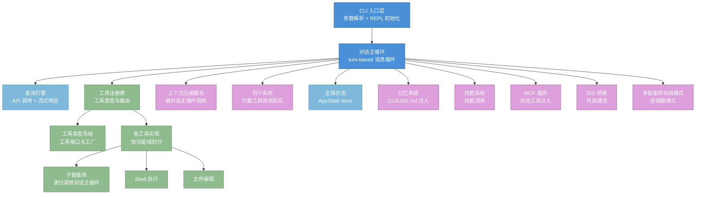
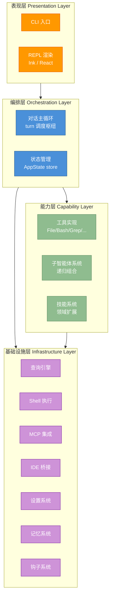
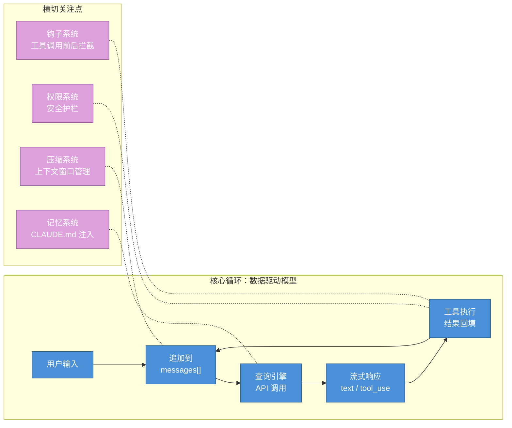
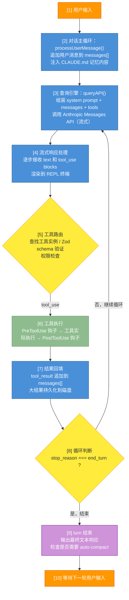
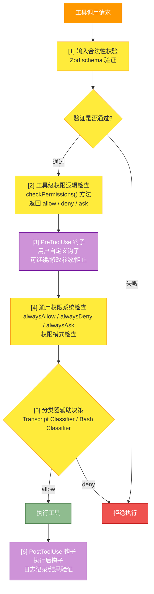
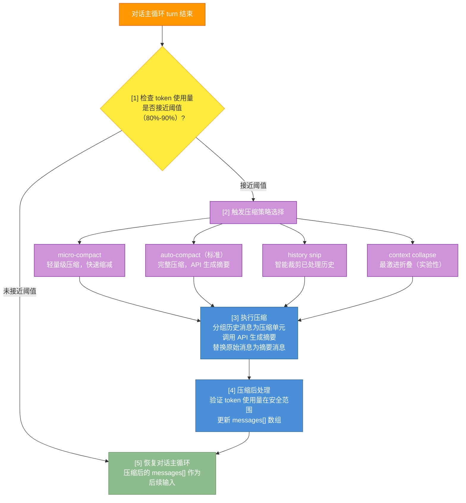
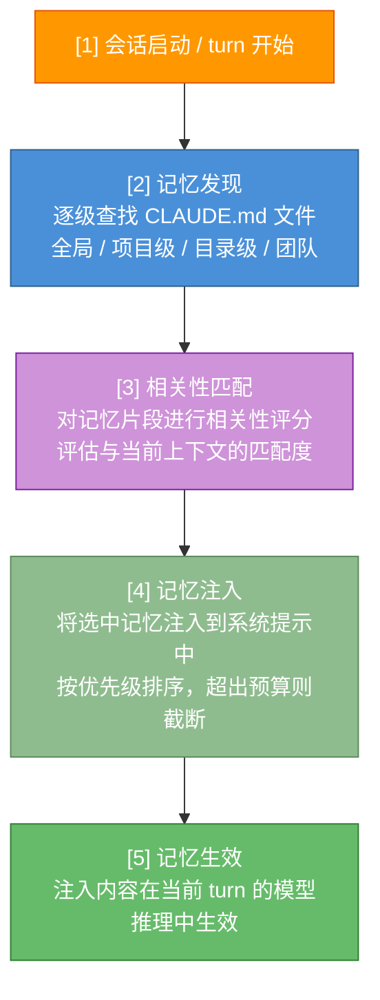
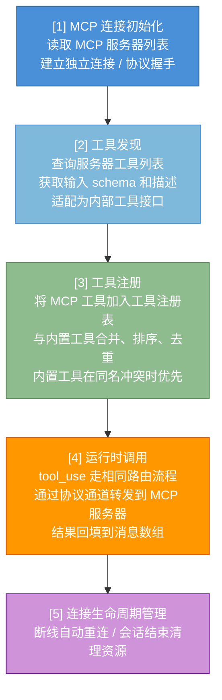
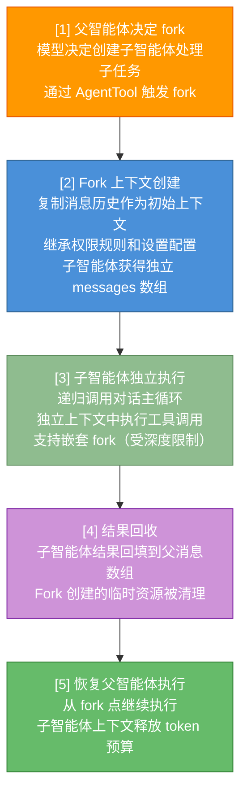

# 附录 A：架构导航地图

本附录为 Claude Code 系统架构的概念性导航，帮助读者从宏观层面理解各功能模块的职责与协作关系。无论你是想快速定位某个功能的架构归属，还是追踪一条完整的数据流路径，本地图都是你的首选参考。

**如何使用本地图**：
- 如果你初次阅读，建议按 A.1 -> A.2 -> A.3 的顺序通读，建立整体认知
- 如果你想查找某个具体模块，直接在 A.1 索引表中定位，再跳转到相关小节
- 如果你想理解某个功能的数据流，在 A.3 中查找对应的流程图
- 如果你关注模块间的协作契约，参考 A.4 的接口说明
- 本地图中的模块名称与本书正文各章节紧密对应，可交叉参阅

---

## A.1 核心模块索引表

下表列出 Claude Code 架构中的所有核心模块。每个模块包含职责描述、关键数据结构概述以及与正文章节的交叉引用。

| 模块名称 | 职责描述 | 关键数据结构 | 章节引用 |
|---------|---------|------------|---------|
| CLI 入口与 REPL | 命令行入口点，负责参数解析、REPL 交互循环的渲染与会话初始化。是整个系统的启动锚点，解析命令行标志后委派给对话主循环 | 命令行参数对象、REPL 渲染状态树 | 第 2 章 |
| 对话主循环 | 基于 turn 的对话循环，管理消息收发与工具调度的核心调度器。是系统的心脏，每个 turn 代表一轮"用户输入 -> 模型推理 -> 工具执行 -> 结果回填"的完整迭代 | messages 数组（Message[]）、turn 计数器、stop reason 状态 | 第 2 章 |
| 查询引擎 | 封装 API 调用、流式响应处理、重试逻辑的底层引擎。管理与 Anthropic Messages API 的所有通信，包括 system prompt 组装、token 计数和缓存策略 | API 请求配置、流式响应块（ContentBlock[]）、缓存断点标记 | 第 2 章、第 13 章 |
| 工具类型系统 | 工具的泛型接口定义、执行上下文与工具工厂函数。定义了所有工具必须遵循的标准协议，包括输入验证、权限检查、并发安全等维度 | 工具接口定义（Tool interface）、Zod 输入 schema、工具描述模板 | 第 3 章 |
| 工具注册表 | 全局工具注册、发现与组装，负责将内置工具与动态工具合并。运行时通过工具池组装函数将内置工具与 MCP 动态工具合并，按名称排序后去重 | 工具映射表（Map<name, Tool>）、已注册工具列表 | 第 3 章 |
| 子智能体系统 | 子智能体的生成、恢复、分叉（fork）及内置智能体定义。实现了智能体的递归组合能力，允许一个智能体在执行过程中派生出独立上下文的子任务执行者 | 子智能体配置、fork 状态快照、智能体恢复上下文 | 第 9 章、第 8 章 |
| Shell 执行引擎 | Shell 命令的权限校验、只读检测与安全沙箱执行。将 Shell 命令的执行抽象为统一的工具接口，包含命令注入防护、超时管理和输出截断 | 命令执行请求、输出流（stdout/stderr）、退出状态码 | 第 3 章、第 4 章 |
| 上下文压缩 | auto-compact、micro-compact、session memory 等多层压缩策略。在上下文接近 token 上限时自动触发，确保对话不会因窗口溢出而中断 | 压缩摘要消息、token 使用量计数、压缩阈值配置 | 第 7 章 |
| 钩子系统 | Pre/Post tool use hooks、session hooks 及异步钩子的注册与执行。提供了贯穿整个生命周期的扩展点机制，允许用户在关键事件节点注入自定义逻辑 | 钩子注册表、钩子执行上下文、钩子输出结果 | 第 8 章 |
| 设置系统 | 全局/项目/本地三级配置、权限规则定义与 schema 验证。采用层级叠加模型，确保配置的灵活性与可审计性 | 三级配置对象（Settings）、权限规则数组、Zod 验证 schema | 第 5 章 |
| 记忆系统 | CLAUDE.md 发现、嵌套记忆、团队记忆与相关性匹配。实现了智能体跨会话的知识持久化，通过层次化的记忆文件系统保留用户偏好和项目知识 | 记忆文件（CLAUDE.md）、记忆层级树、相关性匹配评分 | 第 6 章 |
| 技能系统 | 内置技能管理、动态加载与 slash command 注册。技能是可安装的扩展能力包，通过提示词模板和工具定义扩展智能体在特定领域的专业能力 | 技能注册表、slash command 映射、技能提示词模板 | 第 11 章 |
| MCP 集成 | MCP 连接管理、协议适配、资源读写与权限通道。实现了 Model Context Protocol 的完整客户端，允许外部工具服务器向模型提供上下文和可调用工具 | MCP 连接配置、资源描述符、工具能力声明 | 第 12 章 |
| IDE 桥接 | VSCode/JetBrains 双向通信、JWT 认证与远程会话管理。在 Claude Code CLI 与 IDE 插件之间建立安全的双向通信管道 | 桥接消息队列、JWT token、IDE 状态快照 | 第 7 章 |
| 协调器模式 | 多智能体协调场景下的 worker 分配与结果汇总。在多智能体协作中充当中枢角色，负责任务分发、进度跟踪和结果整合 | worker 注册表、任务队列、结果汇总状态 | 第 10 章 |
| 状态管理 | 全局应用状态 store、React 集成与 selector 模式。采用中心化的状态管理策略，通过 selector 模式实现高效的状态订阅和更新 | 全局状态树（AppState）、selector 函数、状态更新事件 | 第 2 章、第 13 章 |

> **导航提示**：上表中的"章节引用"列指向本书正文中对该模块有深入讨论的章节，建议结合正文阅读以获得完整理解。

---

## A.2 模块依赖关系

Claude Code 的核心依赖链如下（自上而下）：

### A.2.1 分层架构说明

Claude Code 的架构可以清晰地划分为四个层次，每一层都有明确的职责边界和依赖方向：

**表现层（Presentation Layer）**
- 包含 CLI 入口与 REPL 渲染模块
- 使用 Ink 框架（基于 React）将组件树渲染为终端文本输出
- 负责用户输入捕获、输出渲染、快捷键处理、主题切换等 UI 相关职责
- 不包含任何业务逻辑，所有用户操作都委派给下一层
- 依赖方向：仅向下依赖编排层

**编排层（Orchestration Layer）**
- 包含对话主循环和状态管理两大核心模块
- 对话主循环是整个系统的调度枢纽，协调查询引擎、工具注册表、压缩服务之间的协作
- 状态管理模块维护全局应用状态树，通过 selector 模式向表现层提供响应式的状态订阅
- 这一层的核心不变量是 turn 的完整性：每个 turn 必须走完"模型调用 -> 工具执行 -> 结果回填 -> 再次调用"的完整闭环
- 依赖方向：向下依赖能力层和基础设施层

**能力层（Capability Layer）**
- 包含所有工具实现、子智能体系统、技能系统
- 每个工具都是独立的能力单元，通过统一的工具接口与编排层对接
- 子智能体系统通过递归调用编排层的对话主循环来实现嵌套执行
- 技能系统作为更高级的能力扩展机制，可以组合多个工具形成领域专用的能力包
- 依赖方向：向下依赖基础设施层

**基础设施层（Infrastructure Layer）**
- 包含查询引擎、Shell 执行引擎、MCP 集成、IDE 桥接、设置系统、记忆系统、钩子系统
- 这一层的模块提供最底层的技术能力，不包含业务逻辑
- 查询引擎封装了与 Anthropic API 的所有通信细节
- 设置系统提供三级配置的存储和验证能力
- 记忆系统提供 CLAUDE.md 文件的发现和注入能力
- 依赖方向：不依赖上层，可被任何上层模块调用

### A.2.2 核心循环与数据驱动模型

**核心循环**：CLI 入口初始化 REPL -> 用户输入触发对话主循环的 turn 循环 -> 查询引擎发起 API 调用 -> 模型返回 tool_use -> 工具注册表路由到具体工具 -> 工具执行后结果回填 -> 再次调用 API，直到模型输出结束（stop reason = "end_turn"）。

核心循环体现了 Claude Code 的基本设计哲学：**数据驱动的循环模型**。系统不使用传统的命令式流程控制，而是通过消息数组的不断追加来驱动执行。每个 turn 的输入是一个不断增长的 messages 数组，模型的每次推理都基于这个数组的完整内容做出决策。

**横切关注点**：
- **钩子系统**（hooks）在工具调用前后插入拦截逻辑，允许用户在不修改核心代码的情况下扩展行为。参见第 8 章的详细讨论
- **权限系统**通过统一的权限检查函数决定是否允许执行，形成了贯穿所有工具执行的安全护栏。参见第 4 章的权限管线详解
- **压缩系统**在上下文接近 token 上限时自动触发，是对 context window 这一根本硬件约束的工程应对。参见第 7 章的上下文管理策略
- **记忆系统**在每轮开始时扫描 CLAUDE.md 并注入系统提示，实现了跨会话的知识持久化。参见第 6 章的记忆架构

### A.2.3 模块间耦合度分析

理解模块间的耦合程度有助于读者在阅读源码或进行扩展开发时把握正确的切入点：

| 耦合关系 | 耦合程度 | 说明 |
|---------|---------|------|
| 对话主循环 <-> 查询引擎 | 紧耦合 | 对话主循环直接依赖查询引擎的流式输出接口，两者共享消息数组的数据模型 |
| 对话主循环 <-> 工具注册表 | 紧耦合 | 工具调度是对话主循环的核心职责之一，工具路由逻辑嵌入在主循环的 turn 处理中 |
| 工具注册表 <-> MCP 集成 | 松耦合 | MCP 工具通过动态注册机制接入，运行时按需发现和加载 |
| 子智能体 <-> 对话主循环 | 递归耦合 | 子智能体通过递归调用对话主循环来实现嵌套执行，形成自相似的分形结构 |
| 钩子系统 <-> 工具执行 | 事件耦合 | 钩子通过生命周期事件触发，不影响工具执行的核心路径 |
| 记忆系统 <-> 查询引擎 | 松耦合 | 记忆内容作为系统提示的一部分注入，不直接参与 API 调用逻辑 |
| 设置系统 <-> 全局 | 配置耦合 | 设置系统通过配置对象影响几乎所有模块的行为，但模块间无直接依赖 |

---

## A.3 数据流路径速查

本节以流程图的形式展示 Claude Code 中几个关键操作的完整数据流。每个流程图都标注了经过的核心模块和关键决策点，帮助读者快速追踪数据在系统中的流转路径。

**快速导航**：
- [标准工具调用流程](#标准工具调用流程) -- 最核心的循环，理解 Claude Code 运行机制的起点
- [权限判定路径](#权限判定路径) -- 安全护栏的核心决策链
- [上下文压缩触发路径](#上下文压缩触发路径) -- 长对话的生命线
- [记忆注入路径](#记忆注入路径) -- 跨会话知识如何进入对话
- [MCP 工具动态注册路径](#mcp-工具动态注册路径) -- 外部能力如何接入系统
- [子智能体 Fork 执行路径](#子智能体-fork-执行路径) -- 任务的递归分解

### 标准工具调用流程

这是 Claude Code 最核心的数据流路径，描述了一个完整的 turn 中数据从用户输入到最终输出的流转过程。所有其他路径都是这个核心循环的变体或子集。

**关键决策点说明**：
- 步骤 [5] 的权限检查是系统中最重要的安全决策点，决定了工具是否被执行
- 步骤 [7] 的大结果持久化机制防止了 token 窗口被单个工具结果撑满
- 步骤 [8] 的循环条件（stop_reason）是整个系统从"无限循环"中退出的唯一机制

### 权限判定路径

权限管线是 Claude Code 安全模型的核心。每个工具调用都必须通过这条完整的决策链才能被执行。权限判定的结果决定了工具是否执行、是否需要用户确认、或者是否直接拒绝。

**权限模式的互动关系**：

| 权限模式 | 工具执行策略 | 用户体验 |
|---------|------------|---------|
| ask（默认） | 所有写操作都需要用户确认 | 最安全，但交互频繁 |
| auto-edit | 文件编辑自动放行，其他写操作仍需确认 | 平衡安全与效率 |
| full-auto | 所有操作自动执行（受 alwaysDeny 规则约束） | 最流畅，但风险最高 |
| plan | 仅允许只读工具，进入纯规划模式 | 用于安全审查任务方案 |

### 上下文压缩触发路径

上下文压缩是 Claude Code 应对 context window 限制的核心工程策略。当对话历史接近 token 上限时，系统会自动触发压缩以释放空间。

**压缩策略对比**：

| 策略 | 触发条件 | 压缩力度 | 质量损失 | 缓存友好 |
|------|---------|---------|---------|---------|
| micro-compact | 接近阈值时预防性触发 | 轻度 | 低 | 是（若启用 CACHED_MICROCOMPACT） |
| auto-compact | 达到阈值时触发 | 中度 | 中 | 取决于压缩范围 |
| history snip | 持续执行 | 中高度 | 中高 | 否 |
| context collapse | 手动或紧急触发 | 极高 | 高 | 否 |

### 记忆注入路径

记忆系统在每轮对话开始时将 CLAUDE.md 文件中的知识注入到对话上下文中，这是智能体实现跨会话知识持久化的关键路径。

### MCP 工具动态注册路径

MCP（Model Context Protocol）允许外部工具服务器动态地向 Claude Code 注册新工具，这是系统扩展性的重要机制。

### 子智能体 Fork 执行路径

子智能体通过 fork 机制创建独立执行单元，每个子智能体拥有自己的上下文和权限范围，但可以继承父智能体的关键配置。

---

## A.4 模块接口契约概述

本节从概念层面描述核心模块之间的接口契约，帮助读者理解模块间如何通过明确的接口进行协作。注意，此处描述的是架构设计模式，而非具体源码引用。

### A.4.1 对话主循环与查询引擎的契约

对话主循环通过查询引擎与 Anthropic Messages API 交互。两者之间的核心契约是：
- **输入**：system prompt、messages 数组、可用工具列表、模型配置参数
- **输出**：流式的内容块序列（text 或 tool_use），每个块都附带元数据
- **保证**：查询引擎负责处理网络重试、流式解析、错误恢复；对话主循环只关心内容块的语义

### A.4.2 对话主循环与工具注册表的契约

对话主循环通过工具注册表将模型返回的 tool_use 路由到具体的工具实现。核心契约是：
- **路由接口**：给定工具名称，返回对应的工具实例
- **执行接口**：给定工具实例和输入参数，执行工具并返回结构化结果
- **权限接口**：给定工具实例和输入参数，返回权限判定结果

### A.4.3 工具类型系统的标准协议

所有工具（包括内置工具和 MCP 动态工具）都必须遵循工具类型系统定义的标准协议。核心协议方法包括：
- **isEnabled()**：判断工具是否在当前上下文中启用
- **isReadOnly()**：判断工具是否仅执行读取操作
- **isConcurrencySafe()**：判断工具是否可安全并行执行
- **isDestructive()**：判断工具是否执行不可逆操作
- **checkPermissions()**：执行权限检查，返回 allow/deny/ask
- **toAutoClassifierInput()**：生成用于自动分类的特征描述
- **userFacingName()**：返回面向用户的友好名称

### A.4.4 钩子系统的生命周期契约

钩子系统定义了三个核心生命周期扩展点：
- **PreToolUse**：在工具执行前触发，可以修改输入参数或阻止执行
- **PostToolUse**：在工具执行后触发，可以处理执行结果或记录日志
- **Session Hooks**：在会话级别的事件（如会话开始、会话结束）触发

每个钩子都接收结构化的上下文对象，包含事件类型、工具信息、输入输出数据等。

---

## A.5 架构设计模式速览

Claude Code 的架构中体现了多种经典设计模式，理解这些模式有助于读者更深入地把握系统的设计意图。

| 设计模式 | 应用位置 | 设计意图 |
|---------|---------|---------|
| Agent Loop（智能体循环） | 对话主循环 | 将 LLM 的推理能力与工具执行结合为迭代循环，直到任务完成 |
| Factory Method（工厂方法） | 工具类型系统 | 通过统一工厂函数创建工具实例，确保所有工具遵循相同接口 |
| Registry（注册表模式） | 工具注册表、技能注册表 | 通过名称注册和查找能力单元，支持运行时动态扩展 |
| Plugin（插件模式） | MCP 集成、技能系统 | 允许外部模块在不修改核心代码的情况下扩展系统能力 |
| Observer（观察者模式） | 钩子系统 | 在生命周期事件上注册观察者，实现松耦合的横切关注点 |
| Strategy（策略模式） | 上下文压缩 | 多种压缩策略可互换使用，根据场景选择最优策略 |
| Layered Architecture（分层架构） | 整体系统 | 表现层 -> 编排层 -> 能力层 -> 基础设施层的清晰分层 |
| Async Generator（异步生成器模式） | 查询引擎、流式输出 | 使用 async function* 逐步产出流式结果，天然支持背压控制 |
| Hierarchical Agent（层级智能体） | 子智能体系统 | 通过 fork 实现智能体的层级组合，形成分形结构 |
| Feature Flag（功能标志模式） | 全系统 | 编译时注入布尔开关，实现死代码消除和渐进式功能发布 |
