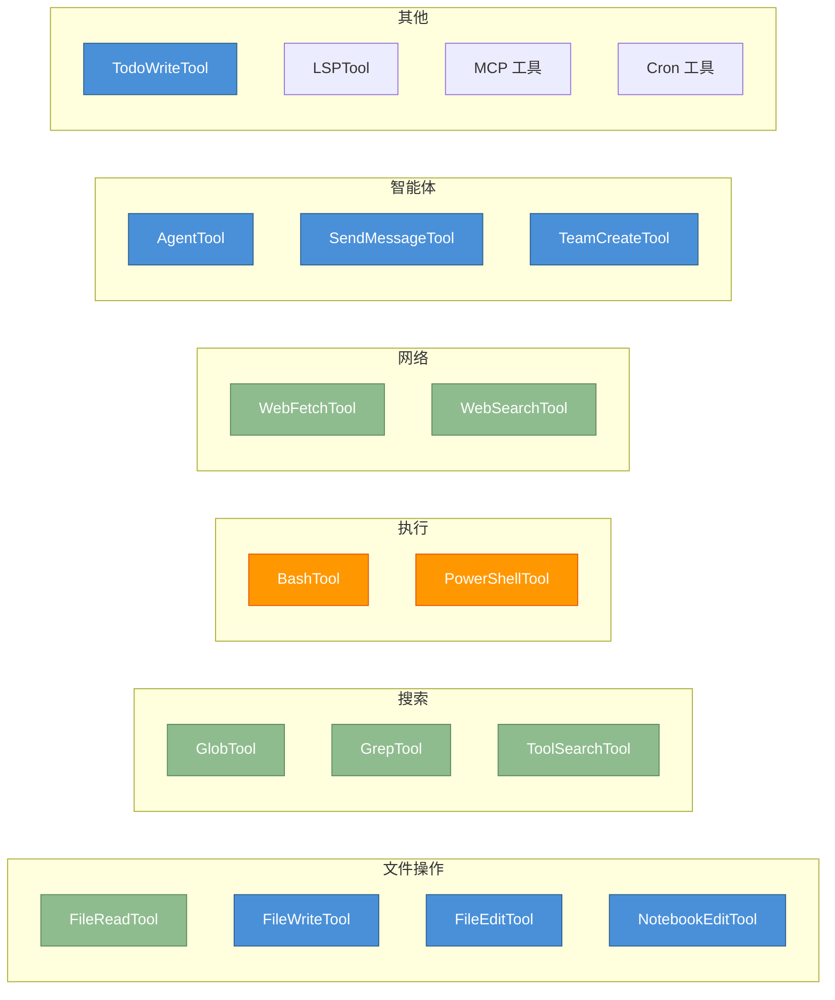
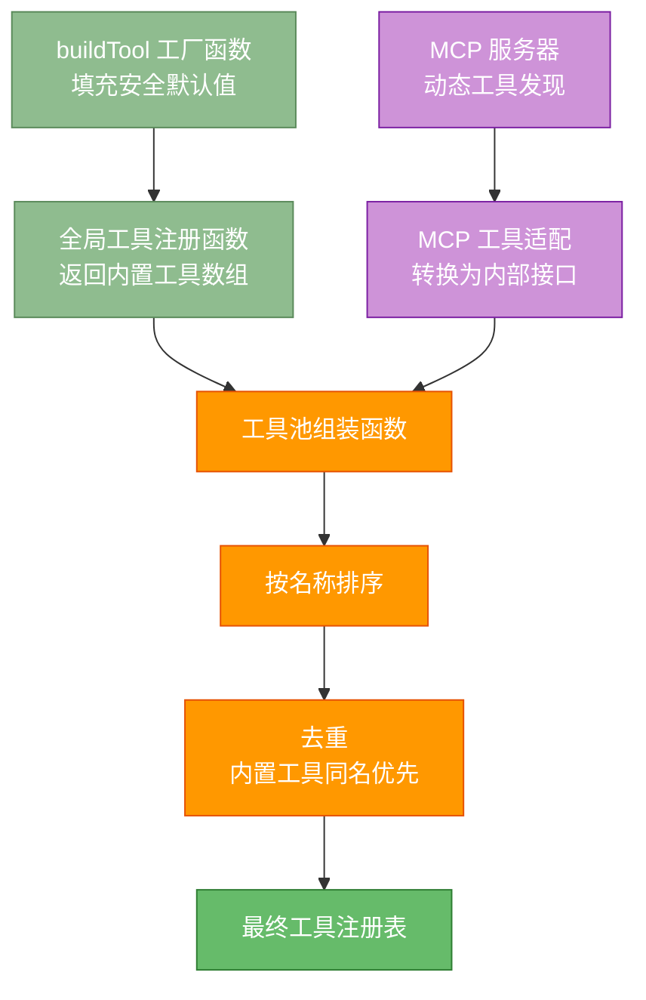
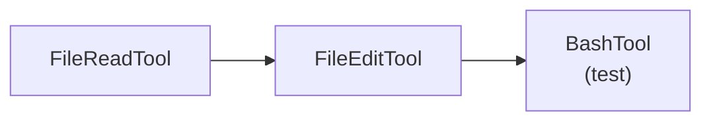
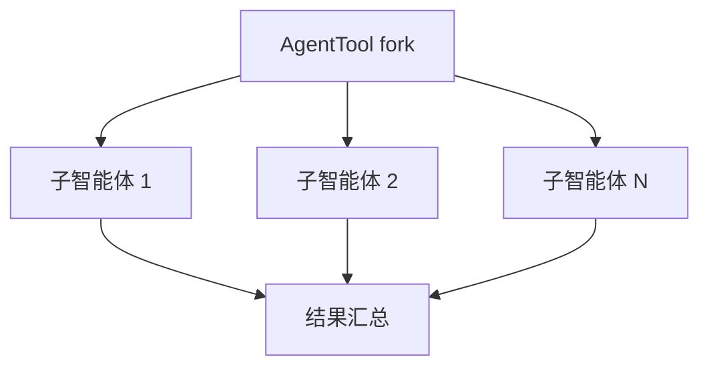

# 附录 B：工具完整清单

本附录列出 Claude Code 架构中注册的全部工具，按功能分类索引。工具是智能体与外部世界交互的基本能力单元，每个工具都通过统一的接口协议注册到工具注册表中，接受对话主循环的调度。

**权限模型字段含义**：
- **readOnly**：工具是否仅执行读取操作，不修改文件系统或外部状态。只读工具通常权限约束更宽松，在 plan 模式下也可使用
- **destructive**：工具是否执行不可逆操作（删除、覆盖、发送）。破坏性工具在权限检查中会受到更严格的审查
- **concurrencySafe**：工具是否可安全并行执行（不依赖共享可变状态）。并行安全的工具可以被流式工具执行器同时调度

表中 `true`/`false` 表示始终返回该值；`动态` 表示根据输入参数运行时判定。未在源码中显式覆盖的方法使用 `buildTool` 默认值（均为 `false`）。

> **交叉参考**：工具的定义协议详见附录 A.4.3 "工具类型系统的标准协议"；工具的注册与发现机制参见第 3 章；工具的权限检查流程参见附录 A.3 "权限判定路径"。

---

## 1. 文件操作

文件操作工具是智能体处理代码和数据的基础能力。这组工具覆盖了从读取到编辑到创建的完整文件操作链。

| 工具名称 | readOnly | destructive | concurrencySafe | 简要说明 |
|---------|----------|-------------|-----------------|---------|
| FileReadTool | `true` | `false` | `true` | 读取文件内容，支持行号范围、PDF 分页、图片、notebook 格式 |
| FileWriteTool | `false` | `false` | `false` | 写入文件，覆盖已有内容或创建新文件 |
| FileEditTool | `false` | `false` | `false` | 精确字符串替换式编辑，支持单处/全局替换 |
| NotebookEditTool | `false` | `false` | `false` | 编辑 Jupyter Notebook 单元格（替换/插入/删除） |

**使用场景详解**：
- **FileReadTool**：适用于代码审查（逐段读取大文件）、文档分析（PDF 分页读取）、图片理解（多模态输入）等场景。其并发安全性使得可以同时读取多个文件来加速信息收集
- **FileWriteTool**：适用于创建新文件（如配置文件、脚手架代码）或完全重写文件内容。由于写入是不可逆的，建议在重要文件上先使用 FileReadTool 确认当前内容
- **FileEditTool**：适用于精确修改已有文件中的特定内容。其字符串匹配机制确保修改位置的准确性，`replace_all` 模式支持批量重命名等操作。这是日常代码编辑中最常用的工具
- **NotebookEditTool**：专门为 Jupyter Notebook 设计，支持在特定位置插入代码或 markdown 单元格、修改已有单元格内容、删除单元格。适用于数据分析和科学计算场景

**工具间的协作模式**：典型的代码修改工作流为 `FileReadTool -> 分析 -> FileEditTool/FileWriteTool`。先读取理解现状，再决定使用精确编辑还是整体重写。

## 2. 搜索

搜索工具是智能体在代码库中定位信息的基础能力。文件名搜索和内容搜索互为补充，覆盖了从结构定位到语义查找的完整搜索需求。

| 工具名称 | readOnly | destructive | concurrencySafe | 简要说明 |
|---------|----------|-------------|-----------------|---------|
| GlobTool | `true` | `false` | `true` | 文件名 glob 模式匹配搜索，按修改时间排序 |
| GrepTool | `true` | `false` | `true` | 基于 ripgrep 的正则内容搜索，支持多模式输出 |
| ToolSearchTool | `false` | `false` | `false` | 工具发现搜索，按关键词匹配延迟加载的工具 |

**使用场景详解**：
- **GlobTool**：适用于按文件类型（如 `**/*.ts`）、按目录结构（如 `src/**/*.test.js`）、按修改时间（最新变更的文件排在前面）查找文件。常用于项目结构探索和变更文件定位
- **GrepTool**：适用于在文件内容中搜索特定模式，支持正则表达式。三种输出模式（files_with_matches、content、count）满足不同需求。常用于 API 使用查找、配置项定位、代码模式分析
- **ToolSearchTool**：当可用工具数量很多时（特别是启用 MCP 动态工具后），此工具帮助模型按关键词快速定位需要的工具，避免将所有工具描述都纳入上下文

**搜索策略推荐**：
- 探索陌生项目时：先用 GlobTool 了解文件结构，再用 GrepTool 搜索关键符号
- 定位特定代码时：GrepTool 的 content 模式最为高效
- 统计代码规模时：GrepTool 的 count 模式配合 GlobTool 的文件列表

## 3. 执行

执行工具是智能体与操作系统交互的桥梁。BashTool 是通用性最强的工具之一，几乎所有命令行操作都通过它完成。

| 工具名称 | readOnly | destructive | concurrencySafe | 简要说明 |
|---------|----------|-------------|-----------------|---------|
| BashTool | `动态` | `false` | `动态` | Shell 命令执行，只读命令可并行，写命令串行。权限依据命令内容动态判定 |
| PowerShellTool | `动态` | `false` | `动态` | Windows PowerShell 命令执行（条件启用，功能与 BashTool 对等） |

**使用场景详解**：
- **BashTool**：这是 Claude Code 中使用频率最高的工具之一。适用于：构建和测试（`npm test`、`cargo build`）、版本控制（`git` 操作）、系统管理（文件操作、进程管理）、脚本执行、包管理等。其 `readOnly` 和 `concurrencySafe` 属性是动态判定的，取决于命令内容
- **PowerShellTool**：在 Windows 环境中自动替代 BashTool，提供等效的命令执行能力。仅在检测到 Windows PowerShell 环境时启用

**执行工具的特殊机制**：
- **只读检测**：BashTool 内部维护一个只读命令清单，匹配到的命令（如 `ls`、`cat`、`git status`）被标记为 readOnly，可以在权限更宽松的条件下执行
- **并行执行**：当多个 BashTool 调用都被判定为 concurrencySafe 时，流式工具执行器可以并行调度它们，显著提升效率
- **超时管理**：长时间运行的命令有超时机制，防止无限阻塞
- **输出截断**：命令输出超过限制时会被截断，剩余部分持久化到磁盘

## 4. 网络

网络工具为智能体提供了访问互联网信息的能力，包括网页内容获取和网络搜索两种互补的方式。

| 工具名称 | readOnly | destructive | concurrencySafe | 简要说明 |
|---------|----------|-------------|-----------------|---------|
| WebFetchTool | `true` | `false` | `true` | 抓取 URL 内容并转换为 markdown |
| WebSearchTool | `true` | `false` | `true` | 执行网络搜索，返回结构化搜索结果 |

**使用场景详解**：
- **WebFetchTool**：适用于获取特定网页的完整内容（如 API 文档、技术博客）。将 HTML 转换为 markdown 格式，便于模型理解和引用。常用于查阅最新文档和验证技术细节
- **WebSearchTool**：适用于开放式信息查询。返回结构化的搜索结果（标题、摘要、链接），帮助模型快速了解某个主题的最新信息。常用于技术调研和问题排查

**组合使用模式**：先用 WebSearchTool 进行广度搜索，定位相关资源后用 WebFetchTool 深度获取具体页面内容。

## 5. 智能体

智能体工具实现了 Claude Code 的递归组合能力，允许智能体创建和管理子智能体、在多智能体之间通信、以及组建协作团队。

| 工具名称 | readOnly | destructive | concurrencySafe | 简要说明 |
|---------|----------|-------------|-----------------|---------|
| AgentTool | `false` | `false` | `false` | 启动子智能体（内置/自定义），支持 fork、resume、后台执行 |
| SendMessageTool | `动态` | `false` | `false` | 向其他智能体或频道发送消息，纯文本消息为 readOnly |
| TeamCreateTool | `false` | `false` | `false` | 创建多智能体团队（条件启用：Agent Swarms 模式） |
| TeamDeleteTool | `false` | `false` | `false` | 删除已创建的团队 |

**使用场景详解**：
- **AgentTool**：核心的子智能体管理工具。适用于将复杂任务分解为子任务并行处理、调用内置智能体（如 ExploreAgent、PlanAgent）完成特定阶段、在隔离的上下文中执行高风险操作等。参见第 9 章子智能体详解
- **SendMessageTool**：在多智能体场景中用于跨智能体通信。支持向特定智能体或频道发送消息。参见第 10 章协调器模式
- **TeamCreateTool / TeamDeleteTool**：在 Agent Swarms 模式下用于创建和管理多智能体团队。团队中的智能体可以并行处理分配给它们的子任务

## 6. 任务管理

任务管理工具提供了后台任务的生命周期管理能力，从创建到监控到停止的完整控制链。

| 工具名称 | readOnly | destructive | concurrencySafe | 简要说明 |
|---------|----------|-------------|-----------------|---------|
| TaskCreateTool | `false` | `false` | `false` | 创建后台任务（条件启用：Todo V2） |
| TaskGetTool | `true` | `false` | `true` | 获取单个任务详情 |
| TaskUpdateTool | `false` | `false` | `false` | 更新任务状态/内容 |
| TaskListTool | `true` | `false` | `true` | 列出所有任务 |
| TaskOutputTool | `动态` | `false` | `动态` | 获取任务输出流，readOnly 时 concurrencySafe |
| TaskStopTool | `false` | `false` | `true` | 停止正在运行的任务 |

**使用场景详解**：任务管理工具组构成了一个完整的 CRUD + 监控接口。典型工作流为：TaskCreateTool 创建任务 -> TaskListTool 查看进度 -> TaskGetTool 检查详情 -> TaskOutputTool 获取输出 -> TaskStopTool 在需要时停止任务。

## 7. 计划

计划模式工具提供了安全规划的能力，在执行前先制定方案。

| 工具名称 | readOnly | destructive | concurrencySafe | 简要说明 |
|---------|----------|-------------|-----------------|---------|
| EnterPlanModeTool | `true` | `false` | `true` | 进入计划模式，限制为只读工具集 |
| ExitPlanModeV2Tool | `true` | `false` | `true` | 退出计划模式，恢复正常工具权限 |

**使用场景详解**：计划模式是一种安全策略，在进入后智能体只能使用只读工具（如 FileReadTool、GrepTool）进行信息收集和分析，不能执行任何修改操作。适用于在执行复杂变更前进行方案设计、风险评估和影响分析。参见第 14 章结构化工作流。

## 8. 工作树

工作树工具为并行任务提供文件系统级别的隔离。

| 工具名称 | readOnly | destructive | concurrencySafe | 简要说明 |
|---------|----------|-------------|-----------------|---------|
| EnterWorktreeTool | `false` | `false` | `false` | 创建 git worktree 并切换工作目录（条件启用） |
| ExitWorktreeTool | `false` | `false` | `false` | 退出 worktree，保留或移除工作目录 |

**使用场景详解**：工作树工具基于 git worktree 实现工作目录隔离。适用于多个子智能体并行处理不同任务时避免文件冲突、在不影响主工作区的情况下进行实验性修改、在不同分支上同时工作等场景。

## 9. 调度

调度工具提供了时间驱动的自动化能力，允许智能体按计划执行任务。

| 工具名称 | readOnly | destructive | concurrencySafe | 简要说明 |
|---------|----------|-------------|-----------------|---------|
| CronCreateTool | `false` | `false` | `false` | 创建 cron 定时任务（条件启用：AGENT_TRIGGERS） |
| CronDeleteTool | `false` | `false` | `false` | 删除 cron 定时任务 |
| CronListTool | `true` | `false` | `true` | 列出所有 cron 定时任务 |
| RemoteTriggerTool | `动态` | `false` | `false` | 远程触发器管理（条件启用：AGENT_TRIGGERS_REMOTE） |

**使用场景详解**：调度工具组实现了智能体的时间驱动自动化。CronCreateTool 支持标准 cron 表达式定义执行计划，适用于定期代码审查、自动化测试、定时报告生成等场景。RemoteTriggerTool 扩展了触发能力到远程环境。

## 10. 交互

交互工具管理智能体与用户以及其他系统组件之间的交互。

| 工具名称 | readOnly | destructive | concurrencySafe | 简要说明 |
|---------|----------|-------------|-----------------|---------|
| AskUserQuestionTool | `true` | `false` | `true` | 向用户提问并等待回复 |
| SkillTool | `false` | `false` | `false` | 调用已注册的 slash command 技能 |
| ConfigTool | `动态` | `false` | `false` | 运行时配置查看/修改（仅 ant 构建可用） |

**使用场景详解**：
- **AskUserQuestionTool**：当智能体在执行过程中遇到歧义或需要额外信息时，通过此工具向用户提问。这是智能体与用户之间的主动沟通渠道
- **SkillTool**：调用通过技能系统注册的 slash command。技能是可扩展的能力包，通过提示词模板和工具定义扩展智能体在特定领域的专业能力。参见第 11 章技能系统

## 11. MCP

MCP 工具提供了与 MCP 服务器交互的能力，让智能体可以访问外部资源。

| 工具名称 | readOnly | destructive | concurrencySafe | 简要说明 |
|---------|----------|-------------|-----------------|---------|
| ListMcpResourcesTool | `true` | `false` | `true` | 列出 MCP 服务器提供的资源 |
| ReadMcpResourceTool | `true` | `false` | `true` | 读取 MCP 服务器上的特定资源 |

**使用场景详解**：MCP 工具是 Model Context Protocol 客户端的资源访问接口。ListMcpResourcesTool 用于发现可用的外部资源（如数据库表、API 端点），ReadMcpResourceTool 用于读取特定资源的内容。这两个工具都是只读的，可以安全并行执行。参见第 12 章 MCP 集成。

## 12. 其他

| 工具名称 | readOnly | destructive | concurrencySafe | 简要说明 |
|---------|----------|-------------|-----------------|---------|
| TodoWriteTool | `false` | `false` | `false` | 待办事项面板写入（UI 联动，结果不渲染到 transcript） |
| BriefTool | `false` | `false` | `true` | 控制输出简洁性模式 |
| LSPTool | `true` | `false` | `true` | LSP 语言服务协议操作（条件启用：ENABLE_LSP_TOOL） |
| SleepTool | `false` | `false` | `false` | 延时等待（条件启用：PROACTIVE / KAIROS） |
| TungstenTool | `false` | `false` | `false` | 内部工具（仅 ant 构建可用） |
| SyntheticOutputTool | `true` | `false` | `true` | 合成输出工具（内部基础设施） |
| SnipTool | `false` | `false` | `false` | 历史消息裁剪（条件启用：HISTORY_SNIP） |
| MonitorTool | `false` | `false` | `false` | 监控工具（条件启用：MONITOR_TOOL） |
| WorkflowTool | `false` | `false` | `false` | 工作流脚本执行（条件启用：WORKFLOW_SCRIPTS） |
| ListPeersTool | `false` | `false` | `false` | 列出对等智能体（条件启用：UDS_INBOX） |
| REPLTool | `false` | `false` | `false` | REPL 包装器，在 VM 中提供 Bash/Read/Edit（仅 ant 构建） |
| SuggestBackgroundPRTool | `false` | `false` | `false` | 建议后台 PR 创建（仅 ant 构建） |
| WebBrowserTool | `false` | `false` | `false` | 浏览器工具（条件启用：WEB_BROWSER_TOOL） |
| SendUserFileTool | `false` | `false` | `false` | 向用户发送文件（条件启用：KAIROS） |
| PushNotificationTool | `false` | `false` | `false` | 推送通知（条件启用：KAIROS） |
| SubscribePRTool | `false` | `false` | `false` | PR Webhook 订阅（条件启用：KAIROS_GITHUB_WEBHOOKS） |
| CtxInspectTool | `false` | `false` | `false` | 上下文检查器（条件启用：CONTEXT_COLLAPSE） |
| TerminalCaptureTool | `false` | `false` | `false` | 终端截图捕获（条件启用：TERMINAL_PANEL） |
| VerifyPlanExecutionTool | `false` | `false` | `false` | 计划执行验证（条件启用：CLAUDE_CODE_VERIFY_PLAN） |
| OverflowTestTool | `false` | `false` | `false` | 溢出测试工具（内部测试用） |
| TestingPermissionTool | `true` | `false` | `true` | 权限测试工具（仅 NODE_ENV=test） |

---

## 工具启用条件速查

部分工具通过 feature flag 或环境变量条件启用。下表列出了所有条件启用工具及其对应的标志：

| 条件标识 | 启用的工具 | 对应章节 |
|---------|----------|---------|
| `USER_TYPE === 'ant'` | ConfigTool, TungstenTool, REPLTool, SuggestBackgroundPRTool | -- |
| `PROACTIVE` / `KAIROS` | SleepTool | 第 5 章 |
| `AGENT_TRIGGERS` | CronCreateTool, CronDeleteTool, CronListTool | 第 9 章 |
| `AGENT_TRIGGERS_REMOTE` | RemoteTriggerTool | 第 9 章 |
| `MONITOR_TOOL` | MonitorTool | 第 7 章 |
| `KAIROS` | SendUserFileTool, PushNotificationTool | 第 6 章 |
| `KAIROS_GITHUB_WEBHOOKS` | SubscribePRTool | 第 6 章 |
| `ENABLE_LSP_TOOL` | LSPTool | 第 7 章 |
| `WORKFLOW_SCRIPTS` | WorkflowTool | 第 9 章 |
| `HISTORY_SNIP` | SnipTool | 第 4 章 |
| `UDS_INBOX` | ListPeersTool | 第 7 章 |
| `WEB_BROWSER_TOOL` | WebBrowserTool | 第 7 章 |
| `CONTEXT_COLLAPSE` | CtxInspectTool | 第 4 章 |
| `TERMINAL_PANEL` | TerminalCaptureTool | 第 12 章 |
| `COORDINATOR_MODE` | coordinator 模式额外启用 AgentTool, TaskStopTool, SendMessageTool | 第 8 章 |
| `Todo V2` | TaskCreateTool, TaskGetTool, TaskUpdateTool, TaskListTool | -- |
| `Agent Swarms` | TeamCreateTool, TeamDeleteTool | 第 8 章 |
| `Worktree Mode` | EnterWorktreeTool, ExitWorktreeTool | 第 9 章 |
| `CLAUDE_CODE_SIMPLE` | 精简模式仅保留 BashTool, FileReadTool, FileEditTool | -- |
| `ToolSearch` | ToolSearchTool | 第 3 章 |
| `CLAUDE_CODE_VERIFY_PLAN` | VerifyPlanExecutionTool | 第 14 章 |

> **交叉参考**：功能标志的详细说明参见附录 C；工具的动态注册机制参见附录 A.3 "MCP 工具动态注册路径"。

---

## 工具注册流程

所有工具通过统一的工具工厂函数创建，该函数为未显式定义的方法填充安全默认值：

- `isEnabled()` 默认返回 `true`
- `isReadOnly()` 默认返回 `false`
- `isConcurrencySafe()` 默认返回 `false`
- `isDestructive()` 默认返回 `false`
- `checkPermissions()` 默认返回允许（allow）
- `toAutoClassifierInput()` 默认返回空字符串
- `userFacingName()` 默认返回工具名称

工具注册入口在全局工具注册函数中，返回一个工具数组。运行时通过工具池组装函数将内置工具与 MCP 动态工具合并，按名称排序后去重（内置工具优先）。

---

## 工具组合使用推荐模式

以下列出几种常用的工具组合模式，帮助读者理解工具间的协作关系：

### 模式一：代码探索与理解

先用 GlobTool 定位文件结构，用 GrepTool 搜索关键符号，用 FileReadTool 阅读具体代码。

### 模式二：代码修改

先读取目标文件，使用 FileEditTool 进行精确修改，然后用 BashTool 运行测试验证。

### 模式三：信息调研

先用 WebSearchTool 搜索相关信息，用 WebFetchTool 获取具体页面内容，最后用 FileWriteTool 整理结果。

### 模式四：多任务并行

通过 AgentTool fork 出多个子智能体，每个子智能体独立处理子任务，最终由父智能体汇总结果。

### 模式五：安全规划

先进入计划模式进行安全分析，完成规划后退出计划模式开始执行。

### 模式六：外部集成

通过 MCP 工具访问外部资源，结合本地工具进行处理。

---

## 工具性能特征概览

理解工具的性能特征有助于在使用时做出合理的选择：

| 工具类别 | 典型延迟 | Token 消耗 | 并行能力 | 注意事项 |
|---------|---------|----------|---------|---------|
| 文件读取 | 低（本地 I/O） | 中（取决于文件大小） | 高（均并发安全） | 大文件输出会被截断 |
| 文件写入 | 低（本地 I/O） | 低 | 不支持并行 | 写入前建议先读取确认 |
| 文件编辑 | 低（本地 I/O） | 低 | 不支持并行 | 需精确匹配原始字符串 |
| 搜索（Glob/Grep） | 低（本地操作） | 中（取决于结果量） | 高（均并发安全） | 结果量限制防止 token 溢出 |
| Bash 执行 | 可变（取决于命令） | 可变（取决于输出） | 只读命令可并行 | 长时间命令有超时机制 |
| 网络操作 | 高（网络延迟） | 中（取决于页面内容） | 高（均并发安全） | 受网络状况影响大 |
| 子智能体 | 高（递归 API 调用） | 高（独立上下文） | 高（独立执行） | 注意嵌套深度限制 |
| MCP 操作 | 中（进程间通信） | 中（取决于资源大小） | 取决于 MCP 服务器 | 连接状态影响可用性 |
