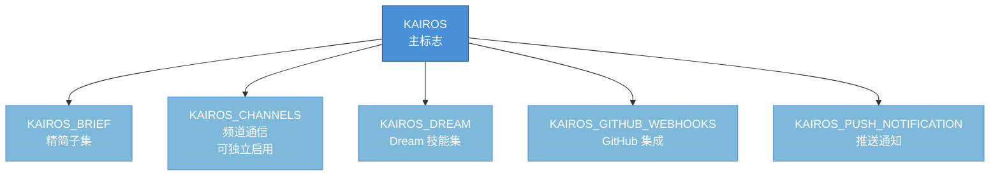
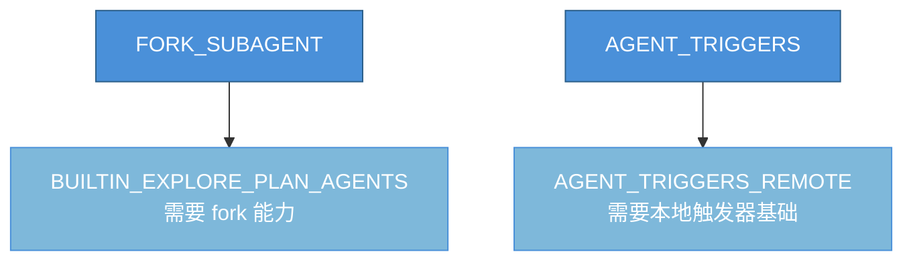
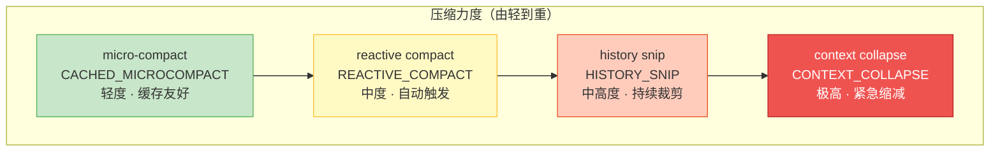
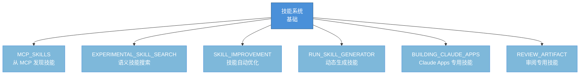
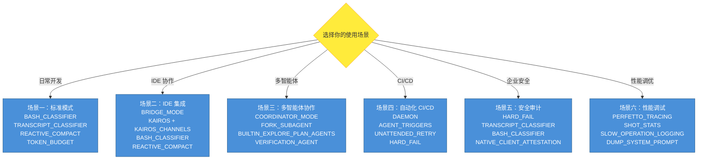

# 附录 C：功能标志速查表

> 功能标志（Feature Flag）是 Claude Code 中实现编译时死代码消除（Dead Code Elimination）的核心机制。所有标志均在打包阶段通过编译器注入布尔值：当标志为 `false` 时，其守卫的代码分支会被整段移除，从而减小产物体积并保护未发布功能。
>
> **类型说明**：
> - **编译时**：标志在 Bun 打包阶段求值，结果为 `false` 的代码分支在产物中完全不存在
> - **编译时 + 运行时门控**：编译时为 `true`，但在运行时还需额外条件（如环境变量、服务端配置）才真正激活
>
> **如何使用本速查表**：
> - 按 C.1 - C.12 的分类快速定位目标标志
> - "影响范围"列说明标志激活后会启用哪些具体功能
> - "依赖关系"列说明标志之间的前置条件
> - 附录 B 中的"工具启用条件速查"表列出了每个标志启用的具体工具，可交叉参考

---

## C.1 核心交互模式标志

核心交互模式标志控制 Claude Code 的主要运行模式。这些标志定义了系统以何种方式与用户、IDE 或其他系统交互。

| 功能标志 | 类型 | 作用描述 | 影响范围 | 依赖关系 | 相关章节 |
|---|---|---|---|---|---|
| `PROACTIVE` | 编译时 | 主动模式。启用后智能体可在用户空闲时主动发起建议、自动执行后台任务 | 启用 SleepTool、主动建议逻辑、后台任务触发器 | 无前置依赖 | 第 5 章 |
| `KAIROS` | 编译时 + 运行时门控 | 助手模式（原 Harbor）。面向 IDE 的通道式协作，含频道消息、会话恢复等完整功能集 | 启用频道通信、会话恢复、SleepTool、SendUserFileTool、PushNotificationTool 等完整功能集 | 无前置依赖，但部分子功能需要各自的子标志 | 第 6 章 |
| `KAIROS_BRIEF` | 编译时 | KAIROS 精简子集，仅启用会话恢复等基础能力，不包含完整通道功能 | 仅会话恢复和基础交互 | 依赖 KAIROS 上下文 | 第 6 章 |
| `KAIROS_CHANNELS` | 编译时 + 运行时门控 | 独立于完整 KAIROS 的频道功能开关，允许仅启用频道消息通信 | 频道消息的收发和路由 | 可独立于完整 KAIROS 启用 | 第 6 章 |
| `KAIROS_DREAM` | 编译时 | KAIROS Dream 模式，用于加载额外的技能集 | Dream 专用技能集的加载和注册 | 依赖 KAIROS | 第 6 章 |
| `KAIROS_GITHUB_WEBHOOKS` | 编译时 | GitHub Webhook 集成，在 KAIROS 模式下接收 GitHub 事件推送 | SubscribePRTool、GitHub 事件监听和路由 | 依赖 KAIROS | 第 6 章 |
| `KAIROS_PUSH_NOTIFICATION` | 编译时 | KAIROS 推送通知功能 | PushNotificationTool 的通知逻辑 | 依赖 KAIROS | 第 6 章 |
| `BRIDGE_MODE` | 编译时 + 运行时门控 | IDE 桥接模式。启用后 REPL 通过桥接协议与 IDE（如 VS Code）通信，支持权限回调管道 | IDE 双向通信、JWT 认证、权限回调、状态同步 | 需配合 IDE 插件使用 | 第 7 章 |
| `COORDINATOR_MODE` | 编译时 + 运行时门控 | 协调器模式。在多智能体场景中充当协调者，分发任务并汇总结果 | AgentTool、TaskStopTool、SendMessageTool 的协调器扩展 | 无前置依赖 | 第 8 章 |
| `VOICE_MODE` | 编译时 | 语音模式。启用语音输入/输出、Push-to-Talk 按键绑定及语音集成模块 | 语音输入捕获、语音合成输出、PTT 按键绑定 | 需要麦克风和扬声器硬件支持 | 第 12 章 |
| `DAEMON` | 编译时 | 后台守护进程模式。允许 Claude Code 以守护进程方式长期运行 | 守护进程启动逻辑、持久化服务、定时任务框架 | 无前置依赖 | 第 11 章 |
| `BUDDY` | 编译时 | 伴侣精灵（Companion Sprite）。在 REPL 界面中显示可交互的动画角色，提供情感化反馈 | Buddy 组件渲染、动画状态机、交互事件处理 | 无前置依赖 | 第 12 章 |

**KAIROS 标志族关系图**：

## C.2 智能体与子任务标志

这组标志控制智能体的任务分解、调度和自动化执行能力。

| 功能标志 | 类型 | 作用描述 | 影响范围 | 依赖关系 | 相关章节 |
|---|---|---|---|---|---|
| `FORK_SUBAGENT` | 编译时 | Fork 子智能体。允许在对话中通过 fork 机制创建独立子智能体处理子任务 | AgentTool 的 fork 能力、子智能体上下文隔离 | 无前置依赖 | 第 8 章 |
| `AGENT_TRIGGERS` | 编译时 | 智能体触发器。启用定时任务调度（cron）、后台周期性执行的智能体行为 | CronCreateTool, CronDeleteTool, CronListTool | 依赖 DAEMON 或长运行环境 | 第 9 章 |
| `AGENT_TRIGGERS_REMOTE` | 编译时 | 远程智能体触发器。支持远程托管的定时触发器执行 | RemoteTriggerTool、远程触发器通信协议 | 依赖 AGENT_TRIGGERS | 第 9 章 |
| `ULTRAPLAN` | 编译时 | 超级规划模式。提供交互式规划对话框，允许用户审查和修改复杂任务的执行计划 | EnterPlanModeTool/ExitPlanModeV2Tool 的增强规划界面 | 无前置依赖 | 第 5 章 |
| `VERIFICATION_AGENT` | 编译时 | 验证智能体。在任务完成后自动启动验证流程 | 任务完成后的自动验证逻辑、验证结果报告 | 无前置依赖 | 第 8 章 |
| `BUILTIN_EXPLORE_PLAN_AGENTS` | 编译时 | 内置探索-规划智能体。提供预装的探索和规划类型的子智能体 | ExploreAgent, PlanAgent 等内置智能体定义 | 依赖 FORK_SUBAGENT | 第 8 章 |
| `AGENT_MEMORY_SNAPSHOT` | 编译时 | 智能体内存快照。支持对智能体状态进行快照和恢复 | 快照创建、序列化存储、恢复加载逻辑 | 无前置依赖 | 第 10 章 |
| `WORKFLOW_SCRIPTS` | 编译时 | 工作流脚本。启用本地工作流任务处理器，支持自动化脚本编排 | WorkflowTool、工作流脚本解析和执行引擎 | 无前置依赖 | 第 9 章 |
| `TEMPLATES` | 编译时 | 模板系统。启用作业分类器（Job Classifier），用于识别和路由不同类型的用户请求 | Job Classifier、请求类型识别、路由分发 | 无前置依赖 | 第 9 章 |

**智能体标志依赖关系**：

## C.3 上下文管理与压缩标志

上下文管理标志控制 Claude Code 如何应对 context window 的 token 限制。这些标志共同构成了一个多层压缩策略体系，从预防性的轻量压缩到紧急的激进裁剪。

| 功能标志 | 类型 | 作用描述 | 影响范围 | 依赖关系 | 相关章节 |
|---|---|---|---|---|---|
| `REACTIVE_COMPACT` | 编译时 + 运行时门控 | 响应式压缩。在 Token 接近阈值时自动触发上下文压缩，而非等待用户确认 | 自动压缩触发逻辑、阈值检测器 | 无前置依赖 | 第 4 章 |
| `CONTEXT_COLLAPSE` | 编译时 | 上下文折叠。提供比传统压缩更激进的上下文缩减策略，包含专门的折叠 UI 和恢复机制 | CtxInspectTool、折叠 UI 组件、内容恢复逻辑 | 无前置依赖 | 第 4 章 |
| `CACHED_MICROCOMPACT` | 编译时 | 缓存式微压缩。在微压缩过程中维护提示缓存边界，避免缓存失效导致的额外开销 | 微压缩缓存边界标记、缓存感知压缩策略 | 依赖 Prompt Cache API 支持 | 第 4 章 |
| `HISTORY_SNIP` | 编译时 | 历史裁剪（Snip Compact）。对已处理的对话历史进行智能裁剪，保留关键信息的同时大幅缩减 token 占用 | SnipTool、历史消息裁剪算法 | 无前置依赖 | 第 4 章 |
| `COMPACTION_REMINDERS` | 编译时 | 压缩提醒。在压缩过程中向用户展示提醒信息 | 压缩前后的用户通知 UI | 依赖压缩操作 | 第 4 章 |
| `PROMPT_CACHE_BREAK_DETECTION` | 编译时 | 提示缓存断裂检测。在压缩操作中检测并报告提示缓存边界的断裂情况 | 缓存断点检测逻辑、断裂报告生成 | 依赖压缩操作 | 第 4 章 |
| `TOKEN_BUDGET` | 编译时 | Token 预算管理器。跟踪和可视化 Token 使用预算，提供预算超限预警 | Token 使用量追踪、预算预警 UI、用量统计 | 无前置依赖 | 第 4 章 |
| `COMMIT_ATTRIBUTION` | 编译时 | 提交归属。在压缩后为代码提交添加压缩前后的上下文归属标记 | 压缩上下文到提交消息的映射逻辑 | 依赖压缩操作 | 第 4 章 |

**压缩标志策略矩阵**：

| 压缩策略 | 对应标志 | 压缩力度 | 缓存友好 | 适用场景 |
|---------|---------|---------|---------|---------|
| micro-compact | `CACHED_MICROCOMPACT` | 轻度 | 高 | 接近阈值时的预防性压缩 |
| reactive compact | `REACTIVE_COMPACT` | 中度 | 中 | 自动触发的标准压缩 |
| history snip | `HISTORY_SNIP` | 中高度 | 低 | 对历史消息的智能裁剪 |
| context collapse | `CONTEXT_COLLAPSE` | 极高 | 低 | 紧急情况下的激进缩减 |

> **推荐配置**：同时启用 `REACTIVE_COMPACT` + `CACHED_MICROCOMPACT` + `TOKEN_BUDGET` 可以获得最佳的上下文管理体验，既有预防性保护又有预算可视化。

## C.4 权限与安全标志

权限与安全标志控制智能体的自主执行边界和安全审计能力。这些标志共同定义了 Claude Code 的信任模型。

| 功能标志 | 类型 | 作用描述 | 影响范围 | 依赖关系 | 相关章节 |
|---|---|---|---|---|---|
| `TRANSCRIPT_CLASSIFIER` | 编译时 | 转录分类器。基于对话内容自动判断权限模式（包括 auto 模式），替代纯手动权限切换 | 权限模式自动推断、auto 模式决策逻辑 | 无前置依赖 | 第 3 章 |
| `BASH_CLASSIFIER` | 编译时 | Bash 分类器。对 Bash 命令进行安全性分类，高置信度的安全命令可自动放行 | Bash 命令安全性评估、只读命令自动放行 | 无前置依赖 | 第 3 章 |
| `HARD_FAIL` | 编译时 | 硬失败模式。在关键错误时直接终止而非降级处理 | 错误处理策略、关键故障的终止逻辑 | 无前置依赖 | 第 3 章 |
| `NATIVE_CLIENT_ATTESTATION` | 编译时 | 原生客户端认证。启用平台原生的客户端身份验证机制 | 客户端身份验证、平台安全集成 | 需要平台安全框架支持 | 第 3 章 |
| `ANTI_DISTILLATION_CC` | 编译时 | 反蒸馏保护。防止模型输出被用于模型蒸馏攻击 | 输出水印、蒸馏检测逻辑 | 无前置依赖 | 第 3 章 |

**安全标志组合建议**：

| 安全级别 | 推荐组合 | 说明 |
|---------|---------|------|
| 最高安全（企业环境） | `TRANSCRIPT_CLASSIFIER` + `BASH_CLASSIFIER` + `HARD_FAIL` + `NATIVE_CLIENT_ATTESTATION` + `ANTI_DISTILLATION_CC` | 全部安全功能启用 |
| 标准安全 | `TRANSCRIPT_CLASSIFIER` + `BASH_CLASSIFIER` | 自动分类辅助，减少手动干预 |
| 开发调试 | `HARD_FAIL` 仅此一个 | 快速暴露错误，便于调试 |

## C.5 工具与技能标志

工具与技能标志控制 Claude Code 中可用工具的扩展能力和工具行为。

| 功能标志 | 类型 | 作用描述 | 影响范围 | 依赖关系 | 相关章节 |
|---|---|---|---|---|---|
| `MONITOR_TOOL` | 编译时 | 监控工具。在 Bash 工具执行后台任务时提供监控能力 | MonitorTool、后台任务输出监控 | 无前置依赖 | 第 7 章 |
| `WEB_BROWSER_TOOL` | 编译时 | 网页浏览器工具。启用内置浏览器面板，支持网页浏览和内容提取 | WebBrowserTool、浏览器面板 UI | 无前置依赖 | 第 7 章 |
| `MCP_SKILLS` | 编译时 | MCP 技能发现。允许从 MCP 服务器动态发现和加载技能 | MCP 技能发现协议、动态技能注册 | 依赖 MCP 连接 | 第 7 章 |
| `EXPERIMENTAL_SKILL_SEARCH` | 编译时 | 实验性技能搜索。启用基于语义的技能索引和搜索能力 | 语义技能索引、技能搜索引擎 | 无前置依赖 | 第 7 章 |
| `SKILL_IMPROVEMENT` | 编译时 | 技能改进。支持对已安装技能进行自动优化和迭代 | 技能自动优化逻辑、迭代改进引擎 | 依赖技能系统 | 第 7 章 |
| `RUN_SKILL_GENERATOR` | 编译时 | 技能生成器运行器。支持动态生成新技能 | 技能生成工具、动态技能创建流程 | 依赖技能系统 | 第 7 章 |
| `BUILDING_CLAUDE_APPS` | 编译时 | Claude 应用构建模式。加载用于构建 Claude 应用的专用技能集 | Claude Apps 专用技能集、应用模板 | 依赖技能系统 | 第 7 章 |
| `REVIEW_ARTIFACT` | 编译时 | 审阅工件。加载代码审阅相关技能 | 代码审阅技能集、审阅模板 | 依赖技能系统 | 第 7 章 |
| `HOOK_PROMPTS` | 编译时 | 钩子提示词。允许钩子（Hook）注入自定义提示词到对话流中 | 钩子提示词注入机制、动态提示词扩展 | 依赖钩子系统 | 第 9 章 |
| `CONNECTOR_TEXT` | 编译时 | 连接器文本块。支持在消息流中渲染特殊的连接器文本块类型 | 连接器文本渲染器、特殊文本块类型 | 无前置依赖 | 第 7 章 |
| `UDS_INBOX` | 编译时 | Unix Domain Socket 收件箱。通过 UDS 接收来自其他进程的消息 | ListPeersTool、UDS 消息监听器 | 需要 UDS 系统支持 | 第 7 章 |
| `MCP_RICH_OUTPUT` | 编译时 | MCP 富输出。允许 MCP 工具返回结构化的富媒体内容 | MCP 输出格式扩展、富媒体渲染 | 依赖 MCP 连接 | 第 7 章 |
| `TREE_SITTER_BASH` | 编译时 | Tree-sitter Bash 解析。使用 Tree-sitter 对 Bash 命令进行精确的 AST 解析 | Bash 命令 AST 解析器、精确安全分析 | 无前置依赖 | 第 3 章 |
| `TREE_SITTER_BASH_SHADOW` | 编译时 + 运行时门控 | Tree-sitter Bash 影子模式。在现有解析器旁并行运行 Tree-sitter 进行结果对比验证 | 并行解析对比、结果一致性验证 | 依赖 TREE_SITTER_BASH | 第 3 章 |

**技能标志关联图**：

## C.6 会话与持久化标志

会话与持久化标志控制 Claude Code 会话的生命周期管理和状态持久化能力。

| 功能标志 | 类型 | 作用描述 | 影响范围 | 依赖关系 | 相关章节 |
|---|---|---|---|---|---|
| `BG_SESSIONS` | 编译时 | 后台会话。支持在后台维持独立的会话实例，允许长时间运行的任务脱离前台执行 | 后台会话管理器、会话序列化与恢复 | 无前置依赖 | 第 11 章 |
| `AWAY_SUMMARY` | 编译时 | 离开摘要。当用户离开后返回时，自动生成离开期间的对话摘要 | 离开检测、摘要生成、返回时展示 | 依赖会话持久化 | 第 11 章 |
| `FILE_PERSISTENCE` | 编译时 | 文件持久化。启用会话级别的文件级持久化追踪 | 文件变更追踪、会话恢复时的状态一致性 | 无前置依赖 | 第 11 章 |
| `NEW_INIT` | 编译时 | 新初始化流程。使用改进后的会话初始化逻辑 | 会话初始化流程、启动优化 | 无前置依赖 | 第 11 章 |

> **推荐配置**：对于需要长期运行任务的场景，建议同时启用 `BG_SESSIONS` + `AWAY_SUMMARY` + `FILE_PERSISTENCE`，确保任务可以可靠地在后台执行并在用户返回时无缝恢复。

## C.7 记忆与知识管理标志

记忆与知识管理标志控制 Claude Code 的跨会话知识存储、检索和共享能力。

| 功能标志 | 类型 | 作用描述 | 影响范围 | 依赖关系 | 相关章节 |
|---|---|---|---|---|---|
| `TEAMMEM` | 编译时 + 运行时门控 | 团队记忆。启用团队级别的共享记忆文件系统，支持团队知识库的读写和同步 | 团队记忆文件读写、知识库同步机制 | 无前置依赖 | 第 10 章 |
| `EXTRACT_MEMORIES` | 编译时 | 记忆提取。在会话结束时自动从对话中提取可复用的知识片段并写入记忆文件 | 自动知识提取、记忆文件写入 | 依赖记忆系统 | 第 10 章 |
| `LODESTONE` | 编译时 | 磁石（Lodestone）。启用增强型的记忆检索和匹配机制 | 记忆相关性评分、增强型检索算法 | 依赖记忆系统 | 第 10 章 |
| `MEMORY_SHAPE_TELEMETRY` | 编译时 | 记忆形态遥测。收集记忆文件的形态和使用情况的匿名遥测数据 | 记忆文件统计分析、匿名遥测上报 | 依赖记忆系统 | 第 10 章 |

**记忆标志增强路径**：启用 `LODESTONE` 可以提升记忆检索的相关性准确率，配合 `EXTRACT_MEMORIES` 可以自动从对话中沉淀知识。在团队环境中再启用 `TEAMMEM`，实现团队级别的知识共享。

## C.8 远程与连接标志

远程与连接标志控制 Claude Code 在不同网络环境和部署场景下的连接能力。

| 功能标志 | 类型 | 作用描述 | 影响范围 | 依赖关系 | 相关章节 |
|---|---|---|---|---|---|
| `SSH_REMOTE` | 编译时 | SSH 远程模式。支持通过 SSH 连接到远程机器并运行 Claude Code | SSH 连接管理、远程环境适配 | 需要 SSH 基础设施 | 第 11 章 |
| `DIRECT_CONNECT` | 编译时 | 直连模式。支持跳过代理直接连接到 Anthropic API | 代理绕过逻辑、直连网络配置 | 无前置依赖 | 第 11 章 |
| `CHICAGO_MCP` | 编译时 | Chicago MCP。启用特定的 MCP 服务器配置和计算机使用（Computer Use）集成 | Computer Use 工具集、专用 MCP 配置 | 依赖 MCP 集成 | 第 7 章 |
| `CCR_AUTO_CONNECT` | 编译时 | CCR 自动连接。自动建立与 CCR（Claude Code Remote）服务的连接 | CCR 服务自动发现、连接建立 | 依赖 CCR 服务 | 第 11 章 |
| `CCR_MIRROR` | 编译时 | CCR 镜像。支持会话状态在本地与远程之间的双向镜像 | 会话状态双向同步、冲突解决 | 依赖 CCR 服务 | 第 11 章 |
| `CCR_REMOTE_SETUP` | 编译时 | CCR 远程设置。启用远程环境的一键配置流程 | 远程环境自动配置、依赖安装 | 依赖 CCR 服务 | 第 11 章 |
| `SELF_HOSTED_RUNNER` | 编译时 | 自托管运行器。支持在自托管基础设施上运行智能体 | 自托管执行环境、基础设施适配 | 无前置依赖 | 第 11 章 |
| `BYOC_ENVIRONMENT_RUNNER` | 编译时 | BYOC 环境运行器。支持 "Bring Your Own Cloud" 环境中的智能体执行 | BYOC 环境集成、多云适配 | 无前置依赖 | 第 11 章 |

**远程部署场景与标志组合**：

| 部署场景 | 推荐标志组合 |
|---------|------------|
| 本地开发 | 无需远程标志 |
| SSH 远程开发 | `SSH_REMOTE` |
| CCR 云端开发 | `CCR_AUTO_CONNECT` + `CCR_MIRROR` + `CCR_REMOTE_SETUP` |
| 自托管服务器 | `SELF_HOSTED_RUNNER` + `DIRECT_CONNECT` |
| BYOC 企业环境 | `BYOC_ENVIRONMENT_RUNNER` + `DIRECT_CONNECT` |

## C.9 UI 与界面标志

UI 与界面标志控制 Claude Code 终端界面的视觉呈现和交互能力。

| 功能标志 | 类型 | 作用描述 | 影响范围 | 依赖关系 | 相关章节 |
|---|---|---|---|---|---|
| `MESSAGE_ACTIONS` | 编译时 + 运行时门控 | 消息操作。在消息上启用上下文操作按钮（如复制、重新生成等） | 消息操作按钮 UI、上下文菜单 | 无前置依赖 | 第 12 章 |
| `TERMINAL_PANEL` | 编译时 + 运行时门控 | 终端面板。在全屏布局中启用独立的终端面板（快捷键 Meta+J） | TerminalCaptureTool、终端面板组件、全屏布局 | 依赖全屏终端环境 | 第 12 章 |
| `QUICK_SEARCH` | 编译时 | 快速搜索。启用对话内快速搜索功能 | 搜索 UI、对话内容索引 | 无前置依赖 | 第 12 章 |
| `HISTORY_PICKER` | 编译时 | 历史选择器。提供可视化的对话历史浏览和切换界面 | 历史浏览 UI、会话切换器 | 无前置依赖 | 第 12 章 |
| `AUTO_THEME` | 编译时 + 运行时门控 | 自动主题。根据系统偏好自动切换明暗主题 | 主题检测、自动切换逻辑 | 需要系统主题 API 支持 | 第 12 章 |
| `STREAMLINED_OUTPUT` | 编译时 | 精简输出。减少界面中的冗余视觉元素，提供更紧凑的输出样式 | 紧凑输出渲染、视觉元素精简 | 无前置依赖 | 第 12 章 |
| `NATIVE_CLIPBOARD_IMAGE` | 编译时 | 原生剪贴板图片。支持从系统剪贴板直接粘贴图片到对话中 | 剪贴板图片读取、图片格式转换 | 需要平台剪贴板 API 支持 | 第 12 章 |

## C.10 设置同步标志

设置同步标志控制用户配置在本地与云端之间的双向同步。

| 功能标志 | 类型 | 作用描述 | 影响范围 | 依赖关系 | 相关章节 |
|---|---|---|---|---|---|
| `UPLOAD_USER_SETTINGS` | 编译时 | 上传用户设置。将本地用户设置同步到云端 | 本地到云端的配置上传、冲突检测 | 需要云端服务 | 第 10 章 |
| `DOWNLOAD_USER_SETTINGS` | 编译时 + 运行时门控 | 下载用户设置。从云端拉取并应用用户设置到本地环境 | 云端到本地的配置下载、配置合并 | 依赖 UPLOAD_USER_SETTINGS | 第 10 章 |

> **说明**：设置同步通常需要两个标志同时启用才能实现完整的双向同步。`UPLOAD_USER_SETTINGS` 负责将本地变更推送到云端，`DOWNLOAD_USER_SETTINGS` 负责在新的环境中拉取已有配置。

## C.11 遥测与诊断标志

遥测与诊断标志控制 Claude Code 的运行时数据收集、性能分析和调试能力。这些标志主要用于内部质量保障和性能优化。

| 功能标志 | 类型 | 作用描述 | 影响范围 | 依赖关系 | 相关章节 |
|---|---|---|---|---|---|
| `COWORKER_TYPE_TELEMETRY` | 编译时 | 协作者类型遥测。收集和上报协作者（如 IDE、终端）的类型信息 | 协作环境检测、匿名类型上报 | 无前置依赖 | 第 13 章 |
| `ENHANCED_TELEMETRY_BETA` | 编译时 | 增强遥测 Beta。启用扩展的匿名使用遥测数据收集 | 扩展遥测数据收集、匿名统计 | 无前置依赖 | 第 13 章 |
| `PERFETTO_TRACING` | 编译时 | Perfetto 追踪。集成 Chrome Perfetto 追踪框架，用于性能分析和时序可视化 | Perfetto 追踪集成、性能数据导出 | 无前置依赖 | 第 13 章 |
| `SHOT_STATS` | 编译时 | 快照统计。收集和展示每次 API 调用的详细统计信息 | API 调用统计、延迟分析 | 无前置依赖 | 第 13 章 |
| `SLOW_OPERATION_LOGGING` | 编译时 | 慢操作日志。记录执行时间超过阈值的操作以辅助性能诊断 | 慢操作检测、阈值告警、性能日志 | 无前置依赖 | 第 13 章 |
| `ABLATION_BASELINE` | 编译时 | 消融基线。在 A/B 实验中作为基线对照组，用于评估新功能的影响 | A/B 实验框架、基线数据收集 | 无前置依赖 | 第 13 章 |

**诊断标志组合建议**：

| 诊断目的 | 推荐组合 |
|---------|---------|
| 性能分析 | `PERFETTO_TRACING` + `SHOT_STATS` + `SLOW_OPERATION_LOGGING` |
| 使用情况统计 | `COWORKER_TYPE_TELEMETRY` + `ENHANCED_TELEMETRY_BETA` |
| A/B 实验 | `ABLATION_BASELINE` + 需要测试的目标标志 |

## C.12 基础设施与构建标志

基础设施与构建标志控制底层的技术行为和构建配置。这些标志通常不需要用户直接关注，但在特定部署和调试场景下非常重要。

| 功能标志 | 类型 | 作用描述 | 影响范围 | 依赖关系 | 相关章节 |
|---|---|---|---|---|---|
| `UNATTENDED_RETRY` | 编译时 | 无人值守重试。在 API 调用失败时自动重试，无需用户干预 | API 重试逻辑、退避策略、最大重试次数 | 无前置依赖 | 第 13 章 |
| `IS_LIBC_GLIBC` | 编译时 | 检测目标平台的 libc 是否为 glibc 实现，用于二进制兼容性判断 | 二进制分发时的兼容性选择 | 无前置依赖 | 附录 |
| `IS_LIBC_MUSL` | 编译时 | 检测目标平台的 libc 是否为 musl 实现（如 Alpine Linux），用于二进制兼容性判断 | 二进制分发时的兼容性选择 | 无前置依赖 | 附录 |
| `POWERSHELL_AUTO_MODE` | 编译时 | PowerShell 自动模式。为 Windows PowerShell 环境提供专用的自动化权限配置 | PowerShell 环境权限自动配置 | 仅 Windows 环境 | 附录 |
| `ALLOW_TEST_VERSIONS` | 编译时 | 允许测试版本。在版本检查中允许接受预发布/测试版本号 | 版本检查逻辑、预发布版本接受 | 无前置依赖 | 附录 |
| `SKIP_DETECTION_WHEN_AUTOUPDATES_DISABLED` | 编译时 | 自动更新禁用时跳过检测。当自动更新已被显式禁用时，跳过版本检测逻辑以减少启动延迟 | 版本检测跳过、启动优化 | 无前置依赖 | 附录 |
| `DUMP_SYSTEM_PROMPT` | 编译时 | 导出系统提示词。启用后将完整的系统提示词输出到日志或文件，用于调试 | 系统提示词导出、调试日志 | 无前置依赖 | 附录 |
| `OVERFLOW_TEST_TOOL` | 编译时 | 溢出测试工具。提供专用的测试工具用于验证上下文溢出处理逻辑 | OverflowTestTool、溢出场景模拟 | 仅测试环境 | 附录 |
| `ULTRATHINK` | 编译时 | 深度思考模式。启用扩展思考（Extended Thinking）能力 | 扩展思考 API 调用、思考 token 处理 | 无前置依赖 | 第 5 章 |
| `TORCH` | 编译时 | Torch 模式。实验性的增强推理功能 | 增强推理引擎、实验性推理策略 | 无前置依赖 | 第 5 章 |

> **调试提示**：当需要排查系统行为异常时，`DUMP_SYSTEM_PROMPT` 是最有效的诊断工具之一，它可以将发送给模型的完整系统提示词导出，便于检查指令是否正确组装。

---

## C.13 标志使用统计

| 分类 | 数量 |
|---|---|
| 核心交互模式 | 12 |
| 智能体与子任务 | 9 |
| 上下文管理与压缩 | 8 |
| 权限与安全 | 5 |
| 工具与技能 | 14 |
| 会话与持久化 | 4 |
| 记忆与知识管理 | 4 |
| 远程与连接 | 8 |
| UI 与界面 | 7 |
| 设置同步 | 2 |
| 遥测与诊断 | 6 |
| 基础设施与构建 | 10 |
| **合计** | **89** |

> **注**：以上标志列表基于系统架构分析整理，随版本迭代可能有所增减。功能标志的具体启用方式由构建配置决定，部分标志还需配合运行时门控条件（如特定的激活检测函数）才能真正激活对应功能。

---

## C.14 常见配置场景推荐

以下列出几种典型的使用场景及其推荐的功能标志组合，帮助读者根据实际需求进行配置：

### 场景一：日常开发（标准模式）

适用于大多数开发者的日常使用，提供平衡的功能集和安全性。

**核心标志**：`BASH_CLASSIFIER` + `TRANSCRIPT_CLASSIFIER` + `REACTIVE_COMPACT` + `TOKEN_BUDGET`

### 场景二：IDE 集成开发

适用于在 VS Code 或 JetBrains 中通过插件使用 Claude Code 的场景。

**核心标志**：`BRIDGE_MODE` + `KAIROS` + `KAIROS_CHANNELS` + `BASH_CLASSIFIER` + `REACTIVE_COMPACT`

### 场景三：多智能体协作

适用于需要在多个智能体之间分配和协调任务的复杂场景。

**核心标志**：`COORDINATOR_MODE` + `FORK_SUBAGENT` + `BUILTIN_EXPLORE_PLAN_AGENTS` + `VERIFICATION_AGENT` + `AGENT_MEMORY_SNAPSHOT`

### 场景四：自动化 CI/CD 集成

适用于在 CI/CD 管道中无人值守运行的场景。

**核心标志**：`DAEMON` + `AGENT_TRIGGERS` + `UNATTENDED_RETRY` + `HARD_FAIL` + `WORKFLOW_SCRIPTS`

### 场景五：安全审计模式

适用于对安全性要求极高的企业环境。

**核心标志**：`HARD_FAIL` + `TRANSCRIPT_CLASSIFIER` + `BASH_CLASSIFIER` + `NATIVE_CLIENT_ATTESTATION` + `ANTI_DISTILLATION_CC` + `ULTRAPLAN`

### 场景六：性能调试与优化

适用于排查性能问题或优化系统行为。

**核心标志**：`PERFETTO_TRACING` + `SHOT_STATS` + `SLOW_OPERATION_LOGGING` + `DUMP_SYSTEM_PROMPT` + `PROMPT_CACHE_BREAK_DETECTION`

---

## C.15 标志间全局依赖关系图

以下以图表形式展示功能标志之间的主要依赖关系和分组结构：

```mermaid
flowchart TD
    subgraph 交互模式层["交互模式层"]
        PROACTIVE
        KAIROS --> KAIROS_BRIEF
        KAIROS --> KAIROS_CHANNELS
        KAIROS --> KAIROS_DREAM
        KAIROS --> KAIROS_GITHUB_WEBHOOKS
        KAIROS --> KAIROS_PUSH_NOTIFICATION
        BRIDGE_MODE
        COORDINATOR_MODE
        VOICE_MODE
        DAEMON
        BUDDY
    end

    subgraph 智能体层["智能体层"]
        FORK_SUBAGENT --> BUILTIN_EXPLORE_PLAN_AGENTS
        AGENT_TRIGGERS --> AGENT_TRIGGERS_REMOTE
        ULTRAPLAN
        VERIFICATION_AGENT
        AGENT_MEMORY_SNAPSHOT
        WORKFLOW_SCRIPTS
        TEMPLATES
    end

    subgraph 上下文管理层["上下文管理层"]
        REACTIVE_COMPACT
        CONTEXT_COLLAPSE
        CACHED_MICROCOMPACT
        HISTORY_SNIP
        COMPACTION_REMINDERS
        PROMPT_CACHE_BREAK_DETECTION
        TOKEN_BUDGET
        COMMIT_ATTRIBUTION
    end

    subgraph 安全层["安全层"]
        TRANSCRIPT_CLASSIFIER
        BASH_CLASSIFIER
        HARD_FAIL
        NATIVE_CLIENT_ATTESTATION
        ANTI_DISTILLATION_CC
    end

    subgraph 工具与技能层["工具与技能层"]
        TREE_SITTER_BASH --> TREE_SITTER_BASH_SHADOW
        MONITOR_TOOL
        WEB_BROWSER_TOOL
        MCP_SKILLS
        MCP_RICH_OUTPUT
        技能系统 --> EXPERIMENTAL_SKILL_SEARCH
        技能系统 --> SKILL_IMPROVEMENT
        技能系统 --> RUN_SKILL_GENERATOR
        技能系统 --> BUILDING_CLAUDE_APPS
        技能系统 --> REVIEW_ARTIFACT
        HOOK_PROMPTS
        CONNECTOR_TEXT
        UDS_INBOX
    end

    subgraph 远程与连接层["远程与连接层"]
        SSH_REMOTE
        DIRECT_CONNECT
        CCR_AUTO_CONNECT --> CCR_MIRROR
        CCR_REMOTE_SETUP
        SELF_HOSTED_RUNNER
        BYOC_ENVIRONMENT_RUNNER
    end

    subgraph 基础设施层["基础设施层"]
        UNATTENDED_RETRY
        ULTRATHINK
        TORCH
        IS_LIBC_GLIBC
        IS_LIBC_MUSL
        POWERSHELL_AUTO_MODE
        DUMP_SYSTEM_PROMPT
    end

    classDef layer1 fill:#4a90d9,stroke:#2c5f8a,color:#fff
    classDef layer2 fill:#8fbc8f,stroke:#5a8a5a,color:#fff
    classDef layer3 fill:#ff9800,stroke:#e65100,color:#fff
    classDef layer4 fill:#ef5350,stroke:#c62828,color:#fff
    classDef layer5 fill:#ce93d8,stroke:#7b1fa2,color:#fff
    classDef layer6 fill:#7eb8da,stroke:#4a90d9,color:#fff
    classDef layer7 fill:#a0a0a0,stroke:#666,color:#fff

    class PROACTIVE,KAIROS,KAIROS_BRIEF,KAIROS_CHANNELS,KAIROS_DREAM,KAIROS_GITHUB_WEBHOOKS,KAIROS_PUSH_NOTIFICATION,BRIDGE_MODE,COORDINATOR_MODE,VOICE_MODE,DAEMON,BUDDY layer1
    class FORK_SUBAGENT,BUILTIN_EXPLORE_PLAN_AGENTS,AGENT_TRIGGERS,AGENT_TRIGGERS_REMOTE,ULTRAPLAN,VERIFICATION_AGENT,AGENT_MEMORY_SNAPSHOT,WORKFLOW_SCRIPTS,TEMPLATES layer2
    class REACTIVE_COMPACT,CONTEXT_COLLAPSE,CACHED_MICROCOMPACT,HISTORY_SNIP,COMPACTION_REMINDERS,PROMPT_CACHE_BREAK_DETECTION,TOKEN_BUDGET,COMMIT_ATTRIBUTION layer3
    class TRANSCRIPT_CLASSIFIER,BASH_CLASSIFIER,HARD_FAIL,NATIVE_CLIENT_ATTESTATION,ANTI_DISTILLATION_CC layer4
    class TREE_SITTER_BASH,TREE_SITTER_BASH_SHADOW,MONITOR_TOOL,WEB_BROWSER_TOOL,MCP_SKILLS,MCP_RICH_OUTPUT,EXPERIMENTAL_SKILL_SEARCH,SKILL_IMPROVEMENT,RUN_SKILL_GENERATOR,BUILDING_CLAUDE_APPS,REVIEW_ARTIFACT,HOOK_PROMPTS,CONNECTOR_TEXT,UDS_INBOX layer5
    class SSH_REMOTE,DIRECT_CONNECT,CCR_AUTO_CONNECT,CCR_MIRROR,CCR_REMOTE_SETUP,SELF_HOSTED_RUNNER,BYOC_ENVIRONMENT_RUNNER layer6
    class UNATTENDED_RETRY,ULTRATHINK,TORCH,IS_LIBC_GLIBC,IS_LIBC_MUSL,POWERSHELL_AUTO_MODE,DUMP_SYSTEM_PROMPT layer7
```

