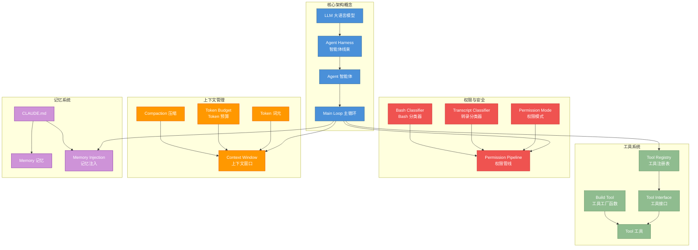
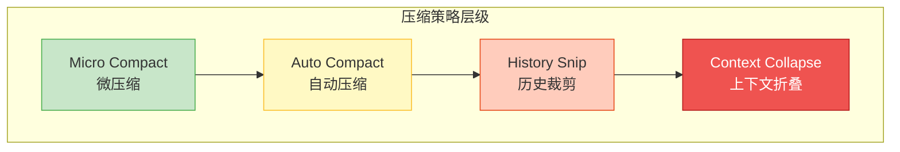

# 附录 D：术语表

> 本术语表涵盖《解码 Agent Harness：Claude Code 架构深度剖析》全书涉及的核心术语，按英文字母排序。每条包含英文原名、推荐中文译名、简明定义、相关术语交叉引用以及首次出现的章节引用。
>
> **使用说明**：
> - 每条术语后的"参见"字段指向相关的其他术语，方便主题式阅读
> - 每条术语后的"章节"字段标注了该术语在正文中首次深入讨论的位置
> - 技术术语保留英文原文，中文译名仅作辅助理解

## 核心概念关系图

以下图表展示了本书核心术语之间的关系，帮助读者建立整体概念框架：

---

## A

| 英文原名 | 中文译名 | 简明定义 | 参见 | 章节 |
|---|---|---|---|---|
| Ablation Baseline | 消融基线 | A/B 实验中的对照组标志，用于量化新功能对系统行为的精确影响 | Feature Flag, Enhanced Telemetry | 第 13 章 |
| Agent | 智能体 | 具备自主规划、工具调用和迭代执行能力的 AI 程序实体，能根据环境反馈动态调整行为。在 Claude Code 的架构中，Agent 由 Agent Harness 包裹，通过 Main Loop 与工具系统协同工作 | Agent Harness, Subagent, Coordinator Mode | 第 1 章 |
| Agent Harness | 智能体线束 / 执行框架 | 包裹大语言模型的运行时基础设施层，负责工具调度、权限管控、上下文管理、流式渲染等核心能力的编排与执行。这是 Claude Code 最核心的架构概念，定义了 LLM 与外部世界交互的标准框架 | Agent, Tool, Permission Mode, Context Window | 第 1 章 |
| Agent Memory Snapshot | 智能体内存快照 | 对智能体运行时的内部状态进行序列化保存，支持跨会话恢复执行现场。由 `AGENT_MEMORY_SNAPSHOT` 功能标志控制启用 | Memory, Agent, Feature Flag | 第 10 章 |
| Agent Trigger | 智能体触发器 | 基于时间（cron）或事件驱动的自动调度机制，允许智能体在无人值守时按计划执行任务。由 `AGENT_TRIGGERS` 功能标志控制启用 | Daemon, Cron Tool | 第 9 章 |
| Always Allow / Always Deny / Always Ask | 始终允许 / 始终拒绝 / 始终询问 | 权限规则中的三种基本策略，优先级为 Always Deny > Always Allow > Always Ask。这些规则定义在 settings.json 的三级配置中 | Permission Mode, Permission Pipeline | 第 4 章 |
| API Turn | API 轮次 | 一次完整的"发送请求-接收响应"交互周期，包含用户输入、模型推理和工具调用结果的完整往返。一个用户请求可能触发多个 API Turn（当需要工具调用时） | Main Loop, Token, Tool | 第 2 章 |
| Async Generator | 异步生成器 | JavaScript/TypeScript 中使用 `async function*` 声明的函数，通过 `yield` 逐步产出异步结果，是 Claude Code 流式输出的核心编程原语。查询引擎和流式工具执行器都使用此模式 | Stream, Query Engine | 第 2 章 |
| Auto Compact | 自动压缩 | 当对话上下文接近 Token 阈值时自动触发的上下文压缩机制，无需用户手动干预。由 `REACTIVE_COMPACT` 功能标志增强 | Compaction, Context Window, Token Budget | 第 7 章 |
| Auto Mode | 自动模式 | 一种权限模式，在该模式下智能体可自主决定执行大部分操作而无需逐一请求用户确认。配合 `TRANSCRIPT_CLASSIFIER` 可实现基于对话内容的自动模式推断 | Permission Mode, Transcript Classifier | 第 3 章 |
| Auto Theme | 自动主题 | 根据操作系统明暗偏好自动切换 Claude Code 终端界面的配色方案。由 `AUTO_THEME` 功能标志控制 | Feature Flag | 第 12 章 |
| Away Summary | 离开摘要 | 当用户离开后返回时自动生成的对话摘要，帮助用户快速了解离开期间发生的事情。由 `AWAY_SUMMARY` 功能标志控制 | Background Session, Feature Flag | 第 11 章 |

## B

| 英文原名 | 中文译名 | 简明定义 | 参见 | 章节 |
|---|---|---|---|---|
| Background Session (BG_SESSIONS) | 后台会话 | 脱离前台终端独立运行的会话实例，支持长时间任务在后台持续执行。由 `BG_SESSIONS` 功能标志控制启用 | Daemon, Agent Trigger | 第 11 章 |
| Bash Classifier | Bash 分类器 | 使用机器学习对用户输入的 Bash 命令进行安全性分类的模块，高置信度的安全命令可自动放行。由 `BASH_CLASSIFIER` 功能标志控制启用 | Permission Pipeline, BashTool | 第 3 章 |
| Bridge Mode | 桥接模式 | Claude Code 与 IDE（如 VS Code、JetBrains）之间的双向通信协议，支持权限回调和状态同步。由 `BRIDGE_MODE` 功能标志控制启用 | IDE Integration, KAIROS | 第 7 章 |
| Build-time Dead Code Elimination | 编译时死代码消除 | Bun 打包器在编译阶段根据功能标志求值结果，将条件为 false 的代码分支整段移除，减小产物体积。这是 Claude Code 功能标志机制的基础 | Feature Flag, Bun Bundle | 附录 C |
| Buddy | 伴侣精灵 | REPL 界面中的交互式动画角色组件，提供情感化反馈和视觉陪伴。由 `BUDDY` 功能标志控制启用 | REPL, Companion Sprite | 第 12 章 |
| Bun Bundle | Bun 打包 | 使用 Bun 运行时的打包功能，在编译期注入功能标志的静态值。Bun 是 Claude Code 的主要构建和运行时工具链 | Feature Flag, Dead Code Elimination | 附录 C |
| Build Tool (buildTool) | 工具工厂函数 | 创建工具实例的统一工厂函数，为未显式定义的方法（如 isEnabled、isReadOnly 等）填充安全默认值 | Tool, Tool Registry | 第 3 章 |

## C

| 英文原名 | 中文译名 | 简明定义 | 参见 | 章节 |
|---|---|---|---|---|
| Cache Safe Params | 缓存安全参数 | 在 API 请求中标记的、不会导致 Prompt Cache 失效的参数集合，确保缓存命中率最大化 | Prompt Cache, Compaction | 第 7 章 |
| Cached Micro Compact | 缓存式微压缩 | 一种高级压缩策略，在压缩过程中维护 Prompt Cache 的边界标记，避免因压缩导致的缓存全面失效。由 `CACHED_MICROCOMPACT` 功能标志控制 | Compaction, Prompt Cache, Micro Compact | 第 7 章 |
| Channel | 频道 | KAIROS 模式中用于 IDE 与 Claude Code 之间传递消息和权限请求的双向通信管道。由 `KAIROS_CHANNELS` 功能标志控制 | KAIROS, Bridge Mode | 第 6 章 |
| CHICAGO_MCP | Chicago MCP | 特定的 MCP 服务器配置模式，集成了计算机使用（Computer Use）能力和专用工具集。由 `CHICAGO_MCP` 功能标志控制 | MCP, Feature Flag | 第 7 章 |
| CLI (Command Line Interface) | 命令行界面 | Claude Code 的主要交互入口，基于终端的文本界面，使用 Ink 框架渲染 React 组件。负责参数解析、REPL 初始化和用户输入捕获 | REPL, Ink | 第 2 章 |
| CLAUDE.md | CLAUDE 记忆文件 | 记忆系统的核心载体文件，支持全局级（~/.claude/CLAUDE.md）、项目级（项目根目录）和目录级的嵌套层级。内容在每轮对话开始时被注入到系统提示中 | Memory, Memory Injection | 第 6 章 |
| Compaction | 上下文压缩 | 将冗长的对话历史压缩为保留关键信息的精简摘要，以释放 Token 空间供后续对话使用。Claude Code 提供了多种压缩策略：micro-compact、auto-compact、history snip、context collapse | Auto Compact, Context Window, Token Budget | 第 7 章 |
| Companion Sprite | 伴侣精灵组件 | Buddy 功能的可视化实现，在终端中渲染的动画角色 React 组件 | Buddy, REPL | 第 12 章 |
| Concurrency Safe | 并发安全 | 工具的属性之一，标记为并发安全的工具可以被流式工具执行器同时调度执行，不必等待前一个调用完成 | Tool, Streaming Tool Executor | 第 3 章 |
| Context Collapse | 上下文折叠 | 比传统压缩更激进的上下文缩减策略，采用专门的折叠 UI 让用户感知并可选择恢复被折叠的内容。由 `CONTEXT_COLLAPSE` 功能标志控制 | Compaction, Context Window | 第 7 章 |
| Context Window | 上下文窗口 | 模型单次请求可处理的最大 Token 数量限制，是所有上下文管理策略的根本约束。Claude Code 的压缩系统、记忆系统都围绕这一限制进行设计 | Token, Compaction, Token Budget | 第 7 章 |
| Coordinator Mode | 协调器模式 | 多智能体协作中的中枢角色，负责任务分发、进度汇总和结果整合。由 `COORDINATOR_MODE` 功能标志控制 | Agent, Subagent, FORK_SUBAGENT | 第 10 章 |
| COWORKER_TYPE_TELEMETRY | 协作者类型遥测 | 自动检测并上报当前协作环境（IDE 插件、独立终端、CI 管道等）类型的匿名遥测功能 | Feature Flag, Telemetry | 第 13 章 |
| Cron Tool | Cron 定时工具 | 智能体触发器中基于标准 cron 表达式定义执行计划的工具集（CronCreateTool、CronDeleteTool、CronListTool）。由 `AGENT_TRIGGERS` 功能标志控制 | Agent Trigger, Daemon | 第 9 章 |

## D

| 英文原名 | 中文译名 | 简明定义 | 参见 | 章节 |
|---|---|---|---|---|
| Daemon | 守护进程 | Claude Code 以长期运行的后台进程方式运行的模式，支持持久化服务和定时任务执行。由 `DAEMON` 功能标志控制 | Background Session, Agent Trigger | 第 11 章 |
| Dead Code Elimination | 死代码消除 | 编译器/打包器在构建阶段识别并移除永远不会被执行到的代码路径的优化技术。在 Claude Code 中，Feature Flag 的 `false` 分支通过此机制被移除 | Feature Flag, Bun Bundle, Build-time Dead Code Elimination | 附录 C |
| DIRECT_CONNECT | 直连模式 | 跳过中间代理层，直接建立与 Anthropic API 端点的网络连接。由 `DIRECT_CONNECT` 功能标志控制 | Feature Flag, SSH Remote | 第 11 章 |
| Dynamic Tool Registration | 动态工具注册 | MCP 工具在运行时被动态发现、适配并注册到工具注册表的过程。与内置工具的静态注册不同，MCP 工具的数量和类型在编译时不确定 | MCP, Tool Registry, Build Tool | 第 12 章 |

## E

| 英文原名 | 中文译名 | 简明定义 | 参见 | 章节 |
|---|---|---|---|---|
| Enhanced Telemetry | 增强遥测 | 扩展的匿名使用遥测数据收集能力。由 `ENHANCED_TELEMETRY_BETA` 功能标志控制 | Telemetry, COWORKER_TYPE_TELEMETRY | 第 13 章 |
| Extended Thinking | 扩展思考 | 模型在生成最终回复前进行的内部推理过程，通过额外的思考 Token 提升复杂任务的推理质量。由 `ULTRATHINK` 功能标志控制 | Ultrathink, Token, LLM | 第 5 章 |
| Extract Memories | 记忆提取 | 会话结束时自动从对话内容中识别并抽取可复用知识片段，持久化到记忆文件系统。由 `EXTRACT_MEMORIES` 功能标志控制 | Memory, CLAUDE.md, Team Memory | 第 10 章 |

## F

| 英文原名 | 中文译名 | 简明定义 | 参见 | 章节 |
|---|---|---|---|---|
| Feature Flag | 功能标志 | 编译时通过 Bun define 注入的布尔开关，控制特定功能代码是否包含在最终产物中。当标志为 false 时，其守卫的代码分支通过死代码消除被整段移除 | Build-time Dead Code Elimination, Bun Bundle | 附录 C |
| File Persistence | 文件持久化 | 跨 API 轮次追踪和记录文件系统变更的能力，支持会话恢复时的状态一致性。由 `FILE_PERSISTENCE` 功能标志控制 | Background Session, Compaction | 第 11 章 |
| Fork Mode / Fork Subagent | Fork 模式 / Fork 子智能体 | 通过 fork 机制创建独立子进程执行子任务的模式，子智能体拥有独立的上下文和权限范围。由 `FORK_SUBAGENT` 功能标志控制。子智能体通过递归调用 Main Loop 实现嵌套执行 | Subagent, Agent, Main Loop | 第 9 章 |
| Fullscreen Layout | 全屏布局 | Claude Code 在全屏终端环境（如 tmux、iTerm2）中启用的增强布局，支持多面板和浮动元素。是 Terminal Panel 等高级 UI 功能的前提 | Terminal Panel, REPL | 第 12 章 |

## G-H

| 英文原名 | 中文译名 | 简明定义 | 参见 | 章节 |
|---|---|---|---|---|
| GlobTool | Glob 搜索工具 | 按文件名 glob 模式匹配搜索文件的工具，按修改时间排序返回结果。标记为 readOnly 和 concurrencySafe | GrepTool, FileReadTool, Tool | 第 3 章 |
| GrepTool | Grep 搜索工具 | 基于 ripgrep 的正则内容搜索工具，支持 files_with_matches / content / count 三种输出模式。标记为 readOnly 和 concurrencySafe | GlobTool, Tool | 第 3 章 |
| Hard Fail | 硬失败 | 在关键错误时直接终止而非降级处理的模式。由 `HARD_FAIL` 功能标志控制 | Feature Flag, Permission Pipeline | 第 3 章 |
| Hook | 钩子 | 在特定生命周期事件（如工具执行前后、会话开始/结束）触发的用户自定义脚本或回调函数。是 Claude Code 生命周期扩展的核心机制 | Hook Prompts, PreToolUse, PostToolUse | 第 8 章 |
| Hook Prompts | 钩子提示词 | 允许钩子向对话流中注入自定义提示词的机制，实现动态的系统级指令定制。由 `HOOK_PROMPTS` 功能标志控制 | Hook, System Prompt | 第 9 章 |
| History Snip | 历史裁剪 / Snip Compact | 对已处理的对话历史进行智能裁剪的压缩策略，保留关键信息的同时大幅缩减 Token 占用。由 `HISTORY_SNIP` 功能标志控制 | Compaction, Auto Compact, Token | 第 7 章 |

## I-J-K

| 英文原名 | 中文译名 | 简明定义 | 参见 | 章节 |
|---|---|---|---|---|
| IDE Integration | IDE 集成 | Claude Code 通过 Bridge Mode 或 KAIROS 模式与 IDE（如 VS Code、JetBrains）的集成能力，支持权限回调、状态同步和双向通信 | Bridge Mode, KAIROS, Channel | 第 7 章 |
| Ink | Ink 框架 | 基于 React 的终端 UI 渲染框架，Claude Code 使用它将 React 组件树渲染为终端文本输出。是表现层的核心技术 | CLI, REPL, React | 第 2 章 |
| Job Classifier | 作业分类器 | 基于 Templates 功能标志的分类模块，自动识别用户请求类型并路由到对应的处理流程 | Templates, Feature Flag | 第 9 章 |
| JWT (JSON Web Token) | JSON Web 令牌 | 在 IDE 桥接模式中用于安全认证的令牌机制，确保 CLI 与 IDE 插件之间的通信安全 | Bridge Mode, IDE Integration | 第 7 章 |
| KAIROS | 助手模式 / KAIROS 模式 | 面向 IDE 集成的完整协作功能集，包含频道通信、会话恢复、GitHub Webhook 集成等能力。由 `KAIROS` 功能标志控制，有多个子标志（KAIROS_BRIEF, KAIROS_CHANNELS 等） | Channel, Bridge Mode, Feature Flag | 第 6 章 |
| KAIROS Dream | KAIROS Dream 模式 | KAIROS 的扩展模式，用于加载额外的技能集。由 `KAIROS_DREAM` 功能标志控制 | KAIROS, Skill | 第 6 章 |

## L-M

| 英文原名 | 中文译名 | 简明定义 | 参见 | 章节 |
|---|---|---|---|---|
| Layered Architecture | 分层架构 | Claude Code 的整体架构风格，分为表现层（Presentation）、编排层（Orchestration）、能力层（Capability）和基础设施层（Infrastructure）四个层次 | Agent Harness, CLI, Main Loop | 附录 A |
| LLM (Large Language Model) | 大语言模型 | Claude 等基于 Transformer 架构的大规模预训练语言模型，是智能体的推理核心。在 Claude Code 中，LLM 通过 Agent Harness 与工具系统交互 | Agent, Agent Harness, API Turn | 第 1 章 |
| Lodestone | 磁石 | 增强型记忆检索与匹配机制，提升从记忆文件系统中查找相关知识的准确率。由 `LODESTONE` 功能标志控制 | Memory, CLAUDE.md | 第 10 章 |
| Main Loop | 主循环 | Claude Code 的核心执行循环，负责接收用户输入、调用模型 API、处理工具调用、渲染输出的迭代流程。每个迭代称为一个 turn | API Turn, Tool, Query Engine | 第 2 章 |
| MCP (Model Context Protocol) | 模型上下文协议 | Anthropic 定义的标准化协议，允许外部工具服务器向模型提供上下文信息和可调用工具。Claude Code 实现了完整的 MCP 客户端 | Dynamic Tool Registration, MCP Skills | 第 12 章 |
| MCP Skills | MCP 技能发现 | 通过 MCP 协议从外部服务器动态发现和加载可扩展技能的能力。由 `MCP_SKILLS` 功能标志控制 | MCP, Skill, Dynamic Tool Registration | 第 7 章 |
| Memory | 记忆 | 持久化存储的用户偏好、项目知识和历史经验的文件系统，跨会话保留关键信息。核心载体是 CLAUDE.md 文件 | CLAUDE.md, Extract Memories, Team Memory | 第 6 章 |
| Memory Injection | 记忆注入 | 在每轮对话开始时将 CLAUDE.md 文件中的知识注入到系统提示中的过程，参见附录 A.3 的记忆注入路径 | Memory, CLAUDE.md, System Prompt | 第 6 章 |
| Message Actions | 消息操作 | 在对话消息上提供的上下文操作按钮，如复制内容、重新生成回复等交互功能。由 `MESSAGE_ACTIONS` 功能标志控制 | Feature Flag | 第 12 章 |
| Micro Compact | 微压缩 | 在不触发完整压缩的情况下，对上下文进行轻量级缩减的快速压缩策略。与 Cached Micro Compact 配合使用可维护缓存边界 | Compaction, Cached Micro Compact, Auto Compact | 第 7 章 |
| Monitor Tool | 监控工具 | 在 Bash 工具执行后台命令时提供实时输出监控和状态追踪的能力。由 `MONITOR_TOOL` 功能标志控制 | BashTool, Tool | 第 7 章 |
| Multi-tier Settings | 三级配置 | 设置系统的层级配置模型，包含全局（~/.claude/settings.json）、项目（.claude/settings.json）和本地（.claude/settings.local.json）三个级别，低优先级到高优先级逐层覆盖 | Permission Mode, Settings Sync | 第 5 章 |

## N-O-P

| 英文原名 | 中文译名 | 简明定义 | 参见 | 章节 |
|---|---|---|---|---|
| Native Client Attestation | 原生客户端认证 | 启用平台原生的客户端身份验证机制。由 `NATIVE_CLIENT_ATTESTATION` 功能标志控制 | Feature Flag, Permission Pipeline | 第 3 章 |
| Permission Mode | 权限模式 | 控制智能体自主执行级别的设置，包括 ask（逐次确认）、auto-edit（编辑自动放行）、full-auto（完全自动）等。配合 Transcript Classifier 可实现自动推断 | Auto Mode, Permission Pipeline, Always Allow | 第 4 章 |
| Permission Pipeline | 权限管线 | 工具执行前的多层权限检查管道，包含分类器评估、用户确认对话框和自动放行规则的完整决策链。参见附录 A.3 的权限判定路径 | Permission Mode, Bash Classifier, Transcript Classifier | 第 4 章 |
| Plan Mode | Plan 模式 | Ultraplan 功能提供的交互式规划界面，允许用户在执行前审查、修改和确认复杂任务计划。进入 Plan Mode 后仅允许使用只读工具 | EnterPlanModeTool, ExitPlanModeV2Tool, Ultraplan | 第 14 章 |
| Power Assertion | 幂等断言 | 确保操作可以安全重复执行而不会产生副作用的代码设计原则。在工具系统设计中用于保障重试安全性 | Tool, Unattended Retry | 第 3 章 |
| PreToolUse / PostToolUse | 工具执行前/后钩子 | 在工具执行前/后触发的生命周期钩子，分别用于修改输入参数或阻止执行、处理执行结果或记录日志 | Hook, Hook Prompts | 第 8 章 |
| Proactive Mode | 主动模式 | 智能体在用户空闲时主动分析代码、提出建议或执行后台任务的能力。由 `PROACTIVE` 功能标志控制 | Feature Flag, SleepTool | 第 5 章 |
| Prompt Cache | 提示缓存 | Anthropic API 提供的缓存机制，对重复出现的系统提示和上下文前缀进行缓存以降低延迟和成本 | Cache Safe Params, Compaction | 第 7 章 |
| Prompt Cache Break Detection | 提示缓存断裂检测 | 在压缩等操作中检测缓存边界是否被破坏，并报告对缓存命中率的影响。由 `PROMPT_CACHE_BREAK_DETECTION` 功能标志控制 | Prompt Cache, Compaction | 第 7 章 |

## Q-R

| 英文原名 | 中文译名 | 简明定义 | 参见 | 章节 |
|---|---|---|---|---|
| Query Engine | 查询引擎 | 管理完整对话生命周期（从接收用户输入到输出最终回复）的核心引擎，协调模型调用、工具执行和上下文管理。封装了与 Anthropic Messages API 的所有通信细节 | Main Loop, Async Generator, API Turn | 第 2 章 |
| Quick Search | 快速搜索 | 在当前对话历史中进行即时搜索的界面功能，支持快速定位特定内容。由 `QUICK_SEARCH` 功能标志控制 | Feature Flag | 第 12 章 |
| Reactive Compact | 响应式压缩 | 在 Token 使用量接近阈值时自动触发的压缩策略，作为对资源压力的实时响应。由 `REACTIVE_COMPACT` 功能标志控制 | Auto Compact, Compaction, Token Budget | 第 7 章 |
| React | React 框架 | Claude Code 的 UI 层基于 React 框架构建，通过 Ink 适配器将 React 组件树渲染为终端文本输出 | Ink, CLI, REPL | 第 2 章 |
| ReadOnly Tool | 只读工具 | 标记为 readOnly 的工具，仅执行读取操作而不修改文件系统或外部状态。只读工具在 Plan Mode 下也可使用，通常权限约束更宽松 | Tool, Plan Mode, Concurrency Safe | 第 3 章 |
| REPL (Read-Eval-Print Loop) | 交互式循环 | Claude Code 的主界面循环，持续接收用户输入、执行处理、渲染输出，形成交互闭环。基于 Ink 框架渲染 | CLI, Ink, Main Loop | 第 2 章 |
| Runtime Gate | 运行时门控 | 功能标志的一种类型，编译时为 true 但在运行时还需额外条件（如环境变量、服务端配置）才真正激活。如 `KAIROS`、`COORDINATOR_MODE` 等 | Feature Flag, Build-time Dead Code Elimination | 附录 C |

## S

| 英文原名 | 中文译名 | 简明定义 | 参见 | 章节 |
|---|---|---|---|---|
| Selector Pattern | Selector 模式 | 状态管理中的高效订阅模式，允许组件只订阅它们关心的状态子集，避免不必要的重渲染 | State Management, React | 第 2 章 |
| Settings Sync | 设置同步 | 将用户配置（权限规则、环境变量等）在本地与云端之间双向同步的能力。由 `UPLOAD_USER_SETTINGS` 和 `DOWNLOAD_USER_SETTINGS` 功能标志控制 | Multi-tier Settings, Feature Flag | 第 10 章 |
| Skill | 技能 | 可安装的扩展能力包，通过提示词模板和工具定义扩展智能体在特定领域的专业能力。通过 slash command 触发调用 | Skill Generator, MCP Skills, Slash Command | 第 11 章 |
| Skill Generator | 技能生成器 | 动态生成新技能定义的工具，支持用户通过自然语言描述创建自定义技能。由 `RUN_SKILL_GENERATOR` 功能标志控制 | Skill, Feature Flag | 第 7 章 |
| Slash Command | 斜杠命令 | 通过 `/` 前缀触发的技能调用方式，如 `/commit`、`/review-pr` 等。每个 slash command 对应一个已注册的技能 | Skill, SkillTool | 第 11 章 |
| Snip Compact | 裁剪压缩 | History Snip 功能的压缩实现，对已处理的历史消息进行智能裁剪 | History Snip, Compaction | 第 7 章 |
| SSH Remote | SSH 远程模式 | 通过 SSH 协议连接到远程机器并在远程环境中运行 Claude Code 的能力。由 `SSH_REMOTE` 功能标志控制 | Feature Flag, DIRECT_CONNECT | 第 11 章 |
| State Management | 状态管理 | Claude Code 的全局应用状态管理机制，使用中心化的状态 store 配合 selector 模式实现高效的状态订阅和更新 | Selector Pattern, React | 第 2 章 |
| Stop Reason | 停止原因 | 模型响应中标识本轮推理结束原因的字段，取值为 `end_turn`（正常结束）或 `tool_use`（需要执行工具）。Main Loop 根据 stop reason 决定是否继续循环 | API Turn, Main Loop, Tool | 第 2 章 |
| Stream | 流 / 流式 | 数据按块逐步传输和处理的方式，Claude Code 使用流式 API 实现逐步输出和工具调用。底层通过 Async Generator 实现 | Async Generator, Query Engine | 第 13 章 |
| Streaming Tool Executor | 流式工具执行器 | 以流式方式执行工具并在工具执行过程中实时渲染输出的执行模块。支持并发安全工具的并行调度 | Tool, Concurrency Safe, Stream | 第 3 章 |
| Subagent | 子智能体 | 由主智能体 fork 或派生的独立执行单元，拥有独立的上下文和权限，处理特定的子任务。通过递归调用 Main Loop 实现嵌套执行 | Fork Mode, Agent, Coordinator Mode | 第 9 章 |
| System Prompt | 系统提示词 | 注入到每次 API 请求开头的指令文本，定义智能体的行为规范、可用工具和使用约束。CLAUDE.md 的记忆内容通过 Memory Injection 合并到系统提示中 | Memory Injection, CLAUDE.md, Prompt Cache | 第 2 章 |

## T

| 英文原名 | 中文译名 | 简明定义 | 参见 | 章节 |
|---|---|---|---|---|
| Team Memory (TEAMMEM) | 团队记忆 | 面向团队的共享记忆文件系统，支持团队成员之间共享项目知识和编码规范。由 `TEAMMEM` 功能标志控制 | Memory, CLAUDE.md, Extract Memories | 第 10 章 |
| Terminal Panel | 终端面板 | 全屏布局中的独立终端面板组件，允许用户在不离开 Claude Code 的情况下执行终端命令。由 `TERMINAL_PANEL` 功能标志控制，快捷键 Meta+J | Fullscreen Layout, Feature Flag | 第 12 章 |
| Templates | 模板系统 | 启用作业分类器（Job Classifier）的分类模块，用于识别和路由不同类型的用户请求。由 `TEMPLATES` 功能标志控制 | Job Classifier, Feature Flag | 第 9 章 |
| Token | 词元 / Token | 模型处理文本的基本单位，也是上下文窗口容量和 API 计费的核心度量。所有上下文管理策略都围绕 Token 的有效利用展开 | Context Window, Token Budget, Compaction | 第 2 章 |
| Token Budget | Token 预算 | 对单次会话中可用 Token 总量进行规划和监控的管理机制，提供用量预警和分配策略。由 `TOKEN_BUDGET` 功能标志控制 | Token, Context Window, Compaction | 第 7 章 |
| Tool | 工具 | 智能体可调用的外部能力单元（如文件读写、Bash 命令、网络搜索等），通过标准化接口注册和执行。所有工具都遵循 Tool Interface 定义的协议 | Tool Registry, Build Tool, Permission Pipeline | 第 3 章 |
| Tool Interface | 工具接口 | 所有工具必须遵循的标准协议，定义了 isEnabled、isReadOnly、isConcurrencySafe、isDestructive、checkPermissions 等核心方法 | Tool, Build Tool | 第 3 章 |
| Tool Orchestration | 工具编排 | 智能体根据任务需要选择、组合和排序多个工具调用的高层调度能力 | Tool, Agent, Main Loop | 第 3 章 |
| Tool Permission Context | 工具权限上下文 | 包含当前权限模式、已授权规则和待处理检查的状态对象，贯穿工具执行的权限决策流程 | Permission Pipeline, Permission Mode | 第 4 章 |
| Tool Registry | 工具注册表 | 全局工具注册、发现与组装的中心模块，负责将内置工具与 MCP 动态工具合并，按名称排序后去重（内置工具优先） | Tool, Dynamic Tool Registration, MCP | 第 3 章 |
| ToolSearch Tool | 工具搜索工具 | 按关键词匹配延迟加载的工具，帮助模型在大量可用工具中快速定位需要的工具。由 `ToolSearch` 功能标志控制 | Tool Registry, Feature Flag | 第 3 章 |
| Transcription / Transcript | 对话转录 / 转录记录 | 完整的对话历史记录，包含所有用户消息、模型回复和工具调用结果。是压缩和审计的数据基础 | Transcript Classifier, Compaction | 第 2 章 |
| Transcript Classifier | 转录分类器 | 基于对话内容自动判断应使用的权限模式的分类模型，支持从对话上下文推断 auto 模式。由 `TRANSCRIPT_CLASSIFIER` 功能标志控制 | Permission Mode, Auto Mode, Feature Flag | 第 3 章 |
| Tree-sitter | Tree-sitter 解析器 | 增量式语法分析框架，用于对 Bash 命令进行精确的 AST 级别解析和安全分析。由 `TREE_SITTER_BASH` 功能标志控制，有影子模式（`TREE_SITTER_BASH_SHADOW`）用于验证 | Bash Classifier, Feature Flag | 第 3 章 |
| Turn | 轮次 | 对话主循环的一次完整迭代，从发送消息到模型到接收完整响应。一个用户请求可能触发多个 turn（当涉及工具调用时） | API Turn, Main Loop, Stop Reason | 第 2 章 |

## U-V

| 英文原名 | 中文译名 | 简明定义 | 参见 | 章节 |
|---|---|---|---|---|
| UDS (Unix Domain Socket) Inbox | Unix 域套接字收件箱 | 通过 Unix Domain Socket 接收来自其他本地进程的消息的通信端点。由 `UDS_INBOX` 功能标志控制 | Feature Flag, ListPeersTool | 第 7 章 |
| Ultraplan | 超级规划 | 提供交互式计划审查界面的高级规划功能，支持用户在执行前审批和修改复杂任务的执行方案。由 `ULTRAPLAN` 功能标志控制 | Plan Mode, EnterPlanModeTool | 第 5 章 |
| Ultrathink | 深度思考 | 启用扩展思考（Extended Thinking）能力的功能标志，允许模型在生成回复前进行更深入的推理 | Extended Thinking, Feature Flag, Token | 第 5 章 |
| Unattended Retry | 无人值守重试 | 在 API 调用失败时自动重试的机制，无需用户干预。由 `UNATTENDED_RETRY` 功能标志控制。配合 Power Assertion 确保重试的安全性 | Feature Flag, Power Assertion | 第 13 章 |
| Verification Agent | 验证智能体 | 在任务完成后自动启动的验证流程，用于确认任务结果的正确性和完整性。由 `VERIFICATION_AGENT` 功能标志控制 | Agent, Feature Flag | 第 8 章 |
| Voice Mode | 语音模式 | 启用 Push-to-Talk 语音输入和语音合成输出的交互模式，支持语音驱动的对话体验。由 `VOICE_MODE` 功能标志控制 | Feature Flag | 第 12 章 |

## W-Z

| 英文原名 | 中文译名 | 简明定义 | 参见 | 章节 |
|---|---|---|---|---|
| Web Browser Tool | 网页浏览器工具 | 内置于 Claude Code 的浏览器面板，支持网页内容浏览、提取和交互。由 `WEB_BROWSER_TOOL` 功能标志控制 | WebFetchTool, WebSearchTool, Feature Flag | 第 7 章 |
| Workflow Scripts | 工作流脚本 | 支持自动化任务编排的脚本系统，允许定义和执行多步骤的工作流程。由 `WORKFLOW_SCRIPTS` 功能标志控制 | Agent Trigger, Feature Flag | 第 9 章 |
| Worktree | 工作树 | Git worktree 的封装，为子智能体或并行任务创建隔离的工作目录，避免主工作区的文件冲突。由 `Worktree Mode` 功能标志控制 | Fork Mode, Subagent, EnterWorktreeTool | 第 9 章 |
| Zod Schema | Zod 验证模式 | 使用 Zod 库定义的运行时类型验证模式，用于工具输入参数的类型校验和自动补全提示生成。每个工具的输入参数都通过 Zod Schema 进行验证 | Tool, Tool Interface, Build Tool | 第 3 章 |

---

> **注**：本术语表共收录核心术语约 100 条，涵盖全书主要概念。术语的中文译名为本书推荐的统一译法，读者在阅读其他资料时可能遇到不同的翻译。如需查找特定功能标志的详细说明，请参见附录 C；如需查找特定工具的属性信息，请参见附录 B。
