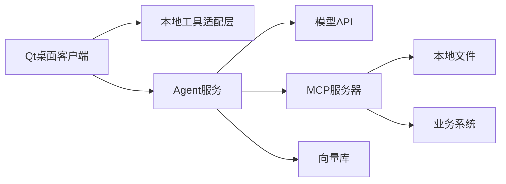
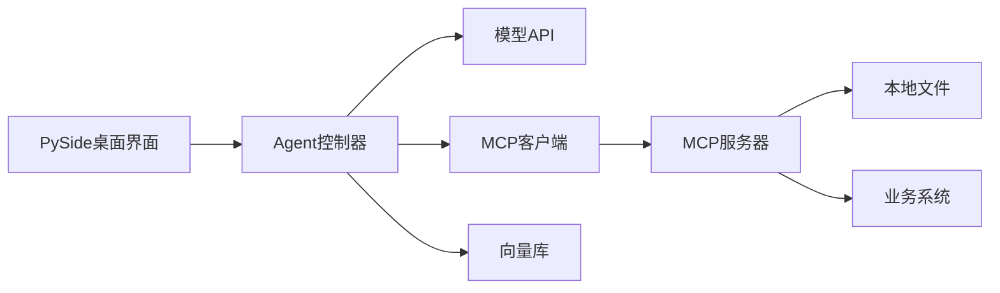

# Agent 开发语言选型分析

## 1. 问题定义

- 目标：判断 Agent(智能体) 可以用哪些语言开发，并给出推荐语言；重点评估 C++/Qt 是否适合作为主语言。
- 约束：面向 LLM(Large Language Model，大语言模型) Agent 学习与工程落地；需要考虑工具调用、MCP(Model Context Protocol，模型上下文协议)、RAG(Retrieval-Augmented Generation，检索增强生成)、桌面端、性能、生态成熟度。

## 2. 技术方案调研

### A. 工业主流方案

| 语言 | 典型生态 | 适合场景 |
| --- | --- | --- |
| Python | OpenAI Agents SDK、LangChain、LangGraph、FastMCP、数据科学生态 | 学习、原型、RAG、工具编排、数据分析、研究到工程过渡 |
| TypeScript/JavaScript | OpenAI Agents SDK、LangChain.js、Web 前端与 Node.js 服务 | Web 产品、SaaS、前后端一体、实时交互 |
| C#/.NET | Semantic Kernel、OpenAI 官方 .NET SDK、MCP C# SDK | 企业内部系统、Windows/.NET 技术栈 |
| Java | Semantic Kernel、Spring AI、企业后端 | 传统企业后端、微服务、强类型工程 |
| Go | OpenAI 官方 Go SDK、MCP Go SDK | 工具网关、MCP server、低资源服务、并发后端 |
| Rust | MCP Rust SDK | 高可靠系统组件、性能敏感工具 |
| C++/Qt | Qt Core、Qt Network、Qt WebSockets、Qt UI | 桌面客户端、本地工具、设备控制、性能敏感模块 |

来源摘要：

- OpenAI 官方库覆盖 JavaScript、Python、.NET、Java、Go；Agents SDK 用于 agents、tools、handoffs、guardrails、tracing、sandbox execution，并提供 TypeScript 与 Python SDK。
- LangChain 官方同时提供 Python 和 TypeScript 文档，LangGraph 侧重长运行、有状态 Agent 的编排能力。
- MCP 官方 SDK Tier 1 包括 TypeScript、Python、C#、Go；Java/Rust 为 Tier 2；未列 C++ 官方 SDK。
- Semantic Kernel 官方说明其面向 C#、Python、Java。
- Qt 官方提供 C++ 的 Core、Network、WebSockets 等模块，适合构建跨平台桌面与网络客户端。

## 3. 论文与研究侧观察

近年 Agent 研究主要围绕 planning(规划)、tool use(工具使用)、memory(记忆)、multi-agent(多智能体) 等能力展开，而不是围绕某一种编程语言展开。语言选择更多是工程生态问题。

参考论文：

- `Understanding the planning of LLM agents: A survey`：把 Agent 规划能力拆为任务分解、计划选择、外部模块、反思与记忆。
- `The Landscape of Emerging AI Agent Architectures for Reasoning, Planning, and Tool Calling: A Survey`：关注推理、规划和工具执行架构。
- `A Review of Prominent Paradigms for LLM-Based Agents: Tool Use (Including RAG), Planning, and Feedback Learning`：总结工具使用、RAG、规划和反馈学习。

结论：Agent 语言选型应优先看“工具生态、框架成熟度、调试评测、团队栈、部署场景”，而不是只看语言性能。

## 4. 对比分析

| 方案 | 性能 | 成本 | 复杂度 | 成熟度 | 可扩展性 | 风险 |
| --- | --- | --- | --- | --- | --- | --- |
| Python 作为 Agent 核心 | 中 | 低 | 低 | 高 | 高 | 运行性能一般，但足够多数 Agent 编排 |
| TypeScript 作为 Agent 核心 | 中 | 低 | 中 | 高 | 高 | 数据/AI 生态弱于 Python，但产品集成强 |
| C#/.NET 或 Java | 高 | 中 | 中 | 中高 | 高 | AI 生态不如 Python 快，但企业治理强 |
| Go 作为工具网关/MCP 服务 | 高 | 低 | 中 | 中高 | 高 | Agent 高层框架较少 |
| C++/Qt 作为主 Agent 核心 | 高 | 中 | 高 | 低到中 | 中 | Agent 框架、MCP、评测生态弱 |
| C++/Qt 作为桌面壳 + Python/服务端 Agent | 高 | 中 | 中 | 高 | 高 | 需要进程/服务边界设计 |

## 5. 架构建议

推荐按层选语言：



推荐组合：

- Agent 核心：Python。
- Web 产品：TypeScript。
- 桌面 UI：C++/Qt。
- 本地高性能工具：C++。
- MCP server：Python、TypeScript、Go、C# 优先。
- 企业后端：Java、C#、Go 按团队栈选择。

## 6. C++/Qt 评估

### 适合 C++/Qt 的情况

- 你要做 Windows/Linux/macOS 桌面客户端。
- 需要访问本地文件、串口、设备、传感器、CAD、工业软件。
- 需要高性能本地计算或低延迟 UI。
- 需要把 Agent 做成桌面助手、IDE 插件式工具、工业控制台。
- 团队已经有 Qt 代码资产。

### 不适合 C++/Qt 作为主语言的情况

- 你主要在学 Agent 概念、RAG、工具调用、多智能体、评测。
- 你想快速验证原型。
- 你需要大量使用 LangChain、LangGraph、FastMCP、向量库、数据处理库。
- 你希望直接使用官方 Agents SDK 和 MCP SDK 的成熟能力。

### C++/Qt 的最佳位置

C++/Qt 最适合做“客户端和本地工具层”，不适合作为第一阶段 Agent 编排主语言。

推荐：

```text
Qt 负责界面、本地交互、文件选择、设备控制
Python/TypeScript 负责 Agent 编排、RAG、工具调用、评测
二者通过 HTTP、WebSocket、STDIO 或 MCP 连接
```

## 7. PyQt/PySide 评估

如果把问题从 C++/Qt 换成 PyQt 或 PySide，结论会明显更积极。

### 为什么 PyQt/PySide 更适合 Agent

PyQt/PySide 仍然使用 Python，因此可以直接复用 Python Agent 生态：

- OpenAI Agents SDK。
- LangChain、LangGraph。
- FastMCP、MCP Python SDK。
- 向量库、RAG、数据处理、评测工具。
- 本地文件、数据库、HTTP、WebSocket 等 Python 生态。

同时，它又具备 Qt 的桌面 UI 能力：

- 跨平台桌面界面。
- 本地文件选择和拖拽。
- 系统托盘、菜单、快捷键。
- 多线程或异步任务配合界面更新。
- 对接本地工具和业务系统。

因此，PyQt/PySide 是“桌面 Agent”的好路线。

### PyQt 与 PySide 的差异

| 方案 | 特点 | 适合 |
| --- | --- | --- |
| PySide6 | Qt 官方 Python 绑定，属于 Qt for Python 项目 | 新项目、商业合规更敏感、希望贴近 Qt 官方生态 |
| PyQt6 | Riverbank Computing 维护，历史成熟、社区资料多 | 已有 PyQt 经验或历史项目 |

许可层面要特别注意：

- PySide6 官方说明 Qt for Python 使用 Community Edition(LGPLv3/GPLv3) 和 Commercial Edition。
- PyQt6 官方说明其采用 GPL v3 和 Riverbank Commercial License 双许可。

如果是闭源商业软件，优先评估 PySide6 的 LGPL 合规要求，或直接购买商业许可；如果选择 PyQt6，通常需要商业许可才能避免 GPL 约束。实际项目应让法务或许可证负责人确认。

### 推荐架构



### 适合 PyQt/PySide 的 Agent 项目

- 私人知识库桌面助理。
- 本地文档问答工具。
- 代码仓库分析助手。
- 企业内部客服或流程助手的桌面端。
- 带文件拖拽、系统托盘、后台任务的 Agent。
- 需要本地文件权限但又不想写 C++ 的工具。

### 主要风险

| 风险 | 说明 | 建议 |
| --- | --- | --- |
| UI 卡顿 | Agent 调模型和工具可能耗时长 | 使用 QThread、asyncio 或后台 worker |
| 打包复杂 | Python + Qt + 依赖较多 | 提前验证 PyInstaller、Nuitka 或 Briefcase |
| 许可问题 | PyQt/PySide 许可不同 | 商业项目优先做许可证审查 |
| 架构混乱 | UI 逻辑和 Agent 逻辑混在一起 | 分层：界面层、Agent 层、工具层、数据层 |
| 长任务体验 | RAG 和工具调用需要进度反馈 | 增加日志面板、进度条、取消按钮 |

### 最终建议

如果目标是做“桌面版 Agent”，推荐优先选择：

```text
PySide6 + Python Agent 生态
```

如果你已经熟悉 PyQt，或者已有 PyQt 项目，也可以继续用 PyQt；但新项目我更推荐 PySide6，因为它是 Qt 官方 Python 绑定，和 Qt 文档、Qt for Python 生态更一致。

## 8. 结论

推荐方案：Python 作为学习和 Agent 核心开发语言。

理由：

- Agent 生态最完整。
- RAG、向量库、数据处理、评测工具成熟。
- 官方和社区框架更新最快。
- 最适合从学习、原型走到第一版工程落地。

备选方案：

- TypeScript：如果目标是 Web 产品、SaaS、前后端一体。
- C#/.NET 或 Java：如果团队处在企业后端技术栈。
- Go：如果重点是工具网关、MCP server、高并发服务。

不推荐方案：

- 不建议第一阶段用 C++/Qt 写完整 Agent 核心。它能写，但生态成本高，很多能力要自己封装，学习效率和迭代速度会慢。

对 C++/Qt 的最终判断：

- 可以用，而且在桌面端、本地工具、设备控制方面很强。
- 但不建议作为 Agent 学习和核心编排的首选。
- 最佳实践是“C++/Qt 做客户端 + Python/TypeScript 做 Agent 服务”。

对 PyQt/PySide 的最终判断：

- 比 C++/Qt 更适合做 Agent，因为它保留了 Python 生态。
- 新桌面 Agent 项目优先推荐 PySide6。
- PyQt/PySide 的关键不是能不能做，而是要把 UI 线程、后台任务、打包和许可证处理好。

## 9. 参考来源

- OpenAI Libraries: https://developers.openai.com/api/docs/libraries
- LangChain Python Overview: https://docs.langchain.com/oss/python/langchain/overview
- LangChain TypeScript Overview: https://docs.langchain.com/oss/javascript/langchain/overview
- LangGraph Overview: https://docs.langchain.com/oss/python/langgraph/overview
- MCP SDKs: https://modelcontextprotocol.io/docs/sdk
- Microsoft Semantic Kernel Overview: https://learn.microsoft.com/en-us/semantic-kernel/overview/
- Qt for Python: https://www.qt.io/qt-for-python
- Qt for Python Documentation: https://doc.qt.io/qtforpython-6/
- Qt for Python Commercial Distribution: https://doc.qt.io/qtforpython-6.5/commercial/index.html
- PyQt official introduction: https://www.riverbankcomputing.com/software/pyqt
- Qt Core: https://doc.qt.io/qt-6/qtcore-index.html
- Qt Network: https://doc.qt.io/qt-6/qtnetwork-index.html
- Qt WebSockets: https://doc.qt.io/qt-6/qtwebsockets-index.html
- Understanding the planning of LLM agents: A survey: https://arxiv.org/abs/2402.02716
- The Landscape of Emerging AI Agent Architectures for Reasoning, Planning, and Tool Calling: A Survey: https://arxiv.org/abs/2404.11584
- A Review of Prominent Paradigms for LLM-Based Agents: Tool Use, Planning, and Feedback Learning: https://arxiv.org/abs/2406.05804
