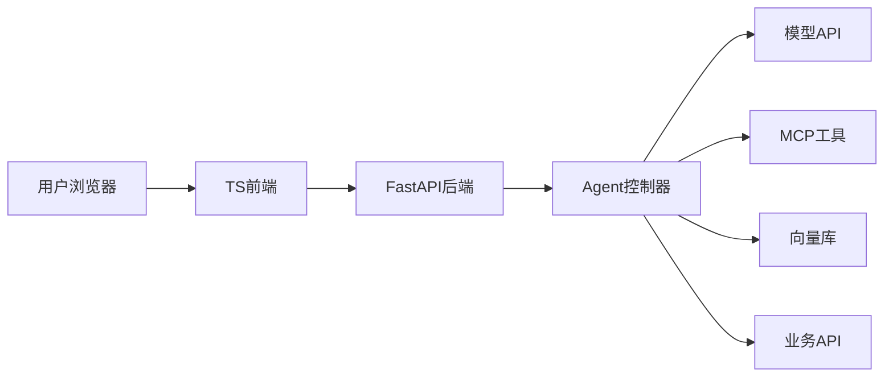

# TS 加 Python 一体化 Agent 应用架构分析

## 1. 问题定义

- 目标：用 TypeScript 做界面，用 Python 做 Agent(智能体) 后端，并做成“前后端为一个应用”的交付形态。
- 约束：需要支持 LLM(Large Language Model，大语言模型) 调用、工具调用、流式输出、RAG(Retrieval-Augmented Generation，检索增强生成)、MCP(Model Context Protocol，模型上下文协议) 扩展，以及后续桌面化或部署。

## 2. 推荐结论

优先推荐：

```text
Vite + React/Vue/Svelte + TypeScript
FastAPI + Python Agent 后端
生产环境由 FastAPI 托管前端 dist 静态文件
```

这样开发期前后端分离，生产期一个 Python 服务就是完整应用。

如果需要桌面安装包，再考虑：

```text
Electron 或 Tauri + TS 前端 + Python sidecar
```

## 3. 方案对比

| 方案 | 形态 | 优点 | 缺点 | 推荐度 |
| --- | --- | --- | --- | --- |
| FastAPI 托管 Vite 静态文件 | 一个 Web 服务 | 简单、清晰、易部署 | 需要浏览器访问 | 高 |
| Electron + Python sidecar | 桌面安装包 | 桌面能力强、生态成熟 | 体积大、进程管理复杂 | 中高 |
| Tauri + Python sidecar | 桌面安装包 | 体积小、安全边界好 | Rust/Tauri 配置成本更高 | 中 |
| Next.js + Python API | Web 全栈 | 前端能力强 | “一个应用”交付更复杂 | 中 |
| PySide6 + WebView + Python | 桌面应用 | Python 一体化 | TS 前端工程化不如 Web 栈自然 | 中 |

## 4. 推荐架构



开发期：

```text
frontend: Vite dev server，例如 5173
backend: FastAPI，例如 8000
frontend 通过代理访问 /api
```

生产期：

```text
先执行 vite build 生成 frontend/dist
FastAPI 挂载 dist
API 走 /api
前端路由 fallback 到 index.html
```

## 5. 推荐目录结构

```text
agent-app/
  frontend/
    package.json
    src/
      pages/
      components/
      api/
      stores/
    vite.config.ts
  backend/
    pyproject.toml
    app/
      main.py
      api/
        chat.py
        files.py
      agent/
        graph.py
        tools.py
        memory.py
      services/
        llm.py
        vector_store.py
      static/
  docs/
  scripts/
    build.ps1
```

## 6. 前后端通信方式

| 通信方式 | 用途 | 建议 |
| --- | --- | --- |
| REST API | 普通增删改查、配置、文件列表 | 默认使用 |
| SSE(Server-Sent Events，服务器发送事件) | 模型 token 流式输出、进度事件 | Agent 聊天推荐 |
| WebSocket | 双向实时通信、复杂协作 | 需要双向控制时使用 |
| OpenAPI | 类型契约 | 用 FastAPI 自动生成，再生成 TS client |

Agent 聊天建议：

- 用户发消息用 `POST /api/chat`.
- 流式返回用 `GET /api/chat/{run_id}/events` 或 WebSocket。
- 工具调用进度以事件形式推给前端。

## 7. 后端职责

Python 后端负责：

- Agent 编排。
- 模型调用。
- 工具调用。
- MCP client 或 MCP server。
- 文件解析。
- RAG 检索。
- 权限和审计。
- 流式输出。
- 评测与日志。

TypeScript 前端负责：

- 聊天界面。
- 工具调用过程展示。
- 文件上传。
- 知识库管理。
- 配置页面。
- 流式消息渲染。
- 错误提示和人工确认交互。

不要让前端直接调用模型 API。API key(接口密钥) 应留在后端。

## 8. 一体化交付方式

### Web 一体化

FastAPI 可以挂载静态文件。生产部署时，一个服务同时提供：

```text
/api/*        后端接口
/assets/*     前端静态资源
/*            前端页面
```

优点：

- 部署最简单。
- 没有跨域问题。
- 后续可用 Docker 打包。
- 很适合学习资料、内部工具、私有部署。

### 桌面一体化

如果需要桌面安装包：

```text
Electron/Tauri 负责窗口
TS 前端负责界面
Python backend 打包成 sidecar
启动应用时拉起 Python 本地服务
前端访问 http://127.0.0.1:随机端口/api
```

注意：

- 要管理 Python 进程生命周期。
- 要选择随机端口并防止冲突。
- 要处理退出时清理进程。
- 要限制只监听 127.0.0.1。
- 要处理打包路径和日志目录。

## 9. 最小实现路线

第一阶段：Web 一体化。

```text
Vite 前端 -> FastAPI API -> Python Agent
FastAPI 托管 build 后的前端
```

第二阶段：补流式体验。

```text
增加 SSE 或 WebSocket
前端显示 token、工具调用、进度、错误
```

第三阶段：补 Agent 工程能力。

```text
加入 LangGraph / OpenAI Agents SDK
加入 MCP 工具
加入向量库和文件解析
加入评测和审计日志
```

第四阶段：如确实需要桌面，再封装。

```text
Electron 或 Tauri + Python sidecar
```

## 10. 关键风险

| 风险 | 说明 | 建议 |
| --- | --- | --- |
| 前后端类型漂移 | TS 类型和 Python 模型不一致 | 用 OpenAPI 生成 TS client |
| 流式输出混乱 | token、工具事件、错误混在一起 | 统一事件协议 |
| 后端阻塞 | Agent 长任务阻塞请求 | 使用 async、后台任务或队列 |
| 密钥泄露 | 前端直接调用模型 | 所有密钥留在后端 |
| 打包复杂 | 桌面 sidecar 路径、端口、权限问题 | 先做 Web 一体化，再桌面化 |

## 11. 最终建议

如果你现在要开始做：

```text
React/Vue + TypeScript + Vite
FastAPI + Python
SSE 流式输出
FastAPI 托管 frontend/dist
```

这是学习成本、工程成熟度和交付复杂度之间最平衡的方案。

## 12. 参考来源

- FastAPI Static Files: https://fastapi.tiangolo.com/tutorial/static-files/
- Vite Building for Production: https://vite.dev/guide/build.html
- Electron Process Model: https://www.electronjs.org/docs/latest/tutorial/process-model
- Electron Preload Scripts: https://www.electronjs.org/docs/latest/tutorial/tutorial-preload
- Tauri Sidecar: https://tauri.app/develop/sidecar/
