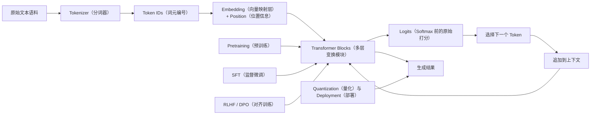
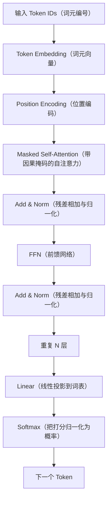
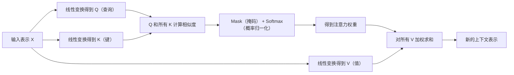
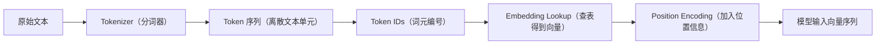
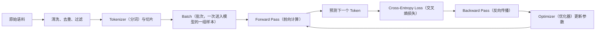
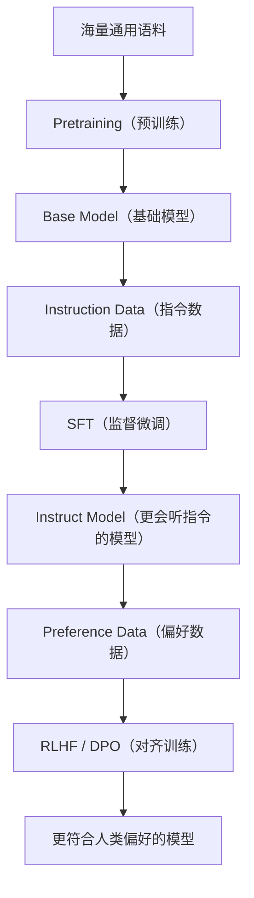
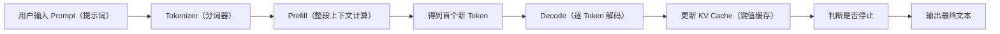
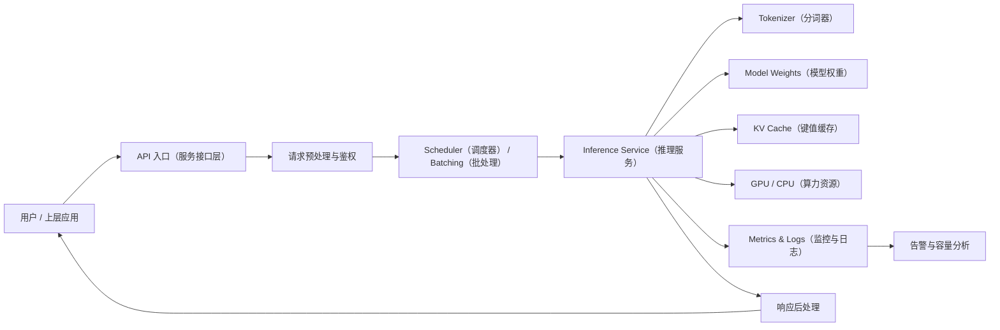

# LLM（Large Language Model，大语言模型）从 Transformer（以注意力机制为核心的序列建模架构）到训练、推理与部署

这是一份面向有编程基础读者的系统入门文档。它的目标不是让你背一堆流行词，而是让你把整条链路真正串起来：文本如何进入模型，模型如何学习，为什么会逐步生成语言，以及它如何被部署成稳定服务。

## 1. 什么是 LLM

大语言模型（LLM, Large Language Model）本质上是一类在海量文本上训练出来的条件概率模型。所谓“条件概率”，可以理解成：在给定前文条件的情况下，模型去估计下一个 Token（模型处理的最小离散文本单元）最有可能是什么。

它看起来像是在“回答问题”，但从底层机制看，它做的是：

1. 把文本变成离散编号和向量表示
2. 在大量样本中学习词法、句法、事实关联和表达模式
3. 在推理阶段根据当前上下文，不断输出下一个最可能的 Token

如果你把 LLM 想成一个函数，它接收的是“已有上下文”，输出的是“下一个 Token 的概率分布”。连续多次调用这个函数，就能生成一句话、一段解释、一个回答，甚至一篇文章。

### LLM 全景总览图

### LLM 和传统 NLP 模型有什么根本差别

自然语言处理（NLP, Natural Language Processing）并不是从 LLM 才开始的。更早的系统常常会为“情感分类”“命名实体识别”“机器翻译”等单个任务单独建模，甚至依赖大量手工特征和规则。LLM 的变化主要体现在三点：

- 它强调一个统一的大模型，而不是每个任务一个小模型
- 它先进行通用预训练，再通过少量任务数据适配具体场景
- 它学到的不是单一标签映射，而是一套广泛的语言生成能力

这也是为什么现在一个模型可以同时做问答、总结、改写、翻译、分类、抽取甚至代码补全。

### LLM 不是数据库，也不是搜索引擎

数据库擅长按结构化条件精确查找已有记录；搜索引擎擅长在海量文档里找到相关页面；LLM 更像一个“语言生成器”，它根据上下文分布拼出最合理的后续序列。

这带来两个直接结果：

- 优点是泛化能力强，同一个模型可以服务很多任务
- 风险是它可能生成“形式上流畅但事实上错误”的内容，也就是常说的幻觉（Hallucination，模型生成了看似合理但不真实的内容）

### 为什么它看起来像“会思考”

很多复杂回答并不是因为模型有一套显式规则引擎，而是因为训练语料中存在大量模式，模型通过参数（Parameters，模型中可学习的权重数值）把这些模式压缩进了统计结构中。当输入触发了某类模式时，模型能生成一条像推理链一样的文本。

这并不意味着模型拥有和人类完全相同的理解机制，但它确实能在概率空间中拟合出很强的语言行为。

### 你要先抓住的最短主线

不要一开始就试图同时理解所有细节。先记住下面这条最短主线：

1. 文本先被切成 Token
2. Token 被映射成向量
3. Transformer（以注意力机制为核心的序列建模架构）在多层中不断更新这些向量
4. 输出层把当前向量变成整个词表上的打分
5. 模型选出一个下一个 Token
6. 这个 Token 再被塞回上下文，进入下一轮生成

后面所有术语，基本都能挂回这六步里。

### 你现在应该能回答的问题

- LLM 的核心计算目标到底是什么
- 为什么说它本质上是条件概率模型
- 为什么它既强大又会出现幻觉

## 2. 为什么今天主流是 Transformer

要理解 Transformer 为什么成为主流，先要知道它解决了什么旧问题。

### Transformer 出现前，主流序列模型有什么局限

更早的文本模型常使用：

- RNN（Recurrent Neural Network，循环神经网络）
- LSTM（Long Short-Term Memory，长短期记忆网络）
- GRU（Gated Recurrent Unit，门控循环单元）

它们都按时间步逐个处理序列。这样的好处是结构直观，但缺点也明显：

- 很难高效并行，长序列训练速度慢
- 长距离依赖容易变弱，越远的信息越难保住
- 序列越长，训练越不稳定

Transformer 的关键变化，是引入了 Attention（注意力机制，让模型决定当前该关注哪些位置）并把它放到结构中心。

### Attention 到底解决了什么问题

如果一句话很长，模型不应该只机械记住“上一个词”，而应该动态判断“和当前词最相关的是前面哪些位置”。Attention 做的就是这件事：让当前位置能直接访问整段上下文，并按相关性决定借多少信息。

这意味着：

- 信息不必一级一级往后传，可以跨很多位置直接建立联系
- 计算能更好地并行化，特别适合图形处理器（GPU, Graphics Processing Unit）
- 模型更容易学习长文本中的远距离依赖

### Transformer 的核心模块

一个典型 Transformer 块里，最重要的是以下组件：

- Self-Attention（自注意力，让序列内的位置彼此建立关联）
- Multi-Head Attention（多头注意力，在多个子空间并行学习不同关系）
- FFN（Feed-Forward Network，前馈网络，对每个位置单独做非线性变换）
- Residual Connection（残差连接，把输入直接加回输出，帮助深层训练稳定）
- LayerNorm（Layer Normalization，层归一化，用于稳定数值分布）

你可以把一个 Transformer 块想成两步：

1. 先决定“我应该看谁”
2. 再决定“看完以后我该怎么重新表达自己”

### 为什么 Decoder-only 成了主流 LLM 结构

Transformer 有多种形态：

- Encoder（编码器，把输入序列编码成上下文表示）
- Decoder（解码器，依据已有上下文逐步生成输出）
- Encoder-Decoder（同时有编码器和解码器的结构，常见于传统翻译模型）

当前很多生成式 LLM 采用的是 Decoder-only（只有解码器堆叠的自回归结构），主要因为它和“预测下一个 Token”这个训练目标天然一致：

- 训练时就是从左到右预测后续 Token
- 推理时也是从左到右生成输出
- 结构统一，便于大规模扩展

### Decoder-only 结构图

### Self-Attention 到底在算什么

Self-Attention 会为每个位置生成三类向量：

- Query（查询向量，表示“我现在想找什么信息”）
- Key（键向量，表示“我这里能提供什么信息”）
- Value（值向量，表示“如果你关注我，你真正拿走什么内容”）

它的工作步骤可以口语化理解成：

1. 当前 Token 先提出一个查询问题，也就是 Query
2. 它拿自己的 Query 去和所有位置的 Key 做相似度计算
3. 相似度经过 Softmax（把一组打分归一化为概率分布的函数）后，变成注意力权重
4. 这些权重去加权所有位置的 Value
5. 最终得到一个“结合了上下文后”的新表示

这就是为什么 Attention 不是简单“记忆前文”，而是“按相关性重组前文信息”。

### Self-Attention 数据流图

### 为什么要多头注意力

单一注意力头只能在一种表示子空间里判断相关性。多头注意力相当于让模型同时从多个角度看上下文，例如：

- 一个头可能更关注主谓关系
- 一个头可能更关注长距离引用
- 一个头可能更关注格式模式或标点边界

它不是人为指定的，而是训练出来的分工。

### 因果掩码为什么重要

自回归（Autoregressive，依据已知前缀逐步预测后续内容）模型不能在第 t 个位置偷看第 t+1 个位置以后的真实答案，因此 Decoder-only 结构里会加入因果掩码（Causal Mask，用来遮住未来位置的掩码）。没有它，训练目标就被破坏了。

### RNN 和 Transformer 的直观对比

| 维度 | RNN / LSTM / GRU | Transformer |
| --- | --- | --- |
| 信息传递方式 | 主要靠时间步递推 | 主要靠全局注意力 |
| 并行能力 | 弱 | 强 |
| 长距离依赖 | 容易衰减 | 更容易直接建模 |
| 训练效率 | 长序列较慢 | 更适合现代硬件 |
| 当前 LLM 适配度 | 低 | 高 |

### 你现在应该能回答的问题

- Transformer 相比 RNN 的优势到底是什么
- Self-Attention 中 Query、Key、Value 分别在扮演什么角色
- 为什么 Decoder-only 结构和 LLM 的训练目标天然匹配

## 3. 文本如何变成 Token 和 Embedding

模型不能直接处理字符串。对机器来说，原始文本首先要被切成离散单元，再被转成数字，最后再映射成向量。

这个过程通常分三层：

1. Tokenizer（分词器）把原始文本切成 Token
2. 每个 Token 被映射成 Token ID（词元编号）
3. Token ID 再经过 Embedding（嵌入层）变成连续向量

### 为什么不能直接按“字”或者“词”来处理

如果按字符切分：

- 序列会很长
- 语义单位过碎
- 模型需要看更多步才能理解一个完整词义

如果按完整词切分：

- 词表（Vocabulary，模型允许的全部 Token 集合）会非常大
- 生僻词、新词、拼写变体都会变成未登录问题
- 多语言时词表膨胀更严重

所以现代 LLM 通常采用“子词”方案，在字符和整词之间找平衡。

### 三种常见分词思路

- BPE（Byte Pair Encoding，字节对编码）：不断合并高频片段，形成常见子词
- WordPiece（词片分解算法）：根据统计收益选择更合适的子词切分
- SentencePiece（直接在原始文本上学习子词的分词方案）：不强依赖人工预分词

它们都不是在模仿人类语文课上的“标准分词”，而是在优化两个目标：

- 让模型更容易学习统计规律
- 让序列长度和词表大小保持一个可接受的平衡

### 一个直观例子

假设有一个英文单词在训练语料里并不常见，分词器未必会把它当成一个完整 Token。它可能被拆成两个或多个更常见的子词片段。这样做的好处是：即使模型没见过完整词，也可能见过这些片段，从而降低“完全陌生”的概率。

中文也一样。虽然很多汉字经常能对应一个 Token，但并不是永远一字一 Token。标点、空格、数字组合、英文片段、常见短语，都可能以不同方式被切分。

### Token 不等于字数，也不等于词数

这点必须非常明确。你以后看到的很多指标都和 Token 绑定，而不是和字数绑定。例如：

- 上下文窗口（Context Window，一次能处理的 Token 上限）
- 推理成本
- 计费方式
- 生成速度

一句话看起来不长，Token 数也可能并不低；另一句话字数不少，Token 数却可能更少。

### 文本到 Token 到 Embedding 的流程图

### Embedding 到底是什么

Embedding 不是“词典解释”，而是向量表示。你可以把它理解成一个大型查表层：每个 Token ID 对应一行可训练向量。训练时，模型会不断调整这些向量，使得在类似上下文中出现的 Token，逐步形成某种空间结构关系。

例如：

- 语义相近的词，向量可能更接近
- 用法相似的标记，可能在某些方向上更接近
- 同类格式元素，也可能形成某种结构聚类

但要注意，Embedding 本身并不等于“概念理解”。它只是后续多层变换的起点。

### Position Encoding 为什么必需

如果只有 Token Embedding，没有位置信息，那么“我爱你”和“你爱我”在某些操作下可能会过于相似。Transformer 本身不靠时间步递推顺序，因此必须显式注入顺序信息，这就是位置编码（Position Encoding，告诉模型每个 Token 在序列中的位置）。

### 特殊 Token 有什么用

很多模型会保留一些特殊标记，例如：

- BOS（Beginning of Sequence，序列开始标记）
- EOS（End of Sequence，序列结束标记）
- PAD（Padding，占位补齐标记）
- SEP（Separator，分隔标记）

它们不是自然语言词汇，而是帮助模型理解“序列从哪开始、到哪结束、哪里只是补位”的控制符号。

### 上下文窗口为什么会成为关键约束

上下文窗口决定模型一次最多能看多少 Token。这个限制既来自结构设计，也来自算力和显存。窗口变长的收益是模型能看到更长历史，但代价通常也会增加：

- 注意力计算更重
- 显存占用更高
- 推理速度更慢

所以“窗口越长越好”并不是绝对成立，关键要看任务是否真的需要长上下文。

### 你现在应该能回答的问题

- 为什么现代 LLM 倾向使用子词而不是纯字符或整词
- Token、Token ID、Embedding、位置编码之间是什么关系
- 为什么上下文窗口会同时影响能力边界和计算成本

## 4. 训练：从语料到参数

现在进入真正的学习过程。训练不是给模型“灌知识”，而是反复调整参数，让它在面对上下文时更擅长预测正确的下一个 Token。

### 训练主线先看大图

### 第一步：准备语料

训练从数据开始。语料并不是越多越好，而是要兼顾覆盖度、质量和分布。常见处理包括：

- 去重，减少大段重复内容
- 清洗噪声，例如乱码、模板页、低质量拼接文本
- 过滤不合规或无价值样本
- 平衡不同来源和任务类型

如果这一步做得差，模型学到的就是低质量统计规律。

### 第二步：切片成训练样本

长文档不会直接整篇塞进去，而是通常要切成适合训练的片段。这里会涉及三个很常见的训练概念：

- Batch（批次，一次并行送入模型的一组样本）
- Step（一步训练，一次前向加反向并完成一次参数更新）
- Epoch（轮次，完整遍历一遍训练数据）

大型 LLM 训练里，很多时候更常关心总 Step 数和总 Token 数，而不是只盯着 Epoch。

### 第三步：前向计算得到预测分布

一段 Token 序列进入模型后，模型会对每个位置输出一组 Logits（Softmax 前的原始打分）。这些打分对应词表中的所有候选 Token。经过 Softmax 后，就会变成概率分布。

如果真实下一个 Token 是某个编号，而模型给它的概率很低，说明预测不好，损失就会变大。

### 第四步：用损失函数告诉模型“哪里错了”

最常见的目标是交叉熵损失（Cross-Entropy Loss，用于衡量预测分布与真实标签差距）。你可以把它理解成：

- 模型越把正确答案排在前面，损失越小
- 模型越把错误答案排在前面，损失越大

训练不是在问“这句话对不对”，而是在问“正确下一个 Token 的概率够不够高”。

### 第五步：反向传播和梯度更新

有了损失之后，模型会通过反向传播（Backpropagation，把误差信号从输出层一路传回前面各层）计算梯度（Gradient，表示参数朝哪个方向微调能降低损失）。

然后优化器（Optimizer，根据梯度真正更新参数的算法）会接手更新工作。常见的选择之一是 AdamW（带权重衰减的自适应优化器）。它会综合当前梯度和历史梯度信息，决定每个参数该调多少。

### 预训练到底在学什么

预训练（Pretraining，在海量通用语料上先学语言规律）最经典的目标就是 Next Token Prediction（下一个 Token 预测）。它看似简单，但因为数据量极大、覆盖极广，模型会被迫学习：

- 基本语法和常见表达结构
- 常识和知识之间的统计关联
- 文档结构、风格和上下文延续模式
- 一些可由语言模式间接支撑的推理习惯

所以预训练得到的不是“某个专用任务模型”，而是一个基础模型（Base Model，具备广泛语言建模能力但不一定擅长按指令回答）。

### 为什么训练成本会非常高

训练成本不只是“参数多”这么简单，至少同时受这些因素影响：

- 数据量大
- 参数量大
- 序列长，注意力计算贵
- 需要很多 Step 才能收敛
- 通常还要用多机多卡并行

这里的“卡”一般指 GPU。大模型训练本质上是算法、系统、硬件三者共同参与的工程问题。

### 训练阶段不是只有一种

很多人一提训练，就以为只有一种“从头训练”。实际上主流 LLM 往往经历多个阶段。

#### 预训练、SFT、对齐训练关系图

#### SFT 在补什么能力

监督微调（SFT, Supervised Fine-Tuning）使用的是更高质量、更贴近任务形式的数据。它要解决的不是“让模型第一次学会语言”，而是“让模型更会以用户想要的方式回答”。

例如，SFT 会强化这些能力：

- 遵循用户指令
- 输出更稳定的格式
- 减少无意义续写
- 更贴近问答、摘要、改写等实际任务形态

可以把它理解成：把“会续写文本”往“会完成任务”方向拉近。

#### RLHF 和 DPO 在补什么能力

对齐训练（Alignment Training，让模型输出更符合人类偏好）常见路线包括：

- RLHF（Reinforcement Learning from Human Feedback，基于人类反馈的强化学习）
- DPO（Direct Preference Optimization，直接偏好优化）

它们的共同目标不是再教模型语言规律，而是让模型在多个“都说得通”的答案里，更偏向人类更喜欢、更安全、更有帮助的输出。

一个直观理解是：

- 预训练解决“会不会说”
- SFT 解决“会不会按要求说”
- 对齐训练解决“说出来的风格和取舍是不是更符合人类期待”

### 训练阶段对比表

| 阶段 | 目标 | 数据特点 | 结果 |
| --- | --- | --- | --- |
| 预训练 | 学语言和世界统计规律 | 海量通用文本 | 基础模型 |
| SFT | 学会按指令完成任务 | 高质量标注问答或任务数据 | 指令模型 |
| 对齐训练 | 让输出更符合偏好与安全要求 | 偏好对、反馈数据 | 更可用的对话模型 |

### 评测为什么是训练闭环的一部分

模型训练不能只看损失下降。损失下降不等于实际能力一定提升，更不等于安全性没出问题。评测（Evaluation，对模型能力和行为做系统测试）至少会关注：

- 知识问答是否提升
- 指令遵循是否稳定
- 数学、代码、逻辑等专项是否退化
- 拒答、安全、偏见等行为是否异常

常见指标里还会出现困惑度（Perplexity，衡量模型预测不确定性的指标），但它并不能代表全部实际能力。

### 你现在应该能回答的问题

- 训练时参数是如何一步步被更新的
- 预训练、SFT、对齐训练分别在补什么能力
- 为什么“训练很贵”是数据、模型、序列、硬件共同作用的结果

## 5. 推理：模型如何一步步生成文本

训练完成之后，模型进入推理（Inference，使用已经训练好的参数来生成结果）阶段。推理不会再更新参数，它只做前向计算。

### 推理为什么一定是逐步生成

大多数主流 LLM 是自回归模型。所谓自回归，就是当前输出依赖于之前已经看到或已经生成的 Token。因此模型不是一次性“写完整篇答案”，而是：

1. 看当前上下文
2. 预测下一个 Token
3. 把这个 Token 接回上下文
4. 再预测下一个

循环往复，直到满足停止条件。

### 推理的两段式过程

- Prefill（首轮全上下文计算）：先把整段输入提示词（Prompt，给模型的输入上下文）完整跑一遍，建立当前上下文状态
- Decode（逐 Token 解码）：之后每一轮只新增一个 Token，并继续生成下去

### Prefill / Decode 流程图

### Prefill 和 Decode 的成本为什么不一样

Prefill 的特点是输入长、并行度高。它往往受“上下文长度”影响很大。

Decode 的特点是每轮只生成一个新 Token，但要重复很多轮。它往往受“单步延迟”和“缓存管理”影响更大。

所以一个请求感觉“慢”，可能慢在两种完全不同的地方：

- 输入太长，Prefill 太重
- 输出太长，Decode 轮次太多

### 模型选下一个 Token 时到底经历了什么

当模型做完一次前向计算后，会得到一组 Logits。然后通常会经历这些步骤：

1. 把 Logits 变成概率分布
2. 根据解码策略挑一个候选 Token
3. 判断是否命中 EOS（序列结束标记）或达到最大长度
4. 如果没有停止，就进入下一轮

也就是说，“模型输出”并不是单纯把最大值吐出来，而是要经过一套解码策略。

### 常见解码策略

- Greedy Decoding（贪心解码）：每次都选当前概率最高的 Token，稳定但容易单调
- Sampling（采样）：按概率随机抽取，更灵活但不稳定性更高
- Top-k：只在前 k 个概率最高的候选里采样
- Top-p（也叫 Nucleus Sampling，核采样）：只在累计概率达到阈值 p 的候选集合里采样
- Temperature（温度参数）：通过拉平或拉尖分布，调节输出的保守程度

### 解码策略对输出的影响

| 策略 | 特点 | 常见问题 |
| --- | --- | --- |
| Greedy | 稳定、确定性强 | 容易重复、缺少变化 |
| Top-k | 控制候选范围 | k 太小会保守，太大会发散 |
| Top-p | 动态候选范围 | 参数不合适时仍可能不稳定 |
| Temperature | 控制探索度 | 太低呆板，太高飘忽 |

需要特别记住：解码策略改变的是“从分布里怎么选”，不是重新训练模型本身。

### KV Cache 为什么这么重要

KV Cache（Key-Value Cache，缓存历史 Token 在各层注意力中的 Key 和 Value）是推理系统里极其关键的优化。

如果没有 KV Cache，那么每生成一个新 Token，模型都要重新计算整个历史上下文的注意力表示，代价非常高。用了 KV Cache 之后：

- 历史部分不必重复计算
- 新 Token 只需要和历史缓存交互
- Decode 阶段的速度能显著提升

但 KV Cache 也不是没有成本，它会额外占用显存或内存。上下文越长、并发越高，缓存占用越可观。

### 什么是首 Token 延迟和吞吐

两个非常常见的推理指标是：

- TTFT（Time To First Token，首 Token 延迟）：用户发请求到收到第一个生成 Token 的时间
- Throughput（吞吐，单位时间能生成多少 Token 或处理多少请求）

二者经常会互相牵制：

- 为了提高吞吐，系统可能会做更积极的批处理
- 为了保证 TTFT，系统可能要减少等待和排队

### 批处理为什么是双刃剑

批处理（Batching，把多个请求打包一起算）通常能提高设备利用率，但也会带来新的取舍：

- 吞吐可能变高
- 单请求等待时间可能变长
- 输入长度差异大时，调度会更复杂

所以推理系统设计从来不是“只追一个指标”，而是不同指标之间的平衡。

### 幻觉通常从哪里来

幻觉并不是一个单一故障点，而是一类综合现象。常见原因包括：

- 训练语料本身有噪声或冲突
- 模型只是在做概率生成，不具备天然事实校验机制
- 输入提示词信息不足、含糊或误导
- 解码策略把低置信度候选采样了出来

因此很多实际系统会叠加：

- 检索增强生成（RAG, Retrieval-Augmented Generation，用外部检索结果补足事实依据）
- 工具调用（Tool Use，让模型调用外部工具获取真实结果）
- 规则约束和后验校验

### 你现在应该能回答的问题

- 为什么推理必须逐 Token 生成，而不是一次性整段输出
- Prefill 和 Decode 分别主要受哪些因素影响
- KV Cache 为什么提速明显，同时又会带来额外资源占用

## 6. 部署：从模型文件到服务系统

把模型“跑起来”和把模型“稳定提供服务”是两件不同的事。部署（Deployment，把模型和运行环境组织成可交付系统）关注的是资源、延迟、吞吐、并发、监控和可维护性。

### 一个部署系统通常由哪些部分组成

一个最小但完整的推理服务，通常至少包括：

- 模型权重文件
- Tokenizer 文件
- 推理引擎（Inference Engine，负责执行前向计算和调度的运行时系统）
- 服务接口，例如 API（Application Programming Interface，应用程序接口）
- 日志、监控和告警

如果请求量更大，还会引入：

- 队列
- 调度器
- 批处理器
- 多机扩容
- 缓存和鉴权体系

### 单机推理链路是什么样的

1. 加载模型权重和 Tokenizer
2. 初始化推理引擎
3. 接收用户请求并做输入预处理
4. 执行 Prefill 和 Decode
5. 把输出 Token 还原成文本
6. 返回结果并记录指标

### 服务化部署拓扑图

### 模型大小不只看“多少 B 参数”

很多人第一次接触部署时，最关心的是“7B、13B、70B 到底多大”。这里的 B 指十亿（Billion）级参数量，但仅知道参数量还不够。你至少还要看：

- 权重使用什么精度存储
- 运行时是否要保留 KV Cache
- 最大上下文长度有多大
- 并发请求有多少

也就是说，推理时占资源的不只是权重本身，还有缓存、中间激活和调度带来的额外占用。

### 常见精度格式代表什么

- FP16（16 位半精度浮点）
- BF16（16 位脑浮点，适合深度学习数值范围）
- INT8（8 位整数精度）
- INT4（4 位整数精度）

一般来说，位宽越低：

- 占用越省
- 速度可能越快
- 精度损失风险越高

### 为什么量化通常先在部署环节出现

量化（Quantization，把高精度权重压缩成更低精度表示）最直接的目的，是降低部署成本。常见收益包括：

- 降低显存或内存占用
- 提高单位设备上的并发和吞吐
- 让更大模型能在更便宜的设备上运行

它的代价通常包括：

- 可能有精度下降
- 不同硬件对不同量化格式支持不一样
- 某些模型层对低精度更敏感

所以量化不是“免费午餐”，而是在成本和质量之间找平衡。

### 部署时最容易忽略的资源：KV Cache

很多初学者会把全部注意力放在模型权重大小上，却忽略上下文很长或并发很高时，KV Cache 也会成为显存大头。一个模型能不能在目标机器上稳定跑起来，不只是“权重塞不塞得下”，还要看缓存塞不塞得下。

### 推理引擎在做什么

推理引擎不只是“调用模型前向函数”。它还常常负责：

- 内存管理
- KV Cache 管理
- 批处理合并
- 请求调度
- 张量并行或流水并行等执行策略

同一个模型，换不同推理引擎，实际吞吐和延迟可能会差很多。

### 监控到底该看哪些指标

如果模型已经对外提供服务，至少要看这些指标：

- 请求成功率和错误码分布
- TTFT 和总响应时间
- 每秒生成 Token 数
- GPU 利用率和显存占用
- 请求队列长度
- 输入长度、输出长度和延迟之间的关系

如果只看“接口有没有返回 200”，那只能说明服务没彻底挂掉，不能说明它跑得健康。

### 部署时常见的几类权衡

| 目标 | 往往要付出的代价 |
| --- | --- |
| 更低延迟 | 设备利用率可能下降 |
| 更高吞吐 | 单请求等待可能上升 |
| 更长上下文 | 显存和计算开销更高 |
| 更小成本 | 可能需要量化，精度风险增加 |
| 更高稳定性 | 系统复杂度和监控要求上升 |

### 单机、本地服务、集群服务的差别

| 形态 | 适合场景 | 优点 | 主要挑战 |
| --- | --- | --- | --- |
| 单机离线运行 | 学习、实验 | 简单直接 | 资源有限 |
| 单机服务化 | 小规模内网服务 | 部署成本低 | 并发能力有限 |
| 多机集群 | 大规模对外服务 | 可扩展性更强 | 调度、监控、成本都更复杂 |

### 你现在应该能回答的问题

- 模型部署时真正的资源瓶颈通常包括哪些部分
- 为什么量化对部署非常重要，但不是没有代价
- 为什么一个可用服务必须同时关注延迟、吞吐、显存、队列和错误率

## 7. 常见误区

### 误区 1：参数越大，任何任务都一定更强

参数量很重要，但它不是唯一变量。数据质量、训练阶段设计、推理配置、任务类型都会影响最终表现。一个训练和对齐做得更好的中等模型，可能在某些任务上优于更大的基础模型。

### 误区 2：Token 就是一个字或者一个词

Token 是分词器定义的离散单元。它既不严格等于字，也不严格等于词。把 Token 当成“字数”来理解，会直接误判上下文长度、成本和速度。

### 误区 3：训练和推理只是“一个慢一个快”

训练会更新参数，推理不会。训练强调梯度、优化器、稳定收敛；推理强调延迟、吞吐、缓存和调度。它们关注的问题不是一个维度。

### 误区 4：模型有知识，所以回答就一定可信

模型输出的是高概率语言序列，不是经过外部验证的真值。一个回答越流畅，不代表越可靠。很多时候越流畅的错误反而越有迷惑性。

### 误区 5：部署就是把模型文件下载下来运行

真正可用的部署还包括：

- 输入输出处理
- 请求调度
- 缓存管理
- 错误处理
- 监控告警
- 容量规划

少了这些，顶多算“能跑”，远谈不上“可用”。

### 误区 6：会调 Temperature 就等于会做推理优化

Temperature 只是在调输出分布的保守或发散程度。真正的推理优化通常涉及 KV Cache、批处理、量化、调度策略、上下文裁剪等系统层问题。

### 你现在应该能回答的问题

- 为什么不能只盯着参数规模
- 为什么训练、推理、部署是三套不同问题
- 为什么“回答流畅”不等于“回答真实”

## 8. 下一步学习建议

读完这份文档后，下一步不要无序扩展，而要根据自己的目标选择深入方向。

### 如果你更想补模型原理

建议继续深入这些主题：

- RoPE（Rotary Position Embedding，旋转位置编码）等位置编码方法
- 长上下文优化
- MoE（Mixture of Experts，专家混合结构）
- Multi-Query Attention（多查询注意力，共享 Key 和 Value 以降低缓存成本）

这条线适合想进一步看懂模型结构演化的人。

### 如果你更想补训练方法

建议继续深入：

- 数据去重和质量控制
- 指令数据构造
- 偏好数据构造
- 分布式训练和并行策略
- 评测体系设计

这条线适合想从“会解释”走向“会设计训练流程”的人。

### 如果你更想补推理与部署

建议继续深入：

- 推理引擎实现思路
- 量化方法差异
- 连续批处理和请求调度
- RAG 系统设计
- 工具调用与 Agent 系统

这条线适合更偏工程落地的人。

### 给你的一个实用学习顺序

如果你现在还是初学者，建议按这个顺序继续：

1. 先把主文档再读一遍，确保主线能复述
2. 再选一个点深入，例如 Token 化、Attention 或推理解码
3. 然后补训练阶段差异：预训练、SFT、RLHF、DPO
4. 最后再看部署与系统优化，不要一开始就被框架和命令淹没

### 最后把整条主线再记一遍

原始文本先经过 Tokenizer 被切成 Token，再映射成 Embedding；Transformer 在多层中根据上下文不断更新表示；训练阶段通过“预测下一个 Token”让参数逐步学会语言规律；推理阶段按自回归方式逐步生成；部署阶段再围绕显存、延迟、吞吐和稳定性做工程优化。

只要这条主线不丢，你以后接触到任何新术语，都能知道它属于哪一层问题。

## 9. 术语速查

下面这份速查表不是为了死记硬背，而是为了让你阅读资料时能迅速定位术语所属层次。

| 术语 | 一句话解释 |
| --- | --- |
| LLM | 大语言模型，本质上是根据上下文预测下一个 Token 的模型 |
| Token | 模型处理的最小离散文本单元，不等于字数或词数 |
| Tokenizer | 把原始文本切成 Token 的组件 |
| Token ID | 每个 Token 在词表中的编号 |
| Vocabulary | 模型允许的全部 Token 集合 |
| Embedding | 把离散 Token ID 映射为连续向量 |
| Position Encoding | 给模型注入顺序信息的机制 |
| Transformer | 以注意力机制为核心的序列建模架构 |
| Self-Attention | 让序列中每个位置按相关性关注其他位置 |
| Query / Key / Value | 注意力中用于“查询、匹配、取值”的三类向量 |
| FFN | 对每个位置单独做非线性变换的前馈网络 |
| Residual Connection | 把输入直接加回输出，帮助稳定训练 |
| LayerNorm | 对层内表示做归一化，稳定数值分布 |
| Decoder-only | 只堆叠解码器并按自回归方式生成的结构 |
| Pretraining | 用海量通用语料学习语言规律 |
| SFT | 用高质量标注数据让模型更会按指令完成任务 |
| RLHF | 用人类反馈训练奖励偏好，再优化输出行为 |
| DPO | 直接利用偏好对优化模型输出的对齐方法 |
| Inference | 使用已训练好的模型参数生成输出 |
| Prompt | 提供给模型的输入上下文 |
| Prefill | 首次处理整段输入上下文的阶段 |
| Decode | 之后逐 Token 生成的阶段 |
| Logits | Softmax 之前的原始打分 |
| Temperature | 控制输出分布保守或发散程度的参数 |
| Top-k | 只在前 k 个候选中采样 |
| Top-p | 只在累计概率达到阈值的候选集合中采样 |
| KV Cache | 缓存历史注意力键值，加速后续生成 |
| Quantization | 用更低精度表示模型权重，以节省资源 |
| TTFT | 用户拿到首个生成 Token 的等待时间 |
| Throughput | 单位时间能处理多少 Token 或请求 |
| RAG | 先检索外部信息，再辅助模型生成的系统方案 |
| Agent | 能进行多步规划、调用工具并执行任务的模型系统 |
